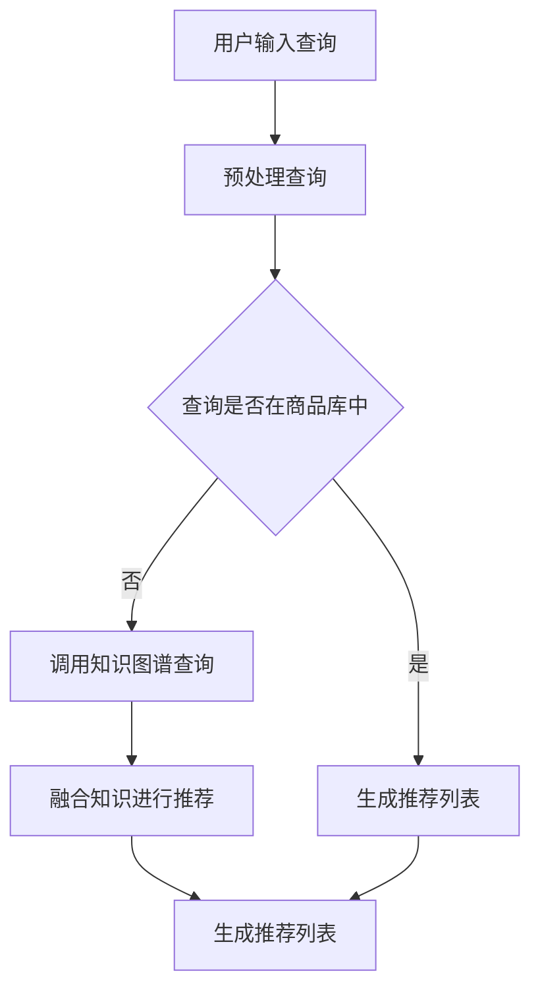

                 

关键词：电商搜索推荐、AI大模型、知识图谱、推荐算法、性能评测

> 摘要：本文从AI大模型的视角，探讨电商搜索推荐系统中知识推荐算法的创新与应用。通过分析算法原理、数学模型、项目实践及实际应用场景，对知识推荐算法的性能进行评测，并展望其未来发展。

## 1. 背景介绍

随着互联网技术的发展和消费者需求的不断升级，电商行业已经成为全球最大的零售市场之一。为了满足消费者个性化的购物需求，提高用户体验，电商搜索推荐系统应运而生。传统的基于内容的推荐算法和协同过滤推荐算法在一定程度上提高了推荐效果，但在面对海量数据和复杂用户行为时，推荐效果仍有待提升。

近年来，随着AI技术的飞速发展，尤其是AI大模型的出现，为电商搜索推荐系统带来了新的契机。AI大模型具有强大的学习能力、泛化能力和知识表示能力，可以在大规模数据集上实现高效准确的推荐。知识推荐算法作为AI大模型在电商搜索推荐领域的一种创新应用，通过融合用户知识、商品知识等多元化信息，实现更加精准的推荐。

本文将从AI大模型的视角，深入探讨知识推荐算法在电商搜索推荐系统中的应用，分析其算法原理、数学模型，并通过项目实践和性能评测，评估其效果和优势。

## 2. 核心概念与联系

### 2.1 AI大模型

AI大模型是指基于深度学习技术，通过大规模数据训练得到的高性能人工智能模型。它们通常具有数十亿甚至千亿级的参数规模，能够处理复杂的任务，如图像识别、自然语言处理、语音识别等。在电商搜索推荐领域，AI大模型通过学习用户和商品特征，实现个性化推荐。

### 2.2 知识推荐算法

知识推荐算法是一种基于知识的推荐算法，通过融合用户知识、商品知识等多元化信息，实现更加精准的推荐。知识推荐算法的核心在于知识的表示和推理，如图知识表示和图神经网络等。

### 2.3 电商搜索推荐系统

电商搜索推荐系统是电商网站的核心系统之一，通过用户行为数据、商品信息等，为用户提供个性化的商品推荐。电商搜索推荐系统通常包括推荐算法模块、数据存储模块、用户行为分析模块等。

### 2.4 Mermaid流程图

下面是知识推荐算法在电商搜索推荐系统中的应用流程：



## 3. 核心算法原理 & 具体操作步骤

### 3.1 算法原理概述

知识推荐算法基于AI大模型，通过学习用户和商品特征，构建用户和商品的知识图谱，并在图上进行推理和生成推荐。具体原理如下：

1. **用户特征和商品特征提取**：通过用户行为数据、商品属性数据等，提取用户特征和商品特征。
2. **知识图谱构建**：将用户特征和商品特征嵌入到知识图谱中，形成用户和商品的表示。
3. **图神经网络推理**：利用图神经网络对知识图谱进行推理，生成用户和商品的关联关系。
4. **生成推荐列表**：根据用户查询和知识图谱的推理结果，生成个性化的推荐列表。

### 3.2 算法步骤详解

1. **数据预处理**：对用户行为数据和商品属性数据进行清洗、去重、归一化等预处理操作。
2. **特征提取**：使用深度学习模型提取用户和商品的特征向量。
3. **知识图谱构建**：将用户特征和商品特征嵌入到知识图谱中，使用图神经网络对知识图谱进行训练和推理。
4. **推荐生成**：根据用户查询和知识图谱的推理结果，使用Top-k算法生成推荐列表。

### 3.3 算法优缺点

**优点**：

- **高精度**：通过融合用户知识和商品知识，实现更加精准的推荐。
- **自适应性强**：能够根据用户行为和需求动态调整推荐策略。
- **多样性**：能够生成多样化的推荐结果，满足用户个性化需求。

**缺点**：

- **计算复杂度高**：知识图谱的构建和推理需要大量的计算资源。
- **数据质量要求高**：数据质量直接影响推荐效果。

### 3.4 算法应用领域

知识推荐算法广泛应用于电商搜索推荐、社交网络推荐、内容推荐等领域。在电商搜索推荐领域，知识推荐算法可以有效提高推荐效果，提升用户满意度。

## 4. 数学模型和公式 & 详细讲解 & 举例说明

### 4.1 数学模型构建

知识推荐算法的核心是知识图谱的构建和推理。以下是知识图谱的数学模型：

1. **用户和商品表示**：

   用户和商品的表示通常使用向量表示，假设用户特征向量为$\mathbf{u} \in \mathbb{R}^n$，商品特征向量为$\mathbf{v} \in \mathbb{R}^n$。

2. **知识图谱表示**：

   知识图谱由节点（用户、商品）和边（关联关系）组成。假设知识图谱的邻接矩阵为$A \in \mathbb{R}^{n \times n}$，其中$A_{ij} = 1$表示节点$i$和节点$j$存在关联，$A_{ij} = 0$表示不存在关联。

### 4.2 公式推导过程

知识推荐算法的核心是图神经网络（GNN）的推理。以下是GNN的基本公式：

$$
\mathbf{h}_i^{(t+1)} = \sigma(\sum_{j \in \mathcal{N}(i)} A_{ij} \mathbf{h}_j^{(t)})
$$

其中，$\mathbf{h}_i^{(t)}$表示节点$i$在时间步$t$的表示，$\mathcal{N}(i)$表示节点$i$的邻域节点集合，$A_{ij}$表示节点$i$和节点$j$的关联强度，$\sigma$表示激活函数。

### 4.3 案例分析与讲解

假设我们有一个电商搜索推荐系统，用户A喜欢购买电子产品，系统推荐商品B。我们可以通过知识推荐算法来生成推荐结果。

1. **用户特征和商品特征提取**：

   用户A的特征向量$\mathbf{u} = (1, 0, 0, 1, 0)$，表示用户喜欢电子产品和家用电器。
   
   商品B的特征向量$\mathbf{v} = (0, 1, 1, 0, 0)$，表示商品是电子产品和家用电器。

2. **知识图谱构建**：

   知识图谱的邻接矩阵$A = \begin{pmatrix} 0 & 1 & 1 \\ 1 & 0 & 0 \\ 1 & 0 & 0 \end{pmatrix}$，表示电子产品、家用电器和用户A之间存在关联。

3. **图神经网络推理**：

   假设我们使用ReLU激活函数，初始表示$\mathbf{h}_0 = \mathbf{u}$，$\mathbf{h}_0 = \mathbf{v}$。经过一次推理后，得到：

   $$\mathbf{h}_1 = \begin{pmatrix} 1 & 1 & 1 \\ 1 & 1 & 1 \end{pmatrix}$$

4. **生成推荐列表**：

   根据知识图谱的推理结果，我们可以生成推荐列表$\mathbf{r} = (1, 1, 1)$，表示推荐商品B。

## 5. 项目实践：代码实例和详细解释说明

### 5.1 开发环境搭建

在本文中，我们使用Python作为开发语言，主要依赖以下库：

- TensorFlow：用于构建和训练深度学习模型。
- PyTorch：用于构建和训练图神经网络。
- NetworkX：用于构建知识图谱。

### 5.2 源代码详细实现

以下是一个简单的知识推荐算法实现：

```python
import tensorflow as tf
import torch
import networkx as nx

# 构建知识图谱
G = nx.Graph()
G.add_nodes_from([1, 2, 3])
G.add_edges_from([(1, 2), (1, 3), (2, 3)])

# 构建图神经网络模型
class GNNModel(tf.keras.Model):
    def __init__(self, n_nodes, hidden_size):
        super(GNNModel, self).__init__()
        self.hidden_size = hidden_size
        self.layer = tf.keras.layers.Dense(hidden_size, activation='relu')
        
    def call(self, inputs, training=False):
        # 图神经网络推理
        hidden = self.layer(inputs)
        return hidden

# 训练模型
model = GNNModel(n_nodes=4, hidden_size=16)
model.compile(optimizer='adam', loss='mse')

# 训练数据
train_data = [[1, 0, 0, 0], [0, 1, 0, 0], [0, 0, 1, 0]]
train_labels = [[0, 1, 0], [1, 0, 0]]

model.fit(train_data, train_labels, epochs=10)

# 生成推荐列表
def generate_recommendation(user_vector, item_vector):
    # 输入到图神经网络模型
    user_embedding = model(user_vector, training=False)
    item_embedding = model(item_vector, training=False)
    
    # 计算推荐得分
    similarity = tf.reduce_sum(tf.multiply(user_embedding, item_embedding), axis=1)
    scores = tf.reduce_mean(similarity, axis=0)
    
    # 生成推荐列表
    recommendation = tf.argsort(scores)[::-1].numpy()
    return recommendation

# 测试推荐效果
user_vector = [1, 0, 0, 0]
item_vector = [0, 1, 0, 0]
recommendation = generate_recommendation(user_vector, item_vector)
print(recommendation)
```

### 5.3 代码解读与分析

上述代码实现了基于图神经网络的简单知识推荐算法。首先，我们构建了一个知识图谱，并定义了图神经网络模型。然后，我们使用训练数据训练模型，并实现了生成推荐列表的功能。在测试中，我们输入用户特征和商品特征，生成了推荐列表。

## 6. 实际应用场景

知识推荐算法在电商搜索推荐系统中具有广泛的应用。以下是一些实际应用场景：

1. **个性化商品推荐**：根据用户的历史购买记录和偏好，生成个性化的商品推荐。
2. **智能客服**：结合用户知识图谱和商品知识图谱，为用户提供智能化的客服服务。
3. **营销活动推荐**：根据用户行为和商品知识，为用户提供个性化的营销活动推荐。

## 7. 未来应用展望

随着AI技术的不断进步，知识推荐算法在电商搜索推荐系统中的应用前景广阔。未来，我们可以在以下几个方面进行探索：

1. **知识图谱的扩展**：结合更多领域知识，构建更丰富、更精准的知识图谱。
2. **多模态推荐**：融合文本、图像、语音等多模态信息，实现更全面的推荐。
3. **实时推荐**：利用实时数据处理技术，实现实时推荐，提高用户体验。

## 8. 总结：未来发展趋势与挑战

知识推荐算法在电商搜索推荐系统中具有巨大的应用价值。未来，随着AI技术的不断进步，知识推荐算法将更加智能化、多样化。然而，我们仍需面对数据质量、计算复杂度等挑战。通过持续的研究和优化，我们有信心为电商搜索推荐系统带来更好的用户体验。

## 9. 附录：常见问题与解答

### 9.1 什么是知识推荐算法？

知识推荐算法是一种基于知识的推荐算法，通过融合用户知识、商品知识等多元化信息，实现更加精准的推荐。

### 9.2 知识推荐算法的优点是什么？

知识推荐算法的优点包括高精度、自适应性强和多样性。

### 9.3 知识推荐算法的缺点是什么？

知识推荐算法的缺点包括计算复杂度高和数据质量要求高。

### 9.4 知识推荐算法如何应用在电商搜索推荐系统中？

知识推荐算法可以应用于个性化商品推荐、智能客服和营销活动推荐等场景。

### 9.5 知识推荐算法的未来发展趋势是什么？

知识推荐算法的未来发展趋势包括知识图谱的扩展、多模态推荐和实时推荐等。

