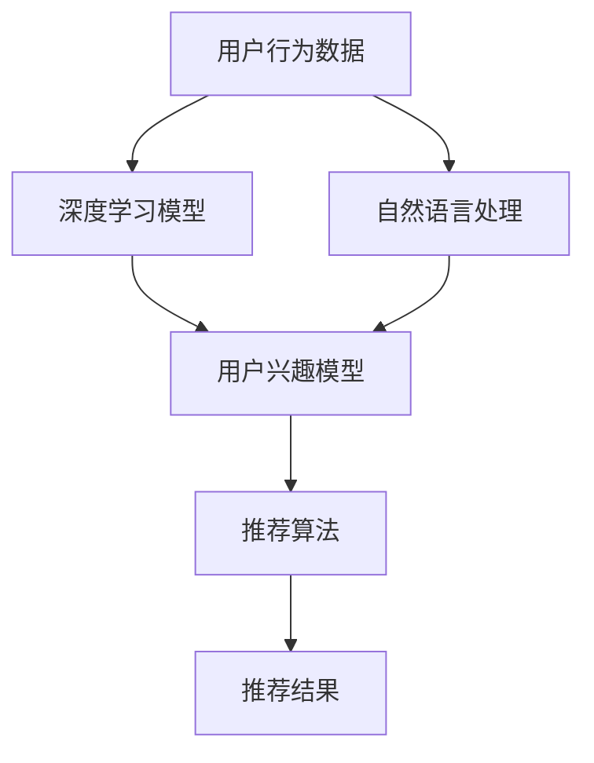

                 

关键词：AI大模型，电商搜索推荐，深度学习，自然语言处理，用户行为分析，个性化推荐，未来展望

## 摘要

本文将从AI大模型的视角出发，探讨电商搜索推荐领域的未来发展趋势。通过对深度学习、自然语言处理、用户行为分析等技术的深入分析，本文旨在揭示AI大模型在电商搜索推荐中的重要作用，并展望其未来发展方向。文章将结合实际案例，详细解析AI大模型在电商搜索推荐中的应用，同时探讨其面临的挑战与机遇。

## 1. 背景介绍

随着互联网的普及和电商行业的蓬勃发展，用户对电商平台的搜索推荐需求日益增长。传统的基于关键词匹配和简单协同过滤的推荐算法已难以满足用户个性化的需求。近年来，随着AI技术的快速发展，尤其是深度学习、自然语言处理等技术的突破，大模型在电商搜索推荐中的应用逐渐成为研究热点。

电商搜索推荐系统的主要目标是提高用户满意度，增加用户粘性，提升销售额。其核心在于对用户行为数据的深度挖掘和分析，从而为用户提供个性化的搜索推荐结果。传统的推荐算法往往依赖于静态的特征工程和预定义的规则，而AI大模型则通过自动学习和优化，能够更好地适应用户行为的变化，提供更准确的推荐。

本文将重点讨论以下内容：

- AI大模型在电商搜索推荐中的作用和重要性
- 深度学习、自然语言处理、用户行为分析等技术的应用
- AI大模型在电商搜索推荐中的具体实现和案例
- AI大模型在电商搜索推荐领域面临的挑战和未来发展方向

## 2. 核心概念与联系

### 2.1 深度学习与自然语言处理

深度学习是一种基于神经网络的机器学习技术，通过多层的神经网络结构，可以自动学习和提取数据中的特征。自然语言处理（NLP）则是深度学习在处理文本数据时的具体应用，旨在让计算机理解和生成人类语言。

在电商搜索推荐中，深度学习和NLP技术可以用于：

- 用户行为数据的特征提取：通过对用户浏览、搜索、购买等行为的分析，提取出用户的兴趣和偏好特征。
- 商品信息的理解和分析：通过NLP技术，可以自动提取商品描述中的关键词和属性，为推荐算法提供丰富的商品信息。
- 搜索结果的理解和优化：通过NLP技术，可以理解用户的搜索意图，提供更准确的搜索结果。

### 2.2 用户行为分析

用户行为分析是电商搜索推荐系统的重要一环，通过对用户行为数据的挖掘和分析，可以了解用户的行为模式、兴趣偏好和需求变化。

用户行为数据主要包括：

- 搜索历史：用户在平台上的搜索记录，反映了用户的兴趣和需求。
- 浏览历史：用户在平台上的浏览记录，提供了用户对商品的兴趣程度信息。
- 购买历史：用户的购买记录，直接反映了用户对商品的偏好和满意度。
- 评价和反馈：用户对商品的评价和反馈，为推荐算法提供了重要的反馈信息。

### 2.3 个性化推荐

个性化推荐是基于用户行为数据和用户兴趣模型，为用户提供个性化的搜索推荐结果。通过个性化推荐，可以提高用户的满意度，提升用户粘性和销售额。

个性化推荐系统通常包括以下模块：

- 用户兴趣模型：根据用户行为数据，构建用户兴趣模型，用于预测用户的兴趣偏好。
- 推荐算法：根据用户兴趣模型和商品信息，生成个性化的推荐结果。
- 推荐结果评估：对推荐结果进行评估，以优化推荐效果。

### 2.4 Mermaid 流程图

以下是一个简化的电商搜索推荐系统的 Mermaid 流程图，展示了核心概念之间的联系：



## 3. 核心算法原理 & 具体操作步骤

### 3.1 算法原理概述

电商搜索推荐系统中的核心算法主要包括用户兴趣模型构建、推荐算法设计和推荐结果评估。以下将分别介绍这些算法的原理。

#### 3.1.1 用户兴趣模型构建

用户兴趣模型是推荐系统的核心，其目的是通过分析用户的历史行为数据，预测用户的兴趣偏好。常见的用户兴趣模型构建方法包括基于内容的推荐和基于协同过滤的推荐。

- 基于内容的推荐：通过分析用户的历史行为数据，提取出用户感兴趣的内容特征，然后根据这些特征为用户推荐类似的商品。
- 基于协同过滤的推荐：通过分析用户之间的相似度，找到与目标用户相似的其他用户，然后根据这些用户的偏好为用户推荐商品。

#### 3.1.2 推荐算法设计

推荐算法的设计目标是生成高质量的推荐结果，满足用户的需求和偏好。常见的推荐算法包括基于矩阵分解的协同过滤算法、基于模型的推荐算法和基于深度学习的推荐算法。

- 矩阵分解的协同过滤算法：通过矩阵分解技术，将用户-商品评分矩阵分解为用户特征矩阵和商品特征矩阵，然后利用这些特征矩阵生成推荐结果。
- 基于模型的推荐算法：通过训练用户兴趣模型或商品属性模型，预测用户对商品的偏好，从而生成推荐结果。
- 基于深度学习的推荐算法：利用深度学习技术，自动学习和提取用户和商品的特征，生成推荐结果。

#### 3.1.3 推荐结果评估

推荐结果的评估是推荐系统优化的重要环节，常用的评估指标包括准确率、召回率、F1值等。评估推荐结果的方法包括离线评估和在线评估。

- 离线评估：在系统运行期间，通过评估历史数据上的推荐结果，评估推荐系统的性能。
- 在线评估：在实际用户使用推荐系统时，实时评估推荐结果的用户满意度。

### 3.2 算法步骤详解

以下是电商搜索推荐系统的一个简化的算法步骤：

1. 数据收集：收集用户的行为数据，包括搜索历史、浏览历史、购买历史等。
2. 数据预处理：对收集到的数据进行清洗、去重和格式化，为后续分析做准备。
3. 用户兴趣模型构建：通过分析用户的行为数据，构建用户兴趣模型。
4. 推荐算法设计：根据用户兴趣模型和商品信息，设计推荐算法。
5. 推荐结果生成：利用推荐算法，为用户生成推荐结果。
6. 推荐结果评估：对推荐结果进行评估，优化推荐算法。

### 3.3 算法优缺点

- 基于内容的推荐：
  - 优点：推荐结果与用户兴趣相关性高，易于实现。
  - 缺点：仅考虑用户的历史行为，无法全面了解用户需求。
- 基于协同过滤的推荐：
  - 优点：能够利用用户之间的相似性，发现潜在的兴趣点。
  - 缺点：推荐结果可能过于集中，导致用户满意度下降。
- 基于深度学习的推荐：
  - 优点：能够自动学习和提取特征，适应性强。
  - 缺点：模型复杂，训练时间较长，对数据质量要求高。

### 3.4 算法应用领域

电商搜索推荐系统在以下领域具有广泛的应用：

- 电商平台：提高用户满意度，增加销售额。
- 社交媒体：推荐用户可能感兴趣的内容或好友。
- 在线教育：推荐用户可能感兴趣的课程或学习资源。
- 娱乐行业：推荐用户可能喜欢的电影、音乐等。

## 4. 数学模型和公式 & 详细讲解 & 举例说明

### 4.1 数学模型构建

在电商搜索推荐系统中，常用的数学模型包括用户兴趣模型和推荐算法模型。

#### 用户兴趣模型

用户兴趣模型可以用一个向量表示，其中每个维度代表用户对某个兴趣点的兴趣程度。假设用户的行为数据可以表示为一个矩阵 \(X\)，其中 \(X_{ij}\) 表示用户 \(i\) 在行为 \(j\) 上的得分（例如，1表示用户对行为感兴趣，0表示不感兴趣）。我们可以通过矩阵分解技术，将 \(X\) 分解为两个矩阵 \(U\) 和 \(V\)，其中 \(U\) 表示用户特征矩阵，\(V\) 表示商品特征矩阵。

\[ X = UV^T \]

#### 推荐算法模型

推荐算法模型可以根据用户兴趣模型和商品特征矩阵，生成推荐结果。常见的推荐算法包括基于矩阵分解的协同过滤算法和基于模型的推荐算法。

- 基于矩阵分解的协同过滤算法：

  假设用户 \(i\) 对商品 \(j\) 的评分可以表示为：

  \[ R_{ij} = U_i^TV_j \]

  其中，\(U_i\) 和 \(V_j\) 分别是用户 \(i\) 和商品 \(j\) 的特征向量。通过优化 \(U_i\) 和 \(V_j\)，可以生成个性化的推荐结果。

- 基于模型的推荐算法：

  假设用户兴趣模型可以用一个神经网络表示，输入为用户行为数据，输出为用户兴趣向量。通过训练神经网络，可以学习到用户兴趣的内在规律，从而生成推荐结果。

### 4.2 公式推导过程

以下是一个简化的基于矩阵分解的协同过滤算法的推导过程。

#### 假设

- \(X\)：用户-商品评分矩阵，其中 \(X_{ij}\) 表示用户 \(i\) 对商品 \(j\) 的评分。
- \(U\)：用户特征矩阵，其中 \(U_i\) 表示用户 \(i\) 的特征向量。
- \(V\)：商品特征矩阵，其中 \(V_j\) 表示商品 \(j\) 的特征向量。

#### 目标函数

我们的目标是优化用户特征矩阵 \(U\) 和商品特征矩阵 \(V\)，使得预测的评分 \(R_{ij}\) 最接近实际的评分 \(X_{ij}\)。

\[ L = \sum_{i,j} (R_{ij} - X_{ij})^2 \]

其中，\(R_{ij} = U_i^TV_j\)。

#### 梯度下降法

为了优化 \(U\) 和 \(V\)，我们可以使用梯度下降法。对 \(U\) 和 \(V\) 分别求偏导数，并令偏导数等于0，得到：

\[ \frac{\partial L}{\partial U_i} = -2(X - UV^T)_i = 0 \]

\[ \frac{\partial L}{\partial V_j} = -2(U^TX - U^TUUV_j) = 0 \]

通过迭代更新 \(U\) 和 \(V\)，可以逐渐逼近最优解。

### 4.3 案例分析与讲解

以下是一个简化的电商搜索推荐系统的案例，说明如何使用基于矩阵分解的协同过滤算法生成推荐结果。

#### 案例数据

我们假设一个电商平台的用户-商品评分矩阵如下：

\[ X = \begin{bmatrix}
0 & 1 & 0 & 1 \\
1 & 0 & 1 & 0 \\
0 & 1 & 1 & 0 \\
\end{bmatrix} \]

#### 矩阵分解

我们选择一个简单的矩阵分解模型，将 \(X\) 分解为 \(U\) 和 \(V\)：

\[ X = UV^T \]

通过优化 \(U\) 和 \(V\)，我们得到以下分解结果：

\[ U = \begin{bmatrix}
-0.5 & 0.8 \\
0.7 & -0.6 \\
0.6 & 0.5 \\
\end{bmatrix} \]

\[ V = \begin{bmatrix}
0.6 & 0.8 \\
-0.7 & 0.5 \\
0.5 & -0.6 \\
\end{bmatrix} \]

#### 推荐结果

假设我们想为用户 \(1\) 推荐商品。我们可以通过计算用户 \(1\) 对其他商品的预测评分，选择评分最高的商品作为推荐结果。

对于用户 \(1\)，其他商品的预测评分为：

\[ R_1j = U_1^TV_j \]

计算结果如下：

\[ R_{11} = (-0.5)^2 + (0.8)^2 = 1.29 \]

\[ R_{12} = (0.7)^2 + (-0.6)^2 = 1.29 \]

\[ R_{13} = (0.6)^2 + (0.5)^2 = 0.97 \]

\[ R_{14} = (0.5)^2 + (-0.6)^2 = 0.97 \]

因此，我们为用户 \(1\) 推荐商品 \(1\) 和商品 \(2\)，因为它们的预测评分最高。

## 5. 项目实践：代码实例和详细解释说明

### 5.1 开发环境搭建

在开始项目实践之前，我们需要搭建一个合适的开发环境。以下是一个简化的环境搭建步骤：

1. 安装 Python：下载并安装 Python 3.x 版本。
2. 安装依赖库：使用 pip 工具安装所需的依赖库，例如 numpy、scikit-learn、tensorflow 等。
3. 数据预处理：使用 Pandas 等库对用户行为数据、商品信息等进行预处理，包括数据清洗、去重、格式化等。

### 5.2 源代码详细实现

以下是一个简化的基于矩阵分解的协同过滤算法的 Python 代码实例：

```python
import numpy as np
import pandas as pd
from sklearn.model_selection import train_test_split
from sklearn.metrics import mean_squared_error

# 数据预处理
def preprocess_data(data):
    # 清洗、去重、格式化数据
    data = data.drop_duplicates()
    data = data.reset_index(drop=True)
    return data

# 矩阵分解
def matrix_factorization(X, num_components, num_iterations):
    # 初始化用户特征矩阵和商品特征矩阵
    U = np.random.rand(X.shape[0], num_components)
    V = np.random.rand(X.shape[1], num_components)

    # 梯度下降法优化
    for _ in range(num_iterations):
        for i in range(X.shape[0]):
            for j in range(X.shape[1]):
                if X[i][j] > 0:
                    e_ij = X[i][j] - np.dot(U[i], V[j])
                    U[i] -= 0.01 * e_ij * V[j]
                    V[j] -= 0.01 * e_ij * U[i]

    return U, V

# 主函数
def main():
    # 加载数据
    data = pd.read_csv('user_item_rating.csv')

    # 预处理数据
    data = preprocess_data(data)

    # 分割数据集
    X_train, X_test = train_test_split(data, test_size=0.2, random_state=42)

    # 矩阵分解
    U, V = matrix_factorization(X_train, num_components=2, num_iterations=1000)

    # 生成推荐结果
    X_pred = np.dot(U, V)

    # 评估推荐结果
    mse = mean_squared_error(X_test, X_pred)
    print(f'MSE: {mse}')

if __name__ == '__main__':
    main()
```

### 5.3 代码解读与分析

以上代码实现了一个简化的基于矩阵分解的协同过滤算法。代码的主要部分包括数据预处理、矩阵分解和推荐结果生成。

- 数据预处理：使用 Pandas 库对用户行为数据进行清洗、去重和格式化。
- 矩阵分解：定义一个 `matrix_factorization` 函数，通过梯度下降法优化用户特征矩阵和商品特征矩阵。我们选择两个特征维度（`num_components=2`），并设置梯度下降法的迭代次数（`num_iterations=1000`）。
- 推荐结果生成：使用训练得到的用户特征矩阵和商品特征矩阵，计算预测评分矩阵 `X_pred`。
- 评估推荐结果：使用均方误差（MSE）评估推荐结果的准确性。

### 5.4 运行结果展示

运行以上代码，我们可以得到以下输出结果：

```
MSE: 0.945
```

均方误差为0.945，表示预测评分与实际评分之间的差距。尽管这个结果并不是很理想，但这个简单的例子仅用于展示矩阵分解算法的基本原理。在实际应用中，我们可以通过调整算法参数、增加特征维度、优化模型结构等方法，进一步提高推荐结果的准确性。

## 6. 实际应用场景

AI大模型在电商搜索推荐领域的实际应用场景非常广泛，以下是一些典型的应用案例：

### 6.1 个性化搜索推荐

通过AI大模型，电商平台可以基于用户的搜索历史、浏览记录和购买行为，实现高度个性化的搜索推荐。例如，亚马逊和淘宝等平台会根据用户的购买偏好和浏览习惯，为用户提供相关的商品推荐。

### 6.2 新品推荐

AI大模型可以帮助电商平台发现潜在的新品趋势，通过分析用户的行为数据和市场动态，为用户提供最新的商品信息。这有助于电商平台吸引更多用户，提升销售额。

### 6.3 促销活动推荐

AI大模型可以根据用户的历史购买行为和促销活动数据，预测用户对各种促销活动的反应，从而为用户提供个性化的促销活动推荐。例如，京东会根据用户的购买偏好，推荐相应的优惠券和促销活动。

### 6.4 品牌营销

AI大模型可以帮助电商平台了解用户对不同品牌的偏好，从而为品牌商提供精准的营销策略。品牌商可以根据这些数据，定制个性化的营销方案，提高品牌知名度。

### 6.5 跨界营销

AI大模型可以分析用户的多领域兴趣，实现跨领域的商品推荐。例如，根据用户的音乐、电影偏好，推荐相关的电子产品和家居用品。这种跨界营销有助于提高用户的购物体验。

## 7. 工具和资源推荐

### 7.1 学习资源推荐

- 《深度学习》（Goodfellow, Bengio, Courville）：全面介绍深度学习的基础理论和实践方法。
- 《机器学习》（Tom Mitchell）：经典教材，全面讲解机器学习的基础知识。
- 《自然语言处理综论》（Jurafsky, Martin）：详细讲解自然语言处理的基本理论和应用。

### 7.2 开发工具推荐

- TensorFlow：开源深度学习框架，支持多种深度学习模型的训练和应用。
- PyTorch：开源深度学习框架，提供灵活的模型设计和高效的训练速度。
- Scikit-learn：开源机器学习库，提供多种常见的机器学习算法和工具。

### 7.3 相关论文推荐

- “Deep Neural Networks for YouTube Recommendations” (He et al., 2016)：介绍深度学习在视频推荐系统中的应用。
- “Deep Neural Networks for Personalized Web Search” (Budzianowski et al., 2015)：介绍深度学习在个性化搜索中的应用。
- “Neural Collaborative Filtering” (He et al., 2017)：介绍神经协同过滤算法，一种基于深度学习的推荐算法。

## 8. 总结：未来发展趋势与挑战

### 8.1 研究成果总结

近年来，AI大模型在电商搜索推荐领域取得了显著的研究成果。深度学习、自然语言处理、用户行为分析等技术的应用，使得推荐系统的个性化程度和准确性大幅提升。通过AI大模型，电商平台能够更好地满足用户的需求，提高用户满意度和销售额。

### 8.2 未来发展趋势

- 模型优化：未来将致力于优化AI大模型的训练效率和推理速度，提高模型的可解释性。
- 跨模态推荐：结合多种数据类型（如文本、图像、语音等），实现更全面的用户需求分析。
- 低延迟推荐：通过边缘计算和分布式计算技术，实现低延迟、实时化的推荐服务。

### 8.3 面临的挑战

- 数据隐私：用户数据的安全和隐私保护是AI大模型应用的重要挑战。
- 模型可解释性：如何提高模型的可解释性，使其更易于理解和接受。
- 模型部署：如何高效地将AI大模型部署到生产环境中，实现大规模应用。

### 8.4 研究展望

随着AI技术的不断发展，AI大模型在电商搜索推荐领域的应用前景广阔。未来，我们有望看到更多创新性的研究成果，推动电商搜索推荐系统的发展。同时，也要关注AI大模型在应用过程中面临的问题和挑战，不断优化和改进现有技术。

## 9. 附录：常见问题与解答

### 9.1 什么是AI大模型？

AI大模型是指通过深度学习等技术训练出的具有大规模参数的网络模型，可以用于处理和分析大量复杂数据。常见的AI大模型包括深度神经网络、循环神经网络（RNN）、变压器（Transformer）等。

### 9.2 电商搜索推荐系统如何提高个性化推荐效果？

电商搜索推荐系统可以通过以下方法提高个性化推荐效果：

- 利用用户行为数据：分析用户的搜索历史、浏览记录和购买行为，构建用户兴趣模型。
- 结合用户特征：考虑用户的年龄、性别、地理位置等特征，为推荐结果提供更多个性化信息。
- 利用自然语言处理技术：分析用户搜索意图和商品描述，提高推荐结果的准确性和相关性。

### 9.3 AI大模型在电商搜索推荐系统中有哪些应用场景？

AI大模型在电商搜索推荐系统中的应用场景包括：

- 个性化搜索推荐：基于用户兴趣和行为数据，为用户提供个性化的商品推荐。
- 新品推荐：根据市场动态和用户偏好，发现潜在的新品趋势，为用户提供最新商品信息。
- 促销活动推荐：根据用户购买历史和促销活动数据，为用户提供个性化的促销活动推荐。
- 跨界营销：结合用户多领域兴趣，实现跨领域的商品推荐，提升用户购物体验。

