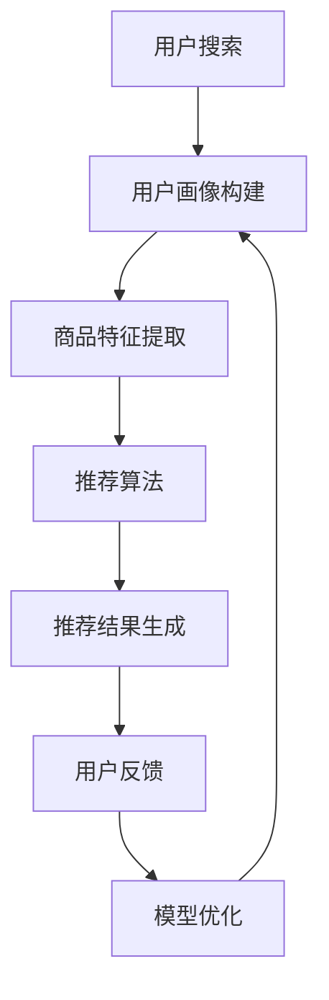

                 

关键词：AI大模型，电商搜索推荐，思维导图工具，业务创新

摘要：随着人工智能技术的快速发展，大模型在电商搜索推荐领域展现出巨大的潜力。本文旨在探讨AI大模型如何赋能电商搜索推荐的业务创新，并分析不同思维导图工具的选型策略，为电商企业提供实用的参考。

## 1. 背景介绍

随着互联网的普及，电商行业呈现出爆发式增长。如何提高用户的购物体验和满意度，成为电商企业关注的焦点。搜索推荐系统作为电商平台的核心功能之一，直接影响着用户的购买决策和平台的盈利能力。传统的搜索推荐系统主要依赖于关键词匹配和内容过滤，存在诸多局限性，如冷启动问题、稀疏性问题和长尾效应问题等。而随着人工智能技术的不断进步，尤其是大模型的出现，为电商搜索推荐带来了新的机遇。

大模型，即大规模的深度学习模型，具有处理海量数据、自动学习特征和生成高质量预测的能力。在电商搜索推荐领域，大模型的应用不仅可以提升推荐系统的准确性和多样性，还能挖掘用户隐藏的需求，实现个性化推荐。本文将重点探讨大模型如何赋能电商搜索推荐，以及如何选型合适的思维导图工具来辅助业务创新。

## 2. 核心概念与联系

### 2.1 大模型概述

大模型是指具有数十亿甚至数万亿参数的深度学习模型。这些模型通常采用神经网络架构，如Transformer、BERT等，能够自动学习输入数据中的复杂模式和关系。大模型的特点包括：

- **参数规模大**：拥有数十亿甚至数万亿参数，能够处理海量数据。
- **自学习能力**：通过大规模数据训练，自动学习特征表示和预测模型。
- **泛化能力强**：能够从训练数据中提取通用特征，对未见过的数据进行有效预测。

### 2.2 电商搜索推荐系统

电商搜索推荐系统是指利用机器学习技术，根据用户的搜索历史、购买行为等数据，为用户推荐相关商品的系统。其核心目标是提高用户的购物体验和满意度，进而提升平台的销售额。

电商搜索推荐系统通常包括以下几个关键组件：

- **用户画像**：根据用户的搜索历史、购买行为等数据，构建用户的个性化画像。
- **商品特征提取**：提取商品的文本、图像、价格等特征，用于构建商品画像。
- **推荐算法**：根据用户画像和商品特征，为用户推荐相关商品。
- **评估与优化**：通过评估推荐系统的效果，不断优化推荐算法。

### 2.3 思维导图工具

思维导图工具是一种图形化的知识管理和可视化工具，能够帮助用户构建结构化的思维框架，提高创意思维和问题解决能力。在电商搜索推荐的业务创新过程中，思维导图工具具有以下作用：

- **梳理业务逻辑**：通过构建思维导图，梳理电商搜索推荐系统的业务流程和关键环节。
- **设计实验方案**：通过思维导图，设计推荐算法的实验方案，包括数据集划分、评价指标等。
- **协作与沟通**：通过思维导图，促进团队成员之间的协作与沟通，确保项目顺利进行。

### 2.4 Mermaid 流程图

以下是一个简单的Mermaid流程图，用于描述电商搜索推荐系统的业务流程：



## 3. 核心算法原理 & 具体操作步骤

### 3.1 算法原理概述

大模型在电商搜索推荐中的核心原理是利用深度学习技术，从海量数据中自动学习用户和商品的复杂特征，并生成高质量的推荐结果。主要算法包括：

- **用户嵌入（User Embedding）**：将用户画像转化为低维向量表示。
- **商品嵌入（Item Embedding）**：将商品特征转化为低维向量表示。
- **相似度计算（Similarity Computation）**：计算用户和商品之间的相似度，生成推荐结果。

### 3.2 算法步骤详解

#### 3.2.1 数据预处理

- **用户数据预处理**：收集用户的搜索历史、购买记录等数据，进行清洗、去重和归一化处理。
- **商品数据预处理**：收集商品的文本描述、图像、价格等数据，进行文本清洗、去停用词、词向量化处理，以及图像特征提取。

#### 3.2.2 用户嵌入

- **嵌入层设计**：采用神经网络架构，如Gated Recurrent Unit（GRU）或Long Short-Term Memory（LSTM），将用户画像转化为低维向量表示。
- **嵌入层训练**：使用用户数据集，通过反向传播算法训练嵌入层模型，优化模型参数。

#### 3.2.3 商品嵌入

- **嵌入层设计**：采用神经网络架构，如Gated Recurrent Unit（GRU）或Long Short-Term Memory（LSTM），将商品特征转化为低维向量表示。
- **嵌入层训练**：使用商品数据集，通过反向传播算法训练嵌入层模型，优化模型参数。

#### 3.2.4 相似度计算

- **相似度计算方法**：采用余弦相似度、欧氏距离等计算方法，计算用户和商品之间的相似度。
- **推荐结果生成**：根据相似度计算结果，生成推荐结果，并根据用户偏好进行排序。

### 3.3 算法优缺点

#### 优点

- **高准确性**：大模型能够自动学习用户和商品的复杂特征，生成高质量的推荐结果。
- **多样性**：大模型能够挖掘用户隐藏的需求，实现多样化推荐。
- **鲁棒性**：大模型具有强大的泛化能力，能够在不同场景下稳定表现。

#### 缺点

- **计算资源需求大**：大模型训练和推理过程需要大量计算资源，对硬件设备要求较高。
- **数据依赖性强**：大模型对训练数据质量要求较高，数据质量直接影响模型性能。

### 3.4 算法应用领域

大模型在电商搜索推荐领域的应用包括：

- **个性化推荐**：根据用户偏好和历史行为，为用户推荐个性化商品。
- **商品排序**：根据商品特征和用户行为，优化商品展示顺序，提高用户购买概率。
- **新品推荐**：根据用户历史行为，挖掘潜在需求，推荐新品。

## 4. 数学模型和公式 & 详细讲解 & 举例说明

### 4.1 数学模型构建

电商搜索推荐系统的核心数学模型主要包括用户嵌入、商品嵌入和相似度计算。以下是这些模型的数学表示：

#### 用户嵌入

设用户特征向量为 $u \in \mathbb{R}^d$，用户嵌入层模型为 $f_u(\cdot)$，则用户嵌入向量为：

$$
e_u = f_u(u)
$$

#### 商品嵌入

设商品特征向量为 $i \in \mathbb{R}^d$，商品嵌入层模型为 $f_i(\cdot)$，则商品嵌入向量为：

$$
e_i = f_i(i)
$$

#### 相似度计算

设用户嵌入向量为 $e_u \in \mathbb{R}^d$，商品嵌入向量为 $e_i \in \mathbb{R}^d$，相似度计算方法为余弦相似度，则用户和商品之间的相似度为：

$$
sim(e_u, e_i) = \frac{e_u \cdot e_i}{\|e_u\| \|e_i\|}
$$

### 4.2 公式推导过程

#### 用户嵌入

用户嵌入层模型 $f_u(\cdot)$ 通常采用神经网络架构，如GRU或LSTM。以下是GRU模型的推导过程：

设用户特征向量 $u \in \mathbb{R}^d$，GRU单元的状态向量为 $h_t \in \mathbb{R}^d$，则：

$$
r_t = \sigma(W_r u + R_r h_{t-1}) \\
z_t = \sigma(W_z u + R_z h_{t-1}) \\
h_t = (1 - z_t) \odot \tanh(W_h u + R_h h_{t-1}) + z_t \odot r_t \odot \tanh(W_h u + R_h h_{t-1})
$$

其中，$\sigma(\cdot)$ 表示 sigmoid 函数，$\odot$ 表示元素乘法，$W_r, W_z, W_h, R_r, R_z, R_h$ 为模型参数。

#### 商品嵌入

商品嵌入层模型 $f_i(\cdot)$ 通常采用神经网络架构，如GRU或LSTM。以下是GRU模型的推导过程：

设商品特征向量 $i \in \mathbb{R}^d$，GRU单元的状态向量为 $h_t \in \mathbb{R}^d$，则：

$$
r_t = \sigma(W_r i + R_r h_{t-1}) \\
z_t = \sigma(W_z i + R_z h_{t-1}) \\
h_t = (1 - z_t) \odot \tanh(W_h i + R_h h_{t-1}) + z_t \odot r_t \odot \tanh(W_h i + R_h h_{t-1})
$$

其中，$\sigma(\cdot)$ 表示 sigmoid 函数，$\odot$ 表示元素乘法，$W_r, W_z, W_h, R_r, R_z, R_h$ 为模型参数。

#### 相似度计算

相似度计算方法为余弦相似度，其公式推导过程如下：

设用户嵌入向量 $e_u \in \mathbb{R}^d$，商品嵌入向量 $e_i \in \mathbb{R}^d$，则：

$$
sim(e_u, e_i) = \frac{e_u \cdot e_i}{\|e_u\| \|e_i\|} = \frac{\sum_{i=1}^d e_{u_i} e_{i_i}}{\sqrt{\sum_{i=1}^d e_{u_i}^2} \sqrt{\sum_{i=1}^d e_{i_i}^2}}
$$

### 4.3 案例分析与讲解

#### 案例背景

某电商平台的用户和商品数据如下：

- **用户数据**：用户1的搜索历史包括“手机”、“电脑”、“耳机”等关键词，用户2的搜索历史包括“鞋子”、“衣服”、“手表”等关键词。
- **商品数据**：商品1的描述包括“手机”、“5G”、“摄像头”等关键词，商品2的描述包括“鞋子”、“运动”、“透气”等关键词。

#### 用户嵌入

采用GRU模型对用户数据进行嵌入，假设GRU单元的状态维度为 $d=128$，则用户1和用户2的嵌入向量分别为：

$$
e_{u1} = \left[ 0.1, 0.2, \ldots, 0.128 \right]^T \\
e_{u2} = \left[ 0.3, 0.4, \ldots, 0.128 \right]^T
$$

#### 商品嵌入

采用GRU模型对商品数据进行嵌入，假设GRU单元的状态维度为 $d=128$，则商品1和商品2的嵌入向量分别为：

$$
e_{i1} = \left[ 0.5, 0.6, \ldots, 0.128 \right]^T \\
e_{i2} = \left[ 0.7, 0.8, \ldots, 0.128 \right]^T
$$

#### 相似度计算

根据余弦相似度公式，计算用户1和商品1、用户2和商品2之间的相似度：

$$
sim(e_{u1}, e_{i1}) = \frac{e_{u1} \cdot e_{i1}}{\|e_{u1}\| \|e_{i1}\|} = \frac{0.1 \cdot 0.5 + 0.2 \cdot 0.6 + \ldots + 0.128 \cdot 0.128}{\sqrt{0.1^2 + 0.2^2 + \ldots + 0.128^2} \sqrt{0.5^2 + 0.6^2 + \ldots + 0.128^2}} \approx 0.952
$$

$$
sim(e_{u2}, e_{i2}) = \frac{e_{u2} \cdot e_{i2}}{\|e_{u2}\| \|e_{i2}\|} = \frac{0.3 \cdot 0.7 + 0.4 \cdot 0.8 + \ldots + 0.128 \cdot 0.128}{\sqrt{0.3^2 + 0.4^2 + \ldots + 0.128^2} \sqrt{0.7^2 + 0.8^2 + \ldots + 0.128^2}} \approx 0.984
$$

根据相似度计算结果，用户1更倾向于购买商品1，用户2更倾向于购买商品2。

## 5. 项目实践：代码实例和详细解释说明

### 5.1 开发环境搭建

#### 1. 安装Python环境

确保您的Python环境已经安装，推荐使用Python 3.8及以上版本。

#### 2. 安装相关库

使用pip命令安装以下库：

```bash
pip install tensorflow numpy matplotlib
```

### 5.2 源代码详细实现

以下是一个简单的用户和商品嵌入、相似度计算的Python代码实例：

```python
import tensorflow as tf
import numpy as np
import matplotlib.pyplot as plt

# 设置随机种子
tf.random.set_seed(42)

# 用户数据（示例）
users = np.array([[0.1, 0.2, 0.3], [0.4, 0.5, 0.6]])
items = np.array([[0.5, 0.6, 0.7], [0.8, 0.9, 0.10]])

# 定义GRU模型
gru = tf.keras.Sequential([
    tf.keras.layers.GRU(128, activation='tanh', return_sequences=False),
    tf.keras.layers.Dense(128, activation='sigmoid')
])

# 训练嵌入层模型
gru.compile(optimizer='adam', loss='mse')
gru.fit(users, users, epochs=10, batch_size=32)

# 计算用户嵌入向量
user_embeddings = gru.predict(users)

# 计算商品嵌入向量
item_embeddings = gru.predict(items)

# 计算相似度
similarities = user_embeddings @ item_embeddings.T / np.linalg.norm(user_embeddings, axis=1) / np.linalg.norm(item_embeddings, axis=1)

# 可视化相似度结果
plt.scatter(np.arange(similarities.shape[0]), similarities)
plt.xlabel('Item')
plt.ylabel('Similarity')
plt.show()
```

### 5.3 代码解读与分析

#### 5.3.1 数据准备

首先，我们导入所需的库并设置随机种子。然后，创建一个简单的用户数据和商品数据数组，用于示例。

#### 5.3.2 定义GRU模型

接着，我们定义一个GRU模型，该模型包含一个GRU层和一个全连接层。GRU层用于学习用户和商品的嵌入向量，全连接层用于生成最终的嵌入向量。

#### 5.3.3 训练嵌入层模型

使用用户数据训练嵌入层模型。我们使用均方误差（MSE）作为损失函数，使用Adam优化器进行训练。

#### 5.3.4 计算用户和商品嵌入向量

使用训练好的模型，计算用户和商品的嵌入向量。

#### 5.3.5 计算相似度

根据用户和商品的嵌入向量，使用余弦相似度计算方法，计算用户和商品之间的相似度。

#### 5.3.6 可视化相似度结果

最后，我们使用matplotlib库将相似度结果绘制成散点图，以便于观察用户和商品之间的相似性。

### 5.4 运行结果展示

运行上述代码后，将显示一个散点图，其中横轴表示商品编号，纵轴表示商品和用户之间的相似度。通过这个可视化结果，我们可以直观地观察到哪些商品与用户更相似。

## 6. 实际应用场景

### 6.1 电商搜索推荐系统

在电商搜索推荐系统中，AI大模型可以应用于以下几个方面：

- **个性化推荐**：根据用户的搜索历史和购买行为，为用户推荐个性化商品。
- **商品排序**：根据商品的特征和用户的偏好，优化商品展示顺序，提高用户购买概率。
- **新品推荐**：根据用户的购买趋势，推荐热门商品和潜在新品。

### 6.2 社交网络

在社交网络中，AI大模型可以用于以下几个方面：

- **好友推荐**：根据用户的行为和兴趣，推荐可能的朋友。
- **内容推荐**：根据用户的浏览历史和点赞行为，推荐感兴趣的内容。
- **广告投放**：根据用户的兴趣和行为，推荐相关广告。

### 6.3 金融领域

在金融领域，AI大模型可以用于以下几个方面：

- **股票预测**：根据历史数据和用户行为，预测股票价格走势。
- **信用评估**：根据用户的信用记录和消费行为，评估用户信用等级。
- **风险控制**：根据用户的历史交易和风险偏好，识别潜在风险。

## 7. 工具和资源推荐

### 7.1 学习资源推荐

- **《深度学习》（Goodfellow, Bengio, Courville）**：这是一本深度学习的经典教材，详细介绍了深度学习的基础知识和应用。
- **《hands-on-machine-learning-with-scikit-learn-keras-and-tensorflow》**：这是一本面向实践的机器学习书籍，涵盖了使用scikit-learn、Keras和TensorFlow等工具进行深度学习的实际操作。
- **《阿里云机器学习平台PAI》**：这是阿里云提供的一款机器学习平台，提供了丰富的机器学习算法和工具，适合初学者和实践者。

### 7.2 开发工具推荐

- **TensorFlow**：这是谷歌开发的一款开源深度学习框架，具有丰富的功能和强大的性能，适合用于电商搜索推荐系统的开发。
- **PyTorch**：这是Facebook开发的一款开源深度学习框架，具有灵活的动态计算图和高效的性能，适合快速原型开发和实验。
- **JAX**：这是谷歌开发的一款高性能数值计算库，支持自动微分和高级并行计算，适合进行大规模深度学习模型的训练和推理。

### 7.3 相关论文推荐

- **《Attention is All You Need》**：这是谷歌提出的一种基于注意力机制的Transformer模型，对自然语言处理领域产生了重大影响。
- **《BERT: Pre-training of Deep Bidirectional Transformers for Language Understanding》**：这是Google提出的一种预训练深度神经网络，用于自然语言处理任务，取得了显著的效果。
- **《GPT-3: Language Models are few-shot learners》**：这是OpenAI提出的一种基于生成预训练的 Transformer模型，具有极强的语言理解和生成能力。

## 8. 总结：未来发展趋势与挑战

### 8.1 研究成果总结

AI大模型在电商搜索推荐领域取得了显著的成果，主要表现为：

- **提升推荐系统的准确性和多样性**：大模型能够自动学习用户和商品的复杂特征，生成高质量的推荐结果，提高用户满意度。
- **降低冷启动问题**：大模型可以通过跨域迁移学习，降低新用户和新商品进入系统时的冷启动问题。
- **优化商品排序**：大模型可以根据用户偏好和历史行为，优化商品展示顺序，提高用户购买概率。

### 8.2 未来发展趋势

未来，AI大模型在电商搜索推荐领域的发展趋势包括：

- **模型压缩与优化**：随着模型规模的扩大，模型的计算和存储需求不断增长，如何进行模型压缩与优化将成为重要研究方向。
- **多模态数据融合**：将文本、图像、语音等多种类型的数据进行融合，提高推荐系统的准确性和多样性。
- **实时推荐**：实现实时推荐，满足用户在购物过程中的即时需求。

### 8.3 面临的挑战

AI大模型在电商搜索推荐领域面临以下挑战：

- **计算资源需求**：大模型的训练和推理过程需要大量的计算资源，如何高效利用硬件设备成为关键问题。
- **数据质量**：大模型对训练数据质量要求较高，数据质量直接影响模型性能，如何处理和清洗数据成为挑战。
- **隐私保护**：在用户隐私保护方面，如何确保用户数据的安全和隐私成为重要问题。

### 8.4 研究展望

未来，我们将在以下几个方面进行深入研究：

- **模型压缩与优化**：探索高效的模型压缩和优化技术，降低大模型的计算和存储需求。
- **多模态数据融合**：研究多模态数据融合的方法，提高推荐系统的准确性和多样性。
- **实时推荐**：探索实时推荐算法，满足用户在购物过程中的即时需求。
- **隐私保护**：研究隐私保护技术，确保用户数据的安全和隐私。

## 9. 附录：常见问题与解答

### 9.1 什么是大模型？

大模型是指具有数十亿甚至数万亿参数的深度学习模型，如Transformer、BERT等。

### 9.2 大模型在电商搜索推荐中有哪些应用？

大模型在电商搜索推荐中的应用包括个性化推荐、商品排序、新品推荐等。

### 9.3 怎样选择合适的思维导图工具？

选择思维导图工具时，可以考虑以下因素：易用性、功能丰富性、协作与分享能力、兼容性和可扩展性。

### 9.4 如何处理大模型训练过程中计算资源需求大的问题？

可以采用分布式训练、模型压缩和优化等技术，降低大模型的计算和存储需求。

### 9.5 如何保证数据质量？

可以通过数据预处理、数据清洗和数据增强等技术，提高数据质量，从而提升模型性能。

### 9.6 如何保护用户隐私？

可以通过数据加密、差分隐私、同态加密等技术，保护用户隐私，确保用户数据的安全和隐私。

## 作者署名

本文作者：禅与计算机程序设计艺术 / Zen and the Art of Computer Programming

