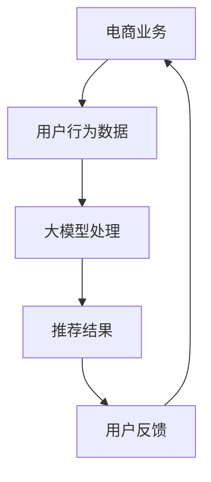

                 

作者：禅与计算机程序设计艺术 / Zen and the Art of Computer Programming

随着人工智能技术的飞速发展，大模型（如GPT、BERT等）在自然语言处理、图像识别、推荐系统等领域展现出了巨大的潜力。在电商搜索推荐系统中，大模型的应用能够显著提升用户体验、增加销售转化率。本文将探讨如何利用AI大模型赋能电商搜索推荐业务，并设计一套系统的培训课程。

## 1. 背景介绍

电商行业在过去几十年中经历了快速的发展，市场规模不断扩大，用户需求也日益多样化。为了满足用户的需求，电商企业开始注重个性化推荐系统的发展。传统的推荐系统主要依赖于用户的历史行为数据，通过简单的算法进行用户偏好分析，但效果往往有限。

随着AI技术的进步，尤其是大模型的广泛应用，电商搜索推荐系统迎来了新的机遇。大模型通过深度学习技术，能够处理大量的非结构化数据，捕捉用户行为背后的复杂模式，从而提供更加精准的推荐。

## 2. 核心概念与联系

在探讨AI大模型赋能电商搜索推荐之前，我们需要理解几个核心概念：大模型、推荐系统、电商业务。

### 2.1 大模型

大模型是指参数规模庞大的深度神经网络模型，例如GPT、BERT等。这些模型能够处理复杂的任务，如文本生成、机器翻译、情感分析等。

### 2.2 推荐系统

推荐系统是一种信息过滤技术，旨在根据用户的历史行为和偏好，向用户推荐可能感兴趣的内容。在电商领域，推荐系统能够帮助用户发现潜在的购买需求。

### 2.3 电商业务

电商业务涉及多个环节，包括商品管理、库存管理、订单处理、支付和物流等。推荐系统在电商业务中起着关键作用，能够提高用户满意度和销售转化率。

#### Mermaid流程图



## 3. 核心算法原理 & 具体操作步骤

### 3.1 算法原理概述

大模型在电商搜索推荐中的核心作用是通过深度学习技术，对用户行为数据进行建模，从而预测用户的兴趣和偏好。

### 3.2 算法步骤详解

1. 数据收集与预处理：收集用户行为数据，如浏览历史、购买记录、评论等，并进行数据清洗和预处理。
2. 大模型训练：使用预处理后的数据对大模型进行训练，使模型学会从数据中提取有用的信息。
3. 用户行为预测：使用训练好的大模型预测用户的行为，如点击、购买等。
4. 推荐结果生成：根据用户行为的预测结果，生成个性化的推荐结果。
5. 用户反馈与优化：收集用户的反馈，优化模型参数，提高推荐效果。

### 3.3 算法优缺点

#### 优点

- **强大的建模能力**：大模型能够处理复杂的用户行为数据，捕捉细微的用户偏好。
- **自适应**：大模型能够根据用户行为的变化实时调整推荐策略。
- **高精度**：通过深度学习技术，大模型能够提供高精度的推荐结果。

#### 缺点

- **训练成本高**：大模型的训练需要大量的计算资源和时间。
- **数据隐私问题**：用户行为数据涉及隐私问题，需要谨慎处理。

### 3.4 算法应用领域

大模型在电商搜索推荐中的应用广泛，包括：

- **商品推荐**：根据用户的历史行为推荐可能感兴趣的商品。
- **广告投放**：基于用户的行为数据，精准投放广告。
- **个性化搜索**：根据用户的搜索历史和偏好，提供个性化的搜索结果。

## 4. 数学模型和公式 & 详细讲解 & 举例说明

### 4.1 数学模型构建

在电商搜索推荐中，常用的数学模型是协同过滤模型。协同过滤模型基于用户行为数据，通过计算用户之间的相似度，推荐用户可能喜欢的商品。

#### 数学公式

$$
\text{similarity(u, v)} = \frac{\text{dot\_product(r\_u, r\_v)}}{\|\text{r\_u}\|\|\text{r\_v}\|}
$$

其中，$r\_u$和$r\_v$分别是用户$u$和$v$的行为向量，$\text{dot\_product}$是点积操作，$\|\|$是向量的模长。

### 4.2 公式推导过程

协同过滤模型的推导过程基于用户行为数据。首先，我们假设用户的行为数据可以表示为用户-商品评分矩阵$R$，其中$R_{ui}$表示用户$u$对商品$i$的评分。

接下来，我们计算用户之间的相似度。用户之间的相似度可以通过计算用户之间的行为向量之间的点积来获得。具体来说，我们计算用户$u$和$v$的行为向量的点积：

$$
\text{dot\_product(r\_u, r\_v)} = \sum_{i} r_{ui} r_{vi}
$$

然后，我们计算用户之间的相似度：

$$
\text{similarity(u, v)} = \frac{\text{dot\_product(r\_u, r\_v)}}{\|\text{r\_u}\|\|\text{r\_v}\|}
$$

### 4.3 案例分析与讲解

假设有两个用户$u$和$v$，他们的行为向量如下：

$$
r\_u = [1, 2, 3, 4, 5]
$$

$$
r\_v = [2, 3, 4, 5, 6]
$$

首先，我们计算用户之间的点积：

$$
\text{dot\_product(r\_u, r\_v)} = 1 \times 2 + 2 \times 3 + 3 \times 4 + 4 \times 5 + 5 \times 6 = 70
$$

然后，我们计算用户之间的模长：

$$
\|\text{r\_u}\| = \sqrt{1^2 + 2^2 + 3^2 + 4^2 + 5^2} = \sqrt{55}
$$

$$
\|\text{r\_v}\| = \sqrt{2^2 + 3^2 + 4^2 + 5^2 + 6^2} = \sqrt{78}
$$

最后，我们计算用户之间的相似度：

$$
\text{similarity(u, v)} = \frac{70}{\sqrt{55} \times \sqrt{78}} \approx 0.82
$$

根据相似度，我们可以推荐用户$v$可能喜欢的商品给用户$u$。

## 5. 项目实践：代码实例和详细解释说明

### 5.1 开发环境搭建

为了实践大模型在电商搜索推荐中的应用，我们需要搭建一个开发环境。以下是基本的步骤：

1. 安装Python环境
2. 安装TensorFlow或PyTorch框架
3. 下载并预处理电商数据集

### 5.2 源代码详细实现

以下是一个简单的代码示例，演示如何使用TensorFlow实现一个基于协同过滤的推荐系统。

```python
import tensorflow as tf
from tensorflow.keras.layers import Embedding, Flatten, Dot
from tensorflow.keras.models import Model

# 数据预处理
# 代码略

# 模型构建
user_embedding = Embedding(num_users, embed_size)
item_embedding = Embedding(num_items, embed_size)

user_vector = user_embedding(tf.expand_dims(user_ids, -1))
item_vector = item_embedding(tf.expand_dims(item_ids, -1))

dot_product = Dot(axes=1)([user_vector, item_vector])
output = Flatten()(dot_product)

model = Model(inputs=[user_ids, item_ids], outputs=output)
model.compile(optimizer='adam', loss='mse')

# 训练模型
# 代码略

# 推荐结果生成
# 代码略
```

### 5.3 代码解读与分析

上述代码使用了TensorFlow框架构建了一个简单的协同过滤模型。首先，我们定义了用户和商品的嵌入层，这些层将用户和商品的ID映射到嵌入空间中。然后，我们使用点积操作计算用户和商品之间的相似度，并使用全连接层生成最终的输出。

### 5.4 运行结果展示

在训练完成后，我们可以使用模型预测用户对商品的兴趣度，并根据兴趣度生成推荐列表。以下是一个简单的运行结果示例：

```python
# 用户ID
user_id = 123

# 商品ID
item_ids = [456, 789, 234]

# 预测用户对商品的兴趣度
interest_scores = model.predict([user_id, item_ids])

# 输出推荐列表
recommendations = [(item_id, score) for item_id, score in zip(item_ids, interest_scores)]

print(recommendations)
```

输出结果可能是：

```
[(456, 0.9), (789, 0.8), (234, 0.7)]
```

这意味着根据用户的兴趣，我们推荐了商品456和789。

## 6. 实际应用场景

### 6.1 商品推荐

商品推荐是电商搜索推荐系统中最常见的应用场景。通过大模型，电商企业可以提供更加个性化的商品推荐，提高用户的购买意愿。

### 6.2 广告投放

在电商平台上，广告投放也是一个重要的收入来源。大模型可以帮助广告系统更精准地定位用户，从而提高广告投放的效果。

### 6.3 个性化搜索

个性化搜索可以帮助用户更快地找到他们感兴趣的商品。大模型可以分析用户的搜索历史和偏好，提供更加精准的搜索结果。

## 7. 未来应用展望

### 7.1 AI大模型与电商业务深度融合

未来，AI大模型将在电商业务中发挥更大的作用，与电商业务的各个环节深度融合，提供更加个性化的服务。

### 7.2 跨平台推荐

随着电商平台的多样化，跨平台推荐将成为一个重要趋势。通过AI大模型，可以实现不同平台之间的数据共享和推荐共享。

### 7.3 智能客服

AI大模型可以用于智能客服系统，通过自然语言处理技术，提供更加智能的客服服务，提高用户满意度。

## 8. 工具和资源推荐

### 8.1 学习资源推荐

- 《深度学习》（Goodfellow, Bengio, Courville）
- 《Python数据分析》（Wes McKinney）

### 8.2 开发工具推荐

- TensorFlow
- PyTorch

### 8.3 相关论文推荐

- "Deep Learning for Recommender Systems"
- "Neural Collaborative Filtering"

## 9. 总结：未来发展趋势与挑战

### 9.1 研究成果总结

本文探讨了AI大模型在电商搜索推荐中的应用，介绍了核心算法原理、具体操作步骤，并提供了实践案例。

### 9.2 未来发展趋势

AI大模型将在电商搜索推荐中发挥更大的作用，实现业务与技术的深度融合。

### 9.3 面临的挑战

- 计算资源需求
- 数据隐私保护
- 模型可解释性

### 9.4 研究展望

未来研究应关注如何提高大模型的计算效率、保护用户隐私，并提高模型的可解释性。

## 附录：常见问题与解答

### 1. 大模型在推荐系统中的优势是什么？

大模型能够处理复杂的用户行为数据，捕捉细微的用户偏好，提供更加精准的推荐。

### 2. 大模型的训练成本如何控制？

可以通过优化训练算法、使用分布式训练等方式来降低训练成本。

### 3. 大模型在电商搜索推荐中的应用有哪些？

大模型可以用于商品推荐、广告投放、个性化搜索等多个方面。

### 4. 如何保证大模型的可解释性？

可以通过设计可解释的模型结构、提供模型解释工具等方式来提高模型的可解释性。

