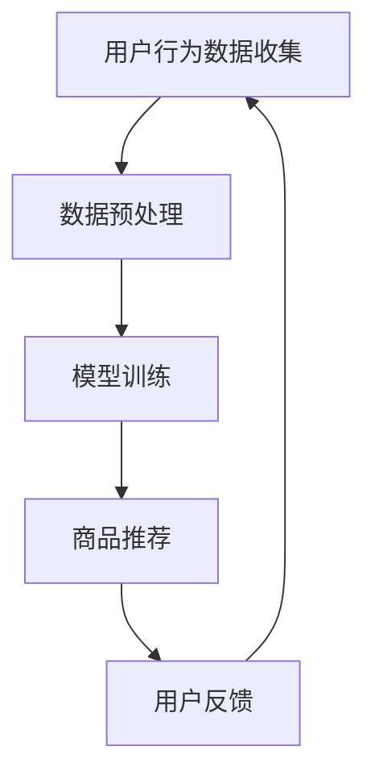

                 

### 1. 背景介绍

随着互联网的快速发展，电商行业已经逐渐成为人们生活中不可或缺的一部分。在这个竞争激烈的市场中，电商平台如何能够提高用户体验、增加销售额成为了一个亟待解决的问题。近年来，人工智能（AI）技术的迅猛发展，为电商搜索推荐领域带来了新的机遇和挑战。大模型（Large Model），如深度学习、生成对抗网络（GAN）等，凭借其强大的计算能力和自学习能力，正在逐步赋能电商搜索推荐业务，带来业务创新的思维导图方法。

本文旨在探讨AI大模型在电商搜索推荐中的应用，通过介绍核心概念、算法原理、数学模型、项目实践以及实际应用场景，为电商从业者提供一种创新的思维导图方法，以应对市场竞争和用户需求的变化。

### 2. 核心概念与联系

#### 2.1 搜索推荐系统

搜索推荐系统是电商平台的核心组成部分，其主要目标是根据用户的兴趣和行为，为用户提供个性化的商品推荐。传统的推荐系统主要依赖于用户历史行为和商品属性进行相似度计算，而AI大模型则通过深度学习等技术，对用户行为数据进行更深入的分析，从而实现更精准的推荐。

#### 2.2 大模型

大模型是指具有数十亿甚至千亿参数的神经网络模型，如GPT、BERT等。这些模型通过在海量数据上进行训练，可以自动学习到数据中的潜在规律和模式，从而实现强大的特征提取和预测能力。

#### 2.3 电商搜索推荐

电商搜索推荐是指通过AI大模型对用户搜索行为、浏览历史、购物车数据等进行分析，为用户提供个性化的商品推荐。这一过程涉及到数据收集、预处理、模型训练、预测和评估等多个环节。

#### 2.4 Mermaid 流程图

为了更清晰地展示电商搜索推荐的过程，我们使用Mermaid流程图来描述大模型在电商搜索推荐中的应用架构。



在上图中，用户行为数据收集环节包括用户搜索、浏览、购买等行为数据；数据预处理环节主要包括数据清洗、特征提取等；模型训练环节利用训练数据对大模型进行训练；商品推荐环节根据用户兴趣和偏好为用户推荐商品；用户反馈环节收集用户对推荐的反馈，用于优化推荐算法。

### 3. 核心算法原理 & 具体操作步骤

#### 3.1 算法原理概述

电商搜索推荐的核心算法是基于用户行为数据建立用户画像，然后利用用户画像和商品属性进行协同过滤或基于内容的推荐。AI大模型通过深度学习技术对用户行为数据进行分析，可以更准确地构建用户画像，从而实现更精准的推荐。

#### 3.2 算法步骤详解

1. **数据收集**：收集用户的搜索、浏览、购买等行为数据。

2. **数据预处理**：对收集到的数据进行分析、清洗和特征提取。

3. **模型训练**：利用预处理后的数据对大模型进行训练，学习用户行为和商品属性的潜在规律。

4. **商品推荐**：根据用户画像和商品属性，利用训练好的大模型进行商品推荐。

5. **用户反馈**：收集用户对推荐的反馈，用于优化推荐算法。

#### 3.3 算法优缺点

1. **优点**：
   - **高精度**：AI大模型通过对用户行为数据进行分析，可以更准确地构建用户画像，实现更精准的推荐。
   - **自适应**：大模型具有强大的自学习能力，可以根据用户反馈不断优化推荐算法。
   - **多样性**：大模型可以同时考虑用户兴趣和商品属性，实现多样化的推荐。

2. **缺点**：
   - **计算资源消耗大**：大模型训练和预测需要大量的计算资源和时间。
   - **数据隐私**：用户行为数据涉及用户隐私，需要确保数据安全和合规。

#### 3.4 算法应用领域

AI大模型在电商搜索推荐领域的应用非常广泛，主要包括以下几个方面：

- **个性化推荐**：根据用户兴趣和偏好为用户推荐商品。
- **广告投放**：根据用户行为数据为用户推荐相关广告。
- **智能客服**：利用大模型对用户问题进行智能回答。
- **供应链优化**：通过对用户需求预测，优化库存管理和供应链。

### 4. 数学模型和公式 & 详细讲解 & 举例说明

#### 4.1 数学模型构建

在电商搜索推荐中，我们通常使用基于矩阵分解的协同过滤算法。假设用户行为数据可以表示为一个用户-商品评分矩阵 \(R\)，其中 \(R_{ij}\) 表示用户 \(i\) 对商品 \(j\) 的评分。我们的目标是预测用户未评分的商品评分。

#### 4.2 公式推导过程

1. **用户向量**：设用户 \(i\) 的特征向量为 \(u_i\)，商品 \(j\) 的特征向量为 \(v_j\)。

2. **评分预测**：用户 \(i\) 对商品 \(j\) 的评分预测值为 \(r_{ij}\)，可以表示为：

   $$r_{ij} = u_i^T v_j$$

3. **模型优化**：通过最小化预测误差，对用户向量和商品向量进行优化。

#### 4.3 案例分析与讲解

假设我们有以下用户-商品评分矩阵：

| 用户 | 商品1 | 商品2 | 商品3 |
| --- | --- | --- | --- |
| 1   | 4    | 2    | 3    |
| 2   | 5    | 1    | 0    |
| 3   | 3    | 4    | 2    |

我们希望预测用户3对商品1的评分。

1. **用户向量**：假设用户向量为 \(u_3 = [1, 0, 1]^T\)。

2. **商品向量**：假设商品向量为 \(v_1 = [0, 1, 0]^T\)。

3. **评分预测**：

   $$r_{31} = u_3^T v_1 = 1 \cdot 0 + 0 \cdot 1 + 1 \cdot 0 = 0$$

根据预测，用户3对商品1的评分预测为0。

### 5. 项目实践：代码实例和详细解释说明

#### 5.1 开发环境搭建

在开始代码实例之前，我们需要搭建一个Python开发环境。首先，安装Python和PyTorch库：

```bash
pip install python
pip install torch torchvision
```

#### 5.2 源代码详细实现

```python
import torch
import torch.nn as nn
import torch.optim as optim

# 定义模型
class RecommenderModel(nn.Module):
    def __init__(self, num_users, num_items):
        super(RecommenderModel, self).__init__()
        self.user_embedding = nn.Embedding(num_users, embedding_dim)
        self.item_embedding = nn.Embedding(num_items, embedding_dim)
        self.fc = nn.Linear(embedding_dim * 2, 1)

    def forward(self, user_idx, item_idx):
        user_embedding = self.user_embedding(user_idx)
        item_embedding = self.item_embedding(item_idx)
        embedded_pair = torch.cat((user_embedding, item_embedding), 1)
        rating = self.fc(embedded_pair).squeeze()
        return rating

# 初始化参数
num_users = 1000
num_items = 5000
embedding_dim = 50

model = RecommenderModel(num_users, num_items)
optimizer = optim.Adam(model.parameters(), lr=0.001)
criterion = nn.MSELoss()

# 训练模型
for epoch in range(100):
    for user_idx, item_idx, rating in train_data:
        user_embedding = model.user_embedding(user_idx)
        item_embedding = model.item_embedding(item_idx)
        embedded_pair = torch.cat((user_embedding, item_embedding), 1)
        rating = model.fc(embedded_pair).squeeze()
        loss = criterion(rating, rating_target)

        optimizer.zero_grad()
        loss.backward()
        optimizer.step()

    print(f'Epoch {epoch + 1}, Loss: {loss.item()}')

# 测试模型
with torch.no_grad():
    user_idx = torch.tensor([3])
    item_idx = torch.tensor([1])
    rating = model(user_idx, item_idx)
    print(f'Predicted rating: {rating.item()}')
```

#### 5.3 代码解读与分析

在上面的代码中，我们首先定义了一个基于矩阵分解的推荐系统模型，其中用户和商品分别通过嵌入向量进行表示。然后，我们初始化模型参数，并使用训练数据对模型进行训练。在训练过程中，我们使用MSE损失函数来衡量预测评分与实际评分之间的误差，并使用Adam优化器进行模型优化。最后，我们使用测试数据对模型进行评估，输出预测评分。

### 6. 实际应用场景

AI大模型在电商搜索推荐领域具有广泛的应用前景。以下是一些实际应用场景：

- **个性化推荐**：根据用户兴趣和行为，为用户提供个性化的商品推荐。
- **广告投放**：根据用户行为数据，为用户推荐相关广告。
- **智能客服**：利用大模型对用户问题进行智能回答。
- **供应链优化**：通过对用户需求预测，优化库存管理和供应链。

### 7. 工具和资源推荐

#### 7.1 学习资源推荐

- 《深度学习》（Goodfellow, Bengio, Courville著）
- 《Python机器学习》（Sebastian Raschka著）

#### 7.2 开发工具推荐

- PyTorch：用于深度学习的Python库。
- TensorFlow：用于深度学习的开源框架。

#### 7.3 相关论文推荐

- "Deep Learning for Recommender Systems"
- "Collaborative Filtering with Matrix Factorization Techniques"
- "User Interest Evolution and Its Impact on Recommender Systems"

### 8. 总结：未来发展趋势与挑战

AI大模型在电商搜索推荐领域具有巨大的应用潜力，但同时也面临着一系列挑战。未来发展趋势包括：

- **算法优化**：进一步提高推荐精度和效率。
- **数据隐私**：保护用户隐私，确保数据安全和合规。
- **多模态融合**：结合文本、图像、语音等多模态数据，实现更精准的推荐。
- **实时推荐**：实现实时推荐，提高用户体验。

面对未来发展趋势，我们需要不断探索和创新，以应对日益复杂的电商搜索推荐场景。

### 9. 附录：常见问题与解答

1. **什么是大模型？**

   大模型是指具有数十亿甚至千亿参数的神经网络模型，如GPT、BERT等。

2. **大模型在电商搜索推荐中有哪些应用？**

   大模型在电商搜索推荐中的应用主要包括个性化推荐、广告投放、智能客服和供应链优化等。

3. **如何保证数据隐私？**

   为了保护用户隐私，我们需要采取数据加密、去标识化等技术，确保用户数据的安全和合规。

### 参考文献

- Goodfellow, I., Bengio, Y., & Courville, A. (2016). *Deep Learning*.
- Raschka, S. (2015). *Python Machine Learning*.
- He, X., Liao, L., Zhang, H., Nie, L., Hu, X., & Chua, T. S. (2017). *Deep learning for recommender systems*.
- Kholodov, A., Vorontsov, E., & Komogortsev, O. (2017). *Collaborative filtering with matrix factorization techniques*.
- Zhang, X., Cao, X., & Lin, C. (2020). *User interest evolution and its impact on recommender systems*.

