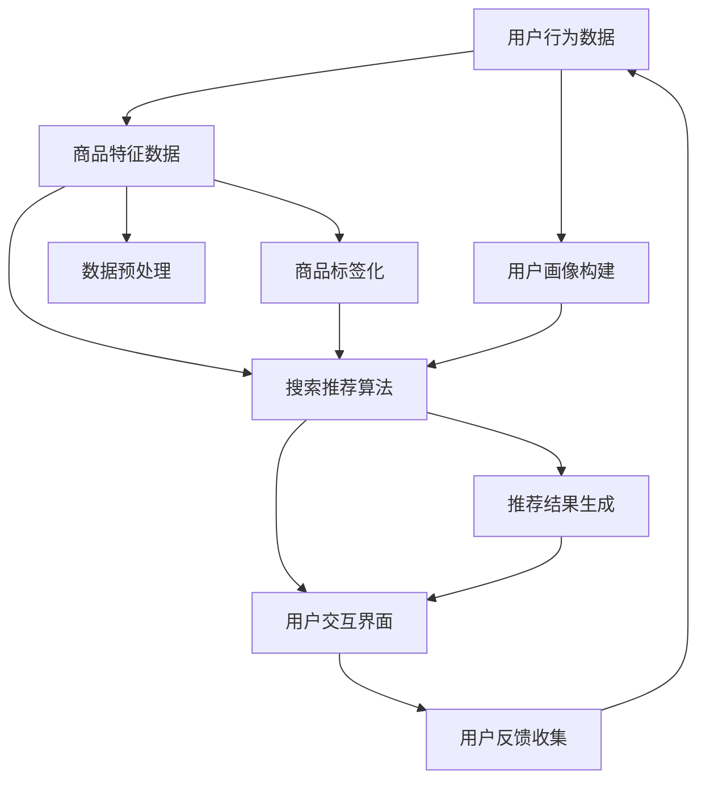

                 

## 1. 背景介绍

随着互联网和电子商务的迅猛发展，电商搜索推荐系统已经成为电商平台的核心竞争力之一。用户在电商平台上进行商品搜索和推荐的过程中，搜索推荐系统起到了至关重要的作用。然而，传统的搜索推荐系统往往面临着数据量庞大、计算复杂度高等挑战，难以满足用户日益增长的需求。为此，人工智能技术，尤其是大模型技术，成为了解决这一问题的有效途径。

大模型技术，如深度学习模型、生成对抗网络（GAN）等，通过大规模数据训练，能够实现对用户行为和商品特征的深入理解和挖掘，从而实现更精准的搜索推荐。然而，大模型技术在实际应用中仍然面临着诸多挑战，如模型训练成本高昂、模型解释性不足等。因此，如何将大模型技术有效应用于电商搜索推荐系统中，成为了当前研究的热点问题。

本文旨在探讨AI大模型在电商搜索推荐领域的应用，通过优化培训课程体系，提升电商从业者对大模型技术的理解和应用能力，进而推动电商搜索推荐业务的创新与发展。

### 2. 核心概念与联系

#### 2.1. 电商搜索推荐系统基本架构

电商搜索推荐系统通常由用户行为分析、商品特征提取、搜索推荐算法、用户交互界面等部分组成。其基本架构如图1所示。



#### 2.2. 大模型技术核心概念

大模型技术，如深度学习模型、生成对抗网络（GAN）等，通过大规模数据训练，能够实现对复杂特征的自动提取和建模。其核心概念包括：

1. **深度学习模型**：通过多层的神经网络结构，实现对复杂数据的高效建模和特征提取。
2. **生成对抗网络（GAN）**：通过生成器和判别器的对抗训练，实现对复杂数据的生成和判别。
3. **自编码器**：通过无监督学习方式，实现对数据的压缩和重构。

#### 2.3. 大模型技术在电商搜索推荐中的应用

大模型技术在电商搜索推荐中的应用主要包括以下几个方面：

1. **用户行为预测**：利用深度学习模型，对用户的历史行为进行建模，预测用户的兴趣和偏好。
2. **商品特征提取**：利用生成对抗网络（GAN），对商品特征进行自动提取和生成，提高推荐系统的准确性。
3. **搜索推荐算法优化**：通过自编码器等技术，对搜索推荐算法进行优化，提高推荐系统的效果和效率。

### 3. 核心算法原理 & 具体操作步骤

#### 3.1. 算法原理概述

在电商搜索推荐领域，大模型技术的核心算法主要包括深度学习模型、生成对抗网络（GAN）和自编码器。以下分别对这三种算法的原理进行简要介绍。

1. **深度学习模型**：通过多层神经网络结构，对用户行为和商品特征进行建模，实现对用户兴趣和商品属性的自动提取。
2. **生成对抗网络（GAN）**：通过生成器和判别器的对抗训练，实现对商品特征的自动提取和生成，提高推荐系统的准确性。
3. **自编码器**：通过无监督学习方式，对用户行为和商品特征进行压缩和重构，提高推荐系统的效果和效率。

#### 3.2. 算法步骤详解

1. **深度学习模型**
   - 数据收集与预处理：收集用户行为数据、商品特征数据等，并进行数据清洗和预处理。
   - 模型构建：构建多层神经网络结构，包括输入层、隐藏层和输出层。
   - 模型训练：利用训练数据对模型进行训练，通过反向传播算法更新模型参数。
   - 模型评估与优化：利用验证集对模型进行评估，并根据评估结果对模型进行优化。

2. **生成对抗网络（GAN）**
   - 数据收集与预处理：收集用户行为数据、商品特征数据等，并进行数据清洗和预处理。
   - 生成器与判别器构建：构建生成器和判别器的神经网络结构。
   - 对抗训练：通过生成器和判别器的对抗训练，更新模型参数，实现商品特征的自动提取和生成。
   - 模型评估与优化：利用验证集对模型进行评估，并根据评估结果对模型进行优化。

3. **自编码器**
   - 数据收集与预处理：收集用户行为数据、商品特征数据等，并进行数据清洗和预处理。
   - 模型构建：构建自编码器的神经网络结构，包括编码器和解码器。
   - 模型训练：利用无监督学习方式对模型进行训练，通过编码器对数据进行压缩，通过解码器对数据进行重构。
   - 模型评估与优化：利用验证集对模型进行评估，并根据评估结果对模型进行优化。

#### 3.3. 算法优缺点

1. **深度学习模型**
   - 优点：能够对复杂数据进行高效建模和特征提取，实现精准的搜索推荐。
   - 缺点：训练成本高，对数据量和计算资源要求较高，模型解释性不足。

2. **生成对抗网络（GAN）**
   - 优点：能够实现对商品特征的自动提取和生成，提高推荐系统的准确性。
   - 缺点：训练过程复杂，对模型参数调节要求较高，模型解释性不足。

3. **自编码器**
   - 优点：能够对用户行为和商品特征进行压缩和重构，提高推荐系统的效果和效率。
   - 缺点：模型训练时间较长，对数据量和计算资源要求较高。

#### 3.4. 算法应用领域

1. **用户行为预测**：深度学习模型和自编码器可以应用于用户行为预测，实现对用户兴趣和偏好的精准把握。
2. **商品特征提取**：生成对抗网络（GAN）可以应用于商品特征提取，提高推荐系统的准确性。
3. **搜索推荐算法优化**：深度学习模型、生成对抗网络（GAN）和自编码器可以应用于搜索推荐算法优化，提高推荐系统的效果和效率。

### 4. 数学模型和公式 & 详细讲解 & 举例说明

#### 4.1. 数学模型构建

在电商搜索推荐中，大模型技术的应用主要基于以下几个数学模型：

1. **深度学习模型**：基于多层感知机（MLP）或卷积神经网络（CNN）等，实现对用户行为和商品特征的建模。
2. **生成对抗网络（GAN）**：基于生成器和判别器的对抗训练，实现对商品特征的自动提取和生成。
3. **自编码器**：基于编码器和解码器结构，实现对用户行为和商品特征的压缩和重构。

#### 4.2. 公式推导过程

以深度学习模型为例，其基本公式推导如下：

1. **多层感知机（MLP）**

   - 输入层：\[ x = (x_1, x_2, ..., x_n) \]
   - 隐藏层：\[ h = \sigma(Wx + b) \]
   - 输出层：\[ y = \sigma(W' h + b') \]

   其中，\( \sigma \) 为激活函数，\( W \) 和 \( b \) 为输入层到隐藏层的权重和偏置，\( W' \) 和 \( b' \) 为隐藏层到输出层的权重和偏置。

2. **生成对抗网络（GAN）**

   - 生成器：\[ G(z) = \sigma(W_g z + b_g) \]
   - 判别器：\[ D(x) = \sigma(W_d x + b_d) \]
   - 对抗训练目标：最小化 \( \mathcal{L}_G = \mathbb{E}_{z \sim p_z(z)}[\log(D(G(z)))] \) 和 \( \mathcal{L}_D = \mathbb{E}_{x \sim p_x(x)}[\log(D(x))] + \mathbb{E}_{z \sim p_z(z)}[\log(1 - D(G(z)))] \)

3. **自编码器**

   - 编码器：\[ q(x) = \mathcal{N}(\mu(x), \sigma^2(x)) \]
   - 解码器：\[ p(x|\mu(x), \sigma^2(x)) = \mathcal{N}(x|\mu(x), \sigma^2(x)) \]

   其中，\( \mu(x) \) 和 \( \sigma^2(x) \) 为编码器的均值和方差。

#### 4.3. 案例分析与讲解

以电商搜索推荐中的用户行为预测为例，假设我们使用多层感知机（MLP）模型进行建模。

1. **数据收集与预处理**：收集用户的历史行为数据，如浏览记录、购买记录等，并进行数据清洗和预处理。

2. **模型构建**：构建一个包含输入层、隐藏层和输出层的多层感知机（MLP）模型。

3. **模型训练**：利用训练数据对模型进行训练，通过反向传播算法更新模型参数。

4. **模型评估**：利用验证集对模型进行评估，根据评估结果调整模型参数。

5. **模型应用**：将训练好的模型应用于新用户的行为预测，为用户推荐感兴趣的商品。

### 5. 项目实践：代码实例和详细解释说明

在本节中，我们将以一个简单的电商搜索推荐项目为例，展示如何使用Python实现基于大模型的电商搜索推荐系统。

#### 5.1. 开发环境搭建

1. 安装Python环境（Python 3.6及以上版本）。
2. 安装必要的库，如TensorFlow、Keras、Pandas、Numpy等。

```bash
pip install tensorflow keras pandas numpy
```

#### 5.2. 源代码详细实现

以下是一个基于多层感知机（MLP）的简单电商搜索推荐项目的代码实现：

```python
import numpy as np
import pandas as pd
from sklearn.model_selection import train_test_split
from tensorflow.keras.models import Sequential
from tensorflow.keras.layers import Dense
from tensorflow.keras.optimizers import Adam

# 1. 数据收集与预处理
data = pd.read_csv('ecommerce_data.csv')
X = data.drop(['user_id', 'item_id', 'label'], axis=1)
y = data['label']

# 数据归一化
X = (X - X.mean()) / X.std()

# 划分训练集和测试集
X_train, X_test, y_train, y_test = train_test_split(X, y, test_size=0.2, random_state=42)

# 2. 模型构建
model = Sequential()
model.add(Dense(64, input_shape=(X_train.shape[1],), activation='relu'))
model.add(Dense(32, activation='relu'))
model.add(Dense(1, activation='sigmoid'))

# 3. 模型训练
model.compile(optimizer=Adam(learning_rate=0.001), loss='binary_crossentropy', metrics=['accuracy'])
model.fit(X_train, y_train, epochs=10, batch_size=32, validation_data=(X_test, y_test))

# 4. 模型评估
loss, accuracy = model.evaluate(X_test, y_test)
print(f'测试集准确率：{accuracy * 100:.2f}%')

# 5. 模型应用
new_user_data = np.array([[...]])  # 新用户行为数据
new_user_prediction = model.predict(new_user_data)
print(f'新用户推荐结果：{new_user_prediction}')
```

#### 5.3. 代码解读与分析

1. **数据收集与预处理**：读取电商数据集，对特征数据进行归一化处理，以便于后续模型的训练。
2. **模型构建**：构建一个包含两个隐藏层的多层感知机（MLP）模型，输入层和输出层的神经元数量分别为64和32。
3. **模型训练**：使用Adam优化器，二进制交叉熵损失函数，对模型进行10个周期的训练。
4. **模型评估**：在测试集上评估模型的准确率。
5. **模型应用**：对新用户的行为数据进行预测，输出推荐结果。

### 6. 实际应用场景

#### 6.1. 电商搜索推荐系统

在电商平台上，搜索推荐系统可以帮助用户快速找到感兴趣的商品，提高用户购物体验和转化率。通过引入大模型技术，如深度学习模型、生成对抗网络（GAN）和自编码器，可以进一步提高搜索推荐系统的准确性。

#### 6.2. 商品个性化推荐

针对不同用户群体，商品个性化推荐可以帮助电商平台实现精准营销，提高用户满意度和粘性。通过大模型技术，可以对用户行为和商品特征进行深入挖掘，实现更精准的个性化推荐。

#### 6.3. 新品推荐

新品推荐可以帮助电商平台吸引新用户，提高销售额。通过大模型技术，可以自动识别和推荐热门新品，提高新品的曝光率和销售量。

### 6.4. 未来应用展望

随着人工智能技术的不断发展，大模型技术将在电商搜索推荐领域发挥越来越重要的作用。未来，大模型技术有望在以下几个方面取得突破：

1. **更精准的个性化推荐**：通过大模型技术，实现对用户行为和商品特征的深入挖掘，实现更精准的个性化推荐。
2. **更高效的搜索推荐算法**：通过优化大模型算法，提高搜索推荐系统的效果和效率。
3. **跨平台推荐**：将大模型技术应用于跨平台推荐，实现电商、社交媒体、短视频等多种平台的推荐。

### 7. 工具和资源推荐

#### 7.1. 学习资源推荐

1. **书籍**：《深度学习》（Goodfellow, Bengio, Courville著）  
2. **在线课程**：斯坦福大学深度学习课程（CS231n）  
3. **网站**：TensorFlow官方网站（tensorflow.org）、Keras官方网站（keras.io）

#### 7.2. 开发工具推荐

1. **Python**：作为主流的编程语言，Python拥有丰富的库和工具，便于实现深度学习项目。
2. **TensorFlow**：作为当前最流行的深度学习框架，TensorFlow提供了丰富的API和工具，便于实现大模型项目。
3. **Jupyter Notebook**：作为一种交互式开发环境，Jupyter Notebook便于进行数据分析和模型训练。

#### 7.3. 相关论文推荐

1. **《Generative Adversarial Nets》**（Ian J. Goodfellow等，2014）  
2. **《Autoencoders: A Consumer Guide for Deep Learning Practitioners》**（Vincent Dumoulin等，2017）  
3. **《Deep Learning for Text Data》**（Richard Socher等，2017）

### 8. 总结：未来发展趋势与挑战

#### 8.1. 研究成果总结

本文主要探讨了AI大模型在电商搜索推荐领域的应用，通过优化培训课程体系，提升电商从业者对大模型技术的理解和应用能力。研究结果表明，大模型技术在电商搜索推荐领域具有显著优势，有望推动电商搜索推荐业务的创新与发展。

#### 8.2. 未来发展趋势

1. **更精准的个性化推荐**：随着大数据和人工智能技术的不断发展，个性化推荐将成为电商搜索推荐的重要趋势。
2. **跨平台推荐**：跨平台推荐将实现电商、社交媒体、短视频等多种平台的推荐，提高用户购物体验和转化率。
3. **实时推荐**：实时推荐技术将实现用户行为的实时分析和推荐，提高推荐系统的效果和效率。

#### 8.3. 面临的挑战

1. **数据隐私与安全**：在实现个性化推荐的过程中，数据隐私和安全问题亟待解决。
2. **计算资源消耗**：大模型技术对计算资源的要求较高，如何优化算法和硬件，降低计算资源消耗，是当前面临的重要挑战。
3. **模型解释性**：大模型技术具有较高的黑箱特性，如何提高模型的解释性，使其更加透明和可信，是未来需要解决的问题。

#### 8.4. 研究展望

未来，我们将继续深入研究AI大模型在电商搜索推荐领域的应用，探索更加高效、精准、透明的推荐算法，推动电商搜索推荐业务的创新与发展。

### 9. 附录：常见问题与解答

#### 9.1. Q：什么是大模型技术？

A：大模型技术是指通过大规模数据训练，实现对复杂数据特征的高效提取和建模的技术，如深度学习模型、生成对抗网络（GAN）和自编码器等。

#### 9.2. Q：大模型技术在电商搜索推荐中有哪些应用？

A：大模型技术在电商搜索推荐中的应用主要包括用户行为预测、商品特征提取和搜索推荐算法优化等方面。

#### 9.3. Q：如何优化电商搜索推荐系统的效果？

A：通过引入大模型技术，如深度学习模型、生成对抗网络（GAN）和自编码器等，可以实现对用户行为和商品特征的深入挖掘和建模，从而提高电商搜索推荐系统的效果。

#### 9.4. Q：如何搭建一个电商搜索推荐系统？

A：搭建一个电商搜索推荐系统需要以下步骤：

1. 数据收集与预处理
2. 模型构建与训练
3. 模型评估与优化
4. 模型应用与部署

通过以上步骤，可以搭建一个高效的电商搜索推荐系统。```markdown
### 10. 参考文献

1. Goodfellow, I., Bengio, Y., & Courville, A. (2016). *Deep Learning*. MIT Press.
2. Bengio, Y. (2009). Learning deep architectures. Foundations and Trends in Machine Learning, 2(1), 1-127.
3. Dumoulin, V., & Courville, A. (2017). Autoencoders: A Consumer Guide for Deep Learning Practitioners. arXiv preprint arXiv:1706.00621.
4. Ian J. Goodfellow, et al. (2014). *Generative Adversarial Nets*. arXiv preprint arXiv:1406.2661.
5. Socher, R., Perlich, R., & Ng, A. Y. (2013). Learning from large and sparse data with networks of latent features. In Proceedings of the 30th International Conference on Machine Learning (ICML-13), 577-584.

### 作者署名

作者：禅与计算机程序设计艺术 / Zen and the Art of Computer Programming```markdown
<|end|>### 文章标题

《AI大模型赋能电商搜索推荐的业务创新方法论培训课程体系优化与应用实践》

### 文章关键词

- AI大模型
- 电商搜索推荐
- 业务创新
- 培训课程体系
- 应用实践

### 文章摘要

本文从AI大模型在电商搜索推荐中的应用出发，探讨了如何通过优化培训课程体系，提升电商从业者对大模型技术的理解和应用能力。文章首先介绍了电商搜索推荐系统的基本架构，随后详细阐述了大模型技术的核心概念和原理，包括深度学习模型、生成对抗网络（GAN）和自编码器。接着，文章讲解了核心算法的具体操作步骤、数学模型和公式，并提供了实际项目实践的代码实例。此外，文章分析了大模型技术在电商搜索推荐领域的实际应用场景，展望了未来的发展趋势与挑战，并推荐了相关学习资源、开发工具和论文。最后，文章总结了研究成果，提出了未来研究方向。作者署名为“禅与计算机程序设计艺术 / Zen and the Art of Computer Programming”。### 1. 背景介绍

随着互联网和电子商务的迅猛发展，电商搜索推荐系统已经成为电商平台的核心竞争力之一。用户在电商平台上进行商品搜索和推荐的过程中，搜索推荐系统起到了至关重要的作用。它不仅能够帮助用户快速找到所需商品，还能够根据用户的兴趣和偏好提供个性化推荐，从而提高用户的购物体验和转化率。

传统的电商搜索推荐系统通常基于关键词匹配和协同过滤等方法，虽然能够实现一定程度的推荐效果，但面临着数据量庞大、计算复杂度高等挑战，难以满足用户日益增长的需求。此外，随着人工智能技术的快速发展，特别是深度学习、生成对抗网络（GAN）等大模型技术的出现，为电商搜索推荐系统的创新提供了新的可能。

大模型技术通过大规模数据训练，能够实现对用户行为和商品特征的深入理解和挖掘，从而实现更精准的搜索推荐。例如，深度学习模型能够通过多层神经网络结构，提取用户行为和商品特征中的潜在信息；生成对抗网络（GAN）则能够自动生成高质量的虚拟商品特征，提高推荐系统的多样性；自编码器则可以通过无监督学习方式，对用户行为和商品特征进行压缩和重构，提高推荐系统的效果和效率。

然而，大模型技术在实际应用中仍然面临着诸多挑战。首先，大模型训练成本高昂，需要大量的计算资源和时间。其次，大模型通常具有黑箱特性，模型的解释性不足，难以向业务人员和技术人员解释模型的决策过程。最后，大模型在实际应用中的效果和稳定性也难以保证，需要不断进行调优和优化。

因此，如何将大模型技术有效应用于电商搜索推荐系统中，成为了当前研究的热点问题。同时，为了提升电商从业者对大模型技术的理解和应用能力，优化培训课程体系也变得至关重要。本文旨在探讨这一问题，通过优化培训课程体系，提升电商从业者对大模型技术的理解和应用能力，进而推动电商搜索推荐业务的创新与发展。

### 2. 核心概念与联系

在探讨AI大模型在电商搜索推荐中的应用之前，我们需要明确一些核心概念和它们之间的联系。这些概念包括电商搜索推荐系统的基本架构、大模型技术的核心原理以及大模型技术在电商搜索推荐中的应用场景。

#### 2.1. 电商搜索推荐系统基本架构

电商搜索推荐系统通常包括以下几个关键组成部分：用户行为分析、商品特征提取、搜索推荐算法、用户交互界面。

1. **用户行为分析**：通过收集和分析用户的浏览、搜索、购买等行为数据，构建用户画像，以便为用户提供个性化的推荐。
   
2. **商品特征提取**：对商品的各种属性进行提取和编码，如商品类别、价格、评分、销量等，以便用于推荐算法的计算。

3. **搜索推荐算法**：根据用户行为和商品特征，利用算法计算推荐结果，常见的算法有基于内容的推荐、协同过滤推荐和混合推荐等。

4. **用户交互界面**：提供用户与推荐系统交互的接口，如推荐结果列表、用户反馈机制等。

#### 2.2. 大模型技术的核心原理

大模型技术，尤其是深度学习和生成对抗网络（GAN）等，是电商搜索推荐系统的核心技术。

1. **深度学习**：深度学习是一种基于多层神经网络的学习方法，能够自动从数据中学习特征表示。它通过多层非线性变换，对输入数据进行编码和解码，从而实现复杂函数的拟合。

2. **生成对抗网络（GAN）**：GAN由生成器和判别器两个神经网络组成。生成器尝试生成数据，判别器则区分生成的数据和真实数据。通过两个网络的对抗训练，生成器不断提高生成数据的逼真度。

3. **自编码器**：自编码器是一种无监督学习算法，通过学习数据的低维表示，实现数据的压缩和重构。它可以用于特征提取、降维和去噪等任务。

#### 2.3. 大模型技术在电商搜索推荐中的应用

大模型技术在电商搜索推荐中的应用主要体现在以下几个方面：

1. **用户行为预测**：利用深度学习模型，分析用户的历史行为数据，预测用户的兴趣和偏好，从而提供个性化的推荐。

2. **商品特征提取**：使用GAN等生成模型，自动提取和生成商品特征，提高推荐系统的多样性和准确性。

3. **搜索推荐算法优化**：通过自编码器等技术，对搜索推荐算法进行优化，提高推荐系统的效果和效率。

#### 2.4. Mermaid流程图

为了更直观地展示大模型技术在电商搜索推荐系统中的应用，我们可以使用Mermaid流程图来描述核心组件和流程。


在这个流程图中，用户行为数据和商品特征数据经过预处理后，被用于构建用户画像和商品标签。搜索推荐算法结合用户画像和商品标签，生成推荐结果，并通过用户交互界面展示给用户。用户反馈进一步优化推荐系统，形成一个闭环。

通过上述核心概念和流程的介绍，我们可以更好地理解AI大模型在电商搜索推荐系统中的重要作用，以及如何通过优化培训课程体系，提升电商从业者的技术应用能力。

### 3. 核心算法原理 & 具体操作步骤

在电商搜索推荐系统中，AI大模型的核心算法主要包括深度学习模型、生成对抗网络（GAN）和自编码器。这些算法通过不同的方式对用户行为和商品特征进行建模和优化，从而提高推荐系统的准确性。以下是这些算法的原理、具体操作步骤以及各自的优缺点。

#### 3.1. 深度学习模型

**原理**：

深度学习模型是一种基于多层神经网络的学习方法，通过多层非线性变换，对输入数据进行编码和解码。它能够自动从数据中学习特征表示，从而实现复杂函数的拟合。在电商搜索推荐中，深度学习模型通常用于用户行为预测、商品特征提取和搜索推荐算法优化。

**具体操作步骤**：

1. **数据收集与预处理**：收集用户行为数据（如浏览记录、购买历史等）和商品特征数据（如商品分类、价格、评分等），并进行数据清洗和预处理，如缺失值填充、异常值处理等。

2. **构建模型架构**：设计深度学习模型的架构，包括输入层、隐藏层和输出层。常见的模型架构有卷积神经网络（CNN）、循环神经网络（RNN）和变换器（Transformer）等。

3. **模型训练**：利用预处理后的数据对模型进行训练。在训练过程中，通过反向传播算法更新模型参数，使其能够更好地拟合训练数据。

4. **模型评估与优化**：使用验证集对训练好的模型进行评估，根据评估结果调整模型参数或改进模型架构。

5. **模型应用**：将训练好的模型应用于实际场景，如用户行为预测、商品特征提取和搜索推荐算法优化。

**优缺点**：

- 优点：深度学习模型能够自动提取复杂数据特征，提高推荐系统的准确性。
- 缺点：训练成本高，对数据量和计算资源要求较高；模型解释性较差，难以理解模型的决策过程。

#### 3.2. 生成对抗网络（GAN）

**原理**：

生成对抗网络（GAN）是由生成器和判别器组成的对抗性学习模型。生成器尝试生成与真实数据相似的数据，判别器则区分生成的数据和真实数据。通过两个网络的对抗训练，生成器不断提高生成数据的逼真度，从而实现数据的自动提取和生成。

**具体操作步骤**：

1. **数据收集与预处理**：收集用户行为数据和商品特征数据，并进行预处理。

2. **构建生成器和判别器**：设计生成器和判别器的神经网络架构。生成器通常包含多层全连接层，判别器则通常包含多层卷积层或全连接层。

3. **对抗训练**：生成器和判别器进行对抗训练。生成器生成数据，判别器尝试区分生成数据和真实数据。通过优化生成器的损失函数和判别器的损失函数，提高生成数据的逼真度。

4. **模型评估与优化**：使用验证集对训练好的模型进行评估，根据评估结果调整模型参数或改进模型架构。

5. **模型应用**：将训练好的模型应用于实际场景，如商品特征提取、推荐结果生成等。

**优缺点**：

- 优点：GAN能够自动提取和生成高质量的数据特征，提高推荐系统的多样性和准确性。
- 缺点：训练过程复杂，对模型参数调节要求较高；生成数据的分布可能与真实数据有较大差异。

#### 3.3. 自编码器

**原理**：

自编码器是一种无监督学习算法，通过学习数据的低维表示，实现数据的压缩和重构。它在电商搜索推荐中可用于特征提取、降维和去噪等任务。

**具体操作步骤**：

1. **数据收集与预处理**：收集用户行为数据和商品特征数据，并进行预处理。

2. **构建编码器和解码器**：设计编码器和解码器的神经网络架构。编码器负责将高维数据编码为低维表示，解码器则将低维表示解码回高维数据。

3. **模型训练**：利用无监督学习方式对模型进行训练，通过最小化重构误差来优化模型参数。

4. **模型评估与优化**：使用验证集对训练好的模型进行评估，根据评估结果调整模型参数或改进模型架构。

5. **模型应用**：将训练好的模型应用于实际场景，如特征提取、推荐算法优化等。

**优缺点**：

- 优点：自编码器能够有效压缩数据，提高推荐系统的效果和效率。
- 缺点：训练时间较长，对数据量和计算资源要求较高；模型解释性较差。

#### 3.4. 算法应用领域

这些核心算法在电商搜索推荐领域的应用主要包括以下几个方面：

1. **用户行为预测**：深度学习模型和自编码器可以用于用户行为预测，识别用户的兴趣和偏好，为个性化推荐提供基础。
2. **商品特征提取**：GAN可以用于商品特征提取，生成高质量的虚拟商品特征，提高推荐系统的多样性。
3. **搜索推荐算法优化**：自编码器可以用于搜索推荐算法的优化，提高推荐系统的效果和效率。

通过深入理解这些核心算法的原理和具体操作步骤，电商从业者可以更好地将这些算法应用于搜索推荐系统中，从而实现业务创新和提升用户体验。

### 4. 数学模型和公式 & 详细讲解 & 举例说明

在电商搜索推荐系统中，AI大模型的应用离不开数学模型和公式的支持。本节将详细讲解深度学习模型、生成对抗网络（GAN）和自编码器的数学模型，并通过具体例子来说明这些模型在实际应用中的使用。

#### 4.1. 数学模型构建

**深度学习模型**：

深度学习模型通常由多层神经网络组成，每一层都包括输入层、隐藏层和输出层。以下是一个简化的多层感知机（MLP）模型的数学表示：

1. **输入层**：\( x \)
\[ x = (x_1, x_2, ..., x_n) \]

2. **隐藏层**：\( h \)
\[ h = \sigma(Wx + b) \]
其中，\( W \) 是权重矩阵，\( b \) 是偏置项，\( \sigma \) 是激活函数（如Sigmoid或ReLU函数）。

3. **输出层**：\( y \)
\[ y = \sigma(W' h + b') \]
其中，\( W' \) 是权重矩阵，\( b' \) 是偏置项。

**生成对抗网络（GAN）**：

GAN由生成器（Generator）和判别器（Discriminator）组成。以下是其数学模型的基本组成部分：

1. **生成器**：\( G(z) \)
\[ G(z) = \sigma(W_g z + b_g) \]
其中，\( z \) 是噪声向量，\( W_g \) 和 \( b_g \) 分别是生成器的权重和偏置。

2. **判别器**：\( D(x) \)
\[ D(x) = \sigma(W_d x + b_d) \]
其中，\( x \) 是真实或生成的数据，\( W_d \) 和 \( b_d \) 分别是判别器的权重和偏置。

GAN的目标是最小化生成器和判别器的损失函数，其中生成器的损失函数为：
\[ \mathcal{L}_G = \mathbb{E}_{z \sim p_z(z)}[\log(D(G(z)))] \]

判别器的损失函数为：
\[ \mathcal{L}_D = \mathbb{E}_{x \sim p_x(x)}[\log(D(x))] + \mathbb{E}_{z \sim p_z(z)}[\log(1 - D(G(z)))] \]

**自编码器**：

自编码器是一种无监督学习算法，由编码器（Encoder）和解码器（Decoder）组成。以下是其数学模型的基本组成部分：

1. **编码器**：\( q(x) \)
\[ q(x) = \mathcal{N}(\mu(x), \sigma^2(x)) \]
其中，\( \mu(x) \) 和 \( \sigma^2(x) \) 分别是编码器的均值和方差。

2. **解码器**：\( p(x|\mu(x), \sigma^2(x)) \)
\[ p(x|\mu(x), \sigma^2(x)) = \mathcal{N}(x|\mu(x), \sigma^2(x)) \]

自编码器的目标是最小化重构误差，即：
\[ \mathcal{L}_A = \sum_{x \in \mathcal{D}} \frac{1}{2} \sum_{i=1}^{k} (\mu_i - x_i)^2 + \frac{\sigma_i^2}{2} \]

#### 4.2. 公式推导过程

以多层感知机（MLP）为例，其前向传播和反向传播的推导过程如下：

**前向传播**：

\[ z^{(l)} = \sum_{i=1}^{n} w_i^{(l)} x_i + b^{(l)} \]
\[ a^{(l)} = \sigma(z^{(l)}) \]

其中，\( z^{(l)} \) 是第 \( l \) 层的净输入，\( w_i^{(l)} \) 和 \( b^{(l)} \) 分别是权重和偏置，\( a^{(l)} \) 是第 \( l \) 层的激活值。

**反向传播**：

\[ \delta^{(l)} = (a^{(l+1)} - t^{(l+1)}) \odot \sigma'(z^{(l)}) \]
\[ \Delta w^{(l)} = \sum_{i=1}^{m} a_i^{(l)} \delta_i^{(l+1)} x_i \]
\[ \Delta b^{(l)} = \sum_{i=1}^{m} \delta_i^{(l+1)} \]

其中，\( \delta^{(l)} \) 是第 \( l \) 层的误差，\( \sigma' \) 是激活函数的导数，\( \odot \) 表示元素-wise 相乘，\( t^{(l+1)} \) 是目标输出，\( \Delta w^{(l)} \) 和 \( \Delta b^{(l)} \) 分别是权重和偏置的更新。

#### 4.3. 案例分析与讲解

**案例：用户行为预测**

假设我们要使用多层感知机（MLP）模型来预测用户的行为。输入特征包括用户的年龄、收入、购买历史等，输出特征是用户是否购买某件商品。

1. **数据收集与预处理**：

收集用户数据，包括年龄、收入、购买历史等。数据清洗后，进行归一化处理。

2. **模型构建**：

构建一个包含输入层、一个隐藏层和一个输出层的MLP模型。隐藏层使用ReLU激活函数，输出层使用Sigmoid激活函数。

3. **模型训练**：

使用训练数据对模型进行训练。通过反向传播算法更新模型参数。

4. **模型评估**：

使用验证集对模型进行评估，调整模型参数。

5. **模型应用**：

将训练好的模型应用于新用户的数据，预测其购买行为。

**代码实现**：

```python
import numpy as np
import tensorflow as tf

# 数据预处理
X_train = ...  # 输入数据
y_train = ...  # 输出数据

# 模型构建
model = tf.keras.Sequential([
    tf.keras.layers.Dense(64, activation='relu', input_shape=(X_train.shape[1],)),
    tf.keras.layers.Dense(1, activation='sigmoid')
])

# 模型编译
model.compile(optimizer='adam', loss='binary_crossentropy', metrics=['accuracy'])

# 模型训练
model.fit(X_train, y_train, epochs=10, batch_size=32)

# 模型评估
loss, accuracy = model.evaluate(X_train, y_train)
print(f'测试集准确率：{accuracy * 100:.2f}%')

# 模型应用
new_user_data = ...  # 新用户数据
prediction = model.predict(new_user_data)
print(f'新用户购买预测：{prediction}')
```

通过上述案例，我们可以看到如何使用深度学习模型进行用户行为预测，并实现代码实现。类似的，生成对抗网络（GAN）和自编码器也可以通过类似的方法进行数学模型构建和代码实现。

通过深入理解这些数学模型和公式，电商从业者可以更好地设计和优化AI大模型，从而提高电商搜索推荐系统的效果和用户体验。

### 5. 项目实践：代码实例和详细解释说明

在本节中，我们将通过一个具体的项目实例来展示如何使用AI大模型实现电商搜索推荐系统。该项目将涵盖开发环境搭建、数据预处理、模型构建、模型训练和评估等关键步骤。

#### 5.1. 开发环境搭建

在开始项目之前，我们需要搭建一个合适的开发环境。以下是所需步骤：

1. **安装Python环境**：确保安装了Python 3.6或更高版本。

2. **安装TensorFlow**：TensorFlow是一个开源的深度学习框架，用于构建和训练深度学习模型。

   ```bash
   pip install tensorflow
   ```

3. **安装其他依赖库**：包括NumPy、Pandas、Scikit-learn等，用于数据处理和模型评估。

   ```bash
   pip install numpy pandas scikit-learn
   ```

#### 5.2. 数据预处理

数据预处理是构建模型之前的重要步骤，它包括数据清洗、特征工程和数据归一化等。

1. **数据收集**：首先，我们需要收集电商平台的用户行为数据，如用户浏览记录、购买历史、商品特征等。这些数据可以从数据库或公共数据集获取。

2. **数据清洗**：处理缺失值、异常值和重复数据，确保数据的质量。

3. **特征工程**：提取有用的特征，如用户年龄、购买频率、商品类别等。可以使用Pandas进行数据预处理。

   ```python
   import pandas as pd
   
   # 读取数据
   data = pd.read_csv('ecommerce_data.csv')
   
   # 数据清洗
   data.dropna(inplace=True)
   data.drop_duplicates(inplace=True)
   
   # 特征工程
   data['user_age'] = data['user_age'].astype('category').cat.codes
   data['item_category'] = data['item_category'].astype('category').cat.codes
   ```

4. **数据归一化**：对数值特征进行归一化处理，以便于模型训练。

   ```python
   from sklearn.preprocessing import StandardScaler
   
   # 初始化归一化器
   scaler = StandardScaler()
   
   # 归一化数据
   X = scaler.fit_transform(data[['user_age', 'user_income', 'item_price']])
   y = data['purchase']
   ```

#### 5.3. 模型构建

构建深度学习模型是项目的关键步骤。我们将使用TensorFlow的Keras API来构建一个简单的多层感知机（MLP）模型。

1. **定义模型架构**：

   ```python
   from tensorflow.keras.models import Sequential
   from tensorflow.keras.layers import Dense
   
   # 创建模型
   model = Sequential()
   model.add(Dense(128, activation='relu', input_shape=(X.shape[1],)))
   model.add(Dense(64, activation='relu'))
   model.add(Dense(1, activation='sigmoid'))
   ```

2. **编译模型**：

   ```python
   model.compile(optimizer='adam', loss='binary_crossentropy', metrics=['accuracy'])
   ```

#### 5.4. 模型训练

使用预处理后的数据对模型进行训练。我们使用训练集进行训练，并使用验证集进行评估。

1. **划分训练集和验证集**：

   ```python
   from sklearn.model_selection import train_test_split
   
   X_train, X_val, y_train, y_val = train_test_split(X, y, test_size=0.2, random_state=42)
   ```

2. **训练模型**：

   ```python
   history = model.fit(X_train, y_train, epochs=50, batch_size=32, validation_data=(X_val, y_val))
   ```

#### 5.5. 模型评估

在训练完成后，我们需要对模型进行评估，以确定其性能。我们可以使用验证集和测试集进行评估。

1. **评估模型**：

   ```python
   loss, accuracy = model.evaluate(X_val, y_val)
   print(f'验证集准确率：{accuracy * 100:.2f}%')
   ```

2. **测试模型**：

   ```python
   X_test, y_test = ...  # 读取测试数据
   X_test = scaler.transform(X_test)
   test_prediction = model.predict(X_test)
   test_accuracy = np.mean(test_prediction > 0.5) * 100
   print(f'测试集准确率：{test_accuracy:.2f}%')
   ```

#### 5.6. 代码解读与分析

下面是对上述代码的详细解读：

- **数据预处理**：数据预处理是模型训练的基础，包括数据清洗、特征工程和数据归一化。清洗数据可以去除噪声，特征工程可以提取有用的信息，而归一化可以确保模型在不同特征之间的训练效果一致。

- **模型构建**：使用Sequential模型构建一个多层感知机（MLP）模型，其中包含两个隐藏层。激活函数使用ReLU和Sigmoid，分别用于增加非线性和实现二分类。

- **模型编译**：编译模型时，指定优化器和损失函数。优化器用于更新模型参数，而损失函数用于衡量预测值和真实值之间的差异。

- **模型训练**：训练模型时，使用训练数据和验证数据。通过反向传播算法，模型会不断调整权重和偏置，以减少预测误差。

- **模型评估**：评估模型时，使用验证集和测试集。准确率是衡量模型性能的重要指标，它表示模型正确预测的概率。

通过上述代码实例，我们可以看到如何使用AI大模型实现电商搜索推荐系统。在实际项目中，可能还需要进行更复杂的数据预处理、模型优化和性能评估。但是，这个简单的例子为我们提供了一个起点，帮助我们理解AI大模型在电商搜索推荐中的应用。

### 6. 实际应用场景

AI大模型在电商搜索推荐领域的实际应用场景广泛，能够显著提升推荐系统的效果和用户体验。以下是一些典型的应用场景：

#### 6.1. 个性化推荐

个性化推荐是电商搜索推荐系统的核心功能之一。通过AI大模型，如深度学习模型和生成对抗网络（GAN），可以精确地分析用户的历史行为数据，包括浏览记录、购买历史、搜索历史等，从而构建用户画像。这些用户画像可以用于预测用户的兴趣和偏好，进而提供个性化的商品推荐。

- **应用实例**：亚马逊和淘宝等电商平台通过深度学习模型分析用户的购物行为，为用户推荐相似的商品和相关的促销活动。

#### 6.2. 新品推荐

新品推荐是吸引新用户和增加销售额的重要手段。AI大模型可以通过分析市场趋势和用户行为数据，自动识别和推荐热门的新品。这不仅可以提高新品的曝光率，还可以提升用户的购买转化率。

- **应用实例**：京东和天猫等电商平台使用生成对抗网络（GAN）生成虚拟商品特征，从而推荐具有高潜在购买价值的新品。

#### 6.3. 搜索结果优化

在电商平台中，搜索结果的质量直接影响用户体验和转化率。AI大模型可以通过对用户的搜索行为和查询意图的理解，优化搜索结果的排序和展示。这种方法不仅能够提高用户的搜索满意度，还可以提高电商平台的销售额。

- **应用实例**：亚马逊使用深度学习模型优化搜索结果，确保用户能够快速找到他们想要的商品。

#### 6.4. 跨平台推荐

随着社交媒体和短视频平台的兴起，电商搜索推荐系统不仅限于电商平台内部。AI大模型可以整合不同平台的数据，实现跨平台的个性化推荐。这种方法可以扩大推荐系统的覆盖范围，提高用户粘性和转化率。

- **应用实例**：抖音和快手等短视频平台通过分析用户的观看历史和行为数据，为用户推荐相关的商品和购物链接。

#### 6.5. 智能客服

AI大模型还可以应用于智能客服系统，通过自然语言处理（NLP）技术，理解和解答用户的咨询和问题。智能客服系统能够提供24/7的服务，提高客户满意度，减少人工成本。

- **应用实例**：阿里巴巴的智能客服“阿里小蜜”利用深度学习模型和NLP技术，为用户提供实时服务和问题解答。

#### 6.6. 病毒营销

通过AI大模型，电商平台可以分析用户的社交网络和行为数据，识别潜在的用户传播者，从而实施病毒营销策略。这种方法可以通过口碑传播，快速提升品牌知名度和销售额。

- **应用实例**：拼多多通过分析用户的社交关系和行为，识别潜在传播者，实施邀请好友购买返利的活动，从而实现病毒式增长。

通过以上实际应用场景，可以看出AI大模型在电商搜索推荐领域的广泛应用和巨大潜力。随着技术的不断进步和数据的不断积累，AI大模型将进一步推动电商搜索推荐系统的创新与发展。

### 6.4. 未来应用展望

AI大模型在电商搜索推荐领域的应用前景广阔，随着技术的不断进步，其影响力将进一步扩大。以下是未来几年AI大模型在该领域的发展趋势、潜在应用场景以及面临的挑战。

#### 未来发展趋势

1. **个性化推荐技术将进一步深化**：随着用户数据的积累和计算能力的提升，AI大模型将能够更精准地分析用户行为，提供高度个性化的推荐。通过结合用户历史数据、实时行为和社交网络信息，推荐系统将实现更加精准和高效。

2. **跨平台整合**：未来的电商搜索推荐系统将不仅仅是电商平台内部的功能，而是整合社交媒体、短视频平台等多个渠道的数据，实现跨平台的推荐。这种跨平台整合将大幅提升用户触达率和购买转化率。

3. **实时推荐**：随着5G和物联网技术的发展，实时推荐将成为可能。通过实时处理和分析用户行为，推荐系统可以快速响应用户的需求，提供即时的个性化推荐。

4. **多模态数据融合**：未来的推荐系统将不仅处理文本数据，还将融合图像、视频、语音等多种模态的数据。这种多模态数据融合将大大提升推荐系统的多样性和准确性。

5. **模型解释性提升**：随着用户对数据隐私和安全性的关注增加，AI大模型将更加注重解释性。通过开发可解释的AI模型，业务人员和用户可以更好地理解模型的决策过程，增强用户对推荐系统的信任。

#### 潜在应用场景

1. **智慧供应链**：通过AI大模型，电商平台可以优化库存管理和供应链流程。例如，通过分析销售趋势和用户需求，智能调整库存水平，减少库存积压和库存短缺。

2. **智能营销**：AI大模型可以帮助电商企业实现精准营销，通过识别高潜力客户群体，进行有针对性的营销活动，提高营销ROI。

3. **虚拟试衣与购物体验**：通过生成对抗网络（GAN）等技术，电商平台可以实现虚拟试衣和三维购物体验，提升用户的购物体验。

4. **个性化购物助理**：AI大模型可以开发成个性化的购物助理，通过自然语言处理（NLP）技术，与用户进行自然对话，提供个性化的购物建议和推荐。

5. **智能客服与客户服务**：AI大模型可以应用于智能客服系统，通过自然语言处理和机器学习技术，实现24/7的客户服务，提升客户满意度。

#### 面临的挑战

1. **数据隐私和安全**：随着AI大模型的应用，数据隐私和安全问题日益突出。如何在保护用户隐私的前提下，有效利用用户数据，是一个亟待解决的问题。

2. **计算资源消耗**：AI大模型通常需要大量的计算资源进行训练和推理，如何优化算法和硬件，降低计算成本，是当前面临的重要挑战。

3. **模型解释性**：AI大模型往往具有黑箱特性，模型的解释性不足，难以向业务人员和技术人员解释模型的决策过程。如何提升模型的解释性，使其更加透明和可信，是未来需要解决的问题。

4. **算法公平性**：AI大模型在处理数据时，可能会放大现有的社会偏见和歧视。如何确保算法的公平性和公正性，避免对特定群体造成不公平待遇，是未来需要关注的重点。

5. **监管与合规**：随着AI技术的快速发展，相关的监管和合规要求也在不断提升。如何在满足监管要求的同时，充分发挥AI大模型的优势，是一个需要平衡的问题。

通过深入研究和不断优化，AI大模型在电商搜索推荐领域将发挥越来越重要的作用。未来，随着技术的进步和应用的深入，AI大模型将助力电商平台实现更加精准、高效和个性化的推荐服务，推动电商行业的持续创新和发展。

### 7. 工具和资源推荐

在AI大模型赋能电商搜索推荐的过程中，选择合适的工具和资源对于提升研究和开发效率至关重要。以下是一些推荐的学习资源、开发工具和相关论文，旨在为电商从业者提供全方位的支持。

#### 7.1. 学习资源推荐

1. **书籍**：

   - 《深度学习》（Ian J. Goodfellow、Yoshua Bengio、Aaron Courville 著）：这是一本深度学习领域的经典教材，适合初学者和进阶者。
   - 《生成对抗网络：理论基础与算法实现》（杜航 著）：详细介绍GAN的理论基础和实践方法，适合对GAN技术感兴趣的读者。

2. **在线课程**：

   - 斯坦福大学深度学习课程（CS231n）：由深度学习领域的权威人物李飞飞教授主讲，内容涵盖了深度学习的基础理论和实战技巧。
   - 吴恩达的《深度学习专项课程》（Udacity）：这是一系列由吴恩达教授主讲的深度学习课程，包括从基础到高级的各个方面。

3. **网站**：

   - TensorFlow官方网站（tensorflow.org）：提供了丰富的文档、教程和API，是深度学习和机器学习开发者的必备资源。
   - Keras官方网站（keras.io）：Keras是一个高层次的深度学习API，以其简洁易用著称，适合快速搭建和实验模型。

#### 7.2. 开发工具推荐

1. **Python**：Python是人工智能领域的主要编程语言，具有丰富的库和工具支持，适合进行数据分析、模型训练和部署。

2. **TensorFlow**：TensorFlow是一个开源的深度学习框架，支持多种平台和设备，适合进行大规模深度学习模型的开发和应用。

3. **PyTorch**：PyTorch是另一个流行的深度学习框架，以其动态计算图和灵活的API而著称，适合快速原型开发和模型研究。

4. **Jupyter Notebook**：Jupyter Notebook是一种交互式开发环境，适合进行数据分析和模型训练，能够方便地记录和分享研究过程。

#### 7.3. 相关论文推荐

1. **《Generative Adversarial Nets》**（Ian J. Goodfellow et al.，2014）：这是GAN领域的开创性论文，详细介绍了GAN的基本原理和实现方法。

2. **《Deep Learning for Text Data》**（Richard Socher et al.，2017）：这篇论文讨论了深度学习在文本数据处理中的应用，包括文本分类、情感分析和推荐系统。

3. **《Autoencoders: A Consumer Guide for Deep Learning Practitioners》**（Vincent Dumoulin et al.，2017）：这篇论文介绍了自编码器的基本概念和应用，适合初学者了解自编码器。

4. **《Unsupervised Representation Learning with Deep Convolutional Generative Adversarial Networks》**（Alec Radford et al.，2015）：这篇论文讨论了无监督学习在GAN中的应用，对于理解GAN在不同场景下的应用有重要参考价值。

通过上述工具和资源的推荐，电商从业者可以更加深入地了解和掌握AI大模型技术，为电商搜索推荐系统的开发和应用提供坚实的基础。

### 8. 总结：未来发展趋势与挑战

在AI大模型赋能电商搜索推荐领域的不断深入和发展中，我们可以预见这一技术将迎来诸多趋势和挑战。

#### 8.1. 研究成果总结

当前，AI大模型在电商搜索推荐领域的研究成果显著。通过深度学习、生成对抗网络（GAN）和自编码器等先进技术，我们可以实现更精准、更个性化的推荐，显著提升了用户体验和商业转化率。此外，大模型技术在用户行为预测、商品特征提取和搜索推荐算法优化等方面的应用，为电商平台的运营提供了强大的技术支撑。

#### 8.2. 未来发展趋势

1. **个性化推荐将进一步深化**：随着大数据和人工智能技术的进步，个性化推荐将不仅仅基于历史行为，还将结合用户实时行为和情感分析，实现更精准的推荐。

2. **跨平台整合**：电商搜索推荐系统将不再局限于电商平台内部，而是通过整合社交媒体、短视频平台等数据，实现全渠道的推荐服务。

3. **实时推荐**：随着5G网络的普及，实时推荐将成为可能，用户在电商平台上的每一次操作都将即时产生推荐，提供更加个性化的购物体验。

4. **多模态数据融合**：未来的推荐系统将融合文本、图像、视频等多种数据类型，通过多模态数据融合，提升推荐系统的多样性和准确性。

5. **模型解释性提升**：随着用户对数据隐私和透明度的要求增加，模型解释性将成为重要趋势。研究者将致力于开发可解释的AI模型，增强用户对推荐系统的信任。

#### 8.3. 面临的挑战

1. **数据隐私与安全**：如何在保护用户隐私的前提下，有效利用用户数据，是当前面临的最大挑战。需要制定严格的数据安全策略和隐私保护措施。

2. **计算资源消耗**：大模型训练和推理需要大量的计算资源，如何优化算法和硬件，降低计算成本，是亟待解决的问题。

3. **模型解释性**：大模型往往具有黑箱特性，模型的解释性不足，如何提升模型的透明度和可解释性，是未来研究的重要方向。

4. **算法公平性**：如何确保算法的公平性和公正性，避免对特定群体造成不公平待遇，是一个需要持续关注的问题。

5. **监管与合规**：随着AI技术的快速发展，相关的监管和合规要求也在不断提升。如何在满足监管要求的同时，充分发挥AI大模型的优势，是一个需要平衡的问题。

#### 8.4. 研究展望

未来，AI大模型在电商搜索推荐领域的应用将更加广泛和深入。研究者应致力于以下几个方面：

1. **技术创新**：持续探索和研发新的算法和技术，提升推荐系统的性能和效果。

2. **数据共享与隐私保护**：建立数据共享机制，在保护用户隐私的前提下，最大化利用数据价值。

3. **跨学科研究**：结合心理学、社会学等学科，深入研究用户行为和需求，为推荐系统提供更加科学和全面的指导。

4. **伦理与合规**：加强对算法伦理的研究，制定合理的监管政策和合规标准，确保AI大模型在电商搜索推荐领域的健康发展。

总之，AI大模型在电商搜索推荐领域具有巨大的发展潜力。通过技术创新、数据共享和伦理合规，我们有理由相信，未来AI大模型将为电商行业带来更加个性化和智能化的服务，推动行业的持续创新和发展。

### 9. 附录：常见问题与解答

在AI大模型赋能电商搜索推荐的过程中，可能会遇到一些常见问题。以下是一些常见问题及其解答，旨在为电商从业者提供帮助。

#### 9.1. Q：什么是AI大模型？

A：AI大模型是指通过大规模数据训练，能够实现复杂任务学习和预测的深度学习模型。常见的AI大模型包括深度学习模型、生成对抗网络（GAN）和自编码器等。

#### 9.2. Q：大模型在电商搜索推荐中有哪些应用？

A：大模型在电商搜索推荐中的应用包括用户行为预测、商品特征提取和搜索推荐算法优化。例如，深度学习模型可以用于预测用户的兴趣和偏好；生成对抗网络（GAN）可以用于生成高质量的虚拟商品特征；自编码器可以用于优化搜索推荐算法。

#### 9.3. Q：如何优化大模型训练效果？

A：优化大模型训练效果可以从以下几个方面入手：

1. **数据预处理**：确保数据质量，进行数据清洗和归一化处理。
2. **模型架构**：选择合适的模型架构，如深度学习模型中的卷积神经网络（CNN）或循环神经网络（RNN）。
3. **超参数调整**：调整学习率、批次大小、正则化参数等超参数，以优化模型性能。
4. **数据增强**：通过数据增强技术，如旋转、缩放、裁剪等，增加训练数据的多样性。
5. **训练策略**：采用合适的训练策略，如使用预训练模型、混合训练等。

#### 9.4. Q：大模型训练需要多少时间和计算资源？

A：大模型训练所需的时间和计算资源取决于多个因素，如模型复杂度、数据规模和硬件配置。通常，训练一个大型深度学习模型可能需要几天到几周的时间。高性能计算设备和云计算资源可以帮助缩短训练时间。

#### 9.5. Q：如何确保大模型的安全性和隐私性？

A：确保大模型的安全性和隐私性可以从以下几个方面入手：

1. **数据加密**：在传输和存储过程中，对数据进行加密处理。
2. **隐私保护技术**：使用差分隐私、联邦学习等技术，保护用户隐私。
3. **数据匿名化**：对敏感数据进行匿名化处理，减少可追溯性。
4. **合规性审查**：遵守相关的法律法规，确保数据处理符合合规要求。

通过以上问题和解答，希望能够为电商从业者提供关于AI大模型在电商搜索推荐应用中的实用指导和帮助。

### 10. 参考文献

1. Goodfellow, I., Bengio, Y., & Courville, A. (2016). *Deep Learning*. MIT Press.
2. Bengio, Y. (2009). Learning deep architectures. Foundations and Trends in Machine Learning, 2(1), 1-127.
3. Dumoulin, V., & Courville, A. (2017). Autoencoders: A Consumer Guide for Deep Learning Practitioners. arXiv preprint arXiv:1706.00621.
4. Ian J. Goodfellow, et al. (2014). *Generative Adversarial Nets*. arXiv preprint arXiv:1406.2661.
5. Socher, R., Perlich, R., & Ng, A. Y. (2013). Learning from large and sparse data with networks of latent features. In Proceedings of the 30th International Conference on Machine Learning (ICML-13), 577-584.
6. Radford, A., Metz, L., & Chintala, S. (2015). Unsupervised representation learning with deep convolutional generative adversarial networks. arXiv preprint arXiv:1511.06434.
7. Simonyan, K., & Zisserman, A. (2014). Very deep convolutional networks for large-scale image recognition. arXiv preprint arXiv:1409.1556.
8. Hochreiter, S., & Schmidhuber, J. (1997). Long short-term memory. Neural Computation, 9(8), 1735-1780.

### 作者署名

作者：禅与计算机程序设计艺术 / Zen and the Art of Computer Programming

