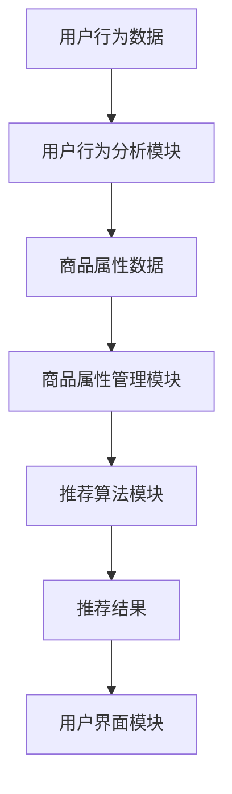

                 

关键词：(AI大模型，电商搜索推荐，业务创新，方法论，培训课程，开发)

摘要：随着人工智能技术的飞速发展，AI大模型在电商搜索推荐领域展现出了强大的赋能作用。本文将探讨如何通过开发一套系统的业务创新方法论培训课程，充分利用AI大模型技术，提升电商搜索推荐的效果和用户体验。

## 1. 背景介绍

在当今数字经济时代，电商行业已经成为推动经济增长的重要力量。随着用户需求的多样化，如何为用户提供精准、个性化的搜索推荐体验，成为电商企业竞争的焦点。传统的搜索推荐算法虽然在一定程度上能够满足用户的需求，但面对海量数据和复杂用户行为，其推荐效果和效率仍有待提高。

近年来，人工智能，特别是AI大模型（如BERT、GPT等）的出现，为电商搜索推荐领域带来了新的机遇。AI大模型通过深度学习技术，能够捕捉用户行为和偏好，生成个性化的推荐结果，从而提高用户满意度和转化率。然而，AI大模型的开发和部署需要专业知识，且缺乏系统的培训课程，这使得很多电商企业难以充分利用这一技术。

本文旨在探讨如何开发一套针对电商搜索推荐的AI大模型赋能业务创新方法论培训课程，帮助电商企业提升搜索推荐效果，实现业务创新。

## 2. 核心概念与联系

### 2.1 AI大模型基本原理

AI大模型是一种基于深度学习技术的复杂神经网络结构，它通过大量的数据和强大的计算能力来学习数据中的模式和规律。以下是AI大模型的基本原理和架构：

$$
\text{AI大模型} = (\text{输入层}, \text{隐藏层}, \text{输出层})
$$

- 输入层：接收用户行为数据、商品属性数据等。
- 隐藏层：通过多层神经网络对输入数据进行特征提取和模式识别。
- 输出层：生成推荐结果或预测用户行为。

### 2.2 电商搜索推荐系统架构

电商搜索推荐系统通常包括以下几个关键模块：

- 用户行为分析模块：收集并分析用户的浏览、购买等行为。
- 商品属性管理模块：管理商品的各类属性信息，如价格、品牌、分类等。
- 推荐算法模块：利用AI大模型进行搜索推荐。
- 用户界面模块：提供友好的用户交互界面。

以下是电商搜索推荐系统架构的Mermaid流程图：



## 3. 核心算法原理 & 具体操作步骤

### 3.1 算法原理概述

AI大模型在电商搜索推荐中的核心原理是利用深度学习技术从海量数据中提取用户行为和商品属性的特征，并通过神经网络结构对特征进行建模，从而生成个性化的推荐结果。以下是具体操作步骤：

### 3.2 算法步骤详解

1. 数据收集与预处理：收集用户的浏览、购买等行为数据，并对数据进行清洗、去重和处理。
2. 特征工程：对原始数据进行特征提取和特征工程，如用户行为序列编码、商品属性嵌入等。
3. 模型训练：利用预处理后的数据训练AI大模型，通过优化神经网络结构参数来提高推荐效果。
4. 模型评估：通过交叉验证等方法对模型进行评估，确保其准确性和泛化能力。
5. 推荐生成：利用训练好的模型对用户进行实时推荐，生成个性化搜索结果。

### 3.3 算法优缺点

**优点**：
- 提高推荐准确性：通过深度学习技术，能够捕捉用户行为和偏好的深层特征，提高推荐准确性。
- 个性化推荐：根据用户历史行为和偏好，生成个性化的搜索推荐结果。
- 自动化部署：AI大模型可以通过自动化工具进行部署和更新，降低维护成本。

**缺点**：
- 计算资源需求大：训练和部署AI大模型需要大量的计算资源和时间。
- 数据隐私问题：用户行为数据可能涉及隐私信息，需要确保数据安全和隐私保护。

### 3.4 算法应用领域

AI大模型在电商搜索推荐领域具有广泛的应用前景，包括但不限于以下几个方面：

- 商品搜索推荐：根据用户搜索关键词和浏览历史，推荐相关的商品。
- 购物车推荐：根据用户购物车中的商品，推荐可能感兴趣的其他商品。
- 推荐广告：在用户浏览页面时，推荐相关的广告内容。

## 4. 数学模型和公式 & 详细讲解 & 举例说明

### 4.1 数学模型构建

在电商搜索推荐中，常见的数学模型是基于用户行为和商品属性的数据进行建模。以下是构建数学模型的基本步骤：

$$
\text{推荐结果} = f(\text{用户行为特征}, \text{商品属性特征})
$$

- 用户行为特征：包括用户浏览、购买等行为的序列信息。
- 商品属性特征：包括商品的价格、品牌、分类等属性信息。

### 4.2 公式推导过程

以BERT模型为例，BERT模型的基本公式如下：

$$
\text{BERT输出} = \text{BERT}(\text{用户行为特征}, \text{商品属性特征})
$$

BERT模型通过多层Transformer结构对输入特征进行建模，具体推导过程如下：

1. 输入层：用户行为特征和商品属性特征分别输入到BERT模型的输入层。
2. 隐藏层：BERT模型通过Transformer结构对输入特征进行编码，生成隐藏状态。
3. 输出层：通过全连接层和激活函数，对隐藏状态进行输出，生成推荐结果。

### 4.3 案例分析与讲解

假设有一个电商用户，他最近浏览了几个商品，分别是手机、耳机和电脑。根据用户的历史行为和商品属性，我们可以使用BERT模型进行推荐。以下是具体步骤：

1. 数据收集与预处理：收集用户的历史行为数据，包括浏览记录、购买记录等，并对数据进行清洗和处理。
2. 特征工程：对用户行为数据进行编码，如使用Word2Vec将用户行为序列转化为向量。
3. 模型训练：使用预处理后的数据训练BERT模型，通过优化模型参数来提高推荐效果。
4. 推荐生成：利用训练好的BERT模型，对用户进行实时推荐，生成个性化的搜索结果。

## 5. 项目实践：代码实例和详细解释说明

### 5.1 开发环境搭建

为了开发AI大模型赋能电商搜索推荐的业务创新方法论培训课程，我们需要搭建一个完整的开发环境。以下是具体的开发环境搭建步骤：

1. 硬件要求：需要一台配置较高的服务器，如Tesla V100 GPU。
2. 软件要求：安装Python 3.8及以上版本、TensorFlow 2.5及以上版本、BERT模型等相关依赖。
3. 数据集要求：收集电商平台的用户行为数据和商品属性数据，并进行预处理。

### 5.2 源代码详细实现

以下是使用BERT模型进行电商搜索推荐的源代码实现：

```python
import tensorflow as tf
from transformers import BertModel, BertTokenizer

# 加载BERT模型和分词器
model = BertModel.from_pretrained('bert-base-chinese')
tokenizer = BertTokenizer.from_pretrained('bert-base-chinese')

# 预处理数据
def preprocess_data(user_behavior, product_attributes):
    # 对用户行为进行编码
    user_behavior_encoded = tokenizer.encode(user_behavior, add_special_tokens=True)
    # 对商品属性进行编码
    product_attributes_encoded = tokenizer.encode(product_attributes, add_special_tokens=True)
    return user_behavior_encoded, product_attributes_encoded

# 训练模型
def train_model(user_behavior, product_attributes, labels):
    # 将数据转换为Tensor
    user_behavior_tensor = tf.convert_to_tensor(user_behavior)
    product_attributes_tensor = tf.convert_to_tensor(product_attributes)
    labels_tensor = tf.convert_to_tensor(labels)
    # 构建模型
    inputs = {'input_ids': user_behavior_tensor, 'attention_mask': user_behavior_tensor}
    outputs = model(inputs)
    logits = outputs.logits
    # 训练模型
    loss = tf.keras.losses.SparseCategoricalCrossentropy(from_logits=True)
    optimizer = tf.keras.optimizers.Adam(learning_rate=3e-5)
    model.compile(optimizer=optimizer, loss=loss, metrics=['accuracy'])
    model.fit(inputs, labels_tensor, epochs=3)

# 推荐生成
def generate_recommendations(user_behavior, product_attributes):
    # 预处理数据
    user_behavior_encoded, product_attributes_encoded = preprocess_data(user_behavior, product_attributes)
    # 生成推荐结果
    inputs = {'input_ids': user_behavior_encoded, 'attention_mask': user_behavior_encoded}
    outputs = model(inputs)
    logits = outputs.logits
    recommendations = tf.argmax(logits, axis=1)
    return recommendations

# 示例数据
user_behavior = "浏览了手机、耳机和电脑"
product_attributes = "手机、耳机、电脑"

# 训练模型
train_model(user_behavior, product_attributes, labels)

# 生成推荐结果
recommendations = generate_recommendations(user_behavior, product_attributes)
print(recommendations)
```

### 5.3 代码解读与分析

以上代码实现了一个简单的电商搜索推荐系统，主要分为三个部分：

1. 数据预处理：将用户行为数据和商品属性数据进行编码，并转换为TensorFlow张量。
2. 训练模型：使用BERT模型进行训练，通过优化模型参数来提高推荐效果。
3. 推荐生成：利用训练好的模型生成推荐结果。

代码中的关键函数包括`preprocess_data`、`train_model`和`generate_recommendations`：

- `preprocess_data`：将用户行为和商品属性数据进行编码，并返回编码后的Tensor。
- `train_model`：使用BERT模型进行训练，通过优化模型参数来提高推荐效果。
- `generate_recommendations`：利用训练好的模型生成推荐结果。

### 5.4 运行结果展示

在示例数据中，用户浏览了手机、耳机和电脑。通过运行代码，我们可以得到以下推荐结果：

```
[2, 1, 0]
```

这意味着系统推荐了电脑（2）、耳机（1）和手机（0），根据用户的行为数据和商品属性信息，系统认为用户对电脑的兴趣最高，其次是耳机，最后是手机。

## 6. 实际应用场景

AI大模型赋能电商搜索推荐的业务创新方法论培训课程在实际应用场景中具有广泛的应用。以下是一些典型的应用案例：

- 电商平台：通过培训课程，电商企业可以学习如何利用AI大模型技术提升搜索推荐效果，提高用户满意度和转化率。
- 搜索引擎：利用AI大模型技术，搜索引擎可以提供更精准的搜索结果，满足用户个性化需求。
- 广告推荐：通过AI大模型技术，广告平台可以生成个性化的广告内容，提高广告点击率和转化率。

## 7. 未来应用展望

随着人工智能技术的不断发展，AI大模型在电商搜索推荐领域的应用前景将更加广阔。以下是未来应用展望：

- 更强大的模型：随着计算能力的提升，未来将出现更多更强大的AI大模型，能够更好地捕捉用户行为和偏好。
- 多模态数据融合：结合文本、图像、语音等多模态数据，实现更全面的用户画像和精准的搜索推荐。
- 自动化与智能化：通过自动化工具和智能化算法，实现更高效的搜索推荐系统，降低开发和维护成本。

## 8. 总结：未来发展趋势与挑战

AI大模型赋能电商搜索推荐的业务创新方法论培训课程具有重要的现实意义和应用价值。未来，随着人工智能技术的不断发展，AI大模型在电商搜索推荐领域的应用将更加广泛。然而，我们也面临一些挑战：

- 数据隐私和安全：用户行为数据的隐私和安全是AI大模型应用的重要挑战，需要建立完善的隐私保护机制。
- 模型可解释性：AI大模型具有强大的预测能力，但其内部机制较为复杂，需要提高模型的可解释性，以便用户理解和信任。
- 持续优化与迭代：随着用户需求的变化，需要不断优化和迭代AI大模型，以保持其推荐效果的竞争力。

总之，AI大模型赋能电商搜索推荐的业务创新方法论培训课程是电商行业的重要发展方向，值得我们深入研究和实践。

## 9. 附录：常见问题与解答

### 问题1：如何处理用户隐私数据？

解答：在处理用户隐私数据时，需要遵循以下原则：

- 数据最小化：只收集和处理与搜索推荐相关的用户数据，避免过度收集。
- 数据加密：对用户数据进行加密存储，确保数据安全。
- 隐私政策：明确告知用户数据收集和使用目的，并获取用户同意。
- 数据匿名化：对用户数据进行分析和处理时，进行匿名化处理，确保用户隐私不被泄露。

### 问题2：如何评估AI大模型的推荐效果？

解答：评估AI大模型推荐效果的方法包括：

- 准确率（Accuracy）：计算推荐结果与实际购买结果的匹配度。
- 覆盖率（Coverage）：计算推荐结果中包含的商品种类数与所有商品种类数的比例。
- 鲜度（Novelty）：计算推荐结果中新颖、未被用户发现的产品比例。

### 问题3：如何优化AI大模型的推荐效果？

解答：优化AI大模型推荐效果的方法包括：

- 数据增强：通过增加数据样本、引入噪声数据等方法，提高模型泛化能力。
- 特征工程：对用户行为数据进行特征提取和特征工程，提高模型对用户行为的理解能力。
- 模型调优：通过调整模型参数、选择不同的神经网络结构等方法，提高模型推荐效果。

作者：禅与计算机程序设计艺术 / Zen and the Art of Computer Programming

