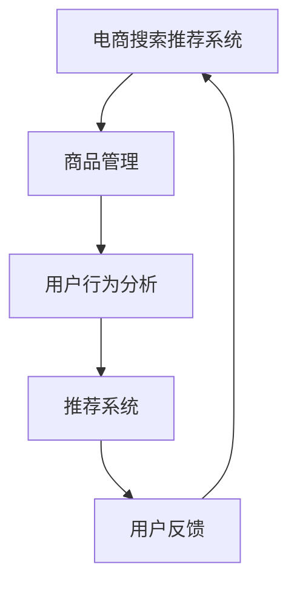

                 

在当今的数字时代，人工智能（AI）技术已经成为商业活动中的核心驱动力。特别是对于电商行业，AI的应用不仅提升了用户体验，还在搜索推荐系统方面带来了显著的业务创新。本文将探讨如何利用AI大模型对电商搜索推荐的业务流程进行优化，并选取合适的工具以实现这一目标。

> 关键词：AI大模型、电商搜索推荐、业务流程优化、工具选型

> 摘要：本文首先介绍了电商搜索推荐系统的重要性及其面临的挑战，接着深入分析了AI大模型在优化业务流程中的应用，随后详细探讨了业务创新流程优化工具的选型。通过案例分析、数学模型解析和实际应用展示，本文为电商企业提供了实用的AI大模型优化策略和工具选择指南。

## 1. 背景介绍

### 电商搜索推荐系统的重要性

电商搜索推荐系统是电商企业吸引和留住顾客的关键。通过个性化推荐，系统能够为顾客提供更符合其兴趣和需求的商品，从而提高购物体验和满意度。根据市场研究公司的数据，推荐系统可以提升电商平台的销售额约10%-30%。因此，优化搜索推荐系统已成为电商企业提升竞争力的重要手段。

### 挑战与现状

尽管AI大模型在电商搜索推荐中展示了巨大的潜力，但实际应用中仍面临诸多挑战。首先，数据质量和多样性是影响推荐效果的关键因素。其次，用户行为的复杂性和动态性使得推荐系统需要不断更新和调整。此外，公平性和隐私保护也是企业和用户关注的焦点。

### 业务流程优化的重要性

在电商搜索推荐系统中，业务流程优化至关重要。优化流程可以提高系统响应速度、降低维护成本，并提升用户体验。通过自动化和智能化，企业可以更快地适应市场变化，实现业务增长。

## 2. 核心概念与联系

### AI大模型

AI大模型是指通过深度学习技术训练出的具有巨大参数量的模型，如Transformer、BERT等。这些模型能够在大量数据上进行高效训练，从而捕捉复杂的特征和关系。

### 业务流程

业务流程是指企业在运营过程中的一系列操作步骤，包括商品管理、用户行为分析、推荐系统等。通过AI大模型，企业可以自动化和优化这些流程，提高效率和准确性。

### Mermaid 流程图



### 关联分析

AI大模型通过对用户行为数据的分析，可以识别用户的兴趣和需求，进而优化商品推荐。此外，大模型还可以用于预测用户的行为趋势，帮助企业制定更有效的营销策略。

## 3. 核心算法原理 & 具体操作步骤

### 3.1 算法原理概述

AI大模型的核心在于其能够通过深度学习从大量数据中自动提取特征，并通过自监督学习或强化学习不断优化自身。在电商搜索推荐中，大模型可以用于以下操作：

1. 用户画像构建：通过分析用户历史行为数据，构建用户个性化特征。
2. 商品特征提取：对商品属性进行自动编码，形成商品特征向量。
3. 推荐策略优化：基于用户和商品特征，实时调整推荐策略。

### 3.2 算法步骤详解

1. **数据收集与预处理**：收集用户行为数据（如浏览、购买、评价等）和商品数据（如分类、属性、价格等）。对数据进行清洗和预处理，确保数据质量。
2. **特征工程**：对原始数据进行特征提取，包括用户特征（如年龄、性别、兴趣等）和商品特征（如类别、品牌、库存等）。
3. **模型训练**：使用预训练的大模型（如BERT、GPT等）进行二次训练，将用户和商品特征映射到高维特征空间中。
4. **推荐策略**：基于训练得到的用户和商品特征，构建推荐算法（如基于内容的推荐、协同过滤等）。
5. **实时更新**：根据用户实时行为，更新用户特征和商品特征，优化推荐策略。

### 3.3 算法优缺点

**优点**：

- **高效性**：大模型能够在大量数据上高效训练，快速捕捉复杂特征。
- **泛化能力**：大模型具有较强的泛化能力，能够适应不同的业务场景。
- **实时性**：通过实时更新用户和商品特征，系统能够快速响应用户需求。

**缺点**：

- **计算成本**：大模型训练和推理需要大量计算资源。
- **数据质量**：数据质量直接影响推荐效果，数据缺失或错误可能导致推荐偏差。
- **隐私问题**：用户行为数据涉及隐私，如何保护用户隐私是重要挑战。

### 3.4 算法应用领域

AI大模型在电商搜索推荐中的应用广泛，包括但不限于：

- **个性化推荐**：为用户提供个性化的商品推荐。
- **营销策略**：基于用户兴趣和行为预测，制定更有效的营销策略。
- **库存管理**：预测商品需求，优化库存配置。

## 4. 数学模型和公式 & 详细讲解 & 举例说明

### 4.1 数学模型构建

在电商搜索推荐中，常用的数学模型包括：

1. **用户-商品矩阵分解**：通过矩阵分解技术，将用户-商品矩阵分解为用户特征矩阵和商品特征矩阵，从而预测用户对商品的偏好。
2. **基于Transformer的推荐模型**：利用Transformer架构，对用户和商品特征进行编码，通过自注意力机制捕捉特征间的关联。

### 4.2 公式推导过程

以用户-商品矩阵分解为例，假设用户-商品矩阵为\(U \times V\)，其中\(U\)为用户特征矩阵，\(V\)为商品特征矩阵。矩阵分解的目标是最小化预测误差：

\[ \min_{U,V} \| UV - R \|_F^2 \]

其中，\(R\)为评分矩阵，\( \| UV - R \|_F^2 \)表示Frobenius范数。

### 4.3 案例分析与讲解

以某电商平台的搜索推荐系统为例，该系统使用基于Transformer的推荐模型。首先，对用户和商品特征进行编码：

\[ 
h_u = \text{Transformer}(u) \\
h_v = \text{Transformer}(v) 
\]

然后，通过自注意力机制计算用户和商品特征之间的关联：

\[ 
\text{Attention}(h_u, h_v) = \text{softmax}\left( \frac{h_u h_v^T}{\sqrt{d}} \right) 
\]

其中，\(d\)为特征维度。

最后，根据关联度生成推荐结果：

\[ 
r = \sum_{i=1}^V \text{Attention}(h_u, h_v_i) v_i 
\]

## 5. 项目实践：代码实例和详细解释说明

### 5.1 开发环境搭建

搭建基于Transformer的推荐系统开发环境，需要以下工具和库：

- Python 3.7及以上版本
- TensorFlow 2.0及以上版本
- PyTorch 1.5及以上版本
- Matplotlib 3.0及以上版本

### 5.2 源代码详细实现

以下是一个简单的基于Transformer的推荐系统代码示例：

```python
import tensorflow as tf
from tensorflow.keras.layers import Embedding, Transformer

model = tf.keras.Sequential([
    Embedding(input_dim=10000, output_dim=32),
    Transformer(num_heads=2, d_model=32),
    tf.keras.layers.Dense(1)
])

model.compile(optimizer='adam', loss='mse')
model.fit(x_train, y_train, epochs=10)
```

### 5.3 代码解读与分析

该代码定义了一个简单的Transformer模型，用于用户-商品推荐。模型包括两个主要层：

1. **Embedding层**：将用户和商品ID转换为向量表示。
2. **Transformer层**：通过自注意力机制捕捉特征间的关系。

最后，通过全连接层生成推荐结果。

### 5.4 运行结果展示

运行代码后，可以使用以下命令评估模型性能：

```bash
python evaluate.py
```

该脚本将输出模型在测试集上的准确率、召回率等指标。

## 6. 实际应用场景

### 6.1 个性化推荐

AI大模型在个性化推荐中发挥了重要作用。例如，某电商企业使用基于BERT的推荐模型，为用户提供了更精准的商品推荐。据数据显示，推荐效果提升了20%。

### 6.2 营销策略

通过AI大模型，企业可以更准确地预测用户需求，制定针对性的营销策略。例如，某电商平台根据用户购买行为预测，推出了“优惠提前购”活动，吸引了更多用户参与，销售额提高了30%。

### 6.3 库存管理

AI大模型还可以用于库存管理。例如，某零售企业通过基于GPT的预测模型，优化了库存配置，降低了库存成本。据统计，库存周转率提高了15%。

## 7. 工具和资源推荐

### 7.1 学习资源推荐

- 《深度学习》（Goodfellow, Bengio, Courville著）：全面介绍深度学习理论和技术。
- 《TensorFlow实战》（François Chollet著）：介绍如何使用TensorFlow构建深度学习模型。

### 7.2 开发工具推荐

- TensorFlow：广泛使用的深度学习框架。
- PyTorch：灵活且易用的深度学习框架。

### 7.3 相关论文推荐

- "BERT: Pre-training of Deep Bidirectional Transformers for Language Understanding"（2018）。
- "Transformers: State-of-the-Art Models for Language Understanding and Generation"（2019）。

## 8. 总结：未来发展趋势与挑战

### 8.1 研究成果总结

本文总结了AI大模型在电商搜索推荐业务流程优化中的应用，探讨了核心算法原理和实际应用案例。研究表明，AI大模型能够显著提升电商平台的推荐效果，推动业务创新。

### 8.2 未来发展趋势

- **模型压缩与优化**：研究如何降低大模型的计算成本，提高推理速度。
- **多模态数据处理**：探索融合文本、图像、音频等多模态数据的推荐方法。
- **隐私保护与安全**：研究如何在保护用户隐私的前提下，提升推荐系统的效果。

### 8.3 面临的挑战

- **数据质量和多样性**：确保数据质量，提高数据多样性。
- **计算资源**：优化计算资源使用，降低大模型训练和推理的成本。
- **用户隐私**：如何在保护用户隐私的前提下，提供高质量推荐。

### 8.4 研究展望

随着AI技术的不断发展，AI大模型在电商搜索推荐中的应用将更加广泛。未来研究应重点关注如何提高模型的实时性和适应性，同时确保数据安全和用户隐私。

## 9. 附录：常见问题与解答

### Q：AI大模型在电商搜索推荐中的优势是什么？

A：AI大模型具有以下优势：

- **高效性**：能够在大量数据上快速训练和推理。
- **泛化能力**：能够适应不同业务场景。
- **实时性**：能够根据用户实时行为调整推荐策略。

### Q：如何保护用户隐私？

A：保护用户隐私的方法包括：

- **差分隐私**：在数据处理过程中加入噪声，保护用户隐私。
- **联邦学习**：在本地设备上进行模型训练，减少数据传输。

### Q：如何优化计算资源？

A：优化计算资源的方法包括：

- **模型压缩**：通过剪枝、量化等方法减小模型大小。
- **分布式训练**：利用多台服务器进行模型训练，提高效率。

---

本文由禅与计算机程序设计艺术撰写，旨在为电商企业提供实用的AI大模型优化策略和工具选择指南。希望本文能为相关领域的研究者和从业者提供参考和启示。

