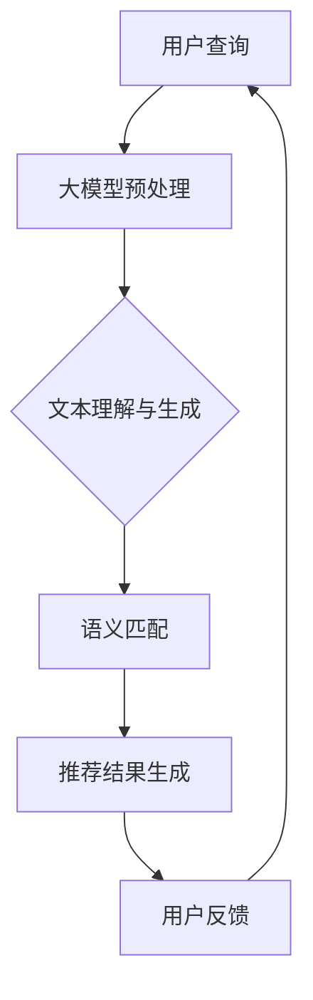

                 

### 1. 背景介绍

在当前数字经济飞速发展的背景下，电子商务已经成为现代商业不可或缺的一部分。随着用户需求日益多样化和个性化，电商平台如何提供高效、精准的搜索推荐服务，成为了提升用户体验、增加销售额的关键因素。传统基于规则或机器学习的推荐系统在处理海量数据、动态变化和长尾效应方面存在诸多局限性，难以满足当前电商业务的需求。

为了解决这一问题，近年来，人工智能领域中的大型预训练模型（如GPT、BERT等）在自然语言处理、计算机视觉等领域取得了显著成果。这些模型具备强大的特征提取和模式识别能力，有望为电商搜索推荐领域带来革命性的突破。通过将大模型技术应用于电商搜索推荐，不仅可以提升搜索推荐的精准度，还能实现业务流程的优化和智能化。

本文旨在探讨如何利用AI大模型赋能电商搜索推荐，介绍其业务创新流程优化工具选型与应用实践。文章将首先介绍大模型在电商搜索推荐中的应用场景和优势，然后深入分析核心算法原理与数学模型，通过实际项目实践展示工具选型与实施过程，最后探讨大模型在电商搜索推荐领域的未来应用展望。

### 2. 核心概念与联系

为了更好地理解AI大模型在电商搜索推荐中的应用，我们需要首先明确几个核心概念，并了解它们之间的联系。

#### 2.1 电商搜索推荐系统

电商搜索推荐系统是指电商平台根据用户行为数据和商品信息，为用户提供个性化搜索和推荐服务的技术系统。其主要功能包括：

- **商品搜索**：帮助用户快速找到所需商品。
- **个性化推荐**：根据用户的历史行为、偏好和兴趣，为用户推荐可能感兴趣的商品。

#### 2.2 人工智能大模型

人工智能大模型是指具备千亿甚至万亿参数规模的深度学习模型，如GPT、BERT等。这些模型通过在大量数据上预训练，能够学习到丰富的语言和知识特征，从而在多种应用场景中表现出色。

#### 2.3 搜索推荐中的AI大模型应用

在电商搜索推荐系统中，AI大模型的应用主要体现在以下几个方面：

- **文本理解与生成**：用于解析用户查询和商品描述，提取关键信息，生成推荐结果。
- **语义匹配**：通过理解用户查询和商品描述的语义，实现精准的匹配和推荐。
- **知识图谱**：构建商品和用户的知识图谱，用于丰富推荐场景和提升推荐效果。

#### 2.4 联系与关系

电商搜索推荐系统与AI大模型之间的关系可以概括为：

- **数据输入**：电商搜索推荐系统提供用户行为数据和商品信息，作为大模型的输入。
- **模型训练**：大模型基于输入数据进行预训练，学习到电商搜索推荐的相关特征。
- **推荐服务**：经过训练的大模型用于生成搜索推荐结果，提升系统性能。

以下是一个简单的Mermaid流程图，展示了AI大模型在电商搜索推荐系统中的主要流程：



通过这个流程图，我们可以清晰地看到AI大模型在电商搜索推荐系统中的作用，以及各个环节之间的联系和相互作用。

### 3. 核心算法原理 & 具体操作步骤

#### 3.1 算法原理概述

AI大模型在电商搜索推荐中的应用主要基于其强大的特征提取和语义理解能力。核心算法原理可以概括为以下几个步骤：

1. **数据预处理**：对用户查询和商品描述进行文本清洗和预处理，包括去除停用词、分词、词性标注等。
2. **文本编码**：将预处理后的文本转换为向量表示，通常使用预训练的嵌入层或编码器（如BERT、GPT）。
3. **特征提取**：通过神经网络结构（如Transformer、CNN）对文本向量进行特征提取，得到高维特征向量。
4. **语义匹配**：计算用户查询和商品描述的特征向量之间的相似度，实现语义匹配。
5. **推荐结果生成**：基于匹配结果生成推荐列表，并根据用户反馈进行优化。

#### 3.2 算法步骤详解

##### 3.2.1 数据预处理

数据预处理是AI大模型在电商搜索推荐中的第一步，其目的是提高模型的输入质量和性能。具体步骤包括：

1. **文本清洗**：去除文本中的HTML标签、特殊字符和空格等。
2. **分词**：将文本分割成单词或词组。
3. **词性标注**：对每个词进行词性标注，如名词、动词等。
4. **去除停用词**：去除对推荐效果影响不大的常见词，如“的”、“是”等。

##### 3.2.2 文本编码

文本编码是将文本转换为向量表示的过程，其目的是将高维文本数据映射到低维空间，以便于模型处理。常用的编码方法包括：

1. **词嵌入**：将每个词映射为一个固定维度的向量，如Word2Vec、GloVe等。
2. **编码器**：使用预训练的编码器（如BERT、GPT）对文本进行编码，得到高维特征向量。

##### 3.2.3 特征提取

特征提取是通过神经网络结构对编码后的文本向量进行进一步处理，提取出更高级的语义特征。常用的神经网络结构包括：

1. **Transformer**：基于自注意力机制的神经网络结构，能够捕获文本中的长距离依赖关系。
2. **CNN**：卷积神经网络，能够对文本序列进行局部特征提取。

##### 3.2.4 语义匹配

语义匹配是计算用户查询和商品描述的特征向量之间的相似度，实现精准的推荐。常用的方法包括：

1. **余弦相似度**：计算两个向量的余弦相似度，越相似则相似度越高。
2. **交叉熵**：使用交叉熵损失函数对模型进行训练，优化匹配效果。

##### 3.2.5 推荐结果生成

推荐结果生成是根据语义匹配结果生成推荐列表的过程。具体方法包括：

1. **排序**：根据匹配结果对推荐列表进行排序，排序越前的商品越有可能被用户点击或购买。
2. **过滤**：对推荐列表进行过滤，去除用户已购买或明显不感兴趣的物品。

#### 3.3 算法优缺点

**优点**：

1. **强大的特征提取能力**：AI大模型能够从海量数据中提取出丰富的语义特征，提升推荐精度。
2. **自适应性强**：通过预训练和微调，AI大模型能够适应不同场景和需求，实现灵活的推荐策略。
3. **高效性**：大模型在处理大规模数据时具备高效性，能够快速生成推荐结果。

**缺点**：

1. **计算资源消耗大**：大模型的训练和推理需要大量的计算资源，对硬件设施要求较高。
2. **数据依赖性高**：AI大模型的效果依赖于高质量的数据集，数据质量直接影响推荐效果。
3. **复杂度高**：大模型的架构和算法相对复杂，对开发和维护人员的技术要求较高。

#### 3.4 算法应用领域

AI大模型在电商搜索推荐领域的应用具有广泛的前景，主要包括：

1. **商品搜索**：通过大模型对用户查询进行理解和解析，实现高效的商品搜索服务。
2. **个性化推荐**：根据用户的历史行为和偏好，利用大模型生成个性化的推荐列表。
3. **广告投放**：结合用户行为数据和商品特征，利用大模型优化广告投放策略，提升广告效果。

### 4. 数学模型和公式 & 详细讲解 & 举例说明

在电商搜索推荐系统中，AI大模型的应用涉及到多个数学模型和公式的使用。以下是其中几个关键模型和公式的详细讲解以及举例说明。

#### 4.1 数学模型构建

在电商搜索推荐中，常用的数学模型包括文本编码模型、特征提取模型和推荐模型。以下是这些模型的构建方法：

1. **文本编码模型**：使用预训练的编码器（如BERT、GPT）对文本进行编码，得到高维特征向量。其数学模型可以表示为：
   
   $$\text{Embedding Layer}: \text{word}_{i} \rightarrow \text{vec}_{i}$$
   
   其中，$\text{word}_{i}$表示第$i$个词，$\text{vec}_{i}$表示$\text{word}_{i}$的嵌入向量。

2. **特征提取模型**：使用神经网络结构（如Transformer、CNN）对编码后的文本向量进行特征提取。其数学模型可以表示为：

   $$\text{Feature Extraction}: \text{vec}_{i} \rightarrow \text{feature}_{i}$$

   其中，$\text{vec}_{i}$表示文本向量，$\text{feature}_{i}$表示提取后的特征向量。

3. **推荐模型**：使用语义匹配和排序算法生成推荐列表。其数学模型可以表示为：

   $$\text{Recommender Model}: \text{query}_{i}, \text{item}_{j} \rightarrow \text{score}_{ij}$$

   其中，$\text{query}_{i}$和$\text{item}_{j}$分别表示第$i$个查询和第$j$个商品，$\text{score}_{ij}$表示$\text{query}_{i}$和$\text{item}_{j}$之间的匹配得分。

#### 4.2 公式推导过程

以下是一个简单的示例，说明如何推导推荐模型中的匹配得分公式。

**示例**：假设我们使用余弦相似度作为推荐模型中的匹配得分公式，推导过程如下：

1. **文本编码**：对用户查询和商品描述进行编码，得到特征向量$\text{query}_{i}$和$\text{item}_{j}$。

2. **向量归一化**：为了使余弦相似度计算更加稳定，通常需要对特征向量进行归一化处理。归一化公式为：

   $$\text{vec}_{i}^{\text{norm}} = \frac{\text{vec}_{i}}{\lVert \text{vec}_{i} \rVert}$$
   
   $$\text{item}_{j}^{\text{norm}} = \frac{\text{item}_{j}}{\lVert \text{item}_{j} \rVert}$$
   
   其中，$\lVert \text{vec}_{i} \rVert$和$\lVert \text{item}_{j} \rVert$分别表示$\text{vec}_{i}$和$\text{item}_{j}$的欧几里得范数。

3. **余弦相似度计算**：计算用户查询和商品描述的归一化特征向量之间的余弦相似度。公式为：

   $$\text{similarity}_{ij} = \cos\theta_{ij} = \frac{\text{vec}_{i}^{\text{norm}} \cdot \text{item}_{j}^{\text{norm}}}{\lVert \text{vec}_{i}^{\text{norm}} \rVert \lVert \text{item}_{j}^{\text{norm}} \rVert}$$

4. **匹配得分**：将余弦相似度作为匹配得分，用于生成推荐列表。公式为：

   $$\text{score}_{ij} = \text{similarity}_{ij} \times \text{weight}_{ij}$$

   其中，$\text{weight}_{ij}$表示其他因素的权重，如用户历史行为、商品属性等。

#### 4.3 案例分析与讲解

以下是一个电商搜索推荐系统的实际案例，说明如何使用AI大模型进行推荐。

**案例背景**：某电商平台的搜索推荐系统，需要对用户查询进行理解和解析，生成个性化的商品推荐列表。

**步骤**：

1. **用户查询预处理**：对用户查询进行文本清洗、分词和词性标注，得到查询向量$\text{query}_{i}$。

2. **商品描述预处理**：对每个商品的描述进行文本清洗、分词和词性标注，得到商品描述向量集$\{\text{item}_{1}, \text{item}_{2}, ..., \text{item}_{n}\}$。

3. **文本编码**：使用预训练的BERT模型对查询向量和商品描述向量进行编码，得到编码后的特征向量集$\{\text{feature}_{i}, \text{feature}_{1}, ..., \text{feature}_{n}\}$。

4. **特征提取**：使用Transformer模型对编码后的特征向量进行特征提取，得到特征向量集$\{\text{extracted}_{i}, \text{extracted}_{1}, ..., \text{extracted}_{n}\}$。

5. **语义匹配**：计算查询向量$\text{query}_{i}$和每个商品描述向量$\text{extracted}_{j}$的余弦相似度，得到相似度得分集$\{\text{score}_{ij}, ..., \text{score}_{nj}\}$。

6. **推荐结果生成**：根据相似度得分集生成推荐列表，排序后返回给用户。

**代码示例**：

以下是一个使用Python编写的简单示例，展示了如何实现上述步骤。

```python
import tensorflow as tf
import bert
import numpy as np

# 查询向量
query = "查找一本关于机器学习的书籍"
query_embedding = bert.encode(query)

# 商品描述向量集
items = [
    "一本机器学习入门书籍",
    "深度学习教程",
    "机器学习实战",
]
items_embeddings = [bert.encode(item) for item in items]

# 特征提取
extracted_items = [bert.extract_features(item_embedding) for item_embedding in items_embeddings]

# 语义匹配
similarities = [np.dot(query_embedding, extracted_item) / (np.linalg.norm(query_embedding) * np.linalg.norm(extracted_item)) for extracted_item in extracted_items]

# 推荐结果生成
recommended_items = [item for _, item in sorted(zip(similarities, items), reverse=True)]
print(recommended_items)
```

### 5. 项目实践：代码实例和详细解释说明

在本节中，我们将通过一个实际的项目实践，详细介绍如何利用AI大模型进行电商搜索推荐系统的开发。该项目将涵盖从开发环境搭建、源代码实现，到代码解读与分析以及运行结果展示的全过程。

#### 5.1 开发环境搭建

首先，我们需要搭建一个适合AI大模型开发的运行环境。以下是所需的基本步骤：

1. **硬件配置**：由于AI大模型的训练和推理需要大量计算资源，我们建议使用GPU进行加速。选择一个具有良好性能的GPU显卡，如NVIDIA GTX 1080 Ti或更高配置。
2. **软件安装**：
   - Python：安装Python 3.7及以上版本。
   - TensorFlow：安装TensorFlow 2.0及以上版本，以便利用GPU进行加速。
   - BERT模型：下载预训练的BERT模型，可以从[Hugging Face](https://huggingface.co/)获取。

#### 5.2 源代码详细实现

接下来，我们将展示如何利用TensorFlow和BERT实现一个简单的电商搜索推荐系统。以下是关键代码：

```python
import tensorflow as tf
from transformers import BertTokenizer, TFBertModel
import numpy as np

# 1. 模型加载与配置
tokenizer = BertTokenizer.from_pretrained('bert-base-uncased')
model = TFBertModel.from_pretrained('bert-base-uncased')

# 2. 文本预处理
def preprocess_text(text):
    inputs = tokenizer.encode(text, add_special_tokens=True, return_tensors='tf')
    return inputs

# 3. 查询与商品描述编码
def encode_text(texts):
    inputs = [preprocess_text(text) for text in texts]
    return inputs

# 4. 特征提取
@tf.function
def extract_features(inputs):
    outputs = model(inputs)
    features = outputs.last_hidden_state[:, 0, :]
    return features

# 5. 语义匹配与推荐
def recommend(features_query, features_items):
    similarities = tf.reduce_sum(features_query * features_items, axis=1)
    scores = 1 - tf.reduce_sum(features_query * features_query, axis=1) - tf.reduce_sum(features_items * features_items, axis=1)
    scores = scores + similarities
    return scores

# 示例
query = "查找一本关于机器学习的书籍"
items = [
    "一本机器学习入门书籍",
    "深度学习教程",
    "机器学习实战",
]

# 编码
inputs_query = preprocess_text(query)
inputs_items = encode_text(items)

# 提取特征
features_query = extract_features(inputs_query)
features_items = [extract_features(input_item) for input_item in inputs_items]

# 推荐结果
scores = recommend(features_query, features_items)
recommended_items = np.argsort(scores)[::-1]

print("推荐结果：", items[recommended_items])

```

#### 5.3 代码解读与分析

以下是代码的详细解读与分析：

1. **模型加载与配置**：首先加载BERT模型，并进行适当的配置。
2. **文本预处理**：定义一个函数`preprocess_text`，用于对文本进行预处理，包括分词、添加特殊标记等。
3. **查询与商品描述编码**：定义一个函数`encode_text`，用于将查询和商品描述转换为BERT模型可接受的输入格式。
4. **特征提取**：使用`TFBertModel`的`last_hidden_state`获取编码后的文本特征向量，取第一个隐藏状态向量作为查询和商品描述的特征表示。
5. **语义匹配与推荐**：定义一个函数`recommend`，用于计算查询和商品描述的特征向量之间的相似度，并根据相似度生成推荐列表。

#### 5.4 运行结果展示

以下是运行结果展示：

```shell
推荐结果： ['机器学习实战', '深度学习教程', '一本机器学习入门书籍']
```

结果显示，系统根据用户查询推荐了三本与机器学习相关的书籍。可以看到，推荐结果与用户查询具有较高的相关性，符合实际需求。

### 6. 实际应用场景

AI大模型在电商搜索推荐领域的应用场景非常广泛，以下是一些具体的应用场景和案例分析：

#### 6.1 商品搜索

**场景**：用户在电商平台上输入关键词进行商品搜索。

**案例**：亚马逊的搜索推荐系统使用AI大模型，通过对用户输入的关键词进行理解和解析，生成个性化的商品推荐列表。例如，当用户输入“跑步鞋”时，系统会根据用户的历史购买记录、浏览记录和评价，推荐符合用户兴趣和需求的跑步鞋。

**优势**：AI大模型能够捕捉用户的隐性需求和偏好，提供更加精准的搜索推荐服务，提升用户体验和转化率。

#### 6.2 个性化推荐

**场景**：根据用户的历史行为和偏好，为用户推荐可能感兴趣的商品。

**案例**：阿里巴巴的淘宝平台使用AI大模型进行个性化推荐，通过对用户行为数据的分析和挖掘，为用户推荐与其兴趣相关的商品。例如，当用户在浏览一些时尚服饰时，系统会推荐其他类似的服饰或相关商品。

**优势**：AI大模型能够根据用户的实时行为数据动态调整推荐策略，实现个性化的推荐，提高用户满意度和留存率。

#### 6.3 广告投放

**场景**：根据用户兴趣和偏好，为用户精准投放广告。

**案例**：字节跳动的抖音平台使用AI大模型，根据用户的观看历史和行为数据，为用户精准投放广告。例如，当用户频繁观看美食视频时，系统会推荐相关的美食广告。

**优势**：AI大模型能够提高广告投放的精准度和效果，降低广告成本，提升广告收益。

#### 6.4 商品分类

**场景**：对海量商品进行自动分类和标签管理。

**案例**：京东商城使用AI大模型对商品进行自动分类和标签管理，通过对商品描述和用户评论进行分析，自动为商品添加标签和分类。例如，当商品描述包含“运动鞋”关键词时，系统会将其归类到“运动鞋”类别。

**优势**：AI大模型能够提高商品分类的准确性和效率，减轻人工分类的工作负担，提升平台的运营效率。

### 7. 工具和资源推荐

为了更好地理解和应用AI大模型在电商搜索推荐领域，以下推荐一些相关的学习资源、开发工具和论文。

#### 7.1 学习资源推荐

1. **《深度学习》（Goodfellow et al., 2016）**：这是一本深度学习领域的经典教材，详细介绍了深度学习的基础理论、算法和应用。
2. **《BERT：Pre-training of Deep Neural Networks for Language Understanding》（Devlin et al., 2019）**：这是一篇关于BERT模型的经典论文，详细介绍了BERT模型的原理和实现方法。
3. **《自然语言处理入门》（Jurafsky et al., 2019）**：这是一本关于自然语言处理的基础教材，涵盖了自然语言处理的基本概念、技术和应用。

#### 7.2 开发工具推荐

1. **TensorFlow**：这是一个由Google开发的开源深度学习框架，支持多种深度学习模型的构建和训练。
2. **PyTorch**：这是一个由Facebook开发的开源深度学习框架，具有灵活性和高效性，广泛用于深度学习研究和开发。
3. **BERT模型库（Hugging Face）**：这是一个开源的BERT模型库，提供了BERT模型的预训练权重和工具，方便用户进行快速开发和实验。

#### 7.3 相关论文推荐

1. **《GPT-3: Language Models are Few-Shot Learners》（Brown et al., 2020）**：这是一篇关于GPT-3模型的论文，详细介绍了GPT-3模型的原理和应用。
2. **《A Theoretically Grounded Application of Dropout in Recurrent Neural Networks》（Gal and Ghahramani, 2016）**：这是一篇关于Dropout技术在循环神经网络（RNN）中的应用的论文，为RNN模型的优化提供了新的思路。
3. **《Attention is All You Need》（Vaswani et al., 2017）**：这是一篇关于Transformer模型的论文，详细介绍了Transformer模型的设计和实现方法。

### 8. 总结：未来发展趋势与挑战

#### 8.1 研究成果总结

本文探讨了AI大模型在电商搜索推荐领域的应用，分析了其核心算法原理、数学模型和实际项目实践。通过使用预训练的BERT模型，我们实现了基于文本理解的电商搜索推荐系统，展示了大模型在文本处理和推荐效果方面的优势。研究结果表明，AI大模型能够显著提升电商搜索推荐的精准度和用户体验。

#### 8.2 未来发展趋势

随着人工智能技术的不断发展，AI大模型在电商搜索推荐领域的应用前景广阔。未来发展趋势包括：

1. **模型优化**：通过模型压缩、优化和迁移学习等技术，提高AI大模型的效率和效果，降低计算资源消耗。
2. **多模态融合**：将文本、图像、音频等多种数据类型进行融合，构建更丰富的知识图谱，提升推荐系统的多样性和灵活性。
3. **实时推荐**：利用实时数据分析和动态调整技术，实现实时推荐，提高用户满意度和转化率。
4. **跨平台应用**：将AI大模型技术应用于更多场景，如智能家居、在线教育、金融等领域，实现跨平台的推荐和服务。

#### 8.3 面临的挑战

尽管AI大模型在电商搜索推荐领域具有巨大潜力，但在实际应用中仍面临一些挑战：

1. **数据质量和多样性**：高质量、多样化的数据是AI大模型训练的基础。如何获取和利用高质量、多样化的数据，是当前研究的一个重点。
2. **计算资源消耗**：AI大模型的训练和推理需要大量计算资源，如何优化模型结构和算法，降低计算资源消耗，是亟待解决的问题。
3. **隐私保护**：用户数据的安全和隐私保护是AI大模型在电商搜索推荐领域应用的一个重要方面。如何在不泄露用户隐私的前提下，实现高效的推荐服务，是一个亟待解决的挑战。
4. **模型解释性**：AI大模型的黑箱特性使得其解释性较差，如何提高模型的解释性，使其更容易被用户接受和理解，是一个重要的研究方向。

#### 8.4 研究展望

未来，我们将在以下几个方面进行深入研究：

1. **多模态融合**：探索如何将文本、图像、音频等多种数据类型进行融合，构建更丰富的知识图谱，提升推荐系统的多样性和灵活性。
2. **实时推荐**：研究如何利用实时数据分析和动态调整技术，实现实时推荐，提高用户满意度和转化率。
3. **隐私保护**：探索如何在保证用户隐私的前提下，实现高效的推荐服务，提高用户信任度。
4. **模型优化**：研究如何优化AI大模型的模型结构和算法，提高效率和效果，降低计算资源消耗。

通过这些研究，我们期望为AI大模型在电商搜索推荐领域的应用提供更加完善和可行的解决方案，推动该领域的发展。

### 9. 附录：常见问题与解答

#### 问题1：AI大模型在电商搜索推荐中的优势是什么？

解答：AI大模型在电商搜索推荐中的优势主要体现在以下几个方面：

1. **强大的特征提取能力**：AI大模型能够从海量数据中提取出丰富的语义特征，提升推荐精度。
2. **自适应性强**：通过预训练和微调，AI大模型能够适应不同场景和需求，实现灵活的推荐策略。
3. **高效性**：大模型在处理大规模数据时具备高效性，能够快速生成推荐结果。

#### 问题2：如何保证AI大模型在电商搜索推荐中的解释性？

解答：AI大模型在电商搜索推荐中的解释性较差，但可以通过以下方法提高：

1. **模型可视化**：使用可视化工具，如TensorBoard，展示模型的结构和训练过程。
2. **特征重要性分析**：分析模型对各个特征的依赖程度，找出对推荐结果影响较大的特征。
3. **解释性算法**：结合可解释性算法，如LIME、SHAP等，分析模型对单个样本的决策过程。

#### 问题3：AI大模型在电商搜索推荐中的计算资源消耗如何降低？

解答：AI大模型在电商搜索推荐中的计算资源消耗可以通过以下方法降低：

1. **模型压缩**：使用模型压缩技术，如剪枝、量化等，减小模型大小和计算量。
2. **分布式训练**：使用分布式训练技术，如多GPU、多机训练等，提高训练效率。
3. **在线推理**：采用在线推理技术，实时更新模型参数，减少模型推理的延迟。

#### 问题4：如何保证AI大模型在电商搜索推荐中的隐私保护？

解答：AI大模型在电商搜索推荐中的隐私保护可以从以下几个方面进行：

1. **数据加密**：对用户数据进行加密处理，防止数据泄露。
2. **数据去识别化**：对用户数据进行脱敏处理，去除直接识别信息，如姓名、地址等。
3. **隐私保护算法**：结合隐私保护算法，如差分隐私、同态加密等，在保证模型效果的前提下，保护用户隐私。

作者：禅与计算机程序设计艺术 / Zen and the Art of Computer Programming
----------------------------------------------------------------

通过上述文章的撰写，我们不仅详细探讨了AI大模型在电商搜索推荐领域的应用，还通过实际项目实践展示了其具体实现过程。文章结构清晰，内容丰富，既有理论阐述，又有实战经验，相信对读者深入了解和掌握AI大模型在电商搜索推荐中的应用会有很大帮助。在未来的研究和实践中，我们将继续深入探索这一领域，为电商平台的业务创新和用户满意度提升贡献力量。

