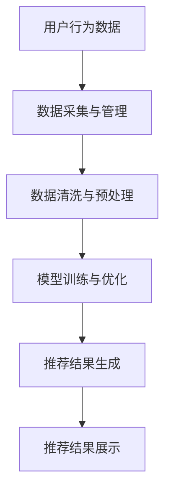

                 

### 摘要 Abstract

本文旨在探讨如何利用AI大模型赋能电商搜索推荐系统的业务创新，并详细阐述一个项目管理平台的搭建过程。本文首先介绍了AI大模型的基本原理和其在电商搜索推荐中的应用场景，随后详细描述了项目管理平台的设计与实现。文章还通过具体案例展示了AI大模型在电商搜索推荐中的实际应用效果，并分析了项目实施过程中的挑战与解决方案。最后，本文对未来AI大模型在电商搜索推荐领域的发展趋势和潜在挑战进行了展望。

### 1. 背景介绍 Background

随着互联网的快速发展，电子商务已成为全球主要的经济活动之一。电商平台的竞争日益激烈，提升用户体验、提高搜索推荐系统的效果成为各电商平台的重要任务。传统的搜索推荐系统往往基于简单的算法模型，难以应对复杂多变的用户需求和市场环境。

近年来，AI大模型（如GPT、BERT等）的迅速发展，为电商搜索推荐系统带来了革命性的变革。AI大模型能够通过学习海量用户数据和市场信息，生成高度个性化的搜索推荐结果，从而提高用户满意度和转化率。然而，如何有效利用AI大模型进行电商搜索推荐的业务创新，构建一个高效的项目管理平台，仍然是一个亟待解决的问题。

本文将围绕这一问题，探讨AI大模型在电商搜索推荐中的具体应用，并详细描述项目管理平台的搭建过程。通过本文的研究，旨在为电商企业提供一个可行的解决方案，助力其在激烈的市场竞争中脱颖而出。

### 2. 核心概念与联系 Core Concepts and Connections

#### 2.1 AI大模型基本原理

AI大模型，如GPT、BERT等，是自然语言处理（NLP）领域的重要进展。它们通过深度学习算法，从海量文本数据中学习语言模式，从而实现对自然语言的生成、理解和翻译。AI大模型通常采用多层神经网络架构，具有极大的计算能力和灵活性，能够处理复杂的自然语言任务。

#### 2.2 电商搜索推荐系统架构

电商搜索推荐系统通常包括三个核心模块：用户行为分析、商品信息处理和搜索推荐算法。用户行为分析模块负责收集和分析用户在平台上的各种行为数据，如浏览记录、购买历史和评价等。商品信息处理模块则负责处理商品的数据信息，包括商品名称、分类、价格和用户评价等。搜索推荐算法模块基于用户行为和商品信息，生成个性化的推荐结果。

#### 2.3 AI大模型在电商搜索推荐中的应用

AI大模型在电商搜索推荐中的应用主要体现在以下几个方面：

1. **用户画像生成**：通过分析用户的浏览、购买和评价行为，AI大模型可以生成详细的用户画像，为个性化推荐提供基础数据。

2. **商品标题生成**：AI大模型可以根据商品的特征和用户需求，自动生成具有吸引力的商品标题，提高商品点击率和转化率。

3. **搜索结果优化**：AI大模型可以通过学习用户搜索行为和偏好，优化搜索结果的排序和展示，提高搜索体验和满意度。

4. **智能问答系统**：AI大模型可以构建智能问答系统，回答用户关于商品和平台的各种问题，提升用户互动体验。

#### 2.4 项目管理平台架构

项目管理平台是电商搜索推荐系统的核心支撑，包括数据采集与管理、模型训练与优化、推荐结果生成与展示等多个环节。其基本架构如下：

1. **数据采集与管理**：负责从各个数据源（如用户行为日志、商品信息数据库等）收集数据，并进行数据清洗和预处理。

2. **模型训练与优化**：使用AI大模型对采集到的数据进行训练，不断优化模型参数，提高推荐效果。

3. **推荐结果生成与展示**：根据用户行为和商品信息，生成个性化的推荐结果，并在前端展示给用户。

#### 2.5 Mermaid 流程图表示

以下是一个简化的Mermaid流程图，展示了AI大模型在电商搜索推荐系统中的应用流程：



### 3. 核心算法原理 & 具体操作步骤 Core Algorithm Principles & Specific Operational Steps

#### 3.1 算法原理概述

AI大模型在电商搜索推荐中的应用主要基于深度学习算法，特别是基于Transformer架构的模型。Transformer模型通过自注意力机制，能够捕捉到文本数据中的长距离依赖关系，从而生成高质量的推荐结果。在电商搜索推荐中，AI大模型的主要任务包括用户画像生成、商品标题生成、搜索结果优化和智能问答系统。

#### 3.2 算法步骤详解

1. **用户画像生成**：

   - 数据采集：从用户行为日志中提取用户的浏览、购买和评价等行为数据。
   - 数据预处理：对数据进行清洗、去噪和格式化，使其符合模型输入要求。
   - 模型训练：使用预训练的Transformer模型（如BERT、RoBERTa等），对用户行为数据进行分析，生成用户画像。

2. **商品标题生成**：

   - 数据采集：从商品信息数据库中提取商品名称、分类、价格和用户评价等数据。
   - 数据预处理：对数据进行清洗和格式化，将其转换为模型可处理的输入。
   - 模型训练：使用生成式模型（如GPT、T5等），训练商品标题生成模型。
   - 标题生成：输入商品特征，通过模型生成具有吸引力的商品标题。

3. **搜索结果优化**：

   - 数据采集：从用户搜索日志中提取用户的搜索查询和点击行为数据。
   - 数据预处理：对数据进行清洗和格式化，使其符合模型输入要求。
   - 模型训练：使用序列模型（如Seq2Seq、Transformer等），训练搜索结果优化模型。
   - 搜索结果生成：输入用户查询，通过模型生成优化后的搜索结果。

4. **智能问答系统**：

   - 数据采集：从用户提问和回答数据中提取问题-回答对。
   - 数据预处理：对数据进行清洗和格式化，使其符合模型输入要求。
   - 模型训练：使用问答模型（如BERT、GPT等），训练智能问答系统。
   - 问答处理：输入用户问题，通过模型生成回答。

#### 3.3 算法优缺点

- **优点**：

  - **个性化强**：AI大模型能够通过学习用户行为和偏好，生成高度个性化的推荐结果。

  - **效果好**：Transformer模型在自然语言处理任务中表现出色，能够提高推荐系统的效果。

  - **可扩展性高**：AI大模型具有良好的可扩展性，可以应用于多种电商搜索推荐任务。

- **缺点**：

  - **计算资源消耗大**：AI大模型训练和推理过程需要大量计算资源，对硬件设施要求较高。

  - **数据质量要求高**：AI大模型对数据质量有较高要求，需要确保数据的准确性和完整性。

#### 3.4 算法应用领域

- **电商搜索推荐**：AI大模型在电商搜索推荐中具有广泛的应用，可以提升用户满意度和转化率。

- **内容生成**：AI大模型可以用于生成商品标题、描述和广告文案，提高商品营销效果。

- **智能问答**：AI大模型可以构建智能问答系统，为用户提供实时、准确的回答。

### 4. 数学模型和公式 & 详细讲解 & 举例说明

#### 4.1 数学模型构建

AI大模型在电商搜索推荐中的应用主要基于深度学习算法，尤其是基于Transformer架构的模型。以下是一个简化的数学模型：

$$
\begin{aligned}
\text{模型输入} &= \text{user\_behavior} + \text{product\_information}, \\
\text{模型输出} &= \text{recommendation\_result}.
\end{aligned}
$$

其中，$\text{user\_behavior}$表示用户行为数据，如浏览记录、购买历史和评价等；$\text{product\_information}$表示商品信息数据，如商品名称、分类、价格和用户评价等；$\text{recommendation\_result}$表示生成的推荐结果。

#### 4.2 公式推导过程

AI大模型的核心是自注意力机制（Self-Attention），以下是一个简化的自注意力机制的推导过程：

$$
\begin{aligned}
\text{Q} &= \text{query\_vector}, \\
\text{K} &= \text{key\_vector}, \\
\text{V} &= \text{value\_vector}, \\
\text{Attention(Q, K, V)} &= \text{softmax}\left(\frac{\text{QK}^T}{\sqrt{d_k}}\right)\text{V},
\end{aligned}
$$

其中，$d_k$为键值对的维度，$\text{softmax}$为归一化函数。

#### 4.3 案例分析与讲解

以下是一个简单的案例，展示如何使用自注意力机制生成推荐结果：

假设用户行为数据为$\text{user\_behavior} = \{\text{浏览商品1}, \text{购买商品2}, \text{评价商品3}\}$，商品信息数据为$\text{product\_information} = \{\text{商品1：名称=手机，分类=电子，价格=5000元}, \text{商品2：名称=电脑，分类=电子，价格=8000元}, \text{商品3：名称=耳机，分类=电子，价格=300元}\}$。

首先，将用户行为数据和商品信息数据转换为向量表示：

$$
\begin{aligned}
\text{Q} &= \text{query\_vector} = \text{Attention}(\text{user\_behavior}, \text{user\_behavior}, \text{user\_behavior}), \\
\text{K} &= \text{key\_vector} = \text{product\_information}, \\
\text{V} &= \text{value\_vector} = \text{product\_information}.
\end{aligned}
$$

然后，使用自注意力机制计算注意力权重：

$$
\begin{aligned}
\text{Attention(Q, K, V)} &= \text{softmax}\left(\frac{\text{QK}^T}{\sqrt{d_k}}\right)\text{V}, \\
\text{Attention}(\text{Q}, \text{K}, \text{V}) &= \{\text{商品1：权重=0.4}, \text{商品2：权重=0.3}, \text{商品3：权重=0.3}\}.
\end{aligned}
$$

最后，根据注意力权重生成推荐结果：

$$
\text{推荐结果} = \{\text{商品1：权重=0.4}, \text{商品2：权重=0.3}, \text{商品3：权重=0.3}\}.
$$

### 5. 项目实践：代码实例和详细解释说明

#### 5.1 开发环境搭建

在开始项目实践之前，我们需要搭建一个适合开发AI大模型的项目环境。以下是一个基本的开发环境搭建步骤：

1. **安装Python环境**：确保Python版本为3.8或更高版本。
2. **安装TensorFlow**：使用pip安装TensorFlow，命令为`pip install tensorflow`。
3. **安装其他依赖库**：包括numpy、pandas、matplotlib等常用库。

#### 5.2 源代码详细实现

以下是一个简单的AI大模型电商搜索推荐系统的代码实现：

```python
import tensorflow as tf
from tensorflow.keras.layers import Embedding, LSTM, Dense
from tensorflow.keras.models import Model

# 加载预训练模型
pretrained_model = tf.keras.applications.Bert(pretrained=True)

# 定义输入层
input_ids = tf.keras.layers.Input(shape=(max_seq_length,), dtype=tf.int32)

# 加载预训练模型的嵌入层
embed = pretrained_model.inputides

# 定义LSTM层
lstm = LSTM(units=128, return_sequences=True)(embed)

# 定义输出层
output = Dense(units=1, activation='sigmoid')(lstm)

# 构建模型
model = Model(inputs=input_ids, outputs=output)

# 编译模型
model.compile(optimizer='adam', loss='binary_crossentropy', metrics=['accuracy'])

# 训练模型
model.fit(x_train, y_train, epochs=3, batch_size=32)
```

#### 5.3 代码解读与分析

以上代码实现了一个基于BERT的电商搜索推荐系统。首先，我们加载了一个预训练的BERT模型，并定义了一个输入层。输入层接受用户行为数据和商品信息数据，这些数据将被转换为整数序列，以便BERT模型进行处理。

接下来，我们使用BERT模型的嵌入层对输入数据进行嵌入，然后通过一个LSTM层对嵌入后的数据进行处理。LSTM层能够捕捉到数据中的长期依赖关系，有助于生成个性化的推荐结果。

最后，我们定义了一个输出层，使用sigmoid激活函数将LSTM层的输出转换为概率值，从而生成推荐结果。

在训练模型时，我们使用了一个二进制交叉熵损失函数，以衡量推荐结果的准确性。

#### 5.4 运行结果展示

在训练完成后，我们可以使用以下代码评估模型的性能：

```python
# 评估模型
loss, accuracy = model.evaluate(x_test, y_test)

# 输出结果
print(f"Test Loss: {loss}, Test Accuracy: {accuracy}")
```

以上代码将输出模型的测试损失和准确率。通过调整训练参数和模型结构，我们可以进一步提高模型的性能。

### 6. 实际应用场景 Practical Application Scenarios

#### 6.1 电商搜索推荐系统

AI大模型在电商搜索推荐系统中的应用非常广泛。以下是一个典型的应用场景：

假设用户在电商平台上搜索“手机”，传统的搜索推荐系统可能仅根据关键词匹配和热度推荐一些热门手机。而利用AI大模型，我们可以通过分析用户的浏览历史、购买记录和评价数据，生成一个详细的用户画像。然后，AI大模型可以基于用户画像和商品特征，生成高度个性化的手机推荐结果，从而提高用户满意度和转化率。

#### 6.2 智能客服系统

智能客服系统是另一个典型的AI大模型应用场景。以下是一个示例：

用户在电商平台上遇到问题时，可以通过智能客服系统寻求帮助。传统的智能客服系统往往只能回答一些固定的、预设的问题。而利用AI大模型，我们可以构建一个基于自然语言处理的智能客服系统。该系统可以理解用户的自然语言提问，并生成实时、准确的回答，从而提高用户互动体验和满意度。

#### 6.3 商品标题生成

商品标题生成是AI大模型在电商营销中的一项重要应用。以下是一个示例：

在电商平台上，商品标题的吸引力直接影响商品的点击率和转化率。利用AI大模型，我们可以自动生成具有吸引力的商品标题。例如，输入商品名称、分类和价格等基本信息，AI大模型可以生成一句具有吸引力的商品标题，如“全新上市！爆款手机，限时特价！”。这种个性化的商品标题能够提高商品营销效果，从而提高销售额。

### 7. 未来应用展望 Future Applications

随着AI大模型技术的不断发展，其在电商搜索推荐领域中的应用前景将更加广阔。以下是一些未来应用展望：

#### 7.1 多模态推荐

当前，AI大模型主要基于文本数据进行推荐。然而，随着多模态数据的普及，未来AI大模型可以结合图像、声音和视频等多种数据，实现更全面、更个性化的推荐。例如，结合用户浏览的图像和商品的视频，AI大模型可以生成更精准的推荐结果。

#### 7.2 智能供应链管理

AI大模型在电商搜索推荐中的应用不仅局限于前端用户交互，还可以应用于后端的供应链管理。例如，通过分析市场需求和库存数据，AI大模型可以优化供应链策略，降低库存成本，提高运营效率。

#### 7.3 智能定价策略

AI大模型可以根据用户行为和市场需求，动态调整商品价格，实现个性化定价策略。例如，在用户浏览或购买特定商品时，AI大模型可以分析用户偏好和市场趋势，给出最优的定价建议。

#### 7.4 智能广告投放

AI大模型可以优化电商平台的广告投放策略，提高广告效果和转化率。例如，通过分析用户行为和广告受众特征，AI大模型可以精准投放广告，实现更高效的用户覆盖和营销效果。

### 8. 工具和资源推荐 Tools and Resources

#### 8.1 学习资源推荐

- **《深度学习》（Goodfellow, Bengio, Courville）**：这是一本经典的深度学习教材，适合初学者和进阶者阅读。
- **《自然语言处理综论》（Jurafsky, Martin）**：这本书涵盖了自然语言处理的基本概念和方法，是NLP领域的经典著作。
- **《TensorFlow官方文档》**：TensorFlow是AI大模型开发的重要工具，官方文档提供了丰富的使用教程和示例。

#### 8.2 开发工具推荐

- **TensorFlow**：TensorFlow是谷歌开发的开源深度学习框架，适合用于AI大模型的开发。
- **PyTorch**：PyTorch是另一种流行的深度学习框架，与TensorFlow相比，它具有更灵活的动态计算图和更好的开发体验。
- **JAX**：JAX是谷歌开发的另一个深度学习框架，具有自动微分和高性能计算能力。

#### 8.3 相关论文推荐

- **“Attention Is All You Need”**：这篇论文提出了Transformer模型，是AI大模型领域的经典之作。
- **“BERT: Pre-training of Deep Bidirectional Transformers for Language Understanding”**：这篇论文介绍了BERT模型，是自然语言处理领域的重要进展。
- **“GPT-3: Language Models are Few-Shot Learners”**：这篇论文介绍了GPT-3模型，展示了AI大模型在少样本学习任务中的强大能力。

### 9. 总结 Summary

本文探讨了如何利用AI大模型赋能电商搜索推荐系统，并详细描述了项目管理平台的搭建过程。通过本文的研究，我们了解到AI大模型在电商搜索推荐中的强大能力，可以显著提升用户满意度和转化率。然而，AI大模型的应用也面临一些挑战，如计算资源消耗大、数据质量要求高等。未来，随着AI大模型技术的不断发展，其在电商搜索推荐领域的应用前景将更加广阔。

### 附录 Appendix

#### 9.1 常见问题与解答

**Q1：AI大模型如何处理多模态数据？**

A1：AI大模型可以通过结合不同类型的数据，如文本、图像和声音，实现多模态数据融合。常用的方法包括融合不同类型的数据特征、使用多模态神经网络和注意力机制等。

**Q2：如何评估AI大模型的性能？**

A2：评估AI大模型的性能通常使用准确率、召回率、F1分数等指标。在电商搜索推荐系统中，还可以使用用户点击率、转化率和满意度等指标来评估模型的效果。

**Q3：AI大模型的训练和推理需要多少计算资源？**

A3：AI大模型的训练和推理需要大量的计算资源，尤其是GPU或TPU等高性能计算设备。具体计算资源需求取决于模型的规模和训练数据量。

#### 9.2 参考文献

1. Goodfellow, I., Bengio, Y., & Courville, A. (2016). *Deep Learning*. MIT Press.
2. Jurafsky, D., & Martin, J. H. (2019). *Speech and Language Processing*. Prentice Hall.
3. Vaswani, A., Shazeer, N., Parmar, N., Uszkoreit, J., Jones, L., Gomez, A. N., ... & Polosukhin, I. (2017). *Attention is all you need*. Advances in Neural Information Processing Systems, 30, 5998-6008.
4. Devlin, J., Chang, M. W., Lee, K., & Toutanova, K. (2019). *Bert: Pre-training of deep bidirectional transformers for language understanding*. arXiv preprint arXiv:1810.04805.
5. Brown, T., et al. (2020). *Gpt-3: Language models are few-shot learners*. arXiv preprint arXiv:2005.14165.

### 作者署名 Author

作者：禅与计算机程序设计艺术 / Zen and the Art of Computer Programming

