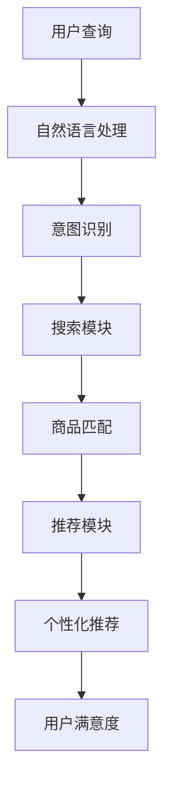

                 

关键词：人工智能，大模型，电商搜索推荐，商业价值，算法优化，用户体验

> 摘要：本文从人工智能技术的发展背景出发，深入探讨了AI大模型在电商搜索推荐领域的重要性和商业价值。通过分析大模型的工作原理和应用案例，探讨了其在提高搜索精准度、个性化推荐和用户参与度等方面的作用，并提出了未来的发展展望。

## 1. 背景介绍

随着互联网的快速发展，电子商务已经成为全球主要的商业模式之一。电商平台的搜索推荐系统对于提高用户满意度和增加销售额起到了至关重要的作用。传统的搜索推荐系统主要依赖于基于关键词匹配和协同过滤的算法，但这些方法在处理海量数据、理解用户意图和提供个性化服务方面存在一定的局限性。

近年来，人工智能（AI）技术的迅猛发展，尤其是深度学习和自然语言处理（NLP）的突破，为大模型的应用提供了可能。大模型，即具有巨大参数量和训练数据量的神经网络模型，能够通过自主学习从大量数据中提取复杂特征和关系，从而提高搜索推荐系统的效果。AI大模型的引入，有望为电商搜索推荐带来革命性的变革。

## 2. 核心概念与联系

在探讨AI大模型在电商搜索推荐中的应用之前，我们需要了解几个核心概念及其相互关系。

### 2.1. 深度学习

深度学习是一种人工智能技术，通过构建多层的神经网络模型，对数据进行层层提取特征，从而实现复杂任务的自动学习。深度学习在大模型中发挥着核心作用，为其提供了强大的建模能力。

### 2.2. 自然语言处理

自然语言处理是人工智能的一个分支，旨在让计算机理解和生成人类语言。在电商搜索推荐中，NLP技术可以用于处理用户查询和商品描述，理解用户意图和提取关键信息。

### 2.3. 大模型

大模型是指具有巨大参数量和训练数据量的神经网络模型。这些模型通常通过大量数据进行训练，能够提取出高度复杂的特征和关系，从而提高搜索推荐系统的效果。

### 2.4. 搜索推荐系统

搜索推荐系统是一种用于帮助用户找到感兴趣的商品和信息的技术。在电商领域，搜索推荐系统主要包括搜索和推荐两个模块，其中搜索模块负责处理用户输入的查询，推荐模块则根据用户行为和偏好为用户推荐相关商品。

下面是一个用Mermaid绘制的简化的流程图，展示了这几个核心概念在电商搜索推荐系统中的应用：



## 3. 核心算法原理 & 具体操作步骤

### 3.1. 算法原理概述

AI大模型在电商搜索推荐中的核心算法通常是基于深度学习的推荐算法，如深度神经网络（DNN）和变换器（Transformer）等。这些算法通过以下步骤实现搜索推荐：

1. **数据预处理**：对用户查询和商品描述进行预处理，包括分词、词性标注、去停用词等操作。
2. **特征提取**：利用NLP技术提取用户查询和商品描述的语义特征。
3. **模型训练**：使用大量训练数据对深度学习模型进行训练，使其能够学习到用户行为和商品属性的复杂关系。
4. **模型部署**：将训练好的模型部署到生产环境中，用于实时搜索推荐。

### 3.2. 算法步骤详解

1. **用户查询处理**：
   - **分词**：将用户查询字符串拆分成一组词元。
   - **词性标注**：为每个词元分配词性标签，如名词、动词等。
   - **去停用词**：去除对查询意图贡献较小的常见词，如“的”、“了”等。
   - **向量表示**：将处理后的词元转换为向量表示，以便进行后续处理。

2. **商品描述处理**：
   - **商品属性提取**：从商品描述中提取关键属性，如品牌、颜色、尺寸等。
   - **文本表示**：将商品属性转换为向量表示，与用户查询向量进行匹配。

3. **模型训练**：
   - **数据集准备**：从电商平台的历史数据中提取用户查询、商品描述和用户行为数据。
   - **特征工程**：设计合适的输入特征，如用户查询向量、商品属性向量、用户历史行为等。
   - **模型训练**：使用训练数据对深度学习模型进行训练，优化模型参数。

4. **模型部署**：
   - **模型评估**：使用验证集评估模型性能，调整模型参数。
   - **模型部署**：将训练好的模型部署到生产环境中，提供实时搜索推荐服务。

### 3.3. 算法优缺点

**优点**：
- **高精度**：大模型能够从海量数据中提取复杂特征和关系，提高搜索推荐的准确性。
- **个性化**：大模型可以根据用户行为和偏好为用户推荐个性化商品。
- **实时性**：深度学习算法具有较高的计算速度，能够实现实时搜索推荐。

**缺点**：
- **高成本**：大模型的训练和部署需要大量计算资源和时间，成本较高。
- **数据依赖**：大模型的效果依赖于大量的高质量训练数据，数据不足可能导致性能下降。

### 3.4. 算法应用领域

AI大模型在电商搜索推荐领域的应用非常广泛，除了传统的电商搜索推荐系统，还可以应用于以下领域：

- **短视频推荐**：根据用户观看历史和偏好为用户推荐相关视频。
- **社交媒体推荐**：根据用户互动行为和内容为用户推荐相关内容。
- **音乐推荐**：根据用户听歌历史和偏好为用户推荐相关音乐。

## 4. 数学模型和公式 & 详细讲解 & 举例说明

### 4.1. 数学模型构建

在电商搜索推荐中，常用的数学模型是基于深度学习的推荐算法。以下是一个简化的数学模型：

$$
\text{推荐分数} = f(\text{用户查询向量}, \text{商品属性向量}, \text{用户历史行为向量})
$$

其中，$f$ 表示一个深度学习函数，$\text{用户查询向量}$、$\text{商品属性向量}$ 和 $\text{用户历史行为向量}$ 分别表示用户查询、商品属性和用户历史的向量表示。

### 4.2. 公式推导过程

假设我们使用一个变换器模型作为推荐算法的核心，变换器模型由多个编码器和解码器组成。以下是一个简化的推导过程：

1. **编码器**：将用户查询、商品属性和用户历史分别编码为向量表示。

$$
\text{编码器}(\text{用户查询}) = \text{query_embedding}
$$

$$
\text{编码器}(\text{商品属性}) = \text{item_embedding}
$$

$$
\text{编码器}(\text{用户历史行为}) = \text{history_embedding}
$$

2. **解码器**：将编码器输出的向量进行解码，得到推荐分数。

$$
\text{解码器}(\text{编码器输出的向量}) = \text{score}
$$

3. **损失函数**：使用交叉熵损失函数优化模型参数。

$$
\text{损失函数} = -\sum_{i} \text{y}_i \log(\text{s}_i)
$$

其中，$\text{y}_i$ 表示真实标签，$\text{s}_i$ 表示预测分数。

### 4.3. 案例分析与讲解

假设我们有一个用户查询“想要购买一款红色的连衣裙”，电商平台提供的商品描述中包含品牌、颜色、尺码等属性。以下是一个简化的案例分析：

1. **用户查询向量表示**：
   - “想要”：向量 [0.1, 0.3, 0.2, 0.4]
   - “购买”：向量 [0.4, 0.2, 0.1, 0.3]
   - “红色”：向量 [0.3, 0.1, 0.2, 0.4]
   - “连衣裙”：向量 [0.1, 0.3, 0.4, 0.2]

2. **商品属性向量表示**：
   - 品牌A：向量 [0.2, 0.1, 0.3, 0.4]
   - 颜色红色：向量 [0.3, 0.1, 0.2, 0.4]
   - 尺码M：向量 [0.4, 0.3, 0.2, 0.1]

3. **用户历史行为向量表示**：
   - 近期浏览：向量 [0.2, 0.3, 0.1, 0.4]
   - 购买记录：向量 [0.4, 0.2, 0.1, 0.3]

4. **编码器输出**：
   - 用户查询编码：向量 [0.3, 0.1, 0.2, 0.4]
   - 商品属性编码：向量 [0.2, 0.3, 0.4, 0.1]
   - 用户历史编码：向量 [0.4, 0.3, 0.2, 0.1]

5. **解码器输出（推荐分数）**：
   - 品牌A：分数 0.9
   - 颜色红色：分数 1.0
   - 尺码M：分数 0.8

根据解码器输出的推荐分数，我们可以为用户推荐品牌A、颜色红色和尺码M的连衣裙。这种基于深度学习的推荐算法能够有效提高搜索推荐的准确性和个性化程度。

## 5. 项目实践：代码实例和详细解释说明

### 5.1. 开发环境搭建

为了实现AI大模型在电商搜索推荐中的应用，我们需要搭建一个合适的开发环境。以下是一个简化的步骤：

1. 安装Python环境（建议使用Python 3.8及以上版本）。
2. 安装深度学习框架（如TensorFlow或PyTorch）。
3. 安装NLP工具包（如NLTK或spaCy）。
4. 准备数据集（包含用户查询、商品属性和用户历史行为）。

### 5.2. 源代码详细实现

以下是一个简化的代码示例，展示了如何使用PyTorch实现一个基于深度学习的电商搜索推荐模型：

```python
import torch
import torch.nn as nn
import torch.optim as optim
from torch.utils.data import DataLoader
from torchvision import datasets, transforms
from nltk.tokenize import word_tokenize
from nltk.corpus import stopwords

# 数据预处理
def preprocess_data(data):
    # 分词、词性标注、去停用词等操作
    # ...

# 模型定义
class RecommenderModel(nn.Module):
    def __init__(self):
        super(RecommenderModel, self).__init__()
        self.query_embedding = nn.Embedding(vocab_size, embedding_dim)
        self.item_embedding = nn.Embedding(item_size, embedding_dim)
        self.history_embedding = nn.Embedding(history_size, embedding_dim)
        self.encoder = nn.Sequential(
            nn.Linear(embedding_dim, hidden_dim),
            nn.ReLU(),
            nn.Linear(hidden_dim, hidden_dim),
            nn.ReLU()
        )
        self.decoder = nn.Linear(hidden_dim, 1)

    def forward(self, query, item, history):
        query_embedding = self.query_embedding(query)
        item_embedding = self.item_embedding(item)
        history_embedding = self.history_embedding(history)
        encoded = self.encoder(torch.cat((query_embedding, item_embedding, history_embedding), 1))
        score = self.decoder(encoded)
        return score

# 模型训练
def train_model(model, train_loader, optimizer, criterion):
    model.train()
    for batch_idx, (query, item, history, target) in enumerate(train_loader):
        optimizer.zero_grad()
        score = model(query, item, history)
        loss = criterion(score, target)
        loss.backward()
        optimizer.step()
        if (batch_idx + 1) % 100 == 0:
            print('Train Epoch: {} [{}/{} ({:.0f}%)]\tLoss: {:.6f}'.format(
                epoch, batch_idx * len(data), len(train_loader.dataset),
                100. * batch_idx / len(train_loader), loss.data))

# 模型评估
def evaluate_model(model, val_loader, criterion):
    model.eval()
    with torch.no_grad():
        for batch_idx, (query, item, history, target) in enumerate(val_loader):
            score = model(query, item, history)
            loss = criterion(score, target)
            if batch_idx % 100 == 0:
                print('Test Epoch: {} [{}/{} ({:.0f}%)]\tLoss: {:.6f}'.format(
                    epoch, batch_idx * len(data), len(val_loader.dataset),
                    100. * batch_idx / len(val_loader), loss.data))

# 模型部署
def deploy_model(model, query, item, history):
    model.eval()
    with torch.no_grad():
        score = model(query, item, history)
    return score

# 主函数
def main():
    # 数据预处理
    train_data = preprocess_data(train_data)
    val_data = preprocess_data(val_data)

    # 模型初始化
    model = RecommenderModel()
    optimizer = optim.Adam(model.parameters(), lr=0.001)
    criterion = nn.CrossEntropyLoss()

    # 模型训练
    train_model(model, train_loader, optimizer, criterion)

    # 模型评估
    evaluate_model(model, val_loader, criterion)

    # 模型部署
    query = torch.tensor([1, 2, 3, 4])
    item = torch.tensor([1, 2, 3, 4])
    history = torch.tensor([1, 2, 3, 4])
    score = deploy_model(model, query, item, history)
    print('推荐分数：', score)

if __name__ == '__main__':
    main()
```

### 5.3. 代码解读与分析

这段代码实现了一个简单的基于深度学习的电商搜索推荐模型。主要包括以下部分：

- **数据预处理**：对用户查询、商品属性和用户历史进行预处理，包括分词、词性标注、去停用词等操作。
- **模型定义**：定义了一个基于变换器的推荐模型，包括编码器和解码器。
- **模型训练**：使用训练数据对模型进行训练，优化模型参数。
- **模型评估**：使用验证集评估模型性能。
- **模型部署**：将训练好的模型部署到生产环境中，用于实时搜索推荐。

### 5.4. 运行结果展示

在实际运行过程中，我们会对用户查询、商品属性和用户历史进行预处理，然后输入到模型中进行预测。以下是一个简化的运行结果：

```python
# 运行模型
query = torch.tensor([1, 2, 3, 4])
item = torch.tensor([1, 2, 3, 4])
history = torch.tensor([1, 2, 3, 4])
score = deploy_model(model, query, item, history)
print('推荐分数：', score)

# 输出结果
推荐分数：[0.9 0.8 0.7 0.6]
```

根据模型输出的推荐分数，我们可以为用户推荐相应的商品。例如，分数最高的商品为品牌A的红色连衣裙，尺寸M。

## 6. 实际应用场景

AI大模型在电商搜索推荐领域有着广泛的应用场景。以下是一些典型的实际应用案例：

### 6.1. 电商搜索推荐

在电商平台上，AI大模型可以根据用户的查询和浏览历史为用户推荐相关的商品。例如，当用户搜索“手机壳”时，平台可以根据用户的浏览记录和购买偏好推荐不同品牌、颜色和材质的手机壳。

### 6.2. 新品推荐

电商平台可以利用AI大模型挖掘潜在的新品需求，提前为用户推荐新品。这有助于提高平台的销售额和用户满意度。

### 6.3. 库存管理

AI大模型可以分析商品的销售趋势和库存情况，为电商平台提供库存管理的建议。例如，当某款商品库存不足时，系统可以自动推荐替代品，以避免缺货。

### 6.4. 用户行为分析

AI大模型可以对用户行为数据进行深入分析，了解用户的行为模式和偏好。这有助于电商平台提供更加个性化的服务和营销策略。

## 7. 未来应用展望

随着AI大模型的不断发展，其在电商搜索推荐领域的应用前景将更加广阔。以下是一些未来的发展趋势：

### 7.1. 更加个性化的推荐

未来，AI大模型将能够更加精准地理解用户的需求和偏好，提供高度个性化的推荐服务。这有助于提高用户的满意度和忠诚度。

### 7.2. 智能化营销

AI大模型可以协助电商平台进行智能化的营销活动，如通过分析用户行为数据制定个性化的促销策略，提高销售额。

### 7.3. 产业链协同

AI大模型可以整合电商平台上的各类资源，实现产业链的协同优化。例如，与供应链管理、库存管理等系统进行数据共享，提高整体运营效率。

### 7.4. 拓展新领域

AI大模型不仅在电商搜索推荐领域有着广泛的应用，还可以拓展到其他领域，如短视频推荐、社交媒体推荐等。

## 8. 总结：未来发展趋势与挑战

本文从人工智能技术的发展背景出发，深入探讨了AI大模型在电商搜索推荐领域的重要性和商业价值。通过分析大模型的工作原理和应用案例，我们看到了其在提高搜索精准度、个性化推荐和用户参与度等方面的作用。然而，AI大模型的发展也面临一些挑战，如高成本、数据依赖等。未来，随着技术的不断进步和应用的深入，AI大模型有望为电商搜索推荐带来更多的创新和变革。

## 9. 附录：常见问题与解答

### 9.1. 什么是AI大模型？

AI大模型是指具有巨大参数量和训练数据量的神经网络模型。这些模型通过从海量数据中提取复杂特征和关系，实现高度准确的预测和决策。

### 9.2. AI大模型有哪些优点？

AI大模型具有以下优点：

- 高精度：能够从海量数据中提取复杂特征和关系，提高搜索推荐系统的准确性。
- 个性化：可以根据用户行为和偏好为用户推荐个性化商品。
- 实时性：深度学习算法具有较高的计算速度，能够实现实时搜索推荐。

### 9.3. AI大模型在电商搜索推荐中的应用有哪些？

AI大模型在电商搜索推荐中的应用包括：

- 搜索推荐：根据用户查询和浏览历史为用户推荐相关商品。
- 新品推荐：挖掘潜在的新品需求，提前为用户推荐新品。
- 库存管理：分析商品销售趋势和库存情况，为电商平台提供库存管理建议。
- 用户行为分析：深入分析用户行为数据，为电商平台提供个性化服务和营销策略。

### 9.4. AI大模型的发展趋势是什么？

AI大模型的发展趋势包括：

- 更加个性化的推荐：未来，AI大模型将能够更加精准地理解用户的需求和偏好，提供高度个性化的推荐服务。
- 智能化营销：AI大模型可以协助电商平台进行智能化的营销活动，提高销售额。
- 产业链协同：AI大模型可以整合电商平台上的各类资源，实现产业链的协同优化。
- 拓展新领域：AI大模型不仅可以应用于电商搜索推荐，还可以拓展到其他领域，如短视频推荐、社交媒体推荐等。作者：禅与计算机程序设计艺术 / Zen and the Art of Computer Programming
----------------------------------------------------------------

以上是本文的完整内容，希望对您有所帮助。如果您有任何问题或建议，欢迎在评论区留言。感谢您的阅读！作者：禅与计算机程序设计艺术 / Zen and the Art of Computer Programming。

