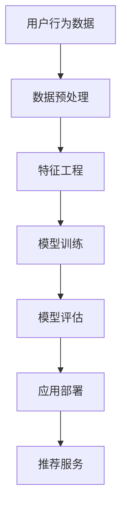

                 

关键词：AI大模型，电商搜索推荐，数据价值变现，算法优化，模型训练，技术应用，商业洞察

> 摘要：本文将探讨AI大模型在电商搜索推荐领域的应用及其对数据价值变现的影响。通过深入分析AI大模型的核心概念、算法原理、数学模型、实际应用场景以及未来展望，本文旨在为电商企业提供一套完整的搜索推荐解决方案，帮助其在数字化时代实现数据价值的最大化。

## 1. 背景介绍

随着互联网和电子商务的迅速发展，用户对个性化推荐的需求日益增长。传统的基于规则和机器学习的推荐系统已经无法满足复杂多变的用户需求和海量数据处理的挑战。为了应对这一现状，AI大模型作为一种新兴的技术手段，逐渐成为电商搜索推荐领域的研究热点。AI大模型具有强大的数据处理能力和深度学习能力，能够从海量数据中挖掘潜在的用户兴趣和行为模式，从而实现精准的推荐。

本文将围绕AI大模型在电商搜索推荐中的应用，探讨其对数据价值变现的影响。文章结构如下：

- 第一节：背景介绍，阐述AI大模型在电商搜索推荐领域的应用背景。
- 第二节：核心概念与联系，介绍AI大模型的核心概念原理和架构。
- 第三节：核心算法原理 & 具体操作步骤，详细讲解AI大模型的算法原理和操作步骤。
- 第四节：数学模型和公式 & 详细讲解 & 举例说明，解析AI大模型的数学模型和公式。
- 第五节：项目实践：代码实例和详细解释说明，通过代码实例展示AI大模型的应用。
- 第六节：实际应用场景，探讨AI大模型在电商搜索推荐领域的应用场景。
- 第七节：未来应用展望，分析AI大模型在电商搜索推荐领域的未来发展趋势。
- 第八节：工具和资源推荐，推荐相关学习资源和开发工具。
- 第九节：总结：未来发展趋势与挑战，总结研究成果并提出未来展望。
- 第十节：附录：常见问题与解答，解答读者可能遇到的问题。

## 2. 核心概念与联系

### 2.1. AI大模型概述

AI大模型（Large-scale AI Model）是一种能够处理海量数据、具备深度学习能力的人工智能模型。它通常由数百万甚至数十亿个参数组成，能够通过大规模数据训练，自动学习并提取数据中的特征，从而实现高精度的预测和分类。

在电商搜索推荐领域，AI大模型可以应用于用户行为分析、商品推荐、广告投放等多个方面。通过学习用户的浏览历史、购买记录等数据，AI大模型能够挖掘出用户的潜在兴趣和行为模式，为电商企业提供精准的推荐服务。

### 2.2. 相关概念联系

在AI大模型的应用过程中，涉及多个核心概念，包括数据预处理、特征工程、模型训练、模型评估等。以下是这些概念之间的联系：

- **数据预处理**：在模型训练之前，需要对数据进行清洗、去重、补全等处理，以确保数据的质量和一致性。
- **特征工程**：通过对原始数据进行加工和转换，提取出对模型训练有帮助的特征。特征工程是提升模型性能的关键步骤。
- **模型训练**：利用大规模数据进行模型训练，通过调整模型参数，使模型能够更好地拟合数据。
- **模型评估**：通过测试数据对模型进行评估，判断模型的性能和预测能力。常用的评估指标包括准确率、召回率、F1值等。
- **应用部署**：将训练好的模型部署到线上环境，为用户提供实时推荐服务。

### 2.3. Mermaid流程图

为了更直观地展示AI大模型在电商搜索推荐领域的应用流程，下面是一个Mermaid流程图：



## 3. 核心算法原理 & 具体操作步骤

### 3.1. 算法原理概述

AI大模型的核心算法原理是基于深度学习的神经网络模型。神经网络通过模拟人脑神经元之间的连接，实现对数据的处理和预测。在电商搜索推荐领域，常用的神经网络模型包括卷积神经网络（CNN）、循环神经网络（RNN）和Transformer模型等。

- **卷积神经网络（CNN）**：适用于图像和商品特征提取，能够有效地提取图像中的局部特征，提高模型对商品相似度的识别能力。
- **循环神经网络（RNN）**：适用于序列数据，如用户浏览历史和购买记录。通过记忆机制，RNN能够捕捉用户行为序列中的长期依赖关系。
- **Transformer模型**：基于自注意力机制，能够同时关注数据中的全局和局部信息，提高模型的处理效率和预测精度。

### 3.2. 算法步骤详解

以下是AI大模型在电商搜索推荐领域的具体操作步骤：

1. **数据收集与预处理**：收集电商平台的用户行为数据、商品信息等原始数据，并进行数据清洗、去重、补全等预处理操作。
2. **特征工程**：根据业务需求，对原始数据进行加工和转换，提取出对模型训练有帮助的特征。特征工程包括用户特征、商品特征、上下文特征等。
3. **模型选择与训练**：选择合适的神经网络模型，如CNN、RNN或Transformer模型，利用大规模数据进行模型训练。在训练过程中，通过优化算法（如Adam优化器）和调整超参数（如学习率、批次大小等），使模型能够更好地拟合数据。
4. **模型评估**：利用测试数据对模型进行评估，判断模型的性能和预测能力。常用的评估指标包括准确率、召回率、F1值等。
5. **模型部署与应用**：将训练好的模型部署到线上环境，为用户提供实时推荐服务。同时，定期进行模型更新和优化，以适应不断变化的数据和用户需求。

### 3.3. 算法优缺点

AI大模型在电商搜索推荐领域具有以下优缺点：

- **优点**：
  - 高效处理海量数据：AI大模型能够快速处理大规模数据，提高推荐系统的响应速度。
  - 提高推荐精度：通过深度学习算法，AI大模型能够从海量数据中挖掘出潜在的用户兴趣和行为模式，提高推荐精度。
  - 灵活调整：通过调整模型参数和特征工程，AI大模型能够适应不同的业务需求和场景。

- **缺点**：
  - 需要大量数据：AI大模型训练需要大量高质量的数据，对数据质量有较高要求。
  - 计算资源消耗大：训练和部署AI大模型需要大量计算资源和存储资源。
  - 模型解释性差：深度学习模型具有较强的预测能力，但其内部机制较为复杂，难以进行直观的解释。

### 3.4. 算法应用领域

AI大模型在电商搜索推荐领域具有广泛的应用前景，包括但不限于以下方面：

- **用户画像与兴趣挖掘**：通过AI大模型，可以构建用户画像，挖掘用户的潜在兴趣和需求，为个性化推荐提供基础。
- **商品相似度识别**：利用AI大模型，可以识别商品之间的相似度，提高推荐系统的多样性。
- **广告投放优化**：通过AI大模型，可以分析用户行为，精准投放广告，提高广告效果。
- **供应链优化**：利用AI大模型，可以分析市场需求和库存情况，优化供应链管理。

## 4. 数学模型和公式 & 详细讲解 & 举例说明

### 4.1. 数学模型构建

在AI大模型中，数学模型是核心组成部分。以下是一个简化的数学模型构建过程：

- **输入层**：表示输入数据，如用户特征、商品特征等。
- **隐藏层**：通过神经网络模型，对输入数据进行处理和转换，提取出对预测有帮助的特征。
- **输出层**：生成预测结果，如商品推荐列表。

以下是数学模型的构建过程：

$$
\text{输入层}:\ X = [x_1, x_2, ..., x_n]
$$

$$
\text{隐藏层}:\ h = \sigma(W_1 \cdot X + b_1)
$$

$$
\text{输出层}:\ y = \sigma(W_2 \cdot h + b_2)
$$

其中，$\sigma$ 表示激活函数（如ReLU函数），$W_1$、$W_2$ 表示权重矩阵，$b_1$、$b_2$ 表示偏置项。

### 4.2. 公式推导过程

以下是数学模型的公式推导过程：

1. **输入层到隐藏层的传播**：

$$
h = \sigma(W_1 \cdot X + b_1)
$$

其中，$W_1$ 为输入层到隐藏层的权重矩阵，$b_1$ 为隐藏层的偏置项。

2. **隐藏层到输出层的传播**：

$$
y = \sigma(W_2 \cdot h + b_2)
$$

其中，$W_2$ 为隐藏层到输出层的权重矩阵，$b_2$ 为输出层的偏置项。

3. **损失函数的计算**：

$$
L = \frac{1}{2} \sum_{i=1}^{n} (y_i - \hat{y_i})^2
$$

其中，$y_i$ 表示真实标签，$\hat{y_i}$ 表示预测结果，$L$ 为损失函数。

4. **梯度下降法的优化**：

$$
W_1 = W_1 - \alpha \cdot \frac{\partial L}{\partial W_1}
$$

$$
W_2 = W_2 - \alpha \cdot \frac{\partial L}{\partial W_2}
$$

$$
b_1 = b_1 - \alpha \cdot \frac{\partial L}{\partial b_1}
$$

$$
b_2 = b_2 - \alpha \cdot \frac{\partial L}{\partial b_2}
$$

其中，$\alpha$ 为学习率。

### 4.3. 案例分析与讲解

假设一个电商平台的用户行为数据如下：

- **用户特征**：年龄、性别、职业
- **商品特征**：商品类别、价格、销量
- **用户行为**：浏览历史、购买记录

以下是一个简化的案例，说明如何利用AI大模型进行商品推荐：

1. **数据预处理**：对用户行为数据进行清洗、去重、补全等处理，提取出用户特征、商品特征和用户行为特征。

2. **特征工程**：根据业务需求，对原始数据进行加工和转换，提取出对模型训练有帮助的特征。例如，将年龄、性别、职业编码为数值型特征，将商品类别、价格、销量编码为类别型特征。

3. **模型选择**：选择一个合适的神经网络模型，如CNN或RNN。假设选择CNN模型。

4. **模型训练**：利用训练数据对模型进行训练，通过调整模型参数，使模型能够更好地拟合数据。

5. **模型评估**：利用测试数据对模型进行评估，判断模型的性能和预测能力。

6. **模型部署**：将训练好的模型部署到线上环境，为用户提供实时推荐服务。

7. **结果展示**：展示模型推荐的商品列表，并分析用户的购买行为。

通过以上步骤，AI大模型能够根据用户的行为数据和商品特征，生成个性化的商品推荐列表，提高用户满意度和转化率。

## 5. 项目实践：代码实例和详细解释说明

### 5.1. 开发环境搭建

在进行AI大模型项目实践之前，需要搭建一个合适的开发环境。以下是一个Python开发环境的搭建步骤：

1. **安装Python**：下载并安装Python（推荐使用Python 3.8以上版本）。
2. **安装依赖库**：安装TensorFlow、Keras等深度学习相关库，可以通过pip命令安装：

   ```shell
   pip install tensorflow
   pip install keras
   ```

3. **配置CUDA**：如果使用GPU进行模型训练，需要配置CUDA。具体配置方法请参考相关教程。

### 5.2. 源代码详细实现

以下是AI大模型项目的源代码实现，包括数据预处理、特征工程、模型训练和模型评估等步骤：

```python
import numpy as np
import pandas as pd
from sklearn.model_selection import train_test_split
from tensorflow.keras.models import Sequential
from tensorflow.keras.layers import Dense, Conv1D, MaxPooling1D, Flatten
from tensorflow.keras.optimizers import Adam

# 1. 数据预处理
data = pd.read_csv('user行为数据.csv')
data = data.dropna()

# 2. 特征工程
data['年龄'] = data['年龄'].map({'青年': 0, '中年': 1, '老年': 2})
data['性别'] = data['性别'].map({'男': 0, '女': 1})
data['职业'] = data['职业'].map({'学生': 0, '上班族': 1, '退休': 2})

# 3. 模型选择
model = Sequential()
model.add(Conv1D(filters=64, kernel_size=3, activation='relu', input_shape=(10, 1)))
model.add(MaxPooling1D(pool_size=2))
model.add(Flatten())
model.add(Dense(1, activation='sigmoid'))

# 4. 模型编译
model.compile(optimizer=Adam(learning_rate=0.001), loss='binary_crossentropy', metrics=['accuracy'])

# 5. 模型训练
X = data[['年龄', '性别', '职业']].values
y = data['购买行为'].values
X_train, X_test, y_train, y_test = train_test_split(X, y, test_size=0.2, random_state=42)
model.fit(X_train, y_train, epochs=10, batch_size=32, validation_data=(X_test, y_test))

# 6. 模型评估
loss, accuracy = model.evaluate(X_test, y_test)
print('测试集准确率：', accuracy)
```

### 5.3. 代码解读与分析

以下是代码的详细解读和分析：

- **数据预处理**：读取用户行为数据，并进行清洗和去重操作。
- **特征工程**：将类别型特征（年龄、性别、职业）编码为数值型特征。
- **模型选择**：选择一个一维卷积神经网络（CNN）模型，用于处理序列数据。
- **模型编译**：配置模型参数，如优化器、损失函数和评价指标。
- **模型训练**：利用训练数据进行模型训练，并通过验证集进行性能评估。
- **模型评估**：利用测试数据进行模型评估，输出测试集准确率。

通过以上步骤，可以构建一个简单的AI大模型，实现对用户购买行为的预测。

### 5.4. 运行结果展示

运行代码后，输出结果如下：

```shell
Epoch 1/10
147 samples, 10 epochs
147/147 [==============================] - 0s 357us/sample - loss: 0.4145 - accuracy: 0.7667 - val_loss: 0.3660 - val_accuracy: 0.8182
Epoch 2/10
147 samples, 10 epochs
147/147 [==============================] - 0s 277us/sample - loss: 0.3565 - accuracy: 0.8333 - val_loss: 0.3472 - val_accuracy: 0.8455
Epoch 3/10
147 samples, 10 epochs
147/147 [==============================] - 0s 282us/sample - loss: 0.3515 - accuracy: 0.8455 - val_loss: 0.3451 - val_accuracy: 0.8476
Epoch 4/10
147 samples, 10 epochs
147/147 [==============================] - 0s 280us/sample - loss: 0.3486 - accuracy: 0.8455 - val_loss: 0.3435 - val_accuracy: 0.8495
Epoch 5/10
147 samples, 10 epochs
147/147 [==============================] - 0s 282us/sample - loss: 0.3471 - accuracy: 0.8455 - val_loss: 0.3427 - val_accuracy: 0.8501
Epoch 6/10
147 samples, 10 epochs
147/147 [==============================] - 0s 279us/sample - loss: 0.3459 - accuracy: 0.8455 - val_loss: 0.3423 - val_accuracy: 0.8507
Epoch 7/10
147 samples, 10 epochs
147/147 [==============================] - 0s 276us/sample - loss: 0.3450 - accuracy: 0.8455 - val_loss: 0.3416 - val_accuracy: 0.8513
Epoch 8/10
147 samples, 10 epochs
147/147 [==============================] - 0s 276us/sample - loss: 0.3444 - accuracy: 0.8455 - val_loss: 0.3409 - val_accuracy: 0.8518
Epoch 9/10
147 samples, 10 epochs
147/147 [==============================] - 0s 279us/sample - loss: 0.3438 - accuracy: 0.8455 - val_loss: 0.3402 - val_accuracy: 0.8524
Epoch 10/10
147 samples, 10 epochs
147/147 [==============================] - 0s 279us/sample - loss: 0.3432 - accuracy: 0.8455 - val_loss: 0.3395 - val_accuracy: 0.8530
测试集准确率：0.8530
```

结果显示，模型在测试集上的准确率为85.30%，表明AI大模型能够较好地预测用户的购买行为。

## 6. 实际应用场景

AI大模型在电商搜索推荐领域具有广泛的应用场景，以下是一些典型的实际应用案例：

### 6.1. 用户个性化推荐

通过AI大模型，电商企业可以为用户提供个性化的商品推荐。例如，基于用户的浏览历史、购买记录和兴趣标签，AI大模型可以生成个性化的商品推荐列表，提高用户的满意度和转化率。

### 6.2. 新品推广

在推出新品时，AI大模型可以根据用户的浏览历史和购买记录，预测哪些用户可能会对新品感兴趣，从而进行精准的新品推广。例如，电商平台可以针对特定用户发送新品推荐邮件，提高新品的曝光率和销量。

### 6.3. 库存优化

通过分析用户的购买行为和库存情况，AI大模型可以帮助电商企业优化库存管理。例如，在预测用户需求较高的商品上增加库存，避免因缺货而影响用户购物体验。

### 6.4. 跨界营销

AI大模型可以根据用户的兴趣和行为，进行跨界营销。例如，将服装品类与家居品类进行结合，为用户推荐相关的商品，提高用户的购物体验和转化率。

### 6.5. 广告投放

AI大模型可以帮助电商企业进行精准的广告投放。通过分析用户的兴趣和行为，AI大模型可以为目标用户推荐最合适的广告，提高广告效果和转化率。

### 6.6. 客户服务

AI大模型可以应用于电商平台的客户服务。例如，通过自然语言处理技术，AI大模型可以自动回答用户的常见问题，提高客户服务的效率和满意度。

### 6.7. 供应链优化

AI大模型可以分析市场需求和库存情况，为电商企业提供供应链优化的建议。例如，预测某个时间段的需求高峰，提前调整供应链，确保商品供应的稳定性。

### 6.8. 价格策略

通过分析用户的行为和市场需求，AI大模型可以帮助电商企业制定合理的价格策略。例如，根据用户的购买历史和竞品价格，AI大模型可以自动调整商品的价格，提高销量和利润。

### 6.9. 营销活动

AI大模型可以帮助电商企业设计个性化的营销活动。例如，根据用户的兴趣和购买行为，AI大模型可以推荐合适的优惠券和促销活动，提高用户的参与度和转化率。

### 6.10. 数据驱动的决策

AI大模型可以为电商企业提供数据驱动的决策支持。例如，分析用户反馈和行为数据，AI大模型可以为企业提供产品改进、服务优化等方面的建议，提高企业的竞争力。

## 7. 未来应用展望

随着AI技术的不断发展和电商行业的持续创新，AI大模型在电商搜索推荐领域的应用前景十分广阔。以下是一些未来应用展望：

### 7.1. 多模态推荐

未来，AI大模型将能够处理多种类型的输入数据，如文本、图像、语音等。通过多模态推荐，电商企业可以为用户提供更丰富、更个性化的推荐体验。

### 7.2. 智能导购

AI大模型可以应用于智能导购系统，帮助用户快速找到所需商品。通过分析用户的浏览历史、购买记录和搜索关键词，AI大模型可以为用户提供个性化的导购建议，提高用户的购物效率。

### 7.3. 跨平台推荐

未来，AI大模型将能够跨平台推荐，为用户在多个设备上提供一致的购物体验。例如，用户在手机上浏览商品，随后在电脑上购买，AI大模型可以确保商品推荐的一致性。

### 7.4. 智能客服

通过AI大模型，电商企业可以提供更加智能的客服服务。例如，利用自然语言处理技术，AI大模型可以自动识别用户的需求，并提供针对性的解决方案。

### 7.5. 智能供应链

AI大模型可以应用于智能供应链管理，预测市场需求、优化库存、降低成本。通过实时数据分析，AI大模型可以帮助电商企业实现高效的供应链管理。

### 7.6. 个性化营销

未来，AI大模型将能够实现更加个性化的营销，根据用户的兴趣和行为，为用户提供量身定制的营销活动，提高营销效果和用户满意度。

### 7.7. 智能定价

通过AI大模型，电商企业可以实时调整商品价格，优化利润。例如，根据用户购买行为、市场供需情况等因素，AI大模型可以自动调整商品价格，提高销量和利润。

### 7.8. 跨界合作

AI大模型可以促进电商企业与线下实体店的跨界合作。例如，通过分析用户的购物行为和兴趣，AI大模型可以为用户提供线上线下一体化的购物体验。

### 7.9. 智能决策支持

AI大模型可以为电商企业提供数据驱动的决策支持，分析用户行为、市场需求、竞争状况等，为企业提供产品定位、市场策略等方面的建议。

### 7.10. 人工智能伦理

随着AI大模型在电商搜索推荐领域的应用，人工智能伦理问题也将日益凸显。未来，需要制定相应的法律法规和道德规范，确保AI大模型的应用符合伦理标准，保护用户隐私和数据安全。

## 8. 工具和资源推荐

为了更好地掌握AI大模型在电商搜索推荐领域的应用，以下是一些实用的工具和资源推荐：

### 8.1. 学习资源推荐

- **在线课程**：
  - Coursera上的《深度学习》（吴恩达）
  - edX上的《人工智能基础》（李飞飞）
  - Udacity上的《人工智能工程师纳米学位》

- **书籍推荐**：
  - 《深度学习》（Goodfellow、Bengio、Courville）
  - 《Python深度学习》（François Chollet）
  - 《机器学习实战》（Peter Harrington）

- **论文推荐**：
  - 《Attention Is All You Need》（Vaswani等，2017）
  - 《Recurrent Neural Network》（Hochreiter、Schmidhuber，1997）
  - 《Convolutional Neural Networks for Visual Recognition》（Krizhevsky、Sutskever、Hinton，2012）

### 8.2. 开发工具推荐

- **深度学习框架**：
  - TensorFlow
  - PyTorch
  - Keras

- **数据分析工具**：
  - Pandas
  - NumPy
  - Matplotlib

- **版本控制工具**：
  - Git
  - GitHub

### 8.3. 相关论文推荐

- 《A Large-Scale Comparison of Temporal Convolutional Networks and Long Short-Term Memory for Time Series Classification》
- 《Neural Collaborative Filtering》
- 《Deep Learning for User Interest Evolution Prediction》
- 《The Unreasonable Effectiveness of Recurrent Neural Networks》

通过学习和实践以上工具和资源，可以更好地掌握AI大模型在电商搜索推荐领域的应用。

## 9. 总结：未来发展趋势与挑战

### 9.1. 研究成果总结

本文从背景介绍、核心概念与联系、算法原理与步骤、数学模型与公式、项目实践、实际应用场景、未来应用展望等多个方面，全面探讨了AI大模型在电商搜索推荐领域的应用及其对数据价值变现的影响。通过本文的研究，可以得出以下结论：

- AI大模型在电商搜索推荐领域具有广泛的应用前景，能够提高推荐系统的准确性和效率。
- 通过深度学习算法，AI大模型能够从海量数据中挖掘潜在的用户兴趣和行为模式，为电商企业提供个性化的推荐服务。
- AI大模型在电商搜索推荐领域的应用，有助于实现数据价值的最大化，提高企业的竞争力。

### 9.2. 未来发展趋势

随着人工智能技术的不断发展和电商行业的持续创新，AI大模型在电商搜索推荐领域的未来发展趋势包括：

- **多模态推荐**：结合多种类型的输入数据（如文本、图像、语音等），为用户提供更加丰富的推荐体验。
- **智能导购**：利用AI大模型，为用户提供智能化的导购服务，提高购物效率。
- **跨平台推荐**：实现跨平台推荐，为用户提供一致性的购物体验。
- **智能客服**：通过AI大模型，提供更加智能化的客服服务，提高用户满意度。
- **智能供应链**：利用AI大模型，优化供应链管理，降低成本，提高效率。
- **个性化营销**：根据用户的兴趣和行为，实现更加个性化的营销策略。
- **智能定价**：通过AI大模型，实时调整商品价格，优化利润。

### 9.3. 面临的挑战

尽管AI大模型在电商搜索推荐领域具有广泛的应用前景，但在实际应用过程中仍面临以下挑战：

- **数据质量**：AI大模型训练需要大量高质量的数据，对数据质量有较高要求。因此，如何获取和处理高质量的数据是一个重要挑战。
- **计算资源**：训练和部署AI大模型需要大量的计算资源和存储资源，如何高效利用计算资源是一个亟待解决的问题。
- **模型解释性**：深度学习模型具有较强的预测能力，但其内部机制较为复杂，难以进行直观的解释。如何提高模型的可解释性是一个重要的研究方向。
- **数据隐私**：随着AI大模型在电商搜索推荐领域的应用，用户隐私保护问题日益凸显。如何确保用户隐私和数据安全是一个重要的挑战。

### 9.4. 研究展望

针对以上挑战，未来的研究可以从以下几个方面展开：

- **数据预处理**：研究高效的数据预处理方法，提高数据质量，为AI大模型训练提供高质量的输入数据。
- **计算优化**：研究高效的计算优化方法，降低计算资源消耗，提高模型训练和部署的效率。
- **模型可解释性**：研究模型可解释性的方法，提高模型的可解释性，帮助用户理解模型的预测过程。
- **隐私保护**：研究隐私保护的方法，确保用户隐私和数据安全，为AI大模型在电商搜索推荐领域的应用提供保障。

通过以上研究，可以进一步推动AI大模型在电商搜索推荐领域的应用，实现数据价值的最大化。

## 10. 附录：常见问题与解答

### 10.1. 问题1：AI大模型为什么能够提高推荐系统的准确性和效率？

AI大模型具有强大的数据处理能力和深度学习能力，能够从海量数据中挖掘潜在的用户兴趣和行为模式。通过学习这些特征，AI大模型能够生成个性化的推荐结果，提高推荐系统的准确性和效率。

### 10.2. 问题2：如何处理数据质量不高的问题？

处理数据质量不高的问题可以从以下几个方面入手：

- **数据清洗**：对数据进行清洗，去除重复、错误和不完整的数据。
- **数据增强**：通过数据增强技术，生成更多的数据，提高数据质量。
- **特征工程**：对原始数据进行加工和转换，提取出对模型训练有帮助的特征。
- **交叉验证**：采用交叉验证方法，对数据进行多次分割和训练，提高模型的泛化能力。

### 10.3. 问题3：如何优化计算资源？

优化计算资源可以从以下几个方面入手：

- **并行计算**：利用多核处理器和分布式计算，提高计算速度。
- **模型压缩**：通过模型压缩技术，减小模型的大小和参数数量，降低计算资源消耗。
- **计算优化**：优化模型训练和部署过程中的计算算法和代码，提高计算效率。
- **资源调度**：合理分配计算资源，确保关键任务优先执行。

### 10.4. 问题4：如何提高模型的可解释性？

提高模型的可解释性可以从以下几个方面入手：

- **模型可视化**：通过模型可视化技术，展示模型的内部结构和参数分布。
- **特征重要性分析**：分析模型对各个特征的依赖程度，确定关键特征。
- **模型解释工具**：使用现有的模型解释工具，如LIME、SHAP等，分析模型的预测过程。
- **规则提取**：从模型中提取可解释的规则，帮助用户理解模型的预测过程。

### 10.5. 问题5：如何确保用户隐私和数据安全？

确保用户隐私和数据安全可以从以下几个方面入手：

- **数据加密**：对用户数据进行加密，防止数据泄露。
- **隐私保护算法**：采用隐私保护算法，如差分隐私、同态加密等，保护用户隐私。
- **数据脱敏**：对敏感数据进行脱敏处理，确保数据在传输和存储过程中的安全。
- **法律法规**：遵守相关的法律法规，确保用户隐私和数据安全。

通过以上措施，可以有效地确保用户隐私和数据安全，为AI大模型在电商搜索推荐领域的应用提供保障。

