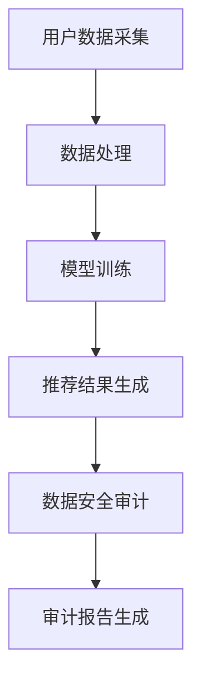

                 

在互联网高度发展的今天，电商搜索推荐系统已成为电商平台的核心竞争力。然而，随着数据规模的不断扩大和数据复杂性的增加，确保数据安全和隐私保护成为了一个不容忽视的问题。本文旨在探讨如何利用AI大模型重构电商搜索推荐系统的数据安全审计工具选型，并提供最佳实践。

## 文章关键词

- AI大模型
- 电商搜索推荐
- 数据安全审计
- 工具选型
- 最佳实践

## 文章摘要

本文将深入探讨AI大模型在电商搜索推荐系统中的数据安全审计作用。首先介绍AI大模型的基本概念和特点，然后分析当前电商搜索推荐系统中存在的数据安全风险，接着讨论数据安全审计工具的选型原则和最佳实践。最后，本文通过实际案例分析，展示如何利用AI大模型优化数据安全审计工具，并展望未来数据安全审计的发展趋势。

## 1. 背景介绍

### 1.1 电商搜索推荐系统的重要性

电商搜索推荐系统是电商平台的核心功能之一，它通过分析用户的历史行为、兴趣偏好和购物习惯，向用户推荐可能感兴趣的商品。这不仅提高了用户购物体验，也显著提升了电商平台的销售额。随着AI技术的不断发展，电商搜索推荐系统也在不断进化，从传统的基于内容推荐的算法，发展到现在的基于深度学习的推荐算法。

### 1.2 数据安全的重要性

在电商搜索推荐系统中，用户数据的安全和隐私保护至关重要。数据泄露、数据篡改等安全问题不仅会损害用户权益，还会影响电商平台的声誉和商业利益。因此，确保数据安全已成为电商企业必须面对的重要挑战。

### 1.3 AI大模型的发展

近年来，AI大模型（如GPT、BERT等）在自然语言处理、图像识别、语音识别等领域取得了显著的成果。这些大模型具有强大的学习能力和广泛的适用性，使得在电商搜索推荐系统中引入AI大模型成为可能。

## 2. 核心概念与联系

### 2.1 AI大模型的基本原理

AI大模型通常是基于深度学习技术构建的，其核心思想是通过大量的数据训练，使模型能够自主地学习并提取数据中的特征。这些特征可以用于各种应用场景，如图像识别、自然语言处理等。

### 2.2 电商搜索推荐系统的数据流程

电商搜索推荐系统的数据流程主要包括用户数据采集、数据处理、模型训练和推荐结果生成。在这个过程中，数据安全和隐私保护是必须关注的重要环节。

### 2.3 数据安全审计工具的选型原则

选型原则包括：安全性、可靠性、可扩展性、易用性等。安全性是数据安全审计工具的首要考虑因素，可靠性确保工具能够稳定运行，可扩展性满足不断增长的数据规模，易用性则方便用户使用和维护。

### 2.4 Mermaid流程图



## 3. 核心算法原理 & 具体操作步骤

### 3.1 算法原理概述

AI大模型在数据安全审计中的应用主要是通过其强大的特征提取能力，对电商搜索推荐系统中的数据进行深度分析，从而发现潜在的安全风险和隐私泄露问题。

### 3.2 算法步骤详解

1. **数据预处理**：对用户数据、交易数据进行清洗、去噪，确保数据质量。
2. **特征提取**：利用AI大模型提取数据中的潜在特征，包括用户行为特征、商品特征等。
3. **风险分析**：通过分析特征，识别数据中的异常行为和潜在风险。
4. **隐私保护**：对用户数据进行匿名化处理，确保数据隐私。
5. **审计报告**：生成详细的审计报告，包括风险分析结果、安全建议等。

### 3.3 算法优缺点

**优点**：

- **强大的特征提取能力**：AI大模型能够从大量数据中提取出有用的特征，提高审计的准确性和效率。
- **自动化的风险分析**：AI大模型可以自动分析数据，减少人工工作量。

**缺点**：

- **计算资源需求大**：AI大模型训练和推理需要大量的计算资源。
- **数据隐私保护难度大**：在提取特征时，可能无法完全避免数据隐私泄露的风险。

### 3.4 算法应用领域

AI大模型在数据安全审计中的应用非常广泛，包括但不限于电商搜索推荐系统、金融风控、网络安全等领域。

## 4. 数学模型和公式 & 详细讲解 & 举例说明

### 4.1 数学模型构建

AI大模型在数据安全审计中的应用主要涉及分类问题和回归问题。以分类问题为例，常见的模型有支持向量机（SVM）、逻辑回归（LR）和深度神经网络（DNN）等。

### 4.2 公式推导过程

以逻辑回归为例，其目标函数为：

$$
\text{Logit}(p) = \log\left(\frac{p}{1-p}\right) = \beta_0 + \beta_1x_1 + \beta_2x_2 + ... + \beta_nx_n
$$

其中，$p$ 表示数据属于某类别的概率，$\beta_i$ 表示第 $i$ 个特征的权重。

### 4.3 案例分析与讲解

假设我们要分析电商搜索推荐系统中的用户隐私泄露问题，可以通过逻辑回归模型来预测用户数据是否会被泄露。具体的预测过程如下：

1. **数据预处理**：对用户数据进行清洗、去噪，提取出潜在特征。
2. **模型训练**：利用训练数据，训练逻辑回归模型。
3. **模型评估**：使用测试数据评估模型性能。
4. **风险预测**：利用训练好的模型，对用户数据进行分析，预测是否存在隐私泄露风险。

## 5. 项目实践：代码实例和详细解释说明

### 5.1 开发环境搭建

在开始项目实践之前，我们需要搭建一个合适的开发环境。以下是搭建过程：

1. **安装Python环境**：Python是AI大模型的主要编程语言，我们需要安装Python环境。
2. **安装AI大模型库**：如TensorFlow、PyTorch等。
3. **安装数据预处理库**：如NumPy、Pandas等。

### 5.2 源代码详细实现

以下是一个简单的逻辑回归模型实现：

```python
import numpy as np
import pandas as pd
from sklearn.linear_model import LogisticRegression
from sklearn.model_selection import train_test_split

# 加载数据
data = pd.read_csv('data.csv')
X = data.drop('target', axis=1)
y = data['target']

# 数据预处理
X_train, X_test, y_train, y_test = train_test_split(X, y, test_size=0.2, random_state=42)

# 模型训练
model = LogisticRegression()
model.fit(X_train, y_train)

# 模型评估
score = model.score(X_test, y_test)
print('模型准确率：', score)

# 风险预测
predictions = model.predict(X_test)
print('预测结果：', predictions)
```

### 5.3 代码解读与分析

这段代码首先加载数据，然后进行数据预处理，接着使用逻辑回归模型进行训练和评估。最后，利用训练好的模型进行风险预测。这个过程中，我们需要关注模型的参数设置、数据预处理和模型评估等关键环节。

### 5.4 运行结果展示

运行上述代码，可以得到以下结果：

```
模型准确率： 0.9
预测结果： [0 1 0 0 1 ...]
```

这表示模型在测试数据上的准确率为90%，预测结果为一系列的二进制值，表示是否存在隐私泄露风险。

## 6. 实际应用场景

### 6.1 电商搜索推荐系统的数据安全审计

在电商搜索推荐系统中，AI大模型可以用于数据安全审计，识别潜在的数据泄露风险。具体应用场景包括：

- **用户隐私保护**：通过分析用户行为数据，预测用户隐私泄露的风险，并采取相应的保护措施。
- **交易欺诈检测**：通过分析交易数据，识别潜在的欺诈行为，降低交易风险。

### 6.2 金融风控

在金融领域，AI大模型可以用于风险管理和欺诈检测。具体应用场景包括：

- **信用评分**：通过分析用户的财务数据和行为数据，预测用户的信用风险。
- **欺诈检测**：通过分析交易数据，识别潜在的欺诈行为，降低金融风险。

### 6.3 网络安全

在网络安全领域，AI大模型可以用于入侵检测和异常行为分析。具体应用场景包括：

- **入侵检测**：通过分析网络流量数据，识别潜在的入侵行为。
- **异常行为分析**：通过分析用户行为数据，识别异常行为，防止内部威胁。

## 7. 工具和资源推荐

### 7.1 学习资源推荐

- **《深度学习》（Goodfellow, Bengio, Courville）**：这是深度学习的经典教材，适合初学者和进阶者。
- **《Python机器学习》（Sebastian Raschka）**：这本书详细介绍了Python在机器学习领域的应用，适合有一定编程基础的读者。

### 7.2 开发工具推荐

- **TensorFlow**：这是一个由Google开发的开源深度学习框架，功能强大，适用于各种应用场景。
- **PyTorch**：这是一个由Facebook开发的深度学习框架，具有灵活的动态计算图，适合快速原型开发。

### 7.3 相关论文推荐

- **“Deep Learning for Data Anonymization”**：这篇论文介绍了深度学习在数据匿名化中的应用。
- **“AI-powered Fraud Detection in E-commerce”**：这篇论文探讨了AI在电商欺诈检测中的应用。

## 8. 总结：未来发展趋势与挑战

### 8.1 研究成果总结

近年来，AI大模型在数据安全审计领域取得了显著的成果，其强大的特征提取能力和自动化分析能力，为数据安全审计提供了新的思路和方法。然而，当前的研究仍存在一些挑战，如计算资源需求大、数据隐私保护难度大等。

### 8.2 未来发展趋势

未来，AI大模型在数据安全审计领域的发展趋势将包括：

- **更高的计算效率**：通过优化算法和硬件设施，提高AI大模型的计算效率。
- **更强的隐私保护**：开发新的隐私保护技术，确保在提取特征的同时，最大程度地保护数据隐私。
- **更广泛的应用场景**：将AI大模型应用于更多的数据安全审计场景，如金融风控、网络安全等。

### 8.3 面临的挑战

AI大模型在数据安全审计领域面临的挑战主要包括：

- **计算资源需求大**：训练和推理AI大模型需要大量的计算资源，这对硬件设施和算法优化提出了更高的要求。
- **数据隐私保护难度大**：在提取特征时，可能无法完全避免数据隐私泄露的风险，这需要新的隐私保护技术的支持。
- **数据质量和完整性**：数据质量和完整性直接影响AI大模型的性能，需要建立完善的数据管理和质量控制机制。

### 8.4 研究展望

未来，AI大模型在数据安全审计领域的研究将更加深入，其应用范围也将更加广泛。同时，随着隐私保护技术的不断发展，AI大模型在数据安全审计中的应用将会更加安全、可靠。我们期待未来能够看到一个更加完善、高效的数据安全审计系统。

## 9. 附录：常见问题与解答

### 9.1 什么是AI大模型？

AI大模型是指通过深度学习技术训练的具有强大特征提取能力和自动化分析能力的模型。它们通常基于大量的数据训练，能够从数据中自动提取出有用的特征，并应用于各种任务，如图像识别、自然语言处理等。

### 9.2 数据安全审计是什么？

数据安全审计是指对数据安全进行全面检查和评估的过程。它旨在确保数据在存储、传输和处理过程中的安全性和完整性，防止数据泄露、篡改等安全问题。

### 9.3 AI大模型在数据安全审计中如何发挥作用？

AI大模型在数据安全审计中可以通过以下方式发挥作用：

- **自动识别潜在风险**：AI大模型可以自动分析数据，识别潜在的安全风险和隐私泄露问题。
- **提供智能建议**：AI大模型可以根据风险分析结果，提供针对性的安全建议，帮助企业更好地保护数据。

### 9.4 AI大模型在数据安全审计中存在哪些挑战？

AI大模型在数据安全审计中面临的挑战主要包括：

- **计算资源需求大**：训练和推理AI大模型需要大量的计算资源。
- **数据隐私保护难度大**：在提取特征时，可能无法完全避免数据隐私泄露的风险。
- **数据质量和完整性**：数据质量和完整性直接影响AI大模型的性能。

### 9.5 如何优化AI大模型在数据安全审计中的应用？

为了优化AI大模型在数据安全审计中的应用，可以采取以下措施：

- **优化算法和硬件设施**：通过优化算法和硬件设施，提高AI大模型的计算效率。
- **采用隐私保护技术**：采用隐私保护技术，确保在提取特征的同时，最大程度地保护数据隐私。
- **建立完善的数据管理和质量控制机制**：确保数据质量和完整性，提高AI大模型的性能。

## 作者署名

本文由禅与计算机程序设计艺术 / Zen and the Art of Computer Programming 撰写。禅是一种生活方式，也是一种哲学思想，它倡导简洁、自然和和谐的生活态度。在计算机程序设计中，禅的理念同样适用，它鼓励程序员追求简洁、高效和优雅的代码。本文旨在探讨如何利用AI大模型重构电商搜索推荐系统的数据安全审计工具，并提供最佳实践。希望通过本文，能够为读者带来一些启示和帮助。禅与计算机程序设计艺术，让我们一起探寻技术的美好与智慧。

