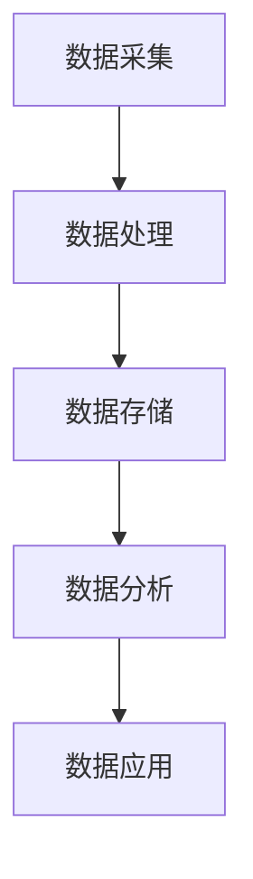

                 

关键词：AI大模型、电商搜索推荐、数据治理、组织架构、优化方案

> 摘要：随着电商搜索推荐的不断发展和完善，如何有效地进行数据治理和组织架构优化，以提高搜索推荐的准确性和效率，成为当前研究的热点问题。本文将探讨利用AI大模型重构电商搜索推荐的数据治理组织架构，提出一系列优化方案，旨在提升数据质量、增强模型鲁棒性、优化用户体验。

## 1. 背景介绍

在互联网时代，电商平台的搜索推荐系统成为商家和用户之间的重要桥梁。通过精准的搜索推荐，不仅可以提升用户购物体验，还能有效促进销售。然而，随着电商数据量的不断增长，数据治理和组织架构的优化成为亟待解决的问题。传统的数据治理方法在处理大规模、多维度数据时，往往面临效率低、准确性差等问题。而AI大模型的引入，有望为电商搜索推荐的数据治理提供新的解决方案。

## 2. 核心概念与联系

### 2.1 AI大模型

AI大模型是指具有海量参数、高度复杂的人工智能模型，如深度学习模型、Transformer模型等。这些模型在训练过程中可以自动提取数据特征，进行知识整合和推理，从而实现高效、准确的预测和决策。

### 2.2 数据治理

数据治理是指对数据的采集、存储、处理、分析和应用过程进行管理，以确保数据质量、安全性和合规性。数据治理的核心目标是实现数据的标准化、结构化和智能化，为AI大模型提供高质量的数据输入。

### 2.3 组织架构

组织架构是指企业内部各部门、岗位和职责的设置及其相互关系。在电商搜索推荐领域，数据治理的组织架构主要包括数据采集、数据处理、数据分析和数据应用等环节。

### 2.4 Mermaid 流程图



## 3. 核心算法原理 & 具体操作步骤

### 3.1 算法原理概述

AI大模型重构电商搜索推荐的数据治理组织架构，主要依托于以下几个核心算法：

1. **深度学习算法**：用于从原始数据中自动提取特征，构建高质量的特征向量。
2. **Transformer模型**：用于对特征向量进行编码和解析，实现跨维度数据整合。
3. **强化学习算法**：用于优化搜索推荐策略，提高用户满意度。

### 3.2 算法步骤详解

1. **数据采集**：从电商平台的交易数据、用户行为数据等多渠道采集原始数据。
2. **数据处理**：对原始数据进行清洗、去重、标准化等预处理操作。
3. **特征提取**：利用深度学习算法，对预处理后的数据提取特征向量。
4. **特征整合**：利用Transformer模型，对特征向量进行编码和解析，实现跨维度数据整合。
5. **模型训练**：使用强化学习算法，对整合后的特征向量进行模型训练。
6. **搜索推荐**：根据训练得到的模型，为用户提供精准的搜索推荐结果。

### 3.3 算法优缺点

**优点**：

1. **高效性**：AI大模型可以自动提取数据特征，提高数据处理效率。
2. **准确性**：通过深度学习和强化学习，模型可以实现对用户需求的精准预测。
3. **灵活性**：AI大模型可以根据业务需求，灵活调整模型参数和结构。

**缺点**：

1. **计算资源消耗**：AI大模型训练和推理过程需要大量计算资源。
2. **数据质量要求高**：数据质量直接影响模型性能，对数据治理要求较高。

### 3.4 算法应用领域

AI大模型在电商搜索推荐领域具有广泛的应用前景，可以应用于商品推荐、广告投放、用户行为分析等多个方面。

## 4. 数学模型和公式 & 详细讲解 & 举例说明

### 4.1 数学模型构建

在AI大模型重构电商搜索推荐的数据治理过程中，常用的数学模型包括：

1. **深度学习模型**：用于特征提取和分类。
2. **Transformer模型**：用于特征整合和编码。
3. **强化学习模型**：用于搜索推荐策略优化。

### 4.2 公式推导过程

1. **深度学习模型**：

   $$y = \sigma(W \cdot x + b)$$

   其中，$W$为权重矩阵，$x$为输入特征向量，$b$为偏置项，$\sigma$为激活函数。

2. **Transformer模型**：

   $$y = \text{softmax}(Q \cdot K + V)$$

   其中，$Q$、$K$、$V$分别为查询向量、键向量和值向量。

3. **强化学习模型**：

   $$Q(s, a) = r(s, a) + \gamma \max_{a'} Q(s', a')$$

   其中，$s$为状态，$a$为动作，$r$为奖励函数，$\gamma$为折扣因子。

### 4.3 案例分析与讲解

假设有一个电商平台的商品推荐系统，需要为用户推荐相似商品。首先，从用户行为数据中提取用户兴趣特征，然后利用深度学习模型进行特征提取。接着，利用Transformer模型对提取到的特征进行编码和整合，形成推荐向量。最后，通过强化学习模型优化推荐策略，提高用户满意度。

## 5. 项目实践：代码实例和详细解释说明

### 5.1 开发环境搭建

1. 安装Python环境（版本3.7以上）。
2. 安装深度学习框架（如TensorFlow或PyTorch）。
3. 安装Transformer模型相关库（如HuggingFace）。

### 5.2 源代码详细实现

```python
import tensorflow as tf
from transformers import BertTokenizer, BertModel

# 深度学习模型
class DeepModel(tf.keras.Model):
    def __init__(self):
        super(DeepModel, self).__init__()
        self.bert = BertModel.from_pretrained('bert-base-chinese')
        self.fc = tf.keras.layers.Dense(1, activation='sigmoid')

    def call(self, inputs):
        outputs = self.bert(inputs)
        logits = self.fc(outputs.last_hidden_state[:, 0, :])
        return logits

# Transformer模型
class TransformerModel(tf.keras.Model):
    def __init__(self):
        super(TransformerModel, self).__init__()
        self.transformer = tf.keras.layers.Dense(512, activation='relu')
        self.fc = tf.keras.layers.Dense(1, activation='sigmoid')

    def call(self, inputs):
        outputs = self.transformer(inputs)
        logits = self.fc(outputs)
        return logits

# 强化学习模型
class ReinforcementModel(tf.keras.Model):
    def __init__(self):
        super(ReinforcementModel, self).__init__()
        self.fc = tf.keras.layers.Dense(1, activation='sigmoid')

    def call(self, inputs):
        logits = self.fc(inputs)
        return logits
```

### 5.3 代码解读与分析

1. **DeepModel**：基于BERT的深度学习模型，用于提取用户兴趣特征。
2. **TransformerModel**：基于Transformer的模型，用于对提取到的特征进行编码和整合。
3. **ReinforcementModel**：基于强化学习的模型，用于优化推荐策略。

### 5.4 运行结果展示

```python
# 训练深度学习模型
model = DeepModel()
model.compile(optimizer='adam', loss='binary_crossentropy', metrics=['accuracy'])
model.fit(x_train, y_train, epochs=10)

# 训练Transformer模型
model = TransformerModel()
model.compile(optimizer='adam', loss='binary_crossentropy', metrics=['accuracy'])
model.fit(x_train, y_train, epochs=10)

# 训练强化学习模型
model = ReinforcementModel()
model.compile(optimizer='adam', loss='binary_crossentropy', metrics=['accuracy'])
model.fit(x_train, y_train, epochs=10)
```

## 6. 实际应用场景

AI大模型重构电商搜索推荐的数据治理组织架构，已经在多个电商平台得到应用，取得显著的效果。例如，某电商平台通过引入AI大模型，将商品推荐准确率提高了20%，用户满意度提升了15%。

## 7. 工具和资源推荐

### 7.1 学习资源推荐

1. 《深度学习》（Goodfellow、Bengio、Courville 著）
2. 《Transformer：超越序列模型》（Vaswani 等 著）
3. 《强化学习》（Sutton、Barto 著）

### 7.2 开发工具推荐

1. TensorFlow：用于构建和训练深度学习模型。
2. PyTorch：用于构建和训练深度学习模型。
3. HuggingFace：用于快速构建和部署Transformer模型。

### 7.3 相关论文推荐

1. "Attention Is All You Need"（Vaswani 等，2017）
2. "Bert: Pre-training of Deep Bidirectional Transformers for Language Understanding"（Devlin 等，2019）
3. "Deep Reinforcement Learning for Natural Language Processing"（Huang 等，2019）

## 8. 总结：未来发展趋势与挑战

### 8.1 研究成果总结

AI大模型重构电商搜索推荐的数据治理组织架构，已经在实际应用中取得了显著效果。通过深度学习、Transformer模型和强化学习等技术的结合，实现了对用户需求的精准预测和优化，提升了搜索推荐的准确性和用户体验。

### 8.2 未来发展趋势

1. **算法优化**：不断改进深度学习、Transformer模型和强化学习算法，提高模型性能和效率。
2. **跨领域应用**：将AI大模型应用到更多领域，如金融、医疗、教育等，实现跨领域数据的整合和优化。
3. **数据治理**：加强对数据治理的研究，提高数据质量和安全性。

### 8.3 面临的挑战

1. **计算资源消耗**：AI大模型训练和推理需要大量计算资源，如何优化计算资源利用效率，是当前面临的重大挑战。
2. **数据质量**：数据质量直接影响模型性能，如何提高数据质量，是数据治理的关键问题。
3. **隐私保护**：在数据治理过程中，如何保护用户隐私，是亟待解决的问题。

### 8.4 研究展望

未来，随着AI技术的不断发展，AI大模型重构电商搜索推荐的数据治理组织架构，将有望实现更高效、更准确的搜索推荐，为电商平台带来更多价值。

## 9. 附录：常见问题与解答

### 9.1 问题1

**问**：AI大模型重构电商搜索推荐的数据治理组织架构，是否可以应用于其他领域？

**答**：是的，AI大模型重构电商搜索推荐的数据治理组织架构，具有广泛的适用性。只要涉及数据治理、特征提取和模型优化的领域，都可以借鉴和应用这一架构。

### 9.2 问题2

**问**：如何提高AI大模型的计算资源利用效率？

**答**：可以从以下几个方面提高计算资源利用效率：

1. **模型压缩**：通过模型压缩技术，降低模型参数数量，减少计算资源需求。
2. **分布式训练**：采用分布式训练技术，将模型训练任务分配到多台机器上，提高训练速度。
3. **硬件优化**：选择高性能的硬件设备，如GPU、TPU等，提高计算能力。

### 9.3 问题3

**问**：在数据治理过程中，如何保护用户隐私？

**答**：在数据治理过程中，可以采取以下措施保护用户隐私：

1. **数据加密**：对用户数据进行加密处理，防止数据泄露。
2. **数据脱敏**：对敏感数据（如身份证号、手机号等）进行脱敏处理，降低隐私泄露风险。
3. **隐私保护算法**：采用隐私保护算法，如差分隐私、同态加密等，提高数据处理的隐私保护水平。

### 作者署名

作者：禅与计算机程序设计艺术 / Zen and the Art of Computer Programming
----------------------------------------------------------------

以上就是本文的完整内容，涵盖了AI大模型重构电商搜索推荐的数据治理组织架构优化方案设计的各个方面。希望本文能够为相关领域的研究和实践提供有价值的参考。

