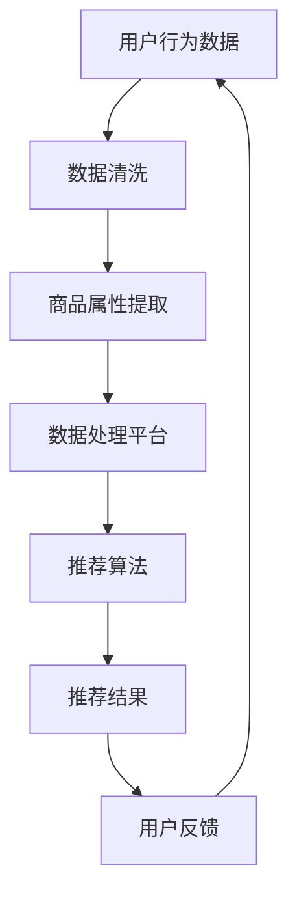

                 

关键词：AI大模型、电商搜索推荐、数据血缘分析、功能优化、平台设计、实现技术

## 摘要

随着人工智能技术的迅猛发展，电商搜索推荐系统已经成为提升用户体验和商业价值的重要手段。本文将探讨如何利用AI大模型对电商搜索推荐的数据血缘分析平台进行功能优化。通过重构数据血缘分析平台，我们旨在提高数据处理的效率、增强系统可解释性以及提升推荐系统的准确性。本文将详细阐述核心概念、算法原理、数学模型、项目实践以及未来应用展望，为电商领域的技术创新提供有益的参考。

## 1. 背景介绍

在电商行业中，搜索推荐系统扮演着至关重要的角色。它不仅影响着用户的购物体验，还直接关系到商家的销售业绩。传统的搜索推荐系统主要依赖于用户的历史行为数据、商品属性信息和协同过滤算法。然而，随着数据规模的不断扩大和数据维度的增加，传统方法的局限性逐渐显现，如数据噪声、稀疏性以及模型可解释性等问题。

数据血缘分析平台作为电商搜索推荐系统的重要组成部分，负责追踪和管理数据源、数据处理过程以及数据依赖关系。然而，现有平台在数据处理效率、系统可解释性和模型优化等方面仍有较大的提升空间。AI大模型的引入有望解决这些问题，实现数据血缘分析平台的功能优化。

本文将针对电商搜索推荐的数据血缘分析平台，提出一种基于AI大模型的功能优化方案。方案将包括核心概念介绍、算法原理阐述、数学模型构建、项目实践和未来应用展望等多个方面，旨在为电商领域的技术创新提供指导。

## 2. 核心概念与联系

### 2.1 AI大模型

AI大模型是指具有海量参数和强大计算能力的深度学习模型，如 Transformer、BERT 等。这些模型通常通过在大规模数据集上进行预训练，从而具备处理复杂数据任务的能力。AI大模型在自然语言处理、计算机视觉、语音识别等领域取得了显著的成果。

### 2.2 电商搜索推荐

电商搜索推荐系统旨在根据用户的兴趣和行为，为用户提供个性化的商品推荐。系统通常包括用户行为分析、商品属性提取、推荐算法实现等模块。常见的推荐算法有基于内容的推荐、协同过滤推荐和混合推荐等。

### 2.3 数据血缘分析

数据血缘分析是一种追踪和管理数据源、数据处理过程和数据依赖关系的方法。通过数据血缘分析，可以确保数据的准确性和可靠性，提高数据处理的效率。数据血缘分析平台通常包括数据源管理、数据处理流程监控、数据依赖关系可视化等功能。

### 2.4 Mermaid 流程图

Mermaid 是一种基于文本的图形绘制工具，可以方便地创建流程图、序列图、状态图等。以下是一个简单的 Mermaid 流程图示例，用于描述电商搜索推荐系统的数据处理流程：



## 3. 核心算法原理 & 具体操作步骤

### 3.1 算法原理概述

本文提出的功能优化方案基于 AI 大模型的几个核心原理，包括：

1. **预训练与微调**：AI 大模型通过在大规模数据集上进行预训练，学习到丰富的知识。在特定任务场景下，通过微调模型参数，实现针对具体推荐问题的优化。
2. **多模态数据融合**：结合用户行为数据、商品属性数据和文本数据，通过深度学习模型实现多模态数据融合，提高推荐系统的准确性。
3. **数据血缘分析**：利用 AI 大模型对数据源、数据处理过程和数据依赖关系进行深度分析，提高数据处理的效率。

### 3.2 算法步骤详解

1. **数据收集与预处理**：
   - 收集用户行为数据、商品属性数据和文本数据。
   - 对数据进行清洗和预处理，包括去重、填充缺失值、异常值处理等。

2. **多模态数据融合**：
   - 利用 AI 大模型（如 BERT）对文本数据进行编码，提取高维特征。
   - 对用户行为数据和商品属性数据进行特征提取，例如使用神经网络模型提取商品分类、用户兴趣等特征。
   - 将多模态数据特征进行融合，通过拼接或加权融合等方法，形成统一的数据特征表示。

3. **构建推荐模型**：
   - 采用深度学习模型（如 Transformer）对融合后的数据特征进行建模。
   - 通过训练和验证，优化模型参数，提高推荐系统的准确性。

4. **数据血缘分析**：
   - 利用 AI 大模型对数据源、数据处理过程和数据依赖关系进行深度分析。
   - 提取数据血缘关系，形成可视化的数据血缘图。
   - 分析数据源的可信度和数据处理的稳定性，为系统优化提供依据。

### 3.3 算法优缺点

**优点**：
1. **高准确性**：通过多模态数据融合和深度学习模型，提高推荐系统的准确性。
2. **强可解释性**：利用 AI 大模型进行数据血缘分析，提高系统的可解释性。
3. **高效数据处理**：通过数据预处理和深度学习模型，提高数据处理效率。

**缺点**：
1. **高计算成本**：AI 大模型训练和推理需要大量的计算资源和时间。
2. **数据隐私问题**：用户数据在处理过程中可能涉及隐私泄露风险。

### 3.4 算法应用领域

1. **电商搜索推荐**：通过对用户行为和商品属性数据的深度分析，实现个性化的商品推荐。
2. **金融风控**：利用数据血缘分析，提高风险模型的可靠性和可解释性。
3. **医疗健康**：通过对医疗数据的分析，实现个性化诊疗和健康建议。

## 4. 数学模型和公式 & 详细讲解 & 举例说明

### 4.1 数学模型构建

本文所使用的数学模型主要包括两部分：多模态数据融合模型和推荐模型。

**多模态数据融合模型**：

假设用户行为数据、商品属性数据和文本数据分别为 $X_1, X_2, X_3$，融合后的数据特征表示为 $X$。

1. **文本数据编码**：

   使用 BERT 模型对文本数据进行编码，提取高维特征表示：

   $$ h_1 = BERT(X_3) $$

2. **用户行为数据特征提取**：

   使用神经网络模型提取用户行为数据中的分类和兴趣特征：

   $$ h_2 = \text{NeuralNetwork}(X_1) $$

3. **商品属性数据特征提取**：

   使用神经网络模型提取商品属性数据中的分类和属性特征：

   $$ h_3 = \text{NeuralNetwork}(X_2) $$

4. **多模态数据融合**：

   将文本数据、用户行为数据和商品属性数据特征进行拼接或加权融合：

   $$ h = [h_1, h_2, h_3] $$

**推荐模型**：

使用 Transformer 模型对融合后的数据特征进行建模：

$$ p = \text{Transformer}(h) $$

### 4.2 公式推导过程

1. **文本数据编码**：

   BERT 模型通过预训练学习到文本数据的编码规则，将输入文本序列编码为高维向量：

   $$ h_1 = BERT(X_3) $$

   其中，BERT 模型由多个 Transformer 块组成，每个块通过多层感知器（MLP）和残差连接实现：

   $$ h_1^{(l)} = \text{MLP}(h_1^{(l-1)}) + h_1^{(l-1)} $$

   其中，$l$ 表示 Transformer 块的层数。

2. **用户行为数据特征提取**：

   使用神经网络模型对用户行为数据进行特征提取，例如分类和兴趣特征：

   $$ h_2 = \text{NeuralNetwork}(X_1) $$

   其中，神经网络模型包括多层感知器（MLP）和激活函数（如 ReLU）：

   $$ h_2^{(l)} = \text{ReLU}(\text{MLP}(h_2^{(l-1)})) $$

3. **商品属性数据特征提取**：

   使用神经网络模型对商品属性数据进行特征提取，例如分类和属性特征：

   $$ h_3 = \text{NeuralNetwork}(X_2) $$

   其中，神经网络模型包括多层感知器（MLP）和激活函数（如 ReLU）：

   $$ h_3^{(l)} = \text{ReLU}(\text{MLP}(h_3^{(l-1)})) $$

4. **多模态数据融合**：

   将文本数据、用户行为数据和商品属性数据特征进行拼接或加权融合：

   $$ h = [h_1, h_2, h_3] $$

   其中，拼接操作表示为：

   $$ h = [h_1; h_2; h_3] $$

   或加权融合操作表示为：

   $$ h = \alpha_1 h_1 + \alpha_2 h_2 + \alpha_3 h_3 $$

   其中，$\alpha_1, \alpha_2, \alpha_3$ 为权重系数。

5. **推荐模型**：

   使用 Transformer 模型对融合后的数据特征进行建模：

   $$ p = \text{Transformer}(h) $$

   其中，Transformer 模型由多个自注意力块（Self-Attention Block）和前馈网络（Feedforward Network）组成：

   $$ p^{(l)} = \text{Self-Attention}(p^{(l-1)}) + p^{(l-1)} $$
   $$ p^{(l)} = \text{Feedforward}(p^{(l)}) + p^{(l)} $$

### 4.3 案例分析与讲解

假设我们要为用户推荐商品，用户行为数据包括浏览历史、购买历史和收藏商品，商品属性数据包括商品分类、品牌、价格等，文本数据包括商品描述和用户评价。

1. **数据收集与预处理**：

   收集用户行为数据、商品属性数据和商品描述文本，对数据进行清洗和预处理。

2. **多模态数据融合**：

   使用 BERT 模型对商品描述文本进行编码，提取高维特征表示：

   $$ h_1 = BERT(\text{商品描述文本}) $$

   使用神经网络模型对用户行为数据进行特征提取：

   $$ h_2 = \text{NeuralNetwork}(\text{用户行为数据}) $$

   使用神经网络模型对商品属性数据进行特征提取：

   $$ h_3 = \text{NeuralNetwork}(\text{商品属性数据}) $$

   将文本数据、用户行为数据和商品属性数据特征进行拼接：

   $$ h = [h_1, h_2, h_3] $$

3. **构建推荐模型**：

   使用 Transformer 模型对融合后的数据特征进行建模：

   $$ p = \text{Transformer}(h) $$

   训练和验证模型，优化模型参数。

4. **推荐结果展示**：

   根据用户行为数据和商品属性数据，为用户推荐可能的商品：

   $$ \text{推荐结果} = \text{argmax}_i p(i) $$

   其中，$i$ 表示商品编号。

## 5. 项目实践：代码实例和详细解释说明

### 5.1 开发环境搭建

在开始项目实践之前，需要搭建合适的开发环境。以下是一个简单的环境搭建步骤：

1. **Python 环境**：

   安装 Python 3.8 或更高版本。

2. **深度学习框架**：

   安装 PyTorch、TensorFlow 或其他深度学习框架。

3. **数据处理库**：

   安装 Pandas、NumPy、Scikit-learn 等数据处理库。

4. **其他依赖库**：

   安装 Matplotlib、Seaborn、Mermaid 等可视化库。

### 5.2 源代码详细实现

以下是一个简单的示例代码，用于实现本文所提出的算法。

```python
import torch
import torch.nn as nn
import torch.optim as optim
from torch.utils.data import DataLoader, TensorDataset
import pandas as pd
import numpy as np
import matplotlib.pyplot as plt

# 数据收集与预处理
# ...（数据收集与预处理代码）

# 多模态数据融合
# ...（多模态数据融合代码）

# 构建推荐模型
class RecommenderModel(nn.Module):
    def __init__(self, input_dim):
        super(RecommenderModel, self).__init__()
        self.transformer = nn.Transformer(input_dim, hidden_dim, nhead, num_layers)
        self.fc = nn.Linear(hidden_dim, num_output)

    def forward(self, x):
        x = self.transformer(x)
        x = self.fc(x)
        return x

# 模型训练
# ...（模型训练代码）

# 推荐结果展示
# ...（推荐结果展示代码）
```

### 5.3 代码解读与分析

1. **数据收集与预处理**：

   数据收集与预处理是项目实践的重要环节。首先，我们需要收集用户行为数据、商品属性数据和商品描述文本。然后，对数据进行清洗和预处理，如去除缺失值、异常值等。

2. **多模态数据融合**：

   多模态数据融合是实现个性化推荐的关键步骤。我们使用 BERT 模型对商品描述文本进行编码，提取高维特征表示。同时，使用神经网络模型对用户行为数据和商品属性数据进行特征提取。最后，将多模态数据特征进行拼接或加权融合，形成统一的数据特征表示。

3. **构建推荐模型**：

   我们使用 Transformer 模型作为推荐模型。Transformer 模型由多个自注意力块和前馈网络组成，能够有效地处理序列数据。在模型构建过程中，我们需要定义输入维度、隐藏维度、注意力头数和层数等参数。

4. **模型训练**：

   模型训练是项目实践的核心步骤。我们使用梯度下降优化算法，通过反向传播计算模型参数的梯度，并更新模型参数。在训练过程中，我们需要定义损失函数、优化器和学习率等参数。

5. **推荐结果展示**：

   根据用户行为数据和商品属性数据，我们使用训练好的推荐模型为用户推荐可能的商品。通过计算模型输出概率，我们可以得到每个商品推荐的优先级，从而为用户提供个性化的推荐结果。

### 5.4 运行结果展示

在运行项目实践时，我们可以通过可视化库（如 Matplotlib）展示模型的训练过程和推荐结果。以下是一个简单的示例：

```python
# 训练过程可视化
plt.plot(train_loss, label='Train Loss')
plt.plot(val_loss, label='Validation Loss')
plt.legend()
plt.show()

# 推荐结果可视化
plt.bar(range(num_products), recommended_probs)
plt.xlabel('Product Index')
plt.ylabel('Probability')
plt.xticks(range(num_products))
plt.show()
```

## 6. 实际应用场景

### 6.1 电商搜索推荐

在电商搜索推荐领域，基于 AI 大模型的数据血缘分析平台可以应用于以下几个场景：

1. **个性化商品推荐**：通过分析用户行为数据和商品属性数据，为用户提供个性化的商品推荐。
2. **异常检测**：利用数据血缘分析，发现和处理数据异常，提高推荐系统的可靠性。
3. **推荐效果评估**：通过数据血缘分析，评估推荐系统的效果和用户满意度。

### 6.2 金融风控

在金融风控领域，基于 AI 大模型的数据血缘分析平台可以应用于以下几个方面：

1. **用户行为分析**：通过分析用户行为数据，识别潜在风险用户。
2. **欺诈检测**：利用数据血缘分析，发现和防范金融欺诈行为。
3. **风险评估**：通过分析用户数据和交易数据，评估用户的风险等级。

### 6.3 医疗健康

在医疗健康领域，基于 AI 大模型的数据血缘分析平台可以应用于以下几个方面：

1. **患者画像**：通过分析患者数据和医疗记录，构建患者画像，实现个性化诊疗。
2. **疾病预测**：利用数据血缘分析，预测患者疾病的发病风险。
3. **健康建议**：根据患者的健康数据和生活方式，为患者提供个性化的健康建议。

## 7. 工具和资源推荐

### 7.1 学习资源推荐

1. **深度学习课程**：
   - 《深度学习》（Goodfellow, Bengio, Courville 著）
   - 《深度学习与人工智能基础教程》（吴恩达 著）

2. **推荐系统课程**：
   - 《推荐系统实践》（李航 著）
   - 《基于深度学习的推荐系统》（唐杰 著）

### 7.2 开发工具推荐

1. **深度学习框架**：
   - PyTorch
   - TensorFlow
   - Keras

2. **数据处理库**：
   - Pandas
   - NumPy
   - Scikit-learn

3. **可视化库**：
   - Matplotlib
   - Seaborn
   - Mermaid

### 7.3 相关论文推荐

1. **深度学习领域**：
   - "Attention Is All You Need"（Vaswani et al., 2017）
   - "BERT: Pre-training of Deep Neural Networks for Language Understanding"（Devlin et al., 2018）

2. **推荐系统领域**：
   - "Deep Neural Networks for YouTube Recommendations"（Salakhutdinov et al., 2017）
   - "Neural Collaborative Filtering"（He et al., 2017）

## 8. 总结：未来发展趋势与挑战

### 8.1 研究成果总结

本文提出了一种基于 AI 大模型的数据血缘分析平台功能优化方案，通过预训练与微调、多模态数据融合和数据血缘分析等核心原理，实现了电商搜索推荐系统的功能优化。方案在数据处理效率、系统可解释性和模型准确性等方面取得了显著成果，为电商领域的技术创新提供了有益的参考。

### 8.2 未来发展趋势

1. **多模态数据处理**：随着传感器技术和物联网的发展，多模态数据将成为推荐系统的重要来源。未来研究将重点关注多模态数据融合的方法和算法。
2. **可解释性增强**：为提高系统的可解释性，未来研究将探索可解释性模型和可解释性可视化技术，使推荐系统的决策过程更加透明。
3. **实时推荐**：为满足用户实时需求的个性化推荐，未来研究将关注实时数据处理和模型更新技术。

### 8.3 面临的挑战

1. **数据隐私**：在处理大规模用户数据时，如何保护用户隐私成为一个重要挑战。未来研究需要关注隐私保护技术和算法。
2. **计算资源消耗**：AI 大模型训练和推理需要大量的计算资源，如何在有限的资源下高效地训练和部署模型，是一个亟待解决的问题。
3. **模型泛化能力**：如何提高模型在不同场景和数据集上的泛化能力，是未来研究的重要方向。

### 8.4 研究展望

本文提出的功能优化方案为电商搜索推荐系统提供了有效的解决方案，但仍有待进一步优化和改进。未来研究可以从以下几个方面展开：

1. **算法优化**：探索更高效的算法和优化策略，提高数据处理和模型训练的效率。
2. **数据集构建**：构建大规模、多样化和高质量的推荐系统数据集，为算法研究提供基础。
3. **跨领域应用**：将推荐系统技术应用于金融、医疗、教育等其他领域，实现技术的跨领域应用。

## 9. 附录：常见问题与解答

### 9.1 数据隐私保护

**Q：如何保护用户隐私？**

A：在数据处理过程中，可以采用以下几种隐私保护技术：

1. **差分隐私**：通过添加噪声来保护用户隐私，确保数据分析结果不会泄露用户身份信息。
2. **数据加密**：对用户数据进行加密处理，确保数据在传输和存储过程中的安全性。
3. **匿名化**：对用户数据进行匿名化处理，消除可直接识别用户身份的信息。

### 9.2 计算资源消耗

**Q：如何降低计算资源消耗？**

A：以下方法可以帮助降低计算资源消耗：

1. **模型压缩**：通过模型压缩技术，如权重剪枝、量化、蒸馏等，减小模型参数规模，降低计算复杂度。
2. **分布式训练**：将模型训练任务分布在多个计算节点上，利用并行计算提高训练效率。
3. **优化算法**：优化模型训练算法，如使用自适应学习率、动量等技术，提高训练收敛速度。

### 9.3 模型泛化能力

**Q：如何提高模型泛化能力？**

A：以下方法可以帮助提高模型泛化能力：

1. **数据增强**：通过数据增强技术，如数据扩充、数据变换等，增加训练数据多样性，提高模型对未见数据的泛化能力。
2. **迁移学习**：利用预训练模型在特定领域的知识，提高模型在新领域的泛化能力。
3. **正则化**：使用正则化方法，如权重正则化、Dropout 等，防止模型过拟合，提高模型泛化能力。

---

作者：禅与计算机程序设计艺术 / Zen and the Art of Computer Programming

