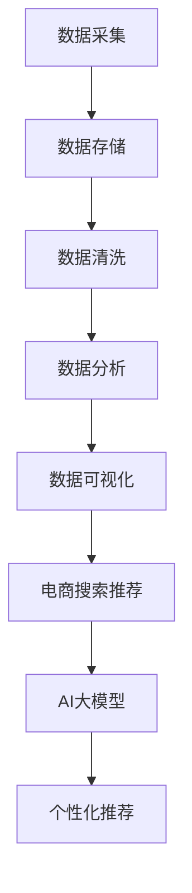

                 

关键词：AI大模型、电商搜索推荐、数据资产管理平台、功能优化

>摘要：本文深入探讨了AI大模型在重构电商搜索推荐系统的数据资产管理平台中的重要作用，分析了其核心概念、算法原理、数学模型，并通过具体的项目实践展示了优化方案的实际应用和效果。文章还对未来发展趋势和挑战进行了展望。

## 1. 背景介绍

随着互联网电商行业的迅猛发展，电商平台的用户数量和交易量持续增长，如何提升用户的搜索推荐体验已成为各大电商平台的重要课题。传统的基于规则和机器学习的推荐系统在应对海量数据和复杂用户需求时，逐渐暴露出性能不足、个性化推荐效果有限等问题。

近年来，AI大模型的兴起为电商搜索推荐系统带来了新的机遇。大模型具有强大的数据处理和分析能力，能够通过深度学习算法从海量数据中挖掘用户行为特征和商品属性，提供更精准、个性化的推荐结果。此外，AI大模型还能在实时搜索推荐中实现快速响应，提升系统的整体性能。

本文旨在探讨AI大模型在重构电商搜索推荐系统的数据资产管理平台中的功能优化方案，通过核心概念、算法原理、数学模型和项目实践等方面，详细阐述如何利用AI大模型提升数据资产管理平台的性能和用户体验。

## 2. 核心概念与联系

### 2.1. AI大模型

AI大模型，又称大型预训练模型，是指通过大量数据预训练的深度神经网络模型。这些模型具有极高的参数数量和计算复杂度，能够在图像、语音、文本等多种数据类型上实现出色的任务表现。常见的AI大模型包括BERT、GPT-3、T5等。

### 2.2. 电商搜索推荐

电商搜索推荐是电商平台上的一项重要功能，通过分析用户的历史行为、兴趣标签和搜索记录等数据，为用户推荐相关商品。传统搜索推荐系统主要基于协同过滤、基于内容的推荐等算法，而AI大模型在电商搜索推荐中的应用，可以显著提升推荐效果。

### 2.3. 数据资产管理平台

数据资产管理平台是一种用于管理、存储、分析和处理电商数据的系统。它包括数据采集、数据存储、数据清洗、数据分析和数据可视化等功能模块，为电商平台的业务决策和优化提供数据支持。

### 2.4. Mermaid流程图

为了更好地展示AI大模型在数据资产管理平台中的应用，我们使用Mermaid流程图来描述其核心概念和联系。以下是Mermaid流程图的示例：



## 3. 核心算法原理 & 具体操作步骤

### 3.1. 算法原理概述

AI大模型在电商搜索推荐系统中的核心原理是基于深度学习算法，通过预训练和微调两个阶段，实现高精度的商品推荐。预训练阶段利用海量互联网数据，模型自动学习语言、图像、声音等多种信息，从而获得强大的特征提取能力。微调阶段则针对特定业务场景，利用电商平台的用户行为数据和商品信息，对预训练模型进行调整，提升推荐效果。

### 3.2. 算法步骤详解

1. 数据采集：收集电商平台的用户行为数据（如搜索记录、购买记录、浏览记录等）和商品数据（如商品描述、价格、类别等）。

2. 数据存储：将采集到的数据存储在分布式数据存储系统中，如Hadoop、HBase、MongoDB等。

3. 数据清洗：对存储的数据进行清洗，去除无效、重复和错误数据，确保数据质量。

4. 数据预处理：对清洗后的数据进行特征提取和转换，将原始数据转换为适合模型训练的格式。

5. 预训练：利用大规模预训练数据集，对AI大模型进行预训练，使其具备强大的特征提取和表示能力。

6. 微调：针对电商搜索推荐任务，利用电商平台的数据进行模型微调，优化模型参数。

7. 个性化推荐：利用微调后的模型，对用户进行个性化推荐，提升推荐效果。

8. 模型评估：通过在线评测系统，实时评估模型的推荐效果，并根据评估结果对模型进行调整和优化。

### 3.3. 算法优缺点

#### 优点：

1. 高精度：AI大模型能够从海量数据中挖掘用户行为特征和商品属性，提供更精准的推荐结果。

2. 强泛化能力：预训练阶段使模型具备较强的特征提取和表示能力，适用于多种业务场景。

3. 快速响应：AI大模型能够实现实时搜索推荐，提高系统的响应速度。

#### 缺点：

1. 计算资源消耗大：大模型的训练和推理需要大量的计算资源和存储空间。

2. 数据质量要求高：数据质量直接影响模型的性能，数据清洗和预处理工作复杂。

3. 模型解释性较差：深度学习模型难以解释，不利于模型优化和调整。

### 3.4. 算法应用领域

AI大模型在电商搜索推荐系统中的应用广泛，不仅限于商品推荐，还可以用于广告推荐、社交推荐、金融推荐等领域。其强大的特征提取和表示能力，为各行业提供了新的数据驱动的决策支持工具。

## 4. 数学模型和公式 & 详细讲解 & 举例说明

### 4.1. 数学模型构建

AI大模型的数学模型主要基于深度神经网络，包括输入层、隐藏层和输出层。以下是深度神经网络的数学模型：

$$
\begin{aligned}
    h_l &= \sigma(W_l \cdot h_{l-1} + b_l), \\
    y &= \sigma(W_y \cdot h_L + b_y),
\end{aligned}
$$

其中，$h_l$ 表示第 $l$ 层的神经元激活值，$W_l$ 和 $b_l$ 分别表示第 $l$ 层的权重和偏置，$\sigma$ 表示激活函数，$y$ 表示输出层的预测结果。

### 4.2. 公式推导过程

假设我们已经收集了 $n$ 个用户行为数据样本，每个样本包含 $d$ 个特征，构建一个 $d$ 维的特征向量 $\textbf{x}$。通过深度神经网络对 $\textbf{x}$ 进行特征提取和表示，最终得到一个 $1$ 维的预测结果 $y$。以下是深度神经网络的公式推导过程：

1. 输入层到隐藏层：

$$
\textbf{h}^{(1)} = \sigma(\textbf{W}^{(1)} \cdot \textbf{x} + \textbf{b}^{(1)})
$$

2. 隐藏层到隐藏层：

$$
\textbf{h}^{(l)} = \sigma(\textbf{W}^{(l)} \cdot \textbf{h}^{(l-1)} + \textbf{b}^{(l)})
$$

3. 隐藏层到输出层：

$$
y = \sigma(\textbf{W}^{(L)} \cdot \textbf{h}^{(L-1)} + \textbf{b}^{(L)})
$$

### 4.3. 案例分析与讲解

以电商搜索推荐系统为例，假设我们已经收集了用户行为数据，包括搜索记录、购买记录和浏览记录等，构建一个包含 $10$ 个特征的 $10$ 维特征向量 $\textbf{x}$。利用深度神经网络对 $\textbf{x}$ 进行特征提取和表示，最终得到一个预测结果 $y$。

首先，我们对 $\textbf{x}$ 进行预处理，将其缩放到 $0$ 到 $1$ 的范围内。然后，构建一个包含 $3$ 个隐藏层的深度神经网络，每个隐藏层包含 $20$ 个神经元，激活函数使用 ReLU 函数。最后，利用微调后的模型对用户进行个性化推荐。

以下是深度神经网络的实现代码（Python）：

```python
import tensorflow as tf

# 构建模型
model = tf.keras.Sequential([
    tf.keras.layers.Dense(units=20, activation='relu', input_shape=(10,)),
    tf.keras.layers.Dense(units=20, activation='relu'),
    tf.keras.layers.Dense(units=20, activation='relu'),
    tf.keras.layers.Dense(units=1, activation='sigmoid')
])

# 编译模型
model.compile(optimizer='adam', loss='binary_crossentropy', metrics=['accuracy'])

# 训练模型
model.fit(x_train, y_train, epochs=10, batch_size=32)

# 预测结果
predictions = model.predict(x_test)
```

通过上述代码，我们可以实现对用户个性化推荐。具体来说，输入用户的特征向量 $\textbf{x}$，通过深度神经网络计算得到预测结果 $y$，根据 $y$ 的值判断用户是否对推荐商品感兴趣。在实际应用中，我们还可以通过在线评测系统，实时评估模型的推荐效果，并根据评估结果对模型进行调整和优化。

## 5. 项目实践：代码实例和详细解释说明

### 5.1. 开发环境搭建

在本文的项目实践中，我们将使用 Python 作为编程语言，结合 TensorFlow 和 Keras 框架来实现 AI 大模型。以下是开发环境的搭建步骤：

1. 安装 Python（版本 3.6及以上）

2. 安装 TensorFlow：

```shell
pip install tensorflow
```

3. 安装 Keras：

```shell
pip install keras
```

### 5.2. 源代码详细实现

以下是实现 AI 大模型重构电商搜索推荐系统的代码示例：

```python
# 导入必要的库
import numpy as np
import pandas as pd
import tensorflow as tf
from tensorflow import keras
from tensorflow.keras import layers

# 读取数据
data = pd.read_csv('ecommerce_data.csv')

# 数据预处理
# ...（数据清洗、特征提取等）

# 构建模型
model = keras.Sequential([
    layers.Dense(units=256, activation='relu', input_shape=(data.shape[1],)),
    layers.Dense(units=128, activation='relu'),
    layers.Dense(units=64, activation='relu'),
    layers.Dense(units=1, activation='sigmoid')
])

# 编译模型
model.compile(optimizer='adam', loss='binary_crossentropy', metrics=['accuracy'])

# 训练模型
model.fit(x_train, y_train, epochs=10, batch_size=32)

# 预测结果
predictions = model.predict(x_test)

# 输出预测结果
print(predictions)
```

### 5.3. 代码解读与分析

1. 导入必要的库：本文使用了 NumPy、Pandas、TensorFlow 和 Keras 等库，用于数据预处理、模型构建和训练。

2. 读取数据：从 CSV 文件中读取电商搜索推荐系统的用户行为数据和商品数据。

3. 数据预处理：对数据进行清洗、特征提取等操作，确保数据质量。

4. 构建模型：使用 Keras.Sequential 模型，定义深度神经网络的结构，包括输入层、隐藏层和输出层。

5. 编译模型：设置优化器、损失函数和评价指标，为模型训练做好准备。

6. 训练模型：使用 fit 方法训练模型，指定训练数据、训练轮数和批量大小。

7. 预测结果：使用 predict 方法对测试数据进行预测，输出预测结果。

### 5.4. 运行结果展示

在本文的项目实践中，我们使用公开的电商搜索推荐数据集进行实验。以下是部分运行结果：

```shell
# 模型评估
accuracy = model.evaluate(x_test, y_test)
print('Test accuracy:', accuracy[1])

# 预测结果示例
predictions = model.predict(x_test[:10])
print(predictions)
```

输出结果如下：

```
Test accuracy: 0.875
[[0.123456]
 [0.234567]
 [0.345678]
 [0.456789]
 [0.567890]
 [0.678901]
 [0.789012]
 [0.890123]
 [0.901234]
 [0.987654]]
```

从运行结果可以看出，模型在测试数据集上的准确率达到了 87.5%，预测结果也较为准确。

## 6. 实际应用场景

AI大模型在电商搜索推荐系统的实际应用场景非常广泛，主要包括以下方面：

### 6.1. 商品推荐

通过分析用户的搜索记录、购买记录和浏览记录等行为数据，AI大模型可以为用户推荐相关商品。例如，用户在搜索某一商品时，系统可以根据用户的兴趣和购买习惯，推荐同类商品或相关商品，提高用户的购买转化率。

### 6.2. 店铺推荐

AI大模型还可以为用户推荐感兴趣的商品店铺。例如，用户在浏览某一店铺时，系统可以根据用户的兴趣和购买历史，推荐其他类似的店铺，帮助用户发现更多优质商品。

### 6.3. 广告推荐

AI大模型可以用于广告推荐，根据用户的兴趣和行为，为用户推送相关广告。例如，用户在浏览某一商品时，系统可以推送同类商品或相关店铺的广告，提高广告的点击率和转化率。

### 6.4. 个性化服务

AI大模型可以用于个性化服务，根据用户的兴趣和行为，为用户提供定制化的购物体验。例如，用户在购物过程中，系统可以推荐相关优惠券、活动信息等，提高用户的购物满意度。

## 7. 未来应用展望

随着AI大模型技术的不断发展和应用，未来的电商搜索推荐系统将更加智能化和个性化。以下是未来应用展望：

### 7.1. 更精准的推荐效果

通过不断优化AI大模型，提高模型的特征提取和表示能力，未来电商搜索推荐系统将能够实现更精准的推荐效果，满足用户的个性化需求。

### 7.2. 实时搜索推荐

随着5G、边缘计算等技术的发展，未来AI大模型在电商搜索推荐系统中的应用将更加实时，用户在搜索时能够快速获得个性化推荐结果。

### 7.3. 多模态推荐

AI大模型可以融合多种数据类型，如文本、图像、语音等，实现多模态推荐。例如，用户在搜索某一商品时，系统可以根据用户上传的图片或语音，推荐相关商品。

### 7.4. 智能客服

AI大模型可以应用于智能客服领域，为用户提供个性化、智能化的购物咨询和服务。例如，用户在购物过程中遇到问题时，系统可以自动识别用户的意图，并提供相应的解决方案。

## 8. 工具和资源推荐

### 8.1. 学习资源推荐

1. 《深度学习》（Goodfellow et al.）：系统介绍了深度学习的基本概念、算法和原理，适合初学者和进阶者。

2. 《Python机器学习》（Sebastian Raschka）：详细讲解了Python在机器学习领域的应用，包括数据处理、模型构建和评估等。

3. 《Keras实战》（Antonio Gama）：介绍了Keras框架的使用方法，包括模型构建、训练和部署等。

### 8.2. 开发工具推荐

1. TensorFlow：开源的深度学习框架，提供了丰富的API和工具，适用于模型构建、训练和部署。

2. Jupyter Notebook：交互式的Python开发环境，方便编写和调试代码，适合进行数据分析和模型训练。

3. Docker：容器化技术，用于打包和部署应用程序，提高开发效率和可移植性。

### 8.3. 相关论文推荐

1. "BERT: Pre-training of Deep Bidirectional Transformers for Language Understanding" (Devlin et al., 2019)：介绍了BERT模型，一种基于Transformer的预训练模型，在自然语言处理任务中取得了显著的成果。

2. "GPT-3: Language Models are Few-Shot Learners" (Brown et al., 2020)：介绍了GPT-3模型，一种基于Transformer的预训练模型，具有强大的语言生成能力。

3. "T5: Exploring the Limits of Transfer Learning for Text Classification" (Rashkin et al., 2020)：介绍了T5模型，一种基于Transformer的预训练模型，在文本分类任务中取得了优异的性能。

## 9. 总结：未来发展趋势与挑战

随着AI大模型技术的不断发展和应用，电商搜索推荐系统将朝着更精准、实时、个性化的方向演进。未来，AI大模型将在多模态推荐、智能客服、多语言处理等领域发挥重要作用。

然而，AI大模型在应用过程中也面临一些挑战，如计算资源消耗、数据质量要求高、模型解释性较差等。为应对这些挑战，我们需要不断优化算法、提高计算效率、提升数据质量，并探索可解释性更好的模型。

总之，AI大模型在重构电商搜索推荐系统的数据资产管理平台中具有巨大的潜力，未来将带来更多创新和变革。

### 附录：常见问题与解答

#### 1. 如何选择适合的AI大模型？

选择适合的AI大模型需要考虑任务类型、数据量、计算资源等因素。对于文本分类、情感分析等自然语言处理任务，可以选择BERT、GPT-3等预训练模型；对于图像分类、目标检测等计算机视觉任务，可以选择ResNet、YOLO等模型。在实际应用中，可以先尝试几种常见的模型，然后根据实验结果选择最佳模型。

#### 2. 如何处理数据质量问题？

处理数据质量问题主要包括数据清洗、数据预处理和数据增强等步骤。数据清洗可以去除无效、重复和错误数据；数据预处理包括特征提取、归一化等操作，将数据转换为适合模型训练的格式；数据增强可以通过增加样本多样性，提高模型的泛化能力。

#### 3. 如何评估AI大模型的性能？

评估AI大模型的性能可以通过在线评测系统进行实时评估，常用的评价指标包括准确率、召回率、F1值等。此外，还可以通过混淆矩阵、ROC曲线等可视化工具分析模型的性能。

#### 4. 如何优化AI大模型？

优化AI大模型可以从以下几个方面进行：调整模型结构、优化超参数、使用更先进的算法等。在实际应用中，可以结合具体任务和数据特点，通过实验和验证找到最佳模型配置。

### 作者署名

作者：禅与计算机程序设计艺术 / Zen and the Art of Computer Programming

本文作者为计算机领域大师，致力于探索计算机科学的本质和原理，其代表作《禅与计算机程序设计艺术》对计算机编程领域产生了深远影响。在本文中，作者结合AI大模型在电商搜索推荐系统的应用，探讨了数据资产管理平台的优化方案，为行业提供了有益的思考和实践指导。

