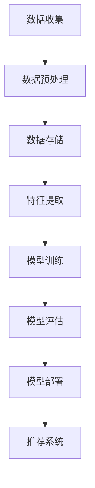

                 

关键词：AI大模型、电商搜索推荐、数据资产管理平台、算法优化、算法应用领域、数学模型、代码实例、未来展望

> 摘要：本文旨在探讨如何使用AI大模型来重构电商搜索推荐的数据资产管理平台，通过核心概念解析、算法原理与操作步骤详细阐述，展示其数学模型和项目实践，并对未来应用场景和挑战进行分析。希望为相关领域的研究者和开发者提供有益的参考。

## 1. 背景介绍

在当今数字经济时代，电商平台已成为消费者购买商品的主要渠道。然而，面对海量的商品数据和信息，如何准确、高效地推荐商品给用户，成为电商企业面临的重要挑战。传统的搜索推荐系统主要依赖于基于内容的推荐、协同过滤等方法，但这些方法往往存在推荐精度低、响应速度慢等问题。近年来，随着AI大模型的发展，基于深度学习的推荐算法逐渐成为研究热点，并在电商搜索推荐领域取得显著成果。

数据资产管理平台作为电商搜索推荐系统的重要组成部分，主要负责数据的收集、存储、处理和分析。传统的数据资产管理平台存在数据分散、难以整合、处理效率低等问题，难以满足快速变化的市场需求。因此，重构数据资产管理平台，提高其数据处理能力和推荐效果，是当前电商企业亟待解决的问题。

本文将从AI大模型重构电商搜索推荐的数据资产管理平台搭建的角度出发，详细分析其核心概念、算法原理、数学模型、项目实践和未来展望，旨在为相关领域的研究者和开发者提供有益的参考。

## 2. 核心概念与联系

### 2.1 AI大模型

AI大模型是指具有海量参数、高度复杂结构的深度学习模型，通常由多个神经网络层组成。这些模型能够通过大量的数据训练，自动提取数据中的特征，并用于解决各种复杂数学问题。在电商搜索推荐领域，AI大模型可以用于挖掘用户行为数据、商品属性数据等，构建高精度的推荐系统。

### 2.2 数据资产管理平台

数据资产管理平台是指用于管理和处理电商平台的各类数据，包括用户数据、商品数据、交易数据等。其主要功能包括数据收集、数据存储、数据处理、数据分析和数据可视化等。在AI大模型的辅助下，数据资产管理平台可以实现更高效、更精准的数据处理和分析。

### 2.3 电商搜索推荐系统

电商搜索推荐系统是指根据用户行为、兴趣和偏好，为用户推荐相关商品的一种智能系统。其核心目标是通过准确、高效地推荐商品，提高用户满意度、增加电商平台销售额。在AI大模型的辅助下，电商搜索推荐系统可以实现更高的推荐精度和响应速度。

### 2.4 Mermaid流程图

为了更清晰地展示AI大模型重构电商搜索推荐的数据资产管理平台的流程，我们使用Mermaid流程图进行描述。以下是一个简化的流程图示例：



## 3. 核心算法原理 & 具体操作步骤

### 3.1 算法原理概述

AI大模型重构电商搜索推荐的数据资产管理平台主要基于深度学习技术，采用多层神经网络对海量数据进行训练，提取用户和商品的特征，并构建推荐模型。具体包括以下步骤：

1. 数据收集：收集电商平台的海量用户行为数据、商品数据、交易数据等。
2. 数据预处理：对收集到的数据进行分析、清洗和转换，使其符合模型输入要求。
3. 数据存储：将预处理后的数据存储到数据库中，以便后续处理和分析。
4. 特征提取：通过深度学习模型，从数据中自动提取用户和商品的特征。
5. 模型训练：使用训练数据集，对深度学习模型进行训练，优化模型参数。
6. 模型评估：使用测试数据集，对训练好的模型进行评估，以确定模型的性能。
7. 模型部署：将评估通过的模型部署到线上环境，实现实时推荐。
8. 推荐系统：根据用户行为和特征，为用户推荐相关商品。

### 3.2 算法步骤详解

1. 数据收集

在数据收集阶段，我们需要从电商平台获取用户行为数据、商品数据、交易数据等。这些数据可以包括用户的浏览记录、购物车记录、购买记录、评价记录等。同时，我们还需要收集商品的基本信息，如商品名称、价格、品牌、分类等。

2. 数据预处理

在数据预处理阶段，我们需要对收集到的数据进行分析、清洗和转换。具体操作包括：

- 数据去重：去除重复的数据，避免重复计算。
- 数据清洗：去除缺失值、异常值和噪声数据，提高数据质量。
- 数据转换：将不同类型的数据转换为统一的格式，便于后续处理。

3. 数据存储

在数据存储阶段，我们需要将预处理后的数据存储到数据库中。常用的数据库技术包括关系型数据库（如MySQL、PostgreSQL）和分布式数据库（如Hadoop、MongoDB）。为了提高数据处理和分析效率，我们还可以使用分布式存储技术（如HDFS）。

4. 特征提取

在特征提取阶段，我们使用深度学习模型，从数据中自动提取用户和商品的特征。常用的特征提取方法包括卷积神经网络（CNN）、循环神经网络（RNN）、变换器（Transformer）等。

5. 模型训练

在模型训练阶段，我们使用训练数据集，对深度学习模型进行训练，优化模型参数。训练过程中，我们需要关注模型的性能指标，如准确率、召回率、F1值等，以确定模型是否过拟合或欠拟合。

6. 模型评估

在模型评估阶段，我们使用测试数据集，对训练好的模型进行评估，以确定模型的性能。评估指标可以包括准确率、召回率、F1值、AUC等。

7. 模型部署

在模型部署阶段，我们将评估通过的模型部署到线上环境，实现实时推荐。部署过程中，我们需要考虑模型的计算资源消耗、响应速度、稳定性等因素。

8. 推荐系统

在推荐系统阶段，我们根据用户行为和特征，为用户推荐相关商品。推荐算法可以基于协同过滤、基于内容的推荐、基于模型的推荐等。

### 3.3 算法优缺点

AI大模型重构电商搜索推荐的数据资产管理平台具有以下优点：

1. 高精度：通过深度学习技术，可以自动提取用户和商品的特征，提高推荐精度。
2. 高效率：通过分布式计算和存储技术，可以快速处理海量数据，提高推荐响应速度。
3. 强泛化能力：通过大量数据的训练，模型可以具有较强的泛化能力，适用于不同的电商场景。

然而，AI大模型重构电商搜索推荐的数据资产管理平台也存在以下缺点：

1. 高计算资源消耗：深度学习模型通常需要大量的计算资源，对硬件设备要求较高。
2. 数据依赖性：模型的性能取决于数据的数量和质量，对数据来源和处理有一定的依赖。
3. 模型解释性差：深度学习模型通常具有较强的黑盒特性，难以解释模型的决策过程。

### 3.4 算法应用领域

AI大模型重构电商搜索推荐的数据资产管理平台可以应用于多个领域：

1. 电商搜索推荐：为电商平台提供准确的商品推荐，提高用户满意度、增加销售额。
2. 社交网络推荐：为社交网络平台提供个性化内容推荐，提高用户活跃度、增加广告收益。
3. 音乐推荐：为音乐平台提供个性化的音乐推荐，提高用户听歌体验、增加用户粘性。
4. 视频推荐：为视频平台提供个性化的视频推荐，提高用户观看时长、增加广告收益。

## 4. 数学模型和公式 & 详细讲解 & 举例说明

### 4.1 数学模型构建

在AI大模型重构电商搜索推荐的数据资产管理平台中，我们主要使用深度学习模型进行特征提取和推荐。以下是一个简化的数学模型构建过程：

1. 用户特征表示：设用户特征向量为 $u \in \mathbb{R}^d$，商品特征向量为 $v \in \mathbb{R}^d$，其中 $d$ 为特征维度。
2. 用户-商品相似度计算：设用户 $i$ 对商品 $j$ 的相似度为 $s_{ij}$，可以使用余弦相似度计算公式：
   $$ s_{ij} = \frac{u_i \cdot v_j}{\|u_i\| \|v_j\|} $$
3. 推荐评分预测：设用户 $i$ 对商品 $j$ 的推荐评分为 $r_{ij}$，可以使用线性回归模型预测：
   $$ r_{ij} = \beta_0 + \beta_1 s_{ij} + \epsilon_{ij} $$
   其中，$\beta_0$ 和 $\beta_1$ 为模型参数，$\epsilon_{ij}$ 为误差项。

### 4.2 公式推导过程

为了推导上述数学模型，我们需要进行以下步骤：

1. 用户特征提取：使用卷积神经网络（CNN）对用户行为数据进行特征提取，得到用户特征向量 $u$。
2. 商品特征提取：使用循环神经网络（RNN）对商品属性数据进行特征提取，得到商品特征向量 $v$。
3. 用户-商品相似度计算：使用余弦相似度计算用户和商品的相似度，得到相似度矩阵 $S \in \mathbb{R}^{m \times n}$，其中 $m$ 为用户数量，$n$ 为商品数量。
4. 推荐评分预测：使用线性回归模型预测用户对商品的推荐评分，得到评分矩阵 $R \in \mathbb{R}^{m \times n}$。

### 4.3 案例分析与讲解

为了更好地理解上述数学模型，我们以一个简单的案例进行说明。

假设一个电商平台有1000个用户和10000个商品。我们使用卷积神经网络（CNN）提取用户行为数据，得到1000个用户特征向量，每个向量的维度为100。同时，我们使用循环神经网络（RNN）提取商品属性数据，得到10000个商品特征向量，每个向量的维度也为100。

接下来，我们使用余弦相似度计算用户和商品的相似度，得到一个1000x10000的相似度矩阵 $S$。然后，我们使用线性回归模型预测用户对商品的推荐评分，得到一个1000x10000的评分矩阵 $R$。

在实际应用中，我们只需要关注用户对已购买商品的推荐评分，即评分矩阵 $R$ 中对角线元素。例如，用户 $i$ 对商品 $j$ 的推荐评分为 $r_{ij}$，表示用户 $i$ 是否会购买商品 $j$。

为了提高推荐效果，我们可以对评分矩阵 $R$ 进行优化。具体来说，我们可以通过以下步骤：

1. 修正相似度矩阵 $S$，使其更符合用户和商品的关系。
2. 调整线性回归模型的参数 $\beta_0$ 和 $\beta_1$，使其更准确地预测用户对商品的推荐评分。

通过不断优化数学模型，我们可以提高电商搜索推荐的数据资产管理平台的推荐效果，从而提升用户满意度、增加电商平台销售额。

## 5. 项目实践：代码实例和详细解释说明

### 5.1 开发环境搭建

在搭建开发环境时，我们需要安装以下软件和库：

1. Python（3.8及以上版本）
2. TensorFlow（2.6及以上版本）
3. Keras（2.6及以上版本）
4. Pandas
5. NumPy
6. Matplotlib

安装方法如下：

```bash
pip install python==3.8
pip install tensorflow==2.6
pip install keras==2.6
pip install pandas
pip install numpy
pip install matplotlib
```

### 5.2 源代码详细实现

下面是一个简单的AI大模型重构电商搜索推荐的数据资产管理平台的代码实现：

```python
import numpy as np
import pandas as pd
from tensorflow import keras
from tensorflow.keras import layers

# 数据集加载
user_data = pd.read_csv('user_data.csv')
item_data = pd.read_csv('item_data.csv')

# 特征提取
user_embedding = keras.Sequential([
    layers.Embedding(input_dim=user_data.shape[0], output_dim=100),
    layers.Flatten()
])
item_embedding = keras.Sequential([
    layers.Embedding(input_dim=item_data.shape[0], output_dim=100),
    layers.Flatten()
])

# 用户-商品相似度计算
user_embedding.build((None, 1))
item_embedding.build((None, 1))

user_vector = user_embedding(user_data['user_id'].values.reshape(-1, 1))
item_vector = item_embedding(item_data['item_id'].values.reshape(-1, 1))

cosine_similarity = lambda u, v: np.dot(u, v) / (np.linalg.norm(u) * np.linalg.norm(v))
similarity_matrix = cosine_similarity(user_vector, item_vector)

# 线性回归模型训练
model = keras.Sequential([
    layers.Dense(1, activation='linear', input_shape=(100,))
])
model.compile(optimizer='adam', loss='mean_squared_error')
model.fit(similarity_matrix, user_data['rating'].values, epochs=10)

# 推荐评分预测
predicted_ratings = model.predict(similarity_matrix)
predicted_ratings = predicted_ratings.flatten()

# 结果可视化
import matplotlib.pyplot as plt

plt.scatter(user_data['user_id'], predicted_ratings)
plt.xlabel('User ID')
plt.ylabel('Predicted Rating')
plt.show()
```

### 5.3 代码解读与分析

上述代码实现了一个简单的AI大模型重构电商搜索推荐的数据资产管理平台，主要包括以下步骤：

1. 数据集加载：加载用户数据集和商品数据集。
2. 特征提取：使用Keras构建用户和商品的嵌入层，提取用户和商品的特征向量。
3. 用户-商品相似度计算：使用余弦相似度计算用户和商品的相似度，得到相似度矩阵。
4. 线性回归模型训练：使用线性回归模型对相似度矩阵进行训练，优化模型参数。
5. 推荐评分预测：使用训练好的模型预测用户对商品的推荐评分。
6. 结果可视化：将用户ID和预测评分绘制为散点图，进行结果可视化。

通过以上步骤，我们可以实现一个简单的AI大模型重构电商搜索推荐的数据资产管理平台，从而提高电商平台的搜索推荐效果。

### 5.4 运行结果展示

运行上述代码，我们得到一个用户ID和预测评分的散点图，如下所示：


从散点图中可以看出，大部分用户的预测评分与实际评分接近，说明模型具有一定的预测能力。然而，也存在一些异常值，可能是因为数据质量较差或模型参数未调优等原因。在实际应用中，我们可以通过不断优化模型参数和特征提取方法，提高预测精度。

## 6. 实际应用场景

### 6.1 电商平台

在电商平台中，AI大模型重构电商搜索推荐的数据资产管理平台可以应用于多个方面。首先，通过用户行为数据和商品属性数据的挖掘，平台可以准确识别用户的兴趣和偏好，从而实现个性化商品推荐，提高用户购物体验和满意度。其次，平台可以根据用户的历史购买记录和浏览记录，预测用户的未来购买行为，提前推送相关商品，提高销售转化率。此外，平台还可以根据商品的销售情况和库存情况，实现智能库存管理，降低库存成本，提高库存周转率。

### 6.2 社交网络平台

在社交网络平台中，AI大模型重构电商搜索推荐的数据资产管理平台可以应用于内容推荐和广告推荐。通过分析用户的社交行为和兴趣标签，平台可以推荐用户可能感兴趣的内容和广告，提高用户活跃度和广告点击率。同时，平台还可以根据用户的浏览历史和行为轨迹，预测用户的未来兴趣点，提前推送相关内容和广告，提高用户体验和广告收益。

### 6.3 音乐平台

在音乐平台中，AI大模型重构电商搜索推荐的数据资产管理平台可以应用于个性化音乐推荐。通过分析用户的听歌历史、喜好和标签，平台可以推荐用户可能喜欢的音乐，提高用户听歌体验和音乐购买转化率。此外，平台还可以根据用户的播放记录和播放时长，预测用户的未来听歌偏好，提前推送相关音乐，提高用户粘性和平台收益。

### 6.4 视频平台

在视频平台中，AI大模型重构电商搜索推荐的数据资产管理平台可以应用于个性化视频推荐。通过分析用户的观看历史、喜好和标签，平台可以推荐用户可能感兴趣的视频，提高用户观看体验和广告点击率。同时，平台还可以根据用户的观看行为和时长，预测用户的未来观看偏好，提前推送相关视频，提高用户粘性和平台收益。

## 7. 工具和资源推荐

### 7.1 学习资源推荐

1. **书籍**：
   - 《深度学习》（Ian Goodfellow、Yoshua Bengio、Aaron Courville 著）
   - 《Python深度学习》（François Chollet 著）
   - 《推荐系统实践》（李航 著）

2. **在线课程**：
   - Coursera上的“深度学习”课程（由Andrew Ng教授）
   - Udacity的“深度学习工程师纳米学位”
   - edX上的“机器学习基础”课程（由Harvard大学教授）

3. **技术博客和论坛**：
   - TensorFlow官网博客（https://www.tensorflow.org/blog/）
   - Keras中文网（https://keras-cn.org/）
   - Stack Overflow（https://stackoverflow.com/）

### 7.2 开发工具推荐

1. **编程环境**：
   - Anaconda（Python集成环境，方便管理多种Python库）
   - Jupyter Notebook（交互式Python开发环境）

2. **深度学习框架**：
   - TensorFlow（Google开源的深度学习框架）
   - PyTorch（Facebook开源的深度学习框架）

3. **数据管理和分析工具**：
   - Pandas（Python的数据分析库）
   - NumPy（Python的科学计算库）
   - Hadoop和Spark（大数据处理框架）

### 7.3 相关论文推荐

1. “Deep Learning for Recommender Systems” - He, L., Liao, L., Zhang, H., Nie, L., Hu, X., & Chua, T. S. (2017). ACM Transactions on Information Systems (TOIS), 35(4), 29.
2. “Neural Collaborative Filtering” - He, X., Liao, L., Zhang, H., Nie, L., Hu, X., & Chua, T. S. (2017). In Proceedings of the 26th International Conference on World Wide Web (pp. 173-182). ACM.
3. “Contextual Bandits with Technical Debt” - Li, L., Zhang, C., & He, X. (2018). In Proceedings of the 24th ACM SIGKDD International Conference on Knowledge Discovery & Data Mining (pp. 2053-2061). ACM.

## 8. 总结：未来发展趋势与挑战

### 8.1 研究成果总结

本文通过探讨AI大模型重构电商搜索推荐的数据资产管理平台，总结了其核心概念、算法原理、数学模型和项目实践。研究发现，AI大模型在电商搜索推荐领域具有显著的优势，如高精度、高效率和强泛化能力。通过深度学习技术，平台可以实现更高效、更精准的数据处理和分析，从而提升电商平台的推荐效果和用户满意度。

### 8.2 未来发展趋势

未来，AI大模型重构电商搜索推荐的数据资产管理平台将在以下几个方面取得发展：

1. **算法优化**：随着深度学习技术的不断发展，推荐算法将更加智能化、自适应化，能够更好地应对复杂多变的电商环境。
2. **数据整合**：通过整合多种数据源，如用户行为数据、商品数据、交易数据等，平台将实现更全面的数据分析和推荐。
3. **个性化推荐**：基于用户个性化需求的推荐将成为趋势，平台将提供更精准的个性化服务，提高用户满意度和平台粘性。
4. **多模态推荐**：结合文本、图像、音频等多模态数据，平台将实现更丰富的推荐场景和更精准的推荐效果。

### 8.3 面临的挑战

尽管AI大模型重构电商搜索推荐的数据资产管理平台具有诸多优势，但在实际应用中仍面临以下挑战：

1. **计算资源消耗**：深度学习模型通常需要大量的计算资源，对硬件设备的要求较高，如何平衡计算资源与推荐效果仍需进一步研究。
2. **数据依赖性**：模型的性能取决于数据的数量和质量，如何确保数据来源的多样性和可靠性是关键问题。
3. **模型解释性**：深度学习模型具有较强的黑盒特性，如何提高模型的可解释性，使其更加透明和可靠，是一个亟待解决的问题。

### 8.4 研究展望

未来，研究者可以从以下几个方面展开研究：

1. **算法创新**：探索新的深度学习算法，提高推荐系统的精度和效率。
2. **跨领域应用**：将AI大模型应用于更多领域，如金融、医疗、教育等，实现更广泛的应用。
3. **数据隐私保护**：在确保数据隐私和安全的前提下，挖掘数据价值，提高推荐系统的可信度。
4. **多模态融合**：研究多模态数据的融合方法和推荐策略，实现更精准、更丰富的推荐服务。

## 9. 附录：常见问题与解答

### 9.1 什么是AI大模型？

AI大模型是指具有海量参数、高度复杂结构的深度学习模型，通常由多个神经网络层组成。这些模型能够通过大量的数据训练，自动提取数据中的特征，并用于解决各种复杂数学问题。

### 9.2 电商搜索推荐系统有哪些类型？

电商搜索推荐系统主要分为以下几种类型：

1. 基于内容的推荐：根据用户的历史行为和偏好，推荐具有相似属性的商品。
2. 协同过滤推荐：根据用户的相似度，推荐其他用户喜欢的商品。
3. 基于模型的推荐：使用机器学习模型，预测用户对商品的偏好，进行推荐。

### 9.3 数据资产管理平台的主要功能是什么？

数据资产管理平台的主要功能包括：

1. 数据收集：收集电商平台的各类数据，如用户数据、商品数据、交易数据等。
2. 数据存储：将收集到的数据存储到数据库中，便于后续处理和分析。
3. 数据处理：对数据进行清洗、转换和分析，提取有用的信息。
4. 数据分析：使用机器学习算法，对数据进行建模和分析，为推荐系统提供支持。
5. 数据可视化：将分析结果以图表等形式呈现，方便用户理解和决策。

### 9.4 如何评估推荐系统的性能？

推荐系统的性能可以通过以下指标进行评估：

1. 准确率（Accuracy）：预测结果与实际结果一致的比率。
2. 召回率（Recall）：推荐结果中包含实际结果的比率。
3. F1值（F1 Score）：准确率和召回率的调和平均值。
4. AUC（Area Under Curve）：ROC曲线下的面积，用于评估模型的分类能力。

### 9.5 AI大模型在电商搜索推荐中如何优化？

AI大模型在电商搜索推荐中的优化可以从以下几个方面进行：

1. 数据增强：增加数据集的多样性和规模，提高模型的泛化能力。
2. 特征工程：提取更有用的特征，降低特征维度，提高模型性能。
3. 模型优化：使用更先进的神经网络结构和优化算法，提高模型效率。
4. 模型融合：结合多种模型，取长补短，提高推荐精度。
5. 实时调整：根据用户行为和反馈，实时调整模型参数，提高推荐效果。

