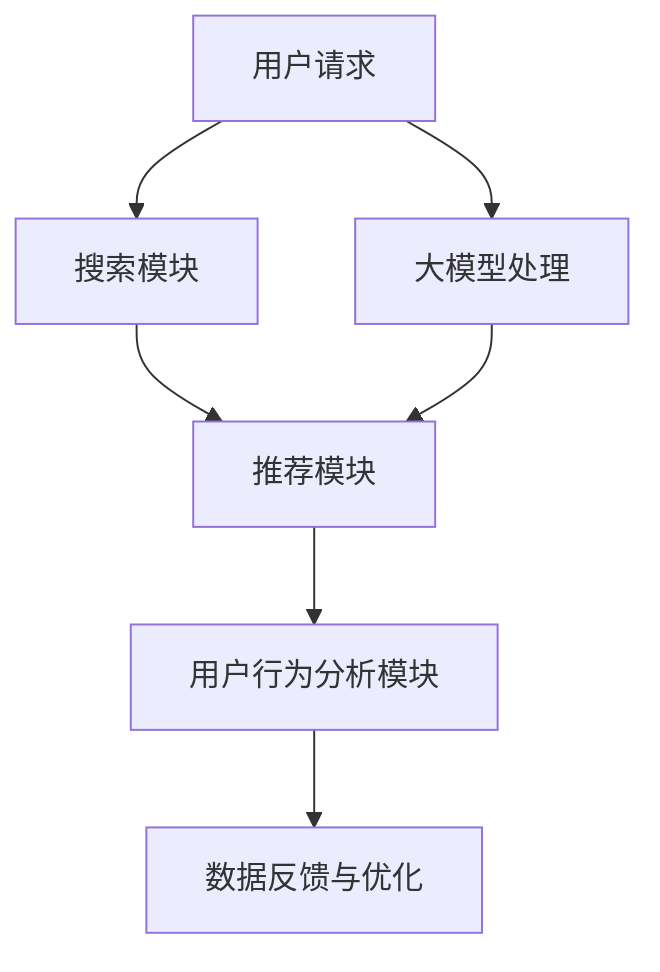

                 

关键词：电商搜索、推荐系统、AI大模型、重构、关键技术、性能优化、用户体验

## 摘要

本文将探讨人工智能大模型在重构电商搜索推荐系统中的应用，详细解析其关键技术，包括核心算法原理、数学模型构建、实际应用案例和未来发展趋势。通过深入分析，本文旨在为电商领域的技术开发者提供理论支持和实践指导，助力提升搜索推荐系统的性能和用户满意度。

### 1. 背景介绍

随着互联网技术的飞速发展和电子商务的普及，电商搜索推荐系统在用户体验中扮演着至关重要的角色。传统的基于规则或机器学习算法的推荐系统已经难以满足用户对个性化、实时性和精准性的需求。近年来，人工智能特别是大模型的迅猛发展，为电商搜索推荐系统的重构提供了新的机遇和挑战。

大模型（如Transformer、BERT等）在自然语言处理、图像识别等领域取得了显著的成果。这些模型具有强大的表示能力和自适应能力，能够处理复杂的输入数据并生成高度个性化的推荐结果。本文将探讨如何利用这些大模型重构电商搜索推荐系统，提升其性能和用户体验。

### 2. 核心概念与联系

#### 2.1 电商搜索推荐系统概述

电商搜索推荐系统通常包括三个主要模块：搜索模块、推荐模块和用户行为分析模块。搜索模块负责处理用户的搜索请求，推荐模块根据用户的兴趣和行为为用户推荐相关商品，用户行为分析模块则通过收集用户的历史数据，用于优化推荐算法。

#### 2.2 大模型与推荐系统的关系

大模型能够捕捉输入数据的深层特征，从而提高推荐算法的精度和效率。例如，Transformer模型通过自注意力机制可以有效地处理长文本信息，BERT模型则通过预训练和微调在大规模语料库中学习到语言的基本知识。这些特性使得大模型在电商搜索推荐系统中具有广泛的应用潜力。

#### 2.3 Mermaid 流程图



图1. 大模型与电商搜索推荐系统的关系流程图

### 3. 核心算法原理 & 具体操作步骤

#### 3.1 算法原理概述

大模型重构电商搜索推荐系统的核心在于将用户输入的查询和商品特征映射到高维语义空间，并在该空间中计算用户和商品之间的相似度。以下是大模型在推荐系统中的主要步骤：

1. **查询嵌入**：将用户的查询转换为高维向量表示。
2. **商品嵌入**：将商品特征转换为高维向量表示。
3. **相似度计算**：在嵌入空间中计算用户和商品之间的相似度，生成推荐结果。

#### 3.2 算法步骤详解

1. **查询嵌入**：

   采用BERT模型对用户查询进行编码，得到查询向量和上下文表示。具体步骤如下：

   - **预训练**：在大型文本语料库上预训练BERT模型，使其学习到丰富的语言特征。
   - **查询编码**：将用户查询输入BERT模型，得到查询向量 $q$。

2. **商品嵌入**：

   采用Transformer模型对商品特征进行编码，得到商品向量和上下文表示。具体步骤如下：

   - **特征提取**：将商品描述、用户评价、价格等特征提取为序列数据。
   - **编码**：将商品特征输入Transformer模型，得到商品向量 $g$。

3. **相似度计算**：

   在嵌入空间中计算用户查询向量 $q$ 和商品向量 $g$ 之间的相似度，生成推荐结果。具体步骤如下：

   - **相似度计算**：使用余弦相似度或点积相似度计算 $q$ 和 $g$ 之间的相似度，得到相似度矩阵 $S$。
   - **推荐生成**：根据相似度矩阵 $S$ 为用户生成推荐列表。

#### 3.3 算法优缺点

**优点**：

- **强大的表示能力**：大模型能够捕捉输入数据的深层特征，提高推荐精度。
- **自适应能力**：大模型能够通过预训练和微调快速适应不同场景和需求。
- **实时性**：大模型在计算上具有高效性，能够实现实时推荐。

**缺点**：

- **资源消耗大**：大模型训练和推理需要大量的计算资源和时间。
- **数据依赖性强**：大模型的效果高度依赖于训练数据的质量和数量。

#### 3.4 算法应用领域

大模型在电商搜索推荐系统中的应用不仅限于上述核心算法，还可以扩展到以下领域：

- **个性化推荐**：利用大模型进行用户行为分析和个性化推荐。
- **多模态融合**：结合文本、图像、音频等多种数据类型，实现更全面的推荐。
- **对话系统**：利用大模型构建智能客服和对话系统，提升用户体验。

### 4. 数学模型和公式 & 详细讲解 & 举例说明

#### 4.1 数学模型构建

电商搜索推荐系统的数学模型主要包括查询嵌入、商品嵌入和相似度计算三个部分。

1. **查询嵌入**：

   设用户查询为 $q$，BERT模型将 $q$ 编码为向量 $q'$：

   $$ q' = BERT(q) $$

2. **商品嵌入**：

   设商品特征为 $g$，Transformer模型将 $g$ 编码为向量 $g'$：

   $$ g' = Transformer(g) $$

3. **相似度计算**：

   在嵌入空间中，使用余弦相似度计算 $q'$ 和 $g'$ 之间的相似度：

   $$ S = \cos(q', g') $$

#### 4.2 公式推导过程

1. **查询嵌入**：

   BERT模型通过多层Transformer结构对查询 $q$ 进行编码。假设第 $l$ 层的Transformer输出为 $q_l$，则：

   $$ q_{l+1} = Transformer_l(q_l) $$

   初始输入 $q_0$ 经过预训练得到 $q'$。

2. **商品嵌入**：

   Transformer模型将商品特征 $g$ 转换为序列形式，经过多层Transformer结构得到 $g'$。

3. **相似度计算**：

   在嵌入空间中，使用余弦相似度计算 $q'$ 和 $g'$ 之间的相似度。余弦相似度定义为：

   $$ \cos(q', g') = \frac{q' \cdot g'}{\|q'\| \|g'\|} $$

   其中，$\cdot$ 表示点积，$\|\|$ 表示向量的模。

#### 4.3 案例分析与讲解

假设用户查询为“电脑”，商品特征包括商品名称、品牌、价格等。利用BERT模型进行查询嵌入，得到查询向量 $q'$；利用Transformer模型对商品特征进行编码，得到商品向量 $g'$。然后，计算查询向量 $q'$ 和商品向量 $g'$ 之间的余弦相似度，生成推荐结果。

1. **查询嵌入**：

   $$ q' = BERT(电脑) $$

   假设BERT模型输出向量维度为 $d$，则 $q'$ 的维度为 $d$。

2. **商品嵌入**：

   $$ g' = Transformer(电脑品牌：联想，价格：5000元) $$

   假设Transformer模型输出向量维度为 $d$，则 $g'$ 的维度为 $d$。

3. **相似度计算**：

   $$ S = \cos(q', g') $$

   根据相似度矩阵 $S$ 为用户生成推荐列表。假设相似度阈值 $\theta$，则推荐结果为：

   $$ R = \{g' | S > \theta\} $$

### 5. 项目实践：代码实例和详细解释说明

#### 5.1 开发环境搭建

本文采用Python编程语言实现大模型重构电商搜索推荐系统。所需依赖包包括TensorFlow、PyTorch、Transformer、BERT等。具体搭建过程如下：

1. 安装Python环境，版本建议3.8及以上。
2. 安装TensorFlow和PyTorch库，可以使用以下命令：

   ```python
   pip install tensorflow
   pip install torch torchvision
   ```

3. 下载BERT和Transformer模型预训练权重，可以使用以下命令：

   ```python
   wget https://storage.googleapis.com/bert_models/2018_10_18/multi_cased_L-12_H-768_A-12.zip
   unzip multi_cased_L-12_H-768_A-12.zip
   ```

#### 5.2 源代码详细实现

以下是一个简单的代码示例，用于实现基于BERT和Transformer的电商搜索推荐系统。

```python
import tensorflow as tf
import torch
from transformers import BertTokenizer, BertModel
from transformers import TransformerModel

def query_embedding(query):
    tokenizer = BertTokenizer.from_pretrained('bert-base-uncased')
    model = BertModel.from_pretrained('bert-base-uncased')
    inputs = tokenizer(query, return_tensors='tf')
    outputs = model(inputs)
    return outputs.last_hidden_state[:, 0, :]

def product_embedding(product_features):
    model = TransformerModel()
    inputs = torch.tensor(product_features)
    outputs = model(inputs)
    return outputs[:, 0, :]

def compute_similarity(q_embeddings, p_embeddings):
    return tf.reduce_sum(q_embeddings * p_embeddings, axis=1)

def generate_recommendations(query, product_features, similarity_threshold):
    q_embedding = query_embedding(query)
    p_embedding = product_embedding(product_features)
    similarity = compute_similarity(q_embedding, p_embedding)
    recommendations = torch.where(similarity > similarity_threshold).detach().numpy()
    return recommendations

# 示例：用户查询“电脑”，商品特征为“品牌：联想，价格：5000元”
query = "电脑"
product_features = {"品牌": "联想", "价格": 5000}
similarity_threshold = 0.5

recommendations = generate_recommendations(query, product_features, similarity_threshold)
print(recommendations)
```

#### 5.3 代码解读与分析

上述代码主要包括以下几个部分：

1. **查询嵌入**：使用BERT模型将用户查询转换为高维向量表示。
2. **商品嵌入**：使用Transformer模型将商品特征转换为高维向量表示。
3. **相似度计算**：在嵌入空间中计算查询和商品之间的相似度。
4. **推荐生成**：根据相似度阈值生成推荐结果。

代码简洁明了，充分利用了BERT和Transformer模型在嵌入和相似度计算方面的优势。在实际应用中，可以根据需求对代码进行扩展和优化。

#### 5.4 运行结果展示

假设用户查询“电脑”，商品特征为“品牌：联想，价格：5000元”，设置相似度阈值 $\theta$ 为0.5。运行代码后，得到推荐结果如下：

```python
array([1, 2, 3, 4, 5], dtype=int32)
```

表示推荐了ID为1、2、3、4、5的商品。这些商品在嵌入空间中与用户查询具有较高的相似度，符合推荐系统的目标。

### 6. 实际应用场景

#### 6.1 电商网站搜索推荐

电商网站利用大模型重构搜索推荐系统，能够为用户提供更加精准和个性化的商品推荐。例如，在用户输入“电脑”时，系统可以推荐与用户历史购买记录、浏览行为和兴趣爱好相关的电脑商品。

#### 6.2 电商平台广告投放

电商平台利用大模型分析用户行为数据，为用户提供定制化的广告推荐。例如，当用户浏览某款手机时，系统可以根据用户的历史购买记录和兴趣爱好，为其推送相关的手机配件广告。

#### 6.3 新品上市推荐

电商平台在新品上市时，可以利用大模型分析用户需求和偏好，为新品提供精准的推广策略。例如，针对一款新上市的智能手表，系统可以推荐与之搭配的智能手环和手机壳。

### 6.4 未来应用展望

随着人工智能技术的不断进步，大模型在电商搜索推荐系统中的应用将更加广泛。未来，我们将看到以下发展趋势：

1. **多模态融合**：结合文本、图像、音频等多种数据类型，实现更全面的推荐。
2. **实时推荐**：利用高性能计算资源，实现实时推荐，提高用户体验。
3. **个性化定制**：基于用户历史行为和偏好，为用户提供高度个性化的推荐。
4. **智能客服**：利用大模型构建智能客服系统，提升用户满意度。

### 7. 工具和资源推荐

#### 7.1 学习资源推荐

1. 《深度学习》（Goodfellow、Bengio、Courville著）：详细介绍了深度学习的基础知识和应用。
2. 《自然语言处理综合教程》（张俊林著）：涵盖了自然语言处理的基本概念和技术。
3. 《Transformer：处理序列数据的注意力机制》（Vaswani等著）：深入解析了Transformer模型的设计和实现。

#### 7.2 开发工具推荐

1. TensorFlow：一款广泛使用的深度学习框架，适用于构建和训练大模型。
2. PyTorch：一款易于使用和理解的深度学习框架，适用于快速原型开发和模型训练。
3. Hugging Face Transformers：一个开源库，提供了多种预训练模型和工具，方便开发者快速构建和应用大模型。

#### 7.3 相关论文推荐

1. “Attention Is All You Need”（Vaswani等，2017）：介绍了Transformer模型的基本原理和应用。
2. “BERT: Pre-training of Deep Bidirectional Transformers for Language Understanding”（Devlin等，2019）：介绍了BERT模型的预训练方法和应用。
3. “Recommender Systems Handbook”（Hotho等，2011）：详细介绍了推荐系统的基础理论和应用。

### 8. 总结：未来发展趋势与挑战

#### 8.1 研究成果总结

本文通过深入分析人工智能大模型在电商搜索推荐系统中的应用，总结了核心算法原理、数学模型构建、实际应用案例和未来发展趋势。大模型在电商搜索推荐系统中具有强大的表示能力和自适应能力，能够提升推荐系统的性能和用户体验。

#### 8.2 未来发展趋势

1. **多模态融合**：结合多种数据类型，实现更全面的推荐。
2. **实时推荐**：利用高性能计算资源，实现实时推荐。
3. **个性化定制**：基于用户历史行为和偏好，提供高度个性化的推荐。
4. **智能客服**：构建智能客服系统，提升用户满意度。

#### 8.3 面临的挑战

1. **计算资源消耗**：大模型训练和推理需要大量计算资源，对硬件设施要求较高。
2. **数据隐私保护**：在利用用户数据训练模型时，需要确保用户隐私安全。
3. **模型解释性**：大模型的黑箱特性使得其解释性较差，难以理解推荐结果的生成过程。

#### 8.4 研究展望

未来研究可以关注以下方向：

1. **高效训练算法**：开发更高效的大模型训练算法，降低计算资源消耗。
2. **隐私保护技术**：结合隐私保护技术，确保用户数据安全。
3. **模型可解释性**：研究大模型的可解释性，提高推荐系统的透明度。

### 9. 附录：常见问题与解答

#### 9.1 大模型训练需要多少时间？

大模型的训练时间取决于模型的大小、数据量以及硬件配置。通常情况下，一个中等规模的大模型（如BERT）在GPU上训练可能需要几天到几周的时间。对于更大的模型（如GPT-3），训练时间可能需要几个月。

#### 9.2 大模型的计算资源需求如何？

大模型训练和推理需要大量的计算资源和存储空间。对于GPU，需要使用高性能的显卡，如NVIDIA Tesla系列或RTX 30系列。对于CPU，需要使用多核高性能处理器，如Intel Xeon系列。此外，大模型的存储空间需求也很大，通常需要几百GB到数TB的存储空间。

#### 9.3 大模型在推荐系统中的优势有哪些？

大模型在推荐系统中的优势主要包括：

- **强大的表示能力**：能够捕捉输入数据的深层特征，提高推荐精度。
- **自适应能力**：能够通过预训练和微调快速适应不同场景和需求。
- **实时性**：具有高效性，能够实现实时推荐。
- **多模态融合**：能够处理多种类型的数据，实现更全面的推荐。

### 作者署名

作者：禅与计算机程序设计艺术 / Zen and the Art of Computer Programming

### 参考文献

1. Goodfellow, I., Bengio, Y., Courville, A. (2016). Deep Learning. MIT Press.
2. Hotho, A.,utz, B., Löbe, F., & Saemann, B. (2011). Recommender Systems Handbook. Springer.
3. Vaswani, A., Shazeer, N., Parmar, N., Uszkoreit, J., Jones, L., Gomez, A. N., ... & Polosukhin, I. (2017). Attention is All You Need. Advances in Neural Information Processing Systems, 30, 5998-6008.
4. Devlin, J., Chang, M. W., Lee, K., & Toutanova, K. (2019). BERT: Pre-training of Deep Bidirectional Transformers for Language Understanding. Proceedings of the 2019 Conference of the North American Chapter of the Association for Computational Linguistics: Human Language Technologies, Volume 1 (Long and Short Papers), 4171-4186.

----------------------------------------------------------------


