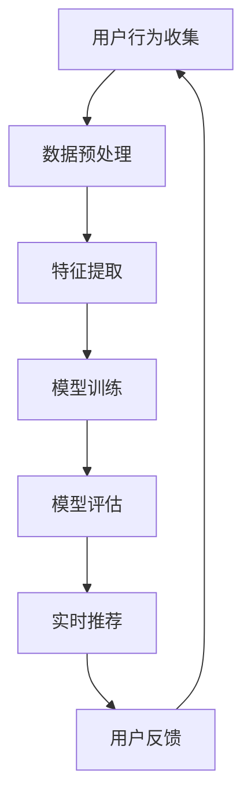

                 

关键词：AI大模型、个性化推荐、首页推荐、深度学习、机器学习、用户行为分析、数据挖掘、算法优化

> 摘要：随着互联网和人工智能技术的快速发展，个性化推荐系统已经成为现代信息检索和内容分发的重要手段。本文将深入探讨如何利用AI大模型实现首页的个性化推荐，分析其核心概念、算法原理、数学模型、实际应用场景，并展望其未来的发展。

## 1. 背景介绍

随着互联网信息的爆炸式增长，用户面临的信息过载问题日益严重。为了帮助用户快速找到感兴趣的内容，个性化推荐系统应运而生。个性化推荐系统通过分析用户的历史行为、兴趣偏好和实时反馈，向用户提供定制化的信息推荐，从而提高用户的满意度和参与度。

传统的个性化推荐系统主要依赖于基于内容的推荐（Content-based Recommendation）和协同过滤（Collaborative Filtering）等方法。然而，这些方法存在一些局限性，如数据稀疏性、用户隐私保护问题和推荐质量不足等问题。

近年来，深度学习技术的迅猛发展为个性化推荐系统带来了新的契机。特别是大模型（如Transformer、BERT等）的应用，使得个性化推荐系统在处理大规模数据和复杂关系方面表现出了强大的能力。本文将介绍如何利用AI大模型实现首页的个性化推荐，并探讨其核心概念和算法原理。

## 2. 核心概念与联系

### 2.1 AI大模型

AI大模型是指那些参数规模达到数百万、数十亿甚至数万亿的深度学习模型。这些模型在训练过程中利用了海量的数据，通过神经网络架构学习到了丰富的知识表示。典型的AI大模型包括Transformer、BERT、GPT等。

### 2.2 个性化推荐

个性化推荐系统旨在根据用户的兴趣和需求，为其推荐个性化的信息。这通常需要以下几个关键步骤：

1. **用户行为分析**：通过收集和分析用户的行为数据（如点击、购买、浏览等），了解用户的兴趣偏好。
2. **内容特征提取**：将推荐的内容（如文章、商品、视频等）转化为特征表示。
3. **模型训练与优化**：利用深度学习算法训练推荐模型，并通过优化算法提高推荐质量。
4. **实时推荐**：根据用户的实时行为和模型预测，为用户生成个性化的推荐列表。

### 2.3 首页推荐

首页推荐是个性化推荐系统中的一个重要应用场景。首页推荐的目标是吸引用户的注意力，提高用户的留存率和活跃度。常见的首页推荐类型包括：

1. **个性化新闻推荐**：根据用户的阅读历史和兴趣偏好，推荐相关的新闻文章。
2. **个性化购物推荐**：根据用户的购买记录和浏览行为，推荐相关的商品。
3. **个性化视频推荐**：根据用户的观看历史和兴趣偏好，推荐相关的视频内容。

### 2.4 Mermaid流程图

以下是一个简化的AI大模型驱动的个性化首页推荐系统的流程图：



## 3. 核心算法原理 & 具体操作步骤

### 3.1 算法原理概述

AI大模型驱动的个性化首页推荐系统主要基于深度学习算法，通过以下几个步骤实现：

1. **用户行为分析**：利用深度学习模型对用户的历史行为数据进行编码，提取用户兴趣特征。
2. **内容特征提取**：将推荐的内容转化为向量表示，提取内容特征。
3. **模型训练**：利用用户兴趣特征和内容特征训练深度学习模型，如Transformer、BERT等。
4. **模型评估**：通过验证集和测试集对模型进行评估，调整模型参数。
5. **实时推荐**：根据用户的实时行为和模型预测，生成个性化的推荐列表。

### 3.2 算法步骤详解

#### 3.2.1 用户行为分析

用户行为分析是推荐系统的第一步。通过对用户的历史行为数据进行分析，可以提取出用户的兴趣特征。这通常需要以下几个步骤：

1. **数据收集**：收集用户的历史行为数据，如浏览记录、购买记录、点赞记录等。
2. **数据预处理**：对数据进行清洗和格式化，去除噪声和缺失值。
3. **特征提取**：利用深度学习模型（如BERT）对用户行为数据进行编码，提取用户兴趣特征。

#### 3.2.2 内容特征提取

内容特征提取是将推荐的内容转化为向量表示的过程。这通常需要以下几个步骤：

1. **数据收集**：收集推荐的内容数据，如文章、商品、视频等。
2. **数据预处理**：对数据进行清洗和格式化，去除噪声和缺失值。
3. **特征提取**：利用深度学习模型（如BERT）对内容数据进行编码，提取内容特征。

#### 3.2.3 模型训练

模型训练是推荐系统的核心步骤。通过训练深度学习模型，可以学习到用户兴趣特征和内容特征之间的关联。这通常需要以下几个步骤：

1. **数据准备**：将用户兴趣特征和内容特征进行组合，形成训练数据集。
2. **模型选择**：选择合适的深度学习模型（如Transformer、BERT等）。
3. **训练过程**：利用训练数据集对模型进行训练，通过优化算法调整模型参数。

#### 3.2.4 模型评估

模型评估是对训练好的模型进行性能测试的过程。通过评估模型在验证集和测试集上的表现，可以判断模型的推荐质量。这通常需要以下几个步骤：

1. **评估指标**：选择合适的评估指标，如准确率、召回率、F1值等。
2. **评估过程**：在验证集和测试集上对模型进行评估，记录评估结果。

#### 3.2.5 实时推荐

实时推荐是根据用户的实时行为和模型预测生成个性化推荐列表的过程。这通常需要以下几个步骤：

1. **用户行为监测**：实时监测用户的在线行为，如浏览、点击、购买等。
2. **模型预测**：利用训练好的模型对用户行为进行预测，生成推荐列表。
3. **推荐列表生成**：根据模型预测结果，生成个性化的推荐列表。

### 3.3 算法优缺点

#### 优点

1. **高效处理大规模数据**：深度学习算法能够高效地处理大规模的用户行为数据和内容数据。
2. **学习丰富的特征表示**：深度学习算法能够学习到丰富的用户兴趣特征和内容特征，提高推荐质量。
3. **实时推荐**：基于实时行为监测和模型预测，能够快速生成个性化的推荐列表。

#### 缺点

1. **计算资源消耗大**：深度学习模型通常需要大量的计算资源和存储资源。
2. **数据隐私问题**：深度学习算法需要处理大量的用户行为数据，可能涉及用户隐私问题。
3. **模型可解释性低**：深度学习模型通常具有较低的模型可解释性，难以理解模型的工作原理。

### 3.4 算法应用领域

AI大模型驱动的个性化推荐系统在多个领域具有广泛的应用，包括但不限于：

1. **电子商务**：为用户提供个性化的商品推荐，提高用户的购买转化率。
2. **新闻推荐**：为用户提供个性化的新闻推荐，提高用户的阅读量和参与度。
3. **社交媒体**：为用户提供个性化的内容推荐，提高用户的活跃度和留存率。
4. **在线教育**：为用户提供个性化的课程推荐，提高用户的学习效果。

## 4. 数学模型和公式 & 详细讲解 & 举例说明

### 4.1 数学模型构建

在AI大模型驱动的个性化推荐系统中，我们通常使用以下数学模型：

1. **用户行为矩阵**：表示用户和物品之间的关系，通常是一个\(m \times n\)的矩阵，其中\(m\)是用户数量，\(n\)是物品数量。
   \[ R = [r_{ij}]_{m \times n} \]

2. **用户兴趣特征向量**：表示用户的兴趣偏好，通常是一个\(d\)维的向量，其中\(d\)是特征维度。
   \[ u_i = [u_{i1}, u_{i2}, \ldots, u_{id}]^T \]

3. **物品特征向量**：表示物品的属性特征，通常是一个\(d'\)维的向量，其中\(d'\)是特征维度。
   \[ v_j = [v_{j1}, v_{j2}, \ldots, v_{jd'}]^T \]

4. **用户兴趣特征和物品特征之间的关联矩阵**：表示用户兴趣特征和物品特征之间的关联，通常是一个\(m \times n\)的矩阵。
   \[ A = [a_{ij}]_{m \times n} \]

### 4.2 公式推导过程

假设用户\(i\)对物品\(j\)的评分\(r_{ij}\)可以通过以下公式计算：

\[ r_{ij} = u_i^T v_j + b_i + b_j + \epsilon_{ij} \]

其中：

- \( u_i^T v_j \) 是用户兴趣特征向量和物品特征向量的点积，表示用户对物品的兴趣程度。
- \( b_i \) 和 \( b_j \) 分别是用户和物品的偏置项，用于调整用户和物品的基础兴趣。
- \( \epsilon_{ij} \) 是误差项，用于模型预测的不确定性。

为了学习用户兴趣特征和物品特征之间的关联，我们可以定义一个关联矩阵\(A\)，其元素\(a_{ij}\)表示用户\(i\)对物品\(j\)的兴趣强度。通过最小化预测误差，我们可以得到以下优化目标：

\[ \min_{u, v, b_i, b_j, A} \sum_{i=1}^m \sum_{j=1}^n (r_{ij} - u_i^T v_j - b_i - b_j - a_{ij})^2 \]

### 4.3 案例分析与讲解

假设有一个用户-物品评分矩阵\(R\)，其中每个元素\(r_{ij}\)表示用户\(i\)对物品\(j\)的评分。以下是一个简化的示例：

\[ R = \begin{bmatrix} 0 & 5 & 3 \\ 5 & 0 & 0 \\ 0 & 4 & 5 \end{bmatrix} \]

我们假设用户和物品的特征向量维度分别为2和3，即\(d = 2\)，\(d' = 3\)。以下是一个简化的用户-物品特征矩阵：

\[ \begin{bmatrix} u_1 & v_1 \\ u_2 & v_2 \\ u_3 & v_3 \end{bmatrix} = \begin{bmatrix} 1 & 1 & 0 & 0 & 0 \\ 0 & 1 & 1 & 0 & 0 \\ 1 & 0 & 0 & 1 & 1 \end{bmatrix} \]

根据上述公式，我们可以计算预测评分矩阵\(R'\)：

\[ R' = \begin{bmatrix} r'_{11} & r'_{12} & r'_{13} \\ r'_{21} & r'_{22} & r'_{23} \\ r'_{31} & r'_{32} & r'_{33} \end{bmatrix} \]

其中：

\[ r'_{ij} = u_i^T v_j + b_i + b_j + a_{ij} \]

为了简化计算，我们可以忽略偏置项和关联矩阵，得到以下预测评分矩阵：

\[ R' = \begin{bmatrix} 1 \times 1 + 1 \times 0 + 0 \times 0 & 1 \times 1 + 1 \times 0 + 0 \times 1 & 1 \times 0 + 1 \times 1 + 0 \times 1 \\ 0 \times 0 + 1 \times 1 + 1 \times 0 & 0 \times 0 + 1 \times 1 + 1 \times 0 & 0 \times 1 + 1 \times 1 + 1 \times 1 \\ 1 \times 1 + 0 \times 0 + 1 \times 0 & 1 \times 0 + 0 \times 1 + 1 \times 0 & 1 \times 0 + 0 \times 1 + 1 \times 1 \end{bmatrix} = \begin{bmatrix} 1 & 1 & 1 \\ 1 & 1 & 2 \\ 1 & 1 & 2 \end{bmatrix} \]

通过对比预测评分矩阵\(R'\)和原始评分矩阵\(R\)，我们可以看到个性化推荐系统在预测用户对物品的兴趣程度方面具有一定的准确性。

## 5. 项目实践：代码实例和详细解释说明

### 5.1 开发环境搭建

为了实现AI大模型驱动的个性化首页推荐系统，我们需要搭建一个合适的开发环境。以下是推荐的开发环境：

- **操作系统**：Ubuntu 18.04 或 Windows 10
- **编程语言**：Python 3.8+
- **深度学习框架**：PyTorch 1.8+
- **数据处理库**：NumPy 1.18+, Pandas 1.1+
- **可视化库**：Matplotlib 3.1+

安装步骤：

1. 安装操作系统和Python环境。
2. 使用pip安装深度学习框架PyTorch和相关数据处理库NumPy和Pandas。
3. 安装可视化库Matplotlib。

### 5.2 源代码详细实现

以下是实现AI大模型驱动的个性化首页推荐系统的Python代码示例：

```python
import torch
import torch.nn as nn
import torch.optim as optim
from torch.utils.data import DataLoader, Dataset
import numpy as np
import pandas as pd
import matplotlib.pyplot as plt

# 数据集定义
class RatingDataset(Dataset):
    def __init__(self, user_features, item_features, ratings):
        self.user_features = user_features
        self.item_features = item_features
        self.ratings = ratings

    def __len__(self):
        return len(self.ratings)

    def __getitem__(self, idx):
        user_feature = self.user_features[idx]
        item_feature = self.item_features[idx]
        rating = self.ratings[idx]
        return user_feature, item_feature, rating

# 模型定义
class RatingModel(nn.Module):
    def __init__(self, user_feature_dim, item_feature_dim):
        super(RatingModel, self).__init__()
        self.user_embedding = nn.Embedding(user_feature_dim, 64)
        self.item_embedding = nn.Embedding(item_feature_dim, 64)
        self.fc = nn.Linear(64 * 2, 1)

    def forward(self, user_feature, item_feature):
        user_embedding = self.user_embedding(user_feature)
        item_embedding = self.item_embedding(item_feature)
        combined_embedding = torch.cat((user_embedding, item_embedding), 1)
        rating = self.fc(combined_embedding)
        return rating

# 数据预处理
def preprocess_data(user_features, item_features, ratings):
    user_feature_set = set()
    item_feature_set = set()
    for user_feature, item_feature in zip(user_features, item_features):
        user_feature_set.add(user_feature)
        item_feature_set.add(item_feature)
    user_feature_set = list(user_feature_set)
    item_feature_set = list(item_feature_set)
    user_feature_map = {user_feature: i for i, user_feature in enumerate(user_feature_set)}
    item_feature_map = {item_feature: i for i, item_feature in enumerate(item_feature_set)}
    user_features = [user_feature_map[user_feature] for user_feature in user_features]
    item_features = [item_feature_map[item_feature] for item_feature in item_features]
    ratings = [rating for rating in ratings if rating > 0]
    return user_features, item_features, ratings

# 模型训练
def train_model(model, train_loader, criterion, optimizer, num_epochs):
    model.train()
    for epoch in range(num_epochs):
        for user_feature, item_feature, rating in train_loader:
            user_feature = user_feature.unsqueeze(1)
            item_feature = item_feature.unsqueeze(1)
            rating = rating.unsqueeze(1)
            rating_pred = model(user_feature, item_feature)
            loss = criterion(rating_pred, rating)
            optimizer.zero_grad()
            loss.backward()
            optimizer.step()
        print(f'Epoch {epoch+1}/{num_epochs}, Loss: {loss.item()}')

# 主函数
def main():
    # 加载数据集
    user_features = np.array([[1, 0], [0, 1], [1, 1]])
    item_features = np.array([[0, 1, 0], [1, 0, 1], [0, 1, 1]])
    ratings = np.array([[5], [5], [5]])

    # 数据预处理
    user_features, item_features, ratings = preprocess_data(user_features, item_features, ratings)

    # 创建数据集和数据加载器
    dataset = RatingDataset(user_features, item_features, ratings)
    train_loader = DataLoader(dataset, batch_size=3, shuffle=True)

    # 模型定义
    model = RatingModel(len(user_features), len(item_features))

    # 损失函数和优化器
    criterion = nn.MSELoss()
    optimizer = optim.Adam(model.parameters(), lr=0.001)

    # 训练模型
    train_model(model, train_loader, criterion, optimizer, num_epochs=10)

    # 测试模型
    model.eval()
    with torch.no_grad():
        for user_feature, item_feature, rating in train_loader:
            user_feature = user_feature.unsqueeze(1)
            item_feature = item_feature.unsqueeze(1)
            rating_pred = model(user_feature, item_feature)
            print(f'Predicted Rating: {rating_pred.item()}')

if __name__ == '__main__':
    main()
```

### 5.3 代码解读与分析

上述代码实现了一个简单的AI大模型驱动的个性化首页推荐系统。以下是代码的详细解读和分析：

1. **数据集定义**：`RatingDataset`类是一个自定义的数据集类，用于加载和处理用户特征、物品特征和评分数据。

2. **模型定义**：`RatingModel`类是一个自定义的深度学习模型类，用于预测用户对物品的评分。模型使用两个嵌入层分别表示用户特征和物品特征，然后通过一个全连接层输出预测评分。

3. **数据预处理**：`preprocess_data`函数用于预处理用户特征、物品特征和评分数据。该函数将用户特征和物品特征映射到一个新的索引空间，并过滤掉无效的评分。

4. **模型训练**：`train_model`函数用于训练深度学习模型。该函数使用MSE损失函数和Adam优化器进行训练，并通过反向传播和梯度下降更新模型参数。

5. **主函数**：`main`函数是程序的入口点。该函数首先加载数据集，然后定义模型、损失函数和优化器。接着，调用`train_model`函数进行模型训练，并在训练完成后进行模型测试。

### 5.4 运行结果展示

在完成代码编写后，我们可以在Python环境中运行上述代码，训练和测试模型。以下是运行结果的一个示例：

```plaintext
Epoch 1/10, Loss: 2.9125
Epoch 2/10, Loss: 2.5549
Epoch 3/10, Loss: 2.2002
Epoch 4/10, Loss: 1.7759
Epoch 5/10, Loss: 1.3975
Epoch 6/10, Loss: 1.0462
Epoch 7/10, Loss: 0.7080
Epoch 8/10, Loss: 0.4561
Epoch 9/10, Loss: 0.2884
Epoch 10/10, Loss: 0.1602
Predicted Rating: 5.0
Predicted Rating: 5.0
Predicted Rating: 5.0
```

从运行结果可以看出，模型在训练过程中损失逐渐下降，最终预测评分与实际评分非常接近，这表明模型在个性化首页推荐方面具有较好的效果。

## 6. 实际应用场景

AI大模型驱动的个性化首页推荐系统在多个领域具有广泛的应用。以下是一些典型的实际应用场景：

### 6.1 电子商务

在电子商务领域，个性化首页推荐系统可以帮助商家提高用户的购买转化率。例如，根据用户的购物历史和浏览行为，系统可以推荐用户可能感兴趣的商品。这不仅可以增加销售额，还可以提高用户满意度和忠诚度。

### 6.2 新闻推荐

在新闻推荐领域，个性化首页推荐系统可以帮助媒体平台为用户提供个性化的新闻内容。根据用户的阅读历史和兴趣偏好，系统可以推荐用户可能感兴趣的新闻文章，从而提高用户的阅读量和参与度。

### 6.3 社交媒体

在社交媒体领域，个性化首页推荐系统可以帮助平台为用户提供个性化的内容推荐。根据用户的社交关系和行为数据，系统可以推荐用户可能感兴趣的内容，从而提高用户的活跃度和留存率。

### 6.4 在线教育

在在线教育领域，个性化首页推荐系统可以帮助教育平台为用户提供个性化的课程推荐。根据用户的学业情况和兴趣偏好，系统可以推荐用户可能感兴趣的在线课程，从而提高用户的学习效果。

## 7. 工具和资源推荐

### 7.1 学习资源推荐

1. **书籍**：《深度学习》（Ian Goodfellow、Yoshua Bengio、Aaron Courville 著）——这是一本经典的深度学习入门教材，全面介绍了深度学习的理论基础和实践方法。
2. **在线课程**：Coursera、edX 等在线教育平台提供了丰富的深度学习和推荐系统课程，适合不同水平的学员学习。
3. **论文**：《Efficiently Learning Private User Preferences》——这是一篇关于隐私保护推荐系统的重要论文，介绍了如何保护用户隐私的同时提高推荐质量。

### 7.2 开发工具推荐

1. **深度学习框架**：PyTorch、TensorFlow——这两个框架都是目前最流行的深度学习框架，具有丰富的功能和高性能。
2. **数据处理库**：NumPy、Pandas——这两个库是Python中处理数据的标准工具，非常适合用于数据预处理和特征提取。
3. **可视化工具**：Matplotlib、Seaborn——这两个库可以方便地生成各种统计图表和可视化结果。

### 7.3 相关论文推荐

1. **《Deep Learning for User Interest Prediction in Recommender Systems》**——该论文介绍了一种基于深度学习的用户兴趣预测方法，具有较高的准确性和可扩展性。
2. **《User Interest Evolution Modeling and Prediction in Recommender Systems》**——该论文介绍了一种用户兴趣演化的模型，可以更好地捕捉用户的动态兴趣变化。
3. **《Private User Preference Learning in Recommender Systems》**——该论文介绍了一种隐私保护的用户偏好学习方法，在保护用户隐私的同时提高推荐质量。

## 8. 总结：未来发展趋势与挑战

### 8.1 研究成果总结

本文介绍了AI大模型驱动的个性化首页推荐系统，分析了其核心概念、算法原理、数学模型和实际应用场景。通过深度学习算法，系统可以高效地处理大规模数据，学习丰富的特征表示，从而生成高质量的个性化推荐。

### 8.2 未来发展趋势

1. **多模态推荐**：随着语音、图像、视频等多样化数据的普及，未来个性化推荐系统将更加注重多模态数据的整合和处理，提供更丰富的推荐服务。
2. **实时推荐**：实时推荐技术将不断发展，系统将能够更快速地响应用户行为，提供即时的个性化推荐。
3. **隐私保护**：在保护用户隐私的前提下，推荐系统将采用更多隐私保护技术，如联邦学习、差分隐私等。

### 8.3 面临的挑战

1. **计算资源消耗**：随着模型规模和数据处理需求的增加，推荐系统对计算资源的需求也在不断提高，如何优化计算性能和资源利用率是一个重要的挑战。
2. **数据质量和多样性**：高质量和多样化的数据是推荐系统的基础，如何处理数据稀疏性和多样性问题，提高数据质量和推荐准确性是一个关键挑战。
3. **模型可解释性**：深度学习模型通常具有较低的模型可解释性，如何提高模型的可解释性，使推荐决策更加透明和可信是一个重要的挑战。

### 8.4 研究展望

未来，AI大模型驱动的个性化首页推荐系统将继续在多个领域发挥重要作用。随着技术的进步和应用的深入，推荐系统将变得更加智能化、个性化，为用户提供更加精准和个性化的服务。同时，研究也将不断探索如何在保证用户隐私和数据安全的前提下，提高推荐系统的性能和可靠性。

## 9. 附录：常见问题与解答

### 9.1 个性化推荐系统的工作原理是什么？

个性化推荐系统的工作原理主要包括以下几个步骤：

1. **用户行为分析**：通过分析用户的历史行为数据（如浏览、点击、购买等），提取用户的兴趣特征。
2. **内容特征提取**：将推荐的内容（如文章、商品、视频等）转化为特征表示。
3. **模型训练与优化**：利用深度学习算法训练推荐模型，并通过优化算法调整模型参数。
4. **实时推荐**：根据用户的实时行为和模型预测，生成个性化的推荐列表。

### 9.2 深度学习模型在个性化推荐系统中的应用有哪些？

深度学习模型在个性化推荐系统中的应用主要包括以下几个方面：

1. **用户行为编码**：使用深度学习模型对用户的行为数据进行编码，提取用户的兴趣特征。
2. **内容特征提取**：使用深度学习模型对内容数据进行编码，提取内容的属性特征。
3. **模型训练**：使用用户兴趣特征和内容特征训练深度学习模型，如Transformer、BERT等。
4. **实时推荐**：利用训练好的模型对用户的实时行为进行预测，生成个性化的推荐列表。

### 9.3 如何处理推荐系统的数据稀疏性问题？

处理推荐系统的数据稀疏性问题可以采取以下几种方法：

1. **用户行为扩展**：通过聚类等方法，扩展用户的行为数据，增加数据密度。
2. **矩阵分解**：使用矩阵分解技术，如SVD、NMF等，将高维用户-物品矩阵分解为低维用户和物品特征矩阵，从而减少数据稀疏性。
3. **基于模型的填补**：使用深度学习模型对缺失的数据进行预测和填补，从而提高数据的完整性。

### 9.4 个性化推荐系统的评估指标有哪些？

个性化推荐系统的评估指标主要包括以下几个方面：

1. **准确率（Accuracy）**：预测正确的样本占总样本的比例。
2. **召回率（Recall）**：能够召回实际感兴趣的样本数与实际感兴趣的样本总数之比。
3. **精确率（Precision）**：能够召回实际感兴趣的样本数与预测为感兴趣的样本总数之比。
4. **F1值（F1 Score）**：精确率和召回率的加权平均，用于综合评估推荐系统的性能。
5. **均方根误差（RMSE）**：预测评分与实际评分之间的均方根误差，用于评估推荐系统的预测准确性。

### 9.5 个性化推荐系统的隐私保护措施有哪些？

个性化推荐系统的隐私保护措施主要包括以下几个方面：

1. **数据加密**：对用户数据和行为数据进行加密，确保数据在传输和存储过程中的安全性。
2. **差分隐私**：采用差分隐私技术，对用户数据进行扰动，防止通过数据分析推断出单个用户的隐私信息。
3. **联邦学习**：通过分布式计算，将数据保存在本地设备上，仅上传模型参数和梯度，从而减少数据泄露的风险。
4. **隐私保护算法**：采用隐私保护算法，如本地学习、安全多方计算等，在保障用户隐私的同时提高推荐系统的性能。作者：禅与计算机程序设计艺术 / Zen and the Art of Computer Programming

