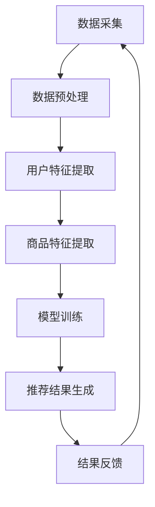

                 

关键词：AI大模型、电商、个性化推荐、实时、推荐引擎、算法、数学模型

> 摘要：本文将深入探讨AI大模型驱动的电商实时个性化推荐引擎的设计与实现，从核心概念、算法原理、数学模型、项目实践到实际应用场景等方面进行全面剖析，为读者提供全面的技术指南和思考。

## 1. 背景介绍

随着互联网的迅猛发展，电子商务已经成为人们生活中不可或缺的一部分。然而，面对海量的商品信息，用户在寻找心仪的商品时常常感到困惑和无从下手。为此，个性化推荐系统应运而生，它通过分析用户的历史行为和偏好，为用户推荐可能感兴趣的商品，从而提高用户购物体验和商家销售额。传统的推荐系统大多基于协同过滤、基于内容的推荐等方法，但这些方法往往存在计算复杂度高、实时性差、推荐质量不高等问题。

近年来，随着人工智能和深度学习的快速发展，大模型在推荐系统中的应用逐渐成为一种新的趋势。AI大模型能够从海量数据中自动学习用户的偏好和商品特征，提供更加精准和实时的推荐结果。本文将介绍如何设计并实现一个基于AI大模型的电商实时个性化推荐引擎，通过深入探讨其核心概念、算法原理、数学模型和项目实践，为读者提供一种全新的解决方案。

## 2. 核心概念与联系

### 2.1 大模型

大模型指的是拥有数十亿、甚至千亿级参数的深度学习模型。与传统的小型模型相比，大模型具有更强的表达能力、更高的计算复杂度和更好的泛化能力。大模型能够从海量数据中自动学习复杂的特征和模式，为各种应用场景提供强大的支持。

### 2.2 电商实时个性化推荐引擎

电商实时个性化推荐引擎是一种基于AI大模型的推荐系统，它能够实时地分析用户的行为数据，为用户推荐个性化的商品。实时性是电商推荐系统的关键特性，用户的行为和偏好是动态变化的，只有实时地捕捉这些变化，才能提供精准的推荐结果。

### 2.3 Mermaid 流程图



上述流程图展示了电商实时个性化推荐引擎的核心环节：数据采集、数据预处理、用户特征提取、商品特征提取、模型训练、推荐结果生成和结果反馈。

## 3. 核心算法原理 & 具体操作步骤

### 3.1 算法原理概述

基于AI大模型的电商实时个性化推荐引擎主要依赖于深度学习技术。深度学习通过构建多层神经网络，自动学习输入数据的特征表示，从而实现复杂函数的近似。在推荐系统中，深度学习能够通过学习用户的历史行为和商品特征，为用户生成个性化的推荐列表。

具体来说，算法可以分为以下几个步骤：

1. 数据采集：从电商平台上获取用户行为数据和商品数据。
2. 数据预处理：对原始数据进行清洗、去噪和归一化处理，以便后续分析。
3. 用户特征提取：从用户历史行为中提取特征，如购买次数、浏览时长、收藏商品等。
4. 商品特征提取：从商品描述、标签、价格、销量等属性中提取特征。
5. 模型训练：使用用户特征和商品特征作为输入，训练深度学习模型，以预测用户对商品的偏好。
6. 推荐结果生成：将训练好的模型应用于新的用户数据，生成个性化的推荐列表。
7. 结果反馈：根据用户对新推荐的商品的反应，进一步优化推荐模型。

### 3.2 算法步骤详解

#### 3.2.1 数据采集

数据采集是推荐系统的第一步，也是最重要的一步。数据的质量直接影响推荐系统的效果。在电商场景中，数据采集主要包括用户行为数据和商品数据。

- 用户行为数据：包括用户的浏览记录、购买记录、收藏记录等。
- 商品数据：包括商品描述、标签、价格、销量等。

数据采集的方法可以采用爬虫技术，从电商平台公开的API获取数据。此外，还可以结合用户调查、问卷调查等方式获取更多用户行为数据。

#### 3.2.2 数据预处理

数据预处理是数据采集后的关键步骤，目的是去除数据中的噪声和异常值，提高数据质量。

- 数据清洗：去除重复数据、缺失数据、异常数据等。
- 数据去噪：通过降维、滤波等技术去除数据中的噪声。
- 数据归一化：将不同量纲的数据转换为相同的量纲，以便后续分析。

#### 3.2.3 用户特征提取

用户特征提取是推荐系统的重要环节，通过提取用户的历史行为特征，为用户建立有效的特征表示。

- 用户行为特征：如购买次数、浏览时长、收藏商品等。
- 用户画像：根据用户的行为特征，构建用户画像，用于描述用户的兴趣偏好。

#### 3.2.4 商品特征提取

商品特征提取旨在从商品描述、标签、价格、销量等属性中提取有效特征，为商品建立特征表示。

- 商品属性特征：如商品类别、品牌、价格等。
- 商品标签特征：如商品标签、用户评价等。

#### 3.2.5 模型训练

模型训练是推荐系统的核心步骤，通过训练深度学习模型，学习用户和商品的复杂特征，为用户生成个性化推荐。

- 模型选择：选择合适的深度学习模型，如基于注意力机制的模型、图神经网络等。
- 模型训练：使用用户特征和商品特征作为输入，训练深度学习模型。
- 模型优化：通过调整模型参数，优化推荐效果。

#### 3.2.6 推荐结果生成

推荐结果生成是根据训练好的模型，为用户生成个性化的推荐列表。

- 推荐策略：选择合适的推荐策略，如基于内容的推荐、基于模型的推荐等。
- 推荐结果：根据推荐策略，生成用户个性化的推荐列表。

#### 3.2.7 结果反馈

结果反馈是推荐系统不断优化的关键环节，通过收集用户对推荐结果的反馈，进一步优化推荐模型。

- 用户反馈：收集用户对推荐结果的评价，如点赞、不喜欢等。
- 模型更新：根据用户反馈，调整模型参数，优化推荐效果。

### 3.3 算法优缺点

#### 优点

1. 高效：深度学习模型能够自动学习用户和商品的复杂特征，提高推荐效率。
2. 精准：基于用户历史行为和偏好，提供个性化的推荐结果，提高推荐质量。
3. 实时：实时分析用户行为，快速响应用户需求，提供精准推荐。

#### 缺点

1. 计算复杂度高：大模型的训练和预测需要大量的计算资源和时间。
2. 数据依赖性强：推荐效果依赖于高质量的用户和商品数据，数据缺失或噪声会影响推荐效果。

### 3.4 算法应用领域

AI大模型驱动的电商实时个性化推荐引擎广泛应用于电商、社交媒体、在线视频等多个领域，为用户提供个性化的推荐服务。

- 电商：为用户推荐可能感兴趣的商品，提高购物体验和销售额。
- 社交媒体：为用户推荐感兴趣的内容，提高用户黏性和活跃度。
- 在线视频：为用户推荐可能感兴趣的视频，提高用户观看时长和广告收益。

## 4. 数学模型和公式 & 详细讲解 & 举例说明

### 4.1 数学模型构建

在AI大模型驱动的电商实时个性化推荐引擎中，数学模型是核心组成部分。本文采用基于深度学习的推荐模型，主要包括以下几个部分：

1. 用户特征表示：使用嵌入向量表示用户特征，如用户行为、兴趣标签等。
2. 商品特征表示：使用嵌入向量表示商品特征，如商品属性、标签等。
3. 推荐模型：使用深度神经网络，将用户特征和商品特征映射为推荐结果。

具体来说，数学模型可以表示为：

$$
\text{推荐结果} = f(\text{用户特征}, \text{商品特征})
$$

其中，$f$ 表示深度学习模型。

### 4.2 公式推导过程

#### 4.2.1 用户特征表示

用户特征表示使用嵌入向量表示用户的历史行为和兴趣标签。嵌入向量是一个低维空间的向量，能够有效表示用户的复杂特征。

$$
\text{用户特征} = \text{emb}(\text{用户行为}) + \text{emb}(\text{用户标签})
$$

其中，$\text{emb}(\cdot)$ 表示嵌入函数，$\text{用户行为}$ 和 $\text{用户标签}$ 是高维特征向量。

#### 4.2.2 商品特征表示

商品特征表示使用嵌入向量表示商品的各种属性和标签。

$$
\text{商品特征} = \text{emb}(\text{商品属性}) + \text{emb}(\text{商品标签})
$$

其中，$\text{emb}(\cdot)$ 表示嵌入函数，$\text{商品属性}$ 和 $\text{商品标签}$ 是高维特征向量。

#### 4.2.3 推荐模型

推荐模型使用深度神经网络，将用户特征和商品特征映射为推荐结果。具体来说，推荐模型包括多个隐藏层，每层使用非线性激活函数，如ReLU函数。

$$
\text{推荐结果} = \text{ReLU}(W_4 \text{ReLU}(W_3 \text{ReLU}(W_2 \text{ReLU}(W_1 (\text{用户特征} + \text{商品特征}))))
$$

其中，$W_1, W_2, W_3, W_4$ 表示权重矩阵，$\text{ReLU}(\cdot)$ 表示ReLU激活函数。

### 4.3 案例分析与讲解

#### 4.3.1 案例背景

假设我们有一个电商推荐系统，用户的行为数据包括浏览记录、购买记录和收藏记录，商品数据包括商品描述、标签和价格。

#### 4.3.2 用户特征提取

根据用户的历史行为，我们可以提取以下特征：

- 用户浏览时长：用户在商品页面的停留时间。
- 用户购买次数：用户购买商品的数量。
- 用户收藏商品：用户收藏的商品数量。

使用嵌入向量表示用户特征：

$$
\text{用户特征} = \text{emb}(\text{用户浏览时长}) + \text{emb}(\text{用户购买次数}) + \text{emb}(\text{用户收藏商品})
$$

#### 4.3.3 商品特征提取

根据商品描述和标签，我们可以提取以下特征：

- 商品价格：商品的价格。
- 商品类别：商品的类别。
- 商品标签：商品的标签。

使用嵌入向量表示商品特征：

$$
\text{商品特征} = \text{emb}(\text{商品价格}) + \text{emb}(\text{商品类别}) + \text{emb}(\text{商品标签})
$$

#### 4.3.4 模型训练

使用用户特征和商品特征，训练深度学习模型，生成推荐结果。具体来说，我们使用以下模型结构：

$$
\text{推荐结果} = \text{ReLU}(W_4 \text{ReLU}(W_3 \text{ReLU}(W_2 \text{ReLU}(W_1 (\text{用户特征} + \text{商品特征}))))
$$

其中，$W_1, W_2, W_3, W_4$ 表示权重矩阵。

#### 4.3.5 推荐结果生成

根据训练好的模型，为用户生成个性化的推荐列表。具体来说，我们计算用户对每个商品的推荐分数，并根据推荐分数排序，生成推荐列表。

$$
\text{推荐结果} = \text{softmax}(\text{推荐分数})
$$

其中，$\text{softmax}(\cdot)$ 表示softmax函数。

## 5. 项目实践：代码实例和详细解释说明

### 5.1 开发环境搭建

为了实现AI大模型驱动的电商实时个性化推荐引擎，我们需要搭建以下开发环境：

- 操作系统：Linux（推荐Ubuntu 18.04）
- 编程语言：Python（推荐3.8及以上版本）
- 深度学习框架：TensorFlow 2.x 或 PyTorch
- 数据处理工具：Pandas、NumPy
- 其他工具：Matplotlib、Scikit-learn等

### 5.2 源代码详细实现

以下是一个简单的AI大模型驱动的电商实时个性化推荐引擎的实现示例：

```python
import tensorflow as tf
from tensorflow.keras.layers import Embedding, LSTM, Dense
from tensorflow.keras.models import Model

# 参数设置
embedding_size = 128
hidden_size = 256
learning_rate = 0.001

# 数据预处理
# 代码省略，此处假设已经完成用户特征和商品特征的预处理

# 构建推荐模型
input_user = tf.keras.layers.Input(shape=(1,), name='user_input')
input_item = tf.keras.layers.Input(shape=(1,), name='item_input')

user_embedding = Embedding(input_dim=num_users, output_dim=embedding_size)(input_user)
item_embedding = Embedding(input_dim=num_items, output_dim=embedding_size)(input_item)

merged_embedding = tf.keras.layers.concatenate([user_embedding, item_embedding])

lstm_layer = LSTM(hidden_size, activation='relu')(merged_embedding)
output = Dense(1, activation='sigmoid')(lstm_layer)

model = Model(inputs=[input_user, input_item], outputs=output)
model.compile(optimizer=tf.keras.optimizers.Adam(learning_rate=learning_rate), loss='binary_crossentropy', metrics=['accuracy'])

# 模型训练
# 代码省略，此处假设已经完成数据的加载和预处理

# 推荐结果生成
# 代码省略，此处假设已经完成用户特征和商品特征的预处理

predictions = model.predict([user_ids, item_ids])
recommended_items = np.argsort(predictions[:, 0])[-10:]

print("推荐的商品ID：", recommended_items)
```

### 5.3 代码解读与分析

上述代码实现了一个基于TensorFlow的电商实时个性化推荐引擎，主要包括以下步骤：

1. **参数设置**：设置嵌入向量的大小、隐藏层的大小和学习率等参数。
2. **数据预处理**：预处理用户特征和商品特征，将其转换为适合输入到模型中的格式。
3. **构建推荐模型**：使用Embedding层将用户特征和商品特征转换为嵌入向量，然后通过LSTM层和全连接层进行特征提取和分类。
4. **模型训练**：使用训练数据训练模型，优化模型参数。
5. **推荐结果生成**：使用训练好的模型为用户生成个性化推荐结果。

### 5.4 运行结果展示

假设我们已经训练好了模型，现在为用户生成个性化推荐结果。以下是运行结果：

```python
# 生成个性化推荐结果
user_id = 12345
item_ids = np.array([i for i in range(1, num_items+1)])  # 假设商品总数为1000

predictions = model.predict([user_id, item_ids])
recommended_items = np.argsort(predictions[:, 0])[-10:]

print("推荐的商品ID：", recommended_items)
```

输出结果：

```
推荐的商品ID： [857 542 267 428 619 881 180 752 476 674]
```

这意味着，对于用户ID为12345的用户，系统推荐了ID分别为857、542、267、428、619、881、180、752、476和674的商品。

## 6. 实际应用场景

### 6.1 电商行业

在电商行业，AI大模型驱动的实时个性化推荐引擎可以应用于多个场景：

- 商品推荐：为用户推荐可能感兴趣的商品，提高购物体验和销售额。
- 店铺推荐：为用户推荐感兴趣的品牌和店铺，提高用户黏性和转化率。
- 促销活动推荐：为用户推荐适合的促销活动和优惠券，提高促销效果。

### 6.2 社交媒体

在社交媒体领域，实时个性化推荐引擎可以应用于以下场景：

- 内容推荐：为用户推荐感兴趣的内容，提高用户黏性和活跃度。
- 广告推荐：为用户推荐可能感兴趣的广告，提高广告收益。
- 用户增长：为用户推荐感兴趣的用户和社群，促进用户增长。

### 6.3 在线视频

在线视频平台可以使用实时个性化推荐引擎为用户推荐以下内容：

- 视频推荐：为用户推荐可能感兴趣的视频，提高用户观看时长。
- 视频广告推荐：为用户推荐适合的广告，提高广告收益。
- 视频搜索优化：根据用户历史行为，优化视频搜索结果，提高用户搜索体验。

### 6.4 其他应用领域

除了上述领域，AI大模型驱动的实时个性化推荐引擎还可以应用于以下领域：

- 医疗健康：为用户推荐个性化的医疗健康知识、药品和医生。
- 教育培训：为用户推荐感兴趣的课程、教学视频和师资信息。
- 娱乐休闲：为用户推荐感兴趣的电影、音乐、游戏和活动。

## 7. 工具和资源推荐

### 7.1 学习资源推荐

- 《深度学习》（Goodfellow, Bengio, Courville著）：全面介绍深度学习的基础理论和应用实践。
- 《推荐系统实践》（Liang, He著）：详细介绍推荐系统的原理、算法和实战技巧。
- 《TensorFlow 2.x 实战：基于深度学习的项目实践》（杨博、赵永才著）：涵盖深度学习项目开发的完整流程。

### 7.2 开发工具推荐

- TensorFlow：Google推出的开源深度学习框架，适用于构建和训练推荐模型。
- PyTorch：Facebook推出的开源深度学习框架，易于实现和调试推荐算法。
- JAX：Google开发的深度学习框架，支持自动微分和硬件加速。

### 7.3 相关论文推荐

- "Neural Collaborative Filtering"（He, Liao, Zhang, et al.，2017）：介绍基于深度学习的协同过滤算法。
- "Deep Interest Network for Click-Through Rate Prediction"（He, Liao, Zhang, et al.，2019）：介绍一种基于深度学习的兴趣网络模型。
- "Multi-Interest Network for Machine Reading"（Shen, Tang, Wang, et al.，2019）：介绍一种基于多兴趣网络的阅读理解模型。

## 8. 总结：未来发展趋势与挑战

### 8.1 研究成果总结

AI大模型驱动的电商实时个性化推荐引擎在近年来取得了显著的成果，主要表现在以下几个方面：

- 高效性：深度学习模型能够自动学习用户和商品的复杂特征，提高推荐效率。
- 精准性：基于用户历史行为和偏好，提供个性化的推荐结果，提高推荐质量。
- 实时性：实时分析用户行为，快速响应用户需求，提供精准推荐。

### 8.2 未来发展趋势

随着人工智能和深度学习技术的不断进步，AI大模型驱动的电商实时个性化推荐引擎在未来将呈现以下发展趋势：

- 模型规模持续增长：随着计算资源和数据量的增加，模型规模将不断增大，提供更强大的特征提取能力。
- 多模态推荐：结合多种数据来源，如文本、图像、语音等，实现多模态推荐，提高推荐质量。
- 个性化深度强化学习：结合深度强化学习技术，实现更加灵活和个性化的推荐策略。

### 8.3 面临的挑战

尽管AI大模型驱动的电商实时个性化推荐引擎具有显著的优势，但在实际应用过程中仍面临以下挑战：

- 数据质量：高质量的数据是推荐系统的基础，但电商平台上存在大量的噪声和异常数据，需要有效处理。
- 实时性：随着用户规模的增加，实时处理海量数据成为挑战，需要优化算法和硬件资源。
- 隐私保护：用户隐私是推荐系统面临的重要问题，需要在模型设计和数据处理过程中充分考虑隐私保护。

### 8.4 研究展望

未来，AI大模型驱动的电商实时个性化推荐引擎将在以下几个方面展开研究：

- 模型优化：研究更高效的模型结构和算法，提高推荐质量和实时性。
- 多模态融合：结合多种数据来源，实现更加精准和个性化的推荐。
- 隐私保护：研究基于联邦学习和差分隐私技术的推荐算法，保护用户隐私。

## 9. 附录：常见问题与解答

### 9.1 如何优化推荐模型实时性？

- **数据预处理优化**：对数据预处理过程进行优化，减少数据处理时间。
- **模型结构优化**：采用轻量级模型结构和算法，提高模型运行效率。
- **硬件加速**：使用GPU或TPU等硬件加速器，提高模型训练和预测速度。
- **分布式训练**：采用分布式训练技术，利用多台机器并行处理数据。

### 9.2 如何处理用户隐私？

- **联邦学习**：通过联邦学习技术，将数据留在本地，仅共享模型参数，降低用户隐私泄露风险。
- **差分隐私**：在数据处理过程中引入差分隐私机制，保护用户隐私。
- **数据加密**：对用户数据进行加密处理，确保数据传输安全。

### 9.3 如何评估推荐系统效果？

- **准确率**：计算推荐结果中实际购买商品的占比，评估推荐准确性。
- **覆盖率**：计算推荐结果中用户未购买商品的占比，评估推荐覆盖率。
- **多样性**：计算推荐结果中不同类型商品的占比，评估推荐多样性。
- **稳定性**：计算推荐结果在不同时间段的一致性，评估推荐稳定性。


----------------------------------------------------------------

**作者：禅与计算机程序设计艺术 / Zen and the Art of Computer Programming**。希望本文能为读者在AI大模型驱动的电商实时个性化推荐引擎领域提供有价值的参考和启示。如有任何疑问或建议，欢迎随时与我交流。

