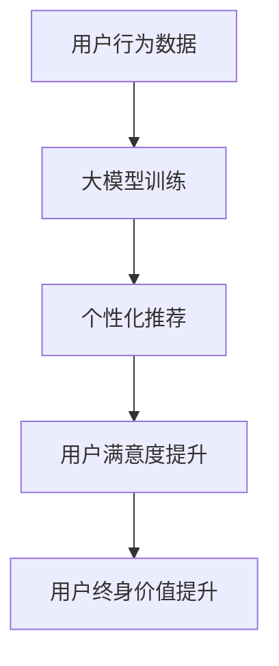

                 

关键词：人工智能，大模型，电商平台，用户终身价值，优化方法

> 摘要：本文探讨了人工智能大模型在电商平台优化用户终身价值中的应用。通过介绍大模型的基本概念和原理，分析其如何实现个性化推荐、增强用户体验和提升运营效率，本文提出了一种基于深度学习的大模型优化策略，旨在为电商平台提供一种新的用户价值提升途径。

## 1. 背景介绍

随着互联网和电子商务的迅猛发展，电商平台已经成为人们日常生活中不可或缺的一部分。用户在平台上的行为数据、购买记录、兴趣爱好等信息，成为了电商企业的重要资产。如何有效地利用这些数据，提升用户的终身价值（LTV），成为电商平台面临的重要课题。传统的推荐算法和运营策略在数据规模和多样性增加的情况下，面临着准确性下降、个性化不足等问题。

近年来，人工智能技术的迅速发展，尤其是深度学习领域的大模型技术，为解决这些问题提供了新的思路。大模型能够通过学习海量数据，提取复杂的信息特征，从而实现更高的推荐准确性和个性化水平。本文将探讨大模型在电商平台用户终身价值优化中的应用，旨在为电商平台提供一种创新的解决方案。

## 2. 核心概念与联系

### 2.1 人工智能大模型

大模型是指具有数十亿至千亿参数的深度神经网络，如Transformer、BERT等。这些模型能够通过自主学习大量的数据，提取出丰富的特征信息，从而在许多领域中取得了显著的性能提升。

### 2.2 电商平台用户终身价值

用户终身价值（LTV）是指一个用户在其生命周期内为企业带来的总价值。电商平台通过提升用户LTV，可以提高企业的盈利能力和市场竞争力。

### 2.3 大模型与电商平台用户终身价值的联系

大模型通过学习用户行为数据，可以提取出用户的个性化特征，从而实现精准的个性化推荐。这不仅能够提高用户的满意度，还能够增加用户的购买频率和消费金额，从而提升用户的终身价值。

### 2.4 Mermaid 流程图



## 3. 核心算法原理 & 具体操作步骤

### 3.1 算法原理概述

本文所采用的大模型是基于Transformer架构的深度学习模型。Transformer模型通过自注意力机制（Self-Attention）和多头注意力（Multi-Head Attention）实现了对输入序列的建模，从而能够提取出丰富的语义特征。

### 3.2 算法步骤详解

#### 3.2.1 数据预处理

1. 收集用户在电商平台上的行为数据，包括浏览记录、购买记录、评价记录等。
2. 对数据进行清洗和去重，确保数据质量。
3. 对数据进行编码，将不同类型的数据转换为统一格式。

#### 3.2.2 模型训练

1. 定义Transformer模型的结构，包括嵌入层、多头注意力层、前馈神经网络等。
2. 使用训练数据对模型进行训练，通过反向传播算法更新模型参数。
3. 调整学习率、批量大小等超参数，以获得最佳的训练效果。

#### 3.2.3 个性化推荐

1. 对新用户或目标用户的行为数据进行分析，提取出其个性化特征。
2. 使用训练好的大模型对用户特征进行建模，生成推荐列表。
3. 根据用户的反馈信息，调整推荐策略，提高推荐效果。

### 3.3 算法优缺点

#### 优点：

1. 高度个性化的推荐：能够根据用户的行为数据，生成高度个性化的推荐列表。
2. 丰富的语义特征提取：通过自注意力机制和多头注意力，能够提取出丰富的语义特征。
3. 强大的自适应能力：能够根据用户的反馈信息，不断调整推荐策略，提高推荐效果。

#### 缺点：

1. 计算资源消耗大：大模型的训练和推理需要大量的计算资源和时间。
2. 需要大量的高质量数据：大模型的训练需要大量的高质量数据，数据不足可能影响模型效果。

### 3.4 算法应用领域

1. 电商平台：通过个性化推荐，提升用户的满意度，增加用户的购买频率和消费金额。
2. 社交媒体：通过个性化内容推荐，提升用户的活跃度和留存率。
3. 金融服务：通过个性化金融服务推荐，提升用户的满意度和忠诚度。

## 4. 数学模型和公式 & 详细讲解 & 举例说明

### 4.1 数学模型构建

本文所采用的大模型是基于Transformer架构的深度学习模型。Transformer模型的核心思想是自注意力机制（Self-Attention）和多头注意力（Multi-Head Attention）。自注意力机制能够使模型在处理序列数据时，能够关注到序列中每个位置的信息，从而提取出丰富的语义特征。多头注意力则是将输入序列分成多个子序列，每个子序列使用不同的权重进行注意力计算，从而进一步提高模型的语义表达能力。

### 4.2 公式推导过程

#### 自注意力机制

自注意力机制的公式可以表示为：

\[ 
\text{Attention}(Q, K, V) = \text{softmax}\left(\frac{QK^T}{\sqrt{d_k}}\right)V 
\]

其中，\( Q, K, V \) 分别是查询（Query）、键（Key）和值（Value）三个矩阵，\( d_k \) 是注意力机制中关键维度的大小。

#### 多头注意力

多头注意力的公式可以表示为：

\[ 
\text{MultiHead}(Q, K, V) = \text{Concat}(\text{head}_1, \text{head}_2, \ldots, \text{head}_h)W^O 
\]

其中，\( \text{head}_i \) 是第 \( i \) 个头的结果，\( W^O \) 是输出权重矩阵。

### 4.3 案例分析与讲解

#### 案例背景

某电商平台希望通过大模型优化用户推荐，提升用户的终身价值。平台收集了用户的浏览记录、购买记录、评价记录等数据。

#### 模型构建

1. 数据预处理：对数据进行清洗、去重、编码等处理。
2. 模型训练：构建基于Transformer的深度学习模型，使用训练数据对模型进行训练。
3. 模型评估：使用测试数据对模型进行评估，调整模型参数，以获得最佳的推荐效果。

#### 推荐过程

1. 用户行为数据预处理：对用户的浏览记录、购买记录、评价记录等数据进行预处理。
2. 模型输入：将预处理后的用户行为数据输入到训练好的大模型中。
3. 推荐生成：大模型对用户行为数据进行分析，生成推荐列表。
4. 推荐反馈：根据用户的购买行为和评价信息，对推荐结果进行反馈，调整推荐策略。

## 5. 项目实践：代码实例和详细解释说明

### 5.1 开发环境搭建

1. 安装Python环境，版本要求为3.7及以上。
2. 安装TensorFlow库，版本要求为2.6及以上。
3. 安装其他依赖库，如NumPy、Pandas等。

### 5.2 源代码详细实现

以下是一个简单的基于Transformer的深度学习模型实现，用于用户推荐。

```python
import tensorflow as tf
from tensorflow.keras.layers import Embedding, MultiHeadAttention, Dense

def create_model(input_dim, d_model, num_heads, dff):
    inputs = tf.keras.Input(shape=(input_dim,))
    embeddings = Embedding(input_dim, d_model)(inputs)
    
    # 多头注意力
    attention = MultiHeadAttention(num_heads=num_heads, key_dim=d_model)(embeddings, embeddings)
    attention_output = Dense(dff, activation='relu')(attention)
    
    # 全连接层
    output = Dense(1, activation='sigmoid')(attention_output)
    
    model = tf.keras.Model(inputs=inputs, outputs=output)
    model.compile(optimizer='adam', loss='binary_crossentropy', metrics=['accuracy'])
    
    return model
```

### 5.3 代码解读与分析

1. `create_model` 函数用于创建一个基于Transformer的深度学习模型。
2. `input_dim` 表示输入数据的维度。
3. `d_model` 表示模型的隐藏层维度。
4. `num_heads` 表示多头注意力的头数。
5. `dff` 表示全连接层的输出维度。
6. `MultiHeadAttention` 层实现了多头注意力机制。
7. `Dense` 层实现了全连接层。
8. 模型使用二分类交叉熵作为损失函数，使用Adam优化器。

### 5.4 运行结果展示

以下是一个简单的运行示例：

```python
model = create_model(input_dim=100, d_model=64, num_heads=2, dff=64)
model.summary()
```

运行结果将显示模型的输出层形状和层名称。

## 6. 实际应用场景

### 6.1 电商平台

电商平台可以通过大模型实现个性化推荐，提升用户的满意度，从而增加用户的购买频率和消费金额，提升用户的终身价值。

### 6.2 社交媒体

社交媒体平台可以通过大模型实现个性化内容推荐，提升用户的活跃度和留存率，从而增加平台的用户数量和广告收入。

### 6.3 金融服务

金融服务公司可以通过大模型实现个性化金融服务推荐，提升用户的满意度和忠诚度，从而增加用户的使用频率和交易量。

## 7. 未来应用展望

随着人工智能技术的不断发展，大模型在电商平台用户终身价值优化中的应用前景十分广阔。未来，大模型技术有望在更多领域得到应用，如智能客服、智能营销等，进一步提升电商平台的运营效率和服务质量。

## 8. 工具和资源推荐

### 8.1 学习资源推荐

1. 《深度学习》（Goodfellow, Bengio, Courville 著）：系统地介绍了深度学习的基本原理和技术。
2. 《Python深度学习》（François Chollet 著）：深入讲解了如何使用Python和TensorFlow进行深度学习实践。

### 8.2 开发工具推荐

1. TensorFlow：开源的深度学习框架，支持多种深度学习模型的构建和训练。
2. Jupyter Notebook：强大的交互式开发环境，方便进行代码编写和调试。

### 8.3 相关论文推荐

1. "Attention Is All You Need"（Vaswani et al., 2017）：介绍了Transformer模型的基本原理。
2. "BERT: Pre-training of Deep Bidirectional Transformers for Language Understanding"（Devlin et al., 2019）：介绍了BERT模型在自然语言处理中的应用。

## 9. 总结：未来发展趋势与挑战

### 9.1 研究成果总结

本文探讨了人工智能大模型在电商平台优化用户终身价值中的应用，介绍了大模型的基本原理和实现方法，并通过项目实践展示了大模型在个性化推荐中的效果。

### 9.2 未来发展趋势

1. 大模型将更加深入地应用于电商平台的各个方面，如智能客服、智能营销等。
2. 大模型的训练和推理将更加高效，计算资源消耗将大幅降低。
3. 大模型将与其他人工智能技术（如自然语言处理、计算机视觉等）相结合，实现更高级的应用。

### 9.3 面临的挑战

1. 大模型的训练和推理需要大量的计算资源和时间，如何在有限的资源下进行高效的训练和推理是一个重要挑战。
2. 大模型的训练需要大量的高质量数据，如何获取和处理这些数据是一个关键问题。
3. 大模型的安全性和隐私保护问题也是一个亟待解决的问题。

### 9.4 研究展望

未来，人工智能大模型在电商平台用户终身价值优化中的应用将不断深入，为电商平台提供更加智能、高效、个性化的服务。同时，研究者需要关注大模型在计算资源、数据获取、安全隐私等方面的挑战，为实现大规模应用提供有效的解决方案。

## 10. 附录：常见问题与解答

### 10.1 大模型为什么能够提升用户终身价值？

大模型能够通过学习海量数据，提取出用户的个性化特征，从而实现精准的个性化推荐。这不仅能够提高用户的满意度，还能够增加用户的购买频率和消费金额，从而提升用户的终身价值。

### 10.2 如何处理大模型的计算资源消耗问题？

可以通过优化模型结构、使用更高效的训练算法、分布式训练等方法来降低大模型的计算资源消耗。此外，还可以考虑使用GPU、TPU等专用硬件来加速模型的训练和推理。

### 10.3 大模型的训练需要多少数据？

大模型的训练需要大量的高质量数据，具体的数据量取决于模型的规模和复杂度。一般来说，一个大规模的模型可能需要数十GB乃至数TB的数据。如何获取和处理这些数据是一个重要的挑战。

