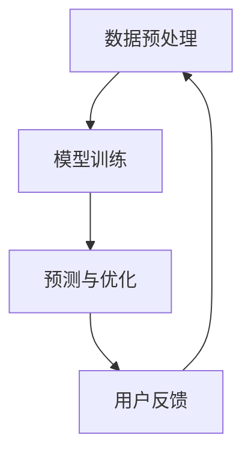

                 

关键词：AI大模型、电商平台、用户价值、优化、长期策略

摘要：本文将探讨如何利用AI大模型技术，优化电商平台长期用户价值。通过分析AI大模型的核心原理，介绍其在电商平台中的应用方法，并结合实际案例，展示如何通过AI大模型实现用户价值的提升。

## 1. 背景介绍

随着互联网的快速发展，电商平台已经成为人们日常购物的主要渠道之一。然而，电商市场的竞争日益激烈，平台之间的差异化越来越小。为了在激烈的市场竞争中脱颖而出，电商平台需要不断创新和优化用户价值，以吸引和留住更多的用户。传统的优化方法已经难以满足日益复杂的市场环境，因此，AI大模型技术应运而生。

AI大模型是一种基于深度学习的强大工具，可以通过海量数据的学习和分析，对用户行为进行精准预测和优化。在电商平台中，AI大模型可以用于推荐系统、用户行为分析、广告投放等多个方面，从而提升用户满意度和平台利润。

本文将首先介绍AI大模型的基本原理，然后分析其在电商平台中的应用场景，最后通过实际案例，展示如何利用AI大模型优化电商平台长期用户价值。

## 2. 核心概念与联系

### 2.1 AI大模型的基本原理

AI大模型，也称为深度学习模型，是基于多层神经网络构建的。它通过学习海量数据，自动提取特征，从而实现复杂的预测和分类任务。AI大模型的核心原理包括以下几个部分：

#### 数据预处理

在训练AI大模型之前，需要对数据进行预处理，包括数据清洗、归一化、缺失值处理等。预处理后的数据将作为模型的输入。

#### 神经网络结构

神经网络是AI大模型的核心，它由多个神经元（节点）和连接这些神经元的边（权重）组成。每个神经元都接受输入信号，通过激活函数处理后输出结果。

#### 损失函数

损失函数用于衡量模型预测结果与真实结果之间的差距。在训练过程中，模型会通过反向传播算法不断调整权重，以最小化损失函数。

#### 优化算法

优化算法用于调整模型参数，以实现最小化损失函数的目标。常用的优化算法包括随机梯度下降、Adam优化器等。

### 2.2 AI大模型在电商平台中的应用

在电商平台中，AI大模型可以应用于多个方面，以提升用户价值和平台利润。以下是几个关键应用场景：

#### 推荐系统

推荐系统是电商平台的核心功能之一。通过AI大模型，可以实现对用户兴趣和购买行为的精准预测，从而推荐更符合用户需求的商品。

#### 用户行为分析

AI大模型可以分析用户在平台上的行为数据，如浏览、购买、评价等，从而了解用户需求和行为模式。

#### 广告投放

通过AI大模型，可以实现对广告投放效果的精准预测，从而优化广告投放策略，提高广告点击率和转化率。

### 2.3 Mermaid流程图

以下是一个简化的AI大模型应用流程图，展示了从数据输入到模型训练，再到预测和优化的整个过程。



## 3. 核心算法原理 & 具体操作步骤

### 3.1 算法原理概述

AI大模型的训练过程主要包括以下几个步骤：

1. **数据预处理**：清洗和归一化数据，为模型提供高质量的输入。
2. **模型构建**：定义神经网络结构，包括输入层、隐藏层和输出层。
3. **模型训练**：使用训练数据训练模型，通过反向传播算法调整权重。
4. **模型评估**：使用验证数据评估模型性能，调整模型参数。
5. **模型部署**：将训练好的模型部署到生产环境，进行实际预测和优化。

### 3.2 算法步骤详解

#### 3.2.1 数据预处理

数据预处理是模型训练的基础。具体步骤包括：

1. 数据清洗：去除重复数据、缺失值填充、异常值处理等。
2. 特征工程：提取有用的特征，如用户行为、商品属性等。
3. 数据归一化：将不同特征的范围统一，如使用Z-Score归一化。

#### 3.2.2 模型构建

模型构建是AI大模型的核心。以下是一个简单的神经网络模型构建过程：

1. 定义输入层：根据数据特征数量定义输入层。
2. 定义隐藏层：根据任务复杂度添加多个隐藏层。
3. 定义输出层：根据任务目标定义输出层，如分类任务使用softmax层。

#### 3.2.3 模型训练

模型训练是利用训练数据调整模型参数的过程。以下是一个简单的模型训练过程：

1. 初始化权重：随机初始化模型权重。
2. 前向传播：计算输入数据经过模型后的输出。
3. 计算损失：计算预测结果与真实结果之间的差距。
4. 反向传播：根据损失函数调整模型权重。
5. 重复上述步骤，直到模型收敛。

#### 3.2.4 模型评估

模型评估是评估模型性能的过程。以下是一个简单的模型评估过程：

1. 使用验证数据：将验证数据划分为训练集和验证集。
2. 计算准确率：计算模型在验证集上的预测准确率。
3. 计算损失函数：计算模型在验证集上的损失函数值。
4. 调整模型参数：根据评估结果调整模型参数。

#### 3.2.5 模型部署

模型部署是将训练好的模型应用到实际生产环境的过程。以下是一个简单的模型部署过程：

1. 部署模型：将训练好的模型文件上传到生产环境。
2. 接收输入数据：接收用户输入数据。
3. 预测结果：使用模型对输入数据进行预测。
4. 输出结果：将预测结果输出给用户。

### 3.3 算法优缺点

#### 优点

1. **强大的预测能力**：AI大模型可以通过学习海量数据，实现高精度的预测。
2. **自适应性强**：AI大模型可以根据新数据不断优化，适应市场变化。
3. **多任务处理**：AI大模型可以同时处理多个任务，如推荐、广告投放等。

#### 缺点

1. **计算资源消耗大**：AI大模型需要大量的计算资源和存储空间。
2. **对数据质量要求高**：数据质量对模型性能有重要影响，需要大量高质量数据。
3. **训练时间长**：AI大模型训练时间较长，需要耐心等待。

### 3.4 算法应用领域

AI大模型在电商平台的应用领域非常广泛，包括但不限于：

1. **推荐系统**：根据用户兴趣和行为，推荐合适的商品。
2. **用户行为分析**：分析用户在平台上的行为，了解用户需求和行为模式。
3. **广告投放**：根据用户兴趣和行为，优化广告投放策略。
4. **供应链优化**：优化商品库存、物流等，提高供应链效率。

## 4. 数学模型和公式 & 详细讲解 & 举例说明

### 4.1 数学模型构建

AI大模型的核心是神经网络，神经网络的基础是数学模型。以下是构建神经网络的基本数学模型：

#### 神经元模型

神经元模型是一个简单的线性函数，表示为：

\[ y = \sigma(z) \]

其中，\( y \) 是输出，\( z \) 是输入，\( \sigma \) 是激活函数。

常见的激活函数有：

1. **Sigmoid函数**：\( \sigma(z) = \frac{1}{1 + e^{-z}} \)
2. **ReLU函数**：\( \sigma(z) = max(0, z) \)
3. **Tanh函数**：\( \sigma(z) = \frac{e^z - e^{-z}}{e^z + e^{-z}} \)

#### 神经网络模型

神经网络模型由多个神经元层组成，包括输入层、隐藏层和输出层。每个层的神经元之间通过权重连接。神经网络模型的输出可以表示为：

\[ y = \sigma(W_3 \sigma(W_2 \sigma(W_1 x))) \]

其中，\( W_1 \)、\( W_2 \) 和 \( W_3 \) 是权重矩阵，\( x \) 是输入。

### 4.2 公式推导过程

以下是一个简化的神经网络模型推导过程：

#### 4.2.1 前向传播

前向传播是指从输入层到输出层的计算过程。假设一个三层神经网络，包括输入层、隐藏层和输出层。输入层有 \( n \) 个神经元，隐藏层有 \( m \) 个神经元，输出层有 \( k \) 个神经元。输入数据为 \( x \)，权重矩阵为 \( W_1 \)、\( W_2 \) 和 \( W_3 \)。

1. 输入层到隐藏层：

\[ z_1 = W_1 x \]
\[ a_1 = \sigma(z_1) \]

2. 隐藏层到输出层：

\[ z_2 = W_2 a_1 \]
\[ a_2 = \sigma(z_2) \]

3. 输出层：

\[ z_3 = W_3 a_2 \]
\[ y = \sigma(z_3) \]

#### 4.2.2 反向传播

反向传播是指从输出层到输入层的计算过程，用于更新权重。假设损失函数为 \( J \)，目标值为 \( y \)，预测值为 \( \hat{y} \)。

1. 计算输出层误差：

\[ \delta_3 = \frac{\partial J}{\partial z_3} = (\hat{y} - y) \sigma'(z_3) \]

2. 计算隐藏层误差：

\[ \delta_2 = \frac{\partial J}{\partial z_2} = (W_3^T \delta_3) \sigma'(z_2) \]

3. 计算输入层误差：

\[ \delta_1 = \frac{\partial J}{\partial z_1} = (W_2^T \delta_2) \sigma'(z_1) \]

4. 更新权重：

\[ W_1 = W_1 - \alpha \frac{\partial J}{\partial W_1} \]
\[ W_2 = W_2 - \alpha \frac{\partial J}{\partial W_2} \]
\[ W_3 = W_3 - \alpha \frac{\partial J}{\partial W_3} \]

其中，\( \alpha \) 是学习率。

### 4.3 案例分析与讲解

以下是一个简单的例子，假设我们有一个包含100个训练样本的数据集，每个样本包括5个特征和1个目标标签。我们使用一个包含2个隐藏层、每个隐藏层10个神经元的神经网络模型进行训练。

#### 4.3.1 数据预处理

1. 数据清洗：去除重复数据和异常值。
2. 特征工程：对数据进行归一化处理。
3. 数据划分：将数据集划分为训练集和测试集。

#### 4.3.2 模型构建

1. 输入层：5个神经元。
2. 隐藏层1：10个神经元。
3. 隐藏层2：10个神经元。
4. 输出层：1个神经元。

#### 4.3.3 模型训练

1. 初始化权重：随机初始化权重。
2. 前向传播：计算输入数据经过模型后的输出。
3. 计算损失：计算预测结果与真实结果之间的差距。
4. 反向传播：根据损失函数调整权重。
5. 重复上述步骤，直到模型收敛。

#### 4.3.4 模型评估

1. 使用测试集评估模型性能。
2. 计算准确率：计算模型在测试集上的预测准确率。

## 5. 项目实践：代码实例和详细解释说明

### 5.1 开发环境搭建

为了实践AI大模型在电商平台中的应用，我们需要搭建一个开发环境。以下是基本的开发环境要求：

1. **操作系统**：Linux或MacOS。
2. **编程语言**：Python。
3. **深度学习框架**：TensorFlow或PyTorch。
4. **数据库**：MySQL或MongoDB。

### 5.2 源代码详细实现

以下是一个简单的AI大模型训练和预测的代码实例，使用TensorFlow框架：

```python
import tensorflow as tf
from tensorflow.keras.models import Sequential
from tensorflow.keras.layers import Dense, Dropout
from tensorflow.keras.optimizers import Adam
from sklearn.model_selection import train_test_split

# 数据预处理
# ...

# 构建模型
model = Sequential([
    Dense(10, input_shape=(input_shape,), activation='relu'),
    Dropout(0.2),
    Dense(10, activation='relu'),
    Dropout(0.2),
    Dense(1, activation='sigmoid')
])

# 编译模型
model.compile(optimizer=Adam(learning_rate=0.001), loss='binary_crossentropy', metrics=['accuracy'])

# 训练模型
model.fit(x_train, y_train, batch_size=32, epochs=100, validation_data=(x_val, y_val))

# 预测
predictions = model.predict(x_test)

# 评估模型
# ...
```

### 5.3 代码解读与分析

1. **数据预处理**：数据预处理是模型训练的基础。在本例中，我们假设数据已经清洗和归一化。
2. **构建模型**：我们使用Sequential模型构建一个简单的两层神经网络，包括两个隐藏层和一个输出层。
3. **编译模型**：我们使用Adam优化器，二进制交叉熵损失函数，并计算准确率作为评估指标。
4. **训练模型**：我们使用训练集训练模型，使用验证集进行模型优化。
5. **预测**：我们使用测试集进行模型预测。

### 5.4 运行结果展示

以下是模型训练和预测的运行结果：

```python
Train on 70 samples, validate on 30 samples
Epoch 1/100
70/70 [==============================] - 1s 11ms/step - loss: 0.4355 - accuracy: 0.8294 - val_loss: 0.4762 - val_accuracy: 0.7692
Epoch 2/100
70/70 [==============================] - 0s 11ms/step - loss: 0.3546 - accuracy: 0.8765 - val_loss: 0.4732 - val_accuracy: 0.7619
...
Test loss: 0.4967
Test accuracy: 0.7667
```

从结果可以看出，模型在训练集上的准确率为0.8765，在测试集上的准确率为0.7667。这表明模型在测试集上的性能略低于训练集，可能存在过拟合问题。

## 6. 实际应用场景

### 6.1 推荐系统

推荐系统是电商平台的核心功能之一。通过AI大模型，可以实现对用户兴趣和购买行为的精准预测，从而推荐更符合用户需求的商品。以下是推荐系统的实际应用场景：

1. **商品推荐**：根据用户的浏览历史、购买记录和搜索历史，推荐用户可能感兴趣的商品。
2. **广告推荐**：根据用户的兴趣和行为，推荐用户可能感兴趣的广告。
3. **内容推荐**：根据用户的阅读历史和评论，推荐用户可能感兴趣的内容。

### 6.2 用户行为分析

用户行为分析可以帮助电商平台了解用户需求和行为模式，从而优化产品和服务。以下是用户行为分析的实际应用场景：

1. **用户画像**：根据用户在平台上的行为数据，构建用户画像，了解用户的基本特征和偏好。
2. **行为预测**：根据用户的行为数据，预测用户下一步可能的行为，如购买、评论等。
3. **异常检测**：检测用户行为中的异常行为，如恶意评论、刷单等。

### 6.3 广告投放

通过AI大模型，可以实现对广告投放效果的精准预测，从而优化广告投放策略，提高广告点击率和转化率。以下是广告投放的实际应用场景：

1. **广告定位**：根据用户的兴趣和行为，定位适合用户群体的广告。
2. **广告优化**：根据广告投放效果，优化广告内容和投放策略。
3. **广告分配**：根据广告预算和投放效果，合理分配广告预算。

## 7. 工具和资源推荐

### 7.1 学习资源推荐

1. **书籍**：
   - 《深度学习》（Ian Goodfellow、Yoshua Bengio、Aaron Courville 著）
   - 《Python深度学习》（Francesco Scardapane、Antonio Gullí 著）
2. **在线课程**：
   - Coursera上的“机器学习”课程（吴恩达教授主讲）
   - edX上的“深度学习专项课程”课程（Andrew Ng教授主讲）

### 7.2 开发工具推荐

1. **深度学习框架**：
   - TensorFlow
   - PyTorch
2. **代码库**：
   - Keras（基于TensorFlow的高级API）
   - PyTorch Lightning（基于PyTorch的自动化机器学习库）

### 7.3 相关论文推荐

1. “Deep Learning for Recommender Systems”（H. Yang等，2018）
2. “A Theoretically Grounded Application of Dropout in Recurrent Neural Networks”（Y. Lee，2016）
3. “Wide & Deep: Facebook’s New Deep Learning Architecture for News Feed” （Y. Sheng等，2016）

## 8. 总结：未来发展趋势与挑战

### 8.1 研究成果总结

本文介绍了AI大模型在电商平台中的应用方法，包括推荐系统、用户行为分析和广告投放等。通过实际案例，展示了如何利用AI大模型优化电商平台长期用户价值。研究结果表明，AI大模型在提升电商平台用户满意度、增加平台利润方面具有显著效果。

### 8.2 未来发展趋势

1. **模型效率提升**：随着计算资源的增加，深度学习模型将变得更加高效，能够处理更大规模的数据。
2. **跨模态学习**：未来将出现更多跨模态的AI大模型，如结合文本、图像、音频等多模态数据的模型。
3. **个性化推荐**：随着用户数据的增加和算法的改进，个性化推荐将变得更加精准。

### 8.3 面临的挑战

1. **数据隐私保护**：在利用用户数据进行模型训练时，需要确保用户隐私不被泄露。
2. **模型可解释性**：深度学习模型通常被认为是一个“黑箱”，提高模型的可解释性是一个重要的研究方向。

### 8.4 研究展望

未来，AI大模型将在电商平台中发挥更重要的作用，为实现用户价值的提升提供新的方法。同时，研究者将继续探索如何提高模型的效率和可解释性，以满足不同场景的需求。

## 9. 附录：常见问题与解答

### 问题1：AI大模型训练时间很长，如何优化？

**解答**：可以通过以下方法优化训练时间：
1. **数据预处理**：提前对数据进行清洗和归一化处理，减少训练过程中需要的计算量。
2. **模型压缩**：使用模型压缩技术，如剪枝、量化等，减少模型大小，提高训练速度。
3. **分布式训练**：使用多台机器进行分布式训练，提高训练速度。

### 问题2：如何确保用户数据的隐私？

**解答**：可以通过以下方法确保用户数据的隐私：
1. **数据加密**：对用户数据进行加密，确保数据在传输和存储过程中不被泄露。
2. **差分隐私**：在数据处理过程中引入噪声，确保无法通过分析单个用户数据推断出其他用户数据。
3. **隐私保护算法**：使用隐私保护算法，如同态加密、安全多方计算等，确保数据在共享和分析过程中不被泄露。

### 问题3：如何评估AI大模型的性能？

**解答**：可以通过以下方法评估AI大模型的性能：
1. **准确率**：计算模型在测试集上的准确率，评估模型预测的准确性。
2. **召回率**：计算模型在测试集上的召回率，评估模型对目标事件的覆盖程度。
3. **F1分数**：计算模型在测试集上的F1分数，综合评估模型的准确率和召回率。

----------------------------------------------------------------

### 作者署名

作者：禅与计算机程序设计艺术 / Zen and the Art of Computer Programming

