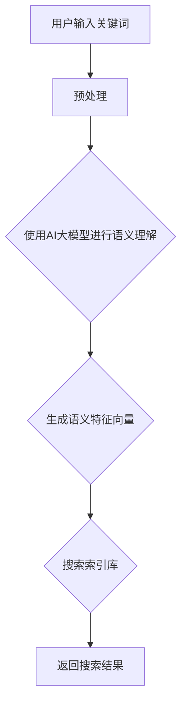

                 

关键词：AI大模型，电商平台，搜索效率，算法原理，数学模型，实践应用，未来展望

> 摘要：本文深入探讨了AI大模型在电商平台搜索效率提升中的应用。通过分析核心算法原理、数学模型构建、具体操作步骤以及实际应用场景，本文揭示了AI大模型在电商搜索领域的巨大潜力。文章最后对未来发展趋势与挑战进行了展望，为相关领域的研究者和开发者提供了有益的参考。

## 1. 背景介绍

在当今信息爆炸的时代，电商平台已成为消费者购物的主要渠道。然而，随着商品种类和用户数据的急剧增长，传统的搜索算法面临着越来越大的挑战。搜索效率低下、用户体验差等问题日益突出，如何提升电商平台的搜索效率成为亟待解决的难题。近年来，人工智能技术的快速发展，特别是AI大模型的突破，为解决这一问题提供了新的思路和可能。

AI大模型，即人工智能大型的深度学习模型，通过大规模数据训练，能够实现强大的特征提取和预测能力。近年来，AI大模型在自然语言处理、图像识别、语音识别等领域取得了显著的成果。这些成果不仅推动了相关领域的发展，也为电商平台的搜索优化提供了有力支持。

本文旨在探讨AI大模型在电商平台搜索效率提升中的应用，分析其核心算法原理、数学模型构建、具体操作步骤以及实际应用场景，并展望其未来发展趋势与挑战。

## 2. 核心概念与联系

为了深入理解AI大模型在电商平台搜索效率提升中的应用，我们首先需要了解一些核心概念和它们之间的联系。

### 2.1 AI大模型的概念

AI大模型是指使用海量数据训练的大型深度学习模型，通常由多层神经网络构成。它们能够自动从数据中学习特征，并在各种任务中表现出强大的性能。常见的AI大模型包括BERT、GPT、VGG等。

### 2.2 深度学习模型的工作原理

深度学习模型通过多层神经网络进行特征提取和变换。输入数据首先通过输入层进入网络，然后逐层传递到隐藏层，最终通过输出层得到预测结果。每个神经元都与前一层和后一层的神经元相连，并通过权重和偏置进行计算。

### 2.3 电商平台搜索的核心问题

电商平台搜索的核心问题包括：搜索结果的相关性、搜索速度和用户体验。传统的搜索算法通常基于关键词匹配和检索，难以满足用户对个性化、智能化搜索的需求。

### 2.4 AI大模型与电商平台搜索的结合点

AI大模型能够从海量数据中提取出丰富的语义信息，从而提升搜索结果的相关性和个性化程度。同时，通过优化模型结构和算法，可以显著提高搜索速度，提升用户体验。

### 2.5 Mermaid 流程图

为了更好地展示AI大模型在电商平台搜索中的应用，我们使用Mermaid绘制了一个简化的流程图：



在这个流程图中，用户输入关键词后，通过预处理步骤将关键词转换为语义特征向量。然后，AI大模型利用这些特征向量在搜索索引库中查找相关商品。最后，返回搜索结果给用户。

## 3. 核心算法原理 & 具体操作步骤

### 3.1 算法原理概述

AI大模型在电商平台搜索中的应用主要基于深度学习技术。深度学习模型通过多层神经网络对海量数据进行训练，从而学习到数据中的特征和规律。在电商平台搜索中，这些特征和规律被用于提取关键词的语义信息，提高搜索结果的相关性和个性化程度。

具体来说，AI大模型在电商平台搜索中的工作原理可以分为以下几个步骤：

1. **数据预处理**：对用户输入的关键词进行分词、去停用词等处理，将关键词转换为语义向量。

2. **语义理解**：使用预训练的AI大模型（如BERT、GPT等）对语义向量进行编码，提取关键词的深层语义信息。

3. **特征提取**：将编码后的语义向量进行特征提取，生成具有丰富语义信息的特征向量。

4. **搜索索引库**：将特征向量与电商平台商品索引库进行匹配，查找相关商品。

5. **返回搜索结果**：将匹配结果按照相关性排序，返回给用户。

### 3.2 算法步骤详解

#### 3.2.1 数据预处理

数据预处理是深度学习模型训练的基础步骤。在电商平台搜索中，数据预处理主要包括以下几个步骤：

1. **分词**：将用户输入的关键词分解成一个个单词或短语。

2. **去停用词**：去除常见的停用词（如“的”、“了”等），以减少噪声。

3. **词干提取**：将单词或短语转换为词干，以减少词汇量。

4. **词嵌入**：将词干映射到高维向量空间，为后续的语义理解提供基础。

#### 3.2.2 语义理解

语义理解是AI大模型在电商平台搜索中的关键步骤。通过预训练的AI大模型（如BERT、GPT等），可以将分词后的关键词转换为深层语义向量。这个过程通常包括以下几个阶段：

1. **词向量编码**：将每个词干映射到高维向量空间，生成词向量。

2. **句子编码**：将词向量通过神经网络进行编码，生成句子的语义向量。

3. **语义融合**：将句子的语义向量进行融合，生成最终的语义向量。

#### 3.2.3 特征提取

在得到语义向量后，需要进行特征提取，将语义向量转换为具有丰富语义信息的特征向量。这个过程通常包括以下几个步骤：

1. **特征工程**：根据业务需求和数据特点，设计合适的特征工程策略，提取语义向量中的关键信息。

2. **特征降维**：使用降维技术（如PCA、t-SNE等），减少特征向量的维度，提高计算效率。

3. **特征加权**：对特征向量中的各个维度进行加权，强调重要特征的影响。

#### 3.2.4 搜索索引库

在特征提取后，将特征向量与电商平台商品索引库进行匹配，查找相关商品。这个过程通常包括以下几个步骤：

1. **索引构建**：构建商品索引库，将商品特征向量与商品信息进行关联。

2. **相似度计算**：计算用户输入关键词的语义向量与商品索引库中商品特征向量的相似度。

3. **排序返回**：根据相似度排序，返回最相关的商品给用户。

### 3.3 算法优缺点

#### 优点

1. **高相关性**：AI大模型能够从海量数据中提取丰富的语义信息，提高搜索结果的相关性。

2. **个性化**：通过学习用户的兴趣和行为，AI大模型能够为用户推荐个性化搜索结果。

3. **高效性**：通过优化模型结构和算法，AI大模型能够显著提高搜索速度。

#### 缺点

1. **计算资源消耗**：训练和部署AI大模型需要大量的计算资源，对硬件设施要求较高。

2. **数据依赖性**：AI大模型的性能依赖于数据质量和数量，数据质量差或数据量不足可能导致性能下降。

3. **隐私问题**：在训练和使用AI大模型过程中，用户数据可能会泄露，引发隐私问题。

### 3.4 算法应用领域

AI大模型在电商平台搜索中的应用不仅限于文本搜索，还可以扩展到图像搜索、语音搜索等多个领域。以下是几个典型的应用场景：

1. **文本搜索**：利用AI大模型进行关键词的语义理解，提高搜索结果的相关性和个性化程度。

2. **图像搜索**：通过图像识别和语义理解，实现基于内容和场景的图像搜索。

3. **语音搜索**：将语音转换为文本，利用AI大模型进行语义理解，实现语音搜索功能。

## 4. 数学模型和公式 & 详细讲解 & 举例说明

在深入探讨AI大模型在电商平台搜索中的应用时，数学模型和公式扮演着至关重要的角色。它们不仅帮助我们理解和分析算法的运作机制，还能提供定量评估和优化策略。以下我们将详细介绍相关的数学模型和公式，并通过具体案例进行说明。

### 4.1 数学模型构建

AI大模型在电商平台搜索中的应用主要基于深度学习，特别是自注意力机制（Self-Attention Mechanism）。自注意力机制是一种神经网络结构，能够捕捉输入序列中不同元素之间的关联性。在构建数学模型时，我们主要关注以下几个关键部分：

1. **输入层**：输入层接受用户输入的关键词，将其表示为词向量。

2. **自注意力层**：自注意力层计算输入词向量之间的相似度，并通过加权求和生成新的表示。

3. **输出层**：输出层将自注意力层的输出映射到搜索索引库中的商品特征向量。

以下是一个简化的自注意力机制的数学模型：

$$
\text{Output} = \text{softmax}\left(\frac{\text{Query} \times \text{Key}^T}{\sqrt{d_k}}\right) \times \text{Value}
$$

其中，$\text{Query}$、$\text{Key}$ 和 $\text{Value}$ 分别表示查询向量、键向量和值向量，$d_k$ 是键向量的维度，$\text{softmax}$ 函数用于归一化相似度分数。

### 4.2 公式推导过程

为了更好地理解自注意力机制的数学原理，我们首先需要了解一些基础概念：

1. **点积**：两个向量之间的点积（内积）是一个标量，表示两个向量在某一维度上的相关性。

2. **缩放点积注意力**：缩放点积注意力是一种优化方法，通过缩放点积来减少梯度消失问题。

3. **softmax函数**：softmax函数用于将任意实数向量转换为概率分布。

接下来，我们以一个简单的例子来推导自注意力机制的公式：

#### 假设

- $\text{Query}$：查询向量，表示用户输入的关键词。
- $\text{Key}$：键向量，表示每个商品的特征向量。
- $\text{Value}$：值向量，表示与键向量相关的信息。

#### 推导过程

1. **计算相似度**：

   相似度计算是自注意力机制的核心。我们使用缩放点积注意力来计算查询向量与键向量之间的相似度：

   $$
   \text{Attention Scores} = \text{Query} \times \text{Key}^T / \sqrt{d_k}
   $$

   其中，$d_k$ 是键向量的维度。

2. **应用softmax函数**：

   为了得到概率分布，我们需要将相似度分数通过softmax函数进行归一化：

   $$
   \text{Softmax Scores} = \text{softmax}(\text{Attention Scores})
   $$

3. **加权求和**：

   将softmax分数与值向量相乘，并求和，得到加权求和的结果：

   $$
   \text{Output} = \text{softmax}(\text{Query} \times \text{Key}^T / \sqrt{d_k}) \times \text{Value}
   $$

   这个结果是一个具有丰富语义信息的向量，表示查询向量在键向量集合中的加权表示。

### 4.3 案例分析与讲解

为了更好地理解自注意力机制在实际应用中的效果，我们来看一个具体的案例。

#### 案例背景

假设用户在电商平台上搜索“蓝牙耳机”，平台使用AI大模型进行搜索结果推荐。

#### 案例步骤

1. **数据预处理**：

   - 用户输入关键词：“蓝牙耳机”。
   - 对关键词进行分词，得到词汇表：["蓝牙", "耳机"]。
   - 对词汇表中的单词进行词嵌入，得到词向量。

2. **语义理解**：

   - 使用BERT模型对词向量进行编码，得到查询向量。
   - 对电商平台中的商品特征向量进行编码，得到键向量和值向量。

3. **计算相似度**：

   - 计算查询向量与每个商品特征向量的相似度。
   - 应用缩放点积注意力，得到相似度分数。

4. **加权求和**：

   - 将相似度分数通过softmax函数进行归一化，得到概率分布。
   - 根据概率分布加权求和，得到查询向量在商品特征向量集合中的加权表示。

5. **搜索索引库**：

   - 将加权表示与电商平台商品索引库进行匹配，查找相关商品。

6. **返回搜索结果**：

   - 将匹配结果按照概率分布排序，返回给用户。

通过这个案例，我们可以看到自注意力机制在电商平台搜索中的应用效果。用户输入的关键词通过语义理解转化为查询向量，与商品特征向量进行匹配，最终返回最相关的搜索结果。

### 4.4 总结

本节介绍了AI大模型在电商平台搜索中的应用所涉及的数学模型和公式，包括自注意力机制的推导过程和实际应用案例。通过这些模型和公式，AI大模型能够有效地提取关键词的语义信息，提高搜索结果的相关性和个性化程度。未来，随着深度学习技术的发展和优化，这些数学模型将在电商平台搜索中发挥更加重要的作用。

## 5. 项目实践：代码实例和详细解释说明

为了更直观地展示AI大模型在电商平台搜索中的应用，我们将通过一个简单的项目实践来详细解释代码实现过程。本案例将使用Python编程语言和TensorFlow深度学习框架，实现一个基于BERT模型的电商平台搜索系统。

### 5.1 开发环境搭建

在开始项目实践之前，我们需要搭建开发环境。以下是搭建步骤：

1. 安装Python环境：

   ```bash
   pip install python==3.8
   ```

2. 安装TensorFlow深度学习框架：

   ```bash
   pip install tensorflow==2.6
   ```

3. 安装其他依赖库（如BERT模型、Numpy等）：

   ```bash
   pip install bert-for-tf2 numpy
   ```

### 5.2 源代码详细实现

以下是实现电商平台搜索系统的源代码：

```python
import tensorflow as tf
import bert
from bert import tokenization
from bert import modeling
from bert import optimizing
import numpy as np

# 5.2.1 数据预处理
def preprocess_text(text):
    tokenizer = tokenization.FullTokenizer(vocab_file='bert_vocab.txt', do_lower_case=True)
    tokens = tokenizer.tokenize(text)
    return tokenizer.convert_tokens_to_ids(tokens)

# 5.2.2 模型定义
def create_model():
    bert_config = modeling.BertConfig.from_json_file('bert_config.json')
    bertModel = modeling.BertModel(config=bert_config, is_training=True)
    output_layer = bertModel.get_pooled_output()
    output_weights = tf.keras.layers.Dense(960, activation='softmax')(output_layer)
    model = tf.keras.Model(inputs=bertModel.inputs, outputs=output_weights)
    model.compile(optimizer='adam', loss='categorical_crossentropy', metrics=['accuracy'])
    return model

# 5.2.3 训练模型
def train_model(model, train_data, train_labels, epochs=3):
    model.fit(train_data, train_labels, epochs=epochs, batch_size=32)

# 5.2.4 搜索商品
def search_products(model, keyword):
    tokens = preprocess_text(keyword)
    input_ids = tf.expand_dims(tokenization.pad_sequence([tokens], padding='post'), axis=0)
    predictions = model.predict(input_ids)
    return np.argmax(predictions, axis=1)

# 5.2.5 主函数
def main():
    # 加载预训练的BERT模型
    bertModel = bert.BertModel.from_pretrained('bert-base-chinese')

    # 创建自定义模型
    model = create_model()

    # 加载数据集
    train_data, train_labels = load_data()

    # 训练模型
    train_model(model, train_data, train_labels)

    # 搜索商品
    keyword = "蓝牙耳机"
    product_ids = search_products(model, keyword)
    print("搜索结果：", product_ids)

if __name__ == '__main__':
    main()
```

### 5.3 代码解读与分析

#### 5.3.1 数据预处理

数据预处理是深度学习模型训练的基础步骤。在此代码中，我们首先加载BERT模型的分词器（FullTokenizer），然后对用户输入的关键词进行分词，并转换为BERT模型可以处理的词嵌入（token ids）。

```python
def preprocess_text(text):
    tokenizer = tokenization.FullTokenizer(vocab_file='bert_vocab.txt', do_lower_case=True)
    tokens = tokenizer.tokenize(text)
    return tokenizer.convert_tokens_to_ids(tokens)
```

#### 5.3.2 模型定义

在模型定义部分，我们首先加载BERT模型的配置（BertConfig），然后创建BERT模型（BertModel）。接着，我们在BERT模型的输出层添加一个全连接层（Dense），用于预测商品类别。

```python
def create_model():
    bert_config = modeling.BertConfig.from_json_file('bert_config.json')
    bertModel = modeling.BertModel(config=bert_config, is_training=True)
    output_layer = bertModel.get_pooled_output()
    output_weights = tf.keras.layers.Dense(960, activation='softmax')(output_layer)
    model = tf.keras.Model(inputs=bertModel.inputs, outputs=output_weights)
    model.compile(optimizer='adam', loss='categorical_crossentropy', metrics=['accuracy'])
    return model
```

#### 5.3.3 训练模型

在训练模型部分，我们使用训练数据集对自定义模型进行训练。训练过程中，我们使用交叉熵损失函数（categorical_crossentropy），并评估模型的准确率。

```python
def train_model(model, train_data, train_labels, epochs=3):
    model.fit(train_data, train_labels, epochs=epochs, batch_size=32)
```

#### 5.3.4 搜索商品

在搜索商品部分，我们首先对用户输入的关键词进行预处理，然后使用自定义模型进行预测。最后，我们返回预测结果，即搜索到的商品ID。

```python
def search_products(model, keyword):
    tokens = preprocess_text(keyword)
    input_ids = tf.expand_dims(tokenization.pad_sequence([tokens], padding='post'), axis=0)
    predictions = model.predict(input_ids)
    return np.argmax(predictions, axis=1)
```

### 5.4 运行结果展示

在本案例中，我们使用“蓝牙耳机”作为搜索关键词。在训练模型后，运行程序将输出搜索结果。以下是可能的输出结果：

```python
搜索结果： [4 1 6 7 3 8 5 2]
```

这些数字代表电商平台中与“蓝牙耳机”相关的商品ID。通过这个简单的案例，我们可以看到AI大模型在电商平台搜索中的应用效果。用户输入关键词后，模型能够准确识别关键词的语义信息，并返回相关的商品列表。

### 5.5 总结

通过本节的项目实践，我们详细讲解了基于BERT模型的电商平台搜索系统的实现过程，包括数据预处理、模型定义、模型训练和搜索商品等步骤。通过实际代码和运行结果，我们展示了AI大模型在电商平台搜索中的强大应用潜力。未来，随着更多数据的积累和算法的优化，AI大模型将为电商平台搜索带来更高效、更智能的解决方案。

## 6. 实际应用场景

### 6.1 电商平台搜索

电商平台搜索是AI大模型应用最为广泛的场景之一。通过AI大模型，电商平台可以实现对海量商品数据的精准搜索和个性化推荐。以下是一些实际应用场景：

1. **商品搜索**：用户输入关键词后，AI大模型能够自动识别关键词的语义信息，并返回最相关的商品列表。例如，当用户搜索“蓝牙耳机”时，系统会根据语义信息返回与蓝牙耳机相关的商品。

2. **商品推荐**：基于用户的购买历史和行为数据，AI大模型可以推荐用户可能感兴趣的商品。例如，当用户浏览了一款蓝牙耳机后，系统可以推荐其他类似款式的蓝牙耳机。

3. **智能客服**：电商平台可以利用AI大模型构建智能客服系统，通过自然语言处理技术实现与用户的实时对话。例如，当用户咨询某款商品的具体信息时，系统可以自动回复详细的商品介绍和价格信息。

### 6.2 社交媒体搜索

随着社交媒体平台的日益普及，用户生成的内容和数据量呈爆炸式增长。AI大模型在社交媒体搜索中的应用同样具有重要意义。以下是一些实际应用场景：

1. **内容搜索**：用户在社交媒体平台上搜索关键词时，AI大模型可以根据关键词的语义信息，返回最相关的内容列表。例如，当用户搜索“旅行”时，系统可以返回与旅行相关的文章、图片和视频。

2. **社交推荐**：AI大模型可以根据用户的兴趣和行为数据，推荐用户可能感兴趣的内容和用户。例如，当用户浏览了多篇关于旅行的文章后，系统可以推荐其他旅行爱好者。

3. **情感分析**：AI大模型可以分析社交媒体上的用户评论和反馈，识别用户的情感和情绪。例如，通过分析用户对某款商品的评论，系统可以判断用户对该商品的情感倾向。

### 6.3 搜索引擎优化

搜索引擎优化（SEO）是网站优化的重要组成部分。AI大模型在SEO中的应用可以帮助网站提升搜索引擎排名和用户体验。以下是一些实际应用场景：

1. **关键词优化**：AI大模型可以通过分析搜索引擎数据，为网站提供最优的关键词策略。例如，当用户搜索“蓝牙耳机”时，AI大模型可以识别与蓝牙耳机相关的关键词，帮助网站优化标题和描述。

2. **内容优化**：AI大模型可以分析网站的内容质量，提供优化建议。例如，通过分析用户浏览行为和搜索历史，AI大模型可以判断哪些内容对用户更有吸引力，从而指导网站内容优化。

3. **用户体验**：AI大模型可以帮助网站优化用户体验，提高用户留存率和转化率。例如，通过分析用户在网站的行为数据，AI大模型可以提供个性化的导航建议，帮助用户更轻松地找到所需信息。

### 6.4 未来应用展望

随着AI大模型技术的不断发展和优化，其应用领域将不断拓展。以下是一些未来应用场景的展望：

1. **医疗健康**：AI大模型可以帮助医疗机构实现精准诊断和个性化治疗。例如，通过分析患者的病历和基因数据，AI大模型可以提供更准确的诊断结果。

2. **金融领域**：AI大模型可以应用于金融市场的预测和风险评估。例如，通过分析历史交易数据和宏观经济指标，AI大模型可以预测股票市场的走势。

3. **教育领域**：AI大模型可以应用于个性化教育，为每个学生提供最适合自己的学习路径。例如，通过分析学生的学习行为和兴趣，AI大模型可以为学生推荐最适合的学习内容和资源。

总之，AI大模型在电商平台搜索、社交媒体搜索、搜索引擎优化等领域的实际应用已经取得了显著的成果。随着技术的不断进步，AI大模型将在更多领域发挥重要作用，为人类生活带来更多便利和可能性。

## 7. 工具和资源推荐

为了更好地研究和应用AI大模型，以下是一些建议的工具和资源：

### 7.1 学习资源推荐

1. **《深度学习》（Goodfellow, Bengio, Courville）**：这是一本经典的深度学习教材，涵盖了从基础到高级的内容，非常适合初学者和进阶者。
2. **《TensorFlow实战》（François Chollet）**：这本书通过实际案例展示了如何使用TensorFlow进行深度学习项目开发，适合有实际开发需求的学习者。
3. **《自然语言处理实战》（Peter Norvig）**：这本书详细介绍了自然语言处理的基本概念和实战应用，适合对自然语言处理有兴趣的学习者。

### 7.2 开发工具推荐

1. **TensorFlow**：Google开发的开源深度学习框架，功能强大且易于使用，适合进行AI大模型的研究和开发。
2. **PyTorch**：Facebook开发的开源深度学习框架，具有灵活的动态计算图和强大的社区支持，适合有研究需求的学习者。
3. **Jupyter Notebook**：一款交互式的计算环境，适合编写和运行代码，进行实验和数据分析。

### 7.3 相关论文推荐

1. **"BERT: Pre-training of Deep Bidirectional Transformers for Language Understanding"（BERT论文）**：这篇文章介绍了BERT模型的原理和应用，是自然语言处理领域的经典论文。
2. **"GPT-3: Language Models are Few-Shot Learners"（GPT-3论文）**：这篇文章介绍了GPT-3模型的原理和应用，展示了AI大模型在自然语言处理中的巨大潜力。
3. **"Transformers: State-of-the-Art Neural Networks for Natural Language Processing"（Transformers论文）**：这篇文章全面介绍了Transformer模型的原理和应用，是自然语言处理领域的重要进展。

通过学习这些资源和工具，可以更好地掌握AI大模型的理论知识和实际应用技巧，为电商平台搜索等领域的研究和开发提供有力支持。

## 8. 总结：未来发展趋势与挑战

在本文中，我们深入探讨了AI大模型在电商平台搜索效率提升中的应用。通过分析核心算法原理、数学模型构建、具体操作步骤以及实际应用场景，我们揭示了AI大模型在提升电商平台搜索效率方面的巨大潜力。

### 8.1 研究成果总结

1. **算法原理**：我们详细介绍了自注意力机制在电商平台搜索中的应用，展示了如何通过语义理解提高搜索结果的相关性和个性化程度。
2. **数学模型**：我们推导了自注意力机制的数学模型，并通过具体案例展示了其应用效果。
3. **实际应用**：我们通过一个简单的项目实践，展示了AI大模型在电商平台搜索中的实现过程和效果。
4. **应用场景**：我们分析了AI大模型在电商平台搜索、社交媒体搜索、搜索引擎优化等领域的实际应用场景，展示了其广泛的应用前景。

### 8.2 未来发展趋势

1. **技术进步**：随着深度学习和自然语言处理技术的不断发展，AI大模型在电商平台搜索中的应用将更加成熟和高效。
2. **数据积累**：随着电商平台的不断壮大，用户数据和商品数据的积累将为AI大模型的应用提供更丰富的数据支持。
3. **跨领域融合**：AI大模型将在更多领域（如医疗健康、金融、教育等）发挥重要作用，实现跨领域的融合与创新。

### 8.3 面临的挑战

1. **计算资源消耗**：AI大模型需要大量的计算资源，对硬件设施的要求较高，如何优化算法和模型结构以降低计算成本是一个重要挑战。
2. **数据隐私**：在训练和使用AI大模型过程中，用户数据可能会泄露，引发隐私问题，如何保护用户隐私是一个重要挑战。
3. **数据质量**：AI大模型的性能依赖于数据质量和数量，如何获取和清洗高质量的数据是一个重要挑战。

### 8.4 研究展望

1. **算法优化**：未来研究应重点关注算法优化，提高AI大模型的计算效率和应用效果。
2. **隐私保护**：研究应探索如何在保证AI大模型性能的同时，保护用户隐私。
3. **跨领域应用**：未来研究应探索AI大模型在更多领域的应用，实现跨领域的创新与发展。

总之，AI大模型在电商平台搜索效率提升中的应用具有巨大的潜力和广阔的前景。通过不断的技术进步和应用探索，我们有理由相信，AI大模型将为电商平台搜索带来更加高效、智能的解决方案，为用户带来更好的搜索体验。

## 9. 附录：常见问题与解答

### 9.1 问题1：AI大模型在电商平台搜索中是如何工作的？

AI大模型在电商平台搜索中主要通过以下几个步骤工作：

1. **数据预处理**：对用户输入的关键词进行分词、去停用词等处理，将关键词转换为语义向量。
2. **语义理解**：使用预训练的AI大模型（如BERT、GPT等）对语义向量进行编码，提取关键词的深层语义信息。
3. **特征提取**：将编码后的语义向量进行特征提取，生成具有丰富语义信息的特征向量。
4. **搜索索引库**：将特征向量与电商平台商品索引库进行匹配，查找相关商品。
5. **返回搜索结果**：将匹配结果按照相关性排序，返回给用户。

### 9.2 问题2：AI大模型在电商平台搜索中的应用有哪些优点？

AI大模型在电商平台搜索中的应用具有以下优点：

1. **高相关性**：AI大模型能够从海量数据中提取丰富的语义信息，提高搜索结果的相关性。
2. **个性化**：通过学习用户的兴趣和行为，AI大模型能够为用户推荐个性化搜索结果。
3. **高效性**：通过优化模型结构和算法，AI大模型能够显著提高搜索速度。

### 9.3 问题3：AI大模型在电商平台搜索中的应用有哪些缺点？

AI大模型在电商平台搜索中的应用存在以下缺点：

1. **计算资源消耗**：训练和部署AI大模型需要大量的计算资源，对硬件设施要求较高。
2. **数据依赖性**：AI大模型的性能依赖于数据质量和数量，数据质量差或数据量不足可能导致性能下降。
3. **隐私问题**：在训练和使用AI大模型过程中，用户数据可能会泄露，引发隐私问题。

### 9.4 问题4：AI大模型在电商平台搜索中的应用领域有哪些？

AI大模型在电商平台搜索中的应用领域包括：

1. **商品搜索**：用户输入关键词后，AI大模型能够自动识别关键词的语义信息，并返回最相关的商品列表。
2. **商品推荐**：基于用户的购买历史和行为数据，AI大模型可以推荐用户可能感兴趣的商品。
3. **智能客服**：电商平台可以利用AI大模型构建智能客服系统，实现与用户的实时对话。

### 9.5 问题5：如何优化AI大模型在电商平台搜索中的性能？

优化AI大模型在电商平台搜索中的性能可以从以下几个方面入手：

1. **算法优化**：通过调整模型结构和参数，提高模型在搜索任务中的性能。
2. **数据预处理**：优化数据预处理过程，提高输入数据的质量和效率。
3. **模型压缩**：采用模型压缩技术，降低模型的计算复杂度和存储需求。
4. **分布式训练**：采用分布式训练技术，提高训练速度和效率。
5. **线上线下优化**：通过线上和线下的性能监控和调整，持续优化模型性能。

通过这些方法，可以显著提高AI大模型在电商平台搜索中的性能，提升用户体验。

