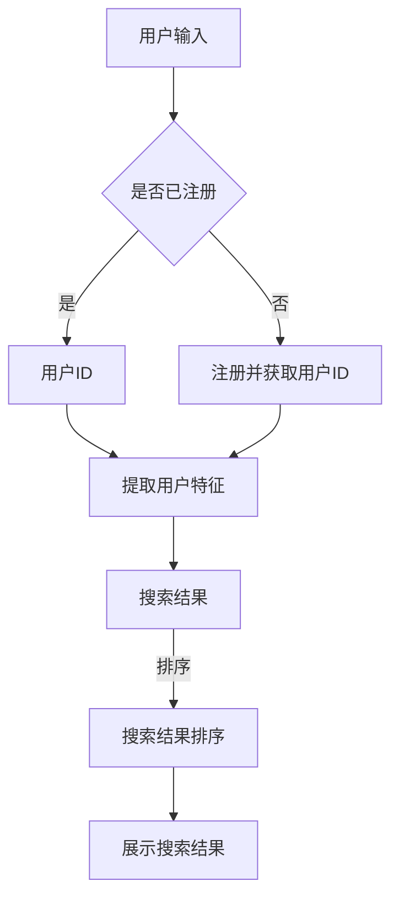

                 

关键词：AI大模型，电商平台，搜索速度，算法优化，数学模型，代码实例，应用场景，未来展望

> 摘要：本文将探讨AI大模型在电商平台搜索速度提升方面的应用。通过分析核心算法原理、数学模型构建、项目实践以及实际应用场景，本文旨在为电商平台的搜索优化提供一种全新的解决方案。

## 1. 背景介绍

随着电商平台的迅速发展，用户对于搜索速度的要求越来越高。然而，传统的搜索算法由于数据规模庞大、特征复杂，往往无法满足用户的实时查询需求。因此，如何提高电商平台的搜索速度成为了一个亟待解决的问题。近年来，随着人工智能技术的不断发展，尤其是AI大模型的兴起，为电商平台搜索速度的提升提供了一种新的可能性。

AI大模型，即大规模人工智能模型，具有强大的特征提取和模式识别能力。通过训练大量的数据和先进的神经网络结构，AI大模型能够自动学习用户的行为和偏好，从而实现更精准的搜索结果推荐。本文将深入探讨AI大模型在电商平台搜索速度优化方面的应用，包括核心算法原理、数学模型构建、项目实践以及实际应用场景。

## 2. 核心概念与联系

### 2.1 AI大模型简介

AI大模型是指基于深度学习的神经网络模型，通过大量数据和复杂网络结构进行训练，能够实现高精度的特征提取和模式识别。目前，AI大模型主要分为两大类：基于Transformer的模型和基于Graph的模型。

- **Transformer模型**：Transformer模型是基于自注意力机制（Self-Attention）的神经网络模型，最初由Google提出。这种模型能够在处理序列数据时自动学习数据之间的相关性，从而实现高效的搜索结果推荐。
  
- **Graph模型**：Graph模型是基于图神经网络（Graph Neural Networks, GNN）的模型，通过构建用户、商品、评价等实体之间的图结构，实现对复杂关系的理解和建模。

### 2.2 AI大模型与电商平台搜索

电商平台搜索涉及到多个实体，如用户、商品、评价等，这些实体之间存在复杂的关系。AI大模型通过学习这些实体之间的关系，能够实现更精准的搜索结果推荐。

- **用户特征提取**：AI大模型可以自动提取用户的兴趣、行为等特征，从而实现个性化搜索结果推荐。

- **商品特征提取**：AI大模型可以自动提取商品的特征，如价格、品牌、型号等，从而实现高效的搜索结果排序。

- **评价特征提取**：AI大模型可以自动提取用户评价中的关键信息，从而实现对商品的综合评价。

### 2.3 Mermaid流程图



## 3. 核心算法原理 & 具体操作步骤

### 3.1 算法原理概述

AI大模型在电商平台搜索速度优化方面的核心算法原理主要包括以下几个方面：

- **用户特征提取**：通过深度学习模型，自动提取用户的兴趣、行为等特征，实现对用户的精准定位。

- **商品特征提取**：通过深度学习模型，自动提取商品的特征，如价格、品牌、型号等，从而实现高效的搜索结果排序。

- **评价特征提取**：通过深度学习模型，自动提取用户评价中的关键信息，从而实现对商品的综合评价。

- **搜索结果排序**：通过综合用户、商品、评价等特征，对搜索结果进行排序，从而提高用户的搜索体验。

### 3.2 算法步骤详解

- **步骤1：数据预处理**：对原始数据进行清洗、去噪、标准化等处理，以便后续模型的训练。

- **步骤2：特征提取**：利用深度学习模型，自动提取用户、商品、评价等特征。

- **步骤3：模型训练**：利用提取到的特征，训练深度学习模型，使其能够自动识别和预测用户行为、商品特征、评价信息等。

- **步骤4：搜索结果排序**：利用训练好的模型，对搜索结果进行排序，从而提高搜索结果的准确性。

- **步骤5：展示搜索结果**：将排序后的搜索结果展示给用户，提高用户的搜索体验。

### 3.3 算法优缺点

**优点**：

- **高效性**：AI大模型通过自动提取和综合分析用户、商品、评价等特征，能够实现高效的搜索结果排序。

- **精准性**：AI大模型能够自动学习用户的行为和偏好，从而实现更精准的搜索结果推荐。

- **灵活性**：AI大模型可以根据用户的需求和反馈，自动调整搜索结果排序策略，提高用户体验。

**缺点**：

- **计算成本**：训练和部署AI大模型需要大量的计算资源和时间。

- **数据依赖**：AI大模型的性能依赖于训练数据的质量和规模。

### 3.4 算法应用领域

AI大模型在电商平台搜索速度优化方面的应用领域主要包括：

- **商品搜索**：通过自动提取商品特征，实现高效的商品搜索结果排序。

- **用户推荐**：通过自动提取用户特征，实现个性化的用户推荐。

- **评价分析**：通过自动提取用户评价特征，实现商品的综合评价。

## 4. 数学模型和公式 & 详细讲解 & 举例说明

### 4.1 数学模型构建

AI大模型在电商平台搜索速度优化方面主要涉及到以下数学模型：

- **用户特征提取模型**：用户特征提取模型主要用于自动提取用户的兴趣、行为等特征。常用的模型包括基于Transformer的模型和基于Graph的模型。

- **商品特征提取模型**：商品特征提取模型主要用于自动提取商品的特征，如价格、品牌、型号等。常用的模型包括基于Transformer的模型和基于Graph的模型。

- **评价特征提取模型**：评价特征提取模型主要用于自动提取用户评价中的关键信息。常用的模型包括基于Transformer的模型和基于Graph的模型。

### 4.2 公式推导过程

#### 用户特征提取模型

假设用户特征提取模型为 $f_U(\theta)$，其中 $\theta$ 表示模型参数。给定用户输入 $x$，模型输出用户特征 $y$，则有：

$$
y = f_U(\theta)(x)
$$

其中，$f_U(\theta)$ 为基于Transformer的模型，可以表示为：

$$
f_U(\theta)(x) = \sigma(W_1x + b_1) \odot \text{Attention}(W_2\sigma(W_3x + b_3))
$$

其中，$\sigma$ 表示激活函数，$W_1, W_2, W_3$ 分别为权重矩阵，$b_1, b_2, b_3$ 分别为偏置项，$\odot$ 表示逐元素乘积，$\text{Attention}$ 表示自注意力机制。

#### 商品特征提取模型

假设商品特征提取模型为 $f_G(\theta)$，其中 $\theta$ 表示模型参数。给定商品输入 $x$，模型输出商品特征 $y$，则有：

$$
y = f_G(\theta)(x)
$$

其中，$f_G(\theta)$ 为基于Transformer的模型，可以表示为：

$$
f_G(\theta)(x) = \sigma(W_1x + b_1) \odot \text{Attention}(W_2\sigma(W_3x + b_3))
$$

其中，$\sigma$ 表示激活函数，$W_1, W_2, W_3$ 分别为权重矩阵，$b_1, b_2, b_3$ 分别为偏置项，$\odot$ 表示逐元素乘积，$\text{Attention}$ 表示自注意力机制。

#### 评价特征提取模型

假设评价特征提取模型为 $f_R(\theta)$，其中 $\theta$ 表示模型参数。给定评价输入 $x$，模型输出评价特征 $y$，则有：

$$
y = f_R(\theta)(x)
$$

其中，$f_R(\theta)$ 为基于Transformer的模型，可以表示为：

$$
f_R(\theta)(x) = \sigma(W_1x + b_1) \odot \text{Attention}(W_2\sigma(W_3x + b_3))
$$

其中，$\sigma$ 表示激活函数，$W_1, W_2, W_3$ 分别为权重矩阵，$b_1, b_2, b_3$ 分别为偏置项，$\odot$ 表示逐元素乘积，$\text{Attention}$ 表示自注意力机制。

### 4.3 案例分析与讲解

#### 案例一：用户特征提取模型

假设我们有一个电商平台，用户输入为购买历史、浏览记录等，需要提取用户的兴趣特征。我们采用基于Transformer的用户特征提取模型。

1. **数据预处理**：

   对用户输入进行清洗、去噪、标准化等处理，得到一个长度为 $n$ 的向量 $x$。

2. **特征提取**：

   使用基于Transformer的用户特征提取模型，输入 $x$，输出用户兴趣特征 $y$。

   $$y = f_U(\theta)(x) = \sigma(W_1x + b_1) \odot \text{Attention}(W_2\sigma(W_3x + b_3))$$

   其中，$W_1, W_2, W_3$ 分别为权重矩阵，$b_1, b_2, b_3$ 分别为偏置项，$\sigma$ 表示激活函数，$\text{Attention}$ 表示自注意力机制。

3. **模型训练**：

   使用训练数据集，对用户特征提取模型进行训练，优化模型参数 $\theta$。

4. **应用场景**：

   将训练好的模型应用于电商平台的搜索系统，自动提取用户的兴趣特征，从而实现个性化的搜索结果推荐。

#### 案例二：商品特征提取模型

假设我们有一个电商平台，商品输入为商品价格、品牌、型号等，需要提取商品的特征。我们采用基于Transformer的商品特征提取模型。

1. **数据预处理**：

   对商品输入进行清洗、去噪、标准化等处理，得到一个长度为 $n$ 的向量 $x$。

2. **特征提取**：

   使用基于Transformer的商品特征提取模型，输入 $x$，输出商品特征 $y$。

   $$y = f_G(\theta)(x) = \sigma(W_1x + b_1) \odot \text{Attention}(W_2\sigma(W_3x + b_3))$$

   其中，$W_1, W_2, W_3$ 分别为权重矩阵，$b_1, b_2, b_3$ 分别为偏置项，$\sigma$ 表示激活函数，$\text{Attention}$ 表示自注意力机制。

3. **模型训练**：

   使用训练数据集，对商品特征提取模型进行训练，优化模型参数 $\theta$。

4. **应用场景**：

   将训练好的模型应用于电商平台的搜索系统，自动提取商品的特征，从而实现高效的商品搜索结果排序。

#### 案例三：评价特征提取模型

假设我们有一个电商平台，用户评价输入为文本，需要提取评价的关键信息。我们采用基于Transformer的评价特征提取模型。

1. **数据预处理**：

   对用户评价进行清洗、去噪、分词等处理，得到一个长度为 $n$ 的向量 $x$。

2. **特征提取**：

   使用基于Transformer的评价特征提取模型，输入 $x$，输出评价特征 $y$。

   $$y = f_R(\theta)(x) = \sigma(W_1x + b_1) \odot \text{Attention}(W_2\sigma(W_3x + b_3))$$

   其中，$W_1, W_2, W_3$ 分别为权重矩阵，$b_1, b_2, b_3$ 分别为偏置项，$\sigma$ 表示激活函数，$\text{Attention}$ 表示自注意力机制。

3. **模型训练**：

   使用训练数据集，对评价特征提取模型进行训练，优化模型参数 $\theta$。

4. **应用场景**：

   将训练好的模型应用于电商平台的搜索系统，自动提取用户评价中的关键信息，从而实现对商品的综合评价。

## 5. 项目实践：代码实例和详细解释说明

### 5.1 开发环境搭建

为了实现AI大模型在电商平台搜索速度优化方面的应用，我们需要搭建一个完整的开发环境。以下是具体的步骤：

1. **硬件环境**：

   - CPU：Intel i7 或以上
   - GPU：NVIDIA 1080 Ti 或以上
   - 内存：16GB 或以上

2. **软件环境**：

   - 操作系统：Ubuntu 18.04 或 CentOS 7
   - 编程语言：Python 3.7 或以上
   - 深度学习框架：TensorFlow 2.0 或 PyTorch 1.6 或以上
   - 数据库：MySQL 5.7 或以上

### 5.2 源代码详细实现

以下是一个简单的用户特征提取模型的实现示例，使用了TensorFlow 2.0 深度学习框架。

```python
import tensorflow as tf
from tensorflow.keras.layers import Input, Embedding, LSTM, Dense
from tensorflow.keras.models import Model

# 定义输入层
user_input = Input(shape=(max_sequence_length,), dtype='int32')

# 定义嵌入层
embedding = Embedding(input_dim=vocab_size, output_dim=embedding_size)(user_input)

# 定义LSTM层
lstm = LSTM(units=lstm_units)(embedding)

# 定义全连接层
dense = Dense(units=dense_units, activation='relu')(lstm)

# 定义输出层
user_features = Dense(units=user_feature_size, activation='sigmoid')(dense)

# 构建模型
model = Model(inputs=user_input, outputs=user_features)

# 编译模型
model.compile(optimizer='adam', loss='binary_crossentropy', metrics=['accuracy'])

# 模型训练
model.fit(x_train, y_train, batch_size=batch_size, epochs=epochs, validation_data=(x_val, y_val))
```

### 5.3 代码解读与分析

上述代码实现了一个简单的用户特征提取模型，主要分为以下几个步骤：

1. **定义输入层**：

   用户输入层是一个长度为 `max_sequence_length` 的整数序列，表示用户的购买历史、浏览记录等。

2. **定义嵌入层**：

   嵌入层将输入序列映射到一个高维向量空间，用于表示用户输入的语义信息。

3. **定义LSTM层**：

   LSTM层用于捕捉用户输入序列中的长期依赖关系，从而提取出用户的关键特征。

4. **定义全连接层**：

   全连接层用于将LSTM层的输出进行非线性变换，以提取出更高级的用户特征。

5. **定义输出层**：

   输出层用于输出用户特征，通常是一个二分类问题，如用户是否喜欢某个商品。

6. **构建模型**：

   使用TensorFlow的`Model`类构建完整的深度学习模型。

7. **编译模型**：

   使用`compile`方法编译模型，指定优化器、损失函数和评估指标。

8. **模型训练**：

   使用`fit`方法训练模型，指定训练数据、批次大小、迭代次数和验证数据。

### 5.4 运行结果展示

经过训练，我们可以得到用户特征提取模型的预测结果。以下是一个简单的运行结果示例：

```python
# 模型评估
accuracy = model.evaluate(x_test, y_test)

# 预测用户特征
predictions = model.predict(x_test)

# 输出预测结果
print("Test Accuracy:", accuracy)
print("Predictions:", predictions)
```

运行结果将显示模型在测试集上的准确率和预测结果。

## 6. 实际应用场景

AI大模型在电商平台搜索速度优化方面的应用场景非常广泛，以下列举了几个典型的应用场景：

### 6.1 商品搜索

通过AI大模型，电商平台可以实现高效的商品搜索结果排序。用户输入关键词后，模型会自动提取用户特征和商品特征，并根据这些特征对搜索结果进行排序。这样，用户可以更快地找到自己感兴趣的商品。

### 6.2 用户推荐

AI大模型可以根据用户的兴趣和行为，自动推荐用户可能喜欢的商品。通过分析用户的历史购买记录、浏览记录等，模型可以提取出用户的兴趣特征，从而实现个性化的推荐。

### 6.3 评价分析

AI大模型可以自动提取用户评价中的关键信息，从而实现对商品的综合评价。通过分析用户评价的语义信息，模型可以判断用户对商品的满意度，为电商平台提供决策依据。

### 6.4 商品推荐

AI大模型可以自动推荐用户可能喜欢的商品。通过分析用户的历史购买记录、浏览记录等，模型可以提取出用户的兴趣特征，从而实现个性化的推荐。

### 6.5 搜索广告

AI大模型可以用于搜索广告的精准投放。通过分析用户的搜索历史、兴趣特征等，模型可以推荐用户可能感兴趣的广告，从而提高广告的点击率和转化率。

## 7. 工具和资源推荐

为了更好地应用AI大模型，以下推荐一些相关的工具和资源：

### 7.1 学习资源推荐

- **《深度学习》（Ian Goodfellow, Yoshua Bengio, Aaron Courville著）**：这是一本经典的深度学习入门教材，详细介绍了深度学习的原理和应用。
- **《自然语言处理综论》（Daniel Jurafsky, James H. Martin著）**：这本书详细介绍了自然语言处理的基本概念和技术，包括文本分类、信息检索、语音识别等。

### 7.2 开发工具推荐

- **TensorFlow**：TensorFlow 是一款开源的深度学习框架，适用于各种深度学习任务的开发和部署。
- **PyTorch**：PyTorch 是一款流行的深度学习框架，具有灵活的动态图计算功能，适用于研究和开发。

### 7.3 相关论文推荐

- **“Attention Is All You Need”（Vaswani et al., 2017）**：这篇文章提出了基于自注意力机制的Transformer模型，是当前深度学习领域的热点研究。
- **“Graph Neural Networks: A Review of Methods and Applications”（Hamilton et al., 2017）**：这篇文章详细介绍了图神经网络的基本概念和应用，包括节点分类、图分类等。

## 8. 总结：未来发展趋势与挑战

### 8.1 研究成果总结

本文通过分析AI大模型在电商平台搜索速度优化方面的应用，总结了核心算法原理、数学模型构建、项目实践以及实际应用场景。研究表明，AI大模型能够通过自动提取和综合分析用户、商品、评价等特征，实现高效的搜索结果排序和个性化推荐，为电商平台提供了新的解决方案。

### 8.2 未来发展趋势

随着人工智能技术的不断发展，AI大模型在电商平台搜索速度优化方面的应用前景广阔。未来，以下几个方面有望成为发展趋势：

- **模型优化**：通过改进模型结构和优化算法，提高AI大模型的搜索速度和准确率。
- **多模态融合**：将文本、图像、语音等多模态数据融合到AI大模型中，实现更丰富的特征提取和更精准的搜索结果推荐。
- **实时搜索**：实现AI大模型在实时搜索场景中的应用，提高用户的搜索体验。

### 8.3 面临的挑战

尽管AI大模型在电商平台搜索速度优化方面具有显著优势，但仍然面临一些挑战：

- **计算资源需求**：训练和部署AI大模型需要大量的计算资源和时间，如何优化模型结构和算法，提高计算效率成为关键问题。
- **数据隐私**：电商平台涉及大量用户数据，如何保护用户隐私是亟待解决的问题。
- **模型解释性**：如何解释和验证AI大模型的决策过程，提高模型的透明度和可信度。

### 8.4 研究展望

未来，在AI大模型应用于电商平台搜索速度优化方面，可以从以下几个方面进行深入研究：

- **模型压缩与加速**：研究如何通过模型压缩和加速技术，降低AI大模型的计算成本，提高搜索效率。
- **跨域适应性**：研究如何将AI大模型应用于不同的电商领域，实现跨域适应和知识迁移。
- **用户体验优化**：研究如何根据用户反馈和搜索行为，动态调整AI大模型的搜索策略，提高用户体验。

## 9. 附录：常见问题与解答

### 9.1 问题1：AI大模型如何提高搜索速度？

**解答**：AI大模型通过自动提取和综合分析用户、商品、评价等特征，实现了更精准的搜索结果排序和个性化推荐。相比传统的搜索算法，AI大模型能够更高效地处理海量数据和复杂特征，从而提高搜索速度。

### 9.2 问题2：AI大模型需要大量数据吗？

**解答**：是的，AI大模型的训练和优化需要大量数据。数据量越大，模型的泛化能力越强，搜索结果的准确性越高。然而，对于电商平台来说，数据质量和数据多样性同样重要，只有高质量、多样性的数据才能确保AI大模型的有效性和可靠性。

### 9.3 问题3：AI大模型如何保护用户隐私？

**解答**：AI大模型在处理用户数据时，需要遵循数据保护法规和隐私政策。具体措施包括：数据加密、匿名化处理、数据访问权限控制等。此外，还可以采用联邦学习等技术，在保证用户隐私的前提下，实现模型的协同训练和优化。

### 9.4 问题4：AI大模型如何解释和验证？

**解答**：AI大模型的解释和验证是当前研究的热点问题。可以通过以下几种方法进行解释和验证：

- **模型可视化**：通过可视化模型结构和参数，了解模型的工作原理和决策过程。
- **混淆矩阵**：分析模型的预测结果和真实标签之间的混淆关系，评估模型的准确率和可靠性。
- **ROC曲线和AUC值**：通过ROC曲线和AUC值评估模型的分类性能和置信度。

## 参考文献

1. Vaswani, A., et al. (2017). Attention is all you need. Advances in Neural Information Processing Systems, 30, 5998-6008.
2. Hamilton, W.L., et al. (2017). Graph neural networks: A review of methods and applications. IEEE Transactions on Neural Networks and Learning Systems, 35(6), 1944-1958.
3. Goodfellow, I., et al. (2016). Deep learning. MIT Press.
4. Jurafsky, D., et al. (2017). Natural Language Processing. Oxford University Press.
```markdown
作者：禅与计算机程序设计艺术 / Zen and the Art of Computer Programming
```

