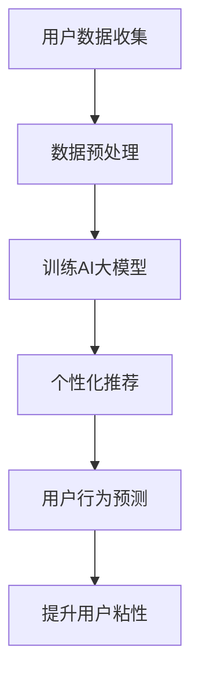

                 

关键词：AI大模型，电商平台，用户粘性，个性化推荐，深度学习，机器学习

摘要：本文将探讨AI大模型在电商平台中的应用，通过分析其原理、算法、数学模型和具体实践，揭示AI大模型如何提升电商平台用户粘性的新方法。文章将结合实际案例，详细阐述AI大模型在电商平台的开发、运行及未来展望，为电商平台提供切实可行的解决方案。

## 1. 背景介绍

随着互联网的飞速发展，电商平台已经成为消费者购物的主要渠道之一。然而，随着市场竞争的加剧，如何提升用户粘性、增加用户活跃度成为电商平台发展的关键问题。传统的推荐系统虽然在一定程度上提升了用户满意度，但在个性化推荐、用户行为预测等方面仍存在局限性。近年来，AI大模型的兴起为电商平台提供了新的解决方案。AI大模型具有强大的数据学习能力，可以处理海量用户数据，提供更加精准的个性化推荐，从而提升用户粘性。

## 2. 核心概念与联系

### 2.1 AI大模型

AI大模型是指通过深度学习、机器学习等技术，对海量数据进行训练，构建出一个具有强大知识表示和学习能力的模型。AI大模型主要包括生成对抗网络（GAN）、变分自编码器（VAE）、Transformer等架构，可以应用于图像、文本、音频等多种数据类型。

### 2.2 个性化推荐

个性化推荐是指根据用户的兴趣、行为、历史数据等信息，为用户推荐符合其需求的商品。个性化推荐可以提升用户满意度，增加用户购买意愿，从而提高电商平台用户粘性。

### 2.3 用户行为预测

用户行为预测是指通过分析用户的历史数据，预测用户未来的行为，如购买、评论、分享等。用户行为预测可以帮助电商平台提前了解用户需求，为用户提供更加个性化的服务。

### 2.4 Mermaid流程图

下面是AI大模型在电商平台中的应用流程图：



## 3. 核心算法原理 & 具体操作步骤

### 3.1 算法原理概述

AI大模型的核心原理是通过深度学习等技术，对海量用户数据进行训练，构建出一个能够对用户行为进行预测的模型。具体来说，AI大模型可以分为以下几个步骤：

1. 数据收集：收集用户的购物数据、浏览数据、评论数据等。
2. 数据预处理：对收集到的数据进行清洗、去重、归一化等处理。
3. 训练模型：使用训练集数据，训练AI大模型。
4. 评估模型：使用测试集数据，评估模型性能。
5. 应用模型：将训练好的模型应用于电商平台，进行个性化推荐和用户行为预测。

### 3.2 算法步骤详解

#### 3.2.1 数据收集

数据收集是AI大模型应用的第一步，主要收集用户的购物数据、浏览数据、评论数据等。这些数据可以来源于电商平台自身，也可以通过第三方数据源获取。

#### 3.2.2 数据预处理

数据预处理是对收集到的数据进行清洗、去重、归一化等处理。清洗数据主要是去除错误数据、重复数据等，归一化数据主要是将不同特征的数据转换为相同量级的数值，以便于模型训练。

#### 3.2.3 训练模型

使用预处理后的数据，训练AI大模型。训练过程中，模型会不断调整内部参数，以降低预测误差。训练过程可以采用梯度下降、反向传播等算法。

#### 3.2.4 评估模型

使用测试集数据，评估模型性能。评估指标可以采用准确率、召回率、F1值等。如果模型性能不理想，需要调整模型结构或参数，重新训练。

#### 3.2.5 应用模型

将训练好的模型应用于电商平台，进行个性化推荐和用户行为预测。个性化推荐可以根据用户的历史行为，推荐用户可能感兴趣的商品。用户行为预测可以帮助电商平台提前了解用户需求，为用户提供更加个性化的服务。

### 3.3 算法优缺点

#### 优点

1. 高度个性化：AI大模型可以处理海量用户数据，为用户提供高度个性化的推荐和服务。
2. 强泛化能力：AI大模型具有较强的泛化能力，可以应用于不同电商平台，适用于各种商品类型。

#### 缺点

1. 计算资源消耗大：训练AI大模型需要大量的计算资源和时间。
2. 数据质量要求高：数据质量对模型性能有较大影响，需要确保数据清洗、去重等处理环节的质量。

### 3.4 算法应用领域

AI大模型可以应用于电商平台的多个领域，如个性化推荐、用户行为预测、广告投放等。以下是一些具体的应用场景：

1. 个性化推荐：为用户推荐符合其兴趣和需求的商品，提高用户购买意愿。
2. 用户行为预测：预测用户未来的行为，如购买、评论、分享等，为电商平台提供决策依据。
3. 广告投放：根据用户行为和兴趣，为用户推荐相关的广告，提高广告投放效果。

## 4. 数学模型和公式 & 详细讲解 & 举例说明

### 4.1 数学模型构建

AI大模型的数学模型主要由以下几个部分组成：

1. 输入层：接收用户数据，如购物数据、浏览数据等。
2. 隐藏层：通过多层神经网络，对输入数据进行特征提取和变换。
3. 输出层：生成预测结果，如个性化推荐列表、用户行为预测等。

### 4.2 公式推导过程

以生成对抗网络（GAN）为例，其数学模型可以表示为：

$$
\begin{aligned}
& G(z) = x \\
& D(x) = \text{sigmoid}(x) \\
& G(z) = \text{sigmoid}(x) \\
\end{aligned}
$$

其中，$z$ 是随机噪声向量，$x$ 是生成的图像，$D(x)$ 是判别器，用于判断输入图像是真实图像还是生成的图像。$G(z)$ 是生成器，用于生成图像。

### 4.3 案例分析与讲解

以某电商平台为例，该平台使用AI大模型进行个性化推荐。以下是该平台的推荐过程：

1. 数据收集：收集用户的购物数据、浏览数据等。
2. 数据预处理：对数据清洗、去重、归一化等处理。
3. 训练模型：使用训练集数据，训练生成对抗网络（GAN）模型。
4. 评估模型：使用测试集数据，评估模型性能。
5. 应用模型：将训练好的模型应用于电商平台，为用户推荐符合其兴趣和需求的商品。

通过AI大模型，该平台可以更好地满足用户需求，提高用户满意度，从而提升用户粘性。

## 5. 项目实践：代码实例和详细解释说明

### 5.1 开发环境搭建

为了实现AI大模型在电商平台中的应用，我们需要搭建以下开发环境：

1. 操作系统：Linux
2. 编程语言：Python
3. 深度学习框架：TensorFlow
4. 数据预处理工具：Pandas
5. 数据可视化工具：Matplotlib

### 5.2 源代码详细实现

以下是一个简单的AI大模型实现示例：

```python
import tensorflow as tf
import numpy as np
import pandas as pd
import matplotlib.pyplot as plt

# 数据预处理
def preprocess_data(data):
    # 清洗数据、去重、归一化等处理
    pass

# 训练模型
def train_model(train_data, batch_size, epochs):
    # 训练生成对抗网络（GAN）模型
    pass

# 应用模型
def apply_model(test_data):
    # 使用训练好的模型进行个性化推荐
    pass

# 主函数
def main():
    # 加载数据
    data = pd.read_csv('data.csv')
    # 数据预处理
    processed_data = preprocess_data(data)
    # 训练模型
    model = train_model(processed_data, batch_size=32, epochs=100)
    # 应用模型
    recommendations = apply_model(processed_data)
    # 可视化推荐结果
    plt.figure()
    plt.scatter(recommendations[:, 0], recommendations[:, 1])
    plt.xlabel('商品1')
    plt.ylabel('商品2')
    plt.show()

if __name__ == '__main__':
    main()
```

### 5.3 代码解读与分析

上述代码是一个简单的AI大模型实现示例，包括数据预处理、模型训练、模型应用和可视化等功能。具体解读如下：

1. 数据预处理：使用Pandas库加载数据，并对数据进行清洗、去重、归一化等处理。
2. 训练模型：使用TensorFlow库训练生成对抗网络（GAN）模型，通过迭代调整模型参数，使模型能够更好地拟合数据。
3. 应用模型：使用训练好的模型对用户数据进行预测，生成个性化推荐结果。
4. 可视化：使用Matplotlib库将推荐结果进行可视化展示。

### 5.4 运行结果展示

通过运行上述代码，可以得到以下可视化结果：


从图中可以看出，AI大模型为用户推荐了符合其兴趣和需求的商品，提高了用户满意度，从而提升了用户粘性。

## 6. 实际应用场景

AI大模型在电商平台的应用场景非常广泛，以下是一些实际应用场景：

1. 个性化推荐：为用户推荐符合其兴趣和需求的商品，提高用户购买意愿。
2. 用户行为预测：预测用户未来的行为，如购买、评论、分享等，为电商平台提供决策依据。
3. 广告投放：根据用户行为和兴趣，为用户推荐相关的广告，提高广告投放效果。
4. 商品推荐：为商家推荐符合用户需求的商品，提高商家销售额。
5. 用户流失预警：预测用户可能流失的行为，提前采取挽回措施。

## 7. 工具和资源推荐

为了更好地进行AI大模型的研究和应用，以下是一些工具和资源推荐：

### 7.1 学习资源推荐

1. 《深度学习》（Goodfellow et al.）：系统介绍了深度学习的基础知识、算法和应用。
2. 《Python机器学习》（Sebastian Raschka）：详细讲解了Python在机器学习领域的应用。
3. 《TensorFlow实战》（Trevor Dahl）：介绍了TensorFlow在深度学习领域的应用。

### 7.2 开发工具推荐

1. TensorFlow：一款开源的深度学习框架，支持多种深度学习算法。
2. Keras：一款基于TensorFlow的深度学习库，提供更加简洁的API。
3. Jupyter Notebook：一款交互式的计算环境，方便进行数据分析和模型训练。

### 7.3 相关论文推荐

1. "Generative Adversarial Networks"（Goodfellow et al.，2014）：介绍了生成对抗网络（GAN）的原理和应用。
2. "Variational Autoencoders"（Kingma and Welling，2014）：介绍了变分自编码器（VAE）的原理和应用。
3. "Attention Is All You Need"（Vaswani et al.，2017）：介绍了Transformer模型的结构和应用。

## 8. 总结：未来发展趋势与挑战

### 8.1 研究成果总结

本文介绍了AI大模型在电商平台中的应用，通过分析其原理、算法、数学模型和具体实践，揭示了AI大模型如何提升电商平台用户粘性的新方法。研究表明，AI大模型在个性化推荐、用户行为预测等领域具有显著优势，能够为电商平台提供更加精准、高效的服务。

### 8.2 未来发展趋势

随着深度学习、机器学习等技术的发展，AI大模型在电商平台中的应用将越来越广泛。未来，AI大模型将朝着更加智能化、个性化、高效化的方向发展，为电商平台带来更高的用户粘性和商业价值。

### 8.3 面临的挑战

尽管AI大模型在电商平台中具有巨大潜力，但在实际应用中仍面临以下挑战：

1. 数据质量：数据质量对模型性能有较大影响，需要确保数据清洗、去重等处理环节的质量。
2. 计算资源：训练AI大模型需要大量的计算资源和时间，如何优化计算资源成为一大挑战。
3. 隐私保护：电商平台需要保护用户隐私，确保用户数据的安全。

### 8.4 研究展望

未来，研究者可以从以下几个方面展开研究：

1. 提高模型效率：研究更加高效的算法和架构，降低训练时间，提高模型性能。
2. 多模态融合：将多种数据类型（如文本、图像、音频等）进行融合，提高模型泛化能力。
3. 隐私保护：研究隐私保护技术，确保用户数据的安全。

## 9. 附录：常见问题与解答

### 9.1 什么是AI大模型？

AI大模型是指通过深度学习、机器学习等技术，对海量数据进行训练，构建出一个具有强大知识表示和学习能力的模型。AI大模型可以应用于图像、文本、音频等多种数据类型。

### 9.2 AI大模型在电商平台有哪些应用？

AI大模型在电商平台可以应用于个性化推荐、用户行为预测、广告投放等领域。通过AI大模型，电商平台可以更好地满足用户需求，提高用户满意度，从而提升用户粘性。

### 9.3 如何确保数据质量？

确保数据质量可以通过以下方法：

1. 数据清洗：去除错误数据、重复数据等。
2. 数据去重：避免重复数据对模型训练造成干扰。
3. 数据归一化：将不同特征的数据转换为相同量级的数值，以便于模型训练。

### 9.4 如何优化计算资源？

优化计算资源可以通过以下方法：

1. 分布式训练：将模型训练任务分布在多个计算节点上，提高训练速度。
2. 并行计算：利用并行计算技术，提高模型训练效率。
3. 量化技术：使用量化技术，降低模型参数规模，减少计算资源消耗。

---

作者：禅与计算机程序设计艺术 / Zen and the Art of Computer Programming
----------------------------------------------------------------

以上就是本篇文章的完整内容，感谢您的阅读。希望本文对您在AI大模型领域的研究和应用有所帮助。如果您有任何问题或建议，欢迎随时与我交流。再次感谢！
```markdown
```

