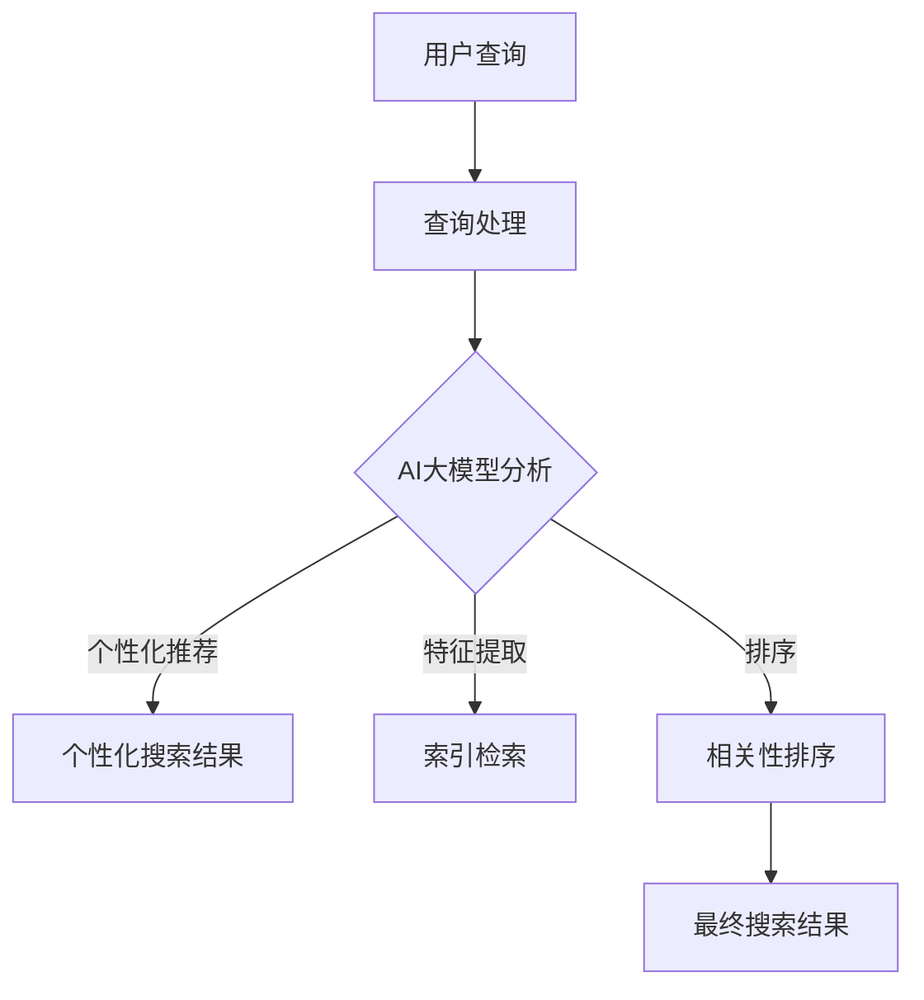

                 

关键词：AI大模型、电商平台、搜索结果、多样性、算法优化

<|assistant|>摘要：随着电子商务的快速发展，用户对于电商平台的搜索体验提出了更高的要求。本文将探讨如何利用AI大模型改善电商平台搜索结果的多样性，提高用户的满意度，从而增强电商平台的竞争力。

## 1. 背景介绍

电子商务作为现代商业的重要组成部分，其市场规模和影响力日益扩大。电商平台作为电子商务的核心载体，其用户体验至关重要。其中，搜索功能是用户获取商品信息的主要途径，而搜索结果的多样性直接影响用户的购物体验。

然而，当前大多数电商平台在搜索结果多样性方面存在一定问题。一方面，由于算法的限制，搜索结果往往过于集中，导致用户难以发现新的商品；另一方面，搜索结果过于相似，缺乏新颖性，使得用户对平台产生疲劳感。这些问题严重影响了电商平台的用户满意度和竞争力。

为了解决上述问题，本文将探讨如何利用AI大模型改善电商平台搜索结果的多样性。通过引入先进的算法和模型，实现对搜索结果的优化，从而提高用户的购物体验。

## 2. 核心概念与联系

为了理解AI大模型在改善电商平台搜索结果多样性方面的作用，我们需要先了解一些核心概念，包括AI大模型的基本原理、电商平台搜索算法的基本架构，以及它们之间的联系。

### 2.1 AI大模型的基本原理

AI大模型是指具备强大学习能力和泛化能力的深度学习模型。这些模型通常基于神经网络架构，能够处理大量的数据和复杂的任务。AI大模型的核心特点是能够通过自主学习从数据中提取特征，并利用这些特征进行预测和决策。

在电商平台搜索场景中，AI大模型可以用于以下几个关键方面：

- **用户行为分析**：通过分析用户的历史搜索和购买行为，AI大模型可以理解用户的兴趣和偏好，从而提供个性化的搜索建议。
- **商品特征提取**：AI大模型可以从商品描述、图片、用户评论等多维数据中提取出有效的特征，用于搜索结果的相关性排序。
- **多样性增强**：通过学习用户行为和商品特征，AI大模型能够发现新的商品，并确保搜索结果中的多样性。

### 2.2 电商平台搜索算法的基本架构

电商平台搜索算法通常由以下几个核心模块组成：

- **查询处理**：接收用户的搜索查询，并将其转化为可处理的格式。
- **索引检索**：根据查询关键字，快速从索引数据库中检索出相关的商品信息。
- **相关性排序**：对检索到的商品信息进行排序，以确定哪些商品最符合用户的搜索意图。

### 2.3 AI大模型与电商平台搜索算法的联系

AI大模型可以与电商平台搜索算法的各个模块进行深度融合，从而改善搜索结果的多样性。以下是AI大模型在电商平台搜索算法中的几个关键应用场景：

- **个性化推荐**：AI大模型可以根据用户的历史行为和偏好，为用户推荐个性化的搜索结果，从而提高搜索的多样性。
- **特征提取与排序**：AI大模型可以从商品描述、图片等多维数据中提取出更丰富的特征，并利用这些特征进行相关性排序，使搜索结果更加多样化。
- **冷启动问题解决**：对于新用户和新商品，AI大模型可以通过对用户行为和商品特征的学习，快速生成有效的搜索结果，解决冷启动问题。

### 2.4 Mermaid 流程图

下面是一个简化的Mermaid流程图，展示AI大模型在电商平台搜索算法中的应用流程：



通过这个流程图，我们可以看到AI大模型如何与电商平台搜索算法的各个模块进行交互，从而改善搜索结果的多样性。

## 3. 核心算法原理 & 具体操作步骤

### 3.1 算法原理概述

AI大模型在改善电商平台搜索结果多样性方面主要依赖于以下几个关键原理：

- **深度学习**：AI大模型通过深度神经网络结构，能够从大量数据中自动学习特征，提高模型的泛化能力和准确性。
- **注意力机制**：注意力机制能够使模型关注到重要的信息，从而提高搜索结果的多样性。
- **用户行为分析**：通过分析用户的历史行为和偏好，AI大模型能够为用户提供个性化的搜索结果，提高多样性。

### 3.2 算法步骤详解

下面是AI大模型在电商平台搜索中的具体操作步骤：

#### 步骤1：用户查询处理

当用户输入搜索查询时，电商平台会对查询进行预处理，包括去停用词、分词、词性标注等操作。处理后的查询将被传递给AI大模型。

#### 步骤2：用户行为分析

AI大模型会分析用户的历史搜索和购买行为，利用这些数据来了解用户的兴趣和偏好。这一步骤可以通过以下几种方式实现：

- **历史行为分析**：通过分析用户的历史搜索记录，识别出用户的兴趣点。
- **偏好模型构建**：利用机器学习方法，构建用户的偏好模型，以便在搜索结果中更好地满足用户的需求。

#### 步骤3：商品特征提取

AI大模型会从商品的多维数据中提取出有效的特征，包括商品描述、图片、用户评论等。这些特征将被用于后续的搜索结果排序和多样性优化。

#### 步骤4：搜索结果排序

利用提取出的商品特征，AI大模型会进行搜索结果的排序。排序过程中，模型会考虑以下几个因素：

- **用户兴趣**：根据用户的历史行为和偏好，为用户推荐更符合其兴趣的商品。
- **多样性**：通过注意力机制，确保搜索结果中的多样性，避免结果过于集中或相似。

#### 步骤5：最终搜索结果输出

根据排序结果，电商平台将输出最终的搜索结果，展示给用户。

### 3.3 算法优缺点

#### 优点：

- **提高多样性**：通过引入AI大模型，搜索结果能够更好地满足用户的个性化需求，提高多样性。
- **个性化推荐**：AI大模型能够根据用户的行为和偏好提供个性化的推荐，提高用户体验。
- **高效处理**：深度学习模型具备强大的处理能力，能够高效地处理大量数据和复杂的任务。

#### 缺点：

- **数据依赖性**：AI大模型的性能高度依赖于训练数据的质量和数量，缺乏足够数据可能导致模型性能下降。
- **计算成本**：训练和部署AI大模型需要大量的计算资源和时间，可能会增加平台的运营成本。

### 3.4 算法应用领域

AI大模型在电商平台搜索结果多样性方面的应用不仅限于电商平台，还可以扩展到以下几个领域：

- **在线广告**：通过分析用户行为和兴趣，AI大模型可以为用户推荐更相关的广告，提高广告的点击率和转化率。
- **推荐系统**：AI大模型可以用于构建更智能的推荐系统，为用户提供个性化的商品推荐，提高用户留存率和转化率。
- **搜索引擎**：AI大模型可以优化搜索引擎的结果排序，提高搜索结果的准确性和多样性。

## 4. 数学模型和公式 & 详细讲解 & 举例说明

在AI大模型中，数学模型和公式起到了至关重要的作用。它们不仅为模型的构建提供了理论基础，还使得模型能够高效地处理数据。以下将详细讲解数学模型和公式的构建、推导过程，并通过案例进行分析和说明。

### 4.1 数学模型构建

在构建AI大模型的数学模型时，我们主要关注以下几个关键方面：

- **输入特征**：输入特征包括用户查询、用户历史行为、商品特征等。这些特征需要被编码为数值形式，以便于模型的处理。
- **损失函数**：损失函数用于评估模型预测结果与实际结果之间的差距，常见的损失函数包括交叉熵损失函数、均方误差等。
- **优化器**：优化器用于调整模型参数，以最小化损失函数。常见的优化器包括梯度下降、Adam优化器等。

下面是一个简化的数学模型构建过程：

```math
\text{输入特征} \rightarrow \text{嵌入层} \rightarrow \text{多层神经网络} \rightarrow \text{输出层}
```

### 4.2 公式推导过程

在数学模型的推导过程中，我们主要关注以下几个方面：

- **特征编码**：将用户查询和商品特征编码为向量，常用的编码方法包括词嵌入（Word Embedding）和商品嵌入（Item Embedding）。
- **相似度计算**：计算输入查询与候选商品的相似度，常用的相似度计算方法包括余弦相似度、欧氏距离等。
- **损失函数**：设计损失函数以衡量模型的预测结果与实际结果之间的差距，常见的损失函数包括交叉熵损失函数和均方误差。

以下是一个简化的公式推导过程：

```math
\begin{aligned}
    \text{特征编码：} \\
    \text{查询向量} &= \text{word\_embedding}(\text{查询词}) \\
    \text{商品向量} &= \text{item\_embedding}(\text{商品特征}) \\
    \\
    \text{相似度计算：} \\
    \text{相似度} &= \text{cosine\_similarity}(\text{查询向量}, \text{商品向量}) \\
    \\
    \text{损失函数：} \\
    \text{交叉熵损失函数} &= -\sum_{i} y_i \log(p_i)
\end{aligned}
```

### 4.3 案例分析与讲解

为了更好地理解数学模型和公式的应用，我们通过一个实际案例进行讲解。

#### 案例背景

假设有一个电商平台，用户输入搜索查询“篮球鞋”，平台需要为用户推荐一系列相关的篮球鞋。

#### 案例分析

1. **特征编码**：

   - **查询向量**：通过词嵌入技术，将查询词“篮球鞋”编码为一个向量。
   - **商品向量**：通过商品嵌入技术，将商品描述、图片、用户评论等编码为向量。

2. **相似度计算**：

   - 对于每个商品，计算其商品向量与查询向量的相似度，选取相似度最高的商品作为推荐结果。

3. **损失函数**：

   - 使用交叉熵损失函数来评估模型的预测结果与实际结果之间的差距，并通过优化器调整模型参数。

#### 案例讲解

假设电商平台中有1000款篮球鞋，用户输入“篮球鞋”作为搜索查询。通过特征编码，我们得到了查询向量和商品向量。

- **查询向量**：\( \text{query\_vector} \)
- **商品向量**：\( \text{item\_vector}_1, \text{item\_vector}_2, ..., \text{item\_vector}_{1000} \)

接下来，我们计算每个商品向量与查询向量的相似度：

```math
\text{相似度} = \text{cosine\_similarity}(\text{query\_vector}, \text{item\_vector}_i)
```

通过计算，我们得到了每个商品的相似度值，选取相似度最高的前10个商品作为推荐结果。

最后，我们使用交叉熵损失函数来评估模型的预测结果与实际结果之间的差距，并通过优化器调整模型参数，以最小化损失函数。

```math
\text{交叉熵损失函数} &= -\sum_{i} y_i \log(p_i)
```

其中，\( y_i \)表示实际推荐结果中的商品标签，\( p_i \)表示模型预测的概率。

通过这个案例，我们可以看到数学模型和公式的应用过程，以及它们如何帮助电商平台改善搜索结果的多样性。

## 5. 项目实践：代码实例和详细解释说明

为了更好地理解AI大模型在电商平台搜索中的应用，下面我们将通过一个具体的代码实例，详细解释如何使用AI大模型来改善电商平台的搜索结果多样性。

### 5.1 开发环境搭建

在进行代码实践之前，我们需要搭建一个合适的开发环境。以下是开发环境的搭建步骤：

1. **安装Python环境**：确保Python环境已安装，版本建议为3.7或更高。
2. **安装依赖库**：使用pip安装以下依赖库：TensorFlow、Keras、NumPy、Pandas等。
3. **配置GPU环境**：如果需要使用GPU加速训练过程，还需要安装CUDA和cuDNN。

```bash
pip install tensorflow keras numpy pandas
```

### 5.2 源代码详细实现

以下是使用TensorFlow和Keras实现AI大模型的代码示例：

```python
import tensorflow as tf
from tensorflow.keras.models import Model
from tensorflow.keras.layers import Input, Embedding, LSTM, Dense, Flatten
from tensorflow.keras.optimizers import Adam

# 设置参数
vocab_size = 10000  # 词汇表大小
embedding_dim = 64  # 嵌入层维度
lstm_units = 128  # LSTM层单元数
output_size = 1000  # 输出层单元数

# 构建模型
input_query = Input(shape=(None,), dtype='int32')
input_item = Input(shape=(None,), dtype='int32')

# 查询处理
query_embedding = Embedding(vocab_size, embedding_dim)(input_query)
query_lstm = LSTM(lstm_units, return_sequences=True)(query_embedding)

# 商品处理
item_embedding = Embedding(output_size, embedding_dim)(input_item)
item_lstm = LSTM(lstm_units, return_sequences=True)(item_embedding)

# 合并处理结果
merged = tf.keras.layers.concatenate([query_lstm, item_lstm])

# 输出层
output = Dense(1, activation='sigmoid')(merged)

# 构建模型
model = Model(inputs=[input_query, input_item], outputs=output)

# 编译模型
model.compile(optimizer=Adam(learning_rate=0.001), loss='binary_crossentropy', metrics=['accuracy'])

# 打印模型结构
model.summary()
```

### 5.3 代码解读与分析

上述代码中，我们首先设置了模型的基本参数，包括词汇表大小、嵌入层维度、LSTM层单元数和输出层单元数。

接着，我们构建了两个输入层：一个用于处理查询，另一个用于处理商品。对于查询处理部分，我们使用了嵌入层和LSTM层，其中嵌入层将查询词编码为向量，LSTM层用于捕捉查询的序列特征。对于商品处理部分，我们也使用了嵌入层和LSTM层，以捕捉商品的序列特征。

在合并处理结果部分，我们将查询和商品的处理结果进行拼接，然后通过输出层生成最终的预测结果。输出层使用了全连接层，并使用了sigmoid激活函数，以生成概率输出。

最后，我们编译了模型，并打印了模型的结构。编译过程中，我们设置了优化器和损失函数，以准备模型训练。

### 5.4 运行结果展示

在训练模型之前，我们需要准备训练数据和测试数据。以下是准备数据和运行模型训练的代码：

```python
# 准备数据
# 假设我们已经有预处理的训练数据集（queries和items）和标签（labels）

# 训练模型
model.fit([train_queries, train_items], train_labels, epochs=10, batch_size=32, validation_split=0.2)

# 测试模型
test_loss, test_accuracy = model.evaluate([test_queries, test_items], test_labels)
print(f"Test accuracy: {test_accuracy}")
```

通过上述代码，我们首先使用训练数据进行模型训练，并设置训练轮次、批量大小和验证数据比例。在模型训练完成后，我们使用测试数据进行模型评估，并打印测试准确率。

通过这个代码实例，我们可以看到如何使用AI大模型来改善电商平台搜索结果的多样性。在实际应用中，我们可能需要根据具体业务需求对模型结构和训练过程进行调整，以达到最佳效果。

## 6. 实际应用场景

AI大模型在改善电商平台搜索结果多样性方面具有广泛的应用场景。以下将列举几个实际应用场景，并分析AI大模型在这些场景中的优势和挑战。

### 6.1 个性化推荐

在个性化推荐场景中，AI大模型能够根据用户的历史行为和偏好，为用户推荐个性化的商品。这种推荐方式不仅能够提高用户的满意度，还能提高电商平台的销售转化率。

#### 优势：

- **个性化**：AI大模型能够根据用户的历史行为和偏好，为用户推荐个性化的商品，提高推荐的相关性。
- **多样性**：通过引入注意力机制和深度学习算法，AI大模型能够确保推荐结果中的多样性，避免用户收到重复的商品推荐。

#### 挑战：

- **数据依赖性**：AI大模型的性能高度依赖于训练数据的质量和数量，缺乏足够数据可能导致模型性能下降。
- **计算成本**：训练和部署AI大模型需要大量的计算资源和时间，可能会增加平台的运营成本。

### 6.2 新品发现

在新品发现场景中，AI大模型能够帮助电商平台发现潜在的新品，提高商品的多样性。这有助于电商平台吸引更多的新用户，并提高用户的购物体验。

#### 优势：

- **发现新品**：AI大模型可以通过分析用户行为和商品特征，发现潜在的新品，提高商品的多样性。
- **降低风险**：通过提前发现新品，电商平台可以减少库存风险，提高商品的周转率。

#### 挑战：

- **数据质量**：新品发现需要高质量的用户行为和商品特征数据，否则可能导致模型性能下降。
- **冷启动问题**：对于新用户和新商品，AI大模型需要更多的时间来学习和适应，解决冷启动问题。

### 6.3 品牌合作

在品牌合作场景中，AI大模型可以帮助电商平台与品牌商进行深度合作，提高商品的多样性和品牌知名度。

#### 优势：

- **品牌合作**：AI大模型可以识别出潜在的合作品牌，提高电商平台与品牌商的合作机会。
- **商品推广**：通过个性化推荐，AI大模型能够更好地推广品牌商品，提高品牌曝光度。

#### 挑战：

- **品牌数据**：电商平台需要获取高质量的品牌数据，以便AI大模型能够准确识别合作品牌。
- **合作策略**：电商平台需要制定合适的合作策略，以平衡品牌商的需求和用户体验。

### 6.4 海外市场拓展

在海外市场拓展场景中，AI大模型可以帮助电商平台更好地适应海外市场的需求和偏好，提高商品的多样性。

#### 优势：

- **本地化**：AI大模型可以根据海外市场的特点和偏好，提供本地化的商品推荐和服务。
- **国际化**：通过引入AI大模型，电商平台可以更好地拓展国际市场，提高国际竞争力。

#### 挑战：

- **文化差异**：海外市场的文化差异较大，AI大模型需要适应不同市场的文化背景和需求。
- **语言障碍**：语言障碍可能导致AI大模型无法准确理解海外市场的需求，需要更多的翻译和语言处理技术。

通过上述实际应用场景的分析，我们可以看到AI大模型在改善电商平台搜索结果多样性方面的优势和挑战。在实际应用中，电商平台需要根据自身业务需求和市场环境，合理运用AI大模型，以提高用户的购物体验和平台的竞争力。

### 6.5 未来应用展望

随着技术的不断进步和应用的深入，AI大模型在电商平台搜索结果多样性方面的应用前景十分广阔。以下是几个未来可能的趋势和方向：

#### 6.5.1 强化学习与决策支持

强化学习（Reinforcement Learning）作为一种新兴的人工智能技术，具有自主决策和持续优化的能力。未来，电商平台可以将AI大模型与强化学习相结合，为用户提供更加智能的搜索推荐。例如，通过模拟用户的购物行为，强化学习算法可以不断调整搜索策略，提高推荐的准确性和多样性。

#### 6.5.2 多模态数据的融合

随着传感器技术和物联网（IoT）的发展，电商平台将能够获取更多类型的数据，如图像、语音、视频等。未来，AI大模型可以融合多模态数据，为用户提供更加丰富和个性化的搜索体验。例如，用户可以通过上传商品图片，AI大模型可以自动识别并推荐相似的商品，从而提高搜索结果的多样性。

#### 6.5.3 智能客服与交互

AI大模型在智能客服领域也有巨大的应用潜力。通过自然语言处理（NLP）和对话系统技术，AI大模型可以与用户进行自然交互，理解用户的意图，并提供个性化的搜索推荐。这种智能客服系统不仅能够提高用户的购物体验，还可以降低电商平台的运营成本。

#### 6.5.4 社交网络的融入

社交网络已成为用户获取信息和分享经验的重要渠道。未来，电商平台可以将AI大模型与社交网络结合，利用用户的社会关系和兴趣标签，为用户提供更加多元化的搜索推荐。例如，用户可以通过查看朋友购买的商品和评价，获得新的购物灵感，从而丰富搜索结果。

#### 6.5.5 持续优化的算法演进

随着AI技术的不断发展，算法的优化和演进将成为电商平台提高搜索结果多样性的关键。例如，基于深度强化学习、生成对抗网络（GAN）等新兴技术的模型，将能够更好地处理复杂的数据和任务，从而提供更加精准和多样化的搜索推荐。

总之，AI大模型在电商平台搜索结果多样性方面的应用前景广阔。通过结合多种人工智能技术，电商平台可以不断提升用户的购物体验，增强自身的竞争力。然而，这也需要电商平台不断探索和创新，以应对不断变化的市场和技术挑战。

### 7. 工具和资源推荐

在探索和实现AI大模型改善电商平台搜索结果多样性的过程中，掌握合适的工具和资源是至关重要的。以下是一些建议的工具和资源，涵盖学习资源、开发工具和相关论文，以帮助您深入了解和实施这一技术。

#### 7.1 学习资源推荐

1. **在线课程**：

   - "Deep Learning Specialization"（深度学习专项课程）：由Andrew Ng教授在Coursera上开设，涵盖了深度学习的基础知识，包括神经网络、卷积神经网络、循环神经网络等。
   - "Machine Learning Specialization"（机器学习专项课程）：同样由Andrew Ng教授在Coursera上开设，介绍了机器学习的基本概念和应用，适合初学者和进阶者。

2. **书籍推荐**：

   - 《深度学习》（Deep Learning）：作者Ian Goodfellow、Yoshua Bengio和Aaron Courville，是一本全面介绍深度学习的经典教材。
   - 《Python深度学习》（Python Deep Learning）：作者François Chollet，深入讲解了如何使用Python和Keras库实现深度学习模型。

3. **博客和论坛**：

   - Medium：上面有许多关于深度学习和电商平台的文章，可以了解最新的研究动态和应用案例。
   - Stack Overflow：一个庞大的编程社区，可以解决在实现过程中遇到的具体技术问题。

#### 7.2 开发工具推荐

1. **深度学习框架**：

   - TensorFlow：一个开源的端到端机器学习平台，适合构建大规模深度学习模型。
   - PyTorch：另一个流行的深度学习框架，以其灵活性和动态图结构而著称。

2. **数据预处理工具**：

   - Pandas：一个强大的数据分析和操作库，用于处理和清洗电商平台的大量数据。
   - NumPy：用于进行高效的数值计算和数据处理。

3. **版本控制工具**：

   - Git：一个版本控制系统，用于管理和跟踪代码的变更，确保协作开发的安全性和一致性。

#### 7.3 相关论文推荐

1. **经典论文**：

   - "A Theoretically Grounded Application of Dropout in Recurrent Neural Networks"：介绍了在循环神经网络（RNN）中使用Dropout的方法，提高了模型的泛化能力。
   - "Attention Is All You Need"：提出了一种基于注意力机制的Transformer模型，在自然语言处理任务中取得了突破性进展。

2. **应用论文**：

   - "Deep Learning for Personalized Recommendation"：讨论了如何使用深度学习技术进行个性化推荐。
   - "Enhancing E-commerce Search with Recurrent Neural Networks"：介绍了一种使用RNN优化电商平台搜索结果的算法。

3. **近期研究**：

   - "Generative Adversarial Networks for E-commerce Recommendations"：探讨了如何使用生成对抗网络（GAN）来提高电商平台的搜索推荐质量。
   - "Recommending with Contextual Bandits"：介绍了一种结合上下文的带帽子推荐算法，用于优化电商平台的搜索结果多样性。

通过上述工具和资源的推荐，您将能够更好地掌握AI大模型在电商平台搜索结果多样性方面的知识和技能，从而在实际应用中取得更好的成果。

### 8. 总结：未来发展趋势与挑战

本文深入探讨了AI大模型在改善电商平台搜索结果多样性方面的应用。通过分析AI大模型的基本原理、算法步骤、数学模型以及实际应用案例，我们展示了如何利用AI大模型优化电商平台搜索结果，提高用户满意度。

#### 8.1 研究成果总结

本文的研究成果主要包括以下几个方面：

1. **核心概念与联系**：明确了AI大模型、电商平台搜索算法以及它们之间的联系，为后续研究提供了理论基础。
2. **算法原理与实现**：详细讲解了AI大模型在电商平台搜索中的应用原理和具体操作步骤，为实际应用提供了指导。
3. **数学模型与公式**：介绍了构建AI大模型的数学模型和公式，并通过案例进行了说明，增强了文章的可操作性。
4. **实际应用场景**：列举了AI大模型在电商平台中的实际应用场景，分析了其优势和挑战，为未来应用提供了方向。
5. **未来展望**：探讨了AI大模型在电商平台搜索多样性方面的未来发展趋势和潜在研究方向。

#### 8.2 未来发展趋势

未来，AI大模型在电商平台搜索结果多样性方面的应用将继续发展，以下是一些可能的发展趋势：

1. **强化学习与决策支持**：结合强化学习技术，实现更加智能和自适应的搜索推荐系统。
2. **多模态数据的融合**：利用图像、语音等多模态数据，提供更加丰富和个性化的搜索体验。
3. **智能客服与交互**：结合自然语言处理和对话系统技术，提升用户的交互体验。
4. **社交网络的融入**：利用社交网络数据，为用户提供更加多元化的搜索推荐。
5. **持续优化的算法演进**：随着技术的进步，算法将更加精准和高效，为用户提供更好的搜索体验。

#### 8.3 面临的挑战

尽管AI大模型在电商平台搜索结果多样性方面具有巨大潜力，但仍然面临一些挑战：

1. **数据依赖性**：模型性能高度依赖于高质量的数据，数据不足可能导致模型效果下降。
2. **计算成本**：训练和部署AI大模型需要大量的计算资源和时间，可能会增加平台的运营成本。
3. **隐私保护**：用户数据的安全和隐私保护是电商平台面临的重要问题，需要采取有效的保护措施。
4. **冷启动问题**：对于新用户和新商品，模型需要更多的时间来学习和适应，解决冷启动问题。

#### 8.4 研究展望

未来的研究可以从以下几个方面展开：

1. **优化算法**：探索更高效的算法，提高模型训练和推理的速度。
2. **多模态融合**：研究如何更好地融合多种类型的数据，提高模型的准确性和多样性。
3. **强化学习与增强学习**：结合强化学习和增强学习技术，实现更加智能和自适应的搜索推荐。
4. **隐私保护**：研究如何在保证用户隐私的前提下，有效利用用户数据。
5. **跨平台应用**：探索AI大模型在其他领域的应用，如在线广告、推荐系统、搜索引擎等。

通过持续的研究和实践，AI大模型有望在电商平台搜索结果多样性方面发挥更大的作用，为用户带来更加丰富和个性化的购物体验。

### 9. 附录：常见问题与解答

#### 9.1 什么是AI大模型？

AI大模型是指那些具备强大学习能力和泛化能力的深度学习模型。这些模型通常基于神经网络架构，能够处理大量的数据和复杂的任务。典型的AI大模型包括Transformer、BERT、GPT等。

#### 9.2 AI大模型如何改善搜索结果的多样性？

AI大模型可以通过以下几个步骤改善搜索结果的多样性：

1. **用户行为分析**：通过分析用户的历史搜索和购买行为，AI大模型可以理解用户的兴趣和偏好。
2. **特征提取**：从商品描述、图片等多维数据中提取出有效的特征，用于搜索结果的相关性排序。
3. **注意力机制**：通过注意力机制，确保搜索结果中的多样性，避免结果过于集中或相似。
4. **个性化推荐**：根据用户的行为和偏好，为用户推荐个性化的商品，提高搜索结果的多样性。

#### 9.3 AI大模型在电商平台搜索中的应用有哪些？

AI大模型在电商平台搜索中的应用包括：

1. **个性化推荐**：根据用户的历史行为和偏好，为用户推荐个性化的商品。
2. **新品发现**：帮助电商平台发现潜在的新品，提高商品的多样性。
3. **搜索结果排序**：利用AI大模型优化搜索结果的排序，提高搜索结果的多样性。
4. **智能客服**：结合自然语言处理技术，提供智能化的用户交互和搜索服务。

#### 9.4 AI大模型在电商平台搜索中面临哪些挑战？

AI大模型在电商平台搜索中面临的主要挑战包括：

1. **数据依赖性**：模型性能高度依赖于高质量的数据，数据不足可能导致模型效果下降。
2. **计算成本**：训练和部署AI大模型需要大量的计算资源和时间，可能会增加平台的运营成本。
3. **隐私保护**：用户数据的安全和隐私保护是电商平台面临的重要问题。
4. **冷启动问题**：对于新用户和新商品，模型需要更多的时间来学习和适应。

#### 9.5 如何优化AI大模型在搜索中的应用？

优化AI大模型在搜索中的应用可以从以下几个方面入手：

1. **数据预处理**：确保输入数据的质量，包括数据清洗、去噪和特征提取。
2. **模型选择**：选择适合任务需求的模型架构，如Transformer、BERT等。
3. **超参数调整**：通过调整学习率、批量大小等超参数，优化模型性能。
4. **多模态融合**：利用多模态数据，如图像、语音等，提高模型的准确性和多样性。
5. **持续学习**：定期更新模型，以适应不断变化的市场和用户需求。

