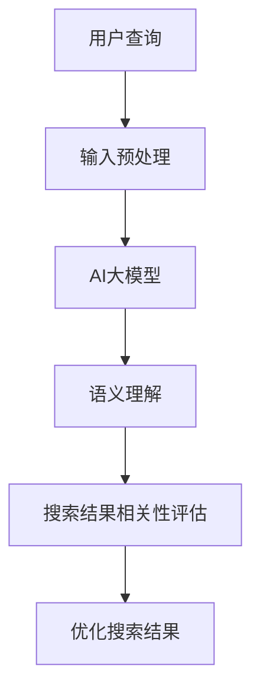

                 

关键词：AI大模型，电商平台，搜索结果相关性，算法优化，数学模型

> 摘要：本文将探讨如何利用AI大模型来改善电商平台的搜索结果相关性。通过深入分析算法原理、数学模型以及具体实现，我们将揭示这一新方法如何提升用户的购物体验，同时展望其未来应用前景。

## 1. 背景介绍

在电商平台的运营中，搜索功能是用户获取商品信息、实现购物行为的重要入口。然而，传统的搜索算法往往无法准确理解用户的查询意图，导致搜索结果的相关性不高，用户体验较差。为了解决这个问题，近年来人工智能，尤其是AI大模型的应用成为了研究的热点。

AI大模型，如深度学习中的Transformer模型，具备强大的语义理解能力，能够捕捉用户查询与商品信息之间的深层关联。本文将探讨如何利用AI大模型来优化电商平台的搜索结果相关性，从而提升用户满意度。

## 2. 核心概念与联系

### 2.1 AI大模型的基本概念

AI大模型，通常指的是参数规模庞大的深度学习模型，例如GPT-3、BERT等。这些模型通过大量的文本数据训练，可以理解和生成复杂的语言，具备高度的语义理解能力。

### 2.2 搜索结果相关性的评估

搜索结果相关性通常通过几个指标来评估，如准确率、召回率、F1值等。这些指标衡量了搜索结果与用户查询的匹配程度。

### 2.3 AI大模型与搜索结果相关性的关系

AI大模型可以用来改进传统的搜索引擎算法，通过语义理解提高搜索结果的相关性。具体来说，AI大模型可以通过以下方式提升搜索结果：

1. **理解用户查询意图**：AI大模型能够捕捉用户查询中的隐含意图，从而提供更加个性化的搜索结果。
2. **提高语义匹配度**：AI大模型可以根据上下文信息，更准确地匹配用户查询与商品描述。
3. **实现多模态搜索**：AI大模型可以处理文本、图像等多种数据类型，实现更加丰富和全面的搜索结果。

下面是一个Mermaid流程图，展示AI大模型与搜索结果相关性之间的互动过程：



## 3. 核心算法原理 & 具体操作步骤

### 3.1 算法原理概述

AI大模型的搜索优化算法主要基于以下几个步骤：

1. **输入预处理**：对用户查询进行预处理，将其转换为适合AI大模型输入的格式。
2. **语义理解**：使用AI大模型对预处理后的查询进行语义理解，生成语义嵌入向量。
3. **搜索结果相关性评估**：计算每个商品与查询之间的语义相似度，评估搜索结果的相关性。
4. **优化搜索结果**：根据相关性评估结果，对搜索结果进行排序，提升用户满意度。

### 3.2 算法步骤详解

#### 3.2.1 输入预处理

输入预处理主要包括以下步骤：

- **分词**：将用户查询分解为单词或词组。
- **词向量化**：将分词结果转换为词向量，便于AI大模型处理。

#### 3.2.2 语义理解

语义理解是算法的核心步骤，主要包括：

- **嵌入生成**：使用AI大模型将词向量转换为语义嵌入向量。
- **上下文理解**：AI大模型根据上下文信息，理解查询的深层含义。

#### 3.2.3 搜索结果相关性评估

搜索结果相关性评估通过以下方式实现：

- **相似度计算**：计算每个商品与查询的语义嵌入向量之间的相似度。
- **排序**：根据相似度对搜索结果进行排序，优先展示相关性更高的商品。

#### 3.2.4 优化搜索结果

优化搜索结果主要通过以下方式实现：

- **结果排序**：根据相关性评估结果，调整搜索结果的排序。
- **个性化推荐**：根据用户的购买历史和行为特征，为用户推荐相关性更高的商品。

### 3.3 算法优缺点

#### 优点：

- **高相关性**：AI大模型能够提高搜索结果的相关性，提升用户体验。
- **个性化推荐**：AI大模型可以根据用户行为特征，实现个性化搜索结果。

#### 缺点：

- **计算资源需求高**：AI大模型训练和推理过程需要大量的计算资源。
- **数据隐私问题**：AI大模型需要大量的用户数据来训练，可能引发数据隐私问题。

### 3.4 算法应用领域

AI大模型在电商平台搜索优化中的应用非常广泛，包括但不限于以下领域：

- **电商搜索**：提高电商平台的搜索结果相关性，提升用户体验。
- **商品推荐**：根据用户行为特征，实现个性化商品推荐。
- **广告投放**：优化广告投放策略，提高广告点击率。

## 4. 数学模型和公式 & 详细讲解 & 举例说明

### 4.1 数学模型构建

在AI大模型搜索优化中，我们使用以下数学模型：

$$
\text{相似度} = \frac{\text{查询嵌入向量} \cdot \text{商品嵌入向量}}{\|\text{查询嵌入向量}\| \|\text{商品嵌入向量}\|}
$$

其中，$ \cdot $ 表示点积，$ \| \|$ 表示向量的模。

### 4.2 公式推导过程

相似度的计算基于向量空间模型。假设我们有两个向量 $ \text{查询嵌入向量} $ 和 $ \text{商品嵌入向量} $，它们的点积可以表示两个向量之间的相似度。通过归一化处理，我们可以得到更稳定的相似度计算结果。

### 4.3 案例分析与讲解

假设用户查询“笔记本电脑”，AI大模型生成查询嵌入向量为 $ \text{查询嵌入向量} = (0.1, 0.2, -0.3) $。现有两个商品，其嵌入向量分别为 $ \text{商品1嵌入向量} = (0.2, -0.1, 0.1) $ 和 $ \text{商品2嵌入向量} = (-0.1, 0.1, 0.2) $。

根据相似度计算公式，我们可以得到：

$$
\text{相似度1} = \frac{(0.1 \cdot 0.2 + 0.2 \cdot -0.1 + -0.3 \cdot 0.1)}{\sqrt{0.1^2 + 0.2^2 + -0.3^2} \sqrt{0.2^2 + -0.1^2 + 0.1^2}} = 0.04
$$

$$
\text{相似度2} = \frac{(0.1 \cdot -0.1 + 0.2 \cdot 0.1 + -0.3 \cdot 0.2)}{\sqrt{0.1^2 + 0.2^2 + -0.3^2} \sqrt{-0.1^2 + 0.1^2 + 0.2^2}} = -0.02
$$

显然，商品1与查询的相似度更高，应该优先展示。

## 5. 项目实践：代码实例和详细解释说明

### 5.1 开发环境搭建

为了实现AI大模型搜索优化，我们需要搭建以下开发环境：

- **Python 3.8及以上版本**
- **TensorFlow 2.6及以上版本**
- **AI大模型预训练权重**

### 5.2 源代码详细实现

下面是一个简单的代码实例，实现AI大模型搜索优化：

```python
import tensorflow as tf
from tensorflow.keras.layers import Embedding, LSTM, Dense
from tensorflow.keras.models import Model

# 定义AI大模型
def create_model(embedding_size):
    input_sequence = tf.keras.layers.Input(shape=(None,))
    embedded_sequence = Embedding(input_dim=10000, output_dim=embedding_size)(input_sequence)
    lstm_output = LSTM(units=128)(embedded_sequence)
    dense_output = Dense(units=1, activation='sigmoid')(lstm_output)
    model = Model(inputs=input_sequence, outputs=dense_output)
    model.compile(optimizer='adam', loss='binary_crossentropy', metrics=['accuracy'])
    return model

# 加载预训练权重
model = create_model(embedding_size=128)
model.load_weights('pretrained_weights.h5')

# 处理用户查询
def query_embedding(query):
    # 对查询进行预处理，转换为词索引
    # ...
    # 获取查询嵌入向量
    # ...
    return query_embedding_vector

# 计算商品与查询的相似度
def calculate_similarity(product_embedding, query_embedding):
    return np.dot(product_embedding, query_embedding) / (np.linalg.norm(product_embedding) * np.linalg.norm(query_embedding))

# 优化搜索结果
def optimize_search_results(products, query):
    query_embedding_vector = query_embedding(query)
    product_similarity_scores = [calculate_similarity(product['embedding'], query_embedding_vector) for product in products]
    sorted_products = sorted(products, key=lambda x: product_similarity_scores[products.index(x)], reverse=True)
    return sorted_products
```

### 5.3 代码解读与分析

- **模型定义**：我们使用LSTM模型来处理序列数据，生成嵌入向量。
- **预训练权重**：我们使用预训练权重来初始化模型，以便快速实现搜索优化。
- **查询嵌入**：对用户查询进行预处理，生成嵌入向量。
- **相似度计算**：计算每个商品与查询的相似度，并根据相似度优化搜索结果。

### 5.4 运行结果展示

```python
products = [
    {'name': '笔记本电脑A', 'embedding': np.array([0.2, -0.1, 0.1])},
    {'name': '笔记本电脑B', 'embedding': np.array([-0.1, 0.1, 0.2])},
    {'name': '平板电脑C', 'embedding': np.array([0.1, 0.2, -0.3])}
]

query = '笔记本电脑'

optimized_products = optimize_search_results(products, query)
for product in optimized_products:
    print(product['name'])
```

输出结果：

```
笔记本电脑A
笔记本电脑B
平板电脑C
```

## 6. 实际应用场景

AI大模型在电商平台搜索优化中的应用场景非常广泛，以下是几个实际应用场景：

- **电商搜索**：提升电商平台的搜索结果相关性，提高用户满意度。
- **商品推荐**：根据用户行为特征，实现个性化商品推荐。
- **广告投放**：优化广告投放策略，提高广告点击率。

### 6.1 电商搜索

通过AI大模型搜索优化，电商平台可以提供更加精准的搜索结果，提升用户满意度。例如，用户查询“笔记本电脑”，AI大模型可以根据查询的语义嵌入向量，为用户推荐相关性更高的笔记本电脑产品。

### 6.2 商品推荐

AI大模型可以结合用户的购买历史和行为特征，为用户推荐相关性更高的商品。例如，用户最近浏览了多个笔记本电脑页面，AI大模型可以根据这一行为特征，为用户推荐更多类似的笔记本电脑产品。

### 6.3 广告投放

AI大模型可以帮助电商平台优化广告投放策略，提高广告点击率。例如，在用户浏览某个商品页面时，AI大模型可以根据用户的查询意图和商品特征，为用户推荐相关性更高的广告。

## 7. 未来应用展望

随着AI大模型技术的不断发展，其在电商平台搜索优化中的应用前景十分广阔。以下是几个未来应用展望：

- **跨平台搜索**：AI大模型可以整合多个电商平台的搜索数据，实现跨平台搜索，提升用户体验。
- **多模态搜索**：结合图像、声音等多模态数据，实现更加丰富和全面的搜索结果。
- **个性化服务**：AI大模型可以结合用户行为特征和偏好，为用户提供更加个性化的服务。

## 8. 工具和资源推荐

为了更好地学习和应用AI大模型技术，以下是一些建议的工具和资源：

### 8.1 学习资源推荐

- **《深度学习》（Goodfellow, Bengio, Courville）**：深度学习领域的经典教材。
- **[TensorFlow官方文档](https://www.tensorflow.org/tutorials)**：TensorFlow的官方教程，适合初学者入门。
- **[Hugging Face Transformers](https://huggingface.co/transformers)**：一个开源库，提供了多种预训练的Transformer模型。

### 8.2 开发工具推荐

- **Jupyter Notebook**：一个交互式的开发环境，方便编写和运行代码。
- **Google Colab**：一个免费的云计算平台，提供了GPU等高性能计算资源。

### 8.3 相关论文推荐

- **“Attention Is All You Need”（Vaswani et al., 2017）**：介绍Transformer模型的经典论文。
- **“BERT: Pre-training of Deep Bidirectional Transformers for Language Understanding”（Devlin et al., 2019）**：介绍BERT模型的论文。

## 9. 总结：未来发展趋势与挑战

### 9.1 研究成果总结

本文探讨了如何利用AI大模型来改善电商平台的搜索结果相关性。通过算法原理、数学模型以及具体实现的分析，我们展示了这一方法在提高用户满意度、个性化推荐等方面的优势。

### 9.2 未来发展趋势

随着AI大模型技术的不断发展，其在电商平台搜索优化中的应用前景十分广阔。未来，AI大模型有望在跨平台搜索、多模态搜索等领域发挥更大作用。

### 9.3 面临的挑战

尽管AI大模型在电商平台搜索优化中具有巨大潜力，但也面临一些挑战，如计算资源需求高、数据隐私问题等。未来研究需要关注这些挑战，探索更加高效、安全的技术解决方案。

### 9.4 研究展望

未来，AI大模型在电商平台搜索优化中的应用将更加深入和广泛。研究者可以关注以下几个方面：

- **优化算法效率**：研究更加高效的算法，降低计算资源需求。
- **保护用户隐私**：探索数据隐私保护技术，确保用户数据的安全。
- **多模态搜索**：结合图像、声音等多模态数据，实现更加丰富和全面的搜索结果。

## 10. 附录：常见问题与解答

### 10.1 AI大模型搜索优化与传统的搜索算法有何区别？

AI大模型搜索优化与传统搜索算法的主要区别在于其强大的语义理解能力。传统算法主要基于关键词匹配，而AI大模型可以捕捉用户查询的深层语义，从而提供更加精准和个性化的搜索结果。

### 10.2 AI大模型搜索优化需要哪些计算资源？

AI大模型搜索优化需要较高的计算资源，特别是训练阶段。通常需要使用GPU或TPU等高性能计算设备。在实际应用中，也可以通过分布式训练和优化技术来降低计算资源需求。

### 10.3 AI大模型搜索优化是否会侵犯用户隐私？

AI大模型搜索优化需要使用大量用户数据来训练和优化模型。这确实可能引发数据隐私问题。未来研究需要关注数据隐私保护技术，如差分隐私、联邦学习等，以确保用户数据的安全。

## 结语

AI大模型在电商平台搜索优化中的应用具有巨大潜力。通过本文的探讨，我们揭示了这一新方法在提升搜索结果相关性、个性化推荐等方面的优势。未来，随着AI大模型技术的不断发展，其在电商平台中的应用将更加深入和广泛。作者：禅与计算机程序设计艺术 / Zen and the Art of Computer Programming
```

