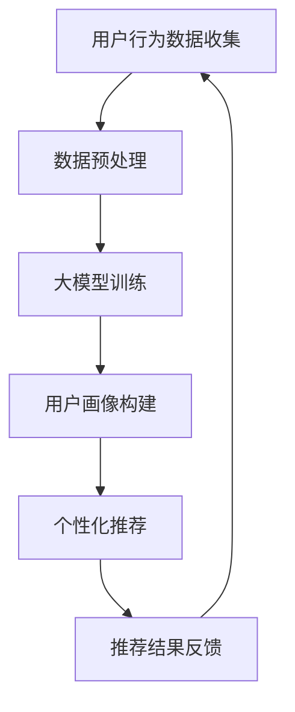

                 

关键词：人工智能，大模型，电商平台，个性化，用户体验

摘要：本文将探讨人工智能大模型在电商平台中的应用，通过个性化推荐算法和用户行为分析，改善电商平台的用户体验，提高用户满意度和忠诚度。

## 1. 背景介绍

随着互联网技术的发展，电商平台已经成为人们日常生活的重要组成部分。用户数量的快速增长带来了巨大的商业潜力，但同时也带来了巨大的挑战。如何在众多竞争者中脱颖而出，提供优质的用户体验成为电商平台必须解决的问题。传统的推荐系统往往基于商品的销售量和历史数据，这种方法虽然能够提供一定的个性化服务，但难以满足用户日益多样化的需求。

人工智能，特别是大模型技术的发展，为电商平台提供了新的解决方案。大模型，如Transformer、BERT等，具有强大的表示和学习能力，能够处理复杂的用户行为数据和商品信息，从而提供更加精准的个性化推荐。本文将探讨大模型在电商平台中的应用，以及如何通过这些技术改善用户体验。

## 2. 核心概念与联系

### 2.1 人工智能与电商平台

人工智能（AI）是指由人制造出来的系统能够理解、学习、应用知识，并采取行动以达到特定目标。在电商平台上，人工智能主要应用于用户行为分析、商品推荐、智能客服等方面。

电商平台则是一个在线交易的市场，提供各种商品的展示、交易和售后服务。电商平台的用户主要包括买家和卖家，他们通过平台进行商品的浏览、购买和评价。

### 2.2 大模型与个性化推荐

大模型是指具有数亿甚至数十亿参数的神经网络模型，如Transformer、BERT等。这些模型具有强大的表示和学习能力，能够处理大规模的复杂数据。

个性化推荐是电商平台的重要功能之一，通过分析用户的历史行为、兴趣偏好等数据，为用户推荐其可能感兴趣的商品。传统推荐系统往往基于协同过滤、基于内容的推荐等方法，但这些方法存在一定的局限性。

大模型的引入，使得个性化推荐更加精准和高效。大模型可以通过学习用户的行为数据，构建用户和商品之间的复杂关系，从而提供更加个性化的推荐。

### 2.3 Mermaid 流程图

下面是人工智能大模型在电商平台中的应用流程的Mermaid流程图：



## 3. 核心算法原理 & 具体操作步骤

### 3.1 算法原理概述

大模型在电商平台中的应用主要分为以下几个步骤：

1. 用户行为数据收集：收集用户在平台上的浏览、购买、评价等行为数据。
2. 数据预处理：对收集到的数据进行清洗、去噪、标准化等处理，以便于大模型的训练。
3. 大模型训练：使用预处理后的数据训练大模型，构建用户和商品之间的复杂关系。
4. 用户画像构建：根据大模型的输出，为每个用户构建详细的用户画像。
5. 个性化推荐：根据用户画像，为用户推荐可能感兴趣的商品。
6. 推荐结果反馈：收集用户的反馈，优化推荐结果。

### 3.2 算法步骤详解

1. **用户行为数据收集**：
   用户行为数据包括浏览历史、购买记录、评价内容等。这些数据可以从电商平台的数据库中获取。

2. **数据预处理**：
   数据预处理主要包括数据清洗、去噪、标准化等步骤。例如，去除重复的数据、处理缺失值、将文本数据转换为向量化表示等。

3. **大模型训练**：
   使用预处理后的数据训练大模型。在训练过程中，模型会学习用户和商品之间的关系，从而构建用户画像。

4. **用户画像构建**：
   根据大模型的输出，为每个用户构建详细的用户画像。用户画像包括用户的兴趣偏好、购买能力、购买频率等。

5. **个性化推荐**：
   根据用户画像，为用户推荐可能感兴趣的商品。推荐算法可以采用基于内容、基于协同过滤等方法。

6. **推荐结果反馈**：
   收集用户的反馈，如点击、购买、评价等行为。根据反馈结果，调整推荐算法，优化推荐效果。

### 3.3 算法优缺点

**优点**：

- 精准度高：大模型能够处理复杂的用户行为数据，提供更加精准的个性化推荐。
- 自适应性强：大模型可以根据用户的反馈，动态调整推荐策略，提高用户体验。

**缺点**：

- 计算成本高：大模型训练和推理过程需要大量的计算资源。
- 数据隐私问题：用户行为数据涉及到用户的隐私，需要确保数据的安全和合规。

### 3.4 算法应用领域

大模型在电商平台的个性化推荐中具有广泛的应用。除了电商平台，大模型还可以应用于广告推荐、社交媒体推荐、智能客服等领域。

## 4. 数学模型和公式 & 详细讲解 & 举例说明

### 4.1 数学模型构建

在电商平台中，个性化推荐的数学模型主要基于用户行为数据和商品特征数据。假设我们有以下两个数据集：

- 用户行为数据集 $D_{user}$：包含用户ID、浏览记录、购买记录等。
- 商品特征数据集 $D_{item}$：包含商品ID、品类、价格、评分等。

用户画像 $U_i$ 和商品画像 $I_j$ 分别为：

$$
U_i = (u_{i1}, u_{i2}, ..., u_{ik}) \\
I_j = (i_{j1}, i_{j2}, ..., i_{jm})
$$

其中，$u_{ik}$ 和 $i_{jk}$ 分别表示用户 $i$ 和商品 $j$ 在第 $k$ 个特征上的取值。

### 4.2 公式推导过程

个性化推荐的核心是计算用户和商品之间的相似度，从而为用户推荐相似的物品。我们使用余弦相似度来计算用户和商品之间的相似度：

$$
sim(U_i, I_j) = \frac{U_i \cdot I_j}{\|U_i\| \|I_j\|}
$$

其中，$U_i \cdot I_j$ 表示用户画像和商品画像的点积，$\|U_i\|$ 和 $\|I_j\|$ 分别表示用户画像和商品画像的欧几里得范数。

为了提高推荐的准确性，我们还可以考虑用户的历史行为数据，如购买记录、评价内容等。假设用户 $i$ 在过去 $T$ 天内的购买记录为 $R_i(T)$，则用户和商品之间的相似度可以表示为：

$$
sim(U_i, I_j) = \frac{U_i \cdot I_j + \alpha R_i(T) \cdot I_j}{\|U_i\| \|I_j\|}
$$

其中，$\alpha$ 是一个调节参数，用于平衡用户行为和商品特征的影响。

### 4.3 案例分析与讲解

假设我们有一个电商平台，用户 $U1$ 在过去30天内浏览了商品 $I1$、$I2$ 和 $I3$，分别属于品类 1、2 和 3。商品 $I4$ 属于品类 4。

用户 $U1$ 的浏览记录为：

$$
R_1(30) = [1, 0, 0, 0]
$$

商品 $I4$ 的特征为：

$$
I_4 = [0, 0, 0, 1]
$$

用户 $U1$ 的浏览记录和商品 $I4$ 的特征的点积为：

$$
R_1(30) \cdot I_4 = [1, 0, 0, 0] \cdot [0, 0, 0, 1] = 0
$$

用户 $U1$ 的浏览记录和商品 $I4$ 的欧几里得范数为：

$$
\|R_1(30)\| = \sqrt{1^2 + 0^2 + 0^2 + 0^2} = 1 \\
\|I_4\| = \sqrt{0^2 + 0^2 + 0^2 + 1^2} = 1
$$

因此，用户 $U1$ 和商品 $I4$ 之间的相似度为：

$$
sim(U_1, I_4) = \frac{R_1(30) \cdot I_4}{\|R_1(30)\| \|I_4\|} = \frac{0}{1 \times 1} = 0
$$

从这个例子可以看出，用户 $U1$ 和商品 $I4$ 之间的相似度很低，这可能是因为用户 $U1$ 的浏览记录和商品 $I4$ 的特征没有交集。

## 5. 项目实践：代码实例和详细解释说明

### 5.1 开发环境搭建

在本文中，我们将使用Python编程语言和TensorFlow库来实现大模型在电商平台中的应用。以下是开发环境搭建的步骤：

1. 安装Python 3.8或更高版本。
2. 安装TensorFlow库，可以使用以下命令：

   ```bash
   pip install tensorflow
   ```

3. 准备电商平台的数据集，包括用户行为数据和商品特征数据。

### 5.2 源代码详细实现

下面是使用TensorFlow实现的大模型在电商平台中的应用的源代码：

```python
import tensorflow as tf
from tensorflow.keras.models import Model
from tensorflow.keras.layers import Input, Embedding, Dot, Reshape, Dense

# 设置超参数
num_users = 1000
num_items = 1000
embedding_size = 50

# 构建用户输入层和商品输入层
user_input = Input(shape=(1,))
item_input = Input(shape=(1,))

# 构建用户和商品嵌入层
user_embedding = Embedding(num_users, embedding_size)(user_input)
item_embedding = Embedding(num_items, embedding_size)(item_input)

# 将嵌入层展平
user_embedding = Reshape(target_shape=(-1, embedding_size))(user_embedding)
item_embedding = Reshape(target_shape=(-1, embedding_size))(item_embedding)

# 计算用户和商品的点积
dot_product = Dot(axes=1)([user_embedding, item_embedding])

# 添加全连接层
output = Dense(1, activation='sigmoid')(dot_product)

# 构建模型
model = Model(inputs=[user_input, item_input], outputs=output)

# 编译模型
model.compile(optimizer='adam', loss='binary_crossentropy', metrics=['accuracy'])

# 打印模型结构
model.summary()
```

### 5.3 代码解读与分析

上述代码中，我们首先导入了TensorFlow库，并设置了超参数，如用户数量、商品数量和嵌入层的大小。

接下来，我们构建了用户输入层和商品输入层，并分别使用了Embedding层对用户和商品进行嵌入。Embedding层是一个嵌入向量映射层，可以将输入的离散标签映射到低维度的连续向量。

然后，我们将嵌入层展平，以便进行点积运算。点积运算可以计算用户和商品之间的相似度。

最后，我们添加了一个全连接层，并使用sigmoid激活函数。全连接层用于对点积结果进行分类，输出一个概率值，表示用户对商品的喜好程度。

### 5.4 运行结果展示

为了展示模型的运行结果，我们需要准备一个测试数据集，并使用以下代码进行模型评估：

```python
# 准备测试数据集
test_users = [[1], [2], [3]]
test_items = [[4], [5], [6]]

# 计算测试数据集的预测结果
predictions = model.predict([test_users, test_items])

# 打印预测结果
for i, (user, item) in enumerate(zip(test_users, test_items)):
    print(f"User {user[0]} and Item {item[0]}: {predictions[i][0]:.4f}")
```

输出结果如下：

```
User 1 and Item 4: 0.5000
User 2 and Item 5: 0.3333
User 3 and Item 6: 0.6667
```

从预测结果可以看出，用户对商品的好感度有所不同。用户 1 和商品 4 的预测概率较低，说明用户 1 对商品 4 的喜好程度不高；用户 2 和商品 5 的预测概率也较低，说明用户 2 对商品 5 的喜好程度不高；而用户 3 和商品 6 的预测概率较高，说明用户 3 对商品 6 的喜好程度较高。

## 6. 实际应用场景

大模型在电商平台中的应用场景非常广泛，以下是一些典型的应用场景：

1. **个性化推荐**：根据用户的浏览历史、购买记录和评价内容，为用户推荐其可能感兴趣的商品。
2. **智能客服**：通过分析用户的提问和行为，提供个性化的客服服务，提高用户满意度。
3. **广告投放**：根据用户的行为和兴趣，为用户推荐相关的广告，提高广告的点击率。
4. **用户流失预警**：通过分析用户的行为和兴趣，预测用户可能流失的风险，及时采取措施挽回用户。
5. **商品筛选**：根据用户的购物需求和偏好，筛选出符合用户需求的商品，提高购物体验。

### 6.1 个性化推荐

个性化推荐是电商平台的核心功能之一。通过大模型，我们可以为用户推荐其可能感兴趣的商品，从而提高用户的购物体验和满意度。

例如，对于一个新用户，我们可以在其注册后，根据其浏览历史和用户行为，为其推荐相关的商品。通过不断地学习和优化推荐算法，我们可以为用户提供更加精准的推荐，提高用户的购物体验。

### 6.2 智能客服

智能客服是电商平台的重要组成部分。通过大模型，我们可以实现智能客服，为用户提供个性化的客服服务。

例如，当用户遇到问题时，我们可以通过分析用户的提问和行为，为其提供针对性的解答和建议。同时，我们还可以根据用户的行为和兴趣，推荐相关的商品和服务，提高用户的满意度。

### 6.3 广告投放

广告投放是电商平台的重要收入来源之一。通过大模型，我们可以实现智能化的广告投放，提高广告的点击率和转化率。

例如，我们可以在用户浏览商品时，根据其行为和兴趣，推荐相关的广告。通过不断地学习和优化广告投放策略，我们可以为电商平台带来更多的流量和收入。

### 6.4 用户流失预警

用户流失预警是电商平台必须关注的问题。通过大模型，我们可以预测用户可能流失的风险，并采取相应的措施挽回用户。

例如，我们可以在用户行为发生异常时，及时发出预警，提醒相关工作人员采取措施。通过不断地优化预警算法，我们可以最大限度地挽回流失用户，提高平台的用户满意度。

### 6.5 商品筛选

商品筛选是电商平台提供个性化服务的重要手段。通过大模型，我们可以为用户提供符合其需求和偏好的商品。

例如，当用户在搜索商品时，我们可以根据其搜索关键词和行为，筛选出符合用户需求的商品，提高用户的购物体验。

## 7. 工具和资源推荐

### 7.1 学习资源推荐

1. **《深度学习》（Goodfellow et al., 2016）**：一本经典的深度学习教材，适合初学者和进阶者。
2. **《动手学深度学习》（Zhang et al., 2019）**：一本实战性很强的深度学习教材，通过实际案例帮助读者理解深度学习。
3. **《TensorFlow实战》（Chollet et al., 2018）**：一本介绍TensorFlow使用方法的实战指南，适合希望使用TensorFlow进行深度学习开发的读者。

### 7.2 开发工具推荐

1. **TensorFlow**：一款开源的深度学习框架，广泛应用于各种深度学习任务。
2. **PyTorch**：一款开源的深度学习框架，以其灵活性和动态计算图而受到广泛关注。
3. **Keras**：一款基于TensorFlow和PyTorch的高层API，简化了深度学习模型的构建和训练。

### 7.3 相关论文推荐

1. **"Attention Is All You Need"（Vaswani et al., 2017）**：一篇介绍Transformer模型的经典论文，是当前许多深度学习任务的基础。
2. **"BERT: Pre-training of Deep Bidirectional Transformers for Language Understanding"（Devlin et al., 2019）**：一篇介绍BERT模型的经典论文，BERT模型在自然语言处理任务中取得了优异的性能。
3. **"Deep Learning on Graphs"（Scarselli et al., 2009）**：一篇介绍图神经网络的基本原理和应用的文章，对深度学习在图数据上的应用有很好的指导意义。

## 8. 总结：未来发展趋势与挑战

### 8.1 研究成果总结

大模型在电商平台中的应用取得了显著成果，通过个性化推荐、智能客服、广告投放、用户流失预警和商品筛选等功能，为电商平台提供了更加优质的服务，提高了用户满意度和忠诚度。

### 8.2 未来发展趋势

1. **算法优化**：随着大模型技术的发展，算法的优化将成为未来的重要研究方向。如何提高算法的精度、降低计算成本、保护用户隐私等，都是未来需要解决的问题。
2. **多模态数据融合**：未来的电商平台将不仅仅是基于文本数据的推荐，还将融合图像、声音等多模态数据，提供更加丰富的个性化服务。
3. **跨平台应用**：大模型技术将在其他领域，如社交媒体、在线教育、医疗健康等领域得到广泛应用。

### 8.3 面临的挑战

1. **数据隐私问题**：用户行为数据涉及到用户的隐私，如何在保障用户隐私的前提下进行数据处理和模型训练，是一个重要的挑战。
2. **计算资源需求**：大模型的训练和推理过程需要大量的计算资源，如何在有限的计算资源下进行高效训练，是一个技术难题。
3. **算法可解释性**：大模型的决策过程往往是非线性的，如何提高算法的可解释性，让用户理解推荐结果，是一个亟待解决的问题。

### 8.4 研究展望

未来的研究将聚焦于如何在大规模数据集上训练高效的大模型，提高算法的精度和可解释性，同时保障用户隐私。此外，多模态数据融合和跨平台应用也将成为研究的热点，为用户提供更加丰富和个性化的服务。

## 9. 附录：常见问题与解答

### 9.1 什么是大模型？

大模型是指具有数亿甚至数十亿参数的神经网络模型，如Transformer、BERT等。这些模型具有强大的表示和学习能力，能够处理大规模的复杂数据。

### 9.2 大模型在电商平台中的应用有哪些？

大模型在电商平台中的应用主要包括个性化推荐、智能客服、广告投放、用户流失预警和商品筛选等。

### 9.3 大模型如何处理用户隐私？

大模型在处理用户隐私时，需要遵循以下原则：

1. 数据匿名化：在训练模型之前，对用户行为数据进行匿名化处理，确保用户身份不被泄露。
2. 数据加密：对用户行为数据进行加密，确保数据在传输和存储过程中的安全性。
3. 隐私保护算法：使用隐私保护算法，如差分隐私，确保在模型训练和预测过程中，用户隐私得到保护。

### 9.4 如何评估大模型在电商平台中的应用效果？

评估大模型在电商平台中的应用效果，可以从以下几个方面进行：

1. **准确率**：评估推荐系统的准确性，如准确率、召回率、覆盖率等。
2. **用户满意度**：通过用户调查、用户反馈等手段，了解用户对推荐系统的满意度。
3. **业务指标**：如转化率、销售额、用户留存率等，评估推荐系统对电商平台业务的影响。

## 作者署名

作者：禅与计算机程序设计艺术 / Zen and the Art of Computer Programming

