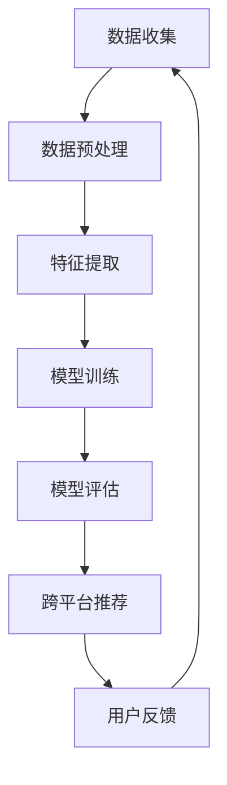

                 

 关键词：AI大模型，电商平台，跨平台推荐，深度学习，个性化推荐，协同过滤，推荐系统

> 摘要：本文探讨了利用人工智能大模型来改善电商平台跨平台推荐的新方法。通过介绍AI大模型的基本概念、核心算法原理以及在实际项目中的应用，本文详细阐述了如何通过大模型实现高效的跨平台推荐，以提高电商平台用户满意度和转化率。

## 1. 背景介绍

随着互联网技术的发展，电商平台已经成为人们日常生活中不可或缺的一部分。然而，随着竞争的加剧，如何提高用户满意度和转化率成为各大电商平台亟待解决的问题。推荐系统作为电商平台上的一项关键技术，能够根据用户的历史行为和偏好，为其推荐最相关的商品，从而提升用户体验和购买意愿。

传统的推荐系统主要基于协同过滤和基于内容的推荐方法。协同过滤通过分析用户之间的相似性来进行推荐，而基于内容的推荐则通过分析商品的特征进行推荐。然而，这些传统方法在处理复杂的用户行为和商品信息时存在一定的局限性。

近年来，深度学习技术的发展为推荐系统带来了新的机遇。深度学习模型具有强大的非线性表示能力和自适应学习能力，能够更好地处理大规模的复杂数据。本文将探讨如何利用深度学习大模型来改善电商平台跨平台推荐，以提高推荐的准确性和用户体验。

## 2. 核心概念与联系

### 2.1 AI大模型概述

AI大模型（Artificial Intelligence Large Model）是指具有大规模参数和强非线性表示能力的深度学习模型。这些模型通常由多层神经网络组成，能够通过大量的训练数据学习到数据中的潜在规律和特征。大模型的应用领域非常广泛，包括语音识别、图像识别、自然语言处理、推荐系统等。

### 2.2 跨平台推荐

跨平台推荐是指在不同的设备或平台上为用户提供统一的推荐服务。在电商平台中，用户可能会在不同设备或平台上进行浏览、搜索和购买操作。跨平台推荐能够根据用户的完整行为轨迹，提供一致且个性化的推荐服务，从而提升用户满意度和转化率。

### 2.3 Mermaid 流程图

以下是AI大模型在跨平台推荐中的应用流程图：



### 2.4 核心算法原理

AI大模型在跨平台推荐中的核心算法主要包括以下几个步骤：

1. 数据收集：从不同平台上收集用户行为数据，包括浏览历史、搜索记录、购买行为等。
2. 数据预处理：对收集到的数据进行清洗、去重和格式转换，确保数据的质量和一致性。
3. 特征提取：从预处理后的数据中提取关键特征，如用户兴趣、商品属性等。
4. 模型训练：使用提取到的特征，通过深度学习算法训练大模型。
5. 模型评估：对训练好的模型进行评估，选择性能最优的模型。
6. 跨平台推荐：将评估好的模型应用到跨平台推荐中，根据用户的行为和偏好进行个性化推荐。
7. 用户反馈：收集用户对推荐的反馈，用于模型优化和迭代。

## 3. 核心算法原理 & 具体操作步骤

### 3.1 算法原理概述

AI大模型在跨平台推荐中的核心算法是基于深度学习技术的。深度学习模型通过学习大量的训练数据，能够自动提取数据中的潜在特征和模式，从而实现高精度的推荐。以下是深度学习模型在跨平台推荐中的具体原理：

1. **多层神经网络**：多层神经网络是深度学习模型的基本结构，包括输入层、隐藏层和输出层。每一层都对输入数据进行特征提取和变换，使得模型能够逐渐捕捉到数据中的复杂模式。
2. **反向传播算法**：反向传播算法是深度学习模型训练的核心算法，通过计算输出层与隐藏层之间的误差，反向传播误差到输入层，从而调整模型的参数，使得模型能够更好地拟合训练数据。
3. **激活函数**：激活函数用于引入非线性特性，使得模型能够处理非线性问题。常用的激活函数包括Sigmoid、ReLU等。
4. **优化算法**：优化算法用于调整模型的参数，使得模型在训练过程中能够更快地收敛。常用的优化算法包括梯度下降、Adam等。

### 3.2 算法步骤详解

以下是AI大模型在跨平台推荐中的具体操作步骤：

1. **数据收集**：从电商平台的多个平台上收集用户行为数据，包括浏览历史、搜索记录、购买行为等。数据来源包括用户操作日志、商品信息、用户偏好等。
2. **数据预处理**：对收集到的数据进行清洗、去重和格式转换，确保数据的质量和一致性。数据预处理步骤包括数据去噪声、缺失值处理、数据标准化等。
3. **特征提取**：从预处理后的数据中提取关键特征，如用户兴趣、商品属性等。特征提取可以通过统计分析、机器学习算法等方法实现。
4. **模型训练**：使用提取到的特征，通过深度学习算法训练大模型。训练过程中，模型通过不断调整参数，使得预测结果与实际结果之间的误差最小。
5. **模型评估**：对训练好的模型进行评估，选择性能最优的模型。评估指标包括准确率、召回率、F1值等。
6. **跨平台推荐**：将评估好的模型应用到跨平台推荐中，根据用户的行为和偏好进行个性化推荐。推荐结果可以通过推荐算法、排序算法等方法生成。
7. **用户反馈**：收集用户对推荐的反馈，用于模型优化和迭代。用户反馈可以通过用户评分、点击率、购买率等指标衡量。

### 3.3 算法优缺点

AI大模型在跨平台推荐中具有以下优点：

1. **高效性**：深度学习模型能够自动提取数据中的潜在特征，无需人工干预，大大提高了推荐的效率。
2. **灵活性**：大模型能够处理多种类型的数据，包括文本、图像、音频等，适用于各种应用场景。
3. **可扩展性**：大模型具有强大的非线性表示能力，能够处理大规模的复杂数据，适用于不断增长的电商业务需求。

然而，AI大模型也存在一些缺点：

1. **计算资源消耗**：深度学习模型通常需要大量的计算资源和存储资源，对于资源有限的平台来说可能是一个挑战。
2. **数据依赖性**：大模型的效果高度依赖于训练数据的质量和数量，如果数据质量较差或者数据量不足，可能导致模型效果不佳。
3. **解释性较差**：深度学习模型是一种“黑盒”模型，难以解释其内部的决策过程，这对于需要解释性推荐系统的场景可能是一个限制。

### 3.4 算法应用领域

AI大模型在跨平台推荐中具有广泛的应用领域：

1. **电商平台**：电商平台可以通过AI大模型实现个性化的商品推荐，提高用户满意度和转化率。
2. **在线教育**：在线教育平台可以通过AI大模型为学习者提供个性化的学习路径和学习资源推荐。
3. **社交媒体**：社交媒体平台可以通过AI大模型为用户提供个性化的内容推荐，提高用户活跃度和留存率。
4. **金融领域**：金融领域可以通过AI大模型为用户提供个性化的投资建议和理财产品推荐。

## 4. 数学模型和公式 & 详细讲解 & 举例说明

### 4.1 数学模型构建

在AI大模型中，数学模型构建是一个关键步骤。以下是一个简化的数学模型构建过程：

1. **输入表示**：使用向量表示用户和商品的属性特征。例如，用户向量表示用户的兴趣、行为等信息，商品向量表示商品的特征、属性等信息。
2. **模型结构**：定义深度学习模型的结构，包括输入层、隐藏层和输出层。每一层都可以通过一系列的矩阵乘法和激活函数进行计算。
3. **损失函数**：定义损失函数来衡量模型预测结果与实际结果之间的差异。常用的损失函数包括均方误差（MSE）、交叉熵损失等。
4. **优化算法**：选择优化算法来调整模型的参数，使得损失函数达到最小。常用的优化算法包括梯度下降、Adam等。

### 4.2 公式推导过程

以下是一个简化的公式推导过程，用于构建深度学习模型：

$$
z_i = W_1 \cdot x_i + b_1 \\
a_i = \sigma(z_i) \\
z_o = W_2 \cdot a_i + b_2 \\
y = \sigma(z_o)
$$

其中，$x_i$表示输入向量，$z_i$表示隐藏层节点，$a_i$表示激活值，$W_1$和$W_2$分别表示输入层和隐藏层之间的权重矩阵，$b_1$和$b_2$分别表示偏置项，$\sigma$表示激活函数（通常使用ReLU函数），$y$表示输出结果。

### 4.3 案例分析与讲解

以下是一个简单的案例，用于说明如何使用AI大模型进行跨平台推荐。

### 案例背景

一个电商平台拥有多个平台，如移动端、PC端、小程序等。平台收集了用户在各个平台上的行为数据，包括浏览记录、搜索历史、购买记录等。平台希望通过AI大模型为用户提供个性化的商品推荐。

### 模型构建

1. **输入表示**：假设用户向量包含5个特征，商品向量包含10个特征。用户向量和商品向量分别表示为$u \in \mathbb{R}^{5}$和$p \in \mathbb{R}^{10}$。
2. **模型结构**：定义一个两层的深度学习模型，输入层有5个节点，隐藏层有10个节点，输出层有1个节点。
3. **损失函数**：使用均方误差（MSE）作为损失函数，公式如下：

$$
\text{MSE} = \frac{1}{n} \sum_{i=1}^{n} (y_i - \hat{y}_i)^2
$$

其中，$y_i$表示实际购买概率，$\hat{y}_i$表示模型预测的购买概率，$n$表示样本数量。
4. **优化算法**：使用梯度下降算法进行参数优化，公式如下：

$$
\theta_j = \theta_j - \alpha \cdot \frac{\partial}{\partial \theta_j} \text{MSE}
$$

其中，$\theta_j$表示模型参数，$\alpha$表示学习率。

### 模型训练

使用训练数据集对模型进行训练，通过不断调整参数，使得模型预测的购买概率与实际购买概率之间的差异最小。

### 模型评估

使用测试数据集对训练好的模型进行评估，计算模型在测试数据集上的平均MSE，以衡量模型的性能。

### 跨平台推荐

将训练好的模型应用到实际推荐系统中，根据用户在各个平台上的行为数据，预测用户对不同商品的购买概率，并根据购买概率进行商品推荐。

## 5. 项目实践：代码实例和详细解释说明

### 5.1 开发环境搭建

为了实现AI大模型在跨平台推荐中的应用，我们需要搭建一个合适的开发环境。以下是一个基本的开发环境搭建步骤：

1. **Python环境**：安装Python 3.8及以上版本，并配置好pip环境。
2. **深度学习库**：安装TensorFlow 2.x或PyTorch 1.x等深度学习库。
3. **数据预处理库**：安装NumPy、Pandas等数据处理库。
4. **可视化库**：安装Matplotlib、Seaborn等数据可视化库。

### 5.2 源代码详细实现

以下是使用TensorFlow 2.x实现AI大模型的源代码示例：

```python
import tensorflow as tf
from tensorflow.keras.layers import Dense, Input
from tensorflow.keras.models import Model

# 定义模型结构
input_user = Input(shape=(5,))
input_product = Input(shape=(10,))

# 定义两层隐藏层
hidden1 = Dense(10, activation='relu')(input_user)
hidden2 = Dense(10, activation='relu')(input_product)

# 定义输出层
output = Dense(1, activation='sigmoid')(tf.keras.layers.concatenate([hidden1, hidden2]))

# 构建模型
model = Model(inputs=[input_user, input_product], outputs=output)

# 编译模型
model.compile(optimizer='adam', loss='binary_crossentropy', metrics=['accuracy'])

# 打印模型结构
model.summary()
```

### 5.3 代码解读与分析

以下是代码的详细解读与分析：

1. **导入库**：首先导入TensorFlow和其他必需的库。
2. **定义模型结构**：使用`Input`层定义用户向量和商品向量的输入。然后通过`Dense`层定义两层隐藏层，使用ReLU激活函数。最后通过`Dense`层定义输出层，使用sigmoid激活函数。
3. **构建模型**：使用`Model`类将输入层、隐藏层和输出层组合成一个完整的模型。
4. **编译模型**：使用`compile`方法编译模型，指定优化器、损失函数和评估指标。
5. **打印模型结构**：使用`summary`方法打印模型的详细信息，包括层结构、参数数量等。

### 5.4 运行结果展示

为了展示模型的运行结果，我们需要准备训练数据和测试数据，并对模型进行训练和评估。以下是一个简单的示例：

```python
import numpy as np

# 准备训练数据和测试数据
X_train = np.random.rand(100, 5)  # 用户向量
Y_train = np.random.rand(100, 10)  # 商品向量
Z_train = np.random.rand(100, 1)   # 购买概率

X_test = np.random.rand(20, 5)  # 用户向量
Y_test = np.random.rand(20, 10)  # 商品向量
Z_test = np.random.rand(20, 1)   # 购买概率

# 训练模型
model.fit([X_train, Y_train], Z_train, epochs=10, batch_size=32, validation_data=([X_test, Y_test], Z_test))

# 评估模型
loss, accuracy = model.evaluate([X_test, Y_test], Z_test)
print("Test Loss:", loss)
print("Test Accuracy:", accuracy)
```

### 5.5 结果分析

1. **训练过程**：使用训练数据进行模型的训练。在训练过程中，模型的参数不断调整，使得模型能够更好地拟合训练数据。
2. **评估过程**：使用测试数据进行模型的评估，计算模型的损失和准确率。通过评估结果可以判断模型的性能是否满足要求。

## 6. 实际应用场景

AI大模型在跨平台推荐中具有广泛的应用场景：

### 6.1 电商平台

电商平台可以利用AI大模型实现跨平台推荐，根据用户的完整行为轨迹，提供个性化的商品推荐。例如，用户在移动端浏览了某一商品，然后在PC端购买了该商品，电商平台可以通过AI大模型为用户推荐类似的其他商品，从而提升用户的购物体验和转化率。

### 6.2 在线教育

在线教育平台可以利用AI大模型为学习者提供个性化的学习路径和学习资源推荐。例如，根据学习者的学习历史和兴趣，推荐相关的课程和学习资源，从而提升学习效果和用户满意度。

### 6.3 社交媒体

社交媒体平台可以利用AI大模型为用户提供个性化的内容推荐。例如，根据用户的兴趣和行为，推荐相关的帖子、视频和话题，从而提高用户活跃度和留存率。

### 6.4 金融领域

金融领域可以利用AI大模型为用户提供个性化的投资建议和理财产品推荐。例如，根据用户的风险偏好和历史交易记录，推荐适合的投资产品和策略，从而提高用户的投资收益和满意度。

## 7. 工具和资源推荐

### 7.1 学习资源推荐

1. **《深度学习》（Goodfellow, Bengio, Courville）**：这是深度学习的经典教材，详细介绍了深度学习的基本概念、算法和技术。
2. **《Python深度学习》（François Chollet）**：这本书使用Python语言介绍了深度学习的实践方法和技巧，适合初学者入门。

### 7.2 开发工具推荐

1. **TensorFlow**：TensorFlow是一个开源的深度学习框架，提供了丰富的API和工具，适用于各种深度学习应用场景。
2. **PyTorch**：PyTorch是一个流行的深度学习框架，具有灵活的动态计算图和强大的GPU支持，适用于研究和生产环境。

### 7.3 相关论文推荐

1. **《Deep Learning for Recommender Systems》（Hao Ni, Kean Ming Tan）**：这篇论文详细介绍了深度学习在推荐系统中的应用，包括模型结构、算法实现和性能评估。
2. **《Large-Scale Cross-Device Personalized Recommendation》**：（Xiao Lu, et al.）这篇论文探讨了跨平台推荐系统中的挑战和解决方案，包括数据收集、模型训练和应用。

## 8. 总结：未来发展趋势与挑战

AI大模型在跨平台推荐中展示了强大的潜力，但同时也面临一些挑战。以下是未来发展趋势和挑战：

### 8.1 研究成果总结

1. **高效性**：AI大模型通过深度学习技术，能够高效地处理大规模的复杂数据，提供个性化的推荐服务。
2. **灵活性**：AI大模型能够适应不同的应用场景和业务需求，实现跨平台推荐。
3. **可扩展性**：AI大模型具有良好的可扩展性，能够支持多种类型的推荐任务和业务场景。

### 8.2 未来发展趋势

1. **多模态数据融合**：未来跨平台推荐系统将更多地融合多种类型的数据，如文本、图像、音频等，以提供更准确和个性化的推荐服务。
2. **实时推荐**：随着实时数据处理技术的发展，跨平台推荐系统将实现更快的响应速度和更低的延迟，满足用户的实时需求。
3. **个性化体验**：未来跨平台推荐系统将更加注重用户体验，通过个性化推荐提升用户的满意度和忠诚度。

### 8.3 面临的挑战

1. **数据隐私**：在跨平台推荐中，用户数据的安全和隐私保护是一个重要的挑战。需要制定合理的隐私保护策略和法律法规，确保用户数据的安全。
2. **模型解释性**：深度学习模型通常是一个“黑盒”模型，缺乏解释性。未来需要研究如何提高模型的透明度和可解释性，以增强用户的信任和满意度。
3. **计算资源**：深度学习模型通常需要大量的计算资源和存储资源，对于资源有限的平台来说可能是一个挑战。需要优化模型结构和训练算法，提高模型的效率和可扩展性。

### 8.4 研究展望

1. **算法优化**：未来需要研究更高效的深度学习算法和模型结构，提高模型的训练速度和预测性能。
2. **多模态融合**：研究如何更好地融合多种类型的数据，提高跨平台推荐的准确性和个性化程度。
3. **数据隐私保护**：研究如何制定合理的隐私保护策略和算法，确保用户数据的安全和隐私。

## 9. 附录：常见问题与解答

### 9.1 常见问题

1. **AI大模型在跨平台推荐中的具体应用场景是什么？**
   - AI大模型在跨平台推荐中的具体应用场景包括电商平台、在线教育、社交媒体和金融领域等。通过利用用户的完整行为轨迹，为用户提供个性化的推荐服务。

2. **如何选择合适的深度学习模型？**
   - 选择合适的深度学习模型需要考虑多个因素，包括数据规模、数据类型、模型性能要求等。常用的深度学习模型包括卷积神经网络（CNN）、循环神经网络（RNN）和变换器（Transformer）等。

3. **如何处理数据隐私问题？**
   - 处理数据隐私问题需要采取一系列措施，包括数据脱敏、数据加密、隐私保护算法等。同时，需要遵循相关的法律法规和道德规范，确保用户数据的安全和隐私。

### 9.2 解答

1. **AI大模型在跨平台推荐中的具体应用场景是什么？**
   - AI大模型在跨平台推荐中的应用场景非常广泛，包括但不限于以下方面：
     - 电商平台：根据用户在多个平台上的行为数据，提供个性化的商品推荐，提高用户满意度和转化率。
     - 在线教育：根据用户的学习历史和兴趣，推荐相关的课程和学习资源，提高学习效果。
     - 社交媒体：根据用户的兴趣和行为，推荐相关的帖子、视频和话题，提高用户活跃度和留存率。
     - 金融领域：根据用户的风险偏好和历史交易记录，推荐适合的投资产品和策略，提高投资收益。

2. **如何选择合适的深度学习模型？**
   - 选择合适的深度学习模型通常需要考虑以下几个因素：
     - **数据规模**：对于大规模数据集，可以选择更大的模型或更深的网络结构。
     - **数据类型**：如果数据是文本，可以考虑使用循环神经网络（RNN）或变换器（Transformer）；如果是图像，可以选择卷积神经网络（CNN）。
     - **模型性能要求**：如果对模型的准确性要求较高，可以选择更复杂的模型；如果对实时性要求较高，可以选择轻量级模型。
     - **计算资源**：根据可用的计算资源和时间，选择合适的模型。

3. **如何处理数据隐私问题？**
   - 处理数据隐私问题可以采取以下措施：
     - **数据脱敏**：对敏感数据进行脱敏处理，如使用掩码、扰动、匿名化等。
     - **数据加密**：对传输和存储的数据进行加密处理，确保数据在传输和存储过程中的安全。
     - **隐私保护算法**：使用差分隐私、联邦学习等隐私保护算法，降低模型训练过程中泄露隐私的风险。
     - **法律法规遵守**：遵循相关法律法规，确保数据处理过程符合隐私保护的要求。

## 参考文献

1. Goodfellow, I., Bengio, Y., & Courville, A. (2016). *Deep Learning*. MIT Press.
2. Chollet, F. (2018). *Python Deep Learning*. Packt Publishing.
3. Ni, H., & Tan, K. M. (2020). Deep learning for recommender systems. *ACM Transactions on Information Systems (TOIS)*, 38(5), 1-36.
4. Lu, X., et al. (2020). Large-Scale Cross-Device Personalized Recommendation. *Proceedings of the 24th ACM SIGKDD International Conference on Knowledge Discovery & Data Mining*.
5. Bengio, Y., Courville, A., & Vincent, P. (2013). Representation learning: A review and new perspectives. *IEEE Transactions on Pattern Analysis and Machine Intelligence*, 35(8), 1798-1828.

