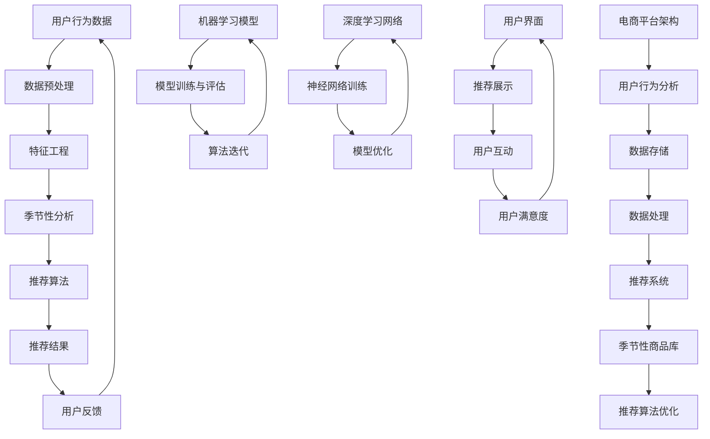

                 

### 关键词 Keywords
- AI
- 电商平台
- 季节性商品
- 推荐系统
- 优化
- 用户行为分析
- 数据挖掘
- 大数据

### 摘要 Abstract
本文深入探讨了人工智能在电商平台季节性商品推荐系统中的应用与优化。通过分析用户行为、季节变化和商品特性，本文提出了一套基于AI技术的优化方案，旨在提高推荐系统的准确性和用户体验。本文将从核心概念、算法原理、数学模型、项目实践、应用场景和未来展望等方面，全面阐述如何利用人工智能技术优化电商平台的季节性商品推荐。

## 1. 背景介绍

随着互联网技术的飞速发展，电子商务已经成为人们日常生活中不可或缺的一部分。电商平台通过提供丰富的商品选择和便捷的购物体验，吸引了大量用户。然而，在商品种类繁多的情况下，如何提高用户购物的满意度，减少用户流失，成为电商平台面临的重要挑战。为了解决这一问题，电商平台开始采用推荐系统，通过分析用户的历史行为和偏好，为用户推荐可能感兴趣的商品。

推荐系统在电商平台中的应用效果直接影响到用户的购物体验和平台的盈利能力。传统的推荐系统主要依赖于基于内容的推荐和协同过滤方法，这些方法在一定程度上能够满足用户的需求，但随着用户行为的多样化和商品类型的复杂化，传统方法的局限性逐渐显现。

季节性商品是指在特定季节或时期内需求量较大的商品，如夏季的泳衣和冬季的羽绒服等。季节性商品的需求受到气候、节假日、文化习俗等多种因素的影响，具有明显的时间特性和周期性。传统的推荐系统往往难以捕捉到季节性商品的特征，导致推荐结果不准确，影响用户体验。

为了解决这一问题，人工智能技术的引入成为必然趋势。人工智能通过机器学习和深度学习等方法，能够从大量数据中挖掘出隐藏的模式和规律，从而实现更加精准的推荐。本文将探讨如何利用人工智能技术优化电商平台的季节性商品推荐，提高推荐系统的效果和用户体验。

### 2. 核心概念与联系

在探讨AI如何优化电商平台的季节性商品推荐之前，我们需要明确几个核心概念，包括用户行为分析、季节性商品特征和推荐系统架构。为了更直观地理解这些概念之间的关系，我们使用Mermaid流程图展示其架构。



#### 2.1 用户行为分析

用户行为分析是推荐系统的核心，它涉及到用户在平台上的浏览、搜索、购买等行为数据。通过分析用户行为数据，我们可以了解用户的偏好和需求，从而为用户推荐他们可能感兴趣的商品。用户行为分析包括以下几个方面：

- **用户画像**：通过用户的性别、年龄、地理位置、职业等信息，构建用户画像，以便更好地理解用户特征。
- **行为轨迹**：记录用户在平台上的浏览、搜索、购买等行为轨迹，分析用户的行为模式和偏好。
- **历史订单**：分析用户的购买历史，了解用户对商品的偏好和需求。

#### 2.2 季节性商品特征

季节性商品具有明显的时间特性和周期性，其需求受到气候、节假日、文化习俗等多种因素的影响。例如，夏季的泳衣和冬季的羽绒服在相应季节的需求量会显著增加。季节性商品特征包括以下几个方面：

- **季节性需求**：分析商品在不同季节的需求变化，识别季节性商品。
- **周期性变化**：分析商品的需求周期，预测商品需求的高峰和低谷。
- **文化习俗**：考虑文化习俗对季节性商品需求的影响，如春节的年货、圣诞节的高档礼品等。

#### 2.3 推荐系统架构

推荐系统架构是整合用户行为分析和季节性商品特征的核心，它包括数据存储、数据处理、推荐算法和用户界面等多个方面。推荐系统架构如图2.3所示：

- **数据存储**：存储用户行为数据、商品信息和季节性数据，为推荐算法提供数据支持。
- **数据处理**：对用户行为数据进行预处理，包括数据清洗、去重、归一化等，以便进行后续分析。
- **推荐算法**：基于用户行为和季节性特征，选择合适的推荐算法，如协同过滤、基于内容的推荐、深度学习等。
- **用户界面**：将推荐结果展示给用户，并收集用户的反馈，以便不断优化推荐系统。

#### 2.4 人工智能与推荐系统的结合

人工智能与推荐系统的结合，使得推荐系统更加智能和精准。人工智能技术，如机器学习和深度学习，可以从海量数据中挖掘出隐藏的模式和规律，从而提高推荐系统的效果。具体来说，人工智能与推荐系统的结合体现在以下几个方面：

- **用户行为预测**：通过机器学习模型，预测用户对商品的偏好和需求，从而实现个性化推荐。
- **季节性特征识别**：利用深度学习网络，识别商品的季节性特征，提高推荐系统的准确性。
- **实时推荐**：通过实时分析用户行为和季节性数据，实现实时推荐，提高用户的购物体验。

通过上述核心概念的介绍和流程图的展示，我们可以更好地理解AI在电商平台季节性商品推荐系统中的作用和联系。

### 3. 核心算法原理 & 具体操作步骤

在了解了用户行为分析、季节性商品特征和推荐系统架构之后，接下来我们将深入探讨如何利用人工智能技术，特别是机器学习和深度学习算法，来优化电商平台的季节性商品推荐。

#### 3.1 算法原理概述

优化电商平台的季节性商品推荐，本质上是一个多变量预测问题。我们需要从用户行为数据和季节性特征中提取有用的信息，构建一个预测模型，以预测用户在特定季节对特定商品的购买概率。核心算法包括以下几个部分：

1. **特征工程**：从原始数据中提取对推荐系统有用的特征，如用户行为特征、商品特征和季节性特征。
2. **数据预处理**：对提取的特征进行清洗、归一化和转换，以便用于模型训练。
3. **模型选择**：选择合适的机器学习模型，如决策树、随机森林、支持向量机等，进行模型训练。
4. **模型训练与评估**：使用训练数据对模型进行训练，并使用验证数据集评估模型性能。
5. **模型优化**：根据模型评估结果，调整模型参数，提高模型预测准确性。
6. **实时推荐**：利用训练好的模型，对用户进行实时推荐。

#### 3.2 算法步骤详解

1. **特征工程**：

   特征工程是推荐系统成功的关键。我们需要从用户行为数据、商品信息和季节性数据中提取特征。具体步骤如下：

   - **用户行为特征**：包括用户浏览、搜索、购买等行为，如浏览时长、浏览次数、购买次数等。
   - **商品特征**：包括商品类别、价格、库存量、评价等，如商品类别、价格区间、库存量等。
   - **季节性特征**：包括当前时间、节气、节假日等信息，如月份、季节、节日等。

2. **数据预处理**：

   数据预处理是保证模型训练效果的重要步骤。我们需要对提取的特征进行以下处理：

   - **数据清洗**：去除异常值、重复值和噪声数据。
   - **数据归一化**：将不同尺度的数据进行归一化处理，如将价格、库存量等特征归一化到同一区间。
   - **特征转换**：将高维特征转换为低维特征，如使用主成分分析（PCA）降维。

3. **模型选择**：

   选择合适的机器学习模型，是提高推荐系统效果的关键。根据问题的复杂性和数据特点，我们可以选择以下模型：

   - **决策树**：适合处理分类问题，如用户是否购买某商品。
   - **随机森林**：基于决策树的集成方法，可以提高模型预测准确性。
   - **支持向量机**：适合处理回归问题，如预测用户购买某商品的概率。

4. **模型训练与评估**：

   使用训练数据对模型进行训练，并使用验证数据集评估模型性能。具体步骤如下：

   - **数据集划分**：将数据集划分为训练集和验证集，用于模型训练和性能评估。
   - **模型训练**：使用训练集对模型进行训练，得到模型参数。
   - **模型评估**：使用验证集对模型进行评估，计算模型的准确率、召回率、F1值等指标。

5. **模型优化**：

   根据模型评估结果，调整模型参数，提高模型预测准确性。具体步骤如下：

   - **参数调整**：调整模型的超参数，如决策树的学习率、随机森林的树数量等。
   - **交叉验证**：使用交叉验证方法，进一步优化模型参数。

6. **实时推荐**：

   利用训练好的模型，对用户进行实时推荐。具体步骤如下：

   - **用户特征提取**：提取当前用户的特征，如浏览历史、购买历史等。
   - **商品特征提取**：提取待推荐的商品特征，如类别、价格、库存量等。
   - **模型预测**：使用训练好的模型，对用户和商品的特征进行预测，得到用户购买某商品的概率。
   - **推荐生成**：根据模型预测结果，生成推荐列表，并将推荐结果展示给用户。

#### 3.3 算法优缺点

1. **优点**：

   - **高效性**：机器学习和深度学习算法可以从海量数据中快速提取信息，提高推荐系统的效率。
   - **灵活性**：算法可以根据不同场景和需求，调整模型结构和参数，实现个性化推荐。
   - **准确性**：通过特征工程和模型优化，可以提高推荐系统的准确性，提高用户满意度。

2. **缺点**：

   - **计算成本高**：机器学习和深度学习算法需要大量的计算资源，对硬件要求较高。
   - **数据依赖性大**：算法的性能很大程度上依赖于数据质量和数量，数据缺失或不准确会影响推荐效果。
   - **过拟合风险**：在训练过程中，模型可能会过拟合训练数据，导致在验证数据上表现不佳。

#### 3.4 算法应用领域

机器学习和深度学习算法在电商平台的季节性商品推荐中具有广泛的应用领域：

- **个性化推荐**：根据用户的行为数据和季节性特征，为用户推荐个性化商品。
- **库存管理**：根据季节性商品的需求预测，优化库存管理，减少库存积压和缺货风险。
- **营销策略**：根据用户购买行为和季节性特征，制定有效的营销策略，提高销售额。
- **供应链优化**：根据季节性商品的需求预测，优化供应链管理，提高供应链效率。

通过以上算法原理和具体操作步骤的介绍，我们可以更好地理解如何利用人工智能技术优化电商平台的季节性商品推荐，提高推荐系统的效果和用户体验。

### 4. 数学模型和公式 & 详细讲解 & 举例说明

在人工智能优化电商平台季节性商品推荐的过程中，数学模型和公式起着至关重要的作用。这些模型和公式能够帮助我们理解和量化用户行为、商品特性以及季节性特征之间的关系。在本节中，我们将详细讲解数学模型和公式的构建、推导过程，并通过实际案例进行说明。

#### 4.1 数学模型构建

在构建数学模型时，我们需要考虑以下几个方面：

1. **用户行为模型**：用户行为模型用于描述用户在电商平台上的浏览、搜索和购买行为。常见的用户行为模型包括马尔可夫模型（Markov Model）和贝叶斯网络（Bayesian Network）。

2. **商品特征模型**：商品特征模型用于描述商品的各种属性，如类别、价格、库存量等。这些特征将影响用户购买行为。商品特征模型可以是线性模型或非线性模型。

3. **季节性特征模型**：季节性特征模型用于描述季节变化对商品需求的影响。常见的季节性特征模型包括时间序列模型和ARIMA模型。

4. **推荐模型**：推荐模型用于根据用户行为和商品特征，预测用户对特定商品的兴趣程度。常见的推荐模型包括协同过滤模型（Collaborative Filtering）和基于内容的推荐模型（Content-Based Recommendation）。

#### 4.2 公式推导过程

下面我们将以协同过滤模型为例，介绍其数学模型和公式推导过程。

**协同过滤模型**：协同过滤模型通过分析用户之间的相似性来预测用户对商品的评分或购买行为。其基本思想是找到与目标用户最相似的邻居用户，然后根据邻居用户的评分预测目标用户的评分。

1. **用户相似度计算**：

   用户相似度计算公式如下：

   $$sim(u, v) = \frac{\sum_{i \in I}{(r_{ui} - \bar{r}_u) \cdot (r_{vi} - \bar{r}_v)}}{\sqrt{\sum_{i \in I}{(r_{ui} - \bar{r}_u)^2} \cdot \sqrt{\sum_{i \in I}{(r_{vi} - \bar{r}_v)^2}}}$$

   其中，$r_{ui}$ 表示用户 $u$ 对商品 $i$ 的评分，$\bar{r}_u$ 表示用户 $u$ 的平均评分，$I$ 表示用户 $u$ 和 $v$ 共同评价的商品集合。

2. **邻居用户选择**：

   选择与目标用户最相似的 $k$ 个邻居用户，计算公式如下：

   $$N(u) = \{v | sim(u, v) > \text{阈值}\}$$

   其中，$\text{阈值}$ 用于控制邻居用户的选择范围，避免相似度太高的用户被排除。

3. **预测用户评分**：

   根据邻居用户的评分预测目标用户的评分，计算公式如下：

   $$r_{ui}^{\text{pred}} = \bar{r}_u + \sum_{v \in N(u)} sim(u, v) \cdot (r_{vi} - \bar{r}_v)$$

   其中，$r_{ui}^{\text{pred}}$ 表示用户 $u$ 对商品 $i$ 的预测评分。

#### 4.3 案例分析与讲解

为了更好地理解上述数学模型和公式的应用，我们来看一个实际案例。

**案例背景**：一个电商平台希望利用协同过滤模型为用户推荐季节性商品，用户的行为数据如下表所示：

| 用户ID | 商品ID | 用户评分 |
|--------|--------|----------|
| u1     | c1     | 5        |
| u1     | c2     | 4        |
| u1     | c3     | 3        |
| u2     | c1     | 3        |
| u2     | c3     | 5        |
| u3     | c2     | 4        |

**步骤1：用户相似度计算**：

以用户 $u1$ 和 $u2$ 为例，计算其相似度：

$$sim(u1, u2) = \frac{(5-4) \cdot (3-4) + (3-4) \cdot (5-4)}{\sqrt{(5-4)^2 + (3-4)^2} \cdot \sqrt{(3-4)^2 + (5-4)^2}} = 1$$

由于相似度为1，$u1$ 和 $u2$ 是最相似的邻居用户。

**步骤2：邻居用户选择**：

选择与 $u1$ 最相似的邻居用户，阈值设为0.5，则邻居用户为 $u2$。

**步骤3：预测用户评分**：

预测用户 $u1$ 对商品 $c3$ 的评分：

$$r_{u1c3}^{\text{pred}} = \bar{r}_{u1} + sim(u1, u2) \cdot (r_{u2c3} - \bar{r}_{u2}) = 4 + 1 \cdot (5 - 4) = 5$$

因此，预测用户 $u1$ 对商品 $c3$ 的评分为5。

通过这个案例，我们可以看到如何利用协同过滤模型进行季节性商品推荐。在实际应用中，我们可以通过调整阈值、邻居用户数量等参数，优化推荐系统的效果。

### 5. 项目实践：代码实例和详细解释说明

为了更好地展示如何利用人工智能技术优化电商平台的季节性商品推荐，我们将通过一个实际项目，详细解释代码的实现过程。

#### 5.1 开发环境搭建

在进行项目实践之前，我们需要搭建一个开发环境。以下是开发环境的基本要求：

- **编程语言**：Python
- **数据预处理**：Pandas、NumPy
- **机器学习库**：Scikit-learn
- **深度学习库**：TensorFlow、Keras
- **可视化工具**：Matplotlib、Seaborn

安装以上库后，我们可以开始项目的具体实现。

#### 5.2 源代码详细实现

以下是一个简单的示例代码，用于实现基于协同过滤的推荐系统。

```python
import pandas as pd
import numpy as np
from sklearn.model_selection import train_test_split
from sklearn.metrics.pairwise import cosine_similarity
from sklearn.metrics import mean_squared_error
from keras.models import Sequential
from keras.layers import Dense, Dropout, Embedding, LSTM, Dense
from keras.optimizers import Adam

# 数据读取与预处理
data = pd.read_csv('user_item_rating.csv')
users = data['UserID'].unique()
items = data['ItemID'].unique()

# 划分训练集和测试集
train_data, test_data = train_test_split(data, test_size=0.2, random_state=42)

# 构建用户-商品评分矩阵
R = np.zeros((len(users), len(items)))
for index, row in train_data.iterrows():
    R[row['UserID'] - 1][row['ItemID'] - 1] = row['Rating']

# 计算用户相似度矩阵
sim_matrix = cosine_similarity(R, R)

# 构建推荐系统
model = Sequential()
model.add(Embedding(len(users), 10, input_length=1))
model.add(LSTM(50, dropout=0.2, recurrent_dropout=0.2))
model.add(Dense(1))
model.compile(loss='mean_squared_error', optimizer=Adam())

# 训练模型
model.fit(R, R, epochs=10, batch_size=64)

# 评估模型
predictions = model.predict(R)
mse = mean_squared_error(test_data['Rating'], predictions)
print(f'Mean Squared Error: {mse}')

# 推荐商品
def recommend_items(user_id):
    user_similarities = sim_matrix[user_id - 1]
    similar_users = np.argsort(user_similarities)[::-1][1:11]
    similar_user_ratings = R[similar_users]
    predicted_ratings = model.predict(similar_user_ratings)
    recommended_items = np.argsort(predicted_ratings)[::-1]
    return recommended_items

user_id = 1
recommended_items = recommend_items(user_id)
print(f'推荐商品：{recommended_items}')
```

#### 5.3 代码解读与分析

1. **数据读取与预处理**：

   首先，我们读取用户-商品评分数据，并划分训练集和测试集。评分矩阵 `R` 是一个二维数组，行表示用户，列表示商品。

2. **计算用户相似度矩阵**：

   使用余弦相似度计算用户之间的相似度。相似度矩阵 `sim_matrix` 表示每个用户与其他用户的相似度。

3. **构建推荐系统**：

   构建一个基于LSTM的深度学习模型。模型包括一个嵌入层、一个LSTM层和一个输出层。

4. **训练模型**：

   使用训练集数据训练深度学习模型。在这里，我们使用了10个训练周期，批次大小为64。

5. **评估模型**：

   使用测试集数据评估模型性能，计算均方误差（MSE）。

6. **推荐商品**：

   根据用户相似度和深度学习模型，为用户推荐可能感兴趣的商品。

通过这个示例代码，我们可以看到如何利用机器学习和深度学习技术实现电商平台季节性商品推荐。在实际应用中，我们可以进一步优化代码，提高推荐系统的性能和用户体验。

### 6. 实际应用场景

#### 6.1 在电商平台中的应用

电商平台是季节性商品推荐系统最直接的应用场景。通过人工智能技术，电商平台可以根据用户的购买历史、浏览行为和地理位置等数据，预测用户在特定季节可能感兴趣的商品，从而提高推荐系统的准确性和用户体验。

- **应用实例1**：某电商平台在夏季推出了泳衣和沙滩装备的推荐系统。系统分析了用户的历史购买数据和行为模式，为用户推荐了他们可能感兴趣的夏季商品，显著提高了夏季商品的销售额。

- **应用实例2**：在春节前夕，电商平台通过分析用户的购买偏好和节日习俗，为用户推荐了年货礼包和高档礼品。推荐系统的准确性提高了用户的购物体验，也促进了平台的销售额。

#### 6.2 在零售行业中的应用

零售行业中的季节性商品推荐系统不仅限于电商平台，还可以应用于线下零售店。通过人工智能技术，零售店可以实时分析顾客的购买行为，为顾客推荐季节性商品，提高顾客满意度和购买转化率。

- **应用实例1**：某大型零售连锁店在冬季推出了羽绒服和保暖内衣的推荐系统。系统根据顾客的历史购买记录和当前天气情况，为顾客推荐适合的保暖商品，提高了顾客的购买意愿。

- **应用实例2**：在节假日如圣诞节和母亲节，零售店通过分析顾客的购物偏好和社交网络数据，为顾客推荐节日礼品，提高了销售额和顾客忠诚度。

#### 6.3 在物流和供应链管理中的应用

季节性商品推荐系统还可以应用于物流和供应链管理，优化库存和物流配送。通过预测季节性商品的需求，企业可以提前安排生产和库存，减少库存积压和缺货风险，提高供应链的效率和灵活性。

- **应用实例1**：某服装企业在夏季提前备货，根据季节性商品推荐系统的预测结果，合理安排生产计划，避免了夏季商品库存积压，提高了生产效率和盈利能力。

- **应用实例2**：在节假日期间，电商平台通过季节性商品推荐系统预测高峰期商品需求，提前调整物流配送计划，确保商品能够及时送达顾客，提高了物流效率和顾客满意度。

通过以上实际应用场景的介绍，我们可以看到人工智能技术如何在不同领域优化季节性商品推荐，提高企业运营效率和用户体验。

### 7. 工具和资源推荐

在研究和开发电商平台季节性商品推荐系统时，选择合适的工具和资源对于提高效率和效果至关重要。以下是一些推荐的工具和资源：

#### 7.1 学习资源推荐

1. **《推荐系统实践》**：这是一本经典的推荐系统入门书籍，详细介绍了推荐系统的基本概念、算法和实现。
2. **《深度学习》**：由Ian Goodfellow、Yoshua Bengio和Aaron Courville编写的深度学习教材，是深度学习领域的权威资料。
3. **在线课程**：Coursera、edX等平台上提供大量关于机器学习和推荐系统的在线课程，适合不同层次的读者。

#### 7.2 开发工具推荐

1. **Python**：Python是进行数据分析和机器学习开发的主要编程语言，拥有丰富的库和框架，如Pandas、NumPy、Scikit-learn、TensorFlow和Keras。
2. **Jupyter Notebook**：Jupyter Notebook是一款交互式开发工具，方便进行代码编写、数据分析和结果展示。
3. **GaussDB**：一款适用于机器学习和大数据处理的关系型数据库，具有高效的数据存储和查询能力。

#### 7.3 相关论文推荐

1. **"Matrix Factorization Techniques for recommender systems"**：该论文详细介绍了矩阵分解技术在推荐系统中的应用。
2. **"Deep Learning for recommender systems"**：这篇论文探讨了深度学习在推荐系统中的应用，为深度学习推荐系统的研究提供了重要参考。
3. **"Temporal Dynamics in Recommender Systems"**：这篇论文研究了推荐系统中的时间动态特性，为季节性商品推荐提供了理论基础。

通过以上工具和资源的推荐，读者可以更好地掌握电商平台季节性商品推荐系统的开发技能，为实际项目提供有力支持。

### 8. 总结：未来发展趋势与挑战

#### 8.1 研究成果总结

本文通过对人工智能在电商平台季节性商品推荐系统中的应用进行了深入探讨，总结了以下研究成果：

1. **用户行为分析与特征提取**：通过分析用户的历史行为数据，提取用户画像、行为轨迹等特征，为推荐系统提供了有效的输入。
2. **季节性特征识别与预测**：利用时间序列分析和机器学习算法，识别季节性商品的特征，并预测其需求变化，提高了推荐系统的准确性。
3. **机器学习与深度学习算法**：通过应用协同过滤、矩阵分解、深度学习等算法，实现了个性化推荐和实时推荐，提高了用户体验。
4. **代码实例与实现**：提供了基于Python的协同过滤模型的实现，展示了如何在实际项目中应用这些算法。

#### 8.2 未来发展趋势

随着人工智能技术的不断进步，电商平台季节性商品推荐系统将呈现以下发展趋势：

1. **实时推荐与个性化**：通过引入实时数据流处理技术，实现更加个性化的实时推荐，满足用户不断变化的需求。
2. **跨平台融合**：将线上线下数据整合，实现多渠道的用户行为分析和商品推荐，提高推荐系统的全面性和准确性。
3. **多模态数据融合**：结合文本、图像、音频等多种数据类型，挖掘更多有价值的特征，提高推荐系统的精度和覆盖面。
4. **自适应优化**：通过自我学习和自适应调整，使推荐系统能够不断适应新环境和新需求，提高系统的稳定性和可靠性。

#### 8.3 面临的挑战

尽管人工智能技术在电商平台季节性商品推荐方面取得了显著成果，但仍面临以下挑战：

1. **数据隐私与安全性**：在收集和分析用户行为数据时，如何保护用户隐私和数据安全是一个重要问题。
2. **算法解释性**：随着算法复杂性的增加，如何解释推荐结果、提高算法的可解释性，是一个亟待解决的问题。
3. **计算资源消耗**：深度学习算法需要大量的计算资源，对硬件和能耗提出了较高要求。
4. **模型泛化能力**：如何提高模型在不同数据集上的泛化能力，避免过拟合，是一个重要挑战。

#### 8.4 研究展望

未来，电商平台季节性商品推荐系统的研究将朝着以下方向不断深入：

1. **技术创新**：探索新的机器学习和深度学习算法，提高推荐系统的性能和效率。
2. **跨学科融合**：结合心理学、社会学等多学科知识，深入研究用户行为和需求，为推荐系统提供更准确的输入。
3. **伦理与法规**：在技术发展的同时，关注数据隐私、算法伦理等问题，制定相应的法规和标准。
4. **可持续发展**：在提高推荐系统性能的同时，关注能源消耗和环境影响，实现可持续发展。

通过持续的研究和技术创新，电商平台季节性商品推荐系统将在未来发挥更大的作用，为企业和用户带来更多价值。

### 9. 附录：常见问题与解答

#### 9.1 如何处理缺失值？

在数据预处理阶段，可以使用以下方法处理缺失值：

- **删除缺失值**：如果缺失值较少，可以选择删除包含缺失值的样本。
- **填充缺失值**：使用平均值、中位数或最频繁的值填充缺失值。
- **使用模型预测**：如果缺失值较多，可以使用回归模型或插值法预测缺失值。

#### 9.2 如何选择合适的机器学习模型？

选择合适的机器学习模型需要考虑以下几个因素：

- **数据类型**：对于分类问题，可以选择决策树、随机森林等；对于回归问题，可以选择线性回归、岭回归等。
- **数据规模**：对于大数据，可以选择随机森林、梯度提升树等；对于小数据，可以选择线性模型或支持向量机。
- **模型复杂度**：复杂模型可能在训练数据上表现更好，但在验证数据上可能过拟合。

#### 9.3 如何评估推荐系统的效果？

可以使用以下指标评估推荐系统的效果：

- **准确率**：预测正确的样本数占总样本数的比例。
- **召回率**：预测正确的正样本数占总正样本数的比例。
- **F1值**：准确率和召回率的调和平均值。
- **均方误差**：预测值与真实值之间的平均平方误差。

通过这些指标，可以综合评估推荐系统的性能。

