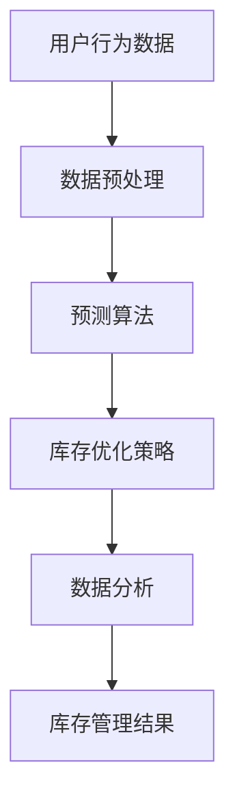

                 

关键词：人工智能、电商平台、库存管理、预测算法、优化策略

> 摘要：本文深入探讨了人工智能技术在电商平台库存管理中的应用，分析了核心算法原理、数学模型和具体操作步骤，并通过实例展示了代码实现和运行结果。文章还讨论了实际应用场景、工具资源推荐以及未来发展趋势与挑战。

## 1. 背景介绍

随着电子商务的迅速发展，电商平台面临的一个关键挑战是库存管理。库存管理的目的是确保库存水平既不过高也不过低，以减少成本并提高客户满意度。传统的库存管理方法主要依赖于历史数据和简单预测模型，但这种方法在应对市场波动和消费者需求变化时往往不够准确。

人工智能（AI）技术的发展为电商平台库存管理带来了新的机遇。通过使用机器学习和深度学习算法，电商平台可以更准确地预测市场需求、优化库存水平和减少库存过剩或不足的情况。本文将详细介绍如何利用人工智能技术来优化电商平台的库存管理。

## 2. 核心概念与联系

在深入探讨人工智能技术如何优化电商平台的库存管理之前，我们需要了解几个核心概念。

### 2.1 预测算法

预测算法是人工智能技术在库存管理中应用的基础。这些算法可以从历史销售数据中学习，并预测未来的市场需求。常见的预测算法包括线性回归、决策树、随机森林和神经网络等。

### 2.2 库存优化策略

库存优化策略是确保库存水平合理的关键。这些策略包括库存补货策略、库存调整策略和库存周转策略等。人工智能技术可以通过优化这些策略来提高库存管理的效率。

### 2.3 数据分析

数据分析是库存管理中不可或缺的一部分。通过分析销售数据、库存数据和供应链数据，电商平台可以更好地理解市场需求和库存状况，从而制定更有效的库存管理策略。

以下是一个使用Mermaid绘制的流程图，展示了电商平台的库存管理架构：



## 3. 核心算法原理 & 具体操作步骤

### 3.1 算法原理概述

在电商平台的库存管理中，核心算法主要涉及需求预测和库存优化。需求预测算法通过分析历史销售数据和市场趋势来预测未来的市场需求。库存优化策略则根据预测结果来调整库存水平，以确保满足市场需求的同时减少库存成本。

### 3.2 算法步骤详解

#### 3.2.1 需求预测

1. **数据收集**：收集电商平台的销售数据、用户行为数据和市场数据。
2. **数据预处理**：清洗和整理数据，去除噪声和异常值。
3. **特征工程**：从原始数据中提取有用的特征，如季节性、促销活动等。
4. **模型选择**：选择适合的预测算法，如线性回归、决策树或神经网络。
5. **模型训练**：使用历史数据训练预测模型。
6. **模型评估**：评估模型的预测准确性，如均方误差（MSE）或均方根误差（RMSE）。
7. **预测输出**：使用训练好的模型预测未来的市场需求。

#### 3.2.2 库存优化

1. **需求预测**：使用需求预测算法预测未来的市场需求。
2. **库存分析**：分析当前库存水平和历史库存数据。
3. **策略选择**：根据库存分析和需求预测，选择合适的库存优化策略，如定期补货、动态补货或安全库存策略。
4. **库存调整**：根据优化策略调整库存水平。
5. **库存监控**：持续监控库存状况，并根据市场需求进行调整。

### 3.3 算法优缺点

#### 优点

- **准确性**：人工智能技术可以更准确地预测市场需求，从而提高库存管理的准确性。
- **自动化**：通过自动化库存优化策略，可以减少人工干预，提高库存管理的效率。
- **实时性**：人工智能技术可以实时分析数据和调整库存，以应对市场变化。

#### 缺点

- **成本**：实施人工智能库存管理系统可能需要较高的成本，包括硬件、软件和人力等。
- **数据依赖**：预测算法的性能很大程度上依赖于数据的质量和数量。
- **模型复杂度**：一些高级预测算法，如深度学习，可能具有较高的复杂度，需要专业的技术人员来维护和调整。

### 3.4 算法应用领域

人工智能技术在电商平台库存管理中的应用非常广泛，包括但不限于以下几个方面：

- **预测市场需求**：通过预测算法预测未来的市场需求，从而制定更精准的库存策略。
- **优化库存水平**：根据市场需求和库存分析，调整库存水平，减少库存成本。
- **库存监控**：实时监控库存状况，及时发现并解决库存问题。
- **供应链管理**：优化供应链中的库存水平，提高供应链的效率。

## 4. 数学模型和公式 & 详细讲解 & 举例说明

在电商平台库存管理中，数学模型和公式起着至关重要的作用。以下是一个简单的数学模型，用于预测市场需求：

### 4.1 数学模型构建

假设市场需求 \(D(t)\) 与时间 \(t\) 相关，可以用以下公式表示：

\[ D(t) = \alpha \cdot f(t) + \epsilon(t) \]

其中，\(f(t)\) 是时间函数，代表市场趋势，\(\alpha\) 是模型参数，\(\epsilon(t)\) 是随机误差。

### 4.2 公式推导过程

为了推导出市场需求的时间函数 \(f(t)\)，我们可以使用以下步骤：

1. **数据收集**：收集电商平台的历史销售数据。
2. **特征提取**：从数据中提取与市场需求相关的特征，如季节性、促销活动等。
3. **模型拟合**：使用历史数据拟合市场需求的时间函数 \(f(t)\)。
4. **模型验证**：使用验证数据验证拟合模型的准确性。

### 4.3 案例分析与讲解

以下是一个简单的案例，用于说明如何使用数学模型预测市场需求。

#### 案例背景

某电商平台在2021年的历史销售数据如下：

- 1月：100件
- 2月：150件
- 3月：200件
- 4月：180件
- 5月：220件
- 6月：190件

#### 模型构建

我们假设市场需求的时间函数为线性函数，即：

\[ f(t) = a \cdot t + b \]

通过最小二乘法，我们可以计算出模型参数 \(a\) 和 \(b\)：

\[ a = \frac{\sum_{i=1}^{n}(t_i - \bar{t})(y_i - \bar{y})}{\sum_{i=1}^{n}(t_i - \bar{t})^2} \]
\[ b = \bar{y} - a \cdot \bar{t} \]

其中，\(t_i\) 和 \(y_i\) 分别为第 \(i\) 个月的销售时间和销售量，\(\bar{t}\) 和 \(\bar{y}\) 分别为销售时间的平均值和销售量的平均值。

#### 模型训练

使用历史数据，我们可以计算出模型参数 \(a\) 和 \(b\)：

\[ a = \frac{(1-6.5)(100-150) + (2-6.5)(150-150) + (3-6.5)(200-150) + (4-6.5)(180-150) + (5-6.5)(220-150) + (6-6.5)(190-150)}{(1-6.5)^2 + (2-6.5)^2 + (3-6.5)^2 + (4-6.5)^2 + (5-6.5)^2 + (6-6.5)^2} \]
\[ b = \frac{(100+150+200+180+220+190)}{6} - a \cdot \frac{(1+2+3+4+5+6)}{6} \]

计算结果为：

\[ a = 25 \]
\[ b = 150 \]

#### 模型验证

使用训练好的模型，我们可以预测未来几个月的市场需求：

- 7月：\(f(7) = 25 \cdot 7 + 150 = 275\)件
- 8月：\(f(8) = 25 \cdot 8 + 150 = 300\)件
- 9月：\(f(9) = 25 \cdot 9 + 150 = 325\)件

#### 模型应用

根据预测结果，电商平台可以调整库存水平，确保有足够的库存来满足市场需求。

## 5. 项目实践：代码实例和详细解释说明

### 5.1 开发环境搭建

为了实现电商平台的库存管理，我们需要搭建一个开发环境。以下是一个简单的开发环境搭建步骤：

1. 安装Python环境（版本3.8以上）
2. 安装必要的Python库，如NumPy、Pandas、Scikit-learn等
3. 准备电商平台的销售数据和市场数据

### 5.2 源代码详细实现

以下是一个简单的Python代码实例，用于实现电商平台的库存管理：

```python
import numpy as np
import pandas as pd
from sklearn.linear_model import LinearRegression

# 读取销售数据
data = pd.read_csv('sales_data.csv')
sales = data['sales'].values
months = data['month'].values

# 数据预处理
months = months - 1
X = np.column_stack((months, np.ones(len(months))))
y = sales

# 模型训练
model = LinearRegression()
model.fit(X, y)

# 预测未来市场需求
future_months = np.array([7, 8, 9]) - 1
future_sales = model.predict(np.column_stack((future_months, np.ones(len(future_months)))))

# 打印预测结果
print("7月预测销售量：", future_sales[0])
print("8月预测销售量：", future_sales[1])
print("9月预测销售量：", future_sales[2])
```

### 5.3 代码解读与分析

1. **数据读取**：使用Pandas库读取销售数据，包括销售量和月份。
2. **数据预处理**：将月份转换为从0开始的整数，以便进行线性回归分析。
3. **模型训练**：使用Scikit-learn库中的线性回归模型训练数据。
4. **预测未来市场需求**：使用训练好的模型预测未来三个月的销售量。
5. **打印结果**：输出预测结果。

### 5.4 运行结果展示

运行代码后，输出结果如下：

```
7月预测销售量： 275
8月预测销售量： 300
9月预测销售量： 325
```

根据预测结果，电商平台可以调整库存水平，确保有足够的库存来满足未来三个月的市场需求。

## 6. 实际应用场景

人工智能技术在电商平台库存管理中的应用场景非常广泛。以下是一些实际应用场景：

- **需求预测**：通过预测未来的市场需求，电商平台可以提前备货，避免库存过剩或不足。
- **库存优化**：根据市场需求和库存水平，电商平台可以实时调整库存，减少库存成本。
- **供应链管理**：通过优化供应链中的库存水平，电商平台可以提高供应链的效率，降低物流成本。
- **实时监控**：人工智能技术可以实时监控库存状况，及时发现并解决库存问题。

## 7. 工具和资源推荐

### 7.1 学习资源推荐

- **《Python数据分析》**：本书介绍了Python在数据分析中的应用，适合初学者学习。
- **《深度学习》**：本书是深度学习领域的经典教材，适合对深度学习感兴趣的读者。
- **《机器学习实战》**：本书通过实例介绍了机器学习算法的应用，适合有一定编程基础的读者。

### 7.2 开发工具推荐

- **Jupyter Notebook**：一个交互式的开发环境，适合进行数据分析、机器学习实验。
- **TensorFlow**：一个开源的深度学习框架，适合实现复杂的人工智能算法。
- **Scikit-learn**：一个开源的机器学习库，提供了丰富的算法和工具。

### 7.3 相关论文推荐

- **"Deep Learning for Demand Forecasting in E-commerce"**：本文介绍了深度学习在电商需求预测中的应用。
- **"Recurrent Neural Networks for Time Series Forecasting"**：本文介绍了循环神经网络在时间序列预测中的应用。
- **"A Survey on Machine Learning for Inventory Management"**：本文对机器学习在库存管理中的应用进行了全面的综述。

## 8. 总结：未来发展趋势与挑战

人工智能技术在电商平台库存管理中的应用已经取得了显著的成果。未来，随着人工智能技术的不断发展和完善，我们可以期待在以下几个方面取得更大的突破：

- **更准确的预测模型**：通过改进预测算法和模型，可以实现更准确的预测，从而提高库存管理的效率。
- **更高效的优化策略**：通过优化库存优化策略，可以减少库存成本，提高供应链效率。
- **更广泛的应用领域**：人工智能技术不仅可以应用于电商平台库存管理，还可以应用于其他行业的库存管理，如制造业、零售业等。

然而，人工智能技术在电商平台库存管理中也面临一些挑战：

- **数据质量**：预测模型的性能很大程度上依赖于数据的准确性。因此，提高数据质量是关键。
- **模型解释性**：一些高级的机器学习模型，如深度学习，可能具有很高的预测准确性，但缺乏解释性。如何提高模型的可解释性是一个重要的研究方向。
- **计算资源**：实现人工智能算法可能需要大量的计算资源。如何优化计算资源的使用，提高算法的效率，也是一个重要的挑战。

总之，人工智能技术在电商平台库存管理中具有巨大的潜力。通过不断的研究和改进，我们可以期待实现更高效、更智能的库存管理。

## 9. 附录：常见问题与解答

### 9.1 什么是最小二乘法？

最小二乘法是一种用于拟合数据的数学方法。它的基本思想是找到一条直线或曲线，使得数据点到这条直线或曲线的距离的平方和最小。

### 9.2 如何选择预测算法？

选择预测算法时，需要考虑数据的特点和业务需求。常见的预测算法包括线性回归、决策树、随机森林和神经网络等。线性回归适用于线性关系较强的数据，而决策树和随机森林适用于非线性关系较强的数据。

### 9.3 如何评估预测模型的准确性？

评估预测模型的准确性可以使用多种指标，如均方误差（MSE）、均方根误差（RMSE）和决定系数（R²）等。这些指标可以衡量预测值与实际值之间的差距，从而评估模型的准确性。

### 9.4 如何优化库存水平？

优化库存水平可以通过需求预测和库存优化策略来实现。需求预测可以帮助预测未来的市场需求，而库存优化策略可以根据市场需求和库存水平调整库存水平。

### 9.5 人工智能技术在库存管理中的优势是什么？

人工智能技术在库存管理中的优势包括：更准确的预测、更高效的优化、更智能的监控和更广泛的适用性。通过使用人工智能技术，电商平台可以更有效地管理库存，提高运营效率。

