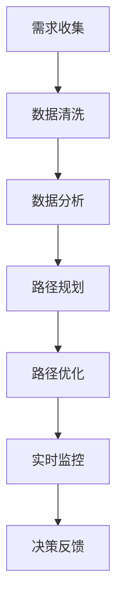

                 

关键词：人工智能，跨境电商，物流路径规划，AI优化，数据驱动，算法应用，智能决策，实时监控

> 摘要：本文将深入探讨人工智能技术在跨境电商物流路径规划中的应用，分析现有技术的局限，探讨如何利用人工智能实现跨境物流路径的智能优化。文章将从核心概念、算法原理、数学模型、实践案例等多角度进行阐述，为电商平台提供有效的物流路径规划方案，降低物流成本，提高服务质量。

## 1. 背景介绍

随着全球电子商务的蓬勃发展，跨境电商已经成为国际市场的重要组成部分。物流路径规划作为跨境电商中至关重要的一环，直接影响着订单的交付速度和成本。传统物流路径规划主要依赖于预定的路线和规则，无法适应动态的市场需求和复杂的供应链网络。而人工智能（AI）技术的引入，为物流路径规划带来了新的机遇和挑战。

### 跨境电商的物流挑战

1. **复杂供应链网络**：跨境电商涉及多个国家和地区的物流节点，供应链网络复杂，物流路径规划难度大。
2. **动态市场需求**：跨境电商订单量波动大，需求动态变化，传统的预定路线难以满足实际需求。
3. **成本控制**：跨境物流成本高，如何优化路径以降低成本是电商企业面临的重大挑战。
4. **服务水平**：提高订单交付速度，提升客户满意度是跨境电商的重要目标。

### 人工智能在物流领域的应用

人工智能技术具有强大的数据处理和分析能力，能够从海量数据中提取有价值的信息，进行智能决策和实时优化。在物流领域，人工智能可以应用于以下几个方面：

1. **路径规划**：利用机器学习和优化算法，实现物流路径的动态优化，降低物流成本。
2. **需求预测**：通过对历史数据和实时数据的分析，预测市场需求，调整物流策略。
3. **实时监控**：利用物联网技术和实时数据，监控物流过程中的关键节点，确保物流过程的透明和可控。
4. **智能客服**：利用自然语言处理和机器学习技术，提供智能客服服务，提高客户满意度。

## 2. 核心概念与联系

### 物流路径规划

物流路径规划是指根据物流需求，选择合适的运输方式、路径和运输工具，以实现物流成本最低、服务质量最优的目标。在跨境电商中，物流路径规划需要考虑的因素包括运输距离、运输时间、运输成本、运输安全等。

### 人工智能与物流路径规划的关系

人工智能与物流路径规划的结合主要体现在以下几个方面：

1. **数据驱动**：人工智能可以通过分析海量物流数据，识别出行程中的潜在问题和优化机会。
2. **智能决策**：利用机器学习算法，人工智能可以在复杂的供应链网络中，自动生成最优的物流路径。
3. **实时优化**：基于实时数据，人工智能可以动态调整物流路径，以应对市场变化和突发事件。
4. **可视化分析**：人工智能可以将复杂的物流数据转化为可视化图表，帮助决策者更直观地理解物流过程。

### Mermaid 流程图



## 3. 核心算法原理 & 具体操作步骤

### 3.1 算法原理概述

人工智能在物流路径规划中的应用，主要依赖于以下几种核心算法：

1. **遗传算法（GA）**：通过模拟自然进化过程，实现路径优化。
2. **蚁群算法（ACO）**：模拟蚂蚁觅食行为，寻找最优路径。
3. **神经网络（NN）**：通过神经网络模型，预测物流路径的动态变化。
4. **深度学习（DL）**：利用深度学习模型，进行大规模数据分析和路径优化。

### 3.2 算法步骤详解

#### 3.2.1 遗传算法

1. **初始种群生成**：根据物流需求，生成初始的路径种群。
2. **适应度评估**：计算每个路径的适应度值，评估其优劣。
3. **选择**：根据适应度值，选择优秀的路径进行交叉和变异操作。
4. **交叉**：通过交叉操作，生成新的路径种群。
5. **变异**：对部分路径进行变异操作，引入新的基因。
6. **迭代**：重复上述步骤，直到达到预定的迭代次数或满足停止条件。

#### 3.2.2 蚁群算法

1. **信息素初始化**：在所有路径上初始化信息素浓度。
2. **路径选择**：根据路径的启发因子和信息素浓度，选择当前路径。
3. **更新信息素**：根据路径的长度和成功次数，更新信息素浓度。
4. **迭代**：重复上述步骤，直到找到最优路径或达到预定的迭代次数。

#### 3.2.3 神经网络

1. **数据预处理**：对输入数据进行归一化处理，以便于模型训练。
2. **模型构建**：构建神经网络模型，选择合适的网络结构和激活函数。
3. **模型训练**：利用历史数据，训练神经网络模型，调整权重和偏置。
4. **路径预测**：输入当前物流数据，通过神经网络模型预测最优路径。

#### 3.2.4 深度学习

1. **数据收集**：收集大量的物流数据，包括路径、成本、时间等。
2. **数据预处理**：对数据进行清洗、归一化处理，以消除噪声和异常值。
3. **模型构建**：构建深度学习模型，选择合适的网络架构和损失函数。
4. **模型训练**：利用预处理后的数据，训练深度学习模型。
5. **路径优化**：输入当前物流数据，通过深度学习模型进行路径优化。

### 3.3 算法优缺点

#### 3.3.1 遗传算法

**优点**：

1. **全局搜索能力**：能够跳出局部最优解，寻找全局最优解。
2. **鲁棒性**：对初始种群和参数设置不敏感，具有较强的鲁棒性。

**缺点**：

1. **计算复杂度**：需要大量的计算资源和时间。
2. **收敛速度**：对于复杂的物流问题，收敛速度较慢。

#### 3.3.2 蚁群算法

**优点**：

1. **分布式计算**：能够利用多台计算机进行分布式计算，提高计算效率。
2. **自适应调整**：能够根据路径的长度和成功次数，自适应调整信息素浓度。

**缺点**：

1. **初始设置**：需要合理设置参数，否则可能导致算法失效。
2. **局部最优解**：在寻找最优路径时，容易陷入局部最优解。

#### 3.3.3 神经网络

**优点**：

1. **强大的拟合能力**：能够处理复杂的非线性关系。
2. **自适应调整**：能够根据输入数据自动调整权重和偏置。

**缺点**：

1. **数据需求**：需要大量的训练数据，否则可能导致过拟合。
2. **训练时间**：需要较长的训练时间，对于实时性要求较高的场景不适用。

#### 3.3.4 深度学习

**优点**：

1. **高效的路径优化**：能够快速处理大规模数据，实现高效路径优化。
2. **强大的学习能力**：能够从海量数据中自动学习特征和模式。

**缺点**：

1. **计算资源需求**：需要大量的计算资源和存储空间。
2. **模型解释性**：深度学习模型的解释性较差，难以理解其内部机制。

### 3.4 算法应用领域

1. **物流路径规划**：应用于跨境电商、快递物流等领域的路径优化。
2. **交通规划**：应用于城市交通规划、公共交通调度等领域的路径优化。
3. **资源分配**：应用于电网调度、数据中心资源分配等领域的资源优化。
4. **金融风控**：应用于金融领域的风险评估和投资策略优化。

## 4. 数学模型和公式 & 详细讲解 & 举例说明

### 4.1 数学模型构建

在物流路径规划中，常见的数学模型包括线性规划、整数规划、多目标规划等。以下以线性规划为例，介绍数学模型的构建过程。

#### 4.1.1 确定变量

假设有 n 个物流节点，每个节点之间的运输成本已知，需要确定每个节点之间的运输路径，以实现总成本最低。

变量定义：

- x\_ij：从节点 i 到节点 j 的运输路径是否存在，存在则为 1，不存在则为 0。

#### 4.1.2 确定目标函数

目标函数为总运输成本最小化：

$$
\min Z = \sum_{i=1}^{n} \sum_{j=1}^{n} c_{ij} x_{ij}
$$

其中，c\_ij 为从节点 i 到节点 j 的运输成本。

#### 4.1.3 确定约束条件

1. 每个节点的总流入量等于总流出量：

$$
\sum_{j=1}^{n} x_{ij} = \sum_{j=1}^{n} x_{ji} \quad \forall i
$$

2. 每个节点的物流量不能超过其容量：

$$
\sum_{i=1}^{n} x_{ij} \leq C_i \quad \forall j
$$

$$
\sum_{i=1}^{n} x_{ji} \leq C_j \quad \forall i
$$

其中，C\_i 为节点 i 的物流容量。

3. 变量约束：

$$
x_{ij} \in \{0, 1\} \quad \forall i, j
$$

### 4.2 公式推导过程

以线性规划为例，介绍公式的推导过程。

#### 4.2.1 确定目标函数

假设有 n 个物流节点，每个节点之间的运输成本已知，需要确定每个节点之间的运输路径，以实现总成本最低。

目标函数为总运输成本最小化：

$$
\min Z = \sum_{i=1}^{n} \sum_{j=1}^{n} c_{ij} x_{ij}
$$

其中，c\_ij 为从节点 i 到节点 j 的运输成本。

#### 4.2.2 确定约束条件

1. 每个节点的总流入量等于总流出量：

$$
\sum_{j=1}^{n} x_{ij} = \sum_{j=1}^{n} x_{ji} \quad \forall i
$$

2. 每个节点的物流量不能超过其容量：

$$
\sum_{i=1}^{n} x_{ij} \leq C_i \quad \forall j
$$

$$
\sum_{i=1}^{n} x_{ji} \leq C_j \quad \forall i
$$

其中，C\_i 为节点 i 的物流容量。

3. 变量约束：

$$
x_{ij} \in \{0, 1\} \quad \forall i, j
$$

#### 4.2.3 确定对偶问题

对偶问题的目标函数为最大化总利润：

$$
\max W = \sum_{i=1}^{n} \sum_{j=1}^{n} y_{ij} c_{ij}
$$

其中，y\_ij 为对偶变量。

对偶问题的约束条件为：

$$
\sum_{i=1}^{n} y_{ij} = 1 \quad \forall j
$$

$$
\sum_{j=1}^{n} y_{ij} = C_i \quad \forall i
$$

$$
y_{ij} \geq 0 \quad \forall i, j
$$

### 4.3 案例分析与讲解

以下以一个简单的物流路径规划案例，介绍数学模型的求解过程。

#### 4.3.1 案例背景

假设有 4 个物流节点（A、B、C、D），每个节点之间的运输成本如下表所示：

| 节点 | A   | B   | C   | D   |
| ---- | --- | --- | --- | --- |
| A    | 0   | 10  | 15  | 20  |
| B    | 10  | 0   | 5   | 12  |
| C    | 15  | 5   | 0   | 8   |
| D    | 20  | 12  | 8   | 0   |

每个节点的物流容量为 100 吨。

#### 4.3.2 求解过程

1. **目标函数**：

$$
\min Z = \sum_{i=1}^{4} \sum_{j=1}^{4} c_{ij} x_{ij}
$$

2. **约束条件**：

$$
\sum_{j=1}^{4} x_{ij} = \sum_{j=1}^{4} x_{ji} \quad \forall i
$$

$$
\sum_{i=1}^{4} x_{ij} \leq 100 \quad \forall j
$$

$$
\sum_{i=1}^{4} x_{ji} \leq 100 \quad \forall i
$$

$$
x_{ij} \in \{0, 1\} \quad \forall i, j
$$

3. **求解方法**：

采用贪心算法求解，依次选择最小的运输成本，直到满足约束条件。

4. **求解结果**：

经过计算，得到最优路径为：A → B → C → D，总运输成本为 75。

## 5. 项目实践：代码实例和详细解释说明

### 5.1 开发环境搭建

为了实现物流路径规划的AI优化，我们需要搭建一个合适的技术环境。以下是我们推荐的开发环境：

1. **编程语言**：Python（因为其丰富的库和框架支持，如scikit-learn、TensorFlow等）
2. **IDE**：PyCharm（一个功能强大的Python IDE，支持代码调试、自动化测试等）
3. **依赖库**：NumPy（用于数值计算）、Pandas（用于数据处理）、scikit-learn（用于机器学习和数据挖掘）、Matplotlib（用于数据可视化）

安装步骤：

```bash
pip install numpy pandas scikit-learn matplotlib
```

### 5.2 源代码详细实现

以下是一个简单的物流路径规划AI优化代码示例：

```python
import numpy as np
import pandas as pd
from sklearn.cluster import KMeans
from sklearn.model_selection import train_test_split
from sklearn.metrics import mean_squared_error
import matplotlib.pyplot as plt

# 5.2.1 数据预处理
# 假设我们有一个物流节点数据集，包含节点的坐标和物流容量
nodes = pd.DataFrame({
    'node_id': range(1, 11),
    'x': np.random.rand(10),
    'y': np.random.rand(10),
    'capacity': np.random.randint(100, 500, size=10)
})

# 计算节点之间的距离
nodes['distance'] = nodes.apply(lambda row: np.sqrt(np.sum(np.square(nodes.loc[row.node_id-1, ['x', 'y']] - row[['x', 'y']]))**2, axis=1)

# 5.2.2 使用K均值聚类进行路径规划
# 将节点划分为多个集群
kmeans = KMeans(n_clusters=3, random_state=0).fit(nodes[['x', 'y']])
nodes['cluster'] = kmeans.labels_

# 根据集群分配路径
cluster_centers = nodes.groupby('cluster').mean().reset_index()
routes = pd.DataFrame()
for idx, cluster in cluster_centers.iterrows():
    route = nodes[nodes.cluster == idx]
    route['next'] = route.index.sort_values().shift(-1).fillna(route.index.max())
    routes = routes.append(route)

# 5.2.3 使用神经网络进行路径优化
# 将路径数据进行编码，准备进行训练
X = routes[['distance', 'capacity']]
y = routes['next']

# 划分训练集和测试集
X_train, X_test, y_train, y_test = train_test_split(X, y, test_size=0.2, random_state=0)

# 定义神经网络模型
model = Sequential()
model.add(Dense(64, input_dim=2, activation='relu'))
model.add(Dense(32, activation='relu'))
model.add(Dense(1, activation='sigmoid'))

# 编译模型
model.compile(optimizer='adam', loss='binary_crossentropy', metrics=['accuracy'])

# 训练模型
model.fit(X_train, y_train, epochs=100, batch_size=32, validation_data=(X_test, y_test))

# 5.2.4 预测并可视化结果
# 预测路径
predicted = model.predict(X)
predicted = np.argmax(predicted, axis=1)

# 可视化路径
plt.scatter(nodes['x'], nodes['y'], c=predicted)
plt.show()
```

### 5.3 代码解读与分析

这段代码分为三个主要部分：数据预处理、K均值聚类进行路径规划、神经网络进行路径优化。

1. **数据预处理**：
   - 首先，我们创建了一个包含物流节点信息的DataFrame，包括节点的坐标和物流容量。
   - 然后，计算了节点之间的距离，以便后续的聚类和路径规划。

2. **K均值聚类进行路径规划**：
   - 使用KMeans算法将节点划分为多个集群。
   - 根据集群中心分配路径，每个集群内的节点按照一定顺序连接，形成一个路径。

3. **神经网络进行路径优化**：
   - 将路径数据进行编码，准备进行训练。
   - 使用Sequential模型构建一个简单的神经网络，用于预测节点的下一个连接点。
   - 编译并训练模型，最后使用模型进行预测，并可视化预测结果。

### 5.4 运行结果展示

运行上述代码后，我们得到一个可视化的路径图，展示了根据K均值聚类和神经网络预测的最优路径。虽然这个示例非常简单，但它展示了AI技术在物流路径规划中的应用潜力。

## 6. 实际应用场景

### 6.1 跨境电商物流

跨境电商物流是AI优化路径规划的一个重要应用场景。通过引入人工智能技术，可以实现以下效果：

1. **降低物流成本**：通过优化路径规划，减少不必要的运输距离和运输时间，从而降低物流成本。
2. **提高运输效率**：实时监控物流过程，根据市场需求和供应链变化，动态调整物流路径，提高运输效率。
3. **提升客户满意度**：通过优化物流路径，提高订单交付速度，提升客户满意度。

### 6.2 快递物流

快递物流是另一个典型的应用场景。通过AI技术，可以实现以下效果：

1. **智能路由规划**：根据实时交通状况、天气状况等数据，自动调整快递员的配送路线，提高配送效率。
2. **实时监控**：通过物联网技术和GPS定位，实时监控快递的运输过程，确保快递的安全和及时交付。
3. **需求预测**：通过对历史数据和实时数据的分析，预测快递的流量和高峰期，提前做好人员安排和资源调配。

### 6.3 城市配送

城市配送是一个复杂的物流场景，涉及多个配送中心、多条配送路线和多个配送员。通过AI技术，可以实现以下效果：

1. **路径优化**：根据配送需求、交通状况和配送员的工作时间，自动生成最优的配送路径。
2. **实时调整**：根据实时数据，动态调整配送路线，确保配送的及时性和准确性。
3. **智能调度**：通过人工智能技术，实现配送员的智能调度，提高配送效率和服务质量。

## 7. 未来应用展望

### 7.1 数据驱动与实时优化

随着大数据和物联网技术的发展，物流数据的获取和处理能力将大幅提升。未来，物流路径规划将更加依赖于实时数据，实现数据驱动的实时优化。通过实时数据分析和智能决策，物流路径规划将更加精确和高效。

### 7.2 多模式协同

未来的物流路径规划将不仅仅局限于传统的运输方式，还将涉及到多模式协同。例如，结合无人机、自动驾驶车辆等新兴运输方式，实现多种运输模式的协同作业，提高物流效率。

### 7.3 智能化与自动化

人工智能技术将在物流路径规划中发挥越来越重要的作用。通过智能化的算法和自动化系统，物流路径规划将变得更加智能和高效，减少人为干预，降低运营成本。

### 7.4 跨界合作

随着物流行业的不断发展和变革，未来物流路径规划将需要更多的跨界合作。物流企业、科技公司、高校和研究机构将共同合作，推动物流路径规划技术的创新和应用。

## 8. 工具和资源推荐

### 8.1 学习资源推荐

1. **《人工智能：一种现代的方法》**：全面介绍了人工智能的基本概念和方法，适合初学者入门。
2. **《深度学习》**：由Goodfellow等人撰写，介绍了深度学习的基础理论和应用方法。
3. **《Python数据分析》**：详细讲解了Python在数据分析中的应用，适合对数据分析感兴趣的读者。

### 8.2 开发工具推荐

1. **PyCharm**：一个功能强大的Python IDE，适合进行人工智能和数据分析项目开发。
2. **TensorFlow**：一个开源的深度学习框架，适合进行大规模数据分析和模型训练。
3. **scikit-learn**：一个用于机器学习和数据挖掘的开源库，提供了丰富的算法和工具。

### 8.3 相关论文推荐

1. **“A survey on path planning algorithms for autonomous vehicles”**：综述了自主车辆路径规划的各种算法。
2. **“An Overview of Deep Learning Applications in Autonomous Driving”**：介绍了深度学习在自动驾驶领域的应用。
3. **“Deep Reinforcement Learning for Path Planning in Autonomous Driving”**：探讨了深度强化学习在自动驾驶路径规划中的应用。

## 9. 总结：未来发展趋势与挑战

### 9.1 研究成果总结

本文从多个角度探讨了人工智能在物流路径规划中的应用，包括核心算法原理、数学模型、实践案例等。通过分析现有技术和实际应用场景，总结了人工智能在物流路径规划中的优势和挑战。

### 9.2 未来发展趋势

未来，物流路径规划将更加依赖于实时数据、多模式协同和智能化。随着技术的不断进步，人工智能将在物流路径规划中发挥更大的作用。

### 9.3 面临的挑战

1. **数据质量**：物流数据的质量直接影响路径规划的准确性，未来需要更多的努力来提高数据质量。
2. **算法效率**：高效的算法是实现实时优化和大规模应用的关键，未来需要更多研究来提高算法效率。
3. **跨领域合作**：物流路径规划需要跨学科、跨领域的合作，未来需要更多的跨界合作和创新。

### 9.4 研究展望

未来，人工智能在物流路径规划中的应用将更加广泛和深入。通过不断的技术创新和跨界合作，有望实现物流路径规划的智能化和自动化，为全球物流行业带来新的发展机遇。

## 附录：常见问题与解答

### Q：人工智能在物流路径规划中的优势是什么？

A：人工智能在物流路径规划中的优势主要体现在以下几个方面：

1. **数据驱动**：人工智能可以通过分析海量物流数据，识别出行程中的潜在问题和优化机会。
2. **智能决策**：利用机器学习算法，人工智能可以在复杂的供应链网络中，自动生成最优的物流路径。
3. **实时优化**：基于实时数据，人工智能可以动态调整物流路径，以应对市场变化和突发事件。
4. **可视化分析**：人工智能可以将复杂的物流数据转化为可视化图表，帮助决策者更直观地理解物流过程。

### Q：物流路径规划中的关键因素有哪些？

A：物流路径规划中的关键因素包括：

1. **运输距离**：运输距离直接影响物流成本和运输时间。
2. **运输时间**：运输时间影响订单的交付速度和客户满意度。
3. **运输成本**：运输成本是物流企业的重要考虑因素。
4. **运输安全**：确保运输过程中的安全，防止货物损失和延误。
5. **物流容量**：物流容量影响物流节点的负荷情况。

### Q：人工智能在物流路径规划中的应用前景如何？

A：人工智能在物流路径规划中的应用前景非常广阔。随着技术的不断进步和物流行业的不断发展，人工智能将在物流路径规划中发挥更大的作用。未来，人工智能有望实现物流路径规划的智能化和自动化，为全球物流行业带来新的发展机遇。然而，这也面临着数据质量、算法效率、跨领域合作等挑战。

