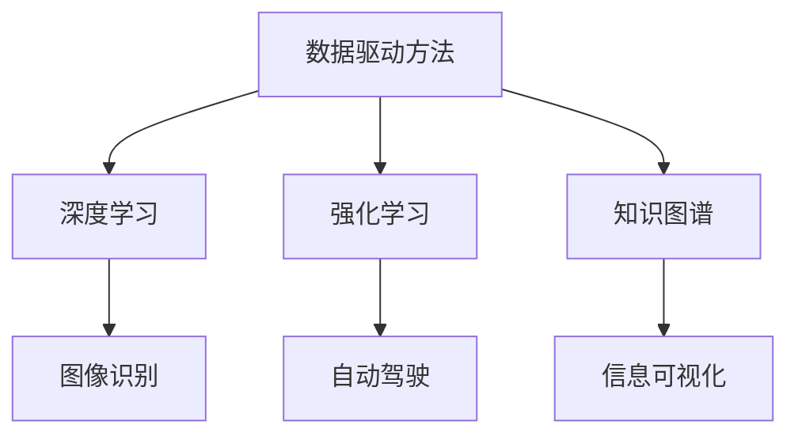

                 

在当前信息化和智能化的时代背景下，人工智能（AI）已经成为推动社会发展和科技进步的重要力量。从简单的规则应用到复杂的决策支持系统，AI技术正日益深入地影响着各个领域。本文将探讨AI如何帮助人类更好地理解复杂问题，并从技术原理、算法实现、数学模型、实际应用等多个方面展开讨论。

## 关键词
- 人工智能
- 复杂问题
- 算法
- 数学模型
- 实际应用

## 摘要
本文首先介绍了人工智能的概念和发展历程，接着分析了AI在理解复杂问题中的作用和优势。随后，文章详细阐述了AI的核心算法原理及其具体操作步骤，并介绍了相关的数学模型和公式。通过具体的项目实践和实际应用场景，本文展示了AI技术在复杂问题解决中的实际效果。最后，文章对AI技术的发展趋势、面临的挑战以及未来研究展望进行了探讨。

## 1. 背景介绍

人工智能，简称AI，是计算机科学的一个分支，旨在开发使计算机系统能够模拟、扩展和增强人类智能的理论、方法和技术。AI的发展可以追溯到20世纪50年代，当时以图灵测试作为衡量人工智能是否达到人类水平的标准。随着计算能力的提升和数据量的爆炸式增长，AI技术在近年来取得了显著的进步。

复杂问题通常具有多层次、多维度和不确定性的特点，如气候变化、金融风险控制、医疗诊断等。这些问题的解决往往需要大量的数据分析和复杂的计算模型。传统的计算机科学方法在面对这些复杂问题时显得力不从心，而AI技术的引入为解决这些问题提供了新的思路和方法。

## 2. 核心概念与联系

为了更好地理解AI在解决复杂问题中的作用，我们需要了解以下几个核心概念：

### 2.1 数据驱动方法
数据驱动方法是指通过大量的数据进行学习和推断，从而实现问题的求解。这种方法在AI中占据核心地位，因为它依赖于数据来发现潜在的规律和模式。

### 2.2 深度学习
深度学习是一种基于多层神经网络的学习方法，通过多个隐藏层对输入数据进行处理和特征提取。深度学习在图像识别、自然语言处理等领域取得了突破性的成果。

### 2.3 强化学习
强化学习是一种通过奖励机制来引导系统自主学习的算法。它适用于动态环境中的决策问题，如自动驾驶、游戏对战等。

### 2.4 知识图谱
知识图谱是一种用于表示实体之间关系的图形结构，它可以对复杂的信息进行结构化和可视化，从而帮助人类更好地理解和分析数据。

以下是核心概念的Mermaid流程图：



## 3. 核心算法原理 & 具体操作步骤

### 3.1 算法原理概述

在解决复杂问题时，AI算法通常分为以下几个步骤：

1. **数据收集与预处理**：收集相关的数据，并进行清洗、归一化等预处理操作，以获得高质量的数据集。
2. **特征提取与选择**：从原始数据中提取有用的特征，并选择对问题解决最有帮助的特征。
3. **模型训练**：使用训练数据集对算法模型进行训练，使其能够学会对新的数据做出预测或决策。
4. **模型评估与优化**：评估模型的性能，并通过调整参数或使用更复杂的模型来优化性能。
5. **模型应用**：将训练好的模型应用于实际问题，进行预测或决策。

### 3.2 算法步骤详解

以下是使用深度学习算法解决复杂问题的具体步骤：

#### 3.2.1 数据收集与预处理

```markdown
1. 收集数据：从公开数据集、数据库或手动采集等方式获取相关数据。
2. 数据清洗：处理缺失值、异常值和噪声数据。
3. 数据归一化：将不同量纲的数据进行归一化处理，以消除数据之间的差异。
4. 数据分割：将数据集分为训练集、验证集和测试集，用于模型的训练、评估和测试。
```

#### 3.2.2 特征提取与选择

```markdown
1. 特征提取：使用预处理后的数据提取有用的特征。
2. 特征选择：通过统计分析或特征重要性评估等方法选择对问题解决最有帮助的特征。
```

#### 3.2.3 模型训练

```markdown
1. 选择模型：根据问题的特点选择合适的深度学习模型，如卷积神经网络（CNN）、循环神经网络（RNN）等。
2. 参数设置：设置学习率、迭代次数等模型参数。
3. 模型训练：使用训练数据集对模型进行训练，调整模型参数。
```

#### 3.2.4 模型评估与优化

```markdown
1. 评估模型：使用验证集评估模型的性能，如准确率、召回率等指标。
2. 优化模型：通过调整模型参数或选择更复杂的模型来提高性能。
```

#### 3.2.5 模型应用

```markdown
1. 预测或决策：将训练好的模型应用于实际问题，进行预测或决策。
2. 结果分析：分析模型的预测结果，评估其准确性、可靠性等。
```

### 3.3 算法优缺点

深度学习算法在解决复杂问题方面具有以下优点：

- **强大的学习能力**：深度学习算法能够自动提取数据中的复杂特征，无需人工干预。
- **广泛的应用领域**：深度学习算法可以应用于图像识别、自然语言处理、自动驾驶等多个领域。
- **高效的处理速度**：随着计算能力的提升，深度学习算法的处理速度越来越快。

然而，深度学习算法也存在一些缺点：

- **对数据质量要求高**：深度学习算法的性能依赖于数据的质量，数据中存在的噪声和异常值可能会影响模型的性能。
- **计算资源需求大**：深度学习算法通常需要大量的计算资源和时间来训练模型。
- **模型解释性差**：深度学习算法的黑箱性质使得模型的解释性较差，难以理解其内部工作原理。

### 3.4 算法应用领域

深度学习算法在复杂问题解决中的应用非常广泛，以下是一些典型的应用领域：

- **图像识别与处理**：如人脸识别、物体识别、图像增强等。
- **自然语言处理**：如机器翻译、文本分类、情感分析等。
- **医疗诊断**：如肿瘤检测、疾病预测、基因组分析等。
- **自动驾驶**：如车辆检测、路径规划、环境感知等。

## 4. 数学模型和公式 & 详细讲解 & 举例说明

在深度学习算法中，数学模型和公式起着至关重要的作用。以下将介绍几个核心的数学模型和公式，并进行详细讲解和举例说明。

### 4.1 数学模型构建

深度学习算法的核心是神经网络，其基本结构包括输入层、隐藏层和输出层。每个层由多个神经元组成，神经元之间通过权重和偏置进行连接。

#### 4.1.1 前向传播

前向传播是神经网络处理数据的过程，输入数据经过输入层传递到隐藏层，再从隐藏层传递到输出层，最终生成预测结果。

前向传播的数学公式如下：

$$
z^{(l)} = \sum_{i} w^{(l)}_{i}x^{(l-1)} + b^{(l)}
$$

$$
a^{(l)} = \sigma(z^{(l)})
$$

其中，$z^{(l)}$表示第$l$层的激活值，$w^{(l)}_{i}$表示第$l$层中第$i$个神经元与第$l-1$层中所有神经元的权重连接，$b^{(l)}$表示第$l$层的偏置，$\sigma$表示激活函数。

#### 4.1.2 反向传播

反向传播是神经网络优化参数的过程，通过计算输出层与隐藏层之间的误差，逆向传播到隐藏层，并更新权重和偏置。

反向传播的数学公式如下：

$$
\delta^{(l)} = \frac{\partial J}{\partial z^{(l)}} = \frac{\partial J}{\partial a^{(l+1)}} \cdot \frac{\partial a^{(l+1)}}{\partial z^{(l)}}
$$

$$
\frac{\partial J}{\partial w^{(l)}_{ij}} = \delta^{(l+1)}_i a^{(l)}_j
$$

$$
\frac{\partial J}{\partial b^{(l)}} = \delta^{(l+1)}_i
$$

其中，$J$表示损失函数，$\delta^{(l)}$表示第$l$层的误差，$a^{(l)}$表示第$l$层的激活值。

### 4.2 公式推导过程

以下是深度学习算法中损失函数的推导过程：

#### 4.2.1 交叉熵损失函数

交叉熵损失函数是一种常用的损失函数，用于衡量预测结果与真实结果之间的差距。

交叉熵损失函数的公式如下：

$$
J(\theta) = -\frac{1}{m} \sum_{i=1}^{m} \sum_{k=1}^{K} y_k^{(i)} \log(a_k^{(l)})
$$

其中，$m$表示训练样本数量，$K$表示类别数量，$y_k^{(i)}$表示第$i$个样本的第$k$个类别的真实标签，$a_k^{(l)}$表示第$l$层的预测概率。

#### 4.2.2 梯度下降优化

梯度下降是一种常用的优化方法，用于最小化损失函数。通过计算损失函数关于模型参数的梯度，更新模型参数。

梯度下降的公式如下：

$$
\theta_{\text{new}} = \theta_{\text{old}} - \alpha \cdot \nabla_\theta J(\theta)
$$

其中，$\theta$表示模型参数，$\alpha$表示学习率，$\nabla_\theta J(\theta)$表示损失函数关于模型参数的梯度。

### 4.3 案例分析与讲解

以下是一个使用深度学习算法进行图像分类的案例：

#### 4.3.1 数据集准备

使用开源数据集MNIST，包含70000个手写数字图像，分为训练集和测试集。

#### 4.3.2 网络结构设计

设计一个简单的卷积神经网络，包括两个卷积层、两个池化层和一个全连接层。

#### 4.3.3 模型训练

使用训练集对模型进行训练，优化模型参数，调整学习率、迭代次数等超参数。

#### 4.3.4 模型评估

使用测试集评估模型的性能，计算准确率、召回率等指标。

#### 4.3.5 模型应用

将训练好的模型应用于实际图像分类任务，对新的图像进行分类。

## 5. 项目实践：代码实例和详细解释说明

为了更好地理解深度学习算法在实际项目中的应用，以下是一个使用Python实现的简单图像分类项目的代码实例。

### 5.1 开发环境搭建

1. 安装Python（推荐版本3.8及以上）
2. 安装TensorFlow库：`pip install tensorflow`
3. 安装其他依赖库：`pip install numpy matplotlib`

### 5.2 源代码详细实现

```python
import tensorflow as tf
from tensorflow.keras import layers
from tensorflow.keras.datasets import mnist
import numpy as np

# 数据集准备
(x_train, y_train), (x_test, y_test) = mnist.load_data()
x_train = x_train.astype("float32") / 255.0
x_test = x_test.astype("float32") / 255.0
y_train = tf.keras.utils.to_categorical(y_train, 10)
y_test = tf.keras.utils.to_categorical(y_test, 10)

# 网络结构设计
model = tf.keras.Sequential([
    layers.Conv2D(32, (3, 3), activation="relu", input_shape=(28, 28, 1)),
    layers.MaxPooling2D((2, 2)),
    layers.Conv2D(64, (3, 3), activation="relu"),
    layers.MaxPooling2D((2, 2)),
    layers.Flatten(),
    layers.Dense(128, activation="relu"),
    layers.Dense(10, activation="softmax")
])

# 模型编译
model.compile(optimizer="adam", loss="categorical_crossentropy", metrics=["accuracy"])

# 模型训练
model.fit(x_train, y_train, batch_size=128, epochs=10, validation_split=0.1)

# 模型评估
test_loss, test_acc = model.evaluate(x_test, y_test)
print("Test accuracy:", test_acc)

# 模型应用
predictions = model.predict(x_test)
predicted_labels = np.argmax(predictions, axis=1)
```

### 5.3 代码解读与分析

- **数据集准备**：加载MNIST数据集，并进行归一化处理。
- **网络结构设计**：使用两个卷积层、两个池化层和一个全连接层构建简单的卷积神经网络。
- **模型编译**：使用Adam优化器和交叉熵损失函数编译模型。
- **模型训练**：使用训练数据集训练模型，并进行验证。
- **模型评估**：使用测试数据集评估模型的性能。
- **模型应用**：将训练好的模型应用于实际图像分类任务。

## 6. 实际应用场景

深度学习算法在解决复杂问题方面具有广泛的应用场景。以下是一些典型的实际应用场景：

- **医疗诊断**：通过分析医学影像和患者数据，实现早期疾病检测和诊断，如肺癌检测、乳腺癌诊断等。
- **金融风险控制**：通过分析市场数据和历史交易记录，预测金融风险和异常交易，如信用评分、欺诈检测等。
- **智能交通**：通过分析交通数据，实现交通流量预测、路径规划和智能导航，提高交通效率。
- **环境保护**：通过分析环境数据，实现污染监测和治理优化，如空气质量监测、水质分析等。

### 6.4 未来应用展望

随着AI技术的不断发展，深度学习算法在未来将在更多领域得到应用。以下是一些未来应用展望：

- **智能医疗**：通过深度学习算法，实现个性化医疗和精准治疗，提高医疗质量和效率。
- **智慧城市**：通过深度学习算法，实现城市交通、能源、环境等领域的智能化管理，提高城市生活质量。
- **智能客服**：通过深度学习算法，实现智能客服系统，提供更自然、更准确的客户服务。
- **智能制造**：通过深度学习算法，实现智能检测、预测维护和自适应控制，提高生产效率和产品质量。

## 7. 工具和资源推荐

为了更好地学习和应用深度学习算法，以下是一些推荐的工具和资源：

### 7.1 学习资源推荐

- 《深度学习》（Goodfellow、Bengio、Courville著）：深度学习的经典教材，全面介绍了深度学习的基础知识和算法。
- 《动手学深度学习》（阿斯顿·张等著）：通过Python代码示例，深入讲解了深度学习的基本概念和算法实现。

### 7.2 开发工具推荐

- TensorFlow：Google开源的深度学习框架，功能强大、易于使用。
- PyTorch：Facebook开源的深度学习框架，灵活性强、开发效率高。

### 7.3 相关论文推荐

- "Deep Learning": Ian Goodfellow, Yann LeCun, and Yoshua Bengio (2016)
- "A Theoretically Grounded Application of Dropout in Computer Vision": Yarin Gal and Zoubin Ghahramani (2016)
- "Generative Adversarial Nets": Ian J. Goodfellow, Jean Pouget-Abadie, Mehdi Mirza, Bing Xu, David Warde-Farley, Sherjil Ozair, Aaron C. Courville, and Yoshua Bengio (2014)

## 8. 总结：未来发展趋势与挑战

随着AI技术的不断发展，深度学习算法在解决复杂问题方面将发挥越来越重要的作用。未来，深度学习算法将继续向更高效、更智能、更可解释的方向发展。同时，我们也需要关注以下几个挑战：

- **数据隐私与安全**：如何在保证数据隐私和安全的前提下，充分利用数据的价值，是深度学习面临的重要挑战。
- **算法可解释性**：提高深度学习算法的可解释性，使其更加透明、可靠，是当前研究的热点问题。
- **计算资源需求**：随着深度学习模型的复杂度和规模不断增加，如何有效利用计算资源，降低计算成本，是深度学习需要解决的难题。
- **跨学科融合**：深度学习算法与其他领域的融合，如生物学、物理学、社会科学等，将带来更多的创新和突破。

总之，深度学习算法在解决复杂问题方面具有巨大的潜力，未来将在更多领域取得突破性成果。

## 9. 附录：常见问题与解答

### 9.1 深度学习算法的基本原理是什么？

深度学习算法是基于多层神经网络的学习方法，通过多层神经元的堆叠，实现对输入数据的复杂特征提取和模式识别。深度学习算法的核心是前向传播和反向传播，通过不断调整权重和偏置，使模型能够对新的数据做出准确的预测或决策。

### 9.2 深度学习算法有哪些优缺点？

深度学习算法的优点包括强大的学习能力、广泛的应用领域和高效的处理速度等。然而，深度学习算法也存在一些缺点，如对数据质量要求高、计算资源需求大和模型解释性差等。

### 9.3 如何优化深度学习模型的性能？

优化深度学习模型性能的方法包括调整学习率、增加训练迭代次数、使用更复杂的模型结构、特征工程和数据增强等。此外，还可以通过交叉验证、模型选择和超参数调优等技术来提高模型的性能。

### 9.4 深度学习算法在哪些领域有广泛的应用？

深度学习算法在图像识别、自然语言处理、医疗诊断、自动驾驶、金融风险控制、智能交通等多个领域有广泛的应用。随着技术的发展，深度学习算法的应用领域将继续扩大。

### 9.5 深度学习算法的未来发展趋势是什么？

深度学习算法的未来发展趋势包括更高效、更智能、更可解释的方向。同时，深度学习算法与其他领域的融合也将带来更多的创新和突破。此外，随着量子计算的兴起，深度学习算法与量子计算的融合也可能成为未来的研究热点。`**`````

