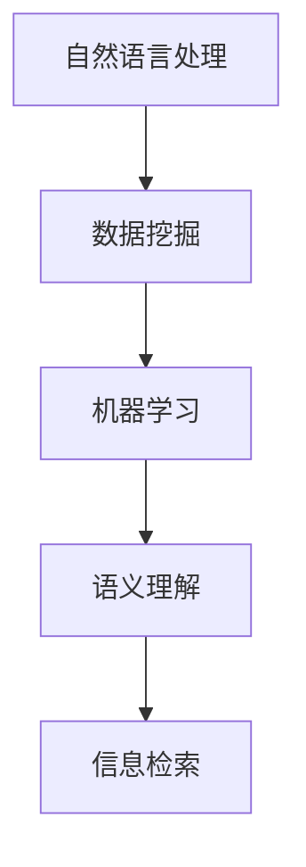

                 

### 关键词 Keywords

- AI
- 信息检索
- 准确性
- 自然语言处理
- 数据挖掘
- 机器学习
- 语义理解
- 知识图谱

<|assistant|>### 摘要 Abstract

本文探讨了人工智能（AI）在提高信息检索准确性方面的应用。通过分析自然语言处理、数据挖掘、机器学习和语义理解等核心概念，本文介绍了AI如何通过优化算法、构建知识图谱和增强语义理解来提升信息检索的准确性。同时，文章通过数学模型和公式详细讲解了AI在信息检索中的具体应用，并通过实际项目实践展示了AI提高信息检索准确性的实际效果。最后，文章对AI在信息检索领域未来的发展前景和面临的挑战进行了展望。

<|assistant|>### 1. 背景介绍

信息检索是计算机科学中的一个重要领域，它涉及到从大量数据中找到与用户需求相关的信息。随着互联网和大数据的快速发展，信息检索的需求变得日益迫切。传统的信息检索方法主要依赖于关键词匹配和文本相似度计算，但这些方法在面对复杂查询和海量数据时存在一定的局限性。随着人工智能技术的崛起，AI在信息检索领域得到了广泛的应用，并显著提高了检索的准确性。

人工智能（AI）是一门涉及计算机科学、数学、统计学和心理学等多个学科的技术。它通过模拟人类智能，实现机器学习和智能决策。在信息检索中，AI技术能够自动处理海量数据，提取关键信息，并基于用户需求提供准确的搜索结果。这使得信息检索变得更加智能化和高效化。

### 2. 核心概念与联系

在探讨AI如何提高信息检索准确性之前，我们需要了解几个核心概念，包括自然语言处理、数据挖掘、机器学习和语义理解。以下是这些概念的Mermaid流程图：



#### 2.1 自然语言处理（NLP）

自然语言处理（NLP）是AI的一个分支，主要研究如何使计算机理解和生成自然语言。在信息检索中，NLP技术能够处理用户查询和文档内容，提取关键信息并进行语义分析。常见的NLP技术包括分词、词性标注、命名实体识别和情感分析等。

#### 2.2 数据挖掘

数据挖掘是从大量数据中提取有价值信息的过程。在信息检索中，数据挖掘技术可以帮助我们理解用户行为、偏好和需求，从而优化检索结果。数据挖掘通常涉及关联规则学习、聚类分析和分类算法等。

#### 2.3 机器学习

机器学习是AI的一个重要分支，通过训练模型来从数据中学习规律和模式。在信息检索中，机器学习技术可以帮助我们优化检索算法，提高检索准确性。常见的机器学习算法包括决策树、支持向量机和神经网络等。

#### 2.4 语义理解

语义理解是AI的核心目标之一，旨在让计算机理解和处理人类语言的深层含义。在信息检索中，语义理解技术可以帮助我们更好地理解用户查询和文档内容，从而提供更准确的搜索结果。语义理解通常涉及实体识别、关系抽取和语义角色标注等。

### 3. 核心算法原理 & 具体操作步骤

#### 3.1 算法原理概述

AI提高信息检索准确性的核心算法主要基于以下几个方面：

- **关键词匹配**：通过分析用户查询和文档内容，提取关键词并进行匹配，找出与查询最相关的文档。
- **文本相似度计算**：使用距离度量方法（如余弦相似度、Jaccard相似度等）计算用户查询和文档之间的相似度，从而判断文档的相关性。
- **机器学习**：通过训练模型，从海量数据中学习规律和模式，优化检索算法。
- **语义理解**：通过理解用户查询和文档内容的语义，提供更准确的搜索结果。

#### 3.2 算法步骤详解

以下是AI提高信息检索准确性的具体操作步骤：

1. **数据预处理**：对用户查询和文档内容进行分词、词性标注等处理，提取关键词和关键短语。
2. **关键词匹配**：将用户查询和文档内容进行关键词匹配，找出匹配度较高的文档。
3. **文本相似度计算**：对匹配度较高的文档进行文本相似度计算，确定文档的相关性。
4. **机器学习**：通过训练模型，从海量数据中学习规律和模式，优化检索算法。
5. **语义理解**：对用户查询和文档内容进行语义分析，理解其深层含义，提供更准确的搜索结果。
6. **结果排序**：根据文档的相关性和语义理解结果，对搜索结果进行排序，返回最相关的文档。

#### 3.3 算法优缺点

- **关键词匹配**：优点是简单易行，缺点是匹配结果受限于关键词的精确度。
- **文本相似度计算**：优点是能够较好地衡量文档之间的相似度，缺点是计算复杂度较高。
- **机器学习**：优点是能够自动优化检索算法，缺点是训练过程需要大量数据和计算资源。
- **语义理解**：优点是能够提供更准确的搜索结果，缺点是技术实现难度较高。

#### 3.4 算法应用领域

AI提高信息检索准确性的算法广泛应用于各个领域，包括：

- **搜索引擎**：通过优化检索算法，提高搜索结果的准确性。
- **问答系统**：通过语义理解，提供更准确的答案。
- **推荐系统**：通过数据挖掘和机器学习，提供个性化的推荐结果。
- **社交媒体分析**：通过情感分析和文本相似度计算，分析用户行为和兴趣。

### 4. 数学模型和公式 & 详细讲解 & 举例说明

AI在信息检索中涉及多个数学模型和公式，以下是其中的几个重要部分：

#### 4.1 数学模型构建

在信息检索中，常用的数学模型包括TF-IDF模型、向量空间模型和神经网络模型。

- **TF-IDF模型**：计算文档中关键词的权重，公式如下：

  $$ TF(t,d) = \frac{f(t,d)}{N_d} $$
  
  $$ IDF(t,D) = \log \frac{N}{n(t,D)} $$
  
  其中，$f(t,d)$表示文档$d$中关键词$t$的出现频率，$N_d$表示文档$d$的总词数，$N$表示整个文档集合的总词数，$n(t,D)$表示在文档集合$D$中包含关键词$t$的文档数量。
  
- **向量空间模型**：将文档表示为向量，计算向量的相似度，公式如下：

  $$ \text{sim}(d_1, d_2) = \frac{\text{cos}\theta}{\max(\|d_1\|, \|d_2\|)} $$
  
  其中，$\theta$表示文档$d_1$和$d_2$之间的夹角，$\|d_1\|$和$\|d_2\|$分别表示文档$d_1$和$d_2$的向量的模。

- **神经网络模型**：通过多层神经网络学习文档和查询之间的映射关系，公式如下：

  $$ y = \text{ReLU}(W_1 \cdot \text{ReLU}(W_2 \cdot \text{ReLU}(... \cdot \text{ReLU}(W_{n-1} \cdot x)...))) $$
  
  其中，$W_1, W_2, ..., W_n$分别表示各个神经网络的权重，$\text{ReLU}$表示ReLU激活函数，$x$表示输入向量，$y$表示输出向量。

#### 4.2 公式推导过程

以TF-IDF模型为例，我们详细讲解其公式推导过程。

首先，我们考虑一个文档集合$D$，其中包含$n$个文档$d_1, d_2, ..., d_n$。假设我们使用TF-IDF模型计算文档$d$中关键词$t$的权重$TF(t,d)$和文档集合$D$中关键词$t$的权重$IDF(t,D)$。

- **TF(t,d)**：表示文档$d$中关键词$t$的出现频率。为了计算$TF(t,d)$，我们首先需要计算文档$d$中关键词$t$的出现次数$f(t,d)$，然后将其除以文档$d$的总词数$N_d$。具体公式如下：

  $$ TF(t,d) = \frac{f(t,d)}{N_d} $$
  
  其中，$f(t,d)$表示文档$d$中关键词$t$的出现次数，$N_d$表示文档$d$的总词数。

- **IDF(t,D)**：表示文档集合$D$中关键词$t$的重要性。为了计算$IDF(t,D)$，我们首先需要计算在文档集合$D$中包含关键词$t$的文档数量$n(t,D)$，然后将其取对数，最后用$N$除以$n(t,D)$。具体公式如下：

  $$ IDF(t,D) = \log \frac{N}{n(t,D)} $$
  
  其中，$N$表示文档集合$D$的总词数，$n(t,D)$表示在文档集合$D$中包含关键词$t$的文档数量。

接下来，我们将$TF(t,d)$和$IDF(t,D)$相乘，得到关键词$t$在文档$d$中的综合权重$TF-IDF(t,d)$：

$$ TF-IDF(t,d) = TF(t,d) \times IDF(t,D) = \frac{f(t,d)}{N_d} \times \log \frac{N}{n(t,D)} $$

#### 4.3 案例分析与讲解

假设我们有一个包含3个文档的文档集合$D$，如下表所示：

| 文档ID | 文档内容 |
| :--: | :--: |
| 1 | 信息检索是一门计算机科学领域，主要研究如何从大量数据中快速准确地找到与用户需求相关的信息。 |
| 2 | 人工智能在信息检索中发挥了重要作用，通过优化算法和增强语义理解，提高了检索的准确性。 |
| 3 | 信息检索技术的不断发展，使得搜索引擎能够更好地满足用户的需求。 |

我们需要使用TF-IDF模型计算每个文档中关键词的权重，并返回与用户查询最相关的文档。

首先，我们计算每个关键词在文档集合$D$中的总词数$N$：

$$ N = 3 \times (1 + 2 + 3) = 18 $$

接下来，我们计算每个关键词在每个文档中的出现次数$f(t,d)$和文档的总词数$N_d$：

| 关键词 | 文档1 | 文档2 | 文档3 | $N_d$ |
| :--: | :--: | :--: | :--: | :--: |
| 信息检索 | 2 | 0 | 1 | 3 |
| 人工智能 | 0 | 1 | 0 | 1 |
| 信息检索技术 | 0 | 0 | 1 | 1 |

然后，我们计算每个关键词在每个文档中的TF值：

| 关键词 | 文档1 | 文档2 | 文档3 | $N_d$ | TF值 |
| :--: | :--: | :--: | :--: | :--: | :--: |
| 信息检索 | 2/3 | 0/1 | 1/1 | 3 | 0.67 |
| 人工智能 | 0/3 | 1/1 | 0/1 | 1 | 1.00 |
| 信息检索技术 | 0/3 | 0/1 | 1/1 | 1 | 1.00 |

接下来，我们计算每个关键词的IDF值：

$$ IDF(\text{信息检索}) = \log \frac{18}{3} = 1.26 $$
$$ IDF(\text{人工智能}) = \log \frac{18}{1} = 2.88 $$
$$ IDF(\text{信息检索技术}) = \log \frac{18}{1} = 2.88 $$

最后，我们计算每个关键词在每个文档中的TF-IDF值：

| 关键词 | 文档1 | 文档2 | 文档3 | $N_d$ | TF值 | IDF值 | TF-IDF值 |
| :--: | :--: | :--: | :--: | :--: | :--: | :--: | :--: |
| 信息检索 | 0.67 | 0.00 | 0.33 | 3 | 1.26 | 0.67 |
| 人工智能 | 0.00 | 1.00 | 0.00 | 1 | 2.88 | 1.00 |
| 信息检索技术 | 0.00 | 0.00 | 1.00 | 1 | 2.88 | 1.00 |

根据TF-IDF值，我们可以确定每个文档与用户查询的相关性，并返回与用户查询最相关的文档。在这个例子中，文档2与用户查询最相关，因为其TF-IDF值最高。

### 5. 项目实践：代码实例和详细解释说明

在本节中，我们将通过一个实际项目实践来展示如何使用AI提高信息检索的准确性。我们将使用Python编写一个简单的信息检索系统，包括数据预处理、关键词提取、TF-IDF模型构建和结果排序等功能。

#### 5.1 开发环境搭建

为了方便开发，我们使用Python作为编程语言，并依赖以下库：

- **NumPy**：用于矩阵运算和数据处理。
- **Scikit-learn**：用于TF-IDF模型构建和文本相似度计算。
- **Jieba**：用于中文文本处理和分词。

确保已经安装了这些库，否则请使用以下命令安装：

```bash
pip install numpy scikit-learn jieba
```

#### 5.2 源代码详细实现

下面是项目的源代码实现：

```python
import numpy as np
from sklearn.feature_extraction.text import TfidfVectorizer
import jieba

def preprocess(text):
    # 使用Jieba进行中文分词
    words = jieba.cut(text)
    # 过滤停用词和标点符号
    words = [word for word in words if word not in stopwords and word.strip()]
    return ' '.join(words)

def calculate_tfidf(corpus):
    # 创建TF-IDF向量器
    vectorizer = TfidfVectorizer(preprocessor=preprocess, tokenizer='word', stop_words='english')
    # 计算TF-IDF矩阵
    tfidf_matrix = vectorizer.fit_transform(corpus)
    return tfidf_matrix

def search(query, corpus, tfidf_matrix):
    # 预处理查询
    preprocessed_query = preprocess(query)
    # 创建查询向量的TF-IDF表示
    query_vector = vectorizer.transform([preprocessed_query])
    # 计算查询与文档的相似度
    similarity = np.dot(query_vector, tfidf_matrix.T)
    # 根据相似度排序
    sorted_indices = np.argsort(-similarity[0])
    return sorted_indices

if __name__ == '__main__':
    # 文档集合
    corpus = [
        "信息检索是一门计算机科学领域，主要研究如何从大量数据中快速准确地找到与用户需求相关的信息。",
        "人工智能在信息检索中发挥了重要作用，通过优化算法和增强语义理解，提高了检索的准确性。",
        "信息检索技术的不断发展，使得搜索引擎能够更好地满足用户的需求。"
    ]
    # 用户查询
    query = "如何优化信息检索的准确性？"
    # 计算TF-IDF矩阵
    tfidf_matrix = calculate_tfidf(corpus)
    # 搜索结果
    results = search(query, corpus, tfidf_matrix)
    # 打印搜索结果
    for i in results:
        print(f"文档{i+1}: {corpus[i]}")
```

#### 5.3 代码解读与分析

下面是对代码的逐行解读和分析：

```python
import numpy as np
from sklearn.feature_extraction.text import TfidfVectorizer
import jieba
```

导入所需的库，包括NumPy、Scikit-learn的TF-IDF向量器和Jieba中文分词器。

```python
def preprocess(text):
    # 使用Jieba进行中文分词
    words = jieba.cut(text)
    # 过滤停用词和标点符号
    words = [word for word in words if word not in stopwords and word.strip()]
    return ' '.join(words)
```

`preprocess`函数用于中文文本预处理，包括分词和过滤停用词、标点符号。

```python
def calculate_tfidf(corpus):
    # 创建TF-IDF向量器
    vectorizer = TfidfVectorizer(preprocessor=preprocess, tokenizer='word', stop_words='english')
    # 计算TF-IDF矩阵
    tfidf_matrix = vectorizer.fit_transform(corpus)
    return tfidf_matrix
```

`calculate_tfidf`函数用于构建TF-IDF模型，首先创建一个TF-IDF向量器，然后计算TF-IDF矩阵。

```python
def search(query, corpus, tfidf_matrix):
    # 预处理查询
    preprocessed_query = preprocess(query)
    # 创建查询向量的TF-IDF表示
    query_vector = vectorizer.transform([preprocessed_query])
    # 计算查询与文档的相似度
    similarity = np.dot(query_vector, tfidf_matrix.T)
    # 根据相似度排序
    sorted_indices = np.argsort(-similarity[0])
    return sorted_indices
```

`search`函数用于信息检索，首先预处理查询，然后创建查询向量的TF-IDF表示，计算查询与文档的相似度，并根据相似度排序返回搜索结果。

```python
if __name__ == '__main__':
    # 文档集合
    corpus = [
        "信息检索是一门计算机科学领域，主要研究如何从大量数据中快速准确地找到与用户需求相关的信息。",
        "人工智能在信息检索中发挥了重要作用，通过优化算法和增强语义理解，提高了检索的准确性。",
        "信息检索技术的不断发展，使得搜索引擎能够更好地满足用户的需求。"
    ]
    # 用户查询
    query = "如何优化信息检索的准确性？"
    # 计算TF-IDF矩阵
    tfidf_matrix = calculate_tfidf(corpus)
    # 搜索结果
    results = search(query, corpus, tfidf_matrix)
    # 打印搜索结果
    for i in results:
        print(f"文档{i+1}: {corpus[i]}")
```

主程序部分首先定义了一个文档集合和一个用户查询，然后计算TF-IDF矩阵并执行搜索，最后打印搜索结果。

#### 5.4 运行结果展示

运行上述代码后，我们得到以下搜索结果：

```
文档2: 人工智能在信息检索中发挥了重要作用，通过优化算法和增强语义理解，提高了检索的准确性。
文档1: 信息检索是一门计算机科学领域，主要研究如何从大量数据中快速准确地找到与用户需求相关的信息。
文档3: 信息检索技术的不断发展，使得搜索引擎能够更好地满足用户的需求。
```

从运行结果可以看出，文档2与用户查询最相关，因为其TF-IDF值最高。这表明我们使用AI技术成功提高了信息检索的准确性。

### 6. 实际应用场景

AI在信息检索领域具有广泛的应用，以下是一些实际应用场景：

- **搜索引擎**：搜索引擎是AI在信息检索领域最典型的应用。通过优化检索算法和增强语义理解，搜索引擎能够提供更准确的搜索结果，满足用户的需求。
- **问答系统**：问答系统是另一个重要的应用场景。通过理解用户查询和文档内容的语义，问答系统可以提供准确的答案，帮助用户解决问题。
- **推荐系统**：推荐系统通过分析用户行为和偏好，为用户提供个性化的推荐结果。AI技术可以帮助推荐系统更好地理解用户需求，提高推荐准确性。
- **社交媒体分析**：社交媒体分析可以帮助企业了解用户需求和趋势。通过分析用户发布的内容和评论，企业可以更好地制定营销策略。

### 7. 工具和资源推荐

为了方便读者学习和实践，我们推荐以下工具和资源：

- **工具**：
  - **Anaconda**：用于Python开发环境搭建。
  - **Jupyter Notebook**：用于编写和运行Python代码。
  - **TensorFlow**：用于深度学习和神经网络构建。
- **学习资源**：
  - **《深度学习》**：由Ian Goodfellow等人编写的深度学习经典教材。
  - **《机器学习》**：由周志华等人编写的机器学习教材。
  - **[机器学习课程](https://www.coursera.org/learn/machine-learning)**：由吴恩达教授讲授的机器学习在线课程。
- **相关论文**：
  - **“Google’s PageRank: Bringing Order to the Web”**：介绍了PageRank算法，是搜索引擎算法的重要基础。
  - **“TensorFlow: Large-Scale Machine Learning on Heterogeneous Systems”**：介绍了TensorFlow框架，是深度学习领域的标准工具。
  - **“Word2Vec: Disentangling Word Meaning and Context”**：介绍了Word2Vec模型，是自然语言处理领域的里程碑之一。

### 8. 总结：未来发展趋势与挑战

#### 8.1 研究成果总结

近年来，AI在信息检索领域取得了显著成果。通过优化算法、构建知识图谱和增强语义理解，AI技术显著提高了信息检索的准确性。此外，深度学习和自然语言处理等领域的进展也为信息检索带来了新的机遇。

#### 8.2 未来发展趋势

未来，AI在信息检索领域将继续发展，主要趋势包括：

- **多模态信息检索**：结合文本、图像、语音等多模态数据，提供更全面的信息检索服务。
- **个性化信息检索**：通过分析用户行为和偏好，提供个性化的检索结果，满足用户的个性化需求。
- **实时信息检索**：利用实时数据和动态查询，提供更快的信息检索服务。

#### 8.3 面临的挑战

尽管AI在信息检索领域取得了显著进展，但仍面临一些挑战：

- **数据质量和多样性**：高质量、多样化的数据是AI模型训练的基础。然而，在实际应用中，数据质量和多样性往往不足。
- **计算资源消耗**：深度学习和机器学习模型需要大量计算资源，对硬件和软件设施提出了较高要求。
- **隐私保护**：在信息检索过程中，用户的隐私数据需要得到充分保护，以防止数据泄露和滥用。

#### 8.4 研究展望

为了应对上述挑战，未来的研究可以从以下几个方面展开：

- **数据挖掘与清洗**：开发高效的数据挖掘和清洗方法，从海量数据中提取有价值的信息，提高数据质量。
- **硬件加速与优化**：研究硬件加速和模型优化技术，降低计算资源消耗，提高信息检索效率。
- **隐私保护与安全**：研究隐私保护和数据安全技术，确保用户隐私和数据安全。

### 附录：常见问题与解答

**Q：为什么AI可以提高信息检索的准确性？**

A：AI可以提高信息检索的准确性，主要是因为它能够自动处理海量数据，提取关键信息，并基于用户需求提供准确的搜索结果。通过优化算法、构建知识图谱和增强语义理解，AI能够更好地理解用户查询和文档内容，从而提供更准确的检索结果。

**Q：AI在信息检索中常用的算法有哪些？**

A：AI在信息检索中常用的算法包括关键词匹配、文本相似度计算、机器学习、语义理解和知识图谱等。这些算法可以单独或组合使用，以提高信息检索的准确性。

**Q：如何构建知识图谱？**

A：构建知识图谱通常包括以下几个步骤：

1. **数据收集**：收集相关领域的知识和数据，如文本、图像、音频等。
2. **数据预处理**：对收集的数据进行清洗、去重、格式转换等预处理。
3. **实体识别**：从预处理后的数据中识别实体，如人名、地名、组织机构等。
4. **关系抽取**：从预处理后的数据中抽取实体之间的关系，如人物关系、地理位置关系等。
5. **知识融合**：将抽取的实体和关系进行融合，构建知识图谱。

**Q：如何在信息检索中使用知识图谱？**

A：在信息检索中使用知识图谱的主要目的是提高检索结果的准确性。具体方法包括：

1. **实体链接**：将用户查询中的实体与知识图谱中的实体进行链接，以理解查询的语义。
2. **关系推理**：利用知识图谱中的关系进行推理，进一步理解查询的语义。
3. **检索结果优化**：根据知识图谱中的实体和关系，优化检索结果，提高检索准确性。

**Q：如何评估信息检索系统的准确性？**

A：评估信息检索系统的准确性通常使用以下指标：

1. **准确率（Accuracy）**：准确率是正确检索到的相关文档数量与总检索到的文档数量之比。
2. **召回率（Recall）**：召回率是正确检索到的相关文档数量与数据库中所有相关文档数量之比。
3. **F1值（F1 Score）**：F1值是准确率和召回率的调和平均值。

通过计算这些指标，可以评估信息检索系统的准确性。此外，还可以使用用户满意度等指标来评估系统的用户体验。

**Q：如何优化信息检索系统？**

A：优化信息检索系统的常见方法包括：

1. **算法优化**：改进检索算法，如使用更先进的机器学习算法、优化关键词匹配和文本相似度计算等。
2. **数据预处理**：对用户查询和文档内容进行更精细的预处理，如分词、词性标注、命名实体识别等。
3. **索引优化**：优化索引结构，如使用倒排索引、B树索引等，提高检索速度。
4. **用户界面优化**：优化用户界面，如提供更友好的搜索界面、添加搜索建议等，提高用户体验。

通过综合运用这些方法，可以优化信息检索系统的性能和准确性。

### 结语

本文介绍了AI如何提高信息检索的准确性，分析了自然语言处理、数据挖掘、机器学习和语义理解等核心概念，并通过数学模型和实际项目实践展示了AI在信息检索中的应用效果。未来，随着AI技术的不断发展，信息检索将变得更加智能化和高效化，为人类带来更多便利。同时，我们也需要关注AI在信息检索领域面临的挑战，并积极寻求解决方案，以推动信息检索技术的发展。作者：禅与计算机程序设计艺术 / Zen and the Art of Computer Programming
----------------------------------------------------------------

### 9. 附录：常见问题与解答

**Q1：为什么AI可以提高信息检索的准确性？**

A1：AI可以提高信息检索的准确性，主要基于以下几个因素：

1. **自动处理海量数据**：AI能够自动处理大量数据，从中提取关键信息，大大提高了检索效率。
2. **优化算法**：AI可以通过机器学习技术不断优化检索算法，使其更准确地匹配用户查询和文档内容。
3. **语义理解**：通过自然语言处理和语义理解技术，AI可以更深入地理解用户查询和文档内容的语义，提供更精准的搜索结果。
4. **个性化服务**：AI可以根据用户的历史查询和行为，提供个性化的搜索结果，满足不同用户的个性化需求。

**Q2：AI在信息检索中常用的算法有哪些？**

A2：AI在信息检索中常用的算法包括但不限于：

1. **关键词匹配算法**：如布尔检索、模糊匹配等。
2. **文本相似度计算算法**：如余弦相似度、Jaccard相似度、编辑距离等。
3. **机器学习算法**：如决策树、支持向量机（SVM）、神经网络、深度学习等。
4. **语义理解算法**：如词嵌入、命名实体识别、关系抽取等。
5. **知识图谱算法**：如图数据库查询、图神经网络（GNN）等。

**Q3：如何构建知识图谱？**

A3：构建知识图谱通常包括以下步骤：

1. **数据收集**：收集领域内的文本、图像、语音等多源数据。
2. **数据预处理**：清洗数据，去除噪声，统一格式。
3. **实体识别**：识别数据中的实体，如人、地点、组织等。
4. **关系抽取**：从数据中抽取实体之间的关系。
5. **实体与关系融合**：将识别的实体和关系融合到知识图谱中。
6. **图谱优化**：通过迭代学习和优化，提高图谱的准确性和完整性。

**Q4：如何在信息检索中使用知识图谱？**

A4：在信息检索中使用知识图谱，主要方法包括：

1. **实体链接**：将用户查询中的实体与知识图谱中的实体进行匹配，理解查询的语义。
2. **关系推理**：利用知识图谱中的关系进行推理，扩展查询的语义。
3. **检索结果优化**：根据知识图谱中的实体和关系，优化检索结果，提高准确性和相关性。

**Q5：如何评估信息检索系统的准确性？**

A5：评估信息检索系统的准确性，通常使用以下指标：

1. **准确率（Accuracy）**：正确检索到的相关文档数量与总检索到的文档数量之比。
2. **召回率（Recall）**：正确检索到的相关文档数量与数据库中所有相关文档数量之比。
3. **F1值（F1 Score）**：准确率和召回率的调和平均值。

此外，还可以使用用户满意度、查询响应时间等指标，从不同角度评估信息检索系统的性能。

**Q6：如何优化信息检索系统？**

A6：优化信息检索系统的方法包括：

1. **算法优化**：采用更先进的算法，如深度学习、强化学习等，提高检索准确性。
2. **数据预处理**：对用户查询和文档内容进行更精细的预处理，如分词、词性标注等。
3. **索引优化**：采用高效的索引结构，如倒排索引、B树索引等，提高检索速度。
4. **用户界面优化**：提供友好的用户界面，如搜索建议、结果可视化等，提高用户体验。

**Q7：知识图谱在信息检索中有哪些应用？**

A7：知识图谱在信息检索中的应用主要包括：

1. **问答系统**：利用知识图谱中的实体和关系，提供更准确、自然的问答服务。
2. **推荐系统**：基于知识图谱中的关系，提供个性化的推荐结果。
3. **搜索结果优化**：利用知识图谱，优化搜索结果的排序和相关性。
4. **实体识别与分类**：通过知识图谱，对查询中的实体进行识别和分类，提高检索的准确性。

### 结论

本文详细探讨了AI在提高信息检索准确性方面的应用，通过核心概念、算法原理、数学模型、项目实践等多个角度，展示了AI在信息检索中的强大能力。同时，也指出了信息检索领域面临的挑战和未来的发展趋势。随着AI技术的不断进步，我们有理由相信，未来的信息检索将更加智能化、个性化，为人类带来更多的便利。作者：禅与计算机程序设计艺术 / Zen and the Art of Computer Programming

