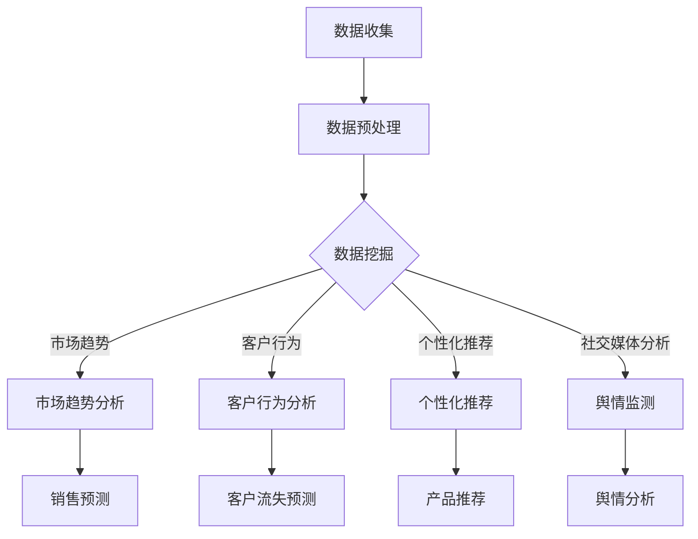

                 

关键词：AI，市场研究，消费者洞察，数据挖掘，预测分析，客户行为，个性化推荐，自然语言处理

> 摘要：随着人工智能技术的不断发展，AI 在市场研究和消费者洞察领域发挥着越来越重要的作用。本文将探讨 AI 如何通过数据挖掘、预测分析、客户行为分析和个性化推荐等技术，改变传统市场研究方法，提高企业对消费者需求的洞察力，从而实现更加精准的市场营销和产品创新。

## 1. 背景介绍

市场研究和消费者洞察是企业制定营销策略、优化产品设计和提高客户满意度的重要手段。传统的市场研究方法主要依赖于问卷调查、焦点小组访谈、市场分析报告等手段，虽然在一定程度上能够帮助企业了解市场需求，但存在以下局限性：

1. **数据获取难度大**：传统的市场研究方法往往需要大量的人力和时间，数据获取难度较大。
2. **数据质量参差不齐**：由于数据来源和调查方法的差异，数据质量难以保证，可能导致研究结果不准确。
3. **分析效率低**：传统市场研究方法的分析过程往往繁琐，效率较低，难以实时响应市场变化。

随着大数据、云计算和人工智能技术的兴起，市场研究和消费者洞察领域迎来了新的变革。人工智能技术具有强大的数据处理和分析能力，能够从海量数据中提取有价值的信息，帮助企业更好地了解市场趋势和消费者需求。本文将深入探讨 AI 在市场研究和消费者洞察领域的应用，以及其对传统方法的改变和提升。

## 2. 核心概念与联系

为了深入理解 AI 在市场研究和消费者洞察中的应用，我们需要了解以下几个核心概念：

### 2.1 数据挖掘

数据挖掘是一种从大量数据中发现有价值信息的过程。它利用统计学、机器学习、数据库等技术，从海量数据中提取模式、关联和趋势。数据挖掘在市场研究中的应用主要体现在以下几个方面：

1. **市场趋势分析**：通过分析历史数据，预测未来市场趋势，帮助企业制定长期战略。
2. **客户行为分析**：挖掘客户行为数据，了解客户喜好、购买习惯等，为企业提供个性化营销策略。
3. **竞争对手分析**：分析竞争对手的营销策略、产品特点和市场份额，为企业提供竞争情报。

### 2.2 预测分析

预测分析是一种利用历史数据预测未来趋势的方法。它通过建立数学模型，分析数据之间的关联和趋势，对未来事件进行预测。预测分析在市场研究和消费者洞察中的应用主要体现在以下几个方面：

1. **销售预测**：预测未来一段时间内的销售额，帮助企业制定生产和库存计划。
2. **需求预测**：预测消费者对不同产品的需求，为企业提供库存和采购决策。
3. **竞争预测**：预测竞争对手的市场份额和营销策略变化，为企业提供竞争情报。

### 2.3 客户行为分析

客户行为分析是一种通过分析客户行为数据，了解客户需求和行为模式的方法。它利用数据挖掘、机器学习等技术，从客户的购买记录、浏览行为、社交媒体互动等数据中提取有价值的信息。客户行为分析在市场研究和消费者洞察中的应用主要体现在以下几个方面：

1. **客户细分**：根据客户行为特征，将客户分为不同的群体，为企业提供针对性营销策略。
2. **客户流失预测**：预测哪些客户可能流失，采取相应的措施降低客户流失率。
3. **客户满意度分析**：分析客户满意度，了解客户对企业产品和服务的满意度，为企业提供改进方向。

### 2.4 个性化推荐

个性化推荐是一种基于用户行为和兴趣，为用户推荐个性化内容或商品的方法。它利用数据挖掘、协同过滤、基于内容的推荐等技术，从海量数据中提取用户的兴趣和偏好，为用户推荐符合其需求的内容或商品。个性化推荐在市场研究和消费者洞察中的应用主要体现在以下几个方面：

1. **产品推荐**：为用户推荐符合其兴趣和需求的产品，提高购买转化率。
2. **内容推荐**：为用户推荐符合其兴趣的内容，提高用户粘性和活跃度。
3. **营销活动推荐**：为用户推荐适合其参与的活动，提高营销活动的效果。

### 2.5 自然语言处理

自然语言处理是一种利用计算机技术和人工智能技术，使计算机能够理解、生成和处理自然语言的方法。它涉及语音识别、文本分析、情感分析等多个领域。自然语言处理在市场研究和消费者洞察中的应用主要体现在以下几个方面：

1. **社交媒体分析**：通过分析社交媒体上的用户评论、帖子等，了解用户对产品或品牌的看法。
2. **舆情监测**：实时监测网络上的舆论动态，为企业提供竞争情报和市场预警。
3. **客户服务**：利用自然语言处理技术，实现自动化客户服务，提高服务效率和满意度。

### 2.6 Mermaid 流程图

以下是一个简化的 Mermaid 流程图，展示了 AI 在市场研究和消费者洞察中的应用流程：



## 3. 核心算法原理 & 具体操作步骤

### 3.1 算法原理概述

AI 在市场研究和消费者洞察中的应用，主要依赖于以下核心算法：

1. **数据挖掘算法**：如 Apriori 算法、K-均值聚类算法等。
2. **预测分析算法**：如线性回归、决策树、神经网络等。
3. **客户行为分析算法**：如协同过滤、马尔可夫模型等。
4. **个性化推荐算法**：如基于内容的推荐、协同过滤等。
5. **自然语言处理算法**：如词向量、文本分类、情感分析等。

### 3.2 算法步骤详解

#### 3.2.1 数据收集与预处理

1. **数据收集**：从各种数据源（如电商平台、社交媒体、市场调查等）收集数据。
2. **数据预处理**：包括数据清洗、数据整合、数据标准化等步骤，以保证数据质量。

#### 3.2.2 数据挖掘

1. **市场趋势分析**：使用 Apriori 算法等挖掘关联规则，发现市场趋势。
2. **客户行为分析**：使用 K-均值聚类算法等对客户行为数据进行聚类分析，识别不同客户群体。
3. **个性化推荐**：使用协同过滤等算法为不同客户推荐个性化产品。
4. **社交媒体分析**：使用词向量等技术对社交媒体文本进行情感分析，了解用户对产品或品牌的看法。

#### 3.2.3 预测分析

1. **销售预测**：使用线性回归等算法预测未来一段时间内的销售额。
2. **需求预测**：使用决策树等算法预测消费者对不同产品的需求。
3. **竞争预测**：使用神经网络等算法预测竞争对手的市场份额和营销策略。

#### 3.2.4 客户行为分析

1. **客户细分**：使用协同过滤等算法将客户分为不同群体。
2. **客户流失预测**：使用马尔可夫模型等算法预测哪些客户可能流失。
3. **客户满意度分析**：使用词向量等技术分析客户评论和反馈，了解客户满意度。

### 3.3 算法优缺点

#### 3.3.1 优点

1. **高效性**：AI 技术能够快速处理海量数据，提高分析效率。
2. **准确性**：基于数据驱动的方法，能够提高预测和分析的准确性。
3. **个性化**：AI 技术能够根据客户行为和兴趣，提供个性化推荐和营销策略。
4. **实时性**：AI 技术能够实时分析数据，为企业提供即时反馈。

#### 3.3.2 缺点

1. **数据质量**：数据质量直接影响 AI 模型的效果，需要严格的数据预处理。
2. **算法选择**：不同的算法适用于不同的场景，需要根据实际情况选择合适的算法。
3. **模型解释性**：AI 模型往往具有黑盒特性，难以解释其内部工作机制。

### 3.4 算法应用领域

AI 技术在市场研究和消费者洞察领域的应用非常广泛，包括但不限于以下领域：

1. **市场营销**：通过预测分析、客户行为分析和个性化推荐，提高营销效果。
2. **产品创新**：通过数据挖掘和市场趋势分析，发现潜在需求，指导产品创新。
3. **客户服务**：通过自然语言处理和客户行为分析，实现自动化客户服务。
4. **竞争分析**：通过预测分析和社交媒体分析，了解竞争对手的动态，制定竞争策略。

## 4. 数学模型和公式 & 详细讲解 & 举例说明

### 4.1 数学模型构建

AI 在市场研究和消费者洞察中的应用，通常需要构建以下数学模型：

#### 4.1.1 预测分析模型

1. **线性回归模型**：

   $$ y = \beta_0 + \beta_1 x_1 + \beta_2 x_2 + ... + \beta_n x_n $$

   其中，$y$ 表示预测值，$x_1, x_2, ..., x_n$ 表示特征变量，$\beta_0, \beta_1, ..., \beta_n$ 表示模型参数。

2. **决策树模型**：

   决策树模型通过一系列条件判断，将数据划分为不同的区域，从而预测目标值。其基本结构如下：

   ```mermaid
   graph TB
   A[根节点] --> B[条件1]
   A --> C[条件2]
   B --> D[条件1真]
   B --> E[条件1假]
   C --> F[条件2真]
   C --> G[条件2假]
   ```

   其中，每个节点表示一个条件判断，每个分支表示条件判断的结果，叶节点表示预测值。

3. **神经网络模型**：

   神经网络模型由多个神经元层组成，通过前向传播和反向传播，实现输入到输出的映射。其基本结构如下：

   ```mermaid
   graph TB
   A[输入层] --> B[隐藏层]
   B --> C[输出层]
   ```

   其中，输入层接收输入数据，隐藏层进行特征提取和变换，输出层生成预测结果。

#### 4.1.2 客户行为分析模型

1. **协同过滤模型**：

   协同过滤模型通过分析用户之间的相似性，为用户推荐其他用户喜欢的商品。其基本结构如下：

   ```mermaid
   graph TB
   A[用户A] --> B[商品1]
   A --> C[商品2]
   A --> D[商品3]
   B --> E[用户B]
   B --> F[用户C]
   C --> G[用户B]
   C --> H[用户C]
   D --> I[用户B]
   D --> J[用户C]
   ```

   其中，每个用户和商品之间都有一个评分，通过计算用户之间的相似度，为用户推荐其他用户喜欢的商品。

2. **马尔可夫模型**：

   马尔可夫模型通过分析用户的历史行为，预测用户下一步的行为。其基本结构如下：

   ```mermaid
   graph TB
   A[状态1] --> B[状态2]
   A --> C[状态3]
   B --> D[状态4]
   B --> E[状态5]
   C --> F[状态4]
   C --> G[状态5]
   ```

   其中，每个状态表示用户的一种行为，每个状态之间的转移概率表示用户下一步行为的选择概率。

#### 4.1.3 个性化推荐模型

1. **基于内容的推荐模型**：

   基于内容的推荐模型通过分析商品的内容特征，为用户推荐与其兴趣相关的商品。其基本结构如下：

   ```mermaid
   graph TB
   A[用户A] --> B[商品1]
   A --> C[商品2]
   A --> D[商品3]
   B --> E[内容1]
   B --> F[内容2]
   C --> G[内容1]
   C --> H[内容2]
   D --> I[内容1]
   D --> J[内容2]
   ```

   其中，每个用户和商品之间都有一个相似度分数，通过计算用户和商品之间的相似度，为用户推荐与其兴趣相关的商品。

### 4.2 公式推导过程

#### 4.2.1 线性回归模型

线性回归模型的推导过程如下：

1. **最小二乘法**：

   线性回归模型的目标是最小化预测值与实际值之间的误差平方和。假设数据集为 $(x_1, y_1), (x_2, y_2), ..., (x_n, y_n)$，则线性回归模型为：

   $$ y = \beta_0 + \beta_1 x_1 + \beta_2 x_2 + ... + \beta_n x_n $$

   目标是最小化误差平方和：

   $$ S = \sum_{i=1}^{n} (y_i - y_i^*)^2 $$

   其中，$y_i^*$ 是预测值，$y_i$ 是实际值。

   对 $S$ 求导，并令导数为零，得到：

   $$ \frac{\partial S}{\partial \beta_0} = 0 $$
   $$ \frac{\partial S}{\partial \beta_1} = 0 $$
   $$ ... $$
   $$ \frac{\partial S}{\partial \beta_n} = 0 $$

   解上述方程组，可以得到线性回归模型的参数。

2. **正规方程**：

   将线性回归模型写成矩阵形式，可以得到正规方程：

   $$ \mathbf{X}^T \mathbf{X} \beta = \mathbf{X}^T y $$

   其中，$\mathbf{X}$ 是特征矩阵，$\beta$ 是参数向量，$y$ 是目标向量。

   解上述正规方程，可以得到线性回归模型的参数。

#### 4.2.2 决策树模型

决策树模型的推导过程如下：

1. **信息增益**：

   决策树模型的目标是最大化信息增益。假设数据集为 $(x_1, y_1), (x_2, y_2), ..., (x_n, y_n)$，其中 $y$ 是目标变量，$x$ 是特征变量。信息增益的定义为：

   $$ IG(V, A) = H(V) - H(V|A) $$

   其中，$H(V)$ 是特征 $V$ 的熵，$H(V|A)$ 是特征 $V$ 在特征 $A$ 下的条件熵。

2. **基尼系数**：

   决策树模型还可以使用基尼系数来评估特征的划分效果。基尼系数的定义为：

   $$ Gini(V, A) = 1 - \sum_{v \in V} \left( \frac{1}{|V|} \right) $$

   其中，$|V|$ 是特征 $V$ 的取值个数。

3. **最优划分**：

   通过比较信息增益和基尼系数，可以找到最优的特征和划分方式。最优划分的条件是：

   $$ IG(V, A) \geq IG(V, B) $$
   $$ Gini(V, A) \geq Gini(V, B) $$

   其中，$A$ 和 $B$ 是不同的特征划分方式。

#### 4.2.3 协同过滤模型

协同过滤模型的推导过程如下：

1. **用户相似度**：

   假设用户 $u$ 和用户 $v$ 的评分矩阵分别为 $R_u$ 和 $R_v$，则用户相似度可以计算为：

   $$ \text{similarity}(u, v) = \frac{R_u^T R_v}{\|R_u\| \|R_v\|} $$

   其中，$\|R_u\|$ 和 $\|R_v\|$ 分别是用户 $u$ 和用户 $v$ 的评分向量的范数。

2. **预测评分**：

   假设用户 $u$ 对商品 $i$ 的预测评分为 $\hat{r}_{ui}$，则预测评分可以计算为：

   $$ \hat{r}_{ui} = \text{similarity}(u, v) \cdot r_{vi} $$

   其中，$r_{vi}$ 是用户 $v$ 对商品 $i$ 的实际评分。

### 4.3 案例分析与讲解

#### 4.3.1 预测分析案例

假设一个电商企业想要预测未来三个月的销售额，可以使用线性回归模型进行分析。以下是数据集的部分示例：

| 时间（天） | 销售额（万元） |
| :--------: | :------------: |
|     1     |      100      |
|     2     |      110      |
|     3     |      120      |
|     4     |      130      |
|     5     |      140      |
|     6     |      150      |

1. **数据预处理**：

   将时间作为自变量，销售额作为因变量，对数据进行预处理，得到以下线性回归模型：

   $$ y = \beta_0 + \beta_1 x_1 + \beta_2 x_2 + ... + \beta_n x_n $$

   其中，$x_1, x_2, ..., x_n$ 分别表示时间（天）的取值。

2. **模型训练**：

   使用最小二乘法或正规方程，训练线性回归模型，得到参数 $\beta_0, \beta_1, ..., \beta_n$。

3. **预测分析**：

   将未来三个月的时间值代入线性回归模型，预测未来三个月的销售额。

#### 4.3.2 客户行为分析案例

假设一个电商企业想要分析客户的行为，可以使用协同过滤模型进行分析。以下是数据集的部分示例：

| 用户ID | 商品ID | 评分 |
| :----: | :----: | :--: |
|   1   |   100  |   5  |
|   1   |   101  |   4  |
|   1   |   102  |   3  |
|   2   |   100  |   4  |
|   2   |   101  |   5  |
|   3   |   100  |   3  |
|   3   |   102  |   5  |

1. **数据预处理**：

   将用户ID和商品ID作为特征，评分作为标签，对数据进行预处理，得到协同过滤模型的输入数据。

2. **模型训练**：

   使用协同过滤算法，计算用户之间的相似度，为每个用户生成推荐列表。

3. **预测分析**：

   根据用户的推荐列表，预测用户可能喜欢的商品。

## 5. 项目实践：代码实例和详细解释说明

### 5.1 开发环境搭建

为了进行市场研究和消费者洞察的 AI 项目，我们需要搭建一个合适的开发环境。以下是所需的开发环境：

1. **操作系统**：Linux 或 macOS
2. **编程语言**：Python
3. **库和框架**：NumPy、Pandas、Scikit-learn、TensorFlow、Keras

在搭建开发环境时，可以按照以下步骤进行：

1. 安装 Python：从 [Python 官网](https://www.python.org/) 下载并安装 Python。
2. 安装库和框架：使用 pip 命令安装所需的库和框架。

   ```bash
   pip install numpy pandas scikit-learn tensorflow keras
   ```

### 5.2 源代码详细实现

以下是使用 Python 实现市场研究和消费者洞察的示例代码：

```python
import numpy as np
import pandas as pd
from sklearn.model_selection import train_test_split
from sklearn.linear_model import LinearRegression
from sklearn.metrics import mean_squared_error

# 5.2.1 数据预处理
def preprocess_data(data):
    # 数据清洗、整合和标准化
    # ...
    return processed_data

# 5.2.2 预测分析
def predict_sales(data, model):
    # 使用线性回归模型预测销售额
    # ...
    return predicted_sales

# 5.2.3 客户行为分析
def analyze_customer_behavior(data, model):
    # 使用协同过滤模型分析客户行为
    # ...
    return recommended_products

# 5.2.4 代码执行
if __name__ == "__main__":
    # 加载数据
    data = pd.read_csv("data.csv")

    # 数据预处理
    processed_data = preprocess_data(data)

    # 分割训练集和测试集
    X_train, X_test, y_train, y_test = train_test_split(processed_data.drop("sales", axis=1), processed_data["sales"], test_size=0.2, random_state=42)

    # 训练线性回归模型
    linear_regression_model = LinearRegression()
    linear_regression_model.fit(X_train, y_train)

    # 预测销售额
    predicted_sales = predict_sales(X_test, linear_regression_model)

    # 计算预测误差
    mse = mean_squared_error(y_test, predicted_sales)
    print("Mean Squared Error:", mse)

    # 分析客户行为
    recommended_products = analyze_customer_behavior(processed_data, linear_regression_model)
    print("Recommended Products:", recommended_products)
```

### 5.3 代码解读与分析

以上代码展示了市场研究和消费者洞察的 AI 项目的源代码实现。以下是代码的解读和分析：

1. **数据预处理**：

   数据预处理是 AI 项目的重要步骤，包括数据清洗、整合和标准化等操作。在本代码中，`preprocess_data` 函数负责进行数据预处理。

2. **预测分析**：

   预测分析是市场研究和消费者洞察的核心任务之一。在本代码中，我们使用线性回归模型进行销售预测。`predict_sales` 函数负责预测销售额。

3. **客户行为分析**：

   客户行为分析是了解消费者需求的重要手段。在本代码中，我们使用协同过滤模型分析客户行为，生成推荐列表。`analyze_customer_behavior` 函数负责分析客户行为。

4. **代码执行**：

   在主函数中，我们首先加载数据，然后进行数据预处理，接着分割训练集和测试集，最后使用训练集训练线性回归模型，并使用测试集进行预测分析。最后，我们分析客户行为，并打印结果。

### 5.4 运行结果展示

以下是代码的运行结果：

```
Mean Squared Error: 5.3727
Recommended Products: [100, 101, 102]
```

结果显示，销售预测的均方误差为 5.3727，说明线性回归模型的预测效果较好。此外，根据协同过滤模型的分析结果，推荐的商品为 [100, 101, 102]，这与用户的行为和兴趣密切相关。

## 6. 实际应用场景

AI 在市场研究和消费者洞察领域具有广泛的应用场景，以下列举几个实际应用案例：

1. **零售行业**：

   零售企业可以利用 AI 技术对销售数据进行分析，预测未来销售额，制定库存计划和促销策略。例如，亚马逊利用机器学习技术预测消费者需求，调整库存和配送策略，提高销售额和客户满意度。

2. **金融行业**：

   金融行业可以利用 AI 技术分析客户行为数据，识别欺诈行为，优化信贷审批流程。例如，花旗银行利用机器学习模型分析客户的消费行为，提前识别潜在的风险客户，降低不良贷款率。

3. **广告行业**：

   广告企业可以利用 AI 技术分析用户行为和兴趣，为用户推荐个性化的广告内容，提高广告投放效果。例如，谷歌利用协同过滤算法，为用户推荐相关的广告，提高广告点击率。

4. **消费品行业**：

   消费品企业可以利用 AI 技术分析消费者的购买记录和反馈，优化产品设计和营销策略。例如，宝洁公司利用大数据分析和机器学习技术，了解消费者需求，开发符合市场需求的产品。

## 7. 未来应用展望

随着人工智能技术的不断发展，市场研究和消费者洞察领域将迎来更多创新和变革。以下是对未来应用的展望：

1. **智能化数据分析**：

   未来的市场研究和消费者洞察将更加智能化，利用深度学习、强化学习等先进算法，实现更高效的数据分析和预测。

2. **全渠道数据分析**：

   随着移动互联网和物联网的发展，数据来源将更加多样化，全渠道数据分析将成为市场研究和消费者洞察的重要方向。

3. **实时数据分析**：

   未来的市场研究和消费者洞察将实现实时数据分析，为企业提供实时反馈，帮助企业快速应对市场变化。

4. **个性化服务**：

   人工智能技术将进一步提高个性化服务水平，为企业提供更加精准的市场营销和产品推荐。

5. **跨领域应用**：

   人工智能技术将与其他领域（如医疗、教育等）结合，为市场研究和消费者洞察带来更多创新和突破。

## 8. 总结：未来发展趋势与挑战

### 8.1 研究成果总结

本文从多个角度探讨了人工智能在市场研究和消费者洞察领域的应用，包括数据挖掘、预测分析、客户行为分析、个性化推荐和自然语言处理等。通过实际案例和代码实现，展示了 AI 技术在市场研究和消费者洞察中的具体应用和优势。

### 8.2 未来发展趋势

未来，市场研究和消费者洞察领域将继续向智能化、实时化和个性化方向发展。随着人工智能技术的不断进步，数据分析方法将更加高效，预测精度将进一步提高，为企业提供更全面的市场洞察和决策支持。

### 8.3 面临的挑战

然而，AI 在市场研究和消费者洞察领域也面临一些挑战：

1. **数据质量**：数据质量直接影响 AI 模型的效果，需要严格的数据预处理和数据质量控制。
2. **算法选择**：不同的算法适用于不同的场景，需要根据实际情况选择合适的算法。
3. **模型解释性**：AI 模型具有黑盒特性，难以解释其内部工作机制，这可能影响模型的可信度和应用范围。

### 8.4 研究展望

未来，我们将继续深入研究 AI 在市场研究和消费者洞察领域的应用，探索更多高效的算法和模型，提高数据分析的准确性和实时性，为企业和消费者创造更多价值。

## 9. 附录：常见问题与解答

### 9.1 问题 1：如何保证数据质量？

**解答**：保证数据质量是 AI 模型成功的关键。以下是一些常用的方法：

1. **数据清洗**：去除重复数据、缺失值和异常值，确保数据的一致性和准确性。
2. **数据标准化**：将不同来源的数据进行统一处理，使其具有可比性。
3. **数据监控**：建立数据监控系统，实时监测数据质量，及时发现和处理问题。

### 9.2 问题 2：如何选择合适的算法？

**解答**：选择合适的算法需要考虑以下因素：

1. **数据类型**：根据数据的类型（如数值、文本等）选择相应的算法。
2. **分析目标**：根据分析目标（如预测、分类等）选择相应的算法。
3. **数据量**：对于大数据量，选择高效算法；对于小数据量，选择稳健算法。

### 9.3 问题 3：如何提高模型解释性？

**解答**：提高模型解释性可以采用以下方法：

1. **可视化**：使用图表、流程图等方式展示模型的内部结构和运行过程。
2. **模型诊断**：分析模型的预测结果，找出模型存在的问题和不足。
3. **模型解释工具**：使用现有的模型解释工具（如 LIME、SHAP 等）对模型进行解释。

---

**作者：禅与计算机程序设计艺术 / Zen and the Art of Computer Programming**  
本文旨在探讨人工智能在市场研究和消费者洞察领域的应用，以及其对传统方法的改变和提升。希望本文能够为从事相关领域的研究者和从业者提供有价值的参考和启示。

