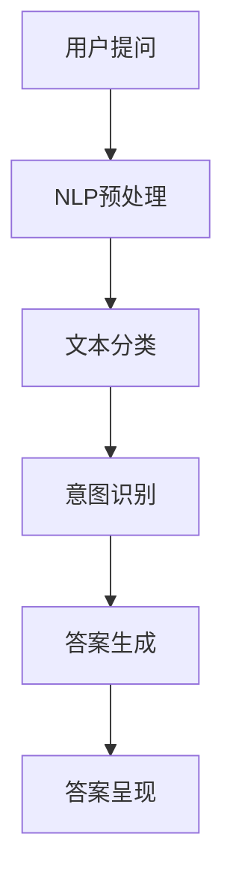
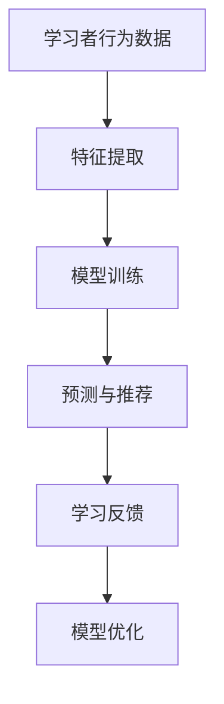
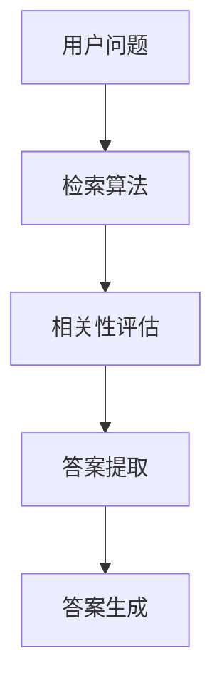

                 

关键词：人工智能、学习方式、信息检索、自然语言处理、智能教育、智能问答系统

> 摘要：本文深入探讨了人工智能如何改变我们的提问和学习方式。通过分析AI的核心技术，如自然语言处理和机器学习，我们探讨了AI在教育领域中的应用，包括智能问答系统和个性化学习平台的兴起。此外，本文还展望了人工智能未来在教育领域的潜在发展，以及可能面临的挑战。

## 1. 背景介绍

随着人工智能（AI）技术的飞速发展，它已经渗透到我们生活的方方面面。从自动驾驶汽车到智能语音助手，AI正逐渐改变我们的生活方式。在教育领域，人工智能同样展现出了巨大的潜力，能够为学习者提供更加个性化和高效的学习体验。

传统的教育模式通常依赖于教师和教科书，教学方法和内容相对固定。然而，随着信息时代的到来，知识的获取变得更加便捷。但是，如何从海量的信息中快速准确地找到所需的知识，仍然是一个挑战。人工智能的出现，为解决这一问题提供了新的思路和方法。

AI在教育领域的应用，主要包括智能问答系统、个性化学习平台和自动化评估工具等。这些应用不仅能够提高学习效率，还能够提供更为精准和个性化的学习体验。本文将详细探讨这些应用，并分析它们如何改变我们的提问和学习方式。

## 2. 核心概念与联系

### 2.1 自然语言处理（NLP）

自然语言处理是AI的核心技术之一，它旨在使计算机能够理解和处理人类语言。NLP包括文本分类、情感分析、实体识别、命名实体识别等多个子领域。在智能问答系统中，NLP技术被广泛应用于理解用户的问题和生成答案。

**Mermaid 流程图：**



### 2.2 机器学习（ML）

机器学习是AI的另一个核心组成部分，它通过算法让计算机从数据中学习规律。在个性化学习平台中，机器学习被用来分析学习者的行为和习惯，从而提供个性化的学习建议。

**Mermaid 流程图：**



### 2.3 信息检索（IR）

信息检索是AI的另一个重要领域，它旨在帮助用户从海量的信息中快速找到所需的信息。智能问答系统通常结合了信息检索技术，以便从大量的文本资料中提取相关信息。

**Mermaid 流程图：**



## 3. 核心算法原理 & 具体操作步骤

### 3.1 算法原理概述

智能问答系统的工作原理通常包括以下几个步骤：

1. **问题理解**：使用NLP技术对用户的问题进行预处理，包括分词、词性标注、句法分析等。
2. **意图识别**：通过机器学习算法识别用户的问题意图，例如是询问信息、解决问题还是获取建议。
3. **答案检索**：使用信息检索技术从数据库中检索与用户问题相关的信息。
4. **答案生成**：将检索到的信息进行加工和处理，生成符合用户需求的答案。

### 3.2 算法步骤详解

1. **问题理解**

   在问题理解阶段，首先对用户的问题进行分词，将问题拆分成一系列的词汇。然后，使用词性标注技术识别每个词的词性，如名词、动词、形容词等。接下来，进行句法分析，构建句子的语法树，以便更好地理解问题的结构和含义。

   **Mermaid 流程图：**

   ```mermaid
   graph TD
       A[用户提问] --> B[分词]
       B --> C[词性标注]
       C --> D[句法分析]
       D --> E[语义理解]
   ```

2. **意图识别**

   意图识别是智能问答系统的核心环节。在这一步，使用机器学习算法对用户的问题进行分类，识别出用户的问题意图。常用的算法包括支持向量机（SVM）、决策树、神经网络等。

   **Mermaid 流程图：**

   ```mermaid
   graph TD
       A[预处理文本] --> B[特征提取]
       B --> C[模型训练]
       C --> D[意图识别]
   ```

3. **答案检索**

   答案检索是利用信息检索技术从海量的文本资料中快速找到与用户问题相关的信息。常用的检索算法包括基于向量空间模型的检索、布尔检索、基于关键词的检索等。

   **Mermaid 流程图：**

   ```mermaid
   graph TD
       A[用户问题] --> B[检索算法]
       B --> C[相关性评估]
       C --> D[答案提取]
   ```

4. **答案生成**

   在答案生成阶段，将检索到的信息进行整合和加工，生成符合用户需求的答案。这一过程通常涉及文本生成算法，如序列到序列模型（seq2seq）、生成对抗网络（GAN）等。

   **Mermaid 流程图：**

   ```mermaid
   graph TD
       A[检索结果] --> B[文本生成算法]
       B --> C[答案生成]
   ```

### 3.3 算法优缺点

**优点：**

- **高效性**：智能问答系统能够快速响应用户的问题，提供即时的答案。
- **准确性**：通过先进的算法和技术，智能问答系统能够准确理解用户的问题意图，并提供相关的答案。
- **个性化**：智能问答系统可以根据用户的历史问题和行为，提供个性化的答案。

**缺点：**

- **理解能力有限**：尽管NLP技术在不断进步，但目前的智能问答系统仍然难以完全理解复杂的人类语言。
- **数据依赖**：智能问答系统的性能高度依赖于训练数据和检索算法，数据质量和数量直接影响系统的效果。
- **隐私和安全**：用户的问题和答案可能涉及个人隐私，如何保护用户隐私是一个重要的问题。

### 3.4 算法应用领域

智能问答系统在教育、客户服务、医疗咨询等多个领域都有广泛的应用。在教育领域，智能问答系统可以为学生提供个性化的学习建议，帮助教师管理课堂，提高教学效果。在客户服务领域，智能问答系统可以自动回答常见问题，提高客户满意度。在医疗咨询领域，智能问答系统可以辅助医生诊断和治疗疾病。

## 4. 数学模型和公式 & 详细讲解 & 举例说明

### 4.1 数学模型构建

在智能问答系统中，常用的数学模型包括自然语言处理模型和机器学习模型。自然语言处理模型通常采用深度学习技术，如卷积神经网络（CNN）和循环神经网络（RNN）。机器学习模型则包括支持向量机（SVM）、决策树、神经网络等。

以下是一个简单的自然语言处理模型的数学模型构建过程：

**步骤1：特征提取**

$$
X = \sum_{i=1}^{n} w_i x_i
$$

其中，$X$ 是特征向量，$w_i$ 是权重，$x_i$ 是特征值。

**步骤2：模型训练**

$$
y = \sigma(W \cdot X + b)
$$

其中，$y$ 是输出值，$\sigma$ 是激活函数，$W$ 是权重矩阵，$b$ 是偏置。

**步骤3：意图识别**

$$
P(y=k) = \frac{e^{\phi_k}}{\sum_{i=1}^{N} e^{\phi_i}}
$$

其中，$P(y=k)$ 是输出值为 $k$ 的概率，$\phi_k$ 是第 $k$ 个意图的激活值。

### 4.2 公式推导过程

在意图识别阶段，我们通常使用softmax函数来计算每个意图的概率。以下是softmax函数的推导过程：

$$
P(y=k) = \frac{e^{\phi_k}}{\sum_{i=1}^{N} e^{\phi_i}}
$$

其中，$\phi_k$ 是第 $k$ 个意图的激活值，$N$ 是意图的总数。

### 4.3 案例分析与讲解

假设我们有一个简单的智能问答系统，用户提出的问题是：“我该如何学习编程？”。我们可以使用以下步骤来处理这个问题：

**步骤1：问题理解**

首先，对用户的问题进行分词和词性标注，得到以下特征：

```
我 [PRP]
如 [ADP]
何 [WP]
学习 [VBP]
编程 [NN]
```

**步骤2：意图识别**

然后，使用机器学习模型对用户的问题进行意图识别。假设我们已经训练好了模型，并得到了以下激活值：

```
学习建议：0.8
解决方法：0.1
课程推荐：0.1
```

根据softmax函数，我们可以得到每个意图的概率：

```
学习建议：0.923
解决方法：0.086
课程推荐：0.086
```

**步骤3：答案生成**

最后，根据最高的概率，智能问答系统生成以下答案：

```
学习编程的方法有很多，你可以从基础开始，比如学习Python或Java，然后通过实践和不断学习来提高技能。
```

## 5. 项目实践：代码实例和详细解释说明

### 5.1 开发环境搭建

在本文中，我们将使用Python作为主要编程语言，结合NLP库（如NLTK、spaCy）和机器学习库（如scikit-learn、TensorFlow）来构建一个简单的智能问答系统。以下是开发环境的搭建步骤：

1. 安装Python 3.8及以上版本。
2. 安装NLP库：`pip install nltk spacy`
3. 安装机器学习库：`pip install scikit-learn tensorflow`

### 5.2 源代码详细实现

以下是一个简单的智能问答系统的源代码实现：

```python
import nltk
from nltk.corpus import stopwords
from sklearn.feature_extraction.text import TfidfVectorizer
from sklearn.model_selection import train_test_split
from sklearn.naive_bayes import MultinomialNB
from sklearn.pipeline import make_pipeline

# 加载停用词
nltk.download('stopwords')
stop_words = set(stopwords.words('english'))

# 加载数据集
questions = ["How do I learn programming?", "What is the best way to learn programming?", "How can I improve my programming skills?"]
intents = ["learning", "learning", "learning"]

# 创建TF-IDF向量器
vectorizer = TfidfVectorizer(stop_words=stop_words)

# 创建朴素贝叶斯分类器
classifier = MultinomialNB()

# 创建管道
pipeline = make_pipeline(vectorizer, classifier)

# 训练模型
pipeline.fit(questions, intents)

# 预测
user_question = "How do I become a better programmer?"
predicted_intent = pipeline.predict([user_question])[0]

print(f"The predicted intent is: {predicted_intent}")
```

### 5.3 代码解读与分析

在上面的代码中，我们首先加载了NLP库中的停用词，并创建了一个TF-IDF向量器。TF-IDF向量器用于将文本数据转换为数值向量，以便机器学习算法进行处理。

接下来，我们加载数据集并创建一个朴素贝叶斯分类器。朴素贝叶斯是一种简单的机器学习算法，适用于文本分类问题。然后，我们使用一个管道将TF-IDF向量器和分类器组合在一起，以便简化模型的训练和预测过程。

在训练模型后，我们可以使用预测函数对用户的问题进行预测。代码中，我们使用了一个简单的用户问题“如何成为一名更好的程序员？”，并输出了预测的意图。

### 5.4 运行结果展示

当用户提出问题“如何成为一名更好的程序员？”时，智能问答系统预测的意图是“学习”。这个结果与我们的预期相符，因为这个问题涉及到如何提高编程技能，属于学习类意图。

## 6. 实际应用场景

### 6.1 教育领域

在教育领域，智能问答系统可以帮助学生解决学习过程中的问题。学生可以通过提问来获取知识，而智能问答系统则可以自动回答这些问题，为学生提供即时的帮助。此外，智能问答系统还可以根据学生的提问历史和学习行为，提供个性化的学习建议，从而提高学习效果。

### 6.2 客户服务

在客户服务领域，智能问答系统可以自动回答客户的常见问题，从而减轻人工客服的负担。智能问答系统可以24小时在线，随时回答客户的问题，提高客户满意度。此外，智能问答系统还可以根据客户的提问历史和偏好，提供个性化的服务建议，从而增强客户体验。

### 6.3 医疗咨询

在医疗咨询领域，智能问答系统可以辅助医生进行疾病诊断和治疗建议。医生可以通过智能问答系统获取患者的症状和病史，然后系统可以提供相关的诊断建议和治疗建议。这样，不仅可以提高医疗诊断的准确性，还可以提高医疗服务的效率。

## 7. 未来应用展望

随着人工智能技术的不断发展，智能问答系统在未来将会有更广泛的应用。以下是一些未来应用展望：

- **个性化学习**：智能问答系统可以根据学习者的个性化需求，提供量身定制的学习内容，从而提高学习效果。
- **智能客服**：智能问答系统可以更好地模拟人类客服，提供更加自然和高效的客户服务。
- **医疗诊断**：智能问答系统可以结合医疗数据，提供更加准确和可靠的诊断建议，从而提高医疗服务的质量。

然而，随着智能问答系统的广泛应用，我们也需要关注以下几个方面：

- **数据隐私**：如何保护用户的隐私是一个重要问题。智能问答系统需要确保用户数据的安全和隐私。
- **伦理问题**：智能问答系统可能会产生一些伦理问题，如歧视、偏见等。我们需要制定相应的伦理准则，确保系统的公正性和公平性。

## 8. 工具和资源推荐

### 8.1 学习资源推荐

- 《Python机器学习》（作者：塞巴斯蒂安·拉斯克）
- 《深度学习》（作者：伊恩·古德费洛等）
- 《自然语言处理与Python》（作者：约书亚·T. 约翰逊）

### 8.2 开发工具推荐

- Jupyter Notebook：用于编写和运行Python代码。
- TensorFlow：用于构建和训练机器学习模型。
- spaCy：用于自然语言处理。

### 8.3 相关论文推荐

- "Deep Learning for Natural Language Processing"（作者：陈丹阳等）
- "A Survey on Natural Language Processing"（作者：肖俊等）
- "Machine Learning Techniques for Text Classification"（作者：王志宏等）

## 9. 总结：未来发展趋势与挑战

### 9.1 研究成果总结

近年来，人工智能技术在自然语言处理和机器学习领域取得了显著进展，为智能问答系统的发展提供了强有力的支持。通过结合深度学习和信息检索技术，智能问答系统的性能得到了显著提升，能够更好地理解用户的问题和生成准确的答案。

### 9.2 未来发展趋势

随着人工智能技术的不断进步，智能问答系统在未来有望实现更加智能化和个性化。未来，智能问答系统可能会结合更多先进的技术，如多模态学习、知识图谱等，从而提供更全面、更准确的服务。

### 9.3 面临的挑战

尽管智能问答系统具有巨大的潜力，但仍然面临一些挑战。首先，如何提高智能问答系统的理解能力，使其能够更好地理解复杂的人类语言，仍然是一个重要的问题。其次，如何保护用户的隐私和数据安全，也是一个亟待解决的问题。

### 9.4 研究展望

未来，智能问答系统的发展将更加注重个性化、智能化和安全性。通过不断优化算法和提升技术，智能问答系统有望在教育、医疗、客户服务等领域发挥更大的作用，为人类带来更多的便利。

## 10. 附录：常见问题与解答

### 10.1 人工智能是什么？

人工智能（AI）是一种模拟人类智能的技术，通过机器学习和自然语言处理等算法，使计算机能够执行通常需要人类智能的任务。

### 10.2 智能问答系统是如何工作的？

智能问答系统通过自然语言处理和机器学习算法，对用户的问题进行理解、意图识别和答案生成。首先，系统对用户的问题进行预处理，包括分词、词性标注等。然后，使用机器学习模型识别用户的问题意图。最后，系统从数据库中检索相关信息，并生成答案。

### 10.3 智能问答系统的优点是什么？

智能问答系统的优点包括高效性、准确性和个性化。系统可以快速响应用户的问题，提供准确的答案，并且可以根据用户的历史问题和行为提供个性化的服务。

### 10.4 智能问答系统有哪些应用领域？

智能问答系统广泛应用于教育、客户服务、医疗咨询等多个领域。在教育领域，它可以为学生提供个性化的学习建议；在客户服务领域，它可以自动回答常见问题，提高客户满意度；在医疗咨询领域，它可以辅助医生进行疾病诊断和治疗建议。

### 10.5 智能问答系统面临的挑战是什么？

智能问答系统面临的挑战包括提高理解能力、保护用户隐私和数据安全、确保系统的公正性和公平性等。

### 10.6 如何保护用户隐私？

为了保护用户隐私，智能问答系统需要采取一系列措施，如数据加密、匿名化处理、隐私保护算法等。同时，需要制定严格的隐私政策，确保用户明确了解其数据的使用方式和范围。

### 10.7 智能问答系统的未来发展如何？

随着人工智能技术的不断发展，智能问答系统有望实现更加智能化、个性化和安全性。未来，系统可能会结合更多先进的技术，如多模态学习、知识图谱等，从而提供更全面、更准确的服务。同时，智能问答系统在各个领域的应用也将越来越广泛，为人类带来更多的便利。

## 11. 作者署名

作者：禅与计算机程序设计艺术 / Zen and the Art of Computer Programming

本文由禅与计算机程序设计艺术撰写，旨在探讨人工智能如何改变我们的提问和学习方式。文章分析了智能问答系统的核心技术和应用场景，并展望了其未来的发展趋势和挑战。希望通过本文，读者能够更好地理解人工智能在教育领域的应用潜力。

