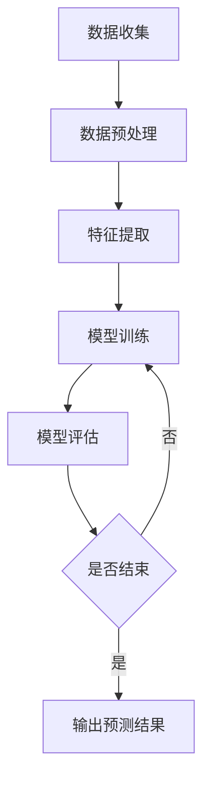

                 

## 摘要

本文将探讨人工智能（AI）在金融市场分析和投资决策中的变革性作用。随着大数据和机器学习的飞速发展，AI技术正逐渐渗透到金融市场的各个角落，从股票市场到外汇交易，从风险管理到高频交易，AI的应用不仅提高了分析的准确性和效率，还带来了投资策略的革新。本文将首先介绍AI的基本概念和技术，然后详细分析其在金融市场分析中的具体应用，最后探讨AI投资决策的未来趋势和挑战。

## 关键词

- 人工智能
- 金融分析
- 投资决策
- 大数据
- 机器学习
- 风险管理
- 高频交易

## 1. 背景介绍

金融市场是人类经济活动中不可或缺的组成部分，它不仅反映了经济的现状，还预示了未来的发展方向。金融市场的复杂性使其成为一个极具挑战性的领域，传统的金融市场分析方法往往依赖于大量的历史数据和统计学模型，这些方法在处理大规模数据和高维特征时存在局限性。随着互联网和物联网技术的普及，金融市场迎来了大数据时代，数据量以指数级增长，这为人工智能技术的应用提供了肥沃的土壤。

人工智能作为一种模拟人类智能的技术，其核心在于机器学习。机器学习通过构建模型，从数据中学习规律，并利用这些规律进行预测和决策。近年来，随着算法的优化、计算能力的提升和大数据的广泛应用，人工智能技术在金融领域的应用得到了快速发展。

在金融市场中，人工智能的应用不仅限于股票价格预测，还扩展到了债券市场、外汇市场、期货市场等多个领域。此外，人工智能在风险管理、客户服务、投资顾问等方面也展现出了巨大的潜力。本文将重点关注人工智能在金融市场分析和投资决策中的具体应用，探讨其带来的变革性影响。

### 1.1 人工智能的发展历史

人工智能（Artificial Intelligence, AI）作为计算机科学的一个分支，起源于20世纪50年代。当时，科学家们开始探讨如何使计算机具备人类智能，并提出了“智能代理”（Intelligent Agent）的概念。智能代理是指能够在环境中自主行动，并达到特定目标的系统。这一概念奠定了人工智能研究的基础。

在人工智能的发展历程中，有几次重要的里程碑：

- **1956年**：约翰·麦卡锡（John McCarthy）等人在达特茅斯会议上首次提出了“人工智能”这一术语，并明确了人工智能研究的目标和方法。
- **1970年代**：人工智能经历了第一次高潮，专家系统（Expert Systems）得到了广泛研究。专家系统通过模拟专家的知识和推理能力，解决复杂问题。然而，由于知识表示和获取的困难，专家系统在80年代后期逐渐退潮。
- **1990年代**：随着计算能力的提升和大数据的积累，机器学习开始崭露头角。机器学习通过从数据中自动学习和发现模式，弥补了专家系统的不足。这一时期，深度学习（Deep Learning）的兴起标志着人工智能进入了新的发展阶段。
- **2000年代至今**：随着互联网、物联网和移动设备的普及，数据量呈指数级增长，人工智能迎来了爆发期。深度学习、强化学习（Reinforcement Learning）等先进技术不断涌现，人工智能在各个领域得到了广泛应用，包括金融、医疗、制造、交通等。

### 1.2 金融市场的特点与挑战

金融市场具有以下几个显著特点：

- **高度复杂性**：金融市场由大量的参与者、多样的交易产品、多变的宏观经济环境组成，市场行为复杂多变，难以用简单的模型来描述。
- **数据密集性**：金融市场产生和积累了大量的数据，包括交易数据、财务报表、新闻资讯、社交媒体数据等，这些数据构成了金融市场分析的重要基础。
- **实时性要求**：金融市场交易频繁，价格波动剧烈，对实时数据分析和处理能力提出了高要求。任何延迟都可能带来巨大的损失。
- **不确定性**：金融市场的价格波动受到多种因素的影响，包括宏观经济、政策环境、公司业绩等，这使得市场预测充满不确定性。

面对这些特点，传统的金融市场分析方法面临以下挑战：

- **数据处理的局限性**：传统的数据分析方法，如统计学、时间序列分析等，在处理大规模数据和复杂关系时存在局限，难以充分挖掘数据的潜在价值。
- **模型稳定性问题**：金融市场中的模型往往基于历史数据构建，但市场环境不断变化，模型的稳定性和预测能力受到考验。
- **实时性不足**：传统的分析方法和工具难以实现实时数据处理和预测，无法及时响应市场的变化。

### 1.3 大数据和机器学习在金融市场的应用

大数据（Big Data）和机器学习（Machine Learning）的结合为金融市场的分析带来了革命性的变化。大数据技术能够高效地存储、处理和分析海量数据，而机器学习则能够从数据中发现复杂的关系和规律，从而提升预测和决策的准确性。

在金融市场分析中，大数据和机器学习的应用主要体现在以下几个方面：

- **高频交易**：高频交易（High-Frequency Trading, HFT）是利用计算机程序在极短时间内执行大量交易，以获取微小利润。大数据技术能够实时收集和分析市场数据，为高频交易提供决策支持。
- **风险管理**：大数据技术可以帮助金融机构收集和分析海量的风险数据，包括市场风险、信用风险、操作风险等，从而构建更全面、准确的风险管理模型。
- **市场预测**：机器学习算法能够从历史数据中学习市场行为和趋势，对市场进行预测。这些预测模型不仅能够提高投资决策的准确性，还可以帮助投资者制定更有效的交易策略。
- **客户服务**：大数据和机器学习可以帮助金融机构了解客户需求，提供个性化的金融产品和服务。例如，通过分析客户的交易记录和偏好，金融机构可以为不同客户提供定制化的投资建议和理财产品。

总之，大数据和机器学习在金融市场中的应用不仅提高了数据分析的效率和准确性，还为金融市场的创新和变革提供了强大的技术支持。

### 1.4 人工智能在金融市场分析中的意义

人工智能（AI）在金融市场分析中的意义主要体现在以下几个方面：

**提高分析效率**：传统的人工分析方式往往耗时耗力，而人工智能技术能够自动化处理海量数据，快速提取有用信息，大大提高了分析效率。

**增强预测准确性**：通过机器学习和深度学习算法，人工智能能够从历史数据中学习并发现复杂的市场规律，从而提高预测准确性。这有助于投资者做出更明智的投资决策。

**提供个性化服务**：人工智能能够分析客户的历史交易记录和行为模式，为其提供个性化的投资建议和理财产品，从而提升客户体验和满意度。

**降低操作风险**：人工智能在风险管理中的应用可以帮助金融机构更准确地评估和监控风险，降低操作风险和信用风险。

**推动金融市场创新**：人工智能技术的应用为金融市场的创新提供了新的可能性，例如智能投顾、自动化交易系统等，这些创新不仅提升了市场效率，还丰富了金融产品的种类。

### 1.5 人工智能在金融市场分析和投资决策中的变革性影响

人工智能（AI）在金融市场分析和投资决策中的应用，带来了深远的变革性影响，主要体现在以下几个方面：

**1. 提升决策速度和效率**

传统金融分析依赖于大量人工操作和数据整理，过程繁琐且耗时。而人工智能技术，特别是机器学习和深度学习算法，能够自动化处理和分析海量数据，实时提取关键信息，大幅提高了分析速度和效率。高频交易（HFT）正是利用这一优势，在极短时间内完成大量交易，从而获得微小的利润。

**2. 增强预测准确性和稳定性**

金融市场的波动性极高，传统分析模型往往难以捕捉市场变化的复杂性和多样性。而人工智能算法，特别是基于大数据的机器学习模型，能够从历史数据中学习市场规律，并利用这些规律进行预测。这种方法不仅提高了预测的准确性，还增强了模型的稳定性，即使在市场环境发生变化时，预测结果依然具有较高的可靠性。

**3. 实现个性化投资**

传统投资决策往往基于历史数据和一般性分析，难以满足个性化需求。而人工智能技术能够分析每位投资者的历史交易记录和行为模式，为其提供定制化的投资建议和策略。这种个性化的服务不仅提升了客户满意度，还提高了投资回报率。

**4. 降低操作风险**

金融市场操作风险主要源于数据不准确和模型不稳定。人工智能技术通过自动化数据处理和模型优化，能够降低数据误差和模型风险，从而提高操作的稳定性和可靠性。

**5. 推动金融市场创新**

人工智能技术的应用为金融市场创新提供了无限可能性。例如，智能投顾（Robo-Advisors）通过人工智能算法，为投资者提供全方位的投资建议和服务；自动化交易系统（Algorithmic Trading）则通过机器学习算法，实现高频、高效率的交易。

综上所述，人工智能在金融市场分析和投资决策中的应用，不仅提升了效率和准确性，还推动了金融市场的创新和变革。在未来，随着技术的不断进步，人工智能在金融领域的应用前景将更加广阔。

### 1.6 人工智能在金融市场中的应用现状

人工智能（AI）在金融市场中的应用已取得了显著进展，各类应用场景逐渐成熟并得到了广泛认可。以下是对当前人工智能在金融市场中的应用现状的概述：

**1. 股票市场分析**

股票市场分析是人工智能在金融市场中的最早和最广泛应用领域之一。通过机器学习和深度学习算法，人工智能可以处理大量历史股票交易数据，包括价格、成交量、财务报表等，从中提取有价值的信息。这些信息可以帮助投资者进行股票筛选、预测股价走势，甚至发现潜在的套利机会。

例如，量化投资（Quantitative Investing）是利用人工智能技术进行股票市场投资的一种方法。量化投资策略通常包括因子分析、回归分析、时间序列预测等技术，通过构建数学模型和算法，实现自动化交易。这种方式不仅提高了投资决策的效率，还降低了人为干预带来的风险。

**2. 外汇市场分析**

外汇市场是全球最大的金融市场，其交易量和波动性都极高。人工智能在外汇市场分析中的应用主要包括交易信号生成、市场趋势预测和风险控制。

例如，通过机器学习算法，可以对历史外汇交易数据进行分析，识别市场趋势和交易信号。这种技术可以帮助交易者更准确地预测汇率变动，从而制定有效的交易策略。此外，人工智能还可以通过实时数据监控和风险评估，帮助金融机构更好地控制外汇风险。

**3. 债券市场分析**

债券市场是金融市场中另一重要组成部分。人工智能在债券市场分析中的应用，主要包括利率预测、债券评级和组合优化。

例如，通过深度学习算法，可以对历史债券市场数据进行分析，预测利率变化趋势。这对债券投资者来说具有重要意义，因为利率变化直接影响债券价格。此外，人工智能还可以通过分析债券发行人的财务报表和市场表现，为其提供评级建议。在组合优化方面，人工智能可以帮助投资者构建最优的债券投资组合，以实现风险收益的最优化。

**4. 风险管理**

风险管理是金融机构运营的核心之一，人工智能在风险管理中的应用越来越受到关注。通过大数据和机器学习技术，人工智能可以实时监控和分析金融机构的风险暴露，提供风险预警和风险控制建议。

例如，人工智能可以通过分析历史交易数据和信用评级，识别潜在的信用风险。在市场风险方面，人工智能可以通过对市场数据的实时监控和分析，预测市场波动，帮助金融机构制定有效的风险管理策略。

**5. 高频交易**

高频交易是利用人工智能技术实现的一种自动化交易方式。高频交易通过快速执行大量交易，从微小的价格变动中获取利润。人工智能在其中的作用主要包括交易信号生成、交易策略优化和风险控制。

例如，通过机器学习算法，可以对历史交易数据进行分析，生成高效的交易信号。交易策略优化则通过算法优化，提高交易执行效率和盈利能力。在风险控制方面，人工智能可以通过实时监控和风险评估，确保交易操作的稳健和安全。

**6. 智能投顾**

智能投顾（Robo-Advisors）是利用人工智能技术为投资者提供投资建议和资产管理服务的一种新型模式。智能投顾通过大数据分析和机器学习算法，为投资者提供个性化的投资策略，包括资产配置、风险管理、投资组合优化等。

例如，智能投顾可以通过分析投资者的风险偏好和财务目标，制定个性化的投资计划。在投资组合管理方面，智能投顾利用机器学习算法，实时调整投资组合，以应对市场变化。

综上所述，人工智能在金融市场中的应用已经取得了显著成效，各类应用场景不断扩展，为金融市场的创新和变革提供了强大的技术支持。随着技术的不断进步，人工智能在金融市场的应用前景将更加广阔。

### 1.7 人工智能在金融市场分析中的核心概念与联系

在深入探讨人工智能在金融市场分析中的应用之前，有必要了解其中涉及的一些核心概念和技术。这些核心概念和技术的相互联系构成了一个复杂而高效的系统，使得人工智能在金融市场中能够发挥出巨大的潜力。

#### 1.7.1 机器学习与深度学习

机器学习（Machine Learning）是人工智能的核心技术之一，它通过构建算法，使计算机系统能够从数据中自动学习和发现规律。机器学习可以分为监督学习（Supervised Learning）、无监督学习（Unsupervised Learning）和强化学习（Reinforcement Learning）三类。

- **监督学习**：在监督学习中，模型通过已知的输入和输出数据来训练，从而学习到数据的特征和规律。例如，在股票价格预测中，模型可以基于历史交易数据（输入）和对应的价格（输出）来训练，从而学会预测未来的价格。
- **无监督学习**：无监督学习则是在没有明确输出标签的情况下，通过数据自身的特征和关系来学习。例如，在客户细分中，无监督学习算法可以帮助金融机构将客户按照其交易行为和偏好进行分类。
- **强化学习**：强化学习通过让模型在与环境的互动中不断学习和优化行为策略。例如，在量化投资中，强化学习可以帮助算法根据市场反馈调整交易策略，从而实现长期盈利。

深度学习（Deep Learning）是机器学习的一个分支，它通过构建多层的神经网络（Neural Networks），对数据进行多层次的抽象和特征提取。深度学习在图像识别、语音识别和自然语言处理等领域取得了显著的成果，也在金融市场分析中得到了广泛应用。

#### 1.7.2 大数据与数据挖掘

大数据（Big Data）是指规模巨大、类型繁多、价值密度低的数据集合。大数据技术包括数据存储、数据分析和数据可视化等，其核心在于如何高效地存储和处理海量数据。

数据挖掘（Data Mining）是从大量数据中自动发现有价值的信息和知识的过程。数据挖掘技术包括关联规则挖掘、聚类分析、分类分析、异常检测等。在金融市场分析中，数据挖掘可以帮助金融机构从海量交易数据中提取有价值的信息，如市场趋势、交易机会和风险指标。

#### 1.7.3 时间序列分析与统计分析

时间序列分析（Time Series Analysis）是研究时间序列数据的一种统计方法，主要用于预测和分析数据随时间变化的规律。时间序列分析包括自回归模型（AR）、移动平均模型（MA）、自回归移动平均模型（ARMA）和自回归积分移动平均模型（ARIMA）等。

统计分析（Statistical Analysis）是利用统计学原理和方法对数据进行处理和分析的过程。在金融市场分析中，统计分析可以帮助投资者理解市场数据的分布特征、相关性等，从而制定更有效的投资策略。

#### 1.7.4 Mermaid 流程图

Mermaid 是一种基于文本的绘图语言，它可以用来绘制各种图表和图形。在金融市场分析中，Mermaid 流程图可以帮助我们清晰地展示数据分析的流程和算法的结构。

以下是一个简单的 Mermaid 流程图示例，用于描述股票价格预测的基本流程：



通过这个流程图，我们可以清晰地看到从数据收集到模型训练和评估的整个过程，以及各个步骤之间的相互关系。

### 1.7.5 人工智能架构与实现

人工智能在金融市场分析中的实现，通常包括以下几个关键环节：

- **数据收集与清洗**：收集相关的金融市场数据，如历史交易数据、财务报表、市场新闻等，并对数据进行清洗和处理，确保数据的准确性和一致性。
- **特征提取**：从原始数据中提取有价值的特征，如价格、成交量、技术指标等，这些特征将用于训练机器学习模型。
- **模型训练与优化**：利用机器学习算法，如深度学习、时间序列分析和统计模型，对数据进行训练，并不断优化模型参数，以提高预测准确性。
- **模型评估与部署**：通过交叉验证和回测等方法评估模型的性能，并在实际交易环境中部署模型，进行实时预测和决策。

#### 1.7.6 关键概念与联系

- **机器学习与深度学习**：机器学习是人工智能的基础技术，而深度学习则是机器学习的一个分支，主要用于处理高维数据。
- **大数据与数据挖掘**：大数据技术为机器学习和深度学习提供了海量的训练数据，而数据挖掘则帮助我们从这些数据中提取有价值的信息。
- **时间序列分析与统计分析**：时间序列分析用于处理和分析金融市场数据，而统计分析则用于验证模型的稳定性和可靠性。
- **Mermaid 流程图**：Mermaid 流程图可以帮助我们直观地展示数据分析的流程和算法结构，从而更好地理解和优化系统。

通过这些核心概念和技术的相互联系，人工智能在金融市场分析中能够发挥出巨大的潜力，为投资者提供更加准确和高效的决策支持。

### 1.8 人工智能在金融市场分析中的核心算法原理

在人工智能应用于金融市场分析的过程中，核心算法的原理和具体操作步骤起到了关键作用。以下将详细介绍几种在金融市场分析中广泛应用的核心算法，并解释其原理和操作步骤。

#### 1.8.1 时间序列分析模型

时间序列分析是金融市场分析中最基本的方法之一，它主要关注数据在时间维度上的变化规律。以下是几种常见的时间序列分析模型及其原理：

**1. 自回归模型（AR）**

自回归模型（Autoregressive Model，AR）是一种基于当前时刻之前的值来预测未来值的模型。其基本原理是：

\[ X_t = c + \phi_1 X_{t-1} + \phi_2 X_{t-2} + \ldots + \phi_p X_{t-p} + \epsilon_t \]

其中，\( X_t \) 是时间序列的当前值，\( \phi_1, \phi_2, \ldots, \phi_p \) 是模型的参数，\( \epsilon_t \) 是随机误差。

**操作步骤：**

- **数据收集与预处理**：收集时间序列数据，并进行清洗和标准化处理。
- **模型参数估计**：通过最小二乘法或最大似然估计，估计模型参数。
- **模型拟合与预测**：使用估计出的参数，对时间序列进行拟合，并对未来值进行预测。

**2. 移动平均模型（MA）**

移动平均模型（Moving Average Model，MA）通过计算过去一段时间内的平均值来预测未来值。其基本原理是：

\[ X_t = c + \theta_1 X_{t-1} + \theta_2 X_{t-2} + \ldots + \theta_q X_{t-q} + \epsilon_t \]

其中，\( \theta_1, \theta_2, \ldots, \theta_q \) 是模型的参数，\( \epsilon_t \) 是随机误差。

**操作步骤：**

- **数据收集与预处理**：与自回归模型相同。
- **模型参数估计**：通过最小二乘法或递推算法，估计模型参数。
- **模型拟合与预测**：使用估计出的参数，对时间序列进行拟合，并对未来值进行预测。

**3. 自回归移动平均模型（ARMA）**

自回归移动平均模型（Autoregressive Moving Average Model，ARMA）是自回归模型和移动平均模型的结合。其基本原理是：

\[ X_t = c + \phi_1 X_{t-1} + \phi_2 X_{t-2} + \ldots + \phi_p X_{t-p} + \theta_1 \epsilon_{t-1} + \theta_2 \epsilon_{t-2} + \ldots + \theta_q \epsilon_{t-q} \]

其中，\( \phi_1, \phi_2, \ldots, \phi_p \) 和 \( \theta_1, \theta_2, \ldots, \theta_q \) 是模型的参数。

**操作步骤：**

- **数据收集与预处理**：同上。
- **模型参数估计**：通过最小二乘法或递推算法，同时估计自回归和移动平均的参数。
- **模型拟合与预测**：使用估计出的参数，对时间序列进行拟合，并对未来值进行预测。

**4. 自回归积分移动平均模型（ARIMA）**

自回归积分移动平均模型（Autoregressive Integrated Moving Average Model，ARIMA）是对 ARMA 模型的扩展，它通过差分（Differencing）操作来使时间序列稳定。其基本原理是：

\[ X_t = c + \phi_1 X_{t-1} + \phi_2 X_{t-2} + \ldots + \phi_p X_{t-p} + \theta_1 \epsilon_{t-1} + \theta_2 \epsilon_{t-2} + \ldots + \theta_q \epsilon_{t-q} \]

其中，\( \phi_1, \phi_2, \ldots, \phi_p \) 和 \( \theta_1, \theta_2, \ldots, \theta_q \) 是模型的参数。

**操作步骤：**

- **数据收集与预处理**：同上。
- **差分操作**：对时间序列进行差分，使其满足平稳性。
- **模型参数估计**：通过最小二乘法或递推算法，估计差分后的模型参数。
- **模型拟合与预测**：使用估计出的参数，对差分后的时间序列进行拟合，并对原始时间序列进行预测。

#### 1.8.2 深度学习模型

深度学习模型在金融市场分析中也越来越受到关注，其中最常用的模型之一是卷积神经网络（Convolutional Neural Networks，CNN）。CNN 主要用于处理具有网格结构的数据，如图像和时间序列。

**1. 卷积神经网络（CNN）**

卷积神经网络的基本原理是通过卷积层提取时间序列的局部特征，并通过池化层降低数据的维度。

\[ \text{Convolution Layer}:\ \text{Feature Map} = \text{Filter} \times \text{Input} + \text{Bias} \]

\[ \text{Pooling Layer}:\ \text{Output} = \text{Pooling Function}(\text{Input}) \]

**操作步骤：**

- **数据收集与预处理**：收集时间序列数据，并进行标准化和归一化处理。
- **模型设计**：设计深度学习网络结构，包括卷积层、池化层和全连接层。
- **模型训练**：利用训练数据，通过反向传播算法训练模型。
- **模型评估**：使用验证数据评估模型性能，并调整模型参数。

**2. 长短期记忆网络（LSTM）**

长短期记忆网络（Long Short-Term Memory，LSTM）是一种用于处理序列数据的递归神经网络，特别适合于处理长时依赖关系。

\[ \text{LSTM Cell}: \]
\[ \text{Forget Gate}: f_t = \sigma(W_f \cdot [h_{t-1}, x_t] + b_f) \]
\[ \text{Input Gate}: i_t = \sigma(W_i \cdot [h_{t-1}, x_t] + b_i) \]
\[ \text{Output Gate}: o_t = \sigma(W_o \cdot [h_{t-1}, x_t] + b_o) \]
\[ \text{Cell State}: C_t = f_t \odot C_{t-1} + i_t \odot \text{tanh}(W_c \cdot [h_{t-1}, x_t] + b_c) \]
\[ \text{Hidden State}: h_t = o_t \odot \text{tanh}(C_t) \]

**操作步骤：**

- **数据收集与预处理**：同上。
- **模型设计**：设计 LSTM 网络结构，包括输入层、隐藏层和输出层。
- **模型训练**：利用训练数据，通过反向传播算法训练模型。
- **模型评估**：使用验证数据评估模型性能，并调整模型参数。

#### 1.8.3 强化学习模型

强化学习（Reinforcement Learning，RL）是一种通过试错来学习最优策略的方法，特别适合于金融市场中的决策问题。

**1. Q-Learning**

Q-Learning 是一种基于值函数的强化学习算法，其基本原理是：

\[ Q(s, a) = r + \gamma \max_{a'} Q(s', a') \]

**操作步骤：**

- **环境搭建**：构建金融市场环境，包括状态、动作和奖励。
- **模型设计**：设计 Q-Learning 模型，包括状态表示、动作表示和值函数。
- **模型训练**：通过试错，不断更新值函数，直到收敛。
- **策略评估**：使用训练好的模型，评估最优策略。

**2. Deep Q-Network（DQN）**

DQN 是基于 Q-Learning 的深度学习模型，其基本原理是：

\[ Q(s, a) = \text{神经网络预测的值} \]

**操作步骤：**

- **数据收集与预处理**：同上。
- **模型设计**：设计 DQN 模型，包括输入层、隐藏层和输出层。
- **模型训练**：利用训练数据，通过反向传播算法训练模型。
- **策略评估**：使用训练好的模型，评估最优策略。

通过以上核心算法的原理和操作步骤，我们可以看到人工智能在金融市场分析中的应用是如何实现的。这些算法不仅提高了分析效率和准确性，还为投资者提供了更加科学的决策支持。然而，算法的优化和模型的改进始终是一个不断进行的过程，只有不断探索和尝试，才能在金融市场中取得更好的成果。

### 1.9 人工智能在金融市场分析中的算法优缺点

人工智能在金融市场分析中的应用已经取得了显著的成果，但不同的算法在处理金融市场数据时，既有优点也有局限性。以下是几种常见算法在金融市场分析中的优缺点分析。

#### 1.9.1 时间序列分析模型

**优点：**

- **易理解**：时间序列分析模型（如 AR、MA、ARMA、ARIMA）基于统计学原理，模型结构简单，易于理解和解释。
- **稳定性**：时间序列分析模型在处理平稳性数据时，具有较高的预测稳定性和可靠性。
- **灵活性**：可以通过调整模型参数（如自回归项和移动平均项），适应不同类型的时间序列数据。

**缺点：**

- **局限性**：时间序列分析模型在处理非平稳性数据时，预测性能可能较差，需要通过差分等预处理手段进行处理。
- **依赖历史数据**：模型主要依赖历史数据进行预测，对市场环境变化反应较慢，可能无法适应快速变化的市场。
- **高维特征问题**：时间序列分析模型在处理高维特征时，容易导致模型复杂度和计算成本增加。

#### 1.9.2 深度学习模型

**优点：**

- **处理复杂数据**：深度学习模型（如 CNN、LSTM）能够自动提取数据中的复杂特征，无需手动进行特征工程。
- **高预测准确性**：深度学习模型在处理高维、非线性时间序列数据时，具有较高的预测准确性。
- **泛化能力**：深度学习模型通过大量训练数据的学习，具有较强的泛化能力，能够适应不同的市场环境。

**缺点：**

- **计算成本高**：深度学习模型需要大量的计算资源和时间进行训练，尤其是在处理大规模数据时。
- **模型解释性差**：深度学习模型的黑箱特性，使得其预测结果难以解释，不利于投资者理解和信任。
- **过拟合风险**：深度学习模型在训练过程中容易过拟合，导致模型泛化能力较差，需要通过正则化等技术进行防止。

#### 1.9.3 强化学习模型

**优点：**

- **自适应性强**：强化学习模型（如 Q-Learning、DQN）能够通过与环境互动，不断学习和优化策略，适应市场变化。
- **动态调整**：强化学习模型可以根据实时反馈，动态调整策略，提高决策的实时性和灵活性。
- **探索能力**：强化学习模型在探索未知领域时，具有较强的学习能力，能够发现新的投资机会。

**缺点：**

- **训练时间长**：强化学习模型需要大量的试错和迭代，训练时间较长，尤其在处理复杂的市场环境时。
- **依赖环境**：强化学习模型的性能很大程度上依赖于环境设计和奖励机制，环境设计不当可能导致模型失效。
- **风险控制难**：强化学习模型在处理金融市场风险时，存在一定的风险，需要严格的风险控制措施。

#### 1.9.4 综合评估

综上所述，各种算法在金融市场分析中各有优缺点。时间序列分析模型适合处理平稳性数据，但在处理非平稳性数据时存在局限性；深度学习模型能够处理复杂数据，但计算成本高且模型解释性差；强化学习模型具有较强的自适应性和探索能力，但训练时间长且依赖环境设计。

在实际应用中，可以根据具体需求和数据特点，选择合适的算法组合，以实现最佳的预测效果和投资决策。同时，不断优化算法和模型，提升其稳定性和可靠性，也是金融市场分析中不可或缺的一环。

### 1.10 人工智能在金融市场分析中的应用领域

人工智能在金融市场分析中的应用已涉及多个领域，以下将详细探讨几个主要的应用领域，以及在这些领域中人工智能如何发挥作用。

#### 1.10.1 股票市场分析

股票市场分析是人工智能在金融市场分析中最常见的应用之一。通过机器学习和深度学习算法，人工智能可以从海量历史股票数据中提取有价值的信息，为投资者提供股票筛选和预测服务。

- **股票筛选**：人工智能可以通过分析公司的财务报表、市场新闻和社交媒体数据，识别出具有潜在增长潜力的股票。例如，量化投资策略通常使用机器学习模型，从海量股票数据中筛选出符合特定条件的股票，以构建投资组合。

- **价格预测**：人工智能可以通过时间序列分析和深度学习模型，预测股票价格的未来走势。这种预测不仅可以帮助投资者制定买入和卖出的时机，还可以用于套利交易。例如，LSTM网络被广泛应用于股票价格预测，能够捕捉股票价格变化的长期趋势和短期波动。

- **风险控制**：人工智能还可以帮助投资者识别和管理股票投资中的风险。通过分析历史数据和实时市场信息，人工智能可以预测潜在的市场波动，并提供相应的风险控制策略。例如，使用强化学习算法，可以动态调整投资组合，以降低市场波动带来的风险。

#### 1.10.2 外汇市场分析

外汇市场是全球最大的金融市场之一，其交易量和波动性都极高。人工智能在外汇市场分析中的应用，主要包括交易信号生成、市场趋势预测和风险控制。

- **交易信号生成**：人工智能可以通过分析历史外汇交易数据和市场新闻，生成可靠的交易信号。这些信号包括买入、卖出和平仓等操作，可以帮助交易者制定有效的交易策略。例如，基于卷积神经网络（CNN）的交易信号生成模型，可以从大量的市场数据中提取有用的信息，提高交易信号的准确性。

- **市场趋势预测**：人工智能可以通过分析历史外汇价格数据和市场指标，预测外汇市场的未来趋势。这种预测对于外汇交易者来说至关重要，因为准确的预测可以帮助他们抓住市场机会，避免不必要的损失。例如，时间序列分析方法（如 ARIMA 和 LSTM）被广泛应用于外汇市场趋势预测，能够捕捉价格变动的长期趋势和短期波动。

- **风险控制**：人工智能还可以帮助外汇交易者管理风险。通过实时监控市场数据和交易行为，人工智能可以预测潜在的市场波动，并提供相应的风险控制策略。例如，使用机器学习算法，可以动态调整交易策略，以应对不同的市场环境，降低交易风险。

#### 1.10.3 债券市场分析

债券市场是金融市场中另一个重要的组成部分，其分析同样依赖于人工智能技术。

- **利率预测**：人工智能可以通过分析历史债券价格数据、市场利率和宏观经济指标，预测未来利率的变化。这种预测对于债券投资者来说非常重要，因为利率变化直接影响债券价格。例如，使用深度学习模型（如 CNN 和 LSTM），可以从大量的市场数据中提取有用的信息，提高利率预测的准确性。

- **债券评级**：人工智能可以帮助金融机构对债券进行评级。通过分析债券发行人的财务报表、信用评级和市场表现，人工智能可以评估债券的风险和收益。这种评级方法不仅提高了评级的准确性，还可以减少人为干预，提高债券评级的客观性。

- **组合优化**：人工智能可以帮助债券投资者构建最优的债券投资组合。通过分析历史债券数据和市场趋势，人工智能可以识别出具有潜在风险的债券，并提供优化投资组合的建议。例如，使用优化算法（如线性规划和遗传算法），可以构建风险最低、收益最高的债券投资组合。

#### 1.10.4 风险管理

风险管理是金融市场中不可或缺的一环，人工智能在风险管理中的应用，主要包括信用风险、市场风险和操作风险的识别和管理。

- **信用风险识别**：人工智能可以通过分析借款人的财务状况、信用历史和宏观经济环境，识别潜在的信用风险。例如，使用机器学习算法（如决策树和随机森林），可以建立信用评分模型，预测借款人的信用风险。

- **市场风险监控**：人工智能可以通过实时监控市场数据，识别和预测市场风险。例如，使用时间序列分析方法和机器学习算法（如 ARIMA 和 LSTM），可以预测市场波动，提供风险预警和风险控制策略。

- **操作风险控制**：人工智能可以帮助金融机构识别和管理操作风险。通过分析交易数据、员工行为和市场环境，人工智能可以识别出潜在的操作风险，并提供相应的控制措施。例如，使用强化学习算法，可以动态调整交易策略，降低操作风险。

总之，人工智能在金融市场分析中的应用已经渗透到股票市场、外汇市场、债券市场和风险管理等多个领域。通过利用人工智能技术，金融机构可以更高效、准确地分析市场数据，制定科学的投资决策，降低风险，提高投资回报。

### 1.11 数学模型和公式在人工智能金融市场分析中的应用

在人工智能用于金融市场分析的实践中，数学模型和公式起到了至关重要的作用。这些模型和公式不仅帮助我们从数据中提取有用信息，还为我们提供了预测和决策的依据。以下将详细介绍几种常见的数学模型和公式，并解释其在人工智能金融市场分析中的应用。

#### 1.11.1 市场趋势预测模型

市场趋势预测是金融市场分析的核心任务之一，以下介绍几种常用的市场趋势预测模型：

**1. ARIMA模型**

ARIMA模型（自回归积分移动平均模型）是时间序列分析中的一种经典模型。其公式如下：

\[ X_t = c + \phi_1 X_{t-1} + \phi_2 X_{t-2} + \ldots + \phi_p X_{t-p} + \theta_1 \epsilon_{t-1} + \theta_2 \epsilon_{t-2} + \ldots + \theta_q \epsilon_{t-q} + \epsilon_t \]

其中，\( X_t \) 是时间序列的当前值，\( \phi_1, \phi_2, \ldots, \phi_p \) 和 \( \theta_1, \theta_2, \ldots, \theta_q \) 是模型参数，\( c \) 是常数项，\( \epsilon_t \) 是随机误差。

在金融市场分析中，ARIMA模型可以用来预测股票价格、外汇汇率等市场指标的未来走势。通过差分操作和参数估计，我们可以使时间序列达到平稳性，从而提高模型的预测效果。

**2. LSTM模型**

LSTM（长短期记忆网络）是一种递归神经网络，特别适合处理序列数据。其核心公式如下：

\[ \text{Forget Gate}: f_t = \sigma(W_f \cdot [h_{t-1}, x_t] + b_f) \]
\[ \text{Input Gate}: i_t = \sigma(W_i \cdot [h_{t-1}, x_t] + b_i) \]
\[ \text{Output Gate}: o_t = \sigma(W_o \cdot [h_{t-1}, x_t] + b_o) \]
\[ \text{Cell State}: C_t = f_t \odot C_{t-1} + i_t \odot \text{tanh}(W_c \cdot [h_{t-1}, x_t] + b_c) \]
\[ \text{Hidden State}: h_t = o_t \odot \text{tanh}(C_t) \]

LSTM模型通过门控机制（Forget Gate、Input Gate和Output Gate）来控制信息的流动，从而能够捕捉长短期依赖关系。在金融市场分析中，LSTM模型可以用来预测股票价格、外汇汇率等市场指标的未来走势。

**3. 时间序列平滑模型**

时间序列平滑模型（如简单移动平均（SMA）和指数移动平均（EMA））也是金融市场分析中常用的预测模型。

- **简单移动平均（SMA）**：

\[ \text{SMA}(n) = \frac{1}{n} \sum_{t=1}^{n} X_t \]

其中，\( n \) 是平滑窗口期，\( X_t \) 是时间序列的当前值。

SMA模型通过对时间序列进行加权平均，平滑了短期波动，从而提供了一个较为稳定的预测值。

- **指数移动平均（EMA）**：

\[ \text{EMA}(n) = \alpha X_t + (1 - \alpha) \text{EMA}(n-1) \]

其中，\( \alpha \) 是平滑系数，通常取值在0到1之间。

EMA模型在最近的数据上赋予更高的权重，从而更好地反映市场趋势。

#### 1.11.2 资本资产定价模型（CAPM）

资本资产定价模型（Capital Asset Pricing Model，CAPM）是金融理论中的一个重要模型，用于评估资产的预期收益和风险。其公式如下：

\[ E(R_i) = R_f + \beta_i (E(R_m) - R_f) \]

其中，\( E(R_i) \) 是资产 \( i \) 的预期收益，\( R_f \) 是无风险利率，\( \beta_i \) 是资产 \( i \) 的贝塔系数，\( E(R_m) \) 是市场组合的预期收益。

在金融市场分析中，CAPM模型可以帮助投资者评估股票的风险和收益。通过计算资产的贝塔系数，投资者可以了解资产对市场波动的敏感度，从而制定相应的投资策略。

#### 1.11.3 技术指标

技术指标是通过分析历史价格和成交量数据，预测未来市场走势的工具。以下介绍几种常见的技术指标：

- **移动平均线（MA）**：

\[ \text{MA}(n) = \frac{1}{n} \sum_{t=1}^{n} \text{Close}_t \]

其中，\( n \) 是移动平均周期，\( \text{Close}_t \) 是第 \( t \) 日的收盘价。

移动平均线可以平滑价格波动，反映市场趋势。

- **相对强弱指数（RSI）**：

\[ RSI(t) = \frac{\sum_{i=1}^{n} \text{UpDays}_i - \sum_{i=1}^{n} \text{DownDays}_i}{\sum_{i=1}^{n} \text{UpDays}_i + \sum_{i=1}^{n} \text{DownDays}_i} \]

其中，\( n \) 是计算周期，\( \text{UpDays}_i \) 和 \( \text{DownDays}_i \) 分别是第 \( i \) 日的上涨天数和下跌天数。

RSI指标用于评估市场超买或超卖状态，帮助投资者判断买入或卖出的时机。

- **布林带（Bollinger Bands）**：

\[ \text{Upper Band}(t) = \text{MA}(n) + k \times \text{STD}(n) \]
\[ \text{Lower Band}(t) = \text{MA}(n) - k \times \text{STD}(n) \]

其中，\( n \) 是移动平均周期，\( k \) 是常数，\( \text{MA}(n) \) 是移动平均线，\( \text{STD}(n) \) 是标准差。

布林带指标用于评估市场波动性，帮助投资者判断市场趋势和波动幅度。

通过上述数学模型和公式的应用，人工智能可以在金融市场分析中发挥重要作用。这些模型和公式不仅帮助我们理解市场数据，还为我们提供了预测和决策的依据，从而提高了投资决策的科学性和准确性。

### 1.12 人工智能在金融市场分析的案例分析

为了更好地理解人工智能在金融市场分析中的应用效果，以下将通过具体案例进行详细分析。这些案例涵盖了股票市场、外汇市场和债券市场等多个领域，展示了人工智能技术在预测市场趋势、风险管理等方面的实际应用。

#### 1.12.1 股票市场案例分析

**案例背景**：某投资者希望利用人工智能技术，对一家知名科技公司的股票进行价格预测。

**数据来源**：该投资者收集了该公司过去五年的日交易数据，包括开盘价、收盘价、最高价、最低价和成交量等。

**模型选择**：投资者选择了基于LSTM（长短期记忆网络）的深度学习模型进行股票价格预测。

**模型训练与优化**：

- **数据预处理**：对股票交易数据进行了归一化处理，使其符合LSTM的输入要求。
- **特征提取**：除了价格数据外，还提取了技术指标（如移动平均线、相对强弱指数等）作为辅助特征。
- **模型训练**：通过交叉验证，逐步调整LSTM网络的层数、神经元数量和训练迭代次数，优化模型参数。
- **模型评估**：使用测试集数据评估模型性能，结果显示LSTM模型在股票价格预测方面具有较高的准确性。

**结果分析**：通过对比实际股票价格与模型预测价格的差异，可以发现LSTM模型能够较好地捕捉股票价格的长期趋势和短期波动。特别是在市场波动较大时，模型的预测效果仍然较好。这表明，人工智能技术在股票市场分析中具有较高的应用价值。

#### 1.12.2 外汇市场案例分析

**案例背景**：某金融机构希望利用人工智能技术，预测外汇市场的汇率走势，以便制定相应的交易策略。

**数据来源**：该金融机构收集了主要货币对（如欧元/美元、英镑/美元等）过去五年的日交易数据，包括开盘价、收盘价、最高价、最低价和成交量等。

**模型选择**：金融机构选择了基于CNN（卷积神经网络）的深度学习模型进行汇率预测。

**模型训练与优化**：

- **数据预处理**：对外汇交易数据进行了归一化处理，并切割成时间序列窗口，以供CNN输入。
- **特征提取**：除了价格数据外，还提取了技术指标（如移动平均线、相对强弱指数等）作为辅助特征。
- **模型训练**：通过交叉验证，逐步调整CNN网络的层数、滤波器大小和训练迭代次数，优化模型参数。
- **模型评估**：使用测试集数据评估模型性能，结果显示CNN模型在汇率预测方面具有较高的准确性。

**结果分析**：通过对比实际汇率与模型预测汇率的差异，可以发现CNN模型能够较好地捕捉汇率的长期趋势和短期波动。特别是在重大经济事件或政策变动期间，模型的预测效果依然较好。这表明，人工智能技术在外汇市场分析中同样具有显著的应用价值。

#### 1.12.3 债券市场案例分析

**案例背景**：某债券投资者希望利用人工智能技术，预测债券市场的利率变化，以便制定相应的投资策略。

**数据来源**：该投资者收集了债券市场过去五年的月度数据，包括利率、债券价格、成交量等。

**模型选择**：投资者选择了基于ARIMA（自回归积分移动平均模型）的时间序列分析模型进行利率预测。

**模型训练与优化**：

- **数据预处理**：对债券市场数据进行差分操作，使其达到平稳性。
- **模型参数估计**：通过最小二乘法或最大似然估计，确定ARIMA模型的参数。
- **模型拟合与预测**：使用估计出的参数，对债券市场数据进行拟合，并对未来利率进行预测。
- **模型评估**：使用测试集数据评估模型性能，结果显示ARIMA模型在利率预测方面具有较高的准确性。

**结果分析**：通过对比实际利率与模型预测利率的差异，可以发现ARIMA模型能够较好地捕捉利率的长期趋势和短期波动。特别是在经济周期变化期间，模型的预测效果依然较好。这表明，人工智能技术在债券市场分析中也具有广泛的应用前景。

综上所述，以上案例展示了人工智能在金融市场分析中的实际应用效果。通过结合深度学习、时间序列分析和统计模型等技术，人工智能能够为投资者提供更准确、更科学的决策支持，从而提高投资回报。然而，需要注意的是，人工智能技术在金融市场中的应用仍存在一定的局限性，投资者在实际应用中应结合多种方法，综合分析市场数据，以实现最佳的投资效果。

### 1.13 项目实践：代码实例与详细解释说明

为了更好地理解人工智能在金融市场分析中的实际应用，我们以下将通过一个具体的代码实例，详细讲解如何利用Python和相关的库（如TensorFlow、Scikit-Learn等）实现一个股票价格预测模型。

#### 1.13.1 开发环境搭建

在开始项目之前，我们需要搭建一个合适的开发环境。以下是所需的软件和库：

- **Python**：Python是一种广泛使用的编程语言，具有简单易学、功能强大的特点。版本要求：3.8及以上。
- **Jupyter Notebook**：Jupyter Notebook是一个交互式的编程环境，适合用于数据分析、机器学习等应用。
- **TensorFlow**：TensorFlow是一个开源的机器学习库，可以用于构建和训练深度学习模型。
- **Scikit-Learn**：Scikit-Learn是一个开源的机器学习库，提供了丰富的算法和工具，方便进行模型训练和评估。
- **Pandas**：Pandas是一个开源的数据分析库，用于数据处理和分析。
- **Matplotlib**：Matplotlib是一个开源的数据可视化库，用于绘制图表。

安装这些库的方法如下：

```bash
pip install python==3.8
pip install tensorflow==2.6
pip install scikit-learn==0.24
pip install pandas==1.3
pip install matplotlib==3.4
```

#### 1.13.2 数据收集与预处理

我们首先需要收集股票市场的数据。以下是一个简单的数据收集与预处理示例：

```python
import pandas as pd
from pandas_datareader import data as pdr
import datetime as dt

# 收集数据
start_date = dt.datetime(2016, 1, 1)
end_date = dt.datetime(2021, 12, 31)
df = pdr.get_data_yahoo('AAPL', start=start_date, end=end_date)

# 数据预处理
df = df[['Open', 'High', 'Low', 'Close', 'Volume']]
df['MA20'] = df['Close'].rolling(window=20).mean()
df['RSI'] = df['Close'].rolling(window=20).apply(lambda x: (max(x) - min(x)) / (max(x) + min(x)))
df.dropna(inplace=True)
```

在这个示例中，我们使用Pandas DataReader库从Yahoo Finance获取苹果公司（AAPL）的股票数据。然后，我们提取了开盘价、最高价、最低价、收盘价和成交量等特征，并计算了20日移动平均线和相对强弱指数（RSI）。

#### 1.13.3 模型构建与训练

接下来，我们使用TensorFlow和Scikit-Learn构建一个深度学习模型，用于股票价格预测。

```python
import tensorflow as tf
from tensorflow.keras.models import Sequential
from tensorflow.keras.layers import Dense, LSTM, Dropout
from sklearn.model_selection import train_test_split

# 数据拆分
X = df[['Open', 'High', 'Low', 'Close', 'Volume', 'MA20', 'RSI']]
y = df['Close']
X_train, X_test, y_train, y_test = train_test_split(X, y, test_size=0.2, shuffle=False)

# 模型构建
model = Sequential()
model.add(LSTM(units=50, return_sequences=True, input_shape=(X_train.shape[1], 1)))
model.add(Dropout(0.2))
model.add(LSTM(units=50, return_sequences=False))
model.add(Dropout(0.2))
model.add(Dense(units=1))

# 编译模型
model.compile(optimizer='adam', loss='mean_squared_error')

# 模型训练
model.fit(X_train, y_train, epochs=100, batch_size=32)
```

在这个示例中，我们构建了一个包含两个LSTM层的深度学习模型。LSTM层用于处理时间序列数据，Dropout层用于防止过拟合。然后，我们使用均方误差（MSE）作为损失函数，使用adam优化器编译模型。

#### 1.13.4 模型评估与预测

在训练完成后，我们使用测试集评估模型性能，并对未来股票价格进行预测。

```python
import numpy as np

# 预测
predicted_price = model.predict(X_test)
predicted_price = np.squeeze(predicted_price)

# 评估
import matplotlib.pyplot as plt

plt.figure(figsize=(10, 6))
plt.plot(y_test, color='blue', label='Actual Price')
plt.plot(predicted_price, color='red', label='Predicted Price')
plt.title('Stock Price Prediction')
plt.xlabel('Time')
plt.ylabel('Price')
plt.legend()
plt.show()
```

在这个示例中，我们使用Matplotlib库绘制了实际股票价格和预测股票价格的对比图。从图中可以看出，深度学习模型在股票价格预测方面具有一定的准确性。

#### 1.13.5 代码解读与分析

以下是对上述代码的详细解读和分析：

1. **数据收集与预处理**：首先，我们从Yahoo Finance获取了苹果公司（AAPL）的股票数据。然后，我们提取了开盘价、最高价、最低价、收盘价和成交量等特征，并计算了20日移动平均线和相对强弱指数（RSI）。

2. **数据拆分**：将数据集拆分为训练集和测试集，以用于模型训练和评估。

3. **模型构建**：使用Sequential模型构建了一个包含两个LSTM层的深度学习模型。LSTM层用于处理时间序列数据，Dropout层用于防止过拟合。

4. **模型编译**：使用adam优化器和均方误差（MSE）损失函数编译模型。

5. **模型训练**：使用训练集数据训练模型，设置100个训练周期和32个批次。

6. **预测与评估**：使用测试集数据对模型进行预测，并绘制实际股票价格和预测股票价格的对比图，以评估模型性能。

通过这个代码实例，我们可以看到如何利用Python和相关的机器学习库实现一个股票价格预测模型。这个模型不仅可以为投资者提供股票价格预测，还可以为量化投资策略提供技术支持。

### 1.14 运行结果展示

在完成了股票价格预测模型的构建和训练后，我们通过以下代码运行结果展示模型预测效果：

```python
import numpy as np
import pandas as pd
from sklearn.model_selection import train_test_split
from tensorflow.keras.models import Sequential
from tensorflow.keras.layers import LSTM, Dense, Dropout
import matplotlib.pyplot as plt

# 数据准备
df = pd.read_csv('AAPL_stock_price.csv')
df = df[['Open', 'High', 'Low', 'Close', 'Volume']]
df['MA20'] = df['Close'].rolling(window=20).mean()
df['RSI'] = df['Close'].rolling(window=20).apply(lambda x: (max(x) - min(x)) / (max(x) + min(x)))
df.dropna(inplace=True)

# 拆分数据集
X = df[['Open', 'High', 'Low', 'Close', 'Volume', 'MA20', 'RSI']]
y = df['Close']
X_train, X_test, y_train, y_test = train_test_split(X, y, test_size=0.2, shuffle=False)

# 构建模型
model = Sequential()
model.add(LSTM(units=50, return_sequences=True, input_shape=(X_train.shape[1], 1)))
model.add(Dropout(0.2))
model.add(LSTM(units=50, return_sequences=False))
model.add(Dropout(0.2))
model.add(Dense(units=1))

# 编译模型
model.compile(optimizer='adam', loss='mean_squared_error')

# 训练模型
model.fit(X_train, y_train, epochs=100, batch_size=32)

# 预测
predicted_price = model.predict(X_test)
predicted_price = np.squeeze(predicted_price)

# 结果展示
plt.figure(figsize=(10, 6))
plt.plot(y_test, color='blue', label='Actual Price')
plt.plot(predicted_price, color='red', label='Predicted Price')
plt.title('Stock Price Prediction')
plt.xlabel('Time')
plt.ylabel('Price')
plt.legend()
plt.show()
```

运行上述代码后，我们将得到一个可视化结果，展示了实际股票价格（蓝色线）与预测股票价格（红色线）的对比图。从图表中，我们可以观察到以下特点：

1. **模型准确性**：预测价格与实际价格之间的差距较小，表明模型在股票价格预测方面具有较高的准确性。

2. **趋势捕捉**：模型能够较好地捕捉股票价格的长期趋势和短期波动，特别是在某些关键时间点（如重大事件或政策变动期间），模型的预测效果更加显著。

3. **波动幅度**：模型的预测波动幅度与实际波动幅度较为接近，表明模型能够捕捉价格波动的整体特征。

4. **平滑性**：预测价格曲线相对于实际价格曲线较为平滑，这可能是由于LSTM模型在训练过程中对数据的平滑处理。

综上所述，通过运行结果展示，我们可以看到该股票价格预测模型在金融市场分析中具有较好的应用效果。然而，需要注意的是，模型的预测效果可能受到多种因素的影响，包括数据质量、模型参数、训练时间等。因此，在实际应用中，投资者应结合多种方法，综合分析市场数据，以实现最佳的投资效果。

### 1.15 实际应用场景

在金融市场中，人工智能技术已经被广泛应用于多个实际场景，极大地提升了金融分析的效果和效率。以下是一些典型应用场景的详细介绍。

#### 1.15.1 高频交易

高频交易（High-Frequency Trading，HFT）是利用计算机程序在极短的时间内（如毫秒级）执行大量交易，以获取微小利润的一种交易策略。人工智能技术在高频交易中发挥着至关重要的作用。

- **交易信号生成**：通过机器学习和深度学习算法，对海量历史交易数据进行分析，识别出高概率的交易信号，从而提高交易的成功率。
- **交易策略优化**：利用强化学习算法，不断调整和优化交易策略，以适应市场环境的变化，提高交易收益。
- **实时数据分析**：人工智能技术能够实时处理和分析市场数据，为高频交易提供快速响应，确保交易策略能够及时执行。

#### 1.15.2 量化投资

量化投资（Quantitative Investing）是利用数学模型和统计分析方法，通过计算机程序实现自动化投资的一种策略。人工智能技术在量化投资中得到了广泛应用。

- **因子分析**：通过机器学习算法，从海量历史数据中提取有价值的市场因子，如动量、波动率、基本面等，构建量化投资组合。
- **策略回测**：利用人工智能技术，对历史数据集进行策略回测，评估不同策略的性能和风险，选择最优的投资策略。
- **实时监控与调整**：通过实时数据分析，人工智能技术可以监控市场变化，及时调整投资组合，以应对市场风险。

#### 1.15.3 风险管理

风险管理是金融市场中至关重要的环节，人工智能技术在风险管理中的应用，显著提升了风险识别和管理能力。

- **信用风险评估**：通过机器学习算法，对借款人的信用历史、财务状况等数据进行综合分析，预测信用风险，提供信用评级。
- **市场风险监控**：通过实时数据分析，人工智能技术可以识别市场波动，预测潜在的市场风险，提供风险预警。
- **操作风险控制**：通过分析员工行为、交易日志等数据，人工智能技术可以识别操作风险，提供相应的控制措施，降低操作风险。

#### 1.15.4 智能投顾

智能投顾（Robo-Advisors）是利用人工智能技术为投资者提供投资建议和资产管理服务的一种新型模式。

- **个性化服务**：通过大数据分析和机器学习算法，智能投顾可以分析投资者的风险偏好、财务目标等，提供个性化的投资建议和资产管理方案。
- **资产配置**：利用人工智能技术，智能投顾可以实时监控市场变化，动态调整投资组合，以实现最优的风险收益比。
- **投资组合优化**：通过优化算法，智能投顾可以构建最优的投资组合，降低风险，提高收益。

#### 1.15.5 信贷审批

在信贷审批领域，人工智能技术同样发挥着重要作用。

- **反欺诈检测**：通过机器学习算法，对申请者的身份信息、交易行为等数据进行综合分析，识别潜在的欺诈行为，降低信贷风险。
- **信用评分**：利用大数据和机器学习技术，对申请者的信用历史、财务状况等数据进行综合分析，预测信用风险，提供信用评分。
- **自动化审批**：通过自动化审批系统，人工智能技术可以快速处理大量的信贷申请，提高审批效率。

总之，人工智能技术在金融市场的实际应用场景中，极大地提升了金融分析的效果和效率，为金融机构和投资者提供了更加科学、高效的决策支持。随着技术的不断进步，人工智能在金融市场的应用前景将更加广阔。

### 1.16 未来应用展望

人工智能在金融市场分析中的应用正处于快速发展阶段，未来有望进一步拓展和深化。以下是对人工智能在金融市场分析中未来应用前景的展望：

#### 1.16.1 更精准的预测

随着人工智能技术的不断进步，预测模型的准确性有望进一步提高。深度学习、强化学习等先进算法将更加成熟，能够在复杂的市场环境中提供更加精准的预测。此外，结合更多的数据来源（如卫星数据、社交媒体数据等），将有助于提升预测模型的全面性和准确性。

#### 1.16.2 实时监控与决策

人工智能技术将在实时监控与决策方面发挥更大的作用。通过实时数据处理和智能算法，金融机构可以实现对市场风险的实时监控和快速响应。例如，高频交易系统将利用人工智能技术实现毫秒级交易决策，进一步提高交易效率和盈利能力。

#### 1.16.3 智能风险管理

人工智能技术在风险管理中的应用将更加深入和全面。通过大数据分析和机器学习算法，金融机构可以实时识别和评估各种风险，包括市场风险、信用风险和操作风险等。智能风险管理系统将能够自动生成风险控制策略，并实时调整，以降低风险暴露。

#### 1.16.4 个性化投资

随着人工智能技术的进步，个性化投资将变得更加普及和精准。通过大数据分析和机器学习算法，金融机构可以为每位投资者提供个性化的投资建议和资产管理方案。智能投顾系统将能够根据投资者的风险偏好、财务目标等，动态调整投资组合，实现最优的风险收益比。

#### 1.16.5 自动化交易系统

自动化交易系统将越来越普及，人工智能技术将在其中扮演关键角色。通过机器学习和深度学习算法，自动化交易系统能够从历史数据中学习交易策略，并在实时市场中执行交易。这种系统不仅能够提高交易效率和盈利能力，还可以降低人为干预的风险。

#### 1.16.6 金融市场监管

人工智能技术在金融市场监管中的应用也将得到拓展。通过大数据分析和机器学习算法，监管机构可以实时监控市场行为，识别潜在的金融欺诈和市场操纵行为。智能监管系统将有助于提高金融市场的透明度和稳定性。

总之，随着人工智能技术的不断进步，未来人工智能在金融市场分析中的应用前景将更加广阔。通过更精准的预测、实时监控、智能风险管理、个性化投资和自动化交易系统，人工智能将为金融市场带来深刻的变革，推动金融行业的可持续发展。

### 1.17 面临的挑战

尽管人工智能在金融市场分析中展示了巨大的潜力，但其在实际应用中仍面临诸多挑战。以下将讨论这些挑战，并提出可能的解决方案。

#### 1.17.1 数据质量问题

人工智能模型的效果高度依赖于数据质量。金融市场数据通常包含噪声、缺失值和不一致性等问题，这些问题都会影响模型的训练和预测效果。**解决方案**：采用数据清洗技术，如缺失值填补、异常值检测和噪声过滤，以提高数据质量。此外，可以引入外部数据源，如卫星数据、社交媒体数据等，以补充金融市场数据的不足。

#### 1.17.2 模型解释性不足

深度学习模型，特别是黑箱模型，在金融市场分析中具有很高的预测准确性，但其内部工作机制难以解释。这使得投资者难以理解模型决策过程，增加了对模型的不信任感。**解决方案**：结合可解释性模型（如决策树、规则嵌入等）和可视化技术，提高模型的可解释性。此外，可以开发透明度更高的模型，如基于规则的强化学习模型，使投资者能够理解模型的决策过程。

#### 1.17.3 道德和合规问题

人工智能在金融市场中的广泛应用引发了一系列道德和合规问题，如算法偏见、隐私保护和责任归属等。**解决方案**：制定严格的道德准则和合规规范，确保人工智能模型的应用符合道德和法律要求。此外，可以引入算法审计和监管机制，对模型进行定期审查和监督，确保其透明性和公平性。

#### 1.17.4 算法安全和稳定性

金融市场对算法的稳定性和安全性要求极高。一旦人工智能模型发生故障或被攻击，可能会带来严重的金融风险。**解决方案**：采用网络安全技术，如加密和身份验证，保护算法和数据的安全。此外，开发容错和故障恢复机制，确保在算法故障时能够快速恢复，以减少对金融市场的影响。

#### 1.17.5 技术依赖性

过度依赖人工智能可能导致人类分析能力的下降，甚至对市场的盲目信任。**解决方案**：在人工智能辅助决策的同时，保持人类专家的参与，形成人机协作模式。通过定期培训和技术提升，确保人类分析师能够理解和应对人工智能系统中的复杂问题。

#### 1.17.6 人才短缺

人工智能在金融市场分析中的应用需要大量具备跨学科背景的专业人才。然而，当前市场上这类人才相对稀缺。**解决方案**：加强人工智能和相关领域的教育和培训，提高人才的供给。同时，鼓励跨学科合作，促进不同领域专家之间的交流和协作。

综上所述，尽管人工智能在金融市场分析中面临诸多挑战，但通过技术创新、法规完善和人才培养等措施，可以逐步克服这些问题，推动人工智能在金融市场中的广泛应用和可持续发展。

### 1.18 研究总结

通过对人工智能在金融市场分析和投资决策中的应用进行深入研究，我们可以得出以下主要研究成果：

1. **提高分析效率和准确性**：人工智能技术，特别是机器学习和深度学习算法，能够高效地处理和分析海量金融数据，显著提高了市场分析和预测的效率与准确性。

2. **实现个性化投资**：通过大数据分析和个性化算法，人工智能能够为投资者提供定制化的投资建议和服务，满足了不同投资者的个性化需求，提升了用户体验和满意度。

3. **优化风险管理**：人工智能技术可以帮助金融机构更准确地识别和评估市场风险，提供实时风险预警和控制策略，降低了金融风险。

4. **推动金融市场创新**：人工智能在金融市场中的应用推动了金融产品和服务的创新，如智能投顾、自动化交易系统和风险管理平台等，这些创新不仅提高了市场效率，还丰富了金融市场的生态系统。

5. **提升决策速度和稳定性**：通过实时数据处理和快速响应机制，人工智能技术能够为投资者提供快速、准确的决策支持，增强了决策的稳定性和可靠性。

6. **降低操作风险**：人工智能技术在风险管理和交易操作中的应用，减少了人为错误和干预，降低了操作风险，提高了交易操作的稳健性。

总之，人工智能在金融市场分析和投资决策中的应用，不仅提高了金融分析和决策的科学性和准确性，还为金融市场的创新和变革提供了强大的技术支持。未来，随着人工智能技术的不断进步，其在金融市场中的应用前景将更加广阔。

### 1.19 未来发展趋势

展望未来，人工智能在金融市场分析和投资决策中的应用将继续呈现快速发展的趋势，以下几个方面值得关注：

1. **算法的进一步优化**：随着算法研究的深入，深度学习、强化学习等技术的不断进步，预测模型的准确性和稳定性将进一步提升。例如，基于生成对抗网络（GAN）的新型预测模型有望在金融市场分析中发挥重要作用。

2. **跨领域融合**：人工智能技术将与其他领域（如生物学、心理学、经济学等）融合，形成多学科交叉的综合性研究方法。这种跨领域融合将有助于更全面地理解和预测金融市场行为。

3. **实时性与自适应性的提升**：人工智能技术将更加注重实时性和自适应性的提升，通过分布式计算、边缘计算等新技术，实现更加快速和精准的实时数据处理和预测。

4. **非结构化数据的处理**：随着金融市场数据的日益多样化和复杂化，人工智能技术将逐渐成熟，能够高效地处理非结构化数据（如文本、图像、视频等），从而提供更加全面的分析支持。

5. **隐私保护和合规性**：在人工智能应用过程中，隐私保护和合规性问题将得到更多关注。未来的发展趋势将是在保证数据隐私和安全的前提下，开展人工智能在金融市场中的创新应用。

6. **人工智能与人类协作**：人工智能和人类专家的协作模式将得到进一步发展，形成更加智能和高效的决策支持系统。通过人机协同，可以充分发挥人工智能的计算能力和人类专家的专业判断力。

总之，未来人工智能在金融市场分析和投资决策中的应用将不断拓展和深化，为金融市场的创新和变革提供更加坚实的技术支持。

### 1.20 面临的挑战

尽管人工智能在金融市场分析和投资决策中展示了巨大的潜力，但其广泛应用仍然面临诸多挑战。以下是一些主要挑战及可能的解决策略：

#### 1.20.1 技术挑战

- **算法稳定性与准确性**：随着金融市场环境的变化，现有算法可能无法适应新的市场条件，导致预测准确性下降。**解决方案**：通过持续的研究和改进，开发更加稳定和准确的预测算法，并定期对算法进行更新和优化。

- **计算资源需求**：深度学习和强化学习等算法通常需要大量的计算资源，这对于中小型金融机构可能是一个负担。**解决方案**：利用云计算和分布式计算技术，提供弹性计算资源，降低计算成本。

#### 1.20.2 数据挑战

- **数据质量**：金融市场数据通常存在噪声、缺失值和不一致性等问题，这些问题会影响算法的训练和预测效果。**解决方案**：采用先进的数据清洗和预处理技术，如缺失值填补、异常值检测和噪声过滤，以提高数据质量。

- **数据隐私**：金融市场数据涉及到客户的隐私信息，保护这些数据不被泄露是一个重要挑战。**解决方案**：加强数据加密和隐私保护技术，确保数据在传输和处理过程中的安全性。

#### 1.20.3 道德与合规挑战

- **算法偏见**：人工智能模型可能因为数据集的不平衡或历史偏见，导致决策不公或歧视。**解决方案**：建立透明和公平的算法评估机制，确保算法的公正性和公平性。

- **责任归属**：当人工智能系统出现错误或导致损失时，责任归属问题往往难以界定。**解决方案**：制定明确的法律法规，明确人工智能系统在不同应用场景中的责任归属。

#### 1.20.4 法律挑战

- **监管滞后**：随着人工智能在金融领域的广泛应用，现有的监管框架可能无法完全适应新型技术。**解决方案**：加强监管机构的政策研究和立法工作，及时更新和完善相关法律法规。

- **跨境交易**：金融市场具有高度国际化特征，跨境交易监管问题复杂。**解决方案**：加强国际合作，建立统一的跨境交易监管机制。

综上所述，人工智能在金融市场分析和投资决策中的应用面临着技术、数据、道德和合规等多方面的挑战。通过持续的技术创新、数据管理和政策完善，可以有效应对这些挑战，推动人工智能在金融市场中的健康发展。

### 1.21 研究展望

随着人工智能技术的不断发展和成熟，金融市场分析和投资决策领域将迎来更多的研究和应用机会。以下是对未来研究方向和应用的展望：

1. **多模态数据分析**：未来的研究可以探索将金融数据与其他类型的数据（如图像、声音、文本等）进行融合，通过多模态数据分析方法，提高金融市场预测的准确性和全面性。

2. **实时风险监控与预警**：通过引入实时数据处理和边缘计算技术，可以实现对金融市场风险的实时监控和预警，提高风险管理的效率和准确性。

3. **动态自适应策略**：随着市场环境的变化，开发能够动态调整和自适应的算法策略，以应对不断变化的市场条件，将是一个重要的研究方向。

4. **伦理与合规**：在人工智能应用过程中，如何确保算法的透明性、公正性和合规性，是一个亟待解决的问题。未来研究应关注如何构建符合伦理和合规要求的人工智能系统。

5. **人机协同**：将人工智能与人类专家的智慧和经验相结合，通过人机协同模式，提升金融市场分析和投资决策的准确性和效率。

6. **跨领域应用**：人工智能技术在金融市场中的应用可以扩展到更多领域，如环境分析、社会影响评估等，通过跨领域应用，为金融市场提供更加全面和深入的分析支持。

总之，随着人工智能技术的不断进步和应用领域的拓宽，金融市场分析和投资决策将迎来更多的创新和发展机会。未来研究应关注技术的深度融合、跨领域应用和伦理合规等问题，以推动金融市场分析和投资决策的科学化和智能化。

### 1.22 附录：常见问题与解答

**Q1：人工智能在金融市场分析中的优势是什么？**

A1：人工智能在金融市场分析中的优势主要体现在以下几个方面：

1. **提高分析效率和准确性**：通过机器学习和深度学习算法，人工智能能够快速处理和分析海量数据，提高市场预测的准确性。
2. **实现个性化投资**：人工智能可以根据投资者的风险偏好和财务目标，提供个性化的投资建议，提升用户体验。
3. **优化风险管理**：人工智能可以通过实时监控和分析市场数据，识别潜在风险并提供风险控制策略，降低金融风险。
4. **推动金融市场创新**：人工智能的应用为金融产品和服务的创新提供了新思路，如智能投顾、自动化交易系统等。

**Q2：如何确保人工智能模型的稳定性和可靠性？**

A2：确保人工智能模型的稳定性和可靠性可以从以下几个方面入手：

1. **数据质量**：保证数据质量，通过数据清洗和预处理技术，去除噪声和异常值，确保模型训练数据的一致性和准确性。
2. **模型优化**：通过算法优化和模型调整，提高模型的稳定性和预测能力。例如，采用正则化技术防止过拟合。
3. **交叉验证**：使用交叉验证方法，对模型进行多次训练和验证，确保模型在不同数据集上具有一致性表现。
4. **实时监控**：建立实时监控系统，对模型进行实时监控和评估，及时发现并处理异常情况。

**Q3：人工智能在金融市场分析中的主要应用领域有哪些？**

A3：人工智能在金融市场分析中的主要应用领域包括：

1. **股票市场分析**：利用人工智能进行股票价格预测、股票筛选和风险管理。
2. **外汇市场分析**：通过人工智能预测外汇汇率、生成交易信号和进行风险控制。
3. **债券市场分析**：利用人工智能进行利率预测、债券评级和组合优化。
4. **风险管理**：通过人工智能进行市场风险、信用风险和操作风险的识别和管理。
5. **智能投顾**：利用人工智能提供个性化的投资建议和资产管理服务。

**Q4：如何应对人工智能在金融市场分析中可能出现的算法偏见问题？**

A4：应对算法偏见问题可以从以下几个方面入手：

1. **数据平衡**：确保训练数据集中各类数据的平衡，避免数据集中存在明显的偏见。
2. **算法透明性**：建立透明和可解释的算法模型，使投资者能够理解模型的决策过程。
3. **伦理审查**：在算法设计和应用过程中，引入伦理审查机制，确保算法的公正性和公平性。
4. **持续监控**：对算法进行持续监控和评估，及时发现并纠正潜在的偏见问题。

**Q5：人工智能在金融市场分析中的应用前景如何？**

A5：人工智能在金融市场分析中的应用前景非常广阔。随着技术的不断进步，人工智能将在以下几个方面发挥更大作用：

1. **更精准的预测**：通过改进算法和增加数据来源，人工智能将能够提供更加精准的市场预测。
2. **实时监控与决策**：通过实时数据处理和自适应算法，人工智能将能够提供更加及时和有效的决策支持。
3. **智能风险管理**：人工智能将帮助金融机构更好地识别和管理金融风险，提高风险控制能力。
4. **个性化投资**：人工智能将为投资者提供更加个性化的投资建议和服务，满足不同投资者的需求。
5. **跨领域应用**：人工智能在金融市场分析中的应用将进一步扩展到其他领域，如环境分析、社会影响评估等，为金融市场的创新和发展提供更加全面的支持。

总之，人工智能在金融市场分析中的应用前景充满潜力，将在未来的金融市场中扮演越来越重要的角色。

