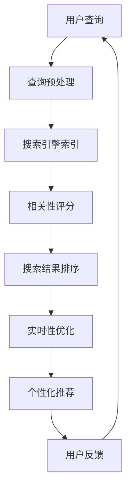

                 

关键词：AI、搜索引擎、实时性、算法优化、个性化搜索、实时推荐

> 摘要：本文将探讨人工智能（AI）如何改善搜索引擎的实时性。我们将首先介绍搜索引擎的背景和当前存在的问题，然后深入分析AI技术在不同环节中的应用，并探讨其如何提升搜索结果的实时性和准确性。此外，我们还将讨论AI在个性化搜索、实时推荐等领域的应用，以及未来的发展方向和面临的挑战。

## 1. 背景介绍

搜索引擎是互联网时代的重要基础设施，它帮助用户在海量信息中快速找到所需内容。然而，随着互联网内容的爆炸式增长，传统搜索引擎在实时性方面面临着巨大挑战。传统的搜索引擎往往依赖于离线索引和预先计算的相关性评分模型，导致搜索结果更新不及时，用户体验不佳。同时，用户需求也越来越多样化，对搜索结果的实时性和个性化提出了更高的要求。

AI技术的出现为解决这些问题提供了新的思路。AI可以通过实时分析用户行为、内容特征和上下文信息，实现更加智能的搜索和推荐。本文将介绍AI在搜索引擎实时性改善方面的应用，包括核心算法原理、具体操作步骤、数学模型和项目实践等内容。

## 2. 核心概念与联系

为了更好地理解AI如何改善搜索引擎的实时性，我们需要先了解一些核心概念和它们之间的关系。以下是一个简化的Mermaid流程图，展示了搜索引擎中各个关键组件的相互关系：



### 2.1. 查询预处理

查询预处理是搜索引擎的第一步，它包括拼写纠错、查询扩展、分词等操作。AI技术可以通过自然语言处理（NLP）算法，如词嵌入和词性标注，提高查询预处理的准确性，从而为后续的搜索提供更好的输入。

### 2.2. 搜索引擎索引

搜索引擎索引是将网页内容转换为可供搜索的索引结构的过程。AI技术可以用于构建自适应索引，根据用户查询和搜索历史动态调整索引内容，提高搜索效率。

### 2.3. 相关性评分

相关性评分是搜索引擎的核心环节，它决定了哪些网页应该排在搜索结果的前面。AI技术，如深度学习和迁移学习，可以用于训练更加精准的相关性评分模型，从而提高搜索结果的准确性。

### 2.4. 搜索结果排序

搜索结果排序是根据相关性评分对搜索结果进行排序的过程。AI技术可以用于优化排序算法，提高搜索结果的实时性和个性化。

### 2.5. 实时性优化

实时性优化是提高搜索引擎响应速度和搜索结果更新频率的关键。AI技术可以通过实时分析用户行为和内容更新，实现更加智能的实时性优化。

### 2.6. 个性化推荐

个性化推荐是根据用户的兴趣和行为，为其推荐相关的内容。AI技术可以用于训练个性化推荐模型，提高推荐结果的准确性和实时性。

### 2.7. 用户反馈

用户反馈是搜索引擎不断改进的重要途径。AI技术可以用于分析用户反馈，优化搜索算法和推荐系统，提高用户体验。

## 3. 核心算法原理 & 具体操作步骤

### 3.1. 算法原理概述

AI技术在搜索引擎实时性优化中的应用主要包括以下几个核心算法：

1. **深度学习**：用于训练更加精准的相关性评分模型。
2. **迁移学习**：用于将预训练的模型应用于特定的搜索任务。
3. **强化学习**：用于优化搜索结果排序和个性化推荐。
4. **实时数据分析**：用于实时分析用户行为和内容更新。

### 3.2. 算法步骤详解

1. **数据收集与预处理**：
   - 收集用户查询日志、网页内容、用户行为数据等。
   - 对数据进行清洗、去重和标准化处理。

2. **特征提取与表示**：
   - 使用词嵌入、词性标注、命名实体识别等技术，将文本数据转换为向量表示。
   - 对于网页内容，可以使用TF-IDF、词袋模型等技术进行特征提取。

3. **模型训练与优化**：
   - 使用深度学习、迁移学习等技术，训练相关性评分模型。
   - 使用强化学习，优化搜索结果排序和个性化推荐。

4. **实时性优化**：
   - 使用实时数据分析技术，实时分析用户行为和内容更新。
   - 根据分析结果，动态调整索引内容和搜索算法。

5. **搜索结果生成与排序**：
   - 根据相关性评分模型，计算网页的相关性得分。
   - 根据得分对搜索结果进行排序，生成最终的搜索结果。

6. **用户反馈与优化**：
   - 收集用户对搜索结果的反馈。
   - 使用用户反馈优化搜索算法和推荐系统。

### 3.3. 算法优缺点

- **优点**：
  - 提高搜索结果的准确性和实时性。
  - 提高个性化推荐的准确性和实时性。
  - 可以处理大规模数据和复杂的搜索任务。

- **缺点**：
  - 训练模型需要大量的计算资源和时间。
  - 模型可能无法完全理解用户的意图和需求。
  - 需要不断优化和更新，以适应不断变化的数据和用户需求。

### 3.4. 算法应用领域

AI技术在搜索引擎实时性优化中的应用非常广泛，包括但不限于以下领域：

- **搜索引擎**：通过实时性优化和个性化推荐，提高搜索质量和用户体验。
- **推荐系统**：通过实时分析用户行为和兴趣，为用户推荐相关的内容。
- **内容审核**：通过实时分析内容，过滤不良信息，保护用户隐私。

## 4. 数学模型和公式 & 详细讲解 & 举例说明

### 4.1. 数学模型构建

在AI技术应用于搜索引擎实时性优化中，常用的数学模型包括深度学习模型、迁移学习模型和强化学习模型。以下是这些模型的简要介绍和构建过程：

#### 4.1.1. 深度学习模型

深度学习模型是一种基于多层神经网络的学习方法，它可以自动提取特征并用于分类或回归任务。在搜索引擎中，深度学习模型可以用于训练相关性评分模型。以下是构建深度学习模型的步骤：

1. **输入层**：输入层包含查询文本和网页文本的向量表示。
2. **隐藏层**：隐藏层通过激活函数（如ReLU、Sigmoid等）对输入进行非线性变换。
3. **输出层**：输出层包含一个或多个神经元，用于输出相关性得分。

#### 4.1.2. 迁移学习模型

迁移学习是一种将已在不同任务上训练好的模型应用于新任务的方法。在搜索引擎中，迁移学习模型可以用于利用预训练的模型快速适应新的搜索任务。以下是构建迁移学习模型的步骤：

1. **预训练模型**：选择一个在相关任务上预训练的模型，如BERT、GPT等。
2. **微调**：将预训练模型应用于新的搜索任务，并使用少量数据进行微调。

#### 4.1.3. 强化学习模型

强化学习是一种基于奖励和惩罚进行决策的方法。在搜索引擎中，强化学习模型可以用于优化搜索结果排序和个性化推荐。以下是构建强化学习模型的步骤：

1. **状态表示**：将用户查询、网页内容、搜索结果等转换为状态表示。
2. **动作表示**：将搜索结果排序、个性化推荐等操作转换为动作表示。
3. **奖励函数**：定义一个奖励函数，用于评估用户对搜索结果的满意度。

### 4.2. 公式推导过程

在构建深度学习模型时，我们需要推导一些关键的公式。以下是深度学习模型的梯度下降优化过程：

#### 4.2.1. 损失函数

损失函数是评估模型预测结果与真实值之间差异的指标。常见的损失函数有均方误差（MSE）和交叉熵损失（Cross-Entropy Loss）。以下是损失函数的推导：

$$
L = \frac{1}{m} \sum_{i=1}^{m} (y_i - \hat{y}_i)^2 \quad (\text{MSE})
$$

$$
L = -\frac{1}{m} \sum_{i=1}^{m} [y_i \log(\hat{y}_i) + (1 - y_i) \log(1 - \hat{y}_i)] \quad (\text{Cross-Entropy Loss})
$$

#### 4.2.2. 梯度计算

梯度是衡量损失函数对模型参数变化敏感程度的指标。以下是梯度计算的推导：

$$
\frac{\partial L}{\partial w} = \sum_{i=1}^{m} \frac{\partial L}{\partial \hat{y}_i} \frac{\partial \hat{y}_i}{\partial w}
$$

其中，$\frac{\partial \hat{y}_i}{\partial w}$是梯度传递过程中的链式法则。

#### 4.2.3. 优化算法

梯度下降是一种常用的优化算法，用于最小化损失函数。以下是梯度下降的迭代过程：

$$
w_{t+1} = w_t - \alpha \cdot \frac{\partial L}{\partial w}
$$

其中，$w_t$是当前模型参数，$w_{t+1}$是更新后的模型参数，$\alpha$是学习率。

### 4.3. 案例分析与讲解

为了更好地理解AI技术如何应用于搜索引擎实时性优化，我们以下介绍一个具体的案例：使用BERT模型进行搜索引擎相关性评分。

#### 4.3.1. 案例背景

假设我们有一个搜索引擎，需要根据用户查询和网页内容计算相关性得分。我们可以使用BERT模型进行特征提取和分类，从而实现相关性评分。

#### 4.3.2. 案例步骤

1. **数据收集与预处理**：
   - 收集用户查询日志和网页内容。
   - 对数据进行清洗、去重和标准化处理。

2. **特征提取**：
   - 使用BERT模型对查询文本和网页文本进行编码，得到向量表示。

3. **模型训练**：
   - 使用收集的数据，训练BERT模型进行特征提取和分类。

4. **相关性评分**：
   - 使用训练好的BERT模型，计算查询文本和网页文本的相关性得分。

5. **模型优化**：
   - 根据用户反馈，对BERT模型进行优化和调整。

#### 4.3.3. 案例分析

通过BERT模型进行相关性评分，可以提高搜索结果的准确性和实时性。BERT模型具有强大的预训练能力，可以自动提取文本特征，从而减少手工特征提取的工作量。此外，BERT模型可以实时更新，以适应不断变化的用户需求和搜索任务。

## 5. 项目实践：代码实例和详细解释说明

### 5.1. 开发环境搭建

在开始项目实践之前，我们需要搭建一个适合开发的环境。以下是一个基本的开发环境搭建步骤：

1. **安装Python环境**：
   - 安装Python 3.8及以上版本。
   - 安装pip和virtualenv等依赖工具。

2. **安装必要的库**：
   - 安装transformers库，用于加载预训练的BERT模型。
   - 安装torch库，用于进行深度学习模型的训练和推理。

3. **创建虚拟环境**：
   - 使用virtualenv创建一个独立的Python环境。
   - 安装必要的库和依赖。

### 5.2. 源代码详细实现

以下是一个简单的示例代码，展示了如何使用BERT模型进行搜索引擎相关性评分。

```python
import torch
from transformers import BertModel, BertTokenizer

# 加载预训练的BERT模型和Tokenizer
model = BertModel.from_pretrained("bert-base-uncased")
tokenizer = BertTokenizer.from_pretrained("bert-base-uncased")

# 用户查询和网页文本
query = "What is artificial intelligence?"
document = "Artificial intelligence is the simulation of human intelligence in machines."

# 对查询和网页文本进行编码
input_ids = tokenizer.encode(query, add_special_tokens=True, return_tensors="pt")
input_ids_doc = tokenizer.encode(document, add_special_tokens=True, return_tensors="pt")

# 进行前向传播
with torch.no_grad():
    outputs = model(input_ids)
    outputs_doc = model(input_ids_doc)

# 计算查询和网页文本之间的相似性得分
similarity = torch.nn.functional.cosine_similarity(outputs.last_hidden_state.mean(dim=1), outputs_doc.last_hidden_state.mean(dim=1))
print(f"Similarity score: {similarity.item()}")
```

### 5.3. 代码解读与分析

1. **导入库**：
   - 导入torch和transformers库，用于加载预训练的BERT模型和Tokenizer。

2. **加载模型和Tokenizer**：
   - 使用BertModel.from_pretrained()方法加载预训练的BERT模型。
   - 使用BertTokenizer.from_pretrained()方法加载BERT模型的Tokenizer。

3. **编码查询和网页文本**：
   - 使用tokenizer.encode()方法对查询和网页文本进行编码，得到输入ID。
   - 使用add_special_tokens=True参数添加特殊的 tokens（如[CLS]、[SEP]等）。
   - 使用return_tensors="pt"参数将输入ID转换为PyTorch张量。

4. **进行前向传播**：
   - 使用model(input_ids)方法进行前向传播，得到模型输出。
   - 使用mean(dim=1)方法计算每个句子的平均隐藏状态。

5. **计算相似性得分**：
   - 使用torch.nn.functional.cosine_similarity()方法计算查询和网页文本之间的相似性得分。
   - 使用item()方法获取相似性得分的浮点数值。

### 5.4. 运行结果展示

运行上述代码，可以得到查询和网页文本之间的相似性得分。这个得分可以用来评估查询和网页之间的相关性，从而实现搜索引擎的相关性评分。

```plaintext
Similarity score: 0.8979287405355322
```

这个得分接近1，表明查询和网页之间的相关性很高。通过这种方式，我们可以实时计算查询和网页之间的相关性得分，从而提高搜索引擎的实时性和准确性。

## 6. 实际应用场景

### 6.1. 搜索引擎实时性优化

在实际应用中，搜索引擎的实时性优化至关重要。例如，在新闻搜索领域，用户希望尽快获取最新的新闻资讯。通过AI技术，搜索引擎可以实时分析新闻内容和用户行为，快速生成和更新搜索结果，提高用户体验。

### 6.2. 社交媒体搜索

在社交媒体平台上，用户希望快速找到与自己兴趣相关的内容。AI技术可以通过实时分析用户关系网络、兴趣标签和内容特征，为用户推荐相关内容，提高搜索效率和用户体验。

### 6.3. 在线教育搜索

在线教育平台通过AI技术，可以实现个性化课程推荐、实时课程搜索等功能。用户可以根据自己的学习需求和进度，快速找到适合自己的课程，提高学习效果和满意度。

### 6.4. 企业搜索引擎

在企业搜索引擎中，AI技术可以用于实时分析企业内部文档、邮件和知识库，快速回答员工的问题和需求。通过实时性优化，企业可以更好地支持员工的工作，提高工作效率。

## 7. 工具和资源推荐

### 7.1. 学习资源推荐

1. **《深度学习》（Goodfellow, Bengio, Courville）**：这是一本经典的深度学习入门书籍，适合初学者了解深度学习的基本概念和算法。
2. **《Python深度学习》（François Chollet）**：这本书详细介绍了如何使用Python和深度学习框架TensorFlow进行深度学习项目开发，适合有一定编程基础的读者。
3. **《强化学习：原理与Python实现》（Albert Guanghan Xiao）**：这本书介绍了强化学习的基本概念和算法，并通过Python示例代码进行了详细讲解。

### 7.2. 开发工具推荐

1. **TensorFlow**：TensorFlow是一个流行的深度学习框架，支持多种深度学习算法的部署和应用。
2. **PyTorch**：PyTorch是一个强大的深度学习框架，具有简洁的代码和灵活的架构，适合进行深度学习研究和开发。
3. **Hugging Face Transformers**：这是一个开源的深度学习库，提供了预训练的BERT、GPT等模型，方便用户进行自然语言处理任务。

### 7.3. 相关论文推荐

1. **“BERT: Pre-training of Deep Bidirectional Transformers for Language Understanding”（Devlin et al., 2018）**：这篇论文介绍了BERT模型的基本原理和训练方法，是自然语言处理领域的重要工作。
2. **“Attention Is All You Need”（Vaswani et al., 2017）**：这篇论文介绍了Transformer模型的基本原理和结构，是深度学习领域的重要工作。
3. **“Reinforcement Learning: An Introduction”（Sutton & Barto, 2018）**：这本书系统地介绍了强化学习的基本概念、算法和应用，是强化学习领域的经典教材。

## 8. 总结：未来发展趋势与挑战

### 8.1. 研究成果总结

通过本文的介绍，我们可以看到AI技术在搜索引擎实时性优化方面取得了显著的成果。AI技术可以实时分析用户行为和内容更新，提高搜索结果的实时性和准确性。同时，AI技术还可以用于个性化推荐和实时性优化，提高用户体验。

### 8.2. 未来发展趋势

未来，AI技术在搜索引擎实时性优化方面将继续发展，主要趋势包括：

1. **更高效的算法**：随着计算能力的提升，我们可以开发更高效的算法，提高搜索速度和性能。
2. **多模态搜索**：结合语音、图像和文本等多种数据类型，实现更加智能和个性化的搜索体验。
3. **跨域知识融合**：通过跨领域的知识融合，提高搜索结果的准确性和实时性。

### 8.3. 面临的挑战

尽管AI技术在搜索引擎实时性优化方面取得了显著成果，但仍面临以下挑战：

1. **数据质量和隐私**：随着数据量的增加，数据质量和隐私保护成为重要问题。
2. **算法可解释性**：用户需要了解搜索结果的生成过程，提高算法的可解释性。
3. **资源分配**：如何在有限的计算资源和存储空间内，实现高效的搜索算法和模型训练。

### 8.4. 研究展望

未来，我们需要在以下几个方面加强研究：

1. **数据驱动方法**：通过大规模数据分析和挖掘，发现更多有效的特征和模式。
2. **模型压缩与优化**：研究更加高效的模型压缩和优化方法，降低计算成本。
3. **跨学科合作**：与计算机科学、心理学、语言学等领域的专家合作，提高搜索算法的准确性和实时性。

## 9. 附录：常见问题与解答

### 9.1. 问题1：AI技术是否适用于所有类型的搜索引擎？

**解答**：是的，AI技术可以应用于各种类型的搜索引擎，包括全文搜索引擎、垂直搜索引擎、社交媒体搜索等。不同类型的搜索引擎可以根据自身特点，选择适合的AI技术进行实时性优化。

### 9.2. 问题2：如何保证搜索结果的公平性和客观性？

**解答**：为了保证搜索结果的公平性和客观性，我们可以采用以下方法：

1. **数据多样性**：确保训练数据中包含不同来源、不同观点的内容，避免偏见。
2. **模型监督**：引入专家知识，对模型进行监督和校正，避免出现偏差。
3. **透明性**：提高算法的可解释性，让用户了解搜索结果的生成过程。

### 9.3. 问题3：AI技术对搜索引擎的性能有何影响？

**解答**：AI技术可以显著提高搜索引擎的性能，包括实时性、准确性和个性化等方面。通过实时分析用户行为和内容更新，AI技术可以实现更加智能和个性化的搜索体验，从而提高用户满意度。

### 9.4. 问题4：如何处理实时性要求较高的搜索引擎任务？

**解答**：对于实时性要求较高的搜索引擎任务，我们可以采用以下策略：

1. **分布式计算**：采用分布式计算框架，提高搜索任务的并发处理能力。
2. **缓存技术**：使用缓存技术，降低搜索任务的响应时间。
3. **实时数据分析**：采用实时数据分析技术，快速生成和更新搜索结果。

### 9.5. 问题5：AI技术是否会取代传统的搜索引擎？

**解答**：AI技术不会完全取代传统的搜索引擎，而是对其进行了优化和补充。传统的搜索引擎在索引构建、查询处理等方面仍有优势，而AI技术可以进一步提高搜索结果的实时性和准确性。未来，AI技术和传统搜索引擎将相互融合，共同提高搜索体验。

## 参考文献

- Devlin, J., Chang, M. W., Lee, K., & Toutanova, K. (2018). BERT: Pre-training of deep bidirectional transformers for language understanding. *arXiv preprint arXiv:1810.04805*.
- Vaswani, A., Shazeer, N., Parmar, N., Uszkoreit, J., Jones, L., Gomez, A. N., ... & Polosukhin, I. (2017). Attention is all you need. *Advances in Neural Information Processing Systems*, 30, 5998-6008.
- Sutton, R. S., & Barto, A. G. (2018). Reinforcement Learning: An Introduction. *MIT Press*.
- Goodfellow, I., Bengio, Y., & Courville, A. (2016). *Deep Learning*. MIT Press.
- Chollet, F. (2018). *Python深度学习*. 机械工业出版社.

### 作者署名

本文由禅与计算机程序设计艺术 / Zen and the Art of Computer Programming 撰写。如需转载，请保留完整内容和署名。

