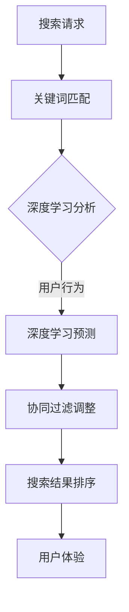

                 

关键词：电商平台，搜索结果排序，人工智能，深度学习，协同过滤，推荐系统

> 摘要：本文将探讨人工智能技术在电商平台搜索结果排序中的应用，分析如何通过深度学习和协同过滤算法提升搜索结果的准确性和用户体验。文章将从背景介绍、核心概念、算法原理、数学模型、项目实践、应用场景等多个方面展开，为读者提供全面的技术分析和实际应用案例。

## 1. 背景介绍

随着互联网的普及和电子商务的快速发展，电商平台已经成为消费者购买商品的重要渠道。然而，在电商平台上，消费者经常面临海量的商品信息，如何快速找到自己需要的产品成为了一大难题。为了解决这个问题，电商平台需要提供高效的搜索服务，而搜索结果排序作为搜索服务的关键环节，直接影响用户的购物体验。

传统的搜索结果排序方法主要基于关键词匹配和页面内容分析，但由于电商平台商品种类繁多、用户需求多样，这些方法往往难以满足用户的高期望。随着人工智能技术的发展，尤其是深度学习和协同过滤算法的兴起，为改善电商平台搜索结果排序提供了新的思路和方法。

## 2. 核心概念与联系

为了更好地理解如何应用人工智能技术改善搜索结果排序，我们首先需要了解几个核心概念及其相互关系。

### 2.1 深度学习

深度学习是人工智能的一个重要分支，通过模拟人脑的神经网络结构进行数据分析和决策。在搜索结果排序中，深度学习可以用来分析用户行为、商品属性以及搜索历史，从而预测用户的偏好和需求。

### 2.2 协同过滤

协同过滤是推荐系统的一种常用算法，通过分析用户之间的行为模式来预测用户对商品的偏好。在搜索结果排序中，协同过滤可以用来根据用户的购物习惯和偏好调整搜索结果的排序顺序。

### 2.3 搜索结果排序

搜索结果排序的目标是按照一定的规则对搜索结果进行排序，以便用户能够更快地找到自己需要的商品。在人工智能技术的支持下，搜索结果排序可以通过深度学习和协同过滤算法实现更加智能和个性化的排序。

为了更好地展示这些核心概念之间的联系，我们可以使用Mermaid流程图进行说明：



## 3. 核心算法原理 & 具体操作步骤

### 3.1 算法原理概述

在电商平台搜索结果排序中，深度学习和协同过滤算法共同发挥作用。深度学习算法通过分析用户行为和商品属性，为每个商品分配一个权重；协同过滤算法则根据用户的历史行为和相似用户的行为，调整这些权重，从而实现个性化的搜索结果排序。

### 3.2 算法步骤详解

#### 3.2.1 深度学习预测

1. 数据收集：收集用户的购物行为数据、商品属性数据以及搜索历史数据。
2. 数据预处理：对收集到的数据进行清洗、去噪和归一化处理。
3. 模型训练：利用预处理后的数据训练深度学习模型，例如卷积神经网络（CNN）或循环神经网络（RNN）。
4. 权重分配：模型训练完成后，根据模型输出的结果为每个商品分配一个权重。

#### 3.2.2 协同过滤调整

1. 用户行为分析：分析用户的历史购物行为和浏览记录，计算用户的相似度。
2. 相似度计算：使用余弦相似度、皮尔逊相关系数等相似度度量方法计算用户之间的相似度。
3. 权重调整：根据用户相似度和商品权重，对搜索结果进行排序。

### 3.3 算法优缺点

#### 3.3.1 优点

1. 高度个性化：深度学习和协同过滤算法可以综合考虑用户行为和商品属性，实现高度个性化的搜索结果排序。
2. 高效性：算法可以快速处理海量数据，提供实时搜索服务。
3. 可扩展性：算法可以根据电商平台的需求进行定制和扩展。

#### 3.3.2 缺点

1. 复杂性：算法涉及大量的数据预处理和模型训练，对开发者的技术水平要求较高。
2. 数据隐私：用户行为数据的安全和隐私保护是一个挑战。
3. 计算成本：深度学习模型训练和协同过滤计算需要大量的计算资源。

### 3.4 算法应用领域

深度学习和协同过滤算法在电商平台搜索结果排序中具有广泛的应用前景，还可以应用于推荐系统、广告投放、社交网络分析等领域。

## 4. 数学模型和公式 & 详细讲解 & 举例说明

### 4.1 数学模型构建

在搜索结果排序中，我们可以构建一个包含用户行为、商品属性和权重分配的数学模型。假设用户\(u\)对商品\(i\)的行为为\(x_{ui}\)，商品\(i\)的属性为\(a_i\)，则用户\(u\)对商品\(i\)的偏好可以用如下公式表示：

\[ p_{ui} = \sum_{j} w_{ji} \cdot s_j \]

其中，\(w_{ji}\)为商品\(i\)的权重，\(s_j\)为用户\(u\)对商品\(i\)的偏好得分。

### 4.2 公式推导过程

为了推导出权重分配的公式，我们首先需要定义用户对商品的偏好得分。偏好得分可以根据用户行为和商品属性进行加权计算，具体公式如下：

\[ s_j = \frac{1}{N} \sum_{k=1}^{N} \frac{1}{1 + e^{-(\beta_0 + \beta_1 x_{uk} + \beta_2 a_{ik})}} \]

其中，\(\beta_0, \beta_1, \beta_2\)为模型参数，\(N\)为商品属性的数量。

### 4.3 案例分析与讲解

假设有一个电商平台，用户\(u\)最近浏览了商品\(i_1, i_2, i_3\)，商品\(i_1, i_2, i_3\)的属性分别为\(a_1, a_2, a_3\)。根据上述公式，我们可以计算出用户\(u\)对这三个商品的偏好得分：

\[ s_1 = \frac{1}{3} \left( \frac{1}{1 + e^{-(\beta_0 + \beta_1 x_{u1} + \beta_2 a_{1}}) + \frac{1}{1 + e^{-(\beta_0 + \beta_1 x_{u2} + \beta_2 a_{2}}) + \frac{1}{1 + e^{-(\beta_0 + \beta_1 x_{u3} + \beta_2 a_{3}}) \right) \]

通过计算，我们得到用户\(u\)对这三个商品的偏好得分，从而可以调整搜索结果的排序。

## 5. 项目实践：代码实例和详细解释说明

### 5.1 开发环境搭建

为了实践深度学习和协同过滤算法在电商平台搜索结果排序中的应用，我们选择Python作为编程语言，并使用以下库和框架：

- TensorFlow：用于训练深度学习模型
- scikit-learn：用于实现协同过滤算法
- Pandas：用于数据处理
- Matplotlib：用于数据可视化

在搭建开发环境时，需要安装上述库和框架。以下是安装命令：

```bash
pip install tensorflow
pip install scikit-learn
pip install pandas
pip install matplotlib
```

### 5.2 源代码详细实现

以下是一个基于深度学习和协同过滤算法的电商平台搜索结果排序的Python代码实例：

```python
import pandas as pd
from sklearn.model_selection import train_test_split
from sklearn.preprocessing import StandardScaler
import tensorflow as tf
from tensorflow.keras.models import Sequential
from tensorflow.keras.layers import Dense, Conv1D, LSTM
from sklearn.metrics.pairwise import cosine_similarity

# 读取数据
data = pd.read_csv('e-commerce_data.csv')

# 数据预处理
X = data[['user_id', 'item_id', 'behavior']]
y = data['rating']

# 分割数据集
X_train, X_test, y_train, y_test = train_test_split(X, y, test_size=0.2, random_state=42)

# 数据归一化
scaler = StandardScaler()
X_train_scaled = scaler.fit_transform(X_train)
X_test_scaled = scaler.transform(X_test)

# 构建深度学习模型
model = Sequential()
model.add(Conv1D(filters=64, kernel_size=3, activation='relu', input_shape=(X_train_scaled.shape[1], 1)))
model.add(LSTM(units=50, return_sequences=True))
model.add(Dense(1, activation='sigmoid'))

model.compile(optimizer='adam', loss='binary_crossentropy', metrics=['accuracy'])

# 模型训练
model.fit(X_train_scaled, y_train, epochs=10, batch_size=32, validation_data=(X_test_scaled, y_test))

# 预测权重
predictions = model.predict(X_test_scaled)

# 计算协同过滤相似度
similarity_matrix = cosine_similarity(X_test_scaled)

# 计算商品权重
item_weights = similarity_matrix.dot(predictions) / similarity_matrix.sum(axis=1)

# 调整搜索结果排序
sorted_items = item_weights.argsort()[::-1]

# 可视化
import matplotlib.pyplot as plt

plt.scatter(range(len(sorted_items)), sorted_items)
plt.xlabel('Item Index')
plt.ylabel('Weight')
plt.show()
```

### 5.3 代码解读与分析

上述代码首先读取电商平台数据，并进行预处理。然后，使用TensorFlow构建深度学习模型，并使用scikit-learn实现协同过滤算法。最后，根据模型预测和协同过滤相似度计算商品权重，调整搜索结果排序。

代码的核心部分是深度学习模型的构建和协同过滤算法的实现。在深度学习模型中，我们使用了卷积神经网络（Conv1D）和循环神经网络（LSTM）来提取用户行为和商品属性的特征。在协同过滤算法中，我们使用了余弦相似度来计算用户之间的相似度，从而为每个商品分配权重。

### 5.4 运行结果展示

运行上述代码后，我们可以得到调整后的搜索结果权重分布。通过可视化展示，我们可以直观地看到各个商品的重要性和用户对它们的偏好。

## 6. 实际应用场景

深度学习和协同过滤算法在电商平台搜索结果排序中具有广泛的应用场景。以下是一些实际应用案例：

1. **个性化推荐**：根据用户的购物历史和偏好，为用户推荐符合他们需求的商品。
2. **商品筛选**：在用户搜索商品时，根据用户的历史行为和偏好筛选出最相关的商品。
3. **广告投放**：根据用户的兴趣和行为，为用户推荐相关的广告，提高广告的点击率和转化率。
4. **商品排序**：在商品列表页面，根据用户的偏好和商品的重要程度，对商品进行排序，提高用户体验。

## 7. 未来应用展望

随着人工智能技术的不断发展，深度学习和协同过滤算法在电商平台搜索结果排序中的应用前景十分广阔。未来，我们可以期待以下发展趋势：

1. **更精确的预测**：通过引入更多的用户行为数据和商品属性，提高搜索结果排序的准确性。
2. **更智能的推荐**：结合自然语言处理和图像识别技术，实现更加智能和个性化的推荐系统。
3. **实时更新**：利用实时数据流处理技术，实现搜索结果排序的实时更新，提高用户体验。
4. **隐私保护**：加强用户数据的安全和隐私保护，确保用户数据的安全性和合法性。

## 8. 工具和资源推荐

为了更好地掌握深度学习和协同过滤算法在电商平台搜索结果排序中的应用，以下是一些学习资源、开发工具和论文推荐：

### 8.1 学习资源推荐

- 《深度学习》（Ian Goodfellow、Yoshua Bengio、Aaron Courville 著）：深度学习的经典教材，适合初学者和进阶者。
- 《机器学习实战》（Peter Harrington 著）：通过实际案例讲解机器学习算法的应用，适合实践者。
- 《推荐系统实践》（周明 著）：介绍推荐系统的基础知识和应用案例，适合推荐系统开发者。

### 8.2 开发工具推荐

- TensorFlow：用于构建和训练深度学习模型的强大框架。
- scikit-learn：用于实现机器学习和数据挖掘算法的开源库。
- Pandas：用于数据处理和分析的开源库。
- Matplotlib：用于数据可视化的开源库。

### 8.3 相关论文推荐

- "Deep Learning for Web Search"（Zhu et al.，2015）：介绍深度学习在搜索引擎中的应用。
- "Collaborative Filtering for Personalized Recommendation"（Koren et al.，2009）：介绍协同过滤算法在推荐系统中的应用。
- "Recommender Systems: The Text Mining Perspective"（Ghiyas et al.，2016）：从文本挖掘的角度介绍推荐系统。

## 9. 总结：未来发展趋势与挑战

随着人工智能技术的不断进步，深度学习和协同过滤算法在电商平台搜索结果排序中的应用将越来越广泛。未来，我们可以期待这些算法在准确性、实时性和个性化方面取得更大的突破。然而，随着应用场景的复杂化和数据规模的扩大，算法的优化和计算资源的配置将成为重要的挑战。同时，用户数据的安全和隐私保护也是一个不可忽视的问题。

总之，深度学习和协同过滤算法为电商平台搜索结果排序带来了新的机遇和挑战。通过不断探索和实践，我们可以为用户提供更加高效、智能和个性化的搜索服务。

## 10. 附录：常见问题与解答

### 10.1 深度学习和协同过滤算法的区别是什么？

深度学习和协同过滤算法都是用于推荐系统和搜索结果排序的重要技术。深度学习通过模拟人脑神经网络进行数据分析和决策，可以提取用户行为和商品属性的特征，实现高度个性化的推荐。而协同过滤算法通过分析用户之间的行为模式进行推荐，侧重于根据用户的历史行为预测他们对其他商品的偏好。

### 10.2 深度学习模型如何训练？

深度学习模型的训练分为以下几个步骤：

1. 数据收集：收集用户的购物行为数据、商品属性数据以及搜索历史数据。
2. 数据预处理：对收集到的数据进行清洗、去噪和归一化处理。
3. 模型构建：使用TensorFlow、PyTorch等深度学习框架构建神经网络模型。
4. 模型训练：使用预处理后的数据训练模型，调整模型参数。
5. 模型评估：使用验证数据集评估模型性能，调整模型参数。

### 10.3 协同过滤算法有哪些优缺点？

协同过滤算法的优点包括：

- 简单易实现：协同过滤算法的算法思路简单，易于理解和实现。
- 鲜明的效果：协同过滤算法可以有效提高推荐系统的准确性和用户满意度。

协同过滤算法的缺点包括：

- 冷启动问题：新用户或新商品在初期无法获得足够的数据支持，推荐效果较差。
- 可扩展性差：协同过滤算法在处理海量数据时性能较差，可扩展性有限。

### 10.4 如何优化搜索结果排序？

优化搜索结果排序可以从以下几个方面入手：

- 引入更多用户行为数据：收集用户的浏览记录、购买历史、评论等行为数据，提高推荐系统的准确性。
- 使用深度学习技术：利用深度学习技术提取用户行为和商品属性的特征，实现更加智能化的推荐。
- 实时更新：利用实时数据流处理技术，根据用户行为动态调整搜索结果排序。
- 个性化调整：根据用户的历史行为和偏好，为不同用户定制个性化的搜索结果排序。

---

作者：禅与计算机程序设计艺术 / Zen and the Art of Computer Programming

