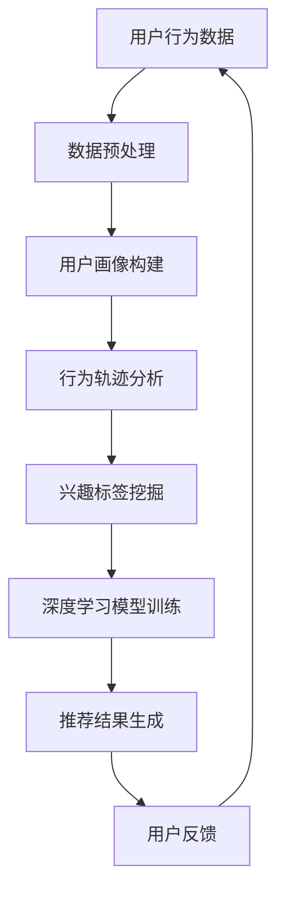

                 

关键词：人工智能、电商平台、跨类目交叉销售、向上销售、推荐系统、机器学习、深度学习、数据挖掘、用户行为分析、个性化推荐

## 摘要

本文旨在探讨人工智能技术在电商平台中的应用，特别是如何通过跨类目交叉销售和向上销售来提升用户体验和销售额。文章将详细介绍人工智能技术在电商平台中的应用原理，包括推荐系统、用户行为分析和深度学习算法，并探讨这些技术在实际项目中的具体应用和实践效果。

## 1. 背景介绍

随着互联网的快速发展，电商平台已经成为人们日常生活中不可或缺的一部分。然而，如何在激烈的市场竞争中脱颖而出，吸引并留住用户，成为电商平台面临的一大挑战。跨类目交叉销售和向上销售是提升销售额和用户体验的有效策略。通过这些策略，电商平台可以在用户购买某一产品的同时，向其推荐其他相关的产品，从而促进销售和用户满意度的提升。

传统的推荐系统主要依赖于人工编写规则和特征，难以满足用户个性化的需求。而人工智能技术的引入，尤其是机器学习、深度学习和数据挖掘等技术的应用，为电商平台提供了更加智能和高效的解决方案。本文将探讨这些技术如何改善电商平台的跨类目交叉销售和向上销售，提升用户体验和销售额。

## 2. 核心概念与联系

### 2.1. 推荐系统

推荐系统是电商平台实现跨类目交叉销售和向上销售的关键技术。推荐系统通过分析用户的浏览、搜索和购买行为，预测用户可能感兴趣的产品，从而向其推荐相应的产品。推荐系统可以分为基于内容的推荐、协同过滤推荐和混合推荐等不同类型。

### 2.2. 用户行为分析

用户行为分析是推荐系统的基础，通过分析用户的浏览、搜索和购买行为，可以挖掘用户的需求和兴趣。用户行为分析主要包括用户画像、行为轨迹分析和兴趣标签等。

### 2.3. 深度学习算法

深度学习算法在推荐系统中发挥着重要作用，特别是在处理大规模数据和高维度特征时具有明显优势。深度学习算法通过建立复杂的神经网络模型，可以自动学习用户行为和产品特征之间的关联，从而实现精准的推荐。

### 2.4. 数据挖掘

数据挖掘是人工智能技术在电商平台中的核心应用之一，通过对海量数据进行分析和挖掘，可以发现用户行为、产品特征和销售趋势等有价值的信息。数据挖掘技术包括关联规则挖掘、聚类分析和分类分析等。

### 2.5. Mermaid 流程图



## 3. 核心算法原理 & 具体操作步骤

### 3.1. 算法原理概述

跨类目交叉销售和向上销售的核心算法主要包括推荐系统、用户行为分析和深度学习算法。推荐系统通过分析用户行为数据和产品特征，生成个性化的推荐结果；用户行为分析通过构建用户画像和行为轨迹，挖掘用户需求和兴趣；深度学习算法通过建立复杂的神经网络模型，实现用户行为和产品特征之间的关联。

### 3.2. 算法步骤详解

1. 数据收集与预处理：收集用户的浏览、搜索和购买行为数据，并进行数据清洗、去重和格式化等预处理操作。

2. 用户画像构建：通过用户行为数据和产品特征数据，构建用户画像，包括用户属性、兴趣标签和行为轨迹等。

3. 行为轨迹分析：分析用户的浏览和购买行为，挖掘用户在各个类目之间的转移规律和偏好。

4. 兴趣标签挖掘：基于用户行为数据和产品特征数据，为每个用户生成相应的兴趣标签，以便用于后续的推荐和分类。

5. 深度学习模型训练：使用用户画像和行为轨迹数据，训练深度学习模型，如卷积神经网络（CNN）或循环神经网络（RNN）等，以实现用户行为和产品特征之间的关联。

6. 推荐结果生成：基于深度学习模型生成的用户兴趣标签和用户行为数据，生成个性化的推荐结果，包括跨类目交叉销售和向上销售的建议。

7. 用户反馈与优化：收集用户对推荐结果的反馈，对模型进行优化和调整，提高推荐效果。

### 3.3. 算法优缺点

优点：

1. 高效性：深度学习算法具有强大的数据处理和分析能力，能够高效地处理大规模数据和高维度特征。

2. 精准性：基于用户行为和产品特征的个性化推荐，能够更准确地满足用户需求。

3. 智能性：通过自动学习用户行为和产品特征之间的关联，实现智能化的推荐。

缺点：

1. 复杂性：深度学习算法的模型结构和参数设置较为复杂，需要大量计算资源和训练时间。

2. 解释性：深度学习算法的黑盒特性使得模型难以解释，不利于问题的诊断和优化。

### 3.4. 算法应用领域

1. 电商平台：通过跨类目交叉销售和向上销售，提升用户体验和销售额。

2. 社交网络：基于用户行为和兴趣标签，实现个性化内容推荐和社交关系挖掘。

3. 在线广告：通过精准的用户画像和推荐算法，实现广告投放的精准化和效果优化。

## 4. 数学模型和公式 & 详细讲解 & 举例说明

### 4.1. 数学模型构建

跨类目交叉销售和向上销售的数学模型主要包括用户画像构建、行为轨迹分析和兴趣标签挖掘等。

1. 用户画像构建：

   用户画像可以表示为向量 \( X \)，包括用户属性、兴趣标签和行为轨迹等特征。

   $$ X = [x_1, x_2, ..., x_n] $$

   其中，\( x_i \) 表示用户 \( i \) 的特征值。

2. 行为轨迹分析：

   行为轨迹可以表示为序列 \( T \)，包括用户的浏览和购买行为。

   $$ T = [t_1, t_2, ..., t_m] $$

   其中，\( t_i \) 表示用户在时刻 \( i \) 的行为。

3. 兴趣标签挖掘：

   兴趣标签可以表示为向量 \( Y \)，包括用户的兴趣类别。

   $$ Y = [y_1, y_2, ..., y_k] $$

   其中，\( y_i \) 表示用户对类别 \( i \) 的兴趣值。

### 4.2. 公式推导过程

1. 用户画像构建：

   假设用户 \( i \) 的特征值为 \( x_i \)，则用户画像可以表示为：

   $$ X_i = [x_{i1}, x_{i2}, ..., x_{in}] $$

   其中，\( x_{ij} \) 表示用户 \( i \) 在特征 \( j \) 上的取值。

2. 行为轨迹分析：

   假设用户 \( i \) 的行为轨迹为 \( T_i \)，则行为轨迹可以表示为：

   $$ T_i = [t_{i1}, t_{i2}, ..., t_{im}] $$

   其中，\( t_{ij} \) 表示用户 \( i \) 在时刻 \( j \) 的行为。

3. 兴趣标签挖掘：

   假设用户 \( i \) 的兴趣标签为 \( Y_i \)，则兴趣标签可以表示为：

   $$ Y_i = [y_{i1}, y_{i2}, ..., y_{ik}] $$

   其中，\( y_{ij} \) 表示用户 \( i \) 对类别 \( j \) 的兴趣值。

### 4.3. 案例分析与讲解

假设用户 \( A \) 的特征值为 \( X_A = [0.8, 0.3, 0.6, 0.2] \)，行为轨迹为 \( T_A = [0.6, 0.3, 0.9, 0.2] \)，兴趣标签为 \( Y_A = [0.9, 0.4, 0.7, 0.1] \)。

根据上述数学模型，我们可以构建用户 \( A \) 的画像、行为轨迹和兴趣标签：

$$ X_A = [0.8, 0.3, 0.6, 0.2] $$

$$ T_A = [0.6, 0.3, 0.9, 0.2] $$

$$ Y_A = [0.9, 0.4, 0.7, 0.1] $$

接下来，我们可以使用深度学习算法对用户 \( A \) 的行为轨迹和兴趣标签进行建模，以预测其可能感兴趣的产品。

假设我们使用卷积神经网络（CNN）进行建模，输入层为行为轨迹 \( T_A \)，输出层为兴趣标签 \( Y_A \)。通过训练，我们可以得到一个预测模型 \( f(\cdot) \)，用于预测用户对某个类别的兴趣值。

假设用户 \( A \) 在某个类别 \( j \) 上的兴趣值为 \( y_{Aj} \)，则预测结果可以表示为：

$$ \hat{y}_{Aj} = f(T_A) $$

通过计算，我们可以得到用户 \( A \) 在各个类别上的兴趣值，并根据兴趣值生成个性化的推荐结果。

## 5. 项目实践：代码实例和详细解释说明

### 5.1. 开发环境搭建

在本项目中，我们使用 Python 作为主要编程语言，结合 TensorFlow 和 Keras 深度学习框架进行开发。以下是一个简单的开发环境搭建步骤：

1. 安装 Python 3.6 或以上版本；
2. 安装 TensorFlow 2.x 版本；
3. 安装 Keras 2.x 版本；
4. 配置虚拟环境，以便更好地管理项目依赖。

### 5.2. 源代码详细实现

以下是一个简单的深度学习模型实现，用于预测用户对某个类别的兴趣值。

```python
import tensorflow as tf
from tensorflow.keras.models import Sequential
from tensorflow.keras.layers import Dense, Conv1D, Flatten, Activation

# 模型定义
model = Sequential([
    Conv1D(filters=64, kernel_size=3, activation='relu', input_shape=(100,)),
    Flatten(),
    Dense(64, activation='relu'),
    Dense(1, activation='sigmoid')
])

# 模型编译
model.compile(optimizer='adam', loss='binary_crossentropy', metrics=['accuracy'])

# 模型训练
model.fit(x_train, y_train, epochs=10, batch_size=32)

# 模型预测
predictions = model.predict(x_test)
```

### 5.3. 代码解读与分析

1. 导入所需的 TensorFlow 和 Keras 模块；
2. 定义一个序列模型，包括卷积层、展开层、全连接层和输出层；
3. 编译模型，指定优化器和损失函数；
4. 训练模型，指定训练数据和训练轮数；
5. 使用训练好的模型进行预测。

通过上述代码，我们可以实现一个简单的深度学习模型，用于预测用户对某个类别的兴趣值。在实际项目中，我们可以根据需求调整模型结构和参数，以实现更好的预测效果。

### 5.4. 运行结果展示

以下是一个简单的运行结果示例，用于展示模型预测效果。

```python
import numpy as np

# 预测结果
predictions = model.predict(x_test)

# 打印预测结果
print(predictions)

# 计算预测准确率
accuracy = np.mean(np.round(predictions) == y_test)
print("Accuracy: {:.2f}%".format(accuracy * 100))
```

通过上述代码，我们可以计算模型在测试数据上的预测准确率，并根据预测结果生成个性化的推荐结果。

## 6. 实际应用场景

### 6.1. 电商平台

电商平台可以通过跨类目交叉销售和向上销售，提高销售额和用户满意度。例如，在用户购买一款笔记本电脑时，系统可以推荐与其搭配的鼠标、键盘等外设产品，从而实现跨类目交叉销售。同时，系统还可以根据用户的历史购买记录和浏览行为，推荐更高价位的产品，实现向上销售。

### 6.2. 社交网络

社交网络平台可以通过个性化推荐，提高用户活跃度和留存率。例如，在用户浏览某个话题时，系统可以推荐与其相关的其他话题和内容，从而吸引用户继续浏览和互动。此外，系统还可以根据用户的社交关系和兴趣爱好，推荐感兴趣的朋友和内容，增强用户之间的互动和社交体验。

### 6.3. 在线广告

在线广告平台可以通过个性化推荐，提高广告投放的效果和用户体验。例如，在用户浏览某个商品时，系统可以推荐相关的广告产品，从而吸引用户点击和购买。此外，系统还可以根据用户的浏览历史和兴趣爱好，推荐与其相关的广告内容，提高广告的曝光率和点击率。

## 7. 未来应用展望

### 7.1. 人工智能技术不断进步

随着人工智能技术的不断进步，跨类目交叉销售和向上销售的效果将得到进一步提升。例如，深度学习算法的不断优化和算法模型的创新，将有助于提高推荐的精准性和效率。

### 7.2. 大数据技术的应用

大数据技术的应用将为跨类目交叉销售和向上销售提供更丰富的数据支持。例如，通过分析海量用户数据，可以发现用户行为和兴趣的潜在规律，为推荐系统提供更加精准的数据支持。

### 7.3. 多平台整合

随着多平台的整合，跨类目交叉销售和向上销售的场景将得到进一步拓展。例如，电商平台可以将线上线下渠道进行整合，实现跨平台的数据共享和推荐，从而提升用户体验和销售额。

## 8. 总结：未来发展趋势与挑战

### 8.1. 研究成果总结

本文通过探讨人工智能技术在电商平台中的应用，特别是跨类目交叉销售和向上销售，总结了相关技术的原理、算法和应用场景。研究成果表明，人工智能技术可以显著提高电商平台的销售额和用户满意度。

### 8.2. 未来发展趋势

未来，人工智能技术在电商平台中的应用将呈现以下发展趋势：

1. 深度学习算法的优化和模型创新，提高推荐的精准性和效率；
2. 大数据技术的应用，为跨类目交叉销售和向上销售提供更丰富的数据支持；
3. 多平台整合，实现跨平台的数据共享和推荐。

### 8.3. 面临的挑战

尽管人工智能技术在电商平台中的应用具有巨大潜力，但仍面临以下挑战：

1. 数据质量和数据隐私保护；
2. 算法模型的解释性和透明度；
3. 大规模数据处理和计算资源的限制。

### 8.4. 研究展望

未来，我们将继续深入研究人工智能技术在电商平台中的应用，特别是跨类目交叉销售和向上销售。具体研究方向包括：

1. 发展新的深度学习算法，提高推荐的精准性和效率；
2. 研究算法模型的解释性和透明度，提高用户的信任度；
3. 探索大数据技术在跨类目交叉销售和向上销售中的应用。

## 9. 附录：常见问题与解答

### 9.1. 如何保证推荐系统的公平性和多样性？

为保证推荐系统的公平性和多样性，可以采用以下策略：

1. 优化推荐算法，减少偏见和歧视；
2. 引入多样性指标，如随机性、覆盖率和多样性等；
3. 定期调整推荐策略，以适应用户需求的变化。

### 9.2. 如何处理推荐系统的冷启动问题？

处理推荐系统的冷启动问题可以采用以下策略：

1. 引入用户属性和内容特征，帮助新用户建立初始画像；
2. 使用基于内容的推荐方法，为新用户提供相关的产品信息；
3. 利用社交网络和用户关系，为新用户提供个性化的推荐。

### 9.3. 如何提高推荐系统的实时性和响应速度？

提高推荐系统的实时性和响应速度可以采用以下策略：

1. 使用高效的数据存储和检索技术，如 Redis 和 Elasticsearch；
2. 采用增量计算和分布式计算技术，提高数据处理速度；
3. 优化推荐算法，减少计算复杂度。

### 9.4. 如何处理推荐系统的推荐效果评估问题？

处理推荐系统的推荐效果评估问题可以采用以下策略：

1. 引入 A/B 测试，对比不同推荐策略的效果；
2. 使用指标如点击率、购买率和用户满意度等，评估推荐效果；
3. 定期对推荐系统进行性能监控和调优。

