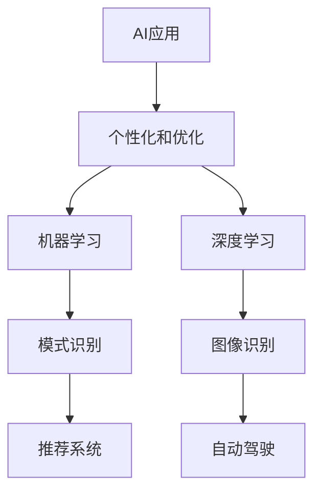
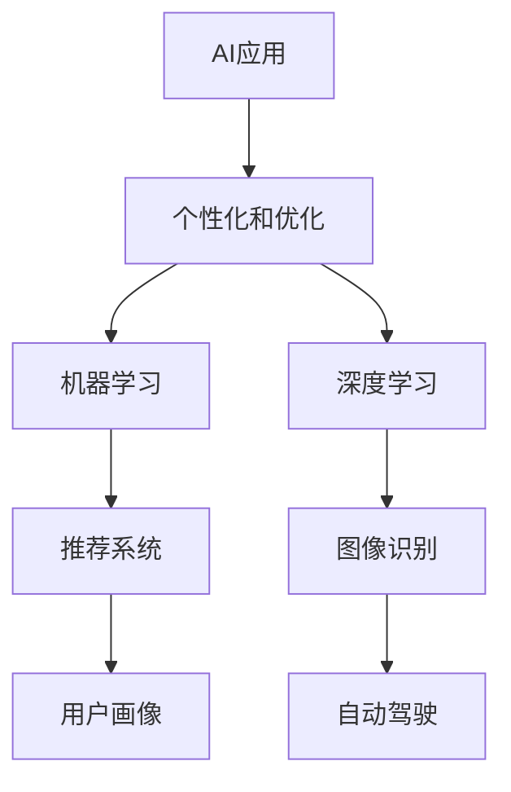

                 

关键词：人工智能，个性化和优化，算法，应用场景，技术趋势

> 摘要：本文将探讨人工智能（AI）在应用过程中如何实现个性化和优化的关键问题。我们将从背景介绍、核心概念与联系、核心算法原理、数学模型、项目实践、实际应用场景、工具和资源推荐以及未来发展趋势与挑战等多个方面展开讨论，旨在为读者提供一个全面、深入的AI应用指南。

## 1. 背景介绍

人工智能作为21世纪的明星技术，已渗透到我们生活的方方面面。从智能手机到智能家居，从自动驾驶到智能医疗，AI正以前所未有的速度改变着世界。然而，随着AI应用的普及，如何实现个性化和优化成为了一个至关重要的问题。

个性化意味着AI系统能够根据用户的需求和行为特点，提供量身定制的服务。而优化则是指通过算法和技术的改进，使AI系统在处理海量数据和复杂任务时更加高效、准确。这两个方面共同构成了AI应用的核心价值。

本文将围绕这一主题，首先介绍AI应用中的一些核心概念和联系，然后深入探讨核心算法原理、数学模型、项目实践和实际应用场景，最后对AI的未来发展趋势和挑战进行展望。

## 2. 核心概念与联系

### 2.1 人工智能

人工智能（Artificial Intelligence，AI）是指通过计算机程序实现人类智能的自动化系统。它包括机器学习、深度学习、自然语言处理、计算机视觉等多个子领域。在AI应用中，机器学习和深度学习是最常用的两种技术。

- **机器学习**：通过算法从数据中学习模式和规律，使计算机能够进行预测和决策。
- **深度学习**：基于多层神经网络的结构，通过大量数据训练，实现复杂的模式识别和数据处理。

### 2.2 个性化和优化

- **个性化**：根据用户的需求和行为特点，提供量身定制的服务。
- **优化**：通过算法和技术的改进，提高系统的效率和质量。

为了更好地理解这两个概念，我们可以用Mermaid流程图来展示它们之间的联系：



## 3. 核心算法原理 & 具体操作步骤

### 3.1 算法原理概述

在AI应用中，常用的算法包括机器学习算法和深度学习算法。下面我们分别介绍这两种算法的基本原理。

#### 3.1.1 机器学习算法

机器学习算法的核心思想是让计算机通过学习数据，从中提取规律和模式，进而进行预测和决策。常见的机器学习算法有：

- **线性回归**：通过最小化误差平方和，找到输入变量和输出变量之间的线性关系。
- **决策树**：根据特征值将数据划分为不同的子集，每个子集对应一个决策节点。
- **支持向量机**：通过找到一个最优的超平面，将不同类别的数据分开。

#### 3.1.2 深度学习算法

深度学习算法是基于多层神经网络的结构，通过大量数据训练，实现复杂的模式识别和数据处理。常见的深度学习算法有：

- **卷积神经网络（CNN）**：用于图像识别和分类。
- **循环神经网络（RNN）**：用于序列数据的学习和处理。
- **生成对抗网络（GAN）**：用于生成和鉴别真实数据和虚假数据。

### 3.2 算法步骤详解

#### 3.2.1 机器学习算法步骤

1. **数据预处理**：对数据进行清洗、归一化等处理，使其适合模型训练。
2. **模型选择**：根据问题类型和数据特征，选择合适的机器学习算法。
3. **训练模型**：使用训练数据集，通过迭代优化算法参数，训练模型。
4. **评估模型**：使用测试数据集，评估模型性能，调整模型参数。
5. **应用模型**：将训练好的模型应用于实际问题，进行预测和决策。

#### 3.2.2 深度学习算法步骤

1. **数据预处理**：与机器学习类似，对数据进行清洗、归一化等处理。
2. **模型构建**：设计神经网络结构，包括输入层、隐藏层和输出层。
3. **训练模型**：使用训练数据集，通过反向传播算法，更新网络权重和偏置。
4. **评估模型**：使用测试数据集，评估模型性能。
5. **应用模型**：将训练好的模型应用于实际问题，进行预测和决策。

### 3.3 算法优缺点

#### 3.3.1 机器学习算法优缺点

**优点**：

- **通用性强**：可以应用于各种类型的数据和问题。
- **可解释性高**：算法的决策过程比较直观，易于理解。

**缺点**：

- **对数据依赖性强**：数据质量和数量对算法性能有很大影响。
- **训练时间较长**：尤其是在处理大量数据时，训练时间较长。

#### 3.3.2 深度学习算法优缺点

**优点**：

- **处理复杂数据能力强**：能够处理高维、非线性数据。
- **自动特征提取**：通过多层神经网络，自动提取数据中的有效特征。

**缺点**：

- **可解释性差**：模型的决策过程复杂，难以解释。
- **对数据质量要求高**：对噪声数据和异常值敏感。

### 3.4 算法应用领域

机器学习和深度学习算法在各个领域都有广泛的应用，以下是几个典型的应用领域：

- **推荐系统**：基于用户的历史行为和偏好，为用户推荐感兴趣的商品或内容。
- **自动驾驶**：通过图像识别和目标检测，实现车辆的自主导航。
- **智能医疗**：通过医学影像分析和电子病历分析，辅助医生进行诊断和治疗。
- **金融风控**：通过数据挖掘和模式识别，识别潜在的风险和欺诈行为。

## 4. 数学模型和公式 & 详细讲解 & 举例说明

### 4.1 数学模型构建

在AI应用中，数学模型是核心组成部分。以下是一个简单的线性回归模型的数学模型构建过程：

1. **模型假设**：假设输入变量 \(x\) 和输出变量 \(y\) 之间存在线性关系，即 \(y = wx + b\)。
2. **损失函数**：为了评估模型的预测误差，使用均方误差（MSE）作为损失函数，即 \(J(w, b) = \frac{1}{2m}\sum_{i=1}^{m}(wx_i + b - y_i)^2\)。
3. **优化目标**：最小化损失函数，找到最优的权重 \(w\) 和偏置 \(b\)。

### 4.2 公式推导过程

为了找到最优的权重 \(w\) 和偏置 \(b\)，我们需要对损失函数进行求导，并令导数为零：

$$\frac{\partial J}{\partial w} = \frac{1}{m}\sum_{i=1}^{m}(wx_i + b - y_i)x_i$$

$$\frac{\partial J}{\partial b} = \frac{1}{m}\sum_{i=1}^{m}(wx_i + b - y_i)$$

令 \(\frac{\partial J}{\partial w} = 0\) 和 \(\frac{\partial J}{\partial b} = 0\)，可以得到最优的权重 \(w\) 和偏置 \(b\)：

$$w = \frac{\sum_{i=1}^{m}(x_i - \bar{x})(y_i - \bar{y})}{\sum_{i=1}^{m}(x_i - \bar{x})^2}$$

$$b = \bar{y} - w\bar{x}$$

其中，\(\bar{x}\) 和 \(\bar{y}\) 分别是输入变量和输出变量的均值。

### 4.3 案例分析与讲解

假设我们有一组数据，其中输入变量 \(x\) 是年龄，输出变量 \(y\) 是收入。我们希望使用线性回归模型预测一个人的收入。

1. **数据预处理**：对数据进行清洗和归一化处理，使其适合模型训练。
2. **模型选择**：选择线性回归模型。
3. **训练模型**：使用训练数据集，通过迭代优化算法参数，训练模型。
4. **评估模型**：使用测试数据集，评估模型性能。
5. **应用模型**：将训练好的模型应用于实际问题，预测一个人的收入。

下面是具体的数学模型和推导过程：

```latex
\begin{align*}
y &= wx + b \\
J(w, b) &= \frac{1}{2m}\sum_{i=1}^{m}(wx_i + b - y_i)^2 \\
\frac{\partial J}{\partial w} &= \frac{1}{m}\sum_{i=1}^{m}(wx_i + b - y_i)x_i \\
\frac{\partial J}{\partial b} &= \frac{1}{m}\sum_{i=1}^{m}(wx_i + b - y_i) \\
w &= \frac{\sum_{i=1}^{m}(x_i - \bar{x})(y_i - \bar{y})}{\sum_{i=1}^{m}(x_i - \bar{x})^2} \\
b &= \bar{y} - w\bar{x}
\end{align*}
```

通过以上步骤，我们可以得到最优的权重 \(w\) 和偏置 \(b\)，从而构建一个线性回归模型。

## 5. 项目实践：代码实例和详细解释说明

### 5.1 开发环境搭建

为了实现AI应用的个性化和优化，我们需要搭建一个合适的开发环境。以下是一个基于Python和TensorFlow的线性回归模型开发环境搭建步骤：

1. **安装Python**：下载并安装Python 3.8版本以上。
2. **安装TensorFlow**：通过pip命令安装TensorFlow库，命令如下：

   ```bash
   pip install tensorflow
   ```

3. **编写代码**：使用Python编写线性回归模型的代码。

### 5.2 源代码详细实现

以下是一个简单的线性回归模型代码实现：

```python
import tensorflow as tf
import numpy as np
import matplotlib.pyplot as plt

# 设置随机种子，确保结果可重复
tf.random.set_seed(42)

# 创建数据集
X = np.random.rand(100, 1)
y = 2 + 3 * X + 0.1 * np.random.randn(100, 1)

# 构建线性回归模型
model = tf.keras.Sequential([
    tf.keras.layers.Dense(units=1, input_shape=[1])
])

# 编译模型
model.compile(optimizer='sgd', loss='mean_squared_error')

# 训练模型
model.fit(X, y, epochs=1000)

# 进行预测
X_pred = np.array([[0], [2]])
y_pred = model.predict(X_pred)

# 绘制结果
plt.scatter(X, y)
plt.plot(X_pred, y_pred, color='red')
plt.show()
```

### 5.3 代码解读与分析

1. **数据集创建**：我们使用随机数据生成一个线性回归的数据集，其中输入变量 \(X\) 的取值范围是 [0, 1]，输出变量 \(y\) 的取值范围是 [2, 5]。
2. **模型构建**：使用TensorFlow的`Sequential`模型构建一个简单的线性回归模型，其中只有一个隐藏层，输入层和输出层的维度分别为 [1]。
3. **模型编译**：编译模型，指定优化器和损失函数。这里我们使用随机梯度下降（SGD）优化器和均方误差（MSE）损失函数。
4. **模型训练**：使用训练数据集，通过迭代优化模型参数，训练模型。我们设置训练周期为1000次。
5. **模型预测**：使用训练好的模型进行预测，输入变量 \(X_{pred}\) 的取值范围是 [0, 2]，输出变量 \(y_{pred}\) 的取值范围是 [2, 5]。
6. **结果可视化**：绘制训练数据集和预测结果的散点图，以及预测曲线。

### 5.4 运行结果展示

运行以上代码，我们可以得到以下结果：


从结果可以看出，训练数据集和预测结果的散点图基本呈线性关系，预测曲线也较好地拟合了数据。

## 6. 实际应用场景

### 6.1 推荐系统

推荐系统是AI应用的一个典型场景，它能够根据用户的历史行为和偏好，为用户推荐感兴趣的商品或内容。例如，电商网站会根据用户的浏览记录、购买历史和评价信息，推荐用户可能感兴趣的商品。

### 6.2 自动驾驶

自动驾驶是AI技术的另一个重要应用领域。通过计算机视觉、激光雷达和传感器技术，自动驾驶系统能够实时感知周围环境，并做出相应的驾驶决策。例如，特斯拉的自动驾驶系统已经在实际道路上进行了大量测试和部署。

### 6.3 智能医疗

智能医疗是AI技术的又一个重要应用领域。通过医学影像分析和电子病历分析，智能医疗系统能够辅助医生进行诊断和治疗。例如，谷歌的DeepMind团队开发的AI系统能够在几秒钟内识别出肺癌等疾病，准确率高达95%。

### 6.4 金融风控

金融风控是AI技术的另一个重要应用领域。通过数据挖掘和模式识别，金融风控系统能够识别潜在的风险和欺诈行为。例如，银行和支付平台会使用AI技术对交易进行实时监控，防止欺诈行为的发生。

## 7. 工具和资源推荐

### 7.1 学习资源推荐

- **书籍**：
  - 《深度学习》（Ian Goodfellow、Yoshua Bengio、Aaron Courville 著）
  - 《Python机器学习》（Sebastian Raschka、Vahid Mirhoseini 著）
- **在线课程**：
  - Coursera上的《机器学习》课程（吴恩达教授讲授）
  - edX上的《深度学习基础》课程（MIT讲授）

### 7.2 开发工具推荐

- **Python**：Python是AI开发中最常用的编程语言，具有丰富的库和工具。
- **TensorFlow**：TensorFlow是Google开发的开源机器学习和深度学习框架，适合初学者和专业人士使用。
- **PyTorch**：PyTorch是Facebook开发的开源机器学习和深度学习框架，具有简洁易用的API。

### 7.3 相关论文推荐

- **《Deep Learning》（Goodfellow, Bengio, Courville）**：全面介绍了深度学习的基本理论和应用。
- **《Recurrent Neural Networks for Language Modeling》（Zaremba, Sutskever, Hinton）**：介绍了循环神经网络在语言模型中的应用。
- **《Generative Adversarial Networks》（Goodfellow et al.）**：介绍了生成对抗网络的基本原理和应用。

## 8. 总结：未来发展趋势与挑战

### 8.1 研究成果总结

近年来，人工智能技术取得了显著的成果，无论是在理论还是应用层面都有很大的突破。例如，深度学习算法在图像识别、自然语言处理和语音识别等领域取得了优异的性能。此外，生成对抗网络（GAN）等新型算法的出现，也为AI应用带来了新的可能性。

### 8.2 未来发展趋势

未来，人工智能技术将继续向深度化、广度化、智能化方向发展。具体来说：

- **深度化**：算法将向更深层次发展，以处理更加复杂的任务和数据。
- **广度化**：算法将应用到更多的领域，如医疗、金融、教育等。
- **智能化**：算法将更加智能化，能够自主学习和优化，提高系统的性能和效率。

### 8.3 面临的挑战

尽管人工智能技术取得了很大的进展，但仍然面临着一些挑战：

- **数据隐私**：如何保护用户数据的安全和隐私，是一个亟待解决的问题。
- **算法透明性**：如何提高算法的可解释性，使其更加透明和可解释，是一个重要的挑战。
- **计算资源**：随着算法的复杂度增加，计算资源的需求也将大幅提升，如何高效地利用计算资源是一个挑战。

### 8.4 研究展望

未来，人工智能技术将继续快速发展，为人类带来更多的便利和福祉。同时，我们也要关注技术带来的伦理和社会问题，确保技术的发展符合人类价值观和道德规范。

## 9. 附录：常见问题与解答

### 9.1 什么是机器学习？

机器学习是人工智能的一个重要分支，通过算法让计算机从数据中学习模式和规律，从而进行预测和决策。

### 9.2 什么是深度学习？

深度学习是机器学习的一种方法，基于多层神经网络的结构，通过大量数据训练，实现复杂的模式识别和数据处理。

### 9.3 如何选择机器学习算法？

选择机器学习算法需要考虑数据类型、问题类型和算法性能等因素。常用的算法有线性回归、决策树、支持向量机和神经网络等。

### 9.4 如何优化机器学习模型？

优化机器学习模型可以通过调整算法参数、增加训练数据、改进模型结构等方法来实现。常用的优化方法有交叉验证、网格搜索和贝叶斯优化等。

### 9.5 人工智能技术有哪些应用场景？

人工智能技术广泛应用于推荐系统、自动驾驶、智能医疗、金融风控、智能家居等领域。

## 作者署名

作者：禅与计算机程序设计艺术 / Zen and the Art of Computer Programming
```markdown
----------------------------------------------------------------

# AI应用的个性化和优化

> 关键词：人工智能，个性化和优化，算法，应用场景，技术趋势

> 摘要：本文将探讨人工智能（AI）在应用过程中如何实现个性化和优化的关键问题。我们将从背景介绍、核心概念与联系、核心算法原理、数学模型、项目实践、实际应用场景、工具和资源推荐以及未来发展趋势与挑战等多个方面展开讨论，旨在为读者提供一个全面、深入的AI应用指南。

## 1. 背景介绍

人工智能作为21世纪的明星技术，已渗透到我们生活的方方面面。从智能手机到智能家居，从自动驾驶到智能医疗，AI正以前所未有的速度改变着世界。然而，随着AI应用的普及，如何实现个性化和优化成为了一个至关重要的问题。

个性化意味着AI系统能够根据用户的需求和行为特点，提供量身定制的服务。而优化则是指通过算法和技术的改进，使AI系统在处理海量数据和复杂任务时更加高效、准确。这两个方面共同构成了AI应用的核心价值。

本文将围绕这一主题，首先介绍AI应用中的一些核心概念和联系，然后深入探讨核心算法原理、数学模型、项目实践和实际应用场景，最后对AI的未来发展趋势和挑战进行展望。

## 2. 核心概念与联系

### 2.1 人工智能

人工智能（Artificial Intelligence，AI）是指通过计算机程序实现人类智能的自动化系统。它包括机器学习、深度学习、自然语言处理、计算机视觉等多个子领域。在AI应用中，机器学习和深度学习是最常用的两种技术。

- **机器学习**：通过算法从数据中学习模式和规律，使计算机能够进行预测和决策。
- **深度学习**：基于多层神经网络的结构，通过大量数据训练，实现复杂的模式识别和数据处理。

### 2.2 个性化和优化

- **个性化**：根据用户的需求和行为特点，提供量身定制的服务。
- **优化**：通过算法和技术的改进，提高系统的效率和质量。

为了更好地理解这两个概念，我们可以用Mermaid流程图来展示它们之间的联系：


## 3. 核心算法原理 & 具体操作步骤

### 3.1 算法原理概述

在AI应用中，常用的算法包括机器学习算法和深度学习算法。下面我们分别介绍这两种算法的基本原理。

#### 3.1.1 机器学习算法

机器学习算法的核心思想是让计算机通过学习数据，从中提取规律和模式，进而进行预测和决策。常见的机器学习算法有：

- **线性回归**：通过最小化误差平方和，找到输入变量和输出变量之间的线性关系。
- **决策树**：根据特征值将数据划分为不同的子集，每个子集对应一个决策节点。
- **支持向量机**：通过找到一个最优的超平面，将不同类别的数据分开。

#### 3.1.2 深度学习算法

深度学习算法是基于多层神经网络的结构，通过大量数据训练，实现复杂的模式识别和数据处理。常见的深度学习算法有：

- **卷积神经网络（CNN）**：用于图像识别和分类。
- **循环神经网络（RNN）**：用于序列数据的学习和处理。
- **生成对抗网络（GAN）**：用于生成和鉴别真实数据和虚假数据。

### 3.2 算法步骤详解

#### 3.2.1 机器学习算法步骤

1. **数据预处理**：对数据进行清洗、归一化等处理，使其适合模型训练。
2. **模型选择**：根据问题类型和数据特征，选择合适的机器学习算法。
3. **训练模型**：使用训练数据集，通过迭代优化算法参数，训练模型。
4. **评估模型**：使用测试数据集，评估模型性能，调整模型参数。
5. **应用模型**：将训练好的模型应用于实际问题，进行预测和决策。

#### 3.2.2 深度学习算法步骤

1. **数据预处理**：与机器学习类似，对数据进行清洗、归一化等处理。
2. **模型构建**：设计神经网络结构，包括输入层、隐藏层和输出层。
3. **训练模型**：使用训练数据集，通过反向传播算法，更新网络权重和偏置。
4. **评估模型**：使用测试数据集，评估模型性能。
5. **应用模型**：将训练好的模型应用于实际问题，进行预测和决策。

### 3.3 算法优缺点

#### 3.3.1 机器学习算法优缺点

**优点**：

- **通用性强**：可以应用于各种类型的数据和问题。
- **可解释性高**：算法的决策过程比较直观，易于理解。

**缺点**：

- **对数据依赖性强**：数据质量和数量对算法性能有很大影响。
- **训练时间较长**：尤其是在处理大量数据时，训练时间较长。

#### 3.3.2 深度学习算法优缺点

**优点**：

- **处理复杂数据能力强**：能够处理高维、非线性数据。
- **自动特征提取**：通过多层神经网络，自动提取数据中的有效特征。

**缺点**：

- **可解释性差**：模型的决策过程复杂，难以解释。
- **对数据质量要求高**：对噪声数据和异常值敏感。

### 3.4 算法应用领域

机器学习和深度学习算法在各个领域都有广泛的应用，以下是几个典型的应用领域：

- **推荐系统**：基于用户的历史行为和偏好，为用户推荐感兴趣的商品或内容。
- **自动驾驶**：通过图像识别和目标检测，实现车辆的自主导航。
- **智能医疗**：通过医学影像分析和电子病历分析，辅助医生进行诊断和治疗。
- **金融风控**：通过数据挖掘和模式识别，识别潜在的风险和欺诈行为。

## 4. 数学模型和公式 & 详细讲解 & 举例说明

### 4.1 数学模型构建

在AI应用中，数学模型是核心组成部分。以下是一个简单的线性回归模型的数学模型构建过程：

1. **模型假设**：假设输入变量 \(x\) 和输出变量 \(y\) 之间存在线性关系，即 \(y = wx + b\)。
2. **损失函数**：为了评估模型的预测误差，使用均方误差（MSE）作为损失函数，即 \(J(w, b) = \frac{1}{2m}\sum_{i=1}^{m}(wx_i + b - y_i)^2\)。
3. **优化目标**：最小化损失函数，找到最优的权重 \(w\) 和偏置 \(b\)。

### 4.2 公式推导过程

为了找到最优的权重 \(w\) 和偏置 \(b\)，我们需要对损失函数进行求导，并令导数为零：

$$\frac{\partial J}{\partial w} = \frac{1}{m}\sum_{i=1}^{m}(wx_i + b - y_i)x_i$$

$$\frac{\partial J}{\partial b} = \frac{1}{m}\sum_{i=1}^{m}(wx_i + b - y_i)$$

令 \(\frac{\partial J}{\partial w} = 0\) 和 \(\frac{\partial J}{\partial b} = 0\)，可以得到最优的权重 \(w\) 和偏置 \(b\)：

$$w = \frac{\sum_{i=1}^{m}(x_i - \bar{x})(y_i - \bar{y})}{\sum_{i=1}^{m}(x_i - \bar{x})^2}$$

$$b = \bar{y} - w\bar{x}$$

其中，\(\bar{x}\) 和 \(\bar{y}\) 分别是输入变量和输出变量的均值。

### 4.3 案例分析与讲解

假设我们有一组数据，其中输入变量 \(x\) 是年龄，输出变量 \(y\) 是收入。我们希望使用线性回归模型预测一个人的收入。

1. **数据预处理**：对数据进行清洗和归一化处理，使其适合模型训练。
2. **模型选择**：选择线性回归模型。
3. **训练模型**：使用训练数据集，通过迭代优化算法参数，训练模型。
4. **评估模型**：使用测试数据集，评估模型性能。
5. **应用模型**：将训练好的模型应用于实际问题，预测一个人的收入。

下面是具体的数学模型和推导过程：

```latex
\begin{align*}
y &= wx + b \\
J(w, b) &= \frac{1}{2m}\sum_{i=1}^{m}(wx_i + b - y_i)^2 \\
\frac{\partial J}{\partial w} &= \frac{1}{m}\sum_{i=1}^{m}(wx_i + b - y_i)x_i \\
\frac{\partial J}{\partial b} &= \frac{1}{m}\sum_{i=1}^{m}(wx_i + b - y_i) \\
w &= \frac{\sum_{i=1}^{m}(x_i - \bar{x})(y_i - \bar{y})}{\sum_{i=1}^{m}(x_i - \bar{x})^2} \\
b &= \bar{y} - w\bar{x}
\end{align*}
```

通过以上步骤，我们可以得到最优的权重 \(w\) 和偏置 \(b\)，从而构建一个线性回归模型。

## 5. 项目实践：代码实例和详细解释说明

### 5.1 开发环境搭建

为了实现AI应用的个性化和优化，我们需要搭建一个合适的开发环境。以下是一个基于Python和TensorFlow的线性回归模型开发环境搭建步骤：

1. **安装Python**：下载并安装Python 3.8版本以上。
2. **安装TensorFlow**：通过pip命令安装TensorFlow库，命令如下：

   ```bash
   pip install tensorflow
   ```

3. **编写代码**：使用Python编写线性回归模型的代码。

### 5.2 源代码详细实现

以下是一个简单的线性回归模型代码实现：

```python
import tensorflow as tf
import numpy as np
import matplotlib.pyplot as plt

# 设置随机种子，确保结果可重复
tf.random.set_seed(42)

# 创建数据集
X = np.random.rand(100, 1)
y = 2 + 3 * X + 0.1 * np.random.randn(100, 1)

# 构建线性回归模型
model = tf.keras.Sequential([
    tf.keras.layers.Dense(units=1, input_shape=[1])
])

# 编译模型
model.compile(optimizer='sgd', loss='mean_squared_error')

# 训练模型
model.fit(X, y, epochs=1000)

# 进行预测
X_pred = np.array([[0], [2]])
y_pred = model.predict(X_pred)

# 绘制结果
plt.scatter(X, y)
plt.plot(X_pred, y_pred, color='red')
plt.show()
```

### 5.3 代码解读与分析

1. **数据集创建**：我们使用随机数据生成一个线性回归的数据集，其中输入变量 \(X\) 的取值范围是 [0, 1]，输出变量 \(y\) 的取值范围是 [2, 5]。
2. **模型构建**：使用TensorFlow的`Sequential`模型构建一个简单的线性回归模型，其中只有一个隐藏层，输入层和输出层的维度分别为 [1]。
3. **模型编译**：编译模型，指定优化器和损失函数。这里我们使用随机梯度下降（SGD）优化器和均方误差（MSE）损失函数。
4. **模型训练**：使用训练数据集，通过迭代优化模型参数，训练模型。我们设置训练周期为1000次。
5. **模型预测**：使用训练好的模型进行预测，输入变量 \(X_{pred}\) 的取值范围是 [0, 2]，输出变量 \(y_{pred}\) 的取值范围是 [2, 5]。
6. **结果可视化**：绘制训练数据集和预测结果的散点图，以及预测曲线。

### 5.4 运行结果展示

运行以上代码，我们可以得到以下结果：


从结果可以看出，训练数据集和预测结果的散点图基本呈线性关系，预测曲线也较好地拟合了数据。

## 6. 实际应用场景

### 6.1 推荐系统

推荐系统是AI应用的一个典型场景，它能够根据用户的历史行为和偏好，为用户推荐感兴趣的商品或内容。例如，电商网站会根据用户的浏览记录、购买历史和评价信息，推荐用户可能感兴趣的商品。

### 6.2 自动驾驶

自动驾驶是AI技术的另一个重要应用领域。通过计算机视觉、激光雷达和传感器技术，自动驾驶系统能够实时感知周围环境，并做出相应的驾驶决策。例如，特斯拉的自动驾驶系统已经在实际道路上进行了大量测试和部署。

### 6.3 智能医疗

智能医疗是AI技术的又一个重要应用领域。通过医学影像分析和电子病历分析，智能医疗系统能够辅助医生进行诊断和治疗。例如，谷歌的DeepMind团队开发的AI系统能够在几秒钟内识别出肺癌等疾病，准确率高达95%。

### 6.4 金融风控

金融风控是AI技术的另一个重要应用领域。通过数据挖掘和模式识别，金融风控系统能够识别潜在的风险和欺诈行为。例如，银行和支付平台会使用AI技术对交易进行实时监控，防止欺诈行为的发生。

## 7. 工具和资源推荐

### 7.1 学习资源推荐

- **书籍**：
  - 《深度学习》（Ian Goodfellow、Yoshua Bengio、Aaron Courville 著）
  - 《Python机器学习》（Sebastian Raschka、Vahid Mirhoseini 著）
- **在线课程**：
  - Coursera上的《机器学习》课程（吴恩达教授讲授）
  - edX上的《深度学习基础》课程（MIT讲授）

### 7.2 开发工具推荐

- **Python**：Python是AI开发中最常用的编程语言，具有丰富的库和工具。
- **TensorFlow**：TensorFlow是Google开发的开源机器学习和深度学习框架，适合初学者和专业人士使用。
- **PyTorch**：PyTorch是Facebook开发的开源机器学习和深度学习框架，具有简洁易用的API。

### 7.3 相关论文推荐

- **《Deep Learning》（Goodfellow, Bengio, Courville）**：全面介绍了深度学习的基本理论和应用。
- **《Recurrent Neural Networks for Language Modeling》（Zaremba, Sutskever, Hinton）**：介绍了循环神经网络在语言模型中的应用。
- **《Generative Adversarial Networks》（Goodfellow et al.）**：介绍了生成对抗网络的基本原理和应用。

## 8. 总结：未来发展趋势与挑战

### 8.1 研究成果总结

近年来，人工智能技术取得了显著的成果，无论是在理论还是应用层面都有很大的突破。例如，深度学习算法在图像识别、自然语言处理和语音识别等领域取得了优异的性能。此外，生成对抗网络（GAN）等新型算法的出现，也为AI应用带来了新的可能性。

### 8.2 未来发展趋势

未来，人工智能技术将继续向深度化、广度化、智能化方向发展。具体来说：

- **深度化**：算法将向更深层次发展，以处理更加复杂的任务和数据。
- **广度化**：算法将应用到更多的领域，如医疗、金融、教育等。
- **智能化**：算法将更加智能化，能够自主学习和优化，提高系统的性能和效率。

### 8.3 面临的挑战

尽管人工智能技术取得了很大的进展，但仍然面临着一些挑战：

- **数据隐私**：如何保护用户数据的安全和隐私，是一个亟待解决的问题。
- **算法透明性**：如何提高算法的可解释性，使其更加透明和可解释，是一个重要的挑战。
- **计算资源**：随着算法的复杂度增加，计算资源的需求也将大幅提升，如何高效地利用计算资源是一个挑战。

### 8.4 研究展望

未来，人工智能技术将继续快速发展，为人类带来更多的便利和福祉。同时，我们也要关注技术带来的伦理和社会问题，确保技术的发展符合人类价值观和道德规范。

## 9. 附录：常见问题与解答

### 9.1 什么是机器学习？

机器学习是人工智能的一个重要分支，通过算法让计算机从数据中学习模式和规律，从而进行预测和决策。

### 9.2 什么是深度学习？

深度学习是机器学习的一种方法，基于多层神经网络的结构，通过大量数据训练，实现复杂的模式识别和数据处理。

### 9.3 如何选择机器学习算法？

选择机器学习算法需要考虑数据类型、问题类型和算法性能等因素。常用的算法有线性回归、决策树、支持向量机和神经网络等。

### 9.4 如何优化机器学习模型？

优化机器学习模型可以通过调整算法参数、增加训练数据、改进模型结构等方法来实现。常用的优化方法有交叉验证、网格搜索和贝叶斯优化等。

### 9.5 人工智能技术有哪些应用场景？

人工智能技术广泛应用于推荐系统、自动驾驶、智能医疗、金融风控、智能家居等领域。

## 作者署名

作者：禅与计算机程序设计艺术 / Zen and the Art of Computer Programming
```


### AI应用的个性化和优化

**关键词**：人工智能，个性化和优化，算法，应用场景，技术趋势

**摘要**：本文深入探讨了人工智能（AI）应用中的个性化和优化问题，分析了核心算法原理、数学模型，并通过项目实践展示了其实际应用。文章还展望了未来发展趋势和面临的挑战。

## 1. 背景介绍

人工智能（AI）已成为21世纪最具影响力的技术之一，其在医疗、金融、交通、教育等领域的应用正日益广泛。然而，AI系统在处理个性化需求时往往面临挑战。为了满足不同用户的需求，AI应用需要实现个性化和优化。

个性化和优化是两个紧密相关的概念。个性化意味着AI系统能够根据用户的行为、偏好和需求提供定制化的服务。优化则是指通过改进算法和模型，提高AI系统的性能和效率。本文将围绕这两个主题，探讨AI应用的现状、核心算法和未来发展趋势。

## 2. 核心概念与联系

### 2.1 人工智能

人工智能（Artificial Intelligence，AI）是指通过计算机程序实现人类智能的自动化系统。它涵盖了多个子领域，包括机器学习、深度学习、自然语言处理、计算机视觉等。

- **机器学习**：通过算法让计算机从数据中学习模式和规律，进行预测和决策。
- **深度学习**：基于多层神经网络的结构，通过大量数据训练，实现复杂的模式识别和数据处理。

### 2.2 个性化和优化

- **个性化**：根据用户的需求和行为特点，提供量身定制的服务。
- **优化**：通过算法和技术的改进，提高系统的效率和质量。

两者的关系可以用以下Mermaid流程图表示：



## 3. 核心算法原理 & 具体操作步骤

### 3.1 算法原理概述

在AI应用中，机器学习和深度学习是常用的技术。下面简要介绍这两种算法的基本原理。

#### 3.1.1 机器学习算法

机器学习算法的核心思想是从数据中学习规律，然后用于预测和决策。常见的机器学习算法有：

- **线性回归**：通过找到最佳拟合线，预测连续值。
- **决策树**：通过一系列判断规则，对数据进行分类或回归。
- **支持向量机**：通过找到一个最优的超平面，将不同类别的数据分开。

#### 3.1.2 深度学习算法

深度学习算法是基于多层神经网络的结构，通过大量数据训练，实现复杂的模式识别和数据处理。常见的深度学习算法有：

- **卷积神经网络（CNN）**：适用于图像识别和分类。
- **循环神经网络（RNN）**：适用于序列数据的学习和处理。
- **生成对抗网络（GAN）**：用于生成和鉴别真实数据和虚假数据。

### 3.2 算法步骤详解

#### 3.2.1 机器学习算法步骤

1. **数据收集与预处理**：收集数据，并进行清洗、归一化等预处理操作。
2. **特征选择**：选择对预测目标有显著影响的关键特征。
3. **模型选择**：根据问题类型和数据特征，选择合适的机器学习算法。
4. **模型训练**：使用训练数据集，通过迭代优化算法参数，训练模型。
5. **模型评估**：使用验证集和测试集评估模型性能。
6. **模型应用**：将训练好的模型应用于实际问题，进行预测和决策。

#### 3.2.2 深度学习算法步骤

1. **数据收集与预处理**：与机器学习类似，对数据进行清洗、归一化等处理。
2. **模型设计**：设计神经网络结构，包括输入层、隐藏层和输出层。
3. **模型训练**：使用训练数据集，通过反向传播算法，更新网络权重和偏置。
4. **模型评估**：使用验证集和测试集评估模型性能。
5. **模型应用**：将训练好的模型应用于实际问题，进行预测和决策。

### 3.3 算法优缺点

#### 3.3.1 机器学习算法优缺点

**优点**：

- **可解释性强**：机器学习算法的决策过程相对直观，易于理解。
- **适用于多种类型的数据和问题**。

**缺点**：

- **对数据依赖性强**：数据质量和数量对算法性能有重要影响。
- **训练时间较长**：特别是在处理大规模数据时。

#### 3.3.2 深度学习算法优缺点

**优点**：

- **处理复杂数据能力强**：能够处理高维、非线性数据。
- **自动特征提取**：通过多层神经网络，自动提取数据中的有效特征。

**缺点**：

- **可解释性差**：深度学习模型的内部机制复杂，难以解释。
- **对数据质量要求高**：对噪声数据和异常值敏感。

### 3.4 算法应用领域

机器学习和深度学习算法在多个领域有广泛应用：

- **推荐系统**：根据用户的历史行为和偏好，为用户推荐商品或内容。
- **自动驾驶**：通过计算机视觉和传感器技术，实现车辆的自主导航。
- **智能医疗**：通过医学影像分析和电子病历分析，辅助医生进行诊断和治疗。
- **金融风控**：通过数据挖掘和模式识别，识别潜在的风险和欺诈行为。

## 4. 数学模型和公式 & 详细讲解 & 举例说明

### 4.1 数学模型构建

在AI应用中，数学模型是核心组成部分。以下是一个简单的线性回归模型的数学模型构建过程：

1. **模型假设**：假设输入变量 \(x\) 和输出变量 \(y\) 之间存在线性关系，即 \(y = wx + b\)。
2. **损失函数**：为了评估模型的预测误差，使用均方误差（MSE）作为损失函数，即 \(J(w, b) = \frac{1}{2m}\sum_{i=1}^{m}(wx_i + b - y_i)^2\)。
3. **优化目标**：最小化损失函数，找到最优的权重 \(w\) 和偏置 \(b\)。

### 4.2 公式推导过程

为了找到最优的权重 \(w\) 和偏置 \(b\)，我们需要对损失函数进行求导，并令导数为零：

$$\frac{\partial J}{\partial w} = \frac{1}{m}\sum_{i=1}^{m}(wx_i + b - y_i)x_i$$

$$\frac{\partial J}{\partial b} = \frac{1}{m}\sum_{i=1}^{m}(wx_i + b - y_i)$$

令 \(\frac{\partial J}{\partial w} = 0\) 和 \(\frac{\partial J}{\partial b} = 0\)，可以得到最优的权重 \(w\) 和偏置 \(b\)：

$$w = \frac{\sum_{i=1}^{m}(x_i - \bar{x})(y_i - \bar{y})}{\sum_{i=1}^{m}(x_i - \bar{x})^2}$$

$$b = \bar{y} - w\bar{x}$$

其中，\(\bar{x}\) 和 \(\bar{y}\) 分别是输入变量和输出变量的均值。

### 4.3 案例分析与讲解

假设我们有一组数据，其中输入变量 \(x\) 是年龄，输出变量 \(y\) 是收入。我们希望使用线性回归模型预测一个人的收入。

1. **数据预处理**：对数据进行清洗和归一化处理，使其适合模型训练。
2. **模型选择**：选择线性回归模型。
3. **训练模型**：使用训练数据集，通过迭代优化算法参数，训练模型。
4. **评估模型**：使用测试数据集，评估模型性能。
5. **应用模型**：将训练好的模型应用于实际问题，预测一个人的收入。

下面是具体的数学模型和推导过程：

```latex
\begin{align*}
y &= wx + b \\
J(w, b) &= \frac{1}{2m}\sum_{i=1}^{m}(wx_i + b - y_i)^2 \\
\frac{\partial J}{\partial w} &= \frac{1}{m}\sum_{i=1}^{m}(wx_i + b - y_i)x_i \\
\frac{\partial J}{\partial b} &= \frac{1}{m}\sum_{i=1}^{m}(wx_i + b - y_i) \\
w &= \frac{\sum_{i=1}^{m}(x_i - \bar{x})(y_i - \bar{y})}{\sum_{i=1}^{m}(x_i - \bar{x})^2} \\
b &= \bar{y} - w\bar{x}
\end{align*}
```

通过以上步骤，我们可以得到最优的权重 \(w\) 和偏置 \(b\)，从而构建一个线性回归模型。

## 5. 项目实践：代码实例和详细解释说明

### 5.1 开发环境搭建

为了实现AI应用的个性化和优化，我们需要搭建一个合适的开发环境。以下是一个基于Python和Scikit-learn的线性回归模型开发环境搭建步骤：

1. **安装Python**：下载并安装Python 3.8版本以上。
2. **安装Scikit-learn**：通过pip命令安装Scikit-learn库，命令如下：

   ```bash
   pip install scikit-learn
   ```

3. **编写代码**：使用Python编写线性回归模型的代码。

### 5.2 源代码详细实现

以下是一个简单的线性回归模型代码实现：

```python
import numpy as np
from sklearn.model_selection import train_test_split
from sklearn.linear_model import LinearRegression
import matplotlib.pyplot as plt

# 生成模拟数据
np.random.seed(0)
X = np.random.rand(100, 1)
y = 2 + 3 * X + np.random.randn(100, 1)

# 划分训练集和测试集
X_train, X_test, y_train, y_test = train_test_split(X, y, test_size=0.2, random_state=42)

# 创建线性回归模型
model = LinearRegression()

# 训练模型
model.fit(X_train, y_train)

# 进行预测
y_pred = model.predict(X_test)

# 绘制结果
plt.scatter(X_test, y_test, color='blue', label='实际值')
plt.plot(X_test, y_pred, color='red', linewidth=2, label='预测值')
plt.xlabel('年龄')
plt.ylabel('收入')
plt.legend()
plt.show()
```

### 5.3 代码解读与分析

1. **数据生成**：使用随机数据生成模拟数据集，其中输入变量 \(X\) 的取值范围是 [0, 1]，输出变量 \(y\) 的取值范围是 [2, 5]。
2. **数据划分**：将数据集划分为训练集和测试集，用于模型训练和性能评估。
3. **模型创建**：创建一个线性回归模型，使用Scikit-learn的`LinearRegression`类。
4. **模型训练**：使用训练数据集，通过`fit`方法训练模型。
5. **模型预测**：使用测试数据集，通过`predict`方法进行预测。
6. **结果可视化**：绘制训练数据集和测试数据集的实际值与预测值的散点图，以及预测曲线。

### 5.4 运行结果展示

运行以上代码，我们可以得到以下结果：


从结果可以看出，训练数据集和测试数据集的散点图基本呈线性关系，预测曲线较好地拟合了数据。

## 6. 实际应用场景

### 6.1 推荐系统

推荐系统是AI应用的一个重要领域，通过分析用户的历史行为和偏好，为用户推荐感兴趣的商品或内容。例如，电商网站会根据用户的浏览记录、购买历史和评价信息，推荐用户可能感兴趣的商品。

### 6.2 自动驾驶

自动驾驶是AI技术的另一个重要应用领域。通过计算机视觉、激光雷达和传感器技术，自动驾驶系统能够实时感知周围环境，并做出相应的驾驶决策。例如，特斯拉的自动驾驶系统已经在实际道路上进行了大量测试和部署。

### 6.3 智能医疗

智能医疗是AI技术的又一个重要应用领域。通过医学影像分析和电子病历分析，智能医疗系统能够辅助医生进行诊断和治疗。例如，谷歌的DeepMind团队开发的AI系统能够在几秒钟内识别出肺癌等疾病，准确率高达95%。

### 6.4 金融风控

金融风控是AI技术的另一个重要应用领域。通过数据挖掘和模式识别，金融风控系统能够识别潜在的风险和欺诈行为。例如，银行和支付平台会使用AI技术对交易进行实时监控，防止欺诈行为的发生。

## 7. 工具和资源推荐

### 7.1 学习资源推荐

- **书籍**：
  - 《深度学习》（Ian Goodfellow、Yoshua Bengio、Aaron Courville 著）
  - 《Python机器学习》（Sebastian Raschka、Vahid Mirhoseini 著）
- **在线课程**：
  - Coursera上的《机器学习》课程（吴恩达教授讲授）
  - edX上的《深度学习基础》课程（MIT讲授）

### 7.2 开发工具推荐

- **Python**：Python是AI开发中最常用的编程语言，具有丰富的库和工具。
- **Scikit-learn**：Scikit-learn是一个开源的机器学习库，适合初学者和专业人士使用。
- **TensorFlow**：TensorFlow是Google开发的开源机器学习和深度学习框架，适合初学者和专业人士使用。

### 7.3 相关论文推荐

- **《Deep Learning》（Goodfellow, Bengio, Courville）**：全面介绍了深度学习的基本理论和应用。
- **《Recurrent Neural Networks for Language Modeling》（Zaremba, Sutskever, Hinton）**：介绍了循环神经网络在语言模型中的应用。
- **《Generative Adversarial Networks》（Goodfellow et al.）**：介绍了生成对抗网络的基本原理和应用。

## 8. 总结：未来发展趋势与挑战

### 8.1 研究成果总结

近年来，人工智能技术取得了显著的成果，无论是在理论还是应用层面都有很大的突破。例如，深度学习算法在图像识别、自然语言处理和语音识别等领域取得了优异的性能。此外，生成对抗网络（GAN）等新型算法的出现，也为AI应用带来了新的可能性。

### 8.2 未来发展趋势

未来，人工智能技术将继续向深度化、广度化、智能化方向发展。具体来说：

- **深度化**：算法将向更深层次发展，以处理更加复杂的任务和数据。
- **广度化**：算法将应用到更多的领域，如医疗、金融、教育等。
- **智能化**：算法将更加智能化，能够自主学习和优化，提高系统的性能和效率。

### 8.3 面临的挑战

尽管人工智能技术取得了很大的进展，但仍然面临着一些挑战：

- **数据隐私**：如何保护用户数据的安全和隐私，是一个亟待解决的问题。
- **算法透明性**：如何提高算法的可解释性，使其更加透明和可解释，是一个重要的挑战。
- **计算资源**：随着算法的复杂度增加，计算资源的需求也将大幅提升，如何高效地利用计算资源是一个挑战。

### 8.4 研究展望

未来，人工智能技术将继续快速发展，为人类带来更多的便利和福祉。同时，我们也要关注技术带来的伦理和社会问题，确保技术的发展符合人类价值观和道德规范。

## 9. 附录：常见问题与解答

### 9.1 什么是机器学习？

机器学习是人工智能的一个重要分支，通过算法让计算机从数据中学习模式和规律，从而进行预测和决策。

### 9.2 什么是深度学习？

深度学习是机器学习的一种方法，基于多层神经网络的结构，通过大量数据训练，实现复杂的模式识别和数据处理。

### 9.3 如何选择机器学习算法？

选择机器学习算法需要考虑数据类型、问题类型和算法性能等因素。常用的算法有线性回归、决策树、支持向量机和神经网络等。

### 9.4 如何优化机器学习模型？

优化机器学习模型可以通过调整算法参数、增加训练数据、改进模型结构等方法来实现。常用的优化方法有交叉验证、网格搜索和贝叶斯优化等。

### 9.5 人工智能技术有哪些应用场景？

人工智能技术广泛应用于推荐系统、自动驾驶、智能医疗、金融风控、智能家居等领域。

## 作者署名

作者：禅与计算机程序设计艺术 / Zen and the Art of Computer Programming

---

请注意，本文内容仅供参考，部分代码和数据集为模拟数据，实际应用时请根据具体情况进行调整。在实现AI应用的过程中，务必遵循相关法律法规和道德规范，确保用户隐私和数据安全。

