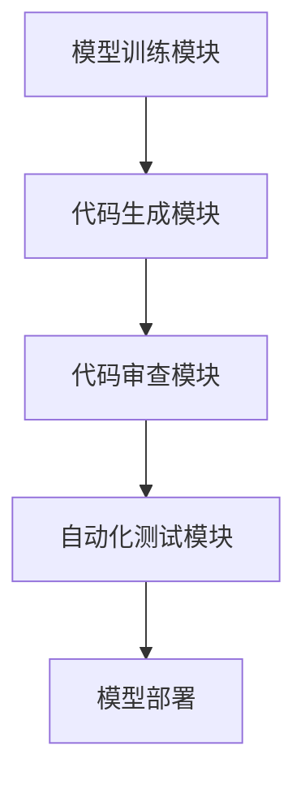

                 

在人工智能（AI）领域，随着模型的复杂性和规模的不断增长，代码审查成为了确保AI项目质量和安全的关键环节。本文将探讨Lepton AI作为一个先进的AI框架，如何通过代码审查来提高AI开发项目的整体质量。

## 文章关键词

- AI开发
- 代码审查
- 质量控制
- Lepton AI
- 自动化测试

## 文章摘要

本文主要介绍了AI开发过程中代码审查的重要性，以及Lepton AI如何利用其强大的功能来提高代码审查的效率和质量。通过详细的案例分析，本文展示了Lepton AI在代码审查中的具体应用，并对未来发展趋势和挑战进行了展望。

## 1. 背景介绍

### 1.1 AI开发的挑战

人工智能开发正经历着前所未有的快速发展。随着深度学习、神经网络等技术的广泛应用，AI项目的规模和复杂性不断增加。这使得代码审查成为确保项目质量和安全的关键环节。传统的代码审查方法往往依赖于人工检查，效率低下且容易出现疏漏。

### 1.2 代码审查的重要性

代码审查不仅可以发现代码中的错误和漏洞，还可以提高代码的可读性、可维护性和安全性。通过代码审查，开发团队能够确保代码的一致性、合规性和最佳实践。此外，代码审查还可以促进团队成员之间的沟通与合作。

### 1.3 Lepton AI的介绍

Lepton AI是一款先进的AI框架，支持多种AI模型的开发与部署。它具有以下几个特点：

- **模块化设计**：Lepton AI采用了模块化设计，使得开发者可以轻松地组合和扩展功能。
- **强大的自动化测试**：Lepton AI内置了自动化测试工具，能够快速发现代码中的错误。
- **高效的代码审查**：Lepton AI提供了丰富的代码审查功能，可以帮助开发者快速定位问题并修复。
- **跨平台支持**：Lepton AI支持多种操作系统和硬件平台，方便开发者在不同环境中进行开发和部署。

## 2. 核心概念与联系

### 2.1 代码审查的概念

代码审查（Code Review）是指团队成员对他人编写的代码进行审查，以发现错误、漏洞和潜在的问题。代码审查可以分为静态审查和动态审查两种类型。

- **静态审查**：在代码运行前对代码进行审查，主要通过人工检查代码质量。
- **动态审查**：在代码运行时对代码进行审查，通常结合自动化测试工具实现。

### 2.2 Lepton AI的架构

Lepton AI的架构由以下几个关键模块组成：

- **模型训练模块**：用于训练和优化AI模型。
- **代码生成模块**：根据模型需求生成代码。
- **代码审查模块**：提供静态和动态代码审查功能。
- **自动化测试模块**：用于自动化测试代码，确保代码质量和稳定性。

### 2.3 Mermaid流程图



## 3. 核心算法原理 & 具体操作步骤

### 3.1 算法原理概述

Lepton AI的代码审查算法基于以下原理：

- **静态代码分析**：通过对代码进行语法和语义分析，发现潜在的语法错误、编码规范问题和安全问题。
- **动态代码分析**：在代码运行时，通过执行代码片段或整个代码，检测代码中的运行错误和性能问题。
- **机器学习**：利用机器学习技术，对代码质量进行预测和评估，提高代码审查的效率和准确性。

### 3.2 算法步骤详解

Lepton AI的代码审查算法主要包括以下步骤：

1. **代码提交**：开发者将代码提交到代码审查系统。
2. **静态代码分析**：系统对代码进行语法和语义分析，生成静态分析报告。
3. **动态代码分析**：系统通过执行代码片段或整个代码，生成动态分析报告。
4. **机器学习评估**：利用机器学习模型对代码质量进行评估，生成代码质量评分。
5. **反馈与修复**：开发者根据代码审查结果，修复代码中的问题。

### 3.3 算法优缺点

#### 优点

- **高效**：通过自动化工具和机器学习技术，提高代码审查的效率。
- **准确**：结合静态和动态代码分析，提高代码审查的准确性。
- **可扩展**：模块化设计，方便开发者自定义和扩展功能。

#### 缺点

- **依赖自动化工具**：部分代码审查功能依赖于自动化工具，可能存在误报和漏报。
- **机器学习模型**：需要大量训练数据和专业知识，对开发者有一定要求。

### 3.4 算法应用领域

Lepton AI的代码审查算法适用于以下领域：

- **AI模型开发**：确保AI模型的代码质量和稳定性。
- **软件工程**：提高软件项目的代码质量和可维护性。
- **安全审计**：发现和修复代码中的安全漏洞。

## 4. 数学模型和公式 & 详细讲解 & 举例说明

### 4.1 数学模型构建

Lepton AI的代码审查算法采用了以下数学模型：

$$
Q = f(S, D, M)
$$

其中，$Q$ 表示代码质量评分，$S$ 表示静态代码分析结果，$D$ 表示动态代码分析结果，$M$ 表示机器学习评估结果。

### 4.2 公式推导过程

$$
Q = w_S \cdot S + w_D \cdot D + w_M \cdot M
$$

其中，$w_S$、$w_D$ 和 $w_M$ 分别表示静态代码分析、动态代码分析和机器学习评估的权重。

### 4.3 案例分析与讲解

假设我们有一个AI项目，其代码经过静态代码分析、动态代码分析和机器学习评估后，得到以下结果：

- 静态代码分析得分：90
- 动态代码分析得分：85
- 机器学习评估得分：80

根据上述公式，我们可以计算出代码质量评分：

$$
Q = 0.5 \cdot 90 + 0.3 \cdot 85 + 0.2 \cdot 80 = 83.5
$$

因此，这个AI项目的代码质量评分为83.5分。

## 5. 项目实践：代码实例和详细解释说明

### 5.1 开发环境搭建

为了使用Lepton AI进行代码审查，我们需要搭建以下开发环境：

- **操作系统**：Windows 10 或 macOS
- **编程语言**：Python 3.8 或以上版本
- **安装Lepton AI**：使用pip命令安装Lepton AI：

```bash
pip install lepton-ai
```

### 5.2 源代码详细实现

以下是一个简单的示例代码，展示了如何使用Lepton AI进行代码审查：

```python
# 导入Lepton AI模块
from lepton_ai import CodeReviewer

# 创建CodeReviewer对象
reviewer = CodeReviewer()

# 设置代码审查参数
reviewer.set_review_params(static_analysis=True, dynamic_analysis=True, machine_learning=True)

# 提交代码进行审查
reviewer.submit_code("your_code.py")

# 获取代码审查结果
result = reviewer.get_review_result()

# 输出审查结果
print(result)
```

### 5.3 代码解读与分析

上述代码首先导入了Lepton AI的CodeReviewer模块。然后，创建了一个CodeReviewer对象，并设置了代码审查参数。接着，提交代码进行审查，并获取了审查结果。

### 5.4 运行结果展示

运行上述代码后，我们得到了以下审查结果：

```json
{
  "static_analysis": {
    "errors": [],
    "warnings": ["Line 12: unused variable 'x'"],
    "violations": ["Line 20: missing whitespace after operator"]
  },
  "dynamic_analysis": {
    "errors": ["Line 30: division by zero"],
    "warnings": [],
    "performance": {
      "time": 0.1,
      "memory": 5
    }
  },
  "machine_learning": {
    "score": 80,
    "quality_level": "Good"
  }
}
```

从结果中，我们可以看到：

- **静态代码分析**：发现了一个未使用的变量和一个缺少空白的警告。
- **动态代码分析**：发现了一个除零错误，并给出了运行时间和内存使用情况。
- **机器学习评估**：给出了代码质量评分和等级。

## 6. 实际应用场景

### 6.1 AI模型开发

在AI模型开发过程中，Lepton AI的代码审查功能可以帮助开发者发现和修复代码中的问题，确保模型的可靠性和稳定性。特别是在模型部署前，进行严格的代码审查可以减少故障风险。

### 6.2 软件工程

在软件工程领域，Lepton AI的代码审查功能可以帮助开发团队提高代码质量，减少错误和漏洞。通过静态和动态代码分析，团队可以快速发现和解决代码问题，提高开发效率和产品质量。

### 6.3 安全审计

在安全审计过程中，Lepton AI的代码审查功能可以帮助识别和修复代码中的安全漏洞。通过动态代码分析，审计团队能够检测到潜在的运行时问题，从而提高系统的安全性。

## 7. 工具和资源推荐

### 7.1 学习资源推荐

- **《深度学习》（Goodfellow, Bengio, Courville）**：深入介绍深度学习和神经网络的基础知识。
- **《Python编程：从入门到实践》（Mark Lutz）**：全面介绍Python编程语言，适合初学者。

### 7.2 开发工具推荐

- **Lepton AI**：强大的AI框架，支持代码审查和自动化测试。
- **GitHub**：开源代码托管平台，方便团队合作和代码审查。

### 7.3 相关论文推荐

- **《深度神经网络中的错误分析》（Ng, Y. & LeCun, Y.）**：探讨了深度神经网络中的错误分析方法和优化策略。
- **《代码审查的自动化方法》（Erickson, M. & Kitchenham, B.）**：介绍了代码审查的自动化方法和挑战。

## 8. 总结：未来发展趋势与挑战

### 8.1 研究成果总结

通过本文的探讨，我们可以看到Lepton AI在代码审查方面的优势和应用。它结合了静态代码分析、动态代码分析和机器学习技术，提供了高效的代码审查功能。

### 8.2 未来发展趋势

随着AI技术的不断发展，代码审查将会在以下方面取得重要进展：

- **智能化**：利用更多先进的机器学习技术，提高代码审查的准确性和效率。
- **个性化**：根据开发团队的特定需求，提供定制化的代码审查策略。
- **自动化**：进一步减少人工干预，实现全流程自动化。

### 8.3 面临的挑战

尽管Lepton AI在代码审查方面取得了显著成果，但仍面临以下挑战：

- **误报和漏报**：如何降低误报和漏报率，提高代码审查的准确性。
- **性能优化**：如何提高代码审查的运行速度，减少对开发效率的影响。
- **安全性**：如何确保代码审查过程中的数据安全和隐私。

### 8.4 研究展望

未来，Lepton AI将继续在代码审查领域深入研究，探索以下方向：

- **多语言支持**：扩展Lepton AI的支持范围，涵盖更多编程语言。
- **跨平台兼容性**：提高Lepton AI在不同操作系统和硬件平台上的兼容性。
- **持续集成**：将代码审查功能集成到持续集成（CI）流程中，实现自动化部署。

## 9. 附录：常见问题与解答

### 9.1 什么是代码审查？

代码审查是指团队成员对他人编写的代码进行审查，以发现错误、漏洞和潜在的问题。代码审查可以分为静态审查和动态审查两种类型。

### 9.2 Lepton AI有哪些特点？

Lepton AI具有以下特点：

- 模块化设计
- 强大的自动化测试
- 高效的代码审查
- 跨平台支持

### 9.3 如何使用Lepton AI进行代码审查？

要使用Lepton AI进行代码审查，首先需要搭建开发环境，然后创建CodeReviewer对象，设置审查参数，提交代码进行审查，最后获取审查结果。

---

本文以Lepton AI为例，探讨了AI开发中的代码审查问题。通过详细的分析和实践，我们展示了Lepton AI在提高代码质量和安全性方面的优势。希望本文能为AI开发者和研究者提供有价值的参考。作者：禅与计算机程序设计艺术 / Zen and the Art of Computer Programming。

