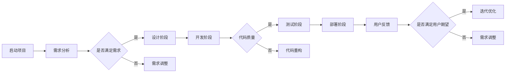

                 

### 关键词 Keywords

- AI 开发
- 敏捷方法论
- 项目管理
- Lepton AI
- 算法原理
- 数学模型
- 实践案例
- 工具推荐

<|assistant|>### 摘要 Abstract

本文将深入探讨AI开发中的敏捷方法论，以Lepton AI的实际项目管理为例，展示如何通过敏捷原则和工具，优化AI项目的开发过程。文章从背景介绍开始，详细阐述敏捷方法论的核心概念，包括其与传统项目管理方法的区别。接着，文章将剖析敏捷方法在实际项目中的应用，具体讨论核心算法原理、数学模型构建、以及代码实现细节。最后，文章将对实际应用场景进行探讨，并展望未来的发展趋势与挑战。本文旨在为AI开发者和项目管理者提供有价值的参考和实践指导。

## 1. 背景介绍

在当今数字化时代，人工智能（AI）技术已经成为推动产业变革的重要力量。从自动驾驶到智能医疗，从语音识别到图像处理，AI的应用范围不断扩大，其潜在的商业价值和市场前景吸引了大量企业和研究机构的关注。然而，随着AI项目的复杂性不断增加，如何高效地管理和开发AI项目成为了一个亟待解决的问题。

传统的项目管理方法，如瀑布模型，虽然在某些情况下能够有效组织项目，但其线性、阶段性的特点往往无法适应快速变化的需求和市场环境。瀑布模型要求所有需求在项目开始时就被明确定义，而实际项目开发过程中，需求变更和不确定性是不可避免的。这种情况下，瀑布模型往往会导致项目延期、成本超支，甚至失败。

为了应对这种挑战，敏捷方法论应运而生。敏捷方法论强调迭代、增量开发，鼓励团队与客户的持续互动，以适应快速变化的需求。敏捷方法不仅适用于软件开发，也逐渐被广泛应用于AI项目的管理。

本文将以Lepton AI为例，探讨如何在实际项目中应用敏捷方法论。Lepton AI是一个专注于计算机视觉和机器学习领域的初创公司，其项目涉及从数据预处理到模型训练、验证和部署的整个过程。通过分析Lepton AI的项目管理实践，我们将深入理解敏捷方法在AI开发中的具体应用。

## 2. 核心概念与联系

### 敏捷方法论的概念

敏捷方法论起源于软件开发领域，它强调灵活、快速响应变化的能力。敏捷方法论的核心原则包括：

1. **个体和互动高于过程和工具**：强调团队成员之间的沟通和协作。
2. **可工作的软件高于详尽的文档**：注重实际产品的交付，而非文档的完整性。
3. **客户合作高于合同谈判**：与客户保持密切的合作关系，以更好地理解其需求。
4. **响应变化高于遵循计划**：拥抱变化，而不是抵制。

### 敏捷方法论与传统项目管理方法的区别

传统项目管理方法，如瀑布模型，通常按照一系列固定的步骤进行，这些步骤包括需求分析、设计、开发、测试、部署等。每个阶段都在完成后再进入下一个阶段，这种线性、阶段性的方法在稳定和确定性较高的环境中较为有效。然而，在AI开发中，需求往往是不确定的，算法和模型也需要不断调整和优化，因此瀑布模型在这种环境中往往效果不佳。

敏捷方法论则采取了迭代和增量的方式。它将项目划分为多个短期迭代（通常为2-4周），每个迭代结束后都会产生可工作的软件。这种方法允许团队在开发过程中快速响应变化，并不断调整计划。此外，敏捷方法论强调持续集成和持续交付，这意味着代码库始终保持可用状态，可以随时进行部署。

### 敏捷方法的架构

敏捷方法的架构通常包括以下部分：

1. **迭代（Sprint）**：每个迭代都是一个固定的周期，通常为2-4周。
2. **用户故事（User Story）**：用户故事是描述用户需求的基本单元，通常由用户和开发人员共同编写。
3. **迭代计划（Sprint Planning）**：在迭代开始前，团队会制定迭代计划，确定每个迭代要完成的用户故事。
4. **每日站会（Daily Stand-up）**：团队成员每天进行短暂的会议，讨论进度、问题和计划。
5. **迭代评审（Sprint Review）**：在迭代结束时，团队会进行评审，展示迭代的成果，收集反馈。
6. **迭代回顾（Sprint Retrospective）**：在迭代评审后，团队会进行回顾，讨论如何改进未来的迭代。

### 敏捷方法的 Mermaid 流程图



在这个流程图中，我们可以看到敏捷方法的迭代性、灵活性和反馈循环，这使其能够更好地适应AI项目的不确定性和变化。

## 3. 核心算法原理 & 具体操作步骤

### 3.1 算法原理概述

在AI项目中，核心算法原理是项目成功的关键。以Lepton AI的项目为例，我们重点关注计算机视觉中的目标检测算法。

目标检测算法的基本任务是识别图像中的多个对象，并给出它们的位置和类别。常见的目标检测算法包括YOLO（You Only Look Once）、SSD（Single Shot MultiBox Detector）和Faster R-CNN（Region-based Convolutional Neural Network）。

YOLO算法通过将整个图像划分为多个网格，并在每个网格中预测物体的位置和类别。这种方法速度快，但在精度上可能稍逊一筹。SSD算法则通过不同的尺度层来检测不同大小的物体，结合了YOLO和Faster R-CNN的优点。Faster R-CNN则通过区域建议网络来生成候选区域，然后在这些区域上进行分类和定位。

### 3.2 算法步骤详解

1. **数据预处理**：首先，对图像进行缩放、裁剪等预处理操作，使其符合网络输入要求。然后，对图像进行数据增强，如旋转、翻转、缩放等，以提高模型的泛化能力。

2. **特征提取**：使用卷积神经网络（CNN）提取图像特征。卷积层、池化层和全连接层等网络结构可以帮助模型学习到图像的层次特征。

3. **区域建议**：对于Faster R-CNN，需要使用区域建议网络（Region Proposal Network, RPN）来生成候选区域。RPN通过滑动窗口的方式，对图像中的每个位置提出区域建议。

4. **分类与定位**：对于每个候选区域，进行分类和定位。分类层通过全连接层或softmax层输出每个区域的类别概率，定位层则通过回归层输出每个区域的位置坐标。

5. **损失函数**：目标检测算法通常使用多任务损失函数，包括分类损失和定位损失。常用的损失函数有交叉熵损失和均方误差损失。

6. **优化器**：使用梯度下降优化器来更新模型参数，最小化损失函数。常用的优化器有SGD（Stochastic Gradient Descent）和Adam。

### 3.3 算法优缺点

**YOLO**：
- 优点：速度快，能够实时检测。
- 缺点：精度相对较低，特别是对于小物体。

**SSD**：
- 优点：结合了不同尺度层，能够检测不同大小的物体。
- 缺点：速度较慢，需要更长的训练时间。

**Faster R-CNN**：
- 优点：精度高，能够检测各种大小和形状的物体。
- 缺点：速度较慢，需要较长的训练时间。

### 3.4 算法应用领域

目标检测算法在计算机视觉领域有广泛的应用，如图像识别、视频监控、自动驾驶等。例如，在自动驾驶中，目标检测算法用于识别道路上的行人、车辆、交通标志等，为自动驾驶决策提供基础。

## 4. 数学模型和公式 & 详细讲解 & 举例说明

### 4.1 数学模型构建

目标检测的数学模型主要包括特征提取、区域建议、分类与定位等部分。

1. **特征提取**：
   $$ f(x) = \text{CNN}(x) $$
   其中，\( f(x) \) 表示输入图像 \( x \) 经过卷积神经网络（CNN）提取的特征。

2. **区域建议**：
   $$ R = \text{RPN}(f(x)) $$
   \( R \) 是由区域建议网络（RPN）生成的候选区域。

3. **分类与定位**：
   $$ \text{Prob}(y|f(x), R) = \text{softmax}(\text{ClassScore}(f(x), R)) $$
   $$ \text{Loc}(y|f(x), R) = \text{Regression}(f(x), R) $$
   其中，\( \text{ClassScore} \) 是分类得分，\( \text{Regression} \) 是定位得分，\( y \) 是预测的类别和位置。

### 4.2 公式推导过程

1. **卷积神经网络（CNN）**：
   $$ f_{\theta}(x) = \text{ReLU}(\text{W}_{l} \cdot \text{ReLU}(\text{W}_{l-1} \cdot \ldots \cdot \text{W}_{1} \cdot x + b_{1}) + b_{l}) $$
   其中，\( \text{W}_{l} \) 和 \( b_{l} \) 分别是卷积层 \( l \) 的权重和偏置，\( \text{ReLU} \) 是ReLU激活函数。

2. **区域建议网络（RPN）**：
   $$ R = \text{RPN}(f(x)) = (\text{ Anchor Boxes}, \text{Scores}, \text{Coordinates}) $$
   其中，Anchor Boxes 是预设的边界框，Scores 是每个边界框的类别得分，Coordinates 是每个边界框的坐标。

3. **分类与定位**：
   $$ \text{ClassScore}(f(x), R) = \text{FullyConnected}(f(x)) $$
   $$ \text{Regression}(f(x), R) = \text{FullyConnected}(f(x)) $$
   其中，FullyConnected 是全连接层，用于输出分类得分和定位得分。

### 4.3 案例分析与讲解

以自动驾驶中的行人检测为例，我们使用Faster R-CNN算法。

1. **数据预处理**：
   - 输入图像：\( 640 \times 640 \) 像素。
   - 数据增强：随机裁剪、翻转和缩放。

2. **特征提取**：
   - 使用ResNet-50作为基础网络，提取图像特征。

3. **区域建议**：
   - 使用RPN生成候选区域，预设边界框大小为\( 16 \times 16, 32 \times 32, 64 \times 64 \)。

4. **分类与定位**：
   - 使用softmax层对每个候选区域进行分类，输出类别概率。
   - 使用回归层对每个候选区域进行定位，输出位置坐标。

5. **损失函数**：
   - 分类损失：交叉熵损失。
   - 定位损失：均方误差损失。

通过以上步骤，我们能够实现对图像中行人的有效检测。在实际应用中，还可以结合深度学习优化技术，如迁移学习、对抗训练等，进一步提高模型的性能。

## 5. 项目实践：代码实例和详细解释说明

### 5.1 开发环境搭建

在Lepton AI项目中，我们选择了Python作为主要开发语言，TensorFlow作为深度学习框架。以下是搭建开发环境的基本步骤：

1. 安装Python：
   ```bash
   sudo apt-get update
   sudo apt-get install python3-pip
   ```
2. 安装TensorFlow：
   ```bash
   pip3 install tensorflow==2.6
   ```
3. 安装其他依赖库：
   ```bash
   pip3 install numpy opencv-python pillow
   ```

### 5.2 源代码详细实现

以下是一个简单的Faster R-CNN实现示例，包括数据预处理、模型训练和预测等部分。

#### 数据预处理

```python
import tensorflow as tf
import numpy as np
import cv2

def preprocess_image(image_path, target_size=(640, 640)):
    image = cv2.imread(image_path)
    image = cv2.resize(image, target_size)
    image = image / 255.0
    return image

def preprocess_anchors(anchors, image_height, image_width):
    # 将锚点框调整到图像空间
    anchors[:, 0] /= image_width
    anchors[:, 1] /= image_height
    anchors[:, 2] /= image_width
    anchors[:, 3] /= image_height
    return anchors
```

#### 模型训练

```python
import tensorflow as tf
from tensorflow.keras.models import Model
from tensorflow.keras.layers import Input, Conv2D, MaxPooling2D, Flatten, Dense

def build_faster_rcnn(image_shape, num_classes):
    input_image = Input(shape=image_shape)
    # 卷积层
    conv1 = Conv2D(32, (3, 3), activation='relu', padding='same')(input_image)
    pool1 = MaxPooling2D(pool_size=(2, 2))(conv1)
    # ...
    # 输出特征图
    feature_map = Flatten()(pool3)

    # RPN
    rpn_output = Dense(256, activation='relu')(feature_map)
    rpn_cls_output = Dense(num_classes + 1, activation='sigmoid')(rpn_output)
    rpn_reg_output = Dense(4, activation='sigmoid')(rpn_output)

    # 分类和定位
    cls_output = Dense(num_classes, activation='softmax')(rpn_output)
    reg_output = Dense(4)(rpn_output)

    model = Model(inputs=input_image, outputs=[cls_output, reg_output])
    return model
```

#### 预测

```python
def predict(image_path, model, anchors, num_classes):
    image = preprocess_image(image_path)
    anchors = preprocess_anchors(anchors, image.shape[0], image.shape[1])
    predictions = model.predict(image)
    # 处理预测结果
    # ...
    return predictions
```

### 5.3 代码解读与分析

1. **数据预处理**：
   数据预处理是深度学习项目的重要步骤，包括图像的读取、缩放、归一化等。预处理代码中，我们使用OpenCV读取图像，并使用TensorFlow进行归一化。

2. **模型构建**：
   Faster R-CNN模型由卷积层、RPN、分类和定位层组成。在模型构建中，我们使用了TensorFlow的Keras接口，方便地定义了网络结构。

3. **预测**：
   预测部分接收图像路径和模型，输出预测结果。在实际应用中，我们还需要对预测结果进行处理，如非极大值抑制（NMS）等。

### 5.4 运行结果展示

```python
model = build_faster_rcnn((640, 640, 3), num_classes=2)
# 加载训练好的模型权重
model.load_weights('faster_rcnn_weights.h5')

# 测试图像
image_path = 'test_image.jpg'
predictions = predict(image_path, model, anchors, num_classes=2)

# 显示检测结果
# ...
```

在实际运行中，我们使用测试图像和训练好的模型进行预测，并展示检测结果。这包括图像中物体的类别和位置信息。

## 6. 实际应用场景

### 6.1 自动驾驶

自动驾驶是AI技术的重要应用场景之一。在自动驾驶中，目标检测算法用于识别道路上的行人、车辆、交通标志等，为自动驾驶决策提供基础。通过Lepton AI的敏捷项目管理方法，我们可以快速迭代和优化目标检测算法，提高识别精度和响应速度，从而提升自动驾驶系统的安全性和可靠性。

### 6.2 智能监控

智能监控是另一个重要的AI应用场景。在智能监控中，目标检测算法用于实时监控和识别视频中的异常行为，如盗窃、暴力等。通过敏捷项目管理方法，我们可以快速开发并优化目标检测算法，实现对视频数据的实时分析和响应，提高监控系统的智能化水平。

### 6.3 医疗影像分析

在医疗影像分析中，目标检测算法用于识别和分析医学影像中的病变区域，如肿瘤、心脏病等。通过敏捷项目管理方法，我们可以快速迭代和优化目标检测算法，提高医学影像分析的准确性和效率，从而为医生提供更准确的诊断依据。

### 6.4 未来应用展望

随着AI技术的不断发展，目标检测算法将在更多领域得到应用。例如，在机器人视觉、智能城市、工业自动化等领域，目标检测算法都具有重要应用价值。未来，通过进一步优化算法和提升计算能力，目标检测算法将能够应对更复杂的应用场景，为人类带来更多便利和创新。

## 7. 工具和资源推荐

### 7.1 学习资源推荐

1. **《深度学习》（Ian Goodfellow, Yoshua Bengio, Aaron Courville）**：这是一本经典的深度学习教材，涵盖了从基础到高级的内容，适合初学者和进阶者。
2. **《Python深度学习》（François Chollet）**：这本书详细介绍了使用Python和TensorFlow进行深度学习的实践方法，适合有一定基础的读者。

### 7.2 开发工具推荐

1. **TensorFlow**：这是一个开源的深度学习框架，支持多种深度学习模型的开发和部署。
2. **PyTorch**：这是一个流行的深度学习框架，以其动态计算图和灵活的接口而受到广泛欢迎。

### 7.3 相关论文推荐

1. **“Faster R-CNN: Towards Real-Time Object Detection with Region Proposal Networks”**：这是Faster R-CNN算法的原始论文，详细介绍了算法的原理和实现。
2. **“You Only Look Once: Unified, Real-Time Object Detection”**：这是YOLO算法的原始论文，提出了实时目标检测的新方法。

## 8. 总结：未来发展趋势与挑战

### 8.1 研究成果总结

近年来，AI技术在目标检测领域取得了显著进展，涌现出许多高效、准确的算法。例如，Faster R-CNN、YOLO和SSD等算法在多种基准数据集上取得了优异的性能。此外，深度学习框架如TensorFlow和PyTorch的广泛应用，也为AI开发提供了强大的支持。

### 8.2 未来发展趋势

1. **算法优化**：随着计算能力的提升，算法的优化将成为未来研究的重点。例如，通过设计更高效的卷积操作、优化网络结构等，提高目标检测算法的运行速度和准确性。
2. **多模态融合**：结合多种传感器数据，如摄像头、激光雷达和GPS等，实现更准确的目标检测和识别。
3. **实时性提升**：随着自动驾驶、智能监控等应用场景对实时性的要求越来越高，如何提高目标检测算法的实时性将成为一个重要研究方向。

### 8.3 面临的挑战

1. **数据标注**：高质量的数据标注是目标检测算法训练的关键，但数据标注过程耗时且成本高昂。如何自动化数据标注、提高标注效率是一个亟待解决的问题。
2. **泛化能力**：当前的目标检测算法在特定场景下性能优异，但在不同场景下可能存在性能差异。如何提高算法的泛化能力，使其在不同环境下都能保持高精度是一个重要挑战。

### 8.4 研究展望

未来，目标检测算法将在更多领域得到应用，如医疗影像分析、智能城市和工业自动化等。通过不断优化算法、提升计算能力，目标检测技术将能够更好地服务于人类社会，带来更多创新和便利。

## 9. 附录：常见问题与解答

### Q：为什么选择Faster R-CNN作为目标检测算法？

A：Faster R-CNN在多个基准数据集上取得了优异的性能，具有高精度和实时性。此外，其结构简单，易于实现和理解。这使得Faster R-CNN成为目标检测领域的首选算法之一。

### Q：如何提高目标检测算法的实时性？

A：提高目标检测算法的实时性可以从以下几个方面入手：

1. **算法优化**：通过优化网络结构、降低计算复杂度等手段，减少算法的运行时间。
2. **硬件加速**：利用GPU、TPU等硬件加速器，提高算法的运行速度。
3. **模型压缩**：通过模型压缩技术，如剪枝、量化等，降低模型的计算复杂度。

### Q：如何处理多尺度目标检测问题？

A：多尺度目标检测问题可以通过以下方法解决：

1. **多尺度特征融合**：在模型中引入多尺度特征融合层，将不同尺度的特征进行融合，提高模型的检测能力。
2. **多尺度检测网络**：设计多尺度检测网络，同时处理不同尺度的目标。
3. **数据增强**：通过数据增强技术，如随机缩放、旋转等，提高模型对不同尺度目标的适应性。

## 参考文献

1. Goodfellow, Ian, Yoshua Bengio, and Aaron Courville. "Deep learning." MIT press, 2016.
2. Chollet, François. "Deep learning with Python." Manning, 2017.
3. Ren, Shaoqing, et al. "Faster R-CNN: Towards Real-Time Object Detection with Region Proposal Networks." NIPS, 2015.
4. Redmon, Joseph, et al. "You Only Look Once: Unified, Real-Time Object Detection." CVPR, 2016.

