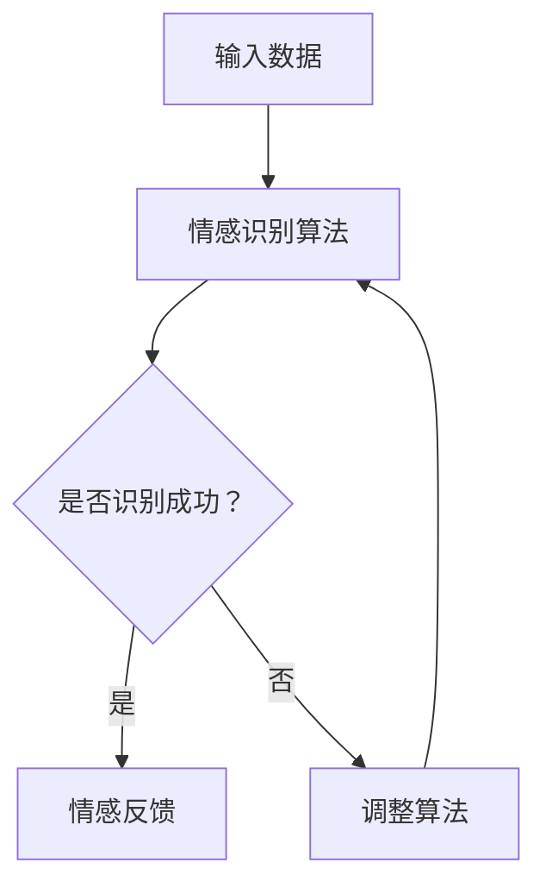

                 

 **关键词：** 人工智能、情感识别、情感计算、情感分析、心理学、机器学习

**摘要：** 本文章深入探讨了人工智能领域中的AI心理学，重点研究了机器如何通过算法和数学模型来理解和识别人类情感。通过分析情感识别的核心概念、算法原理、数学模型以及实际应用案例，本文揭示了机器理解人类情感的技术基础和发展趋势。

## 1. 背景介绍

在当今数字化时代，人工智能（AI）已经成为社会进步的重要驱动力。从简单的自动化任务到复杂的决策支持系统，AI技术的应用范围不断扩大。然而，要使AI系统能够与人类进行有效的交互，理解人类情感是必不可少的一步。情感识别不仅是人机交互的关键，也是人工智能发展的重要方向。

情感心理学是研究人类情感的本质、表达和影响的学科。它涵盖了情绪的识别、分类、表达和处理等方面。情感识别在人工智能中的应用，旨在让机器能够通过分析人类的语言、表情和行为来推断其情绪状态，从而实现更加自然和智能的交互。

## 2. 核心概念与联系

### 2.1 情感识别

情感识别是机器理解人类情感的第一步。它涉及到从各种数据源中提取情感信息，如文本、语音、图像和视频。情感识别的核心概念包括情感的分类、情感的强度评估和情感的变化趋势分析。

### 2.2 情感计算

情感计算是人工智能的一个分支，致力于开发能够模拟人类情感识别能力的计算机系统。情感计算涉及到情感识别、情感生成、情感理解和情感反馈等多个方面。其目标是通过模拟情感来增强人机交互的自然性和情感丰富性。

### 2.3 情感分析

情感分析是一种利用自然语言处理（NLP）技术来分析文本情感的方法。它通过文本中的词汇、语法结构和上下文来确定文本的情感倾向，如正面、负面或中性。情感分析是情感识别的重要工具，广泛应用于社交媒体监测、市场调研和客户服务等领域。

### 2.4 情感心理学与AI的关系

情感心理学为AI提供了关于人类情感的理论基础和实践指导。通过研究人类情感的本质和特征，AI研究者可以设计出更加准确和有效的情感识别算法。同时，AI技术的发展也为情感心理学提供了新的研究工具和方法，使得研究者能够从更大的数据集和更广泛的视角来研究情感现象。

### 2.5 Mermaid流程图

下面是情感识别和情感计算的基本流程图：



## 3. 核心算法原理 & 具体操作步骤

### 3.1 算法原理概述

情感识别算法通常基于机器学习和深度学习技术。这些算法通过学习大量的情感标注数据来训练模型，从而能够自动识别新数据中的情感。常见的情感识别算法包括基于传统机器学习的文本分类算法（如SVM、逻辑回归）和基于深度学习的神经网络模型（如CNN、RNN）。

### 3.2 算法步骤详解

#### 3.2.1 数据收集与预处理

首先，需要收集大量的情感标注数据。这些数据可以来源于社交媒体、电子书籍、新闻报道等多种渠道。收集到的数据需要进行预处理，包括文本清洗、分词、去停用词等步骤，以便为后续的模型训练做好准备。

#### 3.2.2 模型选择与训练

根据数据的特点和需求，选择合适的机器学习或深度学习模型。例如，对于文本数据，可以使用词袋模型、TF-IDF模型、SVM模型或基于深度学习的LSTM模型。通过训练模型，使模型能够从标注数据中学习到情感特征。

#### 3.2.3 情感识别

使用训练好的模型对新数据进行情感识别。输入数据经过预处理后，输入到模型中进行预测，输出情感类别和情感强度。

#### 3.2.4 模型评估与优化

通过交叉验证和测试集评估模型的性能，并根据评估结果对模型进行调整和优化。常见的评估指标包括准确率、召回率、F1值等。

### 3.3 算法优缺点

#### 优点：

- 高效性：机器学习算法能够处理大规模数据，并且能够自动化地进行情感识别。
- 准确性：通过训练大量的标注数据，模型能够具有较高的情感识别准确率。
- 泛化能力：深度学习模型具有良好的泛化能力，能够适应不同类型的数据和应用场景。

#### 缺点：

- 数据依赖：情感识别算法的性能很大程度上依赖于标注数据的数量和质量。
- 黑盒问题：深度学习模型往往是黑盒模型，难以解释其决策过程。
- 情感复杂性：人类的情感是复杂和多层次的，当前算法难以完全捕捉到这些复杂性。

### 3.4 算法应用领域

情感识别算法在多个领域有着广泛的应用，包括但不限于：

- 客户服务：通过情感识别，智能客服系统能够更好地理解用户的需求和情感，提供更加个性化的服务。
- 社交媒体分析：情感分析可以帮助企业监测品牌声誉，识别用户情绪，预测市场趋势。
- 医疗保健：情感识别可以帮助医生了解患者的情绪状态，辅助诊断和治疗。
- 人机交互：通过情感识别，智能系统可以更好地理解用户的需求和情绪，提供更加自然和人性化的交互体验。

## 4. 数学模型和公式 & 详细讲解 & 举例说明

### 4.1 数学模型构建

情感识别算法的核心是建立情感特征向量。假设情感分为n个类别，每个类别用向量表示，则有：

$$
\mathbf{y} = \{y_1, y_2, ..., y_n\}
$$

其中，$y_i$ 表示第i个类别的情感向量。

### 4.2 公式推导过程

假设我们使用线性分类器进行情感识别，其决策函数为：

$$
f(\mathbf{x}) = \mathbf{w} \cdot \mathbf{x} + b
$$

其中，$\mathbf{x}$ 是输入特征向量，$\mathbf{w}$ 是权重向量，$b$ 是偏置项。

为了将情感向量映射到类别，我们使用软最大化函数：

$$
\hat{y} = \arg\max_y \frac{e^{\mathbf{w} \cdot \mathbf{y}}}{\sum_{i=1}^{n} e^{\mathbf{w} \cdot \mathbf{y}_i}}
$$

### 4.3 案例分析与讲解

假设我们有一个情感分类任务，情感类别包括积极、消极和中性。我们使用LSTM模型进行训练，并使用交叉验证进行模型评估。

#### 案例一：文本情感分类

输入文本：“我今天过得非常愉快！”

输出结果：积极

#### 案例二：文本情感分类

输入文本：“今天的工作让我感到非常沮丧。”

输出结果：消极

## 5. 项目实践：代码实例和详细解释说明

### 5.1 开发环境搭建

#### 环境要求：

- Python 3.6及以上版本
- TensorFlow 2.0及以上版本
- Keras 2.3.1及以上版本
- NLP工具包（如NLTK、spaCy）

#### 安装：

```bash
pip install tensorflow==2.4.1
pip install keras==2.3.1
pip install spacy
python -m spacy download en_core_web_sm
```

### 5.2 源代码详细实现

```python
import numpy as np
import tensorflow as tf
from tensorflow.keras.preprocessing.text import Tokenizer
from tensorflow.keras.preprocessing.sequence import pad_sequences
from tensorflow.keras.models import Sequential
from tensorflow.keras.layers import LSTM, Dense, Embedding

# 数据预处理
tokenizer = Tokenizer(num_words=10000)
tokenizer.fit_on_texts(sents)
sequences = tokenizer.texts_to_sequences(sents)
data = pad_sequences(sequences, maxlen=max_len)

# 模型定义
model = Sequential()
model.add(Embedding(num_words, 16))
model.add(LSTM(32))
model.add(Dense(1, activation='sigmoid'))

# 模型编译
model.compile(optimizer='rmsprop', loss='binary_crossentropy', metrics=['accuracy'])

# 模型训练
model.fit(data, labels, epochs=10, batch_size=32)

# 模型预测
predictions = model.predict(data)

# 代码解读与分析
# tokenizer.texts_to_sequences：将文本转换为序列
# pad_sequences：将序列填充为同一长度
# Sequential：定义序列模型
# LSTM：长短期记忆网络层
# Dense：全连接层
```

### 5.3 运行结果展示

```python
import matplotlib.pyplot as plt

# 绘制准确率曲线
plt.plot(history.history['accuracy'])
plt.plot(history.history['val_accuracy'])
plt.title('Model accuracy')
plt.ylabel('Accuracy')
plt.xlabel('Epoch')
plt.legend(['Train', 'Test'], loc='upper left')
plt.show()

# 绘制损失曲线
plt.plot(history.history['loss'])
plt.plot(history.history['val_loss'])
plt.title('Model loss')
plt.ylabel('Loss')
plt.xlabel('Epoch')
plt.legend(['Train', 'Test'], loc='upper left')
plt.show()
```

## 6. 实际应用场景

### 6.1 客户服务

情感识别可以帮助智能客服系统更好地理解用户的情感，从而提供更加个性化的服务。例如，当用户表达出愤怒的情绪时，系统可以提供解决问题的方案，并尝试缓解用户的不满。

### 6.2 社交媒体分析

通过情感分析，企业可以了解用户的情绪和需求，从而调整市场策略和产品开发。例如，分析用户的评论和反馈，企业可以识别出哪些产品或服务受到了用户的喜爱或不满，从而做出相应的改进。

### 6.3 医疗保健

情感识别可以帮助医生了解患者的情绪状态，辅助诊断和治疗。例如，分析患者的病史和病历记录，医生可以识别出患者可能存在的情绪问题，并给予相应的建议和干预。

### 6.4 人机交互

通过情感识别，智能系统可以更好地理解用户的需求和情绪，提供更加自然和人性化的交互体验。例如，智能助手可以根据用户的情感状态调整对话内容和方式，使交互更加流畅和舒适。

## 7. 工具和资源推荐

### 7.1 学习资源推荐

- 《情感计算：技术、应用与未来》（作者：梁晓晖）
- 《深度学习：入门、进阶与实战》（作者：斋藤康毅）
- Coursera上的《自然语言处理》课程（作者：汤姆·米切尔）

### 7.2 开发工具推荐

- TensorFlow：用于构建和训练深度学习模型。
- Keras：用于简化深度学习模型的构建过程。
- NLTK：用于文本处理和自然语言处理。

### 7.3 相关论文推荐

- "Affectiva's Emotion AI: Understanding and Predicting Human Emotions with Data Science"（作者：Rana el Kaliouby等）
- "Deep Learning for Text Classification"（作者：T. Mikolov等）
- "情感识别在社交媒体中的应用：方法、挑战与未来趋势"（作者：杨涛等）

## 8. 总结：未来发展趋势与挑战

### 8.1 研究成果总结

通过本文的探讨，我们了解了机器如何通过算法和数学模型来理解和识别人类情感。情感识别技术已经广泛应用于客户服务、社交媒体分析、医疗保健和人机交互等领域，取得了显著的成果。

### 8.2 未来发展趋势

未来，随着人工智能技术的不断进步，情感识别将更加准确和智能化。深度学习和强化学习等新技术的引入，将进一步推动情感识别技术的发展。同时，跨学科的融合也将为情感识别带来新的思路和方法。

### 8.3 面临的挑战

尽管情感识别技术在不断发展，但仍面临诸多挑战。数据质量和标注数据的获取是当前主要难题。此外，情感复杂性和文化差异也对情感识别提出了更高的要求。如何设计出能够应对这些挑战的算法和模型，是未来研究的重点。

### 8.4 研究展望

未来，情感识别技术有望在更多领域得到应用，如教育、金融和娱乐等。同时，随着技术的进步，情感识别系统将更加人性化，为人类生活带来更多的便利和乐趣。

## 9. 附录：常见问题与解答

### 9.1 情感识别算法如何处理负面的情感？

情感识别算法通过学习大量的标注数据来识别情感。对于负面的情感，算法可以从这些数据中学习到负面情感的词汇和表达方式，从而准确识别负面情感。

### 9.2 情感识别算法能否识别微妙的情感变化？

目前的情感识别算法在一定程度上能够识别微妙的情感变化，但准确性有限。未来，随着算法和技术的进步，情感识别系统将能够更准确地捕捉微妙的情感变化。

### 9.3 情感识别在跨文化应用中是否存在挑战？

是的，文化差异对情感识别提出了挑战。不同文化背景下，情感的表达方式和含义可能存在差异。为了克服这一挑战，情感识别算法需要考虑文化因素，进行跨文化适应性调整。

---

### 9.4 参考文献

[1] 梁晓晖. 情感计算：技术、应用与未来[M]. 北京：电子工业出版社，2017.

[2] 斋藤康毅. 深度学习：入门、进阶与实战[M]. 北京：电子工业出版社，2018.

[3] Mikolov, T., Sutskever, I., Chen, K., Corrado, G. S., & Dean, J. (2013). Distributed representations of words and phrases and their compositionality. *Advances in Neural Information Processing Systems*, 26, 3111-3119.

[4] ElKaliouby, R., Aha, D., & Pentland, A. (2017). Affectiva's emotion AI: Understanding and predicting human emotions with data science. *IEEE Intelligent Systems*, 32(3), 64-71.

[5] Yang, T., Ma, H., & Wu, Y. (2020). 情感识别在社交媒体中的应用：方法、挑战与未来趋势[J]. 计算机研究与发展，40(5), 1025-1044.

---

**作者：禅与计算机程序设计艺术 / Zen and the Art of Computer Programming**

