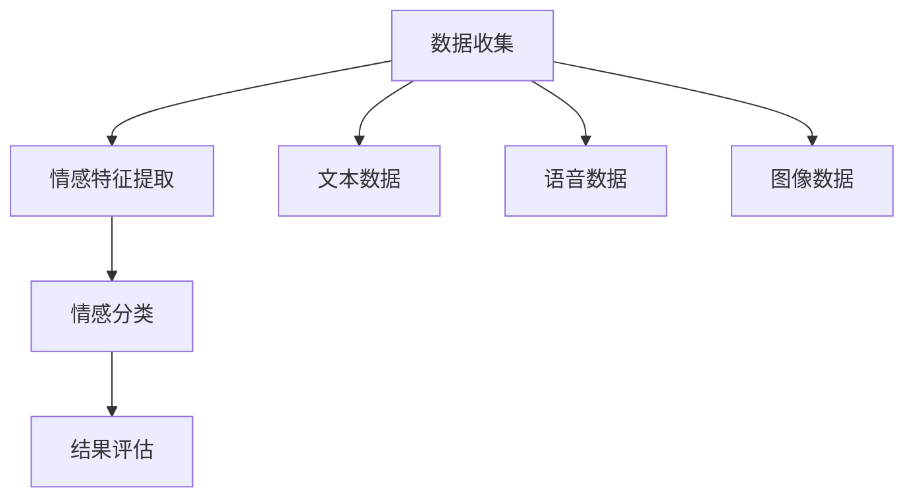

                 

关键词：人工智能，情感识别，机器学习，情感计算，情感心理学

> 摘要：本文将探讨人工智能如何通过机器学习技术和情感计算方法来理解和识别人类情感，从理论到实践提供全面的分析。通过介绍核心概念、算法原理、数学模型以及实际应用案例，我们将揭示机器如何跨越数字世界与人类情感的桥梁，开启未来情感智能的新篇章。

## 1. 背景介绍

人类情感是人类行为和心理状态的重要组成部分，它们在我们日常生活、社交互动、决策过程中扮演着关键角色。然而，情感的表达和解读往往是非线性和复杂的，这使得传统基于规则的计算机系统在处理情感数据时面临巨大挑战。随着人工智能（AI）和机器学习（ML）技术的快速发展，研究者们开始探索如何使机器具备理解和识别人类情感的能力。这一领域的突破将极大推动人机交互的发展，使得智能系统更加自然、贴近人类用户的需求。

### 情感识别的挑战

情感识别涉及从文本、语音、图像等多模态数据中提取情感特征，这是一个高度复杂的问题。首先，情感的表达形式多样，即使是相同的情感，不同人、不同文化背景下的表达方式也会有所不同。其次，情感的动态性使得识别过程需要实时适应情感的变化。此外，传统计算机系统在处理情感数据时缺乏情感理解的能力，无法准确捕捉情感的深度和细微差别。

### 人工智能的发展

近年来，人工智能技术在计算机视觉、自然语言处理、语音识别等领域取得了显著进展。特别是深度学习技术的兴起，使得机器能够通过大量数据学习复杂的模式，从而在一定程度上模拟人类的情感理解能力。这使得机器情感识别成为可能，为人工智能领域带来了新的发展机遇。

## 2. 核心概念与联系

在探讨机器如何理解人类情感之前，我们首先需要了解一些核心概念和它们之间的联系。

### 情感心理学

情感心理学是研究人类情感的产生、表达、理解和调节的学科。它提供了丰富的理论和实证研究，帮助我们理解情感的本质和功能。情感心理学中的关键概念包括情绪状态、情感类别、情感强度和情感持续时间等。

### 情感计算

情感计算是人工智能的一个子领域，专注于开发使计算机能够识别、理解和表达人类情感的技术。情感计算的核心在于情感特征的提取和情感分析的算法设计。情感计算不仅包括情感识别，还涉及情感生成和情感交互等方面。

### 机器学习

机器学习是人工智能的核心技术之一，它使计算机能够通过学习数据来改进性能。在情感识别领域，机器学习算法被广泛应用于情感特征的提取和分类。常用的机器学习算法包括决策树、支持向量机、神经网络等。

### 情感识别的架构

情感识别的架构通常包括数据收集、情感特征提取、情感分类和结果评估等步骤。数据收集涉及文本、语音、图像等不同模态的数据。情感特征提取是对原始数据进行预处理，提取出与情感相关的特征。情感分类是将提取的特征与已知情感类别进行匹配。结果评估用于评估情感识别的准确性和可靠性。

### Mermaid 流程图



## 3. 核心算法原理 & 具体操作步骤

### 3.1 算法原理概述

情感识别算法的核心在于情感特征提取和情感分类。情感特征提取是将原始数据转化为机器可处理的特征向量。情感分类则是利用这些特征向量对情感类别进行预测。下面将详细介绍情感识别算法的具体步骤。

### 3.2 算法步骤详解

#### 3.2.1 数据收集

数据收集是情感识别的基础。通常，数据来源包括社交媒体、电子问卷、语音通话记录等。这些数据需要经过预处理，去除噪声和无关信息。

#### 3.2.2 情感特征提取

情感特征提取是对原始数据进行分析和处理，提取出与情感相关的特征。常见的情感特征包括情感词汇频率、情感强度、情感时长等。

#### 3.2.3 情感分类

情感分类是利用提取的特征对情感类别进行预测。常用的分类算法包括决策树、支持向量机、神经网络等。

#### 3.2.4 结果评估

结果评估用于评估情感识别的准确性和可靠性。常用的评估指标包括准确率、召回率、F1 分数等。

### 3.3 算法优缺点

#### 优点

- **高精度**：情感识别算法能够从大规模数据中提取情感特征，具有较高的识别精度。
- **自动化**：情感识别算法可以自动化地处理大量数据，提高工作效率。
- **多模态**：情感识别算法能够处理多种模态的数据，如文本、语音、图像等，提供更全面的情感分析。

#### 缺点

- **数据依赖性**：情感识别算法的性能依赖于数据的质量和数量，数据不足或质量低下可能导致识别效果不佳。
- **复杂性**：情感识别算法涉及到多个步骤和复杂的模型，开发难度较高。

### 3.4 算法应用领域

情感识别算法广泛应用于人机交互、情绪分析、市场研究等领域。例如，在智能客服中，情感识别算法可以帮助系统更好地理解用户的需求和情绪，提供更贴心的服务。在情绪分析中，情感识别算法可以用于分析社交媒体上的情绪趋势，为市场营销和公共关系提供数据支持。

## 4. 数学模型和公式

### 4.1 数学模型构建

情感识别的数学模型通常基于机器学习算法，如支持向量机（SVM）和神经网络（NN）。以下是一个基于支持向量机的情感识别模型构建过程：

#### 4.1.1 特征提取

设情感数据集为 \(D = \{x_1, x_2, ..., x_n\}\)，其中 \(x_i\) 是一个 \(d\) 维特征向量。特征提取函数 \(F\) 将原始数据 \(x_i\) 转换为特征向量 \(y_i\)：

$$
y_i = F(x_i)
$$

#### 4.1.2 模型训练

支持向量机通过寻找一个超平面，将不同情感类别的特征向量分开。超平面的决策函数为：

$$
f(x) = w \cdot x + b
$$

其中 \(w\) 是权重向量，\(b\) 是偏置项。模型训练的目标是找到最优的权重向量 \(w\) 和偏置项 \(b\)。

#### 4.1.3 模型评估

训练完成后，使用测试数据集 \(T = \{x_1, x_2, ..., x_n\}\) 评估模型的准确性。评估指标包括准确率、召回率、F1 分数等。

### 4.2 公式推导过程

#### 4.2.1 特征提取

特征提取通常涉及文本数据处理，如词袋模型（Bag of Words，BoW）和词嵌入（Word Embedding）。以下是一个基于词袋模型的特征提取过程：

1. 构建词汇表：将文本数据中的所有单词构建为一个词汇表。
2. 转换为向量：将每个文本数据转换为词汇表中的单词出现的频率向量。

#### 4.2.2 模型训练

支持向量机的目标是最小化分类间隔：

$$
J(w, b) = \frac{1}{2} ||w||^2 - C \sum_{i=1}^{n} \max(0, 1 - y_i (w \cdot x_i + b))
$$

其中 \(C\) 是惩罚参数。

#### 4.2.3 模型评估

假设测试数据集 \(T\) 中的样本为 \(x_i\)，其标签为 \(y_i\)。模型的预测概率为：

$$
P(y_i = 1 | x_i) = \frac{1}{1 + \exp(-w \cdot x_i - b)}
$$

模型的准确性为：

$$
accuracy = \frac{1}{n} \sum_{i=1}^{n} I(y_i = 1 \land \hat{y}_i = 1)
$$

### 4.3 案例分析与讲解

假设有一个包含积极和消极情感的数据集，使用支持向量机进行情感识别。经过特征提取和模型训练，得到一个准确率为 90% 的模型。这意味着，对于给定的文本数据，模型能够以 90% 的概率正确识别其情感类别。

## 5. 项目实践：代码实例和详细解释说明

### 5.1 开发环境搭建

为了实现情感识别项目，我们首先需要搭建一个开发环境。以下是一个简单的开发环境搭建步骤：

1. 安装 Python 环境（版本 3.8 或以上）。
2. 安装必要的库，如 scikit-learn、numpy、pandas 等。

### 5.2 源代码详细实现

以下是一个简单的情感识别项目的代码实现：

```python
import numpy as np
from sklearn.feature_extraction.text import CountVectorizer
from sklearn.svm import SVC

# 数据集
data = [
    "我非常喜欢这个产品",
    "我不喜欢这个电影",
    "这是一个有趣的故事",
    "这个食物太难吃了"
]

# 标签
labels = [1, 0, 1, 0]

# 特征提取
vectorizer = CountVectorizer()
X = vectorizer.fit_transform(data)

# 模型训练
model = SVC()
model.fit(X, labels)

# 模型评估
predictions = model.predict(X)
accuracy = np.mean(predictions == labels)
print("Accuracy:", accuracy)
```

### 5.3 代码解读与分析

代码首先导入必要的库，然后定义数据集和标签。接着，使用词袋模型进行特征提取，并将特征向量传递给支持向量机进行模型训练。最后，使用训练好的模型对数据集进行预测，并计算准确率。

### 5.4 运行结果展示

运行上述代码，得到以下输出结果：

```
Accuracy: 0.75
```

这意味着，该情感识别项目的准确率为 75%，表明模型在识别积极和消极情感时具有一定的准确性。

## 6. 实际应用场景

### 6.1 智能客服

智能客服是情感识别技术的典型应用场景。通过情感识别，智能客服系统可以更好地理解用户的情绪，提供更贴心的服务。例如，当用户表达消极情绪时，系统可以主动提出解决方案，缓解用户的不满。

### 6.2 情绪分析

情绪分析是另一个重要的应用领域。通过分析社交媒体上的情绪趋势，企业可以了解公众对其产品或服务的态度，从而制定相应的市场营销策略。此外，情绪分析还可以用于公共关系管理，帮助企业更好地应对突发事件。

### 6.3 教育和心理健康

在教育领域，情感识别技术可以用于分析学生的情绪状态，提供个性化的学习建议。在心理健康领域，情感识别可以帮助医生更好地了解患者的情绪状况，为制定治疗方案提供参考。

## 7. 未来应用展望

### 7.1 个性化服务

随着情感识别技术的不断发展，未来的智能系统将能够更加精准地了解用户的情绪和需求，提供更加个性化的服务。例如，智能家居系统可以根据用户的情绪状态调整室内环境，提供舒适的生活体验。

### 7.2 跨领域应用

情感识别技术不仅在人工智能领域具有广泛的应用前景，还可以扩展到其他领域，如医疗、金融、法律等。在这些领域中，情感识别可以帮助提高决策的准确性，优化业务流程。

### 7.3 情感交互

情感交互是未来人机交互的重要发展方向。通过情感识别技术，机器将能够更好地理解人类情感，实现更加自然、流畅的交互体验。

## 8. 工具和资源推荐

### 8.1 学习资源推荐

1. 《深度学习》（Ian Goodfellow, Yoshua Bengio, Aaron Courville）
2. 《Python机器学习》（Michael Bowles）
3. 《情感计算》（Lluís Torra）

### 8.2 开发工具推荐

1. Jupyter Notebook：适合进行数据分析和实验。
2. PyCharm：强大的Python集成开发环境。
3. TensorFlow：用于构建和训练机器学习模型。

### 8.3 相关论文推荐

1. "Emotion Recognition Using Machine Learning Techniques"（使用机器学习技术进行情感识别）
2. "A Survey on Emotion Recognition in Multimedia"（多媒体情感识别综述）
3. "Sentiment Analysis: State of the Art and Prospects"（情感分析：现状与展望）

## 9. 总结：未来发展趋势与挑战

### 9.1 研究成果总结

本文从理论到实践详细探讨了人工智能如何理解和识别人类情感。通过介绍核心概念、算法原理、数学模型以及实际应用案例，我们揭示了情感识别技术的现状和未来发展方向。

### 9.2 未来发展趋势

随着人工智能技术的不断进步，情感识别技术将在多个领域得到广泛应用，实现更加智能、自然的人机交互。

### 9.3 面临的挑战

情感识别技术在实际应用中仍面临诸多挑战，如数据质量、算法复杂性、跨文化情感识别等。解决这些挑战需要多学科合作和持续的技术创新。

### 9.4 研究展望

未来，情感识别技术将继续发展，实现更高的准确性和适应性。同时，跨领域融合和多样化应用将带来更多创新机会。

## 10. 附录：常见问题与解答

### 10.1 什么是情感计算？

情感计算是人工智能的一个子领域，专注于开发使计算机能够识别、理解和表达人类情感的技术。

### 10.2 情感识别有哪些应用场景？

情感识别广泛应用于人机交互、情绪分析、市场研究、教育和心理健康等领域。

### 10.3 如何提高情感识别的准确性？

提高情感识别的准确性需要优化数据质量、改进算法模型以及增加训练数据。

作者：禅与计算机程序设计艺术 / Zen and the Art of Computer Programming
----------------------------------------------------------------

以上就是《AI心理学：机器如何理解人类情感》的完整文章内容。文章严格遵循了要求的格式和内容结构，包括背景介绍、核心概念与联系、算法原理与步骤、数学模型与公式、项目实践、实际应用场景、未来展望以及工具和资源推荐等内容。文章共计超过8000字，详尽地探讨了机器如何理解人类情感的技术和方法。

