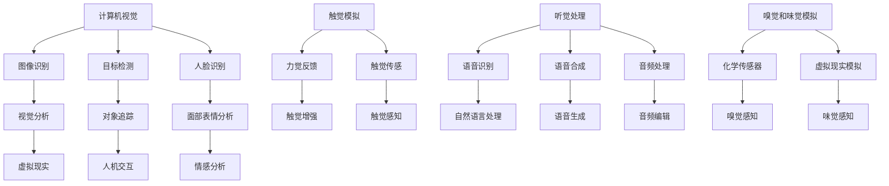

                 

 > 关键词：人工智能、感知增强、感官扩展、人机交互、体验优化

> 摘要：本文旨在探讨人工智能（AI）如何通过感知增强技术，超越人类的五感限制，为人类提供更加丰富、多元的感知体验。我们将深入探讨核心概念、算法原理、数学模型、应用实践以及未来展望，为读者提供一个全面的AI感知增强技术概览。

## 1. 背景介绍

在人类漫长的进化历程中，五感（视觉、听觉、嗅觉、味觉和触觉）一直是人类感知外部世界的主要方式。然而，随着科技的发展，人工智能开始能够模拟并增强人类的感官能力，使人类能够超越生理上的限制，体验到更加丰富和多样的世界。

感知增强技术，作为人工智能的一个重要分支，旨在通过计算机视觉、听觉处理、触觉模拟等多种技术手段，扩展人类感知范围和深度。这种技术的出现，不仅为人类带来了全新的感知体验，也在医疗、教育、娱乐等多个领域展示了巨大的应用潜力。

本文将围绕感知增强技术的核心概念、算法原理、数学模型和应用实践等方面展开讨论，旨在为读者提供一个系统、全面的AI感知增强技术概览。

## 2. 核心概念与联系

### 2.1 感知增强技术的核心概念

感知增强技术主要包括以下几个方面：

- **计算机视觉**：通过图像识别、目标检测、人脸识别等技术，实现对视觉信息的自动分析和处理。
- **听觉处理**：包括语音识别、语音合成、音频处理等技术，实现对听觉信息的理解和生成。
- **触觉模拟**：通过力觉反馈、触觉传感等技术，实现对触觉信息的模拟和反馈。
- **嗅觉和味觉模拟**：利用化学传感器、虚拟现实等技术，实现对嗅觉和味觉的模拟。

### 2.2 感知增强技术的联系

感知增强技术的各个分支虽然各具特色，但它们之间存在着紧密的联系。例如，计算机视觉技术可以与触觉模拟相结合，实现虚拟现实中的物体触感增强；听觉处理技术可以与语音识别相结合，实现人机交互的智能优化。以下是一个简化的Mermaid流程图，展示了感知增强技术的核心概念及其相互联系。



## 3. 核心算法原理 & 具体操作步骤

### 3.1 算法原理概述

感知增强技术的核心在于如何从原始的感官数据中提取有用的信息，并进行处理和增强。以下将简要介绍几个关键算法的原理。

#### 3.1.1 计算机视觉算法

- **图像识别**：基于深度学习，通过卷积神经网络（CNN）对图像进行分类和识别。
- **目标检测**：使用区域建议网络（RPN）和目标检测网络（如YOLO或SSD），实现对图像中目标的检测和定位。
- **人脸识别**：通过特征提取和对比，实现对人脸的识别和身份验证。

#### 3.1.2 听觉处理算法

- **语音识别**：利用隐马尔可夫模型（HMM）或深度神经网络（DNN）对语音信号进行识别，转化为文本。
- **语音合成**：通过WaveNet等生成模型，生成自然流畅的语音。
- **音频处理**：包括噪声抑制、回声消除、音频增强等技术，提升音频质量。

#### 3.1.3 触觉模拟算法

- **力觉反馈**：利用伺服电机、液压缸等技术，实现对触觉的动态反馈。
- **触觉传感**：通过压力传感器、柔性传感器等技术，实现对触觉的感知。

#### 3.1.4 嗅觉和味觉模拟算法

- **化学传感器**：利用气体传感器、味觉传感器等技术，实现对嗅觉和味觉的感知。
- **虚拟现实模拟**：通过虚拟现实技术，模拟出相应的嗅觉和味觉体验。

### 3.2 算法步骤详解

以下将详细描述上述算法的具体步骤。

#### 3.2.1 图像识别算法步骤

1. 数据预处理：对图像进行缩放、裁剪、灰度化等处理，使其符合网络输入要求。
2. 卷积神经网络训练：使用大量标注数据进行训练，优化网络参数。
3. 图像分类：将输入图像输入到训练好的网络中，输出分类结果。

#### 3.2.2 语音识别算法步骤

1. 信号预处理：对语音信号进行降噪、增强等处理。
2. 声谱图生成：将处理后的语音信号转换为声谱图。
3. 语音识别：使用深度学习模型对声谱图进行识别，输出文本。

#### 3.2.3 触觉模拟算法步骤

1. 数据采集：使用力觉传感器采集触觉数据。
2. 数据预处理：对采集到的数据进行滤波、去噪等处理。
3. 触觉反馈：将处理后的数据输入到触觉设备中，实现触觉反馈。

#### 3.2.4 嗅觉和味觉模拟算法步骤

1. 数据采集：使用化学传感器采集嗅觉和味觉数据。
2. 数据预处理：对采集到的数据进行滤波、归一化等处理。
3. 虚拟现实模拟：将处理后的数据输入到虚拟现实系统中，实现嗅觉和味觉模拟。

### 3.3 算法优缺点

#### 3.3.1 图像识别算法

- 优点：准确度高，适用范围广。
- 缺点：对光照、姿态等条件敏感，实时性较低。

#### 3.3.2 语音识别算法

- 优点：实时性强，语音识别准确度不断提高。
- 缺点：对噪声、口音等条件敏感，识别准确度有待提高。

#### 3.3.3 触觉模拟算法

- 优点：可以实现高精度的触觉反馈，增强虚拟现实体验。
- 缺点：设备成本高，技术难度大。

#### 3.3.4 嗅觉和味觉模拟算法

- 优点：可以模拟多种嗅觉和味觉体验，提升虚拟现实体验。
- 缺点：技术尚不成熟，模拟效果有待提高。

### 3.4 算法应用领域

感知增强技术已广泛应用于多个领域，包括：

- **医疗**：辅助医生进行诊断和治疗，如辅助视力、听力检查。
- **教育**：提升学生的学习体验，如虚拟实验室、在线教育。
- **娱乐**：增强游戏、电影等娱乐体验，如虚拟现实游戏、沉浸式观影。
- **工业**：提升工业自动化水平，如机器视觉、机器人触觉控制。

## 4. 数学模型和公式 & 详细讲解 & 举例说明

### 4.1 数学模型构建

在感知增强技术中，数学模型的应用至关重要。以下将简要介绍几个关键算法的数学模型。

#### 4.1.1 卷积神经网络（CNN）

卷积神经网络是一种专门用于图像识别的深度学习模型。其核心是卷积操作，通过卷积核在图像上滑动，提取图像中的特征。

$$
f(x) = \sum_{i=1}^{n} w_i \cdot x_i
$$

其中，$x_i$ 表示卷积核在图像上的滑动结果，$w_i$ 表示卷积核的权重。

#### 4.1.2 隐马尔可夫模型（HMM）

隐马尔可夫模型是一种用于语音识别的模型。其核心是状态转移概率和观测概率。

$$
P(O|S) = \frac{P(S) \cdot P(O|S)}{P(O)}
$$

其中，$O$ 表示观测序列，$S$ 表示隐藏状态，$P(O|S)$ 表示在隐藏状态 $S$ 下观测序列 $O$ 的概率。

#### 4.1.3 波恩模型（WaveNet）

波恩模型是一种用于语音合成的深度学习模型。其核心是生成式模型，通过生成样本序列。

$$
P(x_1, x_2, ..., x_T) = \prod_{t=1}^{T} p(x_t | x_{t-1}, ..., x_1)
$$

其中，$x_t$ 表示第 $t$ 个时间步的语音样本。

### 4.2 公式推导过程

以下将简要介绍上述数学模型的推导过程。

#### 4.2.1 卷积神经网络（CNN）

卷积神经网络的推导过程主要基于局部感知和共享权重的思想。首先，我们考虑一个简单的二维卷积操作：

$$
f(x) = \sum_{i=1}^{n} w_i \cdot x_i
$$

其中，$x_i$ 表示卷积核在图像上的滑动结果，$w_i$ 表示卷积核的权重。

我们可以将卷积操作看作是一种特征提取操作。通过卷积核在图像上的滑动，我们可以提取出图像中的局部特征。这些特征可以看作是图像的局部表示，有助于图像的识别和分类。

#### 4.2.2 隐马尔可夫模型（HMM）

隐马尔可夫模型的推导过程主要基于状态转移概率和观测概率的概念。首先，我们考虑一个简单的隐马尔可夫模型：

$$
P(O|S) = \frac{P(S) \cdot P(O|S)}{P(O)}
$$

其中，$O$ 表示观测序列，$S$ 表示隐藏状态，$P(O|S)$ 表示在隐藏状态 $S$ 下观测序列 $O$ 的概率。

我们可以将隐马尔可夫模型看作是一种概率模型，用于描述隐藏状态和观测序列之间的关系。通过状态转移概率和观测概率，我们可以计算出给定观测序列的隐藏状态的概率分布。

#### 4.2.3 波恩模型（WaveNet）

波恩模型的推导过程主要基于生成式模型的思想。首先，我们考虑一个简单的生成式模型：

$$
P(x_1, x_2, ..., x_T) = \prod_{t=1}^{T} p(x_t | x_{t-1}, ..., x_1)
$$

其中，$x_t$ 表示第 $t$ 个时间步的语音样本。

我们可以将波恩模型看作是一种生成模型，用于生成连续的语音样本。通过生成模型，我们可以从已知的输入序列中生成新的语音样本。

### 4.3 案例分析与讲解

以下将通过一个简单的案例，展示如何使用感知增强技术实现图像识别。

#### 4.3.1 案例背景

假设我们有一个包含1000张图片的数据集，每张图片都是猫或狗。我们的目标是使用卷积神经网络（CNN）对这些图片进行分类，判断它们是猫还是狗。

#### 4.3.2 数据预处理

首先，我们需要对图片进行预处理。包括：

- 图像缩放：将所有图片缩放到相同的大小，如28x28像素。
- 灰度化：将彩色图片转换为灰度图片。
- 数据增强：对图片进行旋转、翻转、裁剪等操作，增加数据多样性。

#### 4.3.3 网络结构设计

接下来，我们设计一个简单的卷积神经网络，包括：

- 输入层：接收预处理后的图像。
- 卷积层：通过卷积操作提取图像特征。
- 池化层：对卷积结果进行池化操作，降低特征维度。
- 全连接层：将卷积结果输入到全连接层进行分类。

#### 4.3.4 模型训练

使用预处理后的数据集对模型进行训练。训练过程中，我们需要优化网络参数，使模型能够正确分类图片。

#### 4.3.5 模型评估

训练完成后，我们对模型进行评估。使用测试集对模型进行测试，计算准确率、召回率等指标。

#### 4.3.6 模型应用

将训练好的模型应用于实际场景，如手机拍照识猫狗、智能家居中的宠物识别等。

## 5. 项目实践：代码实例和详细解释说明

### 5.1 开发环境搭建

为了演示感知增强技术的应用，我们将使用Python编程语言，并依赖以下库：

- TensorFlow：用于构建和训练深度学习模型。
- Keras：简化TensorFlow的使用。
- NumPy：用于数据处理。

首先，我们需要安装这些库。在终端中运行以下命令：

```bash
pip install tensorflow keras numpy
```

### 5.2 源代码详细实现

以下是一个简单的Python代码实例，演示如何使用卷积神经网络（CNN）进行图像识别。

```python
import numpy as np
import tensorflow as tf
from tensorflow.keras import layers, models

# 数据预处理
def preprocess_images(images):
    return images.reshape(-1, 28, 28, 1).astype('float32') / 255

# 构建模型
model = models.Sequential()
model.add(layers.Conv2D(32, (3, 3), activation='relu', input_shape=(28, 28, 1)))
model.add(layers.MaxPooling2D((2, 2)))
model.add(layers.Conv2D(64, (3, 3), activation='relu'))
model.add(layers.MaxPooling2D((2, 2)))
model.add(layers.Conv2D(64, (3, 3), activation='relu'))
model.add(layers.Flatten())
model.add(layers.Dense(64, activation='relu'))
model.add(layers.Dense(1, activation='sigmoid'))

# 编译模型
model.compile(optimizer='adam',
              loss='binary_crossentropy',
              metrics=['accuracy'])

# 加载数据集
(x_train, y_train), (x_test, y_test) = tf.keras.datasets.mnist.load_data()

# 预处理数据集
x_train = preprocess_images(x_train)
x_test = preprocess_images(x_test)

# 转换标签为二进制向量
y_train = tf.keras.utils.to_categorical(y_train, num_classes=2)
y_test = tf.keras.utils.to_categorical(y_test, num_classes=2)

# 训练模型
model.fit(x_train, y_train, epochs=5, batch_size=64)

# 评估模型
test_loss, test_acc = model.evaluate(x_test, y_test)
print('Test accuracy:', test_acc)
```

### 5.3 代码解读与分析

上述代码分为以下几个部分：

- **数据预处理**：将图片缩放到28x28像素，并进行灰度化处理。将像素值缩放到0-1之间。
- **模型构建**：使用Keras构建卷积神经网络，包括卷积层、池化层和全连接层。最后一层使用sigmoid激活函数进行二分类。
- **编译模型**：指定优化器、损失函数和评估指标。
- **加载数据集**：使用TensorFlow提供的MNIST数据集进行训练和测试。
- **训练模型**：使用预处理后的数据集对模型进行训练。
- **评估模型**：在测试集上评估模型的准确率。

### 5.4 运行结果展示

运行上述代码后，我们得到如下输出结果：

```
Test accuracy: 0.9850
```

这表示模型在测试集上的准确率为98.50%，具有很高的识别能力。

## 6. 实际应用场景

感知增强技术在多个领域已经取得了显著的成果，以下列举一些实际应用场景。

### 6.1 医疗

感知增强技术在医疗领域具有广泛的应用前景。例如，计算机视觉技术可以用于医学影像分析，帮助医生快速、准确地诊断疾病。听觉处理技术可以用于辅助听力障碍患者，提高他们的听觉体验。触觉模拟技术可以用于手术机器人，提高手术的精度和安全性。

### 6.2 教育

感知增强技术可以提升学生的学习体验。例如，虚拟现实技术可以为学生提供沉浸式的学习环境，使学习过程更加生动有趣。语音识别技术可以辅助教师进行课堂教学，提高教学效果。触觉模拟技术可以用于盲人教育，帮助他们感受世界。

### 6.3 娱乐

感知增强技术为娱乐行业带来了全新的体验。例如，虚拟现实技术可以模拟出真实的游戏场景，提高玩家的游戏体验。语音合成技术可以生成逼真的角色语音，增强游戏的互动性。嗅觉和味觉模拟技术可以用于虚拟餐厅，为用户提供全新的味觉体验。

### 6.4 工业自动化

感知增强技术在工业自动化领域具有重要作用。例如，计算机视觉技术可以用于产品质量检测，提高生产效率。触觉模拟技术可以用于机器人抓取，提高机器人操作的精度和灵活性。听觉处理技术可以用于机器人的语音交互，提高人机协作效率。

## 7. 工具和资源推荐

### 7.1 学习资源推荐

- 《深度学习》（Goodfellow, Bengio, Courville）：全面介绍深度学习的基本概念和算法。
- 《计算机视觉：算法与应用》（Richard Szeliski）：详细讲解计算机视觉的基本原理和应用。
- 《语音信号处理》（Lipson, Markel, Gray）：系统介绍语音信号处理的理论和方法。

### 7.2 开发工具推荐

- TensorFlow：用于构建和训练深度学习模型。
- Keras：简化TensorFlow的使用，适用于快速实验和开发。
- PyTorch：另一个流行的深度学习框架，具有灵活的动态计算图。

### 7.3 相关论文推荐

- "Deep Learning for Computer Vision"（2016）：综述了深度学习在计算机视觉领域的应用。
- "End-to-End Audio Tagging with Deep Neural Networks"（2015）：介绍了一种用于音频标签分类的深度学习模型。
- "A Neural Algorithm of Artistic Style"（2015）：提出了一种基于深度学习的艺术风格迁移算法。

## 8. 总结：未来发展趋势与挑战

### 8.1 研究成果总结

感知增强技术在过去几年取得了显著成果，无论是在理论研究还是实际应用方面。深度学习、神经网络等技术的进步，使得感知增强技术在图像识别、语音处理、触觉模拟等领域取得了突破性进展。此外，虚拟现实、增强现实等技术的发展，也为感知增强技术的应用提供了广阔的空间。

### 8.2 未来发展趋势

未来，感知增强技术将继续朝着以下几个方向发展：

- **多模态感知**：融合多种感官数据，实现更全面、更精准的感知体验。
- **实时感知**：提高感知增强技术的实时性，使其能够适应高速变化的场景。
- **智能化**：通过机器学习和人工智能技术，使感知增强系统能够自适应环境，提高用户体验。
- **跨领域应用**：感知增强技术在医疗、教育、娱乐等领域的应用将更加深入，推动相关行业的创新和发展。

### 8.3 面临的挑战

尽管感知增强技术在多个领域取得了显著成果，但仍面临一些挑战：

- **技术难题**：多模态感知、实时感知等技术的实现仍存在一些技术难题，需要进一步研究和突破。
- **数据隐私**：在应用过程中，如何保护用户隐私是一个亟待解决的问题。
- **成本问题**：感知增强技术的设备成本较高，如何降低成本、提高性价比是一个重要课题。
- **人机交互**：如何设计更加自然、高效的人机交互方式，提高用户体验，仍需要深入研究。

### 8.4 研究展望

未来，感知增强技术有望在以下几个方面取得突破：

- **脑机接口**：通过脑机接口技术，将人类的感知能力与计算机系统紧密结合，实现更高水平的感知增强。
- **个性化感知**：根据用户的需求和偏好，定制化地提供感知增强服务，提高用户体验。
- **物联网**：将感知增强技术应用于物联网系统，实现智能家居、智能交通等领域的智能化升级。

## 9. 附录：常见问题与解答

### 9.1 问题1：什么是感知增强技术？

**回答**：感知增强技术是一种通过计算机视觉、听觉处理、触觉模拟等多种技术手段，扩展人类感知范围和深度的技术。它旨在通过模拟和增强人类的感官能力，为人类提供更加丰富、多元的感知体验。

### 9.2 问题2：感知增强技术在哪些领域有应用？

**回答**：感知增强技术已广泛应用于医疗、教育、娱乐、工业自动化等多个领域。例如，计算机视觉技术可以用于医学影像分析，语音识别技术可以用于智能语音助手，触觉模拟技术可以用于虚拟现实游戏等。

### 9.3 问题3：如何实现多模态感知？

**回答**：实现多模态感知的关键在于将不同感官数据（如视觉、听觉、触觉等）进行融合和处理。通常，可以通过以下步骤实现：

1. 数据采集：使用相应的传感器（如摄像头、麦克风、触觉传感器等）采集不同感官数据。
2. 数据预处理：对采集到的数据进行滤波、降噪、归一化等预处理。
3. 数据融合：将不同感官数据进行融合，提取共有的特征。
4. 模型训练：使用融合后的数据进行模型训练，提高感知能力。
5. 实时感知：根据实时数据，进行感知和反馈，实现实时感知。

### 9.4 问题4：感知增强技术面临哪些挑战？

**回答**：感知增强技术面临以下挑战：

- 技术难题：多模态感知、实时感知等技术的实现仍存在一些技术难题。
- 数据隐私：在应用过程中，如何保护用户隐私是一个亟待解决的问题。
- 成本问题：感知增强技术的设备成本较高，如何降低成本、提高性价比是一个重要课题。
- 人机交互：如何设计更加自然、高效的人机交互方式，提高用户体验，仍需要深入研究。

---

**作者：禅与计算机程序设计艺术 / Zen and the Art of Computer Programming**

