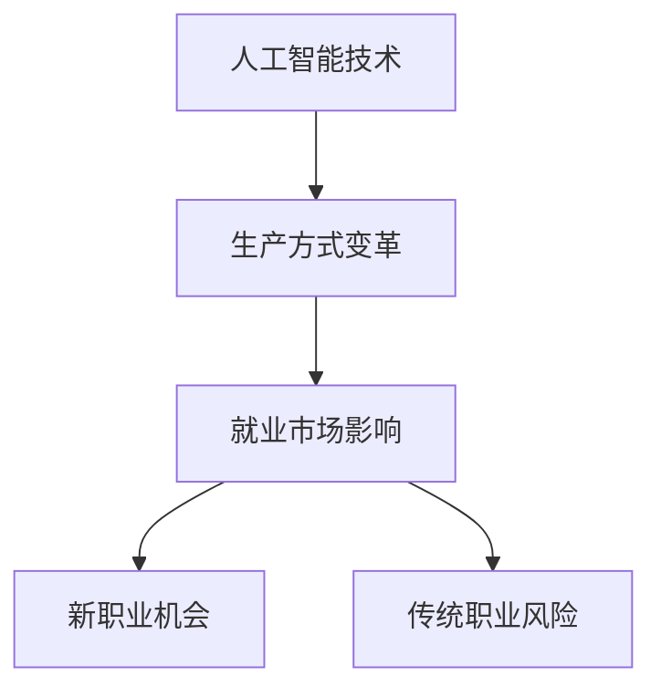

                 

关键词：人工智能，就业影响，职业教育，终身学习，技术变革

摘要：随着人工智能技术的飞速发展，其对就业市场的影响日益显著。本文将从人工智能技术的就业影响出发，探讨职业教育和终身学习体系在应对这一变革中的重要性，并提出相应的策略和建议。

## 1. 背景介绍

人工智能（AI）技术的发展已经对各行各业产生了深远的影响，从智能制造到医疗健康，从金融服务到交通运输，AI技术的应用正在不断拓宽。然而，随着AI技术的普及，一些传统职业面临着被替代的风险，而新的职业机会也在不断涌现。这种技术变革给就业市场带来了巨大的挑战，也提供了新的机遇。

### 1.1 人工智能技术的发展历程

人工智能技术的起源可以追溯到20世纪50年代。当时，计算机科学家们首次提出了“人工智能”的概念，并开始尝试通过编程让计算机模拟人类的思维和行为。在接下来的几十年中，人工智能经历了多次起伏，从早期的符号主义到20世纪80年代的专家系统，再到20世纪90年代的连接主义和深度学习，人工智能技术不断取得突破。

### 1.2 人工智能技术的就业影响

随着人工智能技术的快速发展，一些传统职业正面临被机器取代的风险。例如，工厂中的流水线工人、数据处理员、财务分析师等职业，都可能因为人工智能的出现而减少。然而，与此同时，新的职业机会也在不断涌现，如数据科学家、机器学习工程师、AI产品经理等。

## 2. 核心概念与联系

为了更好地理解人工智能技术的就业影响，我们需要了解一些核心概念和它们之间的联系。

### 2.1 人工智能技术的核心概念

- **机器学习**：一种通过数据学习模式和规律，从而实现自动化决策和预测的技术。
- **深度学习**：一种基于多层神经网络的人工智能算法，能够从大量数据中自动提取特征。
- **自然语言处理**：一种使计算机能够理解和处理人类语言的技术。
- **计算机视觉**：一种使计算机能够理解和解释图像和视频内容的技术。

### 2.2 人工智能技术与就业市场的联系

人工智能技术的发展不仅改变了生产方式，也对就业市场产生了深远的影响。一方面，它带来了新的职业机会，另一方面，它也使得一些传统职业面临被取代的风险。

### 2.3 Mermaid 流程图



## 3. 核心算法原理 & 具体操作步骤

### 3.1 算法原理概述

在探讨人工智能技术的就业影响时，我们首先需要了解人工智能技术的基本原理。人工智能技术主要依赖于机器学习和深度学习算法，这些算法能够从大量数据中自动提取特征，并实现自动化决策和预测。

### 3.2 算法步骤详解

- **数据收集**：首先需要收集大量的数据，这些数据可以是结构化的，也可以是非结构化的。
- **数据预处理**：对收集到的数据进行清洗和预处理，使其适合进行机器学习和深度学习。
- **模型训练**：使用预处理后的数据对机器学习或深度学习模型进行训练，使其能够自动提取特征并做出预测。
- **模型评估**：对训练好的模型进行评估，检查其预测准确性和泛化能力。
- **模型部署**：将训练好的模型部署到生产环境中，实现自动化决策和预测。

### 3.3 算法优缺点

- **优点**：
  - 提高生产效率。
  - 减少人力成本。
  - 实现自动化决策和预测。
- **缺点**：
  - 可能取代一些传统职业。
  - 需要大量数据支持。
  - 模型训练和部署成本较高。

### 3.4 算法应用领域

人工智能技术已经在许多领域得到广泛应用，如智能制造、医疗健康、金融服务、交通运输等。随着技术的不断进步，未来人工智能技术的应用领域将会更加广泛。

## 4. 数学模型和公式 & 详细讲解 & 举例说明

### 4.1 数学模型构建

在人工智能技术中，数学模型是核心。一个典型的数学模型包括输入层、隐藏层和输出层。输入层接收外部数据，隐藏层对数据进行特征提取，输出层生成预测结果。

### 4.2 公式推导过程

假设我们有一个简单的线性回归模型，其数学公式为：

\[ y = w_1 \cdot x_1 + w_2 \cdot x_2 + \ldots + w_n \cdot x_n + b \]

其中，\( y \) 是预测结果，\( w_1, w_2, \ldots, w_n \) 是权重，\( x_1, x_2, \ldots, x_n \) 是输入特征，\( b \) 是偏置。

### 4.3 案例分析与讲解

以一家电商公司的销售预测为例，我们使用线性回归模型来预测明天的销售额。输入特征包括当天广告投放量、用户访问量、历史销售额等。

## 5. 项目实践：代码实例和详细解释说明

### 5.1 开发环境搭建

- 安装Python环境。
- 安装Scikit-learn库。

### 5.2 源代码详细实现

```python
from sklearn.linear_model import LinearRegression
import numpy as np

# 数据准备
X = np.array([[10, 1000, 5000]])
y = np.array([7000])

# 模型训练
model = LinearRegression()
model.fit(X, y)

# 预测
prediction = model.predict([[15, 1200, 5500]])
print("预测的明天销售额为：", prediction)
```

### 5.3 代码解读与分析

这段代码首先从Scikit-learn库中导入LinearRegression类，然后准备输入数据和预测目标。接着，使用LinearRegression模型对输入数据进行训练，最后使用训练好的模型进行预测。

## 6. 实际应用场景

### 6.1 人工智能在智能制造中的应用

智能制造是人工智能技术的重要应用领域。通过人工智能技术，企业可以实现生产过程的自动化，提高生产效率，减少生产成本。

### 6.2 人工智能在医疗健康中的应用

在医疗健康领域，人工智能技术可以用于疾病诊断、药物研发、健康管理等。例如，通过人工智能技术，医生可以更准确地诊断疾病，提高治疗效果。

### 6.3 人工智能在金融服务中的应用

在金融服务领域，人工智能技术可以用于风险评估、投资决策、客户服务等方面。通过人工智能技术，金融机构可以更好地服务客户，提高业务效率。

## 7. 未来应用展望

随着人工智能技术的不断发展，未来人工智能技术的应用将会更加广泛。例如，在智慧城市、智能家居、教育等领域，人工智能技术都有很大的发展潜力。

## 8. 总结：未来发展趋势与挑战

### 8.1 研究成果总结

人工智能技术已经在多个领域取得显著成果，为社会发展带来了巨大变革。

### 8.2 未来发展趋势

随着技术的不断进步，人工智能技术的应用将会更加广泛，未来将会有更多的行业受益于人工智能技术。

### 8.3 面临的挑战

然而，人工智能技术的发展也面临一些挑战，如数据隐私、伦理道德、技术垄断等。

### 8.4 研究展望

未来，人工智能技术的研究将会更加深入，我们将看到更多突破性成果。

## 9. 附录：常见问题与解答

### 9.1 人工智能是否会取代所有工作？

人工智能技术可能会取代一些重复性和简单的劳动，但无法完全取代人类的工作。人工智能更多的是作为人类的辅助工具，提高工作效率。

### 9.2 如何应对人工智能带来的就业挑战？

通过职业教育和终身学习体系，提高个人的技能和知识水平，以适应人工智能时代的就业需求。

### 9.3 人工智能技术的发展对伦理道德有何影响？

人工智能技术的发展需要遵循伦理道德原则，确保技术不被滥用，保护人类的利益。

# 作者署名

作者：禅与计算机程序设计艺术 / Zen and the Art of Computer Programming

----------------------------------------------------------------

以上便是关于"AI技术的就业影响应对:职业教育和终身学习体系"的文章，希望对您有所帮助。如果您有任何疑问或需要进一步讨论，请随时与我联系。|user|

