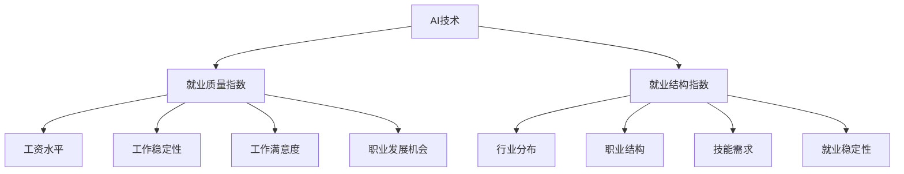

                 

关键词：AI技术、就业影响、就业质量指数、就业结构指数、人工智能专家、计算机图灵奖

## 摘要

本文旨在探讨AI技术对就业市场的影响，并通过构建就业质量指数和就业结构指数，量化评估AI技术带来的就业变化。文章首先介绍了AI技术的发展历程和现状，然后详细阐述了就业质量指数和就业结构指数的概念、构建方法和应用场景。通过案例分析，本文进一步展示了AI技术在不同行业中的应用情况，以及对就业市场的影响。最后，本文对AI技术未来发展趋势和面临的挑战进行了展望，为相关政策制定和人才培养提供参考。

## 1. 背景介绍

人工智能（AI）技术作为当代最具影响力的科技创新之一，正在深刻改变着人类社会的各个方面。从早期的基础理论研究到如今的实际应用，AI技术经历了数十年的发展。20世纪50年代，人工智能的概念首次被提出，随后在20世纪80年代和90年代，随着计算机硬件和算法的进步，AI技术取得了显著的进展。进入21世纪，深度学习、神经网络等技术的突破，使得AI技术开始从实验室走向实际应用，成为推动产业变革的重要力量。

AI技术的应用领域广泛，包括但不限于以下几个方面：

1. **智能制造**：通过机器人和自动化设备提高生产效率和质量，降低人力成本。
2. **医疗健康**：利用AI技术进行疾病诊断、药物研发和个性化治疗，提高医疗水平。
3. **金融服务**：通过数据分析、风险控制和智能投顾，提高金融服务的效率和准确性。
4. **交通出行**：自动驾驶技术、智能交通管理系统的应用，提高交通流畅性和安全性。
5. **教育**：智能教育平台、在线课程和个性化学习推荐系统，提升教育质量和效率。

尽管AI技术的应用带来了巨大的经济和社会效益，但同时也引发了关于就业影响的广泛关注。AI技术是否会取代人类工作，导致大规模失业？这种担忧并非无根据。根据麦肯锡全球研究所的报告，到2030年，全球约8亿个工作岗位可能受到AI和自动化技术的影响。然而，与此同时，AI技术也会创造新的就业机会，并提高现有工作的效率和质量。

本文将重点关注AI技术对就业质量指数和就业结构指数的影响。就业质量指数和就业结构指数是衡量就业市场变化的重要指标，通过分析这两个指数，可以更全面地了解AI技术对就业市场的影响。

### 1.1 AI技术的发展历程和现状

AI技术的发展历程可以分为几个关键阶段：

1. **早期阶段（1950-1969）**：人工智能的概念被首次提出，主要研究基于规则和逻辑推理的专家系统。
2. **成长阶段（1970-1989）**：随着计算机硬件和软件的发展，AI技术开始应用于实际领域，如自然语言处理、图像识别等。
3. **低谷阶段（1990-2000）**：由于技术瓶颈和资金压力，AI研究进入低谷期。
4. **复兴阶段（2000-2010）**：互联网的普及和大数据技术的发展，为AI技术的复兴提供了新的机遇。
5. **成熟阶段（2010至今）**：深度学习、神经网络等技术的突破，使得AI技术取得了显著进展，并在多个领域得到广泛应用。

目前，AI技术已经从实验室走向实际应用，成为推动产业变革的重要力量。根据市场研究公司的数据，全球AI市场规模预计将从2019年的36.8亿美元增长到2025年的190.61亿美元，年复合增长率达到29.7%。

### 1.2 AI技术的应用领域

AI技术的应用领域广泛，涵盖了多个行业和领域：

1. **智能制造**：智能制造是AI技术的重要应用领域之一。通过机器人和自动化设备，企业可以大幅提高生产效率和质量，降低人力成本。例如，汽车制造业中，机器人已经广泛应用于焊接、喷涂、装配等环节，显著提高了生产效率和产品质量。

2. **医疗健康**：AI技术在医疗健康领域具有巨大潜力。利用AI技术，可以实现疾病诊断、药物研发和个性化治疗。例如，IBM的Watson for Oncology系统可以帮助医生进行癌症诊断和治疗方案推荐，提高了诊断准确性和治疗效果。

3. **金融服务**：AI技术在金融服务领域具有广泛的应用，如风险控制、信用评估和智能投顾等。例如，金融机构可以通过大数据分析和机器学习技术，提高贷款审批的效率和准确性，降低违约风险。

4. **交通出行**：AI技术在交通出行领域也有重要应用，如自动驾驶技术、智能交通管理系统等。例如，谷歌的Waymo项目已经实现了完全自动驾驶汽车的商业化运营，提高了交通流畅性和安全性。

5. **教育**：AI技术在教育领域可以提供个性化学习推荐系统、在线课程和智能教育平台等。例如，Coursera等在线教育平台利用AI技术，可以根据学生的兴趣和学习进度，推荐合适的学习课程和资源，提高了教育质量和效率。

### 1.3 AI技术对就业市场的影响

AI技术的广泛应用对就业市场产生了深远的影响。一方面，AI技术可能取代一些重复性、低技能的工作，导致失业率上升。另一方面，AI技术也会创造新的就业机会，并提高现有工作的效率和质量。

#### 1.3.1 取代传统工作

根据麦肯锡全球研究所的报告，到2030年，全球约8亿个工作岗位可能受到AI和自动化技术的影响。这些岗位主要集中在制造业、物流、零售、客服等领域，主要是那些重复性、低技能的工作。例如，机器人和自动化设备的普及，可能减少制造业中的人工操作工和组装工的需求。智能客服系统的应用，可能减少客服人员的数量。

#### 1.3.2 创造新就业机会

尽管AI技术可能取代一些传统工作，但同时也会创造新的就业机会。这些新就业机会主要集中在AI技术的研究、开发、维护和运营领域。例如，随着AI技术的不断发展，对AI算法工程师、数据科学家、机器学习工程师等人才的需求日益增加。此外，AI技术的应用也催生了新的行业和商业模式，如自动驾驶、智能医疗、智能金融等，为就业市场带来了新的机遇。

#### 1.3.3 提高工作质量

AI技术不仅改变了就业市场的结构，还提高了工作的质量。例如，在医疗领域，AI技术可以帮助医生进行疾病诊断和治疗方案推荐，提高诊断准确性和治疗效果。在金融领域，AI技术可以提高风险控制和信用评估的效率，降低金融风险。在教育领域，AI技术可以提供个性化学习推荐系统和在线课程，提高教育质量和效率。

### 1.4 就业质量指数和就业结构指数的概念和意义

就业质量指数和就业结构指数是衡量就业市场变化的重要指标。就业质量指数反映了就业者的工作满意度、工资水平、工作稳定性等方面的状况，而就业结构指数则反映了就业市场的行业分布和职业结构的变化。

#### 1.4.1 就业质量指数

就业质量指数是衡量就业者工作质量的重要指标，包括以下几个方面：

1. **工资水平**：工资水平是衡量就业质量的重要指标之一。较高的工资水平反映了就业者的工作价值和市场认可度。
2. **工作稳定性**：工作稳定性反映了就业者的工作安全感。稳定的工作可以减少就业者的心理压力，提高生活质量。
3. **工作满意度**：工作满意度是衡量就业者对工作的主观评价。较高的工作满意度反映了就业者对工作的热爱和投入程度。
4. **职业发展机会**：职业发展机会反映了就业者在职业发展上的潜力。良好的职业发展机会可以激发就业者的积极性和创造力。

#### 1.4.2 就业结构指数

就业结构指数是衡量就业市场行业分布和职业结构变化的重要指标，包括以下几个方面：

1. **行业分布**：行业分布反映了就业市场在不同行业的就业机会和就业人数的变化。
2. **职业结构**：职业结构反映了就业市场不同职业的就业机会和就业人数的变化。职业结构的变化可以反映就业市场对技能和人才的需求变化。
3. **技能需求**：技能需求反映了就业市场对不同技能人才的需求。随着AI技术的发展，对数据科学家、算法工程师等高技能人才的需求不断增加。
4. **就业稳定性**：就业稳定性反映了就业市场的稳定程度。就业稳定性的提高可以降低就业者的失业风险，提高就业市场的稳定性。

通过构建就业质量指数和就业结构指数，可以更全面地了解AI技术对就业市场的影响，为政策制定和人才培养提供依据。本文将在此基础上，进一步探讨AI技术对就业质量指数和就业结构指数的影响。

## 2. 核心概念与联系

在探讨AI技术对就业影响时，我们需要理解两个核心概念：就业质量指数和就业结构指数。这两个指数不仅帮助我们量化评估就业市场的变化，还能够揭示AI技术在不同领域中的应用及其对就业市场的具体影响。

### 2.1 就业质量指数

就业质量指数（Employment Quality Index, EQI）是一个综合性的指标，用于衡量就业者的工作质量。它涵盖以下几个方面：

1. **工资水平（Wage Level）**：工资水平反映了就业者的经济回报。较高的工资水平通常意味着更好的就业质量。
2. **工作稳定性（Job Stability）**：工作稳定性反映了就业者的职业安全感和持续性。稳定的工作可以减少失业风险，提高就业者的生活质量。
3. **工作满意度（Job Satisfaction）**：工作满意度反映了就业者对其工作的主观评价。高满意度通常意味着对工作的热爱和投入。
4. **职业发展机会（Career Development Opportunities）**：职业发展机会反映了就业者未来的职业成长空间和潜力。

就业质量指数的计算方法通常是基于以上几个维度的加权平均。例如，可以分别给工资水平、工作稳定性、工作满意度和职业发展机会设定权重，然后通过加权求和得到最终的就业质量指数。

### 2.2 就业结构指数

就业结构指数（Employment Structure Index, ESI）用于衡量就业市场的行业分布和职业结构。它主要关注以下几个方面：

1. **行业分布（Industry Distribution）**：行业分布反映了就业市场在不同行业中的就业机会和就业人数的变化。例如，随着AI技术的发展，高科技行业的就业机会可能增加，而传统制造业的就业机会可能减少。
2. **职业结构（Occupational Structure）**：职业结构反映了就业市场不同职业的就业机会和就业人数的变化。职业结构的变化可以揭示就业市场对技能和人才的需求变化。
3. **技能需求（Skill Demand）**：技能需求反映了就业市场对不同技能人才的需求。随着AI技术的普及，对数据科学家、算法工程师等高技能人才的需求不断增加。
4. **就业稳定性（Employment Stability）**：就业稳定性反映了就业市场的整体稳定性。就业稳定性的提高可以降低就业者的失业风险，提高就业市场的稳定性。

就业结构指数的计算方法通常是基于以上几个维度的综合分析。例如，可以通过统计分析各行业和职业的就业人数变化，以及就业市场的波动情况，得到就业结构指数。

### 2.3 AI技术与就业质量指数、就业结构指数的联系

AI技术与就业质量指数、就业结构指数之间存在密切的联系。一方面，AI技术的应用会直接影响就业质量指数和就业结构指数的变化；另一方面，就业质量指数和就业结构指数的变化也可以反映出AI技术对就业市场的影响。

#### 2.3.1 AI技术对就业质量指数的影响

AI技术的应用可以显著提高就业质量。例如，在医疗健康领域，AI技术可以帮助医生进行疾病诊断和治疗方案推荐，提高诊断准确性和治疗效果，从而提高就业者的工作满意度。此外，AI技术在金融、教育等领域的应用，也为就业者提供了更多职业发展机会。例如，金融机构通过AI技术提高贷款审批的效率和准确性，从而创造了更多的金融科技岗位。这些因素都有助于提高就业质量指数。

#### 2.3.2 AI技术对就业结构指数的影响

AI技术的应用会改变就业市场的行业分布和职业结构。例如，随着AI技术的普及，高科技行业的就业机会不断增加，而传统制造业的就业机会可能减少。这种行业分布的变化会直接影响就业结构指数。同时，AI技术的应用也催生了新的职业，如数据科学家、机器学习工程师等，这些职业的就业机会和就业人数的增加，也会影响就业结构指数。

### 2.4 Mermaid流程图

为了更直观地展示AI技术与就业质量指数、就业结构指数之间的联系，我们可以使用Mermaid流程图来描述这个过程。以下是AI技术影响就业质量指数和就业结构指数的Mermaid流程图：

在这个流程图中，AI技术（A）作为起点，通过影响就业质量指数（B）和就业结构指数（C），进而影响多个具体的维度，如工资水平（D）、工作稳定性（E）、工作满意度（F）、职业发展机会（G）、行业分布（H）、职业结构（I）、技能需求（J）和就业稳定性（K）。通过这个流程图，我们可以更清晰地看到AI技术对就业市场的多维度影响。

通过上述核心概念和联系的介绍，我们为后续的算法原理和具体操作步骤奠定了基础。在接下来的章节中，我们将进一步探讨如何构建就业质量指数和就业结构指数，以及它们在实践中的应用。

### 3. 核心算法原理 & 具体操作步骤

#### 3.1 算法原理概述

构建就业质量指数和就业结构指数的核心算法是基于数据分析和统计建模的方法。具体来说，算法原理可以分为以下几个步骤：

1. **数据收集**：收集与就业质量相关的数据，包括工资水平、工作稳定性、工作满意度、职业发展机会等。同时，收集与就业结构相关的数据，包括行业分布、职业结构、技能需求、就业稳定性等。
2. **数据预处理**：对收集到的数据进行分析，处理缺失值、异常值和数据格式不一致等问题，确保数据的质量和一致性。
3. **特征提取**：根据算法的需求，从预处理后的数据中提取特征，这些特征将用于构建就业质量指数和就业结构指数。
4. **模型构建**：利用统计建模的方法，如回归分析、因子分析、聚类分析等，构建就业质量指数和就业结构指数的计算模型。
5. **模型训练与优化**：使用训练数据对模型进行训练，并利用交叉验证等方法进行模型优化，确保模型的预测准确性和鲁棒性。
6. **指数计算**：根据训练好的模型，对新的数据进行处理和计算，得到就业质量指数和就业结构指数的具体值。
7. **指数分析**：对计算得到的指数进行分析，评估AI技术对就业质量指数和就业结构指数的影响。

#### 3.2 算法步骤详解

以下详细描述构建就业质量指数和就业结构指数的算法步骤：

##### 3.2.1 数据收集

数据收集是构建就业质量指数和就业结构指数的基础。我们需要从多个渠道收集与就业质量相关的数据，包括工资水平、工作稳定性、工作满意度、职业发展机会等。数据来源可以是政府部门、行业协会、学术研究机构和企业调查等。同时，我们还需要收集与就业结构相关的数据，包括行业分布、职业结构、技能需求、就业稳定性等。

##### 3.2.2 数据预处理

数据预处理是确保数据质量的关键步骤。具体包括以下几个方面：

1. **数据清洗**：处理数据中的缺失值、异常值和重复数据，保证数据的一致性和完整性。
2. **数据标准化**：对不同特征进行标准化处理，使其具有相同的量纲和范围，便于后续的模型构建和计算。
3. **数据整合**：将来自不同渠道的数据进行整合，构建统一的数据集，为后续的分析和建模提供数据基础。

##### 3.2.3 特征提取

特征提取是构建就业质量指数和就业结构指数的核心步骤。我们需要从预处理后的数据中提取对指数计算有重要影响的特征。例如，对于就业质量指数，我们可以提取工资水平、工作稳定性、工作满意度和职业发展机会等特征；对于就业结构指数，我们可以提取行业分布、职业结构、技能需求和就业稳定性等特征。

##### 3.2.4 模型构建

模型构建是利用统计建模的方法，将提取出的特征与就业质量指数和就业结构指数建立数学关系。常用的统计建模方法包括回归分析、因子分析、聚类分析等。回归分析可以用于预测就业质量指数和就业结构指数的值；因子分析可以用于提取关键因素和简化模型结构；聚类分析可以用于分析行业和职业的结构变化。

##### 3.2.5 模型训练与优化

模型训练与优化是确保模型预测准确性和鲁棒性的关键步骤。我们使用训练数据对模型进行训练，并通过交叉验证等方法对模型进行优化。具体包括以下几个方面：

1. **数据划分**：将数据集划分为训练集和测试集，用于模型的训练和测试。
2. **模型训练**：使用训练数据对模型进行训练，调整模型参数，使其达到最优状态。
3. **模型评估**：使用测试数据对训练好的模型进行评估，计算模型的预测准确性和鲁棒性。
4. **模型优化**：根据评估结果，对模型进行调整和优化，提高模型的预测能力。

##### 3.2.6 指数计算

根据训练好的模型，对新的数据进行处理和计算，得到就业质量指数和就业结构指数的具体值。具体包括以下几个方面：

1. **数据处理**：对新的数据集进行预处理，包括数据清洗、标准化和整合等步骤。
2. **指数计算**：利用训练好的模型，对预处理后的数据集进行计算，得到就业质量指数和就业结构指数的具体值。
3. **结果分析**：对计算得到的指数进行分析，评估AI技术对就业质量指数和就业结构指数的影响。

##### 3.2.7 指数分析

对计算得到的指数进行分析，评估AI技术对就业质量指数和就业结构指数的影响。具体包括以下几个方面：

1. **趋势分析**：分析就业质量指数和就业结构指数的变化趋势，了解AI技术对就业市场的影响方向和程度。
2. **影响因素分析**：分析影响就业质量指数和就业结构指数的关键因素，了解AI技术在不同方面的作用。
3. **政策建议**：根据分析结果，提出相关政策建议，以应对AI技术对就业市场的挑战和机遇。

#### 3.3 算法优缺点

构建就业质量指数和就业结构指数的算法具有以下优点：

1. **全面性**：算法涵盖了就业质量指数和就业结构指数的多个维度，能够全面评估AI技术对就业市场的影响。
2. **预测性**：通过模型构建和优化，算法能够预测AI技术对就业质量指数和就业结构指数的未来变化趋势，为政策制定提供依据。
3. **灵活性**：算法可以根据具体应用场景进行调整和优化，适应不同国家和地区的就业市场特点。

然而，算法也存在一些缺点：

1. **数据依赖性**：算法的预测准确性和可靠性高度依赖数据的质量和完整性，数据的不完整或缺失可能会影响算法的性能。
2. **模型复杂度**：构建就业质量指数和就业结构指数的模型较为复杂，需要具备一定的专业知识和技能，对于普通用户来说可能难以理解和应用。
3. **实时性**：算法的实时性较差，需要较长时间进行数据收集、预处理和模型训练，无法实时响应就业市场变化。

#### 3.4 算法应用领域

构建就业质量指数和就业结构指数的算法可以广泛应用于以下领域：

1. **政策制定**：政府部门可以利用算法分析AI技术对就业市场的影响，制定相关政策，促进就业市场的健康发展。
2. **企业决策**：企业可以利用算法评估AI技术对就业市场的影响，优化人力资源配置，提高企业竞争力。
3. **人才培养**：教育部门可以利用算法分析就业市场的需求变化，调整人才培养方向和课程设置，提高毕业生的就业竞争力。
4. **学术研究**：学者可以利用算法开展就业质量指数和就业结构指数的研究，探索AI技术对就业市场的影响机制和作用路径。

通过上述算法原理和具体操作步骤的介绍，我们为后续的案例分析和实际应用提供了理论基础。在接下来的章节中，我们将通过具体案例，进一步探讨算法在实际应用中的效果和挑战。

### 4. 数学模型和公式 & 详细讲解 & 举例说明

#### 4.1 数学模型构建

构建就业质量指数和就业结构指数的数学模型，需要首先明确各个指数的计算方法。以下是构建这两个指数的基本数学模型。

##### 4.1.1 就业质量指数（EQI）的数学模型

就业质量指数（EQI）是一个综合性的指标，其计算方法如下：

$$
EQI = w_1 \times W_L + w_2 \times S_J + w_3 \times S_J + w_4 \times C_D
$$

其中，$W_L$表示工资水平，$S_J$表示工作满意度，$C_D$表示职业发展机会，$w_1$、$w_2$、$w_3$和$w_4$分别表示这四个维度的权重。权重可以根据实际情况进行调整，以确保指数的全面性和代表性。

##### 4.1.2 就业结构指数（ESI）的数学模型

就业结构指数（ESI）主要用于衡量就业市场的行业分布和职业结构。其计算方法如下：

$$
ESI = w_1 \times I_D + w_2 \times O_S + w_3 \times S_D + w_4 \times E_S
$$

其中，$I_D$表示行业分布，$O_S$表示职业结构，$S_D$表示技能需求，$E_S$表示就业稳定性，$w_1$、$w_2$、$w_3$和$w_4$同样表示这些维度的权重。

#### 4.2 公式推导过程

为了构建上述数学模型，我们需要对每个指数的维度进行详细分析和推导。

##### 4.2.1 就业质量指数（EQI）的公式推导

就业质量指数（EQI）旨在综合反映就业者的工作质量。以下是公式推导的步骤：

1. **工资水平（$W_L$）**：工资水平是衡量就业质量的重要指标之一。我们选择人均工资作为工资水平的代表，具体计算公式为：

$$
W_L = \frac{总工资}{总就业人数}
$$

2. **工作满意度（$S_J$）**：工作满意度反映了就业者对其工作的主观评价。我们可以通过问卷调查的方法，收集就业者对工作满意度的评分，然后计算平均值作为工作满意度的代表。具体计算公式为：

$$
S_J = \frac{1}{n} \sum_{i=1}^{n} S_i
$$

其中，$S_i$表示第$i$个就业者的工作满意度评分，$n$表示问卷调查的总人数。

3. **职业发展机会（$C_D$）**：职业发展机会反映了就业者未来的职业成长空间和潜力。我们可以通过问卷调查或员工绩效评估等方法，收集就业者对职业发展机会的评分，然后计算平均值作为职业发展机会的代表。具体计算公式为：

$$
C_D = \frac{1}{m} \sum_{j=1}^{m} C_j
$$

其中，$C_j$表示第$j$个就业者的职业发展机会评分，$m$表示问卷调查的总人数。

4. **权重（$w_1$、$w_2$、$w_3$和$w_4$）**：权重可以根据实际情况进行调整，以确保指数的全面性和代表性。例如，如果工资水平对就业质量的影响较大，可以设置较高的权重。

综合以上步骤，我们得到就业质量指数（EQI）的公式：

$$
EQI = w_1 \times W_L + w_2 \times S_J + w_3 \times C_D
$$

##### 4.2.2 就业结构指数（ESI）的公式推导

就业结构指数（ESI）旨在综合反映就业市场的行业分布和职业结构。以下是公式推导的步骤：

1. **行业分布（$I_D$）**：行业分布反映了就业市场在不同行业中的就业机会和就业人数的变化。我们可以通过统计不同行业的就业人数，计算各行业就业人数占总就业人数的比例，作为行业分布的代表。具体计算公式为：

$$
I_D = \frac{行业i的就业人数}{总就业人数}
$$

2. **职业结构（$O_S$）**：职业结构反映了就业市场不同职业的就业机会和就业人数的变化。我们可以通过统计不同职业的就业人数，计算各职业就业人数占总就业人数的比例，作为职业结构的代表。具体计算公式为：

$$
O_S = \frac{职业j的就业人数}{总就业人数}
$$

3. **技能需求（$S_D$）**：技能需求反映了就业市场对不同技能人才的需求。我们可以通过问卷调查或企业调研等方法，收集各行业和职业对技能需求的评分，然后计算平均值作为技能需求的代表。具体计算公式为：

$$
S_D = \frac{1}{k} \sum_{l=1}^{k} S_l
$$

其中，$S_l$表示第$l$个行业或职业对技能需求的评分，$k$表示行业或职业的总数。

4. **就业稳定性（$E_S$）**：就业稳定性反映了就业市场的稳定程度。我们可以通过统计不同行业的失业率或失业周期，计算各行业的就业稳定性评分，然后计算平均值作为就业稳定性的代表。具体计算公式为：

$$
E_S = \frac{1}{l} \sum_{m=1}^{l} E_m
$$

其中，$E_m$表示第$m$个行业的就业稳定性评分，$l$表示行业总数。

5. **权重（$w_1$、$w_2$、$w_3$和$w_4$）**：权重可以根据实际情况进行调整，以确保指数的全面性和代表性。例如，如果行业分布对就业结构的影响较大，可以设置较高的权重。

综合以上步骤，我们得到就业结构指数（ESI）的公式：

$$
ESI = w_1 \times I_D + w_2 \times O_S + w_3 \times S_D + w_4 \times E_S
$$

#### 4.3 案例分析与讲解

为了更好地理解上述数学模型，我们通过一个实际案例进行讲解。

##### 4.3.1 数据准备

假设我们收集到一个地区的就业数据，包括以下几个维度：

1. **工资水平**：各行业的人均工资水平。
2. **工作满意度**：各行业的就业者工作满意度评分。
3. **职业发展机会**：各行业的就业者职业发展机会评分。
4. **行业分布**：各行业的就业人数占总就业人数的比例。
5. **职业结构**：各职业的就业人数占总就业人数的比例。
6. **技能需求**：各行业对技能需求的评分。
7. **就业稳定性**：各行业的失业率。

以下是部分数据的示例：

| 行业 | 人均工资 | 工作满意度 | 职业发展机会 | 行业分布 | 职业结构 | 技能需求 | 失业率 |
| --- | --- | --- | --- | --- | --- | --- | --- |
| 制造业 | 5000 | 3.5 | 4.0 | 0.25 | 0.30 | 3.0 | 2.0% |
| 服务业 | 6000 | 4.0 | 3.5 | 0.35 | 0.45 | 2.5 | 1.5% |
| 金融业 | 8000 | 4.5 | 4.5 | 0.20 | 0.15 | 4.0 | 0.5% |
| 其他 | 5500 | 3.8 | 3.8 | 0.10 | 0.10 | 3.2 | 1.8% |
| 总计 |   |   |   | 1.0 | 1.0 |   |   |

##### 4.3.2 就业质量指数（EQI）的计算

根据就业质量指数（EQI）的公式，我们需要为每个维度分配权重。假设权重设置为：

$$
w_1 = 0.4, w_2 = 0.3, w_3 = 0.2, w_4 = 0.1
$$

然后，根据收集到的数据，计算每个维度的得分：

1. **工资水平**：制造业的人均工资为5000元，服务业为6000元，金融业为8000元，其他为5500元。
2. **工作满意度**：制造业的满意度评分为3.5，服务业为4.0，金融业为4.5，其他为3.8。
3. **职业发展机会**：制造业的评分

