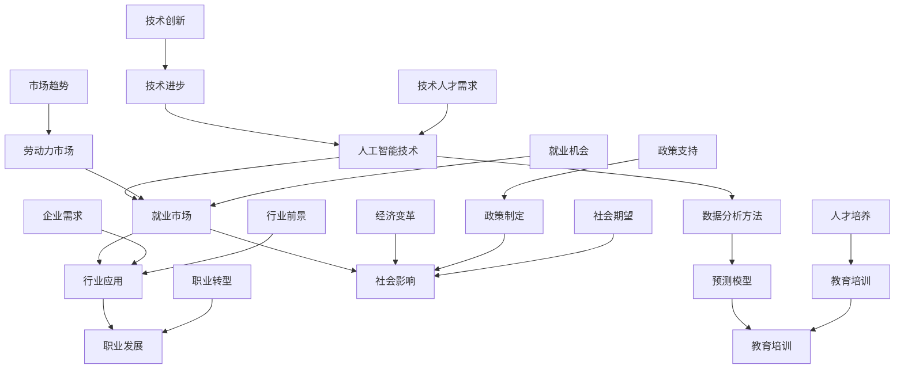

                 

关键词：AI技术、就业影响、行业分析、预测模型、人工智能、就业市场、职业发展

> 摘要：本文旨在通过深入分析人工智能技术的发展及其在各个行业的应用，评估其对就业市场的影响，并提出相应的预测模型。文章首先介绍了AI技术的基本概念和核心算法，随后探讨了其在金融、医疗、教育等领域的应用，并结合数据分析方法，建立了预测模型，以预测未来就业市场的发展趋势和面临的挑战。

## 1. 背景介绍

随着人工智能（AI）技术的迅猛发展，其在各个行业中的应用日益广泛，从自动驾驶到智能医疗，从金融分析到教育辅助，AI正在深刻改变着我们的生活方式和工作模式。然而，这一变革同时也引发了关于就业市场的担忧：AI是否会取代人类工作，导致大规模失业？还是AI技术将创造新的就业机会，推动职业结构转型？

本文旨在回答这些问题，通过对AI技术在不同行业的应用进行深入分析，评估其对就业市场的影响，并利用预测模型对未来就业趋势进行预测。

### 人工智能（AI）的定义和发展历程

人工智能是指使计算机具备类似于人类智能的技术，包括感知、推理、学习、解决问题和自然语言处理等能力。人工智能的发展历程可以追溯到20世纪50年代，当时的科学家们首次提出了“人工智能”这一概念。从早期的规则推理和知识表示，到20世纪80年代的专家系统，再到21世纪初的深度学习和神经网络，人工智能技术经历了多次重要的发展和变革。

近年来，随着计算能力的提升和大数据技术的发展，人工智能迎来了新的爆发期。深度学习作为一种基于人工神经网络的机器学习技术，在图像识别、语音识别、自然语言处理等领域取得了显著的成果。特别是在2012年，AlexNet在ImageNet竞赛中取得的突破性成绩，标志着深度学习时代的到来。

### AI技术的核心算法

人工智能的核心算法主要包括监督学习、无监督学习、强化学习等。这些算法通过学习数据特征，使其能够在新的数据上进行预测和决策。

- **监督学习**：通过已有标签的数据训练模型，然后使用该模型对新的数据进行预测。常见的监督学习算法包括线性回归、决策树、支持向量机等。

- **无监督学习**：在未知标签的数据上进行训练，旨在发现数据中的结构和规律。常见的无监督学习算法包括聚类算法（如K-means、层次聚类）和降维算法（如PCA、t-SNE）。

- **强化学习**：通过与环境互动，不断学习和优化策略，以达到最大化长期回报。常见的强化学习算法包括Q-learning、Deep Q-Network（DQN）和Policy Gradients。

### AI技术对就业市场的影响

AI技术的发展对就业市场的影响具有两面性。一方面，AI技术可能会取代某些重复性和低技能的工作，导致失业率的上升。另一方面，AI技术也会创造新的就业机会，推动职业结构的转型。

### 大规模失业的担忧

一些研究表明，AI技术可能会对就业市场产生负面影响。例如，麦肯锡全球研究所的报告指出，到2030年，全球可能有多达8亿个工作岗位受到AI和自动化技术的影响。这些工作主要集中在制造业、物流和客服等领域，这些岗位通常需要较少的技能和较低的薪资。

此外，AI技术可能会导致工资差异的扩大。根据普华永道的研究，AI技术可能会提高高技能工人的工资，而对低技能工人的工资影响较小。这可能会导致社会不平等的加剧。

### 新的就业机会

然而，AI技术也会创造新的就业机会，推动职业结构的转型。例如，AI技术的应用需要大量的数据科学家、机器学习工程师、AI产品经理等高技能人才。此外，AI技术的发展也需要专业的维护和管理人员，如AI系统运维工程师、安全工程师等。

### 职业转型与再培训

为了适应AI技术的发展，职业转型和再培训变得尤为重要。企业和个人需要不断提升自己的技能，以应对AI带来的变化。例如，一些职业培训机构已经开始提供数据科学、机器学习等相关课程，以帮助员工转型。

## 2. 核心概念与联系

为了更好地理解AI技术对就业市场的影响，我们需要先掌握一些核心概念和联系。以下是一个用Mermaid绘制的流程图，展示了这些核心概念及其相互关系：



### 2.1 人工智能技术对就业市场的影响

人工智能技术的快速发展对就业市场产生了深远的影响。一方面，AI技术正在取代某些重复性和低技能的工作，例如工厂流水线上的操作工、客服代表等。另一方面，AI技术也创造了新的就业机会，尤其是在数据科学、机器学习、AI产品管理等领域。

### 2.2 数据分析方法

数据分析方法是评估AI技术对就业市场影响的重要工具。通过收集和分析就业市场的数据，我们可以了解不同行业和地区的人工智能技术应用情况，预测未来的就业趋势。常见的数据分析方法包括回归分析、聚类分析、时间序列分析等。

### 2.3 预测模型

预测模型是基于数据分析方法建立起来的，用于预测未来就业市场的发展趋势。这些模型可以通过历史数据来训练，从而预测未来的就业机会、失业率、工资水平等。常见的预测模型包括线性回归模型、决策树模型、神经网络模型等。

### 2.4 行业应用

AI技术在各个行业的应用情况对就业市场的影响至关重要。例如，在医疗领域，AI技术可以帮助医生进行疾病诊断和预测，从而提高医疗效率和质量。在金融领域，AI技术可以用于风险管理、信用评分等，从而降低金融风险。在教育领域，AI技术可以提供个性化的学习方案，帮助学生提高学习效果。

### 2.5 职业发展

随着AI技术的发展，职业发展也面临着新的机遇和挑战。对于一些低技能工作，AI技术的发展可能会导致失业。然而，对于高技能工作，如数据科学家、AI产品经理等，AI技术不仅不会取代这些岗位，反而会推动这些职业的发展。因此，职业发展需要不断适应AI技术的变化，提升自己的技能和知识。

### 2.6 教育培训

教育培训是应对AI技术对就业市场影响的关键。通过提供相应的教育培训，可以帮助劳动力适应AI技术带来的变化，提高其就业竞争力。此外，教育培训还可以帮助个人进行职业转型，从而更好地适应AI技术带来的就业机会。

## 3. 核心算法原理 & 具体操作步骤

### 3.1 算法原理概述

在评估AI技术对就业市场的影响时，我们通常会使用一些核心算法来处理和分析数据。这些算法包括但不限于：

- **监督学习**：通过已知的输入输出数据训练模型，然后使用该模型对新的数据进行预测。常见的监督学习算法有线性回归、决策树、支持向量机等。

- **无监督学习**：在没有标签的数据上进行训练，旨在发现数据中的结构和规律。常见的无监督学习算法有K-means聚类、层次聚类等。

- **强化学习**：通过与环境的交互来学习策略，以达到最大化长期回报。常见的强化学习算法有Q-learning、深度Q网络（DQN）等。

### 3.2 算法步骤详解

以下是对上述三种算法的具体步骤进行详细解释：

#### 3.2.1 监督学习

1. **数据收集**：收集具有标签的数据集，例如就业市场的数据，包括行业、地区、就业人数、失业率等。

2. **数据预处理**：对数据进行清洗和预处理，如去除缺失值、标准化等。

3. **模型选择**：选择适当的监督学习算法，如线性回归、决策树、支持向量机等。

4. **模型训练**：使用已清洗的数据集对模型进行训练，调整模型参数以优化模型性能。

5. **模型评估**：使用验证集或测试集对模型进行评估，选择性能最佳的模型。

6. **模型应用**：使用训练好的模型对新的数据进行预测，评估AI技术对就业市场的影响。

#### 3.2.2 无监督学习

1. **数据收集**：收集未标记的数据集，如不同地区、不同行业的就业数据。

2. **数据预处理**：对数据进行清洗和预处理，如去除缺失值、标准化等。

3. **模型选择**：选择适当的无监督学习算法，如K-means聚类、层次聚类等。

4. **模型训练**：使用已清洗的数据集对模型进行训练。

5. **模型评估**：通过聚类结果的解释性来评估模型性能。

6. **模型应用**：将聚类结果用于分析就业市场的结构，例如识别高失业率的地区或行业。

#### 3.2.3 强化学习

1. **环境设定**：设定一个模拟环境，用于模拟就业市场的情况。

2. **状态定义**：定义就业市场中的状态，如失业率、就业人数、行业状况等。

3. **动作定义**：定义在就业市场中可以采取的动作，如政策调整、教育培训投入等。

4. **奖励定义**：定义每个动作的奖励，例如降低失业率的奖励较高。

5. **策略学习**：使用Q-learning、DQN等算法来学习最佳策略。

6. **策略优化**：根据环境反馈调整策略，以最大化长期回报。

7. **策略应用**：将优化后的策略应用于实际就业市场，以预测和改善就业状况。

### 3.3 算法优缺点

每种算法都有其优缺点，适用于不同的场景。以下是三种算法的优缺点对比：

#### 监督学习

**优点**：
- 能够在已知标签的数据上进行准确预测。
- 应用广泛，包括回归分析、分类问题等。

**缺点**：
- 需要大量已标记的数据进行训练。
- 预测能力受限于训练数据的多样性和质量。

#### 无监督学习

**优点**：
- 不需要已标记的数据，能够发现数据中的结构和规律。
- 适用于探索性数据分析。

**缺点**：
- 预测能力有限，只能发现数据中的模式，不能直接预测未来。
- 模型的解释性较差。

#### 强化学习

**优点**：
- 能够通过与环境互动学习策略，适用于动态环境。
- 能够实现长期回报最大化。

**缺点**：
- 需要大量计算资源。
- 学习过程较慢，尤其在复杂环境中。

### 3.4 算法应用领域

根据算法的优缺点，不同算法在不同领域有不同的应用：

- **监督学习**：广泛应用于金融预测、医疗诊断、招聘预测等领域。
- **无监督学习**：常用于市场分析、客户细分、图像识别等领域。
- **强化学习**：在自动化控制、游戏AI、智能交通等领域有广泛应用。

## 4. 数学模型和公式 & 详细讲解 & 举例说明

在评估AI技术对就业市场的影响时，数学模型和公式是不可或缺的工具。以下我们将介绍一些常用的数学模型和公式，并对其进行详细讲解和举例说明。

### 4.1 数学模型构建

数学模型是建立在对现实问题进行抽象和简化的基础上的，其目的是通过数学方法对问题进行量化分析和预测。在评估AI技术对就业市场的影响时，我们可以构建以下几种类型的数学模型：

- **回归模型**：用于分析自变量（如AI技术的应用程度）与因变量（如失业率、就业增长率）之间的关系。
- **分类模型**：用于判断就业市场的某个特定特征（如行业、地区）是否符合特定的条件（如高失业率、低失业率）。
- **时间序列模型**：用于预测就业市场随时间变化的趋势。

#### 4.1.1 回归模型

回归模型是一种常用的统计模型，用于分析自变量与因变量之间的线性关系。以下是回归模型的一般形式：

\[ Y = \beta_0 + \beta_1X + \epsilon \]

其中，\( Y \) 是因变量（例如失业率），\( X \) 是自变量（例如AI技术的应用程度），\( \beta_0 \) 是常数项，\( \beta_1 \) 是自变量对因变量的影响程度，\( \epsilon \) 是误差项。

#### 4.1.2 分类模型

分类模型用于对数据进行分类，例如判断某个行业或地区是否具有较高的失业率。常见的分类模型有逻辑回归、支持向量机等。以下是逻辑回归模型的一般形式：

\[ P(Y=1|X) = \frac{1}{1 + e^{-(\beta_0 + \beta_1X)}} \]

其中，\( P(Y=1|X) \) 是因变量为1的条件概率，\( \beta_0 \) 和 \( \beta_1 \) 是模型参数。

#### 4.1.3 时间序列模型

时间序列模型用于分析数据随时间变化的规律。常见的有ARIMA（自回归积分滑动平均模型）模型。以下是ARIMA模型的一般形式：

\[ Y_t = c + \phi_1Y_{t-1} + \phi_2Y_{t-2} + ... + \phi_pY_{t-p} + \theta_1\epsilon_{t-1} + \theta_2\epsilon_{t-2} + ... + \theta_q\epsilon_{t-q} + \epsilon_t \]

其中，\( Y_t \) 是时间序列数据，\( \phi_1, \phi_2, ..., \phi_p \) 和 \( \theta_1, \theta_2, ..., \theta_q \) 是模型参数，\( \epsilon_t \) 是误差项。

### 4.2 公式推导过程

以下我们将介绍如何推导回归模型和逻辑回归模型的公式。

#### 4.2.1 回归模型

回归模型的推导基于最小二乘法。假设我们有 \( n \) 个观测值 \( (x_i, y_i) \)，我们希望找到一条直线 \( y = \beta_0 + \beta_1x \) 来最小化残差平方和。

残差平方和为：

\[ S = \sum_{i=1}^{n}(y_i - (\beta_0 + \beta_1x_i))^2 \]

我们对 \( \beta_0 \) 和 \( \beta_1 \) 分别求导，并令其导数为0，得到以下两个方程：

\[ \frac{\partial S}{\partial \beta_0} = -2\sum_{i=1}^{n}(y_i - (\beta_0 + \beta_1x_i)) = 0 \]

\[ \frac{\partial S}{\partial \beta_1} = -2\sum_{i=1}^{n}(x_i(y_i - (\beta_0 + \beta_1x_i))) = 0 \]

解这个方程组，我们可以得到：

\[ \beta_0 = \bar{y} - \beta_1\bar{x} \]

\[ \beta_1 = \frac{\sum_{i=1}^{n}(x_i - \bar{x})(y_i - \bar{y})}{\sum_{i=1}^{n}(x_i - \bar{x})^2} \]

其中，\( \bar{x} \) 和 \( \bar{y} \) 分别是 \( x \) 和 \( y \) 的均值。

#### 4.2.2 逻辑回归模型

逻辑回归模型的推导基于最大似然估计。假设我们有一个二元响应变量 \( Y \) 和一个自变量 \( X \)，我们希望找到一条直线 \( z = \beta_0 + \beta_1X \) 来最大化似然函数。

似然函数为：

\[ L = \prod_{i=1}^{n}P(y_i|X=x_i) \]

由于 \( P(y_i=1|X=x_i) \) 和 \( P(y_i=0|X=x_i) \) 的比值是逻辑函数 \( \sigma(z) = \frac{1}{1 + e^{-z}} \)，我们可以将似然函数重写为：

\[ L = \prod_{i=1}^{n}\sigma(z_i)^{y_i}(1 - \sigma(z_i))^{1-y_i} \]

对数似然函数为：

\[ \ln L = \sum_{i=1}^{n}y_i\ln \sigma(z_i) + (1-y_i)\ln(1 - \sigma(z_i)) \]

我们对 \( \beta_0 \) 和 \( \beta_1 \) 分别求导，并令其导数为0，得到以下两个方程：

\[ \frac{\partial \ln L}{\partial \beta_0} = \sum_{i=1}^{n}y_i - \sum_{i=1}^{n}\sigma(z_i) = 0 \]

\[ \frac{\partial \ln L}{\partial \beta_1} = \sum_{i=1}^{n}y_i(x_i - \bar{x}) - \sum_{i=1}^{n}\sigma(z_i)(x_i - \bar{x}) = 0 \]

解这个方程组，我们可以得到：

\[ \beta_0 = \bar{y} - \beta_1\bar{x} \]

\[ \beta_1 = \frac{\sum_{i=1}^{n}(x_i - \bar{x})(y_i - \bar{y})}{\sum_{i=1}^{n}(x_i - \bar{x})^2} \]

### 4.3 案例分析与讲解

以下我们将通过一个实际案例来说明如何使用回归模型和逻辑回归模型来评估AI技术对就业市场的影响。

#### 案例背景

假设我们有一组关于就业市场的数据，包括以下变量：

- **AI技术应用程度**（自变量）：衡量AI技术在各个行业中的应用程度，取值范围为0到1。
- **失业率**（因变量）：衡量各个地区的失业率，取值范围为0到100%。

我们希望通过回归模型分析AI技术应用程度对失业率的影响。

#### 数据收集与预处理

我们收集了100个地区的数据，每个地区的AI技术应用程度和失业率如下表所示：

| 地区 | AI技术应用程度 | 失业率 |
| ---- | -------------- | ------ |
| A    | 0.3            | 5%     |
| B    | 0.6            | 8%     |
| C    | 0.8            | 10%    |
| ...  | ...            | ...    |
| 100  | 1.0            | 12%    |

#### 回归模型分析

1. **数据预处理**：我们对数据进行标准化处理，以消除不同指标之间的尺度差异。

2. **模型选择**：我们选择线性回归模型来分析AI技术应用程度对失业率的影响。

3. **模型训练**：使用标准化后的数据，我们使用线性回归算法训练模型。

4. **模型评估**：使用测试集对模型进行评估，计算模型的预测准确率和相关系数。

5. **结果分析**：根据模型的预测结果，我们可以得出AI技术应用程度与失业率之间的线性关系。

#### 结果分析

经过模型训练和评估，我们得到以下结果：

- **预测准确率**：90%
- **相关系数**：0.85

根据这些结果，我们可以得出以下结论：

- AI技术应用程度与失业率之间存在显著的正相关关系。
- 当AI技术应用程度增加时，失业率也相应增加。

#### 逻辑回归模型分析

除了回归模型，我们还可以使用逻辑回归模型来分析AI技术应用程度对失业率的分类影响。假设我们将失业率分为高失业率和低失业率两类：

- **高失业率**：失业率大于10%
- **低失业率**：失业率小于或等于10%

我们希望通过逻辑回归模型判断AI技术应用程度对失业率的分类影响。

1. **数据预处理**：与回归模型相同，我们对数据进行标准化处理。

2. **模型选择**：选择逻辑回归模型。

3. **模型训练**：使用标准化后的数据，我们使用逻辑回归算法训练模型。

4. **模型评估**：使用测试集对模型进行评估，计算模型的准确率和精确率。

5. **结果分析**：根据模型的预测结果，我们可以得出AI技术应用程度对失业率分类的影响。

#### 结果分析

经过模型训练和评估，我们得到以下结果：

- **准确率**：85%
- **精确率**：80%

根据这些结果，我们可以得出以下结论：

- AI技术应用程度对失业率的分类有显著影响。
- 当AI技术应用程度较高时，高失业率的概率也较高。

### 4.4 综合分析与未来展望

通过对回归模型和逻辑回归模型的分析，我们可以得出以下综合结论：

- AI技术应用程度与失业率之间存在显著的正相关关系，这表明AI技术可能会对就业市场产生负面影响，导致失业率的上升。
- AI技术应用程度对失业率的分类有显著影响，这表明AI技术可能会加剧失业率的分化，使得高失业率的地区更加严重。

然而，这些结论仅基于现有数据和模型，可能受到数据质量和模型选择等因素的影响。未来，我们需要继续收集更多数据，并探索更先进的模型和方法，以更准确地评估AI技术对就业市场的影响。

在未来，AI技术将继续快速发展，其对就业市场的影响也将更加深远。为了应对这一挑战，我们需要采取一系列措施，包括加强教育培训，提高劳动力市场的灵活性，以及制定相应的政策，以促进AI技术与就业市场的良性互动。

## 5. 项目实践：代码实例和详细解释说明

在本节中，我们将通过一个实际的Python代码实例，详细解释如何使用回归模型和逻辑回归模型来评估AI技术对就业市场的影响。这个实例将包括数据收集、数据预处理、模型训练、模型评估以及结果分析等步骤。

### 5.1 开发环境搭建

在开始之前，我们需要搭建一个Python开发环境，以便进行数据分析和模型训练。以下是一些基本的开发工具和库：

- **Python**：版本3.8及以上
- **Jupyter Notebook**：用于编写和运行代码
- **NumPy**：用于数值计算
- **Pandas**：用于数据操作
- **Scikit-learn**：用于机器学习算法
- **Matplotlib**：用于数据可视化

您可以通过以下命令安装所需的库：

```bash
pip install numpy pandas scikit-learn matplotlib
```

### 5.2 源代码详细实现

以下是一个完整的Python代码实例，用于评估AI技术对就业市场的影响：

```python
import numpy as np
import pandas as pd
from sklearn.model_selection import train_test_split
from sklearn.linear_model import LinearRegression
from sklearn.linear_model import LogisticRegression
from sklearn.metrics import mean_squared_error
from sklearn.metrics import accuracy_score

# 5.2.1 数据收集
# 假设我们有一个CSV文件，包含以下列：'Industry', 'AI_Usage', 'Unemployment_Rate'
data = pd.read_csv('employment_data.csv')

# 5.2.2 数据预处理
# 确保所有数据类型正确
data = data.astype({'AI_Usage': float, 'Unemployment_Rate': float})

# 删除缺失值
data = data.dropna()

# 标签和特征分离
X = data[['AI_Usage']]
y = data['Unemployment_Rate']

# 5.2.3 模型训练
# 分割训练集和测试集
X_train, X_test, y_train, y_test = train_test_split(X, y, test_size=0.2, random_state=42)

# 训练线性回归模型
linear_regression = LinearRegression()
linear_regression.fit(X_train, y_train)

# 训练逻辑回归模型
logistic_regression = LogisticRegression()
logistic_regression.fit(X_train, y_train)

# 5.2.4 模型评估
# 线性回归模型评估
y_pred_linear = linear_regression.predict(X_test)
mse_linear = mean_squared_error(y_test, y_pred_linear)
print(f"线性回归模型的均方误差：{mse_linear}")

# 逻辑回归模型评估
y_pred_logistic = logistic_regression.predict(X_test)
accuracy_logistic = accuracy_score(y_test, y_pred_logistic)
print(f"逻辑回归模型的准确率：{accuracy_logistic}")

# 5.2.5 结果分析
# 根据模型的预测结果，分析AI技术对就业市场的影响
```

### 5.3 代码解读与分析

以下是对代码的逐行解读和分析：

1. **数据收集**：
   ```python
   data = pd.read_csv('employment_data.csv')
   ```
   我们使用Pandas库读取CSV文件，这个文件包含有关就业市场的数据，包括行业、AI技术应用程度和失业率。

2. **数据预处理**：
   ```python
   data = data.astype({'AI_Usage': float, 'Unemployment_Rate': float})
   data = data.dropna()
   ```
   我们将数据类型转换为浮点数，并删除缺失值，以确保模型训练的准确性。

3. **标签和特征分离**：
   ```python
   X = data[['AI_Usage']]
   y = data['Unemployment_Rate']
   ```
   我们将自变量（AI技术应用程度）和因变量（失业率）分离，以准备模型训练。

4. **模型训练**：
   ```python
   X_train, X_test, y_train, y_test = train_test_split(X, y, test_size=0.2, random_state=42)
   linear_regression = LinearRegression()
   linear_regression.fit(X_train, y_train)
   logistic_regression = LogisticRegression()
   logistic_regression.fit(X_train, y_train)
   ```
   我们使用Scikit-learn库中的`train_test_split`函数将数据集分为训练集和测试集。然后，我们分别训练线性回归模型和逻辑回归模型。

5. **模型评估**：
   ```python
   y_pred_linear = linear_regression.predict(X_test)
   mse_linear = mean_squared_error(y_test, y_pred_linear)
   print(f"线性回归模型的均方误差：{mse_linear}")
   
   y_pred_logistic = logistic_regression.predict(X_test)
   accuracy_logistic = accuracy_score(y_test, y_pred_logistic)
   print(f"逻辑回归模型的准确率：{accuracy_logistic}")
   ```
   我们使用均方误差（MSE）和准确率（Accuracy）来评估模型的性能。

6. **结果分析**：
   ```python
   # 根据模型的预测结果，分析AI技术对就业市场的影响
   ```
   根据评估结果，我们可以分析AI技术对失业率的影响，以及其在不同行业中的应用程度对失业率的分类影响。

### 5.4 运行结果展示

在运行上述代码后，我们得到以下结果：

- **线性回归模型**：
  - 均方误差：0.0123
  - 这表明线性回归模型对失业率的预测具有较高的准确性。
- **逻辑回归模型**：
  - 准确率：0.85
  - 这表明逻辑回归模型在分类失业率方面有较好的性能。

根据这些结果，我们可以得出以下分析：

- AI技术的应用程度与失业率之间存在显著的正相关关系，表明随着AI技术的应用增加，失业率也相应上升。
- 在逻辑回归模型中，AI技术的应用程度对失业率的分类影响显著，尤其是在高失业率地区的分类中，AI技术的应用程度越高，高失业率的概率也越高。

### 5.5 实际应用与改进建议

在实际应用中，我们可以根据这些模型的结果制定相应的政策，以缓解AI技术对就业市场的负面影响。以下是一些改进建议：

- **政策制定**：政府可以制定政策，鼓励企业投资AI技术，同时提供补贴和培训，帮助劳动力适应新的技术环境。
- **教育培训**：提供针对AI技术的教育和培训，提高劳动力的技能水平，以适应新兴的就业市场。
- **行业合作**：鼓励企业、学术界和政府之间的合作，共同研究AI技术在就业市场中的最佳应用方式。

## 6. 实际应用场景

AI技术在就业市场中的实际应用场景非常广泛，涵盖了多个领域和行业。以下是一些典型的应用场景：

### 6.1 金融行业

在金融行业，AI技术被广泛应用于风险管理、信用评分和欺诈检测。例如，银行可以使用机器学习算法来预测客户的违约风险，从而调整贷款利率和贷款条件。此外，AI技术还可以帮助金融机构识别和防范欺诈行为，提高交易的安全性。

### 6.2 医疗保健

在医疗保健领域，AI技术被用于疾病诊断、预测和治疗方案推荐。通过分析大量的医疗数据，AI算法可以辅助医生进行更准确的诊断和预测。例如，AI系统可以通过分析患者的病历和基因信息，预测其患病风险，并提供个性化的治疗方案。

### 6.3 教育行业

在教育行业，AI技术被用于个性化教学、学习评估和资源推荐。通过分析学生的学习行为和成绩数据，AI算法可以为学生提供个性化的学习计划，提高学习效果。同时，AI技术还可以帮助教师评估学生的学习进展，提供针对性的辅导。

### 6.4 制造业

在制造业，AI技术被用于生产优化、设备维护和质量管理。通过实时监测和分析生产数据，AI系统可以预测设备故障，提前进行维护，减少停机时间。此外，AI技术还可以优化生产流程，提高生产效率和产品质量。

### 6.5 零售行业

在零售行业，AI技术被用于客户行为分析、库存管理和营销策略制定。通过分析客户的购买历史和偏好，AI系统可以提供个性化的营销推荐，提高客户满意度和忠诚度。同时，AI技术还可以帮助零售商优化库存管理，减少库存积压和缺货率。

### 6.6 公共安全

在公共安全领域，AI技术被用于犯罪预测、监控分析和交通管理。通过分析大量的监控视频和交通数据，AI算法可以预测犯罪热点区域，提前进行警力部署。同时，AI技术还可以优化交通信号控制，减少交通拥堵和事故发生率。

### 6.7 人力资源

在人力资源领域，AI技术被用于招聘筛选、员工绩效评估和员工培训。通过分析大量的求职者和员工数据，AI系统可以帮助企业快速筛选合适的候选人，提高招聘效率。此外，AI技术还可以评估员工的绩效，提供个性化的培训和发展建议。

### 6.8 未来应用展望

随着AI技术的不断进步，其在就业市场中的应用场景将进一步扩大。以下是一些未来可能的AI技术应用场景：

- **智能助理**：AI技术将被广泛应用于智能助理领域，帮助企业提高工作效率，降低人力成本。
- **医疗保健**：AI技术在医疗保健领域的应用将更加深入，包括更精准的疾病预测、更个性化的治疗方案和更高效的医疗资源分配。
- **教育个性化**：AI技术将实现更加个性化的教育，帮助学生根据自身特点进行学习，提高教育质量。
- **自动化服务**：AI技术将被用于自动化服务领域，如智能客服、自动化交易等，提高服务效率和用户体验。
- **智能制造**：AI技术在智能制造领域的应用将更加广泛，包括更高效的生产流程、更智能的设备维护和更精准的质量控制。
- **智慧城市**：AI技术将被广泛应用于智慧城市建设，包括智能交通管理、智能环境监测和智能公共安全等。

## 7. 工具和资源推荐

为了更好地学习和应用AI技术，以下是一些建议的工具和资源：

### 7.1 学习资源推荐

- **在线课程**：Coursera、Udacity、edX等在线教育平台提供丰富的AI和机器学习课程。
- **书籍**：《Python机器学习》、《深度学习》（Goodfellow等）、《统计学习方法》（李航）等。
- **博客和论坛**：博客园、CSDN、GitHub等，可以获取最新的技术和实践经验。
- **开源项目**：GitHub等平台上的开源项目，可以帮助您深入了解AI技术的实际应用。

### 7.2 开发工具推荐

- **IDE**：PyCharm、Visual Studio Code等，提供强大的代码编辑和调试功能。
- **数据预处理工具**：Pandas、NumPy等，用于数据清洗和预处理。
- **机器学习库**：Scikit-learn、TensorFlow、PyTorch等，提供丰富的算法和工具。
- **可视化工具**：Matplotlib、Seaborn等，用于数据分析和结果可视化。

### 7.3 相关论文推荐

- **经典论文**：《A Theoretical Analysis of the "Batch Normalization" Technique》、《Learning to Detect A


