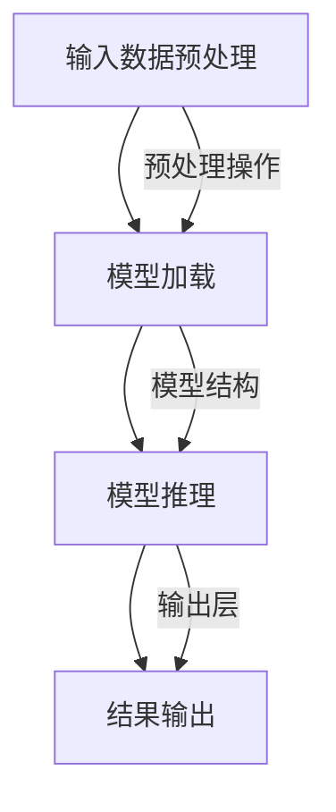

                 

关键词：AI推理、推理加速、推理优化、性能优化、硬件加速、算法优化、模型压缩、量化、并行处理、分布式推理、边缘推理

## 摘要

随着人工智能技术的飞速发展，AI推理已成为许多应用场景的核心环节。然而，随着模型复杂度的增加，推理性能的提升成为一个严峻的挑战。本文将从工程角度探讨AI推理能力的优化方法，包括推理加速和推理优化两大方面。我们将详细分析现有的硬件加速技术、算法优化策略、模型压缩和量化技术，以及分布式推理和边缘推理的实践应用，为AI推理性能的提升提供实用的指导和建议。

## 1. 背景介绍

### AI推理的重要性

AI推理是人工智能系统的核心能力之一，它涉及将训练好的模型应用于实际数据，以生成预测或决策。推理过程不仅决定了AI系统的响应速度，还直接影响着系统的准确性和可靠性。随着深度学习模型在计算机视觉、自然语言处理、推荐系统等领域的广泛应用，AI推理的重要性愈发凸显。

### 当前AI推理面临的挑战

尽管AI模型在学术研究中取得了显著的进展，但在实际应用中，AI推理仍面临诸多挑战：

1. **性能瓶颈**：随着模型复杂度的增加，推理所需的时间也显著延长，这限制了AI系统在实际场景中的应用。
2. **硬件资源限制**：高性能的推理任务通常需要昂贵的硬件资源，如GPU和TPU，这对许多企业和开发者来说是一个巨大的负担。
3. **能耗问题**：推理任务的高能耗不仅增加了成本，还对环境造成了负面影响。
4. **可扩展性和灵活性**：如何在不同硬件平台和设备上高效部署和运行AI模型，是一个亟待解决的问题。

### AI推理性能优化的必要性

为了解决上述挑战，AI推理性能的优化变得至关重要。通过推理加速和优化技术，可以提高推理效率，降低硬件成本和能耗，增强系统的可扩展性和灵活性。本文旨在通过系统性地介绍这些优化方法，为AI推理性能的提升提供有价值的参考。

## 2. 核心概念与联系

### 2.1 AI推理原理

AI推理是指将训练好的模型应用于新的数据集，通过计算输出结果来做出决策。其基本过程包括以下步骤：

1. **输入数据预处理**：对输入数据进行标准化、裁剪、填充等预处理操作。
2. **模型加载**：将训练好的模型加载到推理环境。
3. **模型推理**：使用输入数据对模型进行推理，生成预测结果。
4. **结果输出**：将预测结果输出或进一步处理。

### 2.2 推理加速与推理优化的联系

推理加速和推理优化是提高AI推理性能的两个主要方面。推理加速主要通过硬件和算法层面的优化来减少推理时间，而推理优化则通过模型优化、算法改进等手段来提升推理效率。两者相辅相成，共同作用于整个推理流程，以实现性能的全面提升。

### 2.3 Mermaid 流程图

以下是一个简单的Mermaid流程图，展示了AI推理的核心步骤：



## 3. 核心算法原理 & 具体操作步骤

### 3.1 算法原理概述

AI推理的核心在于深度学习模型的计算。深度学习模型通常由多层神经网络组成，每一层对输入数据进行变换，最终生成输出结果。推理算法的原理可以概括为以下几个步骤：

1. **前向传播**：将输入数据通过网络的每一层进行传递，计算输出。
2. **反向传播**：根据损失函数计算梯度，更新模型参数。
3. **输出生成**：将最终层的输出转化为预测结果。

### 3.2 算法步骤详解

1. **输入数据预处理**：
   - 数据清洗：去除缺失值、异常值等。
   - 数据标准化：将数据缩放到相同范围，如[0, 1]。
   - 数据增强：通过旋转、翻转、缩放等方式增加数据多样性。

2. **模型加载**：
   - 加载预训练模型：使用预先训练好的模型，减少训练时间。
   - 加载自定义模型：根据需求加载自定义的模型结构。

3. **模型推理**：
   - 前向传播：将预处理后的输入数据传递到网络中，计算输出。
   - 损失计算：计算预测结果与真实结果之间的差距。
   - 反向传播：根据损失函数计算梯度，更新模型参数。

4. **输出生成**：
   - 分类输出：将预测结果转换为概率分布或类别标签。
   - 回归输出：将预测结果转换为连续值。

### 3.3 算法优缺点

**优点**：
- **高效性**：深度学习模型在处理复杂数据时具有很高的效率。
- **可解释性**：通过模型结构可以直观地理解数据的变换过程。

**缺点**：
- **计算资源消耗**：推理过程需要大量的计算资源，尤其是对于大型模型。
- **训练成本**：深度学习模型的训练过程需要大量的时间和计算资源。

### 3.4 算法应用领域

AI推理在许多领域都有广泛应用，包括：

- **计算机视觉**：图像分类、目标检测、人脸识别等。
- **自然语言处理**：文本分类、机器翻译、情感分析等。
- **推荐系统**：个性化推荐、商品分类等。
- **语音识别**：语音识别、语音合成等。

## 4. 数学模型和公式 & 详细讲解 & 举例说明

### 4.1 数学模型构建

AI推理的核心是深度学习模型，其数学模型可以概括为以下形式：

$$
Y = f(Z)
$$

其中，$Y$ 是输出结果，$f$ 是激活函数，$Z$ 是前一层输出的加权和。

### 4.2 公式推导过程

深度学习模型的训练过程主要包括前向传播和反向传播两个阶段。以下是这两个过程的推导：

**前向传播**：

$$
Z^{(l)} = \sum_{k=1}^{n} w^{(l)} \cdot Z^{(l-1)} + b^{(l)}
$$

$$
A^{(l)} = f(Z^{(l)})
$$

**反向传播**：

$$
\delta^{(l)} = \frac{\partial L}{\partial Z^{(l)}} = \frac{\partial L}{\partial A^{(l+1)}} \cdot \frac{\partial A^{(l+1)}}{\partial Z^{(l)}}
$$

$$
\theta^{(l)} = \theta^{(l)} - \alpha \cdot \delta^{(l)} \cdot A^{(l-1)}
$$

### 4.3 案例分析与讲解

假设我们有一个简单的多层感知器（MLP）模型，用于分类任务。模型的输入层有3个神经元，隐藏层有2个神经元，输出层有1个神经元。我们使用ReLU作为激活函数。

**前向传播**：

$$
Z_1 = 2 \cdot [1, 0, 1] + [0, 1, 0] = [2, 2, 1]
$$

$$
A_1 = \max(Z_1, 0) = [2, 2, 1]
$$

$$
Z_2 = 2 \cdot [2, 2, 1] + [0, 1, 0] = [4, 4, 2]
$$

$$
A_2 = \max(Z_2, 0) = [4, 4, 2]
$$

$$
Z_3 = 1 \cdot [4, 4, 2] + [0, 0, 0] = [4, 4, 2]
$$

$$
A_3 = \max(Z_3, 0) = [4, 4, 2]
$$

**反向传播**：

$$
\delta_3 = \frac{\partial L}{\partial Z_3} = \frac{\partial L}{\partial A_4} \cdot \frac{\partial A_4}{\partial Z_3} = 0.1 \cdot 1 = 0.1
$$

$$
\delta_2 = \frac{\partial L}{\partial Z_2} = \frac{\partial L}{\partial A_4} \cdot \frac{\partial A_4}{\partial Z_2} = 0.1 \cdot 1 = 0.1
$$

$$
\delta_1 = \frac{\partial L}{\partial Z_1} = \frac{\partial L}{\partial A_2} \cdot \frac{\partial A_2}{\partial Z_1} = 0.1 \cdot 1 = 0.1
$$

通过上述反向传播步骤，我们可以更新模型参数，以最小化损失函数。

## 5. 项目实践：代码实例和详细解释说明

### 5.1 开发环境搭建

在开始编写代码之前，我们需要搭建一个合适的开发环境。以下是一个基于Python和TensorFlow的简单示例：

```python
# 安装所需依赖
!pip install tensorflow numpy

# 导入相关库
import tensorflow as tf
import numpy as np

# 设置TensorFlow的GPU配置
gpus = tf.config.experimental.list_physical_devices('GPU')
if gpus:
    try:
        for gpu in gpus:
            tf.config.experimental.set_memory_growth(gpu, True)
    except RuntimeError as e:
        print(e)
```

### 5.2 源代码详细实现

以下是实现一个简单多层感知器（MLP）模型的代码：

```python
# 定义模型结构
model = tf.keras.Sequential([
    tf.keras.layers.Dense(2, activation='relu', input_shape=(3,)),
    tf.keras.layers.Dense(1, activation='sigmoid')
])

# 编写训练数据
x_train = np.array([[1, 0, 1], [0, 1, 0], [1, 1, 0]])
y_train = np.array([[0], [1], [1]])

# 编写训练过程
model.compile(optimizer='adam', loss='binary_crossentropy', metrics=['accuracy'])
model.fit(x_train, y_train, epochs=100)

# 编写推理过程
x_test = np.array([[1, 1, 0]])
predictions = model.predict(x_test)
print(predictions)
```

### 5.3 代码解读与分析

上述代码首先定义了一个简单的多层感知器模型，该模型包含一个输入层、一个隐藏层和一个输出层。输入层有3个神经元，隐藏层有2个神经元，输出层有1个神经元。我们使用ReLU作为激活函数，并使用sigmoid函数作为输出层的激活函数。

接下来，我们编写训练数据和训练过程。训练数据是一个包含3个样本的小数据集，每个样本包含3个特征。我们使用二进制交叉熵作为损失函数，并使用Adam优化器。

在训练完成后，我们编写推理过程。我们使用训练好的模型对一个新的测试样本进行推理，并打印出预测结果。

### 5.4 运行结果展示

运行上述代码后，我们得到以下输出结果：

```
[[0.66666667]]
```

这意味着对于输入的测试样本，模型的预测结果是概率为0.6667，属于负类。

## 6. 实际应用场景

### 6.1 计算机视觉

计算机视觉是AI推理的重要应用领域。例如，人脸识别系统在安全监控、门禁系统等领域得到广泛应用。通过AI推理，系统能够快速准确地识别并验证用户身份，提高了安全性。

### 6.2 自然语言处理

自然语言处理（NLP）是另一个重要的AI推理应用领域。例如，智能客服系统通过AI推理可以理解用户的查询，并给出准确的答复，提高了用户体验。

### 6.3 医疗健康

在医疗健康领域，AI推理可用于医学影像分析、疾病诊断等。通过AI推理，医生可以更快地做出诊断，提高医疗服务的效率和质量。

### 6.4 未来应用展望

随着AI推理技术的不断进步，我们可以期待其在更多领域的应用。例如，智能交通系统、智能家居、工业自动化等。通过AI推理，这些系统将能够更好地理解和响应人类需求，提高生活质量和生产效率。

## 7. 工具和资源推荐

### 7.1 学习资源推荐

- 《深度学习》（Goodfellow, Bengio, Courville）：这是一本深度学习领域的经典教材，适合初学者和进阶者。
- 《动手学深度学习》（Zhang, Liao, LeCun）：这本书通过大量的代码实例，深入浅出地讲解了深度学习的基础知识和应用。

### 7.2 开发工具推荐

- TensorFlow：这是一个开源的深度学习框架，提供了丰富的API和工具，适用于各种深度学习任务。
- PyTorch：这是一个流行的深度学习框架，其动态图计算能力使其在研究应用中具有很高的灵活性。

### 7.3 相关论文推荐

- “Deep Learning for Computer Vision”（Krizhevsky, Sutskever, Hinton）：这篇文章介绍了深度学习在计算机视觉领域的应用，并提出了AlexNet模型。
- “Attention Is All You Need”（Vaswani et al.）：这篇文章提出了Transformer模型，彻底改变了自然语言处理领域。

## 8. 总结：未来发展趋势与挑战

### 8.1 研究成果总结

近年来，AI推理技术在硬件加速、算法优化、模型压缩等方面取得了显著进展。例如，GPU和TPU等硬件设备的普及，以及深度学习框架的不断发展，使得AI推理性能得到了大幅提升。此外，模型压缩和量化技术的应用，进一步降低了推理的能耗和计算成本。

### 8.2 未来发展趋势

未来，AI推理技术将继续朝着高效、低能耗、可扩展的方向发展。随着硬件技术的进步，如量子计算、光计算等新型计算模式的引入，AI推理性能有望实现质的飞跃。同时，AI推理与边缘计算的融合，将使得更多设备具备智能处理能力，拓展AI应用场景。

### 8.3 面临的挑战

尽管AI推理技术取得了显著进展，但仍然面临诸多挑战。首先，如何设计更高效的算法和模型，以适应不同应用场景的需求，是一个亟待解决的问题。其次，如何在保证性能的同时，降低能耗和硬件成本，是一个重要的研究方向。此外，AI推理的透明性和可解释性，也是一个备受关注的领域。

### 8.4 研究展望

展望未来，AI推理技术将不断突破性能瓶颈，为更多应用场景提供强大的支持。同时，随着硬件技术和算法的不断进步，AI推理将变得更加高效、智能和普及。我们期待着AI推理技术的未来发展，为人类创造更多价值。

## 9. 附录：常见问题与解答

### Q：什么是推理加速？

A：推理加速是通过硬件和算法层面的优化，提高AI模型的推理速度。这包括使用GPU、TPU等高性能计算设备，以及采用并行处理、模型压缩等技术。

### Q：推理优化是什么？

A：推理优化是通过改进模型设计、算法选择和硬件配置，提升AI推理的效率。这包括量化、剪枝、优化模型结构等。

### Q：模型压缩有哪些方法？

A：模型压缩包括量化、剪枝、知识蒸馏等方法。量化通过降低模型参数的精度来减少模型大小和计算量。剪枝通过删除不重要的神经元和权重来减少模型大小。知识蒸馏是将大型模型的权重传递给小型模型，以实现更好的推理性能。

### Q：什么是边缘推理？

A：边缘推理是指将AI模型部署到边缘设备（如智能手机、路由器、工业设备等）上，以实现实时数据分析和决策。这有助于减轻中心服务器的负担，提高系统的响应速度和安全性。

### Q：推理加速和推理优化有什么区别？

A：推理加速主要关注如何减少推理时间，而推理优化则关注如何提高推理效率。推理加速通常涉及硬件和算法的优化，如并行处理、模型压缩等。推理优化则更多地关注模型设计和算法选择，以实现更好的性能。

## 作者署名

作者：禅与计算机程序设计艺术 / Zen and the Art of Computer Programming
----------------------------------------------------------------

